# Animals

[Animals](https://en.wikipedia.org/wiki/Animal) (from the Latin animalis, meaning having breath, having soul or living being) are heterotrophic multicellular eukaryotic organisms with internal digestion that form the biological kingdom Animalia. Animals consume organic material, breathe oxygen, are able to move, can reproduce sexually, and grow from a hollow sphere of cells, the blastula, during embryonic development. Over 1.5 million living animal species have been described—of which around 1 million are insects—but it has been estimated there are over 7 million animal species in total. Animals range in length from 8.5 micrometres (0.00033 in) to 33.6 metres (110 ft). They have complex interactions with each other and their environments, forming intricate food webs. The kingdom Animalia includes humans but in colloquial use the term animal often refers only to non-human animals. The scientific study of animals is known as zoology.

(ref:animdiv) [Diversity of animals.](https://en.wikipedia.org/wiki/File:Animal_diversity.png)

```{r animaldiversity, fig.cap='(ref:animdiv)', echo=FALSE, message=FALSE, warning=FALSE}
knitr::include_graphics("./figures/animals/Animal_diversity.png")
```

Most living animal species are in Bilateria, a clade whose members have a bilaterally symmetric body plan. The Bilateria include the protostomes—in which many groups of invertebrates are found, such as nematodes, arthropods, and molluscs—and the deuterostomes, containing both the echinoderms as well as the chordates, the latter containing the vertebrates. Life forms interpreted as early animals were present in the Ediacaran biota of the late Precambrian. Many modern animal phyla became clearly established in the fossil record as marine species during the Cambrian explosion, which began around 542 million years ago. 6,331 groups of genes common to all living animals have been identified; these may have arisen from a single common ancestor that lived 650 million years ago.

Historically, Aristotle divided animals into those with blood and those without. Carl Linnaeus created the first hierarchical biological classification for animals in 1758 with his Systema Naturae, which Jean-Baptiste Lamarck expanded into 14 phyla by 1809. In 1874, Ernst Haeckel divided the animal kingdom into the multicellular Metazoa (synonymous for Animalia) and the Protozoa, single-celled organisms no longer considered animals. In modern times, the biological classification of animals relies on advanced techniques, such as molecular phylogenetics, which are effective at demonstrating the evolutionary relationships between animal taxa.

Humans make use of many other animal species, such as for food (including meat, milk, and eggs), for materials (such as leather and wool), and also as pets, and for transports, as working animals. Dogs have been used in hunting, while many terrestrial and aquatic animals were hunted for sports. Non-human animals have appeared in art from the earliest times and are featured in mythology and religion.

Animals have several characteristics that set them apart from other living things. Animals are eukaryotic and multicellular, unlike bacteria, which are prokaryotic, and unlike protists, which are eukaryotic but unicellular. Unlike plants and algae, which produce their own nutrients animals are heterotrophic, feeding on organic material and digesting it internally. With very few exceptions, animals respire aerobically. All animals are motile (able to spontaneously move their bodies) during at least part of their life cycle, but some animals, such as sponges, corals, mussels, and barnacles, later become sessile. The blastula is a stage in embryonic development that is unique to most animals, allowing cells to be differentiated into specialised tissues and organs.

(ref:andev) [Animals are unique in having the ball of cells of the early embryo (1) develop into a hollow ball or blastula (2).](https://commons.wikimedia.org/wiki/File:Blastulation.png)

```{r animaldev, fig.cap='(ref:andev)', echo=FALSE, message=FALSE, warning=FALSE}
knitr::include_graphics("./figures/animals/Blastulation.png")
```

All animals are composed of cells, surrounded by a characteristic extracellular matrix composed of collagen and elastic glycoproteins. During development, the animal extracellular matrix forms a relatively flexible framework upon which cells can move about and be reorganised, making the formation of complex structures possible. This may be calcified, forming structures such as shells, bones, and spicules. In contrast, the cells of other multicellular organisms (primarily algae, plants, and fungi) are held in place by cell walls, and so develop by progressive growth. Animal cells uniquely possess the cell junctions called tight junctions, gap junctions, and desmosomes.

With few exceptions—in particular, the sponges and placozoans—animal bodies are differentiated into tissues. These include muscles, which enable locomotion, and nerve tissues, which transmit signals and coordinate the body. Typically, there is also an internal digestive chamber with either one opening (in Ctenophora, Cnidaria, and flatworms) or two openings (in most bilaterians).

Nearly all animals make use of some form of sexual reproduction. They produce haploid gametes by meiosis; the smaller, motile gametes are spermatozoa and the larger, non-motile gametes are ova. These fuse to form zygotes, which develop via mitosis into a hollow sphere, called a blastula. In sponges, blastula larvae swim to a new location, attach to the seabed, and develop into a new sponge. In most other groups, the blastula undergoes more complicated rearrangement. It first invaginates to form a gastrula with a digestive chamber and two separate germ layers, an external ectoderm and an internal endoderm. In most cases, a third germ layer, the mesoderm, also develops between them. These germ layers then differentiate to form tissues and organs.

Repeated instances of mating with a close relative during sexual reproduction generally leads to inbreeding depression within a population due to the increased prevalence of harmful recessive traits. Animals have evolved numerous mechanisms for avoiding close inbreeding.

Some animals are capable of asexual reproduction, which often results in a genetic clone of the parent. This may take place through fragmentation; budding, such as in Hydra and other cnidarians; or parthenogenesis, where fertile eggs are produced without mating, such as in aphids.

Animals are categorised into ecological groups depending on how they obtain or consume organic material, including carnivores, herbivores, omnivores, detritivores, and parasites. Interactions between animals form complex food webs. In carnivorous or omnivorous species, predation is a consumer-resource interaction where a predator feeds on another organism (called its prey). Selective pressures imposed on one another lead to an evolutionary arms race between predator and prey, resulting in various anti-predator adaptations. Almost all multicellular predators are animals. Some consumers use multiple methods; for example, in parasitoid wasps, the larvae feed on the hosts' living tissues, killing them in the process, but the adults primarily consume nectar from flowers. Other animals may have very specific feeding behaviours, such as hawksbill sea turtles primarily eating sponges.

Most animals rely on the biomass and energy produced by plants through photosynthesis. Herbivores eat plant material directly, while carnivores, and other animals on higher trophic levels typically acquire it indirectly by eating other animals. Animals oxidize carbohydrates, lipids, proteins, and other biomolecules to unlock the chemical energy of molecular oxygen, which allows the animal to grow and to sustain biological processes such as locomotion. Animals living close to hydrothermal vents and cold seeps on the dark sea floor consume organic matter of archaea and bacteria produced in these locations through chemosynthesis (by oxidizing inorganic compounds, such as hydrogen sulfide).

Animals originally evolved in the sea. Lineages of arthropods colonised land around the same time as land plants, probably between 510–471 million years ago during the Late Cambrian or Early Ordovician. Vertebrates such as the lobe-finned fish Tiktaalik started to move on to land in the late Devonian, about 375 million years ago. Animals occupy virtually all of earth's habitats and microhabitats, including salt water, hydrothermal vents, fresh water, hot springs, swamps, forests, pastures, deserts, air, and the interiors of animals, plants, fungi and rocks. Animals are however not particularly heat tolerant; very few of them can survive at constant temperatures above 50 °C (122 °F). Only very few species of 
animals (mostly nematodes) inhabit the most extreme cold deserts of continental Antarctica.

(ref:tikta) [Tiktaalik, ≈375 Ma](https://commons.wikimedia.org/wiki/File:Tiktaalik_BW.jpg)

```{r tiktaalik, fig.cap='(ref:tikta)', echo=FALSE, message=FALSE, warning=FALSE}
knitr::include_graphics("./figures/animals/Tiktaalik_BW.jpg")
```

The blue whale (*Balaenoptera musculus*) is the largest animal that has ever lived, weighing up to at least 190 tonnes and measuring up to 33.6 metres (110 ft) long. The largest extant terrestrial animal is the African bush elephant (*Loxodonta africana*), weighing up to 12.25 tonnes and measuring up to 10.67 metres (35.0 ft) long. The largest terrestrial animals that ever lived were titanosaur sauropod dinosaurs such as Argentinosaurus, which may have weighed as much as 73 tonnes. Several animals are microscopic; some Myxozoa (obligate parasites within the Cnidaria) never grow larger than 20 µm, and one of the smallest species (*Myxobolus shekel*) is no more than 8.5 µm when fully grown.

The oldest animals are found in the Ediacaran biota, towards the end of the Precambrian, around 610 million years ago. It had long been doubtful whether these included animals, but the discovery of the animal lipid cholesterol in fossils of Dickinsonia establishes that these were indeed animals. Animals are thought to have originated under low-oxygen conditions, suggesting that they were capable of living entirely by anaerobic respiration, but as they became specialized for aerobic metabolism they became fully dependent on oxygen in their environments.

(ref:edia) [Dickinsonia costata from the Ediacaran biota (c. 635–542 MYA) is one of the earliest animal species known.](https://commons.wikimedia.org/wiki/File:DickinsoniaCostata.jpg)

```{r ediacara, fig.cap='(ref:edia)', echo=FALSE, message=FALSE, warning=FALSE}
knitr::include_graphics("./figures/animals/DickinsoniaCostata.jpg")
```

Many animal phyla first appear in the fossil record during the Cambrian explosion, starting about 542 million years ago, in beds such as the Burgess shale. Extant phyla in these rocks include molluscs, brachiopods, onychophorans, tardigrades, arthropods, echinoderms and hemichordates, along with numerous now-extinct forms such as the predatory Anomalocaris. The apparent suddenness of the event may however be an artefact of the fossil record, rather than showing that all these animals appeared simultaneously.

(ref:anoma) [Anomalocaris canadensis](https://commons.wikimedia.org/wiki/File:Anomalocaris2019.jpg) is one of the many animal species that emerged in the Cambrian explosion, starting some 542 million years ago, and found in the fossil beds of the Burgess shale.

```{r amomalocaris, fig.cap='(ref:anoma)', echo=FALSE, message=FALSE, warning=FALSE}
knitr::include_graphics("./figures/animals/Anomalocaris2019.jpg")
```

Some palaeontologists have suggested that animals appeared much earlier than the Cambrian explosion, possibly as early as 1 billion years ago. Trace fossils such as tracks and burrows found in the Tonian period may indicate the presence of triploblastic worm-like animals, roughly as large (about 5 mm wide) and complex as earthworms. However, similar tracks are produced today by the giant single-celled protist Gromia sphaerica, so the Tonian trace fossils may not indicate early animal evolution. Around the same time, the layered mats of microorganisms called stromatolites decreased in diversity, perhaps due to grazing by newly-evolved animals.

Animals are monophyletic, meaning they are derived from a common ancestor. Animals are sister to the Choanoflagellata, with which they form the Choanozoa. The most basal animals, the Porifera, Ctenophora, Cnidaria, and Placozoa, have body plans that lack bilateral symmetry. Their relationships are still disputed; the sister group to all other animals could be the Porifera or the Ctenophora, both of which lack hox genes, important in body plan development.

(ref:placo) The Placozoa are a basal form of free-living (non-parasitic) multicellular organism. They are the simplest in structure of all animals. Three genera have been found: the classical [Trichoplax adhaerens](https://commons.wikimedia.org/wiki/File:Trichoplax_adhaerens_photograph.png), Hoilungia hongkongensis, and Polyplacotoma mediterranea.

```{r trichoplax, fig.cap='(ref:placo)', echo=FALSE, message=FALSE, warning=FALSE}
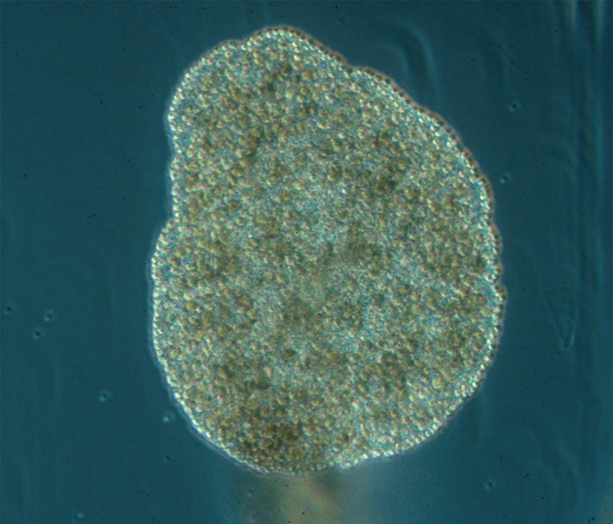
```

```{r animalphyla, out.width='75%', echo=FALSE, message=FALSE, warning=FALSE}
library(tidyverse)
library(printr)        
library(kableExtra)
setwd("~/Dropbox/R/biology-text-master")

animalphy <-  as_tibble(read.csv("data/animal_phyla.csv"))

knitr::kable(animalphy, col.names = c("Phylum", "No. of Species", "Land", "Sea", "Freshwater", "Free-living", "Parasitic"), digits = 2, align = 'lllllll', booktabs = TRUE, caption = "Estimated numbers of described extant species for the animal groups with the largest numbers of species, along with their principal habitats (terrestrial, fresh water, and marine), and free-living or parasitic ways of life.") %>% kable_styling(latex_options = c("striped", "hold_position"))
```

These genes are found in the Placozoa and the higher animals, the Bilateria. 6,331 groups of genes common to all living animals have been identified; these may have arisen from a single common ancestor that lived 650 million years ago in the Precambrian. 25 of these are novel core gene groups, found only in animals; of those, 8 are for essential components of the Wnt and TGF-beta signalling pathways which may have enabled animals to become multicellular by providing a pattern for the body's system of axes (in three dimensions), and another 7 are for transcription factors including homeodomain proteins involved in the control of development.

## Non-bilaterian animals

Several animal phyla lack bilateral symmetry. Among these, the sponges (Porifera) probably diverged first, representing the oldest animal phylum. Sponges lack the complex organization found in most other animal phyla; their cells are differentiated, but in most cases not organised into distinct tissues. They typically feed by drawing in water through pores.

The Ctenophora (comb jellies) and Cnidaria (which includes jellyfish, sea anemones, and corals) are radially symmetric and have digestive chambers with a single opening, which serves as both mouth and anus. Animals in both phyla have distinct tissues, but these are not organised into organs. They are diploblastic, having only two main germ layers, ectoderm and endoderm. The tiny placozoans are similar, but they do not have a permanent digestive chamber.

### Porifera

[Sponges](https://en.wikipedia.org/wiki/Sponge), the members of the phylum Porifera (meaning "pore bearer"), are a basal Metazoa (animal) clade as a sister of the Diploblasts. They are multicellular organisms that have bodies full of pores and channels allowing water to circulate through them, consisting of jelly-like mesohyl sandwiched between two thin layers of cells.

Sponges have unspecialized cells that can transform into other types and that often migrate between the main cell layers and the mesohyl in the process. Sponges do not have nervous, digestive or circulatory systems. Instead, most rely on maintaining a constant water flow through their bodies to obtain food and oxygen and to remove wastes. Sponges were first to branch off the evolutionary tree from the common ancestor of all animals, making them the sister group of all other animals.

(ref:sponges) [Sponge biodiversity and morphotypes at the lip of a wall site in 60 feet (20 m) of water. Included are the yellow tube sponge, Aplysina fistularis, the purple vase sponge, Niphates digitalis, the red encrusting sponge, Spirastrella coccinea [nl], and the gray rope sponge, Callyspongia sp.](https://commons.wikimedia.org/wiki/File:Reef3859_-_Flickr_-_NOAA_Photo_Library.jpg) 

```{r spongediversity, fig.cap='(ref:sponges)', echo=FALSE, message=FALSE, warning=FALSE}
knitr::include_graphics("./figures/animals/Reef3859_-_Flickr_-_NOAA_Photo_Library.jpg")
```

Sponges are similar to other animals in that they are multicellular, heterotrophic, lack cell walls and produce sperm cells. Unlike other animals, they lack true tissues and organs. Some of them are radially symmetrical, but most are asymmetrical. The shapes of their bodies are adapted for maximal efficiency of water flow through the central cavity, where the water deposits nutrients and then leaves through a hole called the osculum. Many sponges have internal skeletons of spongin and/or spicules (skeletal-like fragments) of calcium carbonate or silicon dioxide. All sponges are sessile aquatic animals, meaning that they attach to an underwater surface and remain fixed in place (i.e., do not travel). Although there are freshwater species, the great majority are marine (salt-water) species, ranging in habitat from tidal zones to depths exceeding 8,800 m (5.5 mi).

Although most of the approximately 5,000–10,000 known species of sponges feed on bacteria and other microscopic food in the water, some host photosynthesizing microorganisms as endosymbionts, and these alliances often produce more food and oxygen than they consume. A few species of sponges that live in food-poor environments have evolved as carnivores that prey mainly on small crustaceans.

Most species use sexual reproduction, releasing sperm cells into the water to fertilize ova that in some species are released and in others are retained by the "mother." The fertilized eggs develop into larvae, which swim off in search of places to settle. Sponges are known for regenerating from fragments that are broken off, although this only works if the fragments include the right types of cells. A few species reproduce by budding. When environmental conditions become less hospitable to the sponges, for example as temperatures drop, many freshwater species and a few marine ones produce gemmules, "survival pods" of unspecialized cells that remain dormant until conditions improve; they then either form completely new sponges or recolonize the skeletons of their parents.

In most sponges, an internal gelatinous matrix called mesohyl functions as an endoskeleton, and it is the only skeleton in soft sponges that encrust such hard surfaces as rocks. More commonly, the mesohyl is stiffened by mineral spicules, by spongin fibers, or both. Demosponges use spongin; many species have silica spicules, whereas some species have calcium carbonate exoskeletons. Demosponges constitute about 90% of all known sponge species, including all freshwater ones, and they have the widest range of habitats. Calcareous sponges, which have calcium carbonate spicules and, in some species, calcium carbonate exoskeletons, are restricted to relatively shallow marine waters where production of calcium carbonate is easiest. The fragile glass sponges, with "scaffolding" of silica spicules, are restricted to polar regions and the ocean depths where predators are rare. Fossils of all of these types have been found in rocks dated from 580 million years ago.

The single-celled choanoflagellates resemble the choanocyte cells of sponges which are used to drive their water flow systems and capture most of their food. This along with phylogenetic studies of ribosomal molecules have been used as morphological evidence to suggest sponges are the sister group to the rest of animals. 

The few species of demosponge that have entirely soft fibrous skeletons with no hard elements have been used by humans over thousands of years for several purposes, including as padding and as cleaning tools. By the 1950s, though, these had been overfished so heavily that the industry almost collapsed, and most sponge-like materials are now synthetic. Sponges and their microscopic endosymbionts are now being researched as possible sources of medicines for treating a wide range of diseases. 

Even if a few sponges are able to produce mucus – which acts as a microbial barrier in all other animals – no sponge with the ability to secrete a functional mucus layer has been recorded. Without such a mucus layer their living tissue is covered by a layer of microbial symbionts, which can contribute up to 40–50% of the sponge wet mass.

Like cnidarians (jellyfish, etc.) and ctenophores (comb jellies), and unlike all other known metazoans, sponges' bodies consist of a non-living jelly-like mass (mesoglea) sandwiched between two main layers of cells. Cnidarians and ctenophores have simple nervous systems, and their cell layers are bound by internal connections and by being mounted on a basement membrane (thin fibrous mat, also known as "basal lamina"). Sponges have no nervous systems, their middle jelly-like layers have large and varied populations of cells, and some types of cells in their outer layers may move into the middle layer and change their functions.

A sponge's body is hollow and is held in shape by the mesohyl, a jelly-like substance made mainly of collagen and reinforced by a dense network of fibers also made of collagen. The inner surface is covered with choanocytes, cells with cylindrical or conical collars surrounding one flagellum per choanocyte. The wave-like motion of the whip-like flagella drives water through the sponge's body. All sponges have ostia, channels leading to the interior through the mesohyl, and in most sponges these are controlled by tube-like porocytes that form closable inlet valves. Pinacocytes, plate-like cells, form a single-layered external skin over all other parts of the mesohyl that are not covered by choanocytes, and the pinacocytes also digest food particles that are too large to enter the ostia, while those at the base of the animal are responsible for anchoring it.

Other types of cell live and move within the mesohyl:

* Lophocytes are amoeba-like cells that move slowly through the mesohyl and secrete collagen fibres.
* Collencytes are another type of collagen-producing cell.
* Rhabdiferous cells secrete polysaccharides that also form part of the mesohyl.
* Oocytes and spermatocytes are reproductive cells.
* Sclerocytes secrete the mineralized spicules ("little spines") that form the skeletons of many sponges and in some species provide some defense against predators.
* In addition to or instead of sclerocytes, demosponges have spongocytes that secrete a form of collagen that polymerizes into spongin, a thick fibrous material that stiffens the mesohyl.
* Myocytes ("muscle cells") conduct signals and cause parts of the animal to contract.
* "Grey cells" act as sponges' equivalent of an immune system.
* Archaeocytes (or amoebocytes) are amoeba-like cells that are totipotent, in other words each is capable of transformation into any other type of cell. They also have important roles in feeding and in clearing debris that block the ostia.

Many larval sponges possess neuron-less eyes that are based on cryptochromes. They mediate phototaxic behavior.

Glass sponges present a distinctive variation on this basic plan. Their spicules, which are made of silica, form a scaffolding-like framework between whose rods the living tissue is suspended like a cobweb that contains most of the cell types. This tissue is a syncytium that in some ways behaves like many cells that share a single external membrane, and in others like a single cell with multiple nuclei. The mesohyl is absent or minimal. The syncytium's cytoplasm, the soupy fluid that fills the interiors of cells, is organized into "rivers" that transport nuclei, organelles ("organs" within cells) and other substances. Instead of choanocytes, they have further syncytia, known as choanosyncytia, which form bell-shaped chambers where water enters via perforations. The insides of these chambers are lined with "collar bodies", each consisting of a collar and flagellum but without a nucleus of its own. The motion of the flagella sucks water through passages in the "cobweb" and expels it via the open ends of the bell-shaped chambers.

Some types of cells have a single nucleus and membrane each, but are connected to other single-nucleus cells and to the main syncytium by "bridges" made of cytoplasm. The sclerocytes that build spicules have multiple nuclei, and in glass sponge larvae they are connected to other tissues by cytoplasm bridges; such connections between sclerocytes have not so far been found in adults, but this may simply reflect the difficulty of investigating such small-scale features. The bridges are controlled by "plugged junctions" that apparently permit some substances to pass while blocking others.
Most sponges work rather like chimneys: they take in water at the bottom and eject it from the osculum ("little mouth") at the top. Since ambient currents are faster at the top, the suction effect that they produce by Bernoulli's principle does some of the work for free. Sponges can control the water flow by various combinations of wholly or partially closing the osculum and ostia (the intake pores) and varying the beat of the flagella, and may shut it down if there is a lot of sand or silt in the water.

(ref:spongedia) [Diagram of the structure of a sponge.](https://commons.wikimedia.org/wiki/File:Sea_sponge_diagram.svg) 

```{r spongediagram, fig.cap='(ref:spongedia)', echo=FALSE, message=FALSE, warning=FALSE}
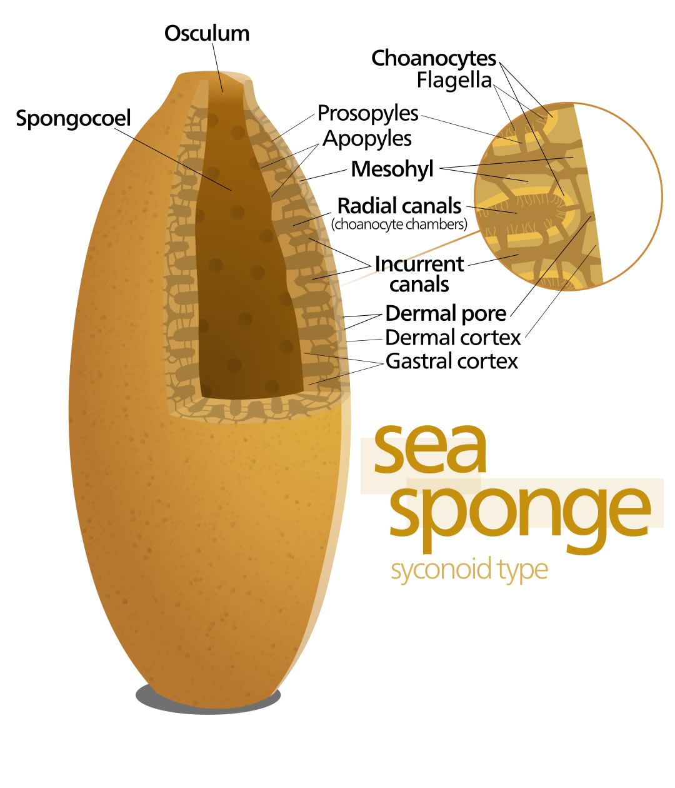
```

Although the layers of pinacocytes and choanocytes resemble the epithelia of more complex animals, they are not bound tightly by cell-to-cell connections or a basal lamina (thin fibrous sheet underneath). The flexibility of these layers and re-modeling of the mesohyl by lophocytes allow the animals to adjust their shapes throughout their lives to take maximum advantage of local water currents.

(ref:choano) [Cells of the protist choanoflagellate clade closely resemble sponge choanocyte cells. Beating of choanocyte flagella draws water through the sponge so that nutrients can be extracted and waste removed.](https://commons.wikimedia.org/wiki/File:Choanoflagellate_and_choanocyte.png) 

```{r choanocomp, fig.cap='(ref:choano)', echo=FALSE, message=FALSE, warning=FALSE}
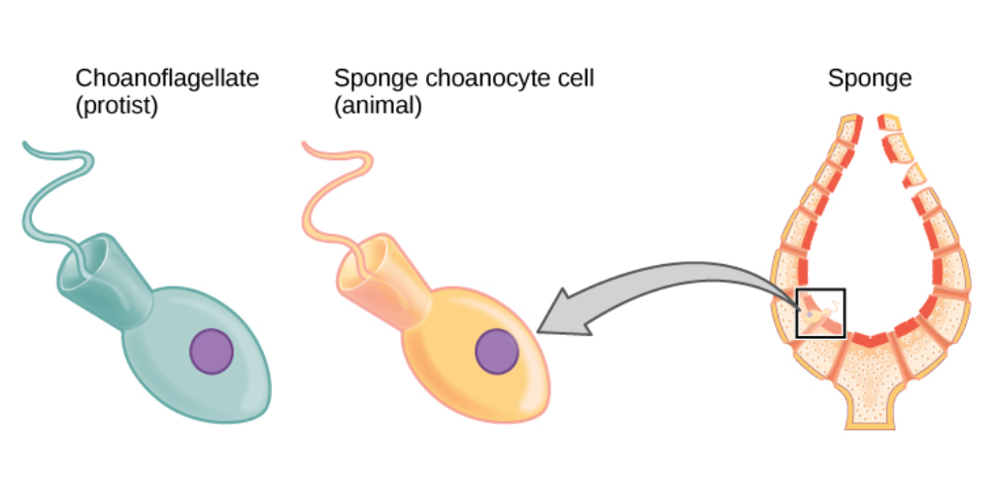
```

The simplest body structure in sponges is a tube or vase shape known as "asconoid", but this severely limits the size of the animal. The body structure is characterized by a stalk-like spongocoel surrounded by a single layer of choanocytes. If it is simply scaled up, the ratio of its volume to surface area increases, because surface increases as the square of length or width while volume increases proportionally to the cube. The amount of tissue that needs food and oxygen is determined by the volume, but the pumping capacity that supplies food and oxygen depends on the area covered by choanocytes. Asconoid sponges seldom exceed 1 mm (0.039 in) in diameter.

Some sponges overcome this limitation by adopting the "syconoid" structure, in which the body wall is pleated. The inner pockets of the pleats are lined with choanocytes, which connect to the outer pockets of the pleats by ostia. This increase in the number of choanocytes and hence in pumping capacity enables syconoid sponges to grow up to a few centimeters in diameter.

The "leuconoid" pattern boosts pumping capacity further by filling the interior almost completely with mesohyl that contains a network of chambers lined with choanocytes and connected to each other and to the water intakes and outlet by tubes. Leuconid sponges grow to over 1 m (3.3 ft) in diameter, and the fact that growth in any direction increases the number of choanocyte chambers enables them to take a wider range of forms, for example "encrusting" sponges whose shapes follow those of the surfaces to which they attach. All freshwater and most shallow-water marine sponges have leuconid bodies. The networks of water passages in glass sponges are similar to the leuconid structure. In all three types of structure the cross-section area of the choanocyte-lined regions is much greater than that of the intake and outlet channels. This makes the flow slower near the choanocytes and thus makes it easier for them to trap food particles. For example, in Leuconia, a small leuconoid sponge about 10 centimetres (3.9 in) tall and 1 centimetre (0.39 in) in diameter, water enters each of more than 80,000 intake canals at 6 cm per minute. However, because Leuconia has more than 2 million flagellated chambers whose combined diameter is much greater than that of the canals, water flow through chambers slows to 3.6 cm per hour, making it easy for choanocytes to capture food. All the water is expelled through a single osculum at about 8.5 cm per second, fast enough to carry waste products some distance away

The mesohyl functions as an endoskeleton in most sponges, and is the only skeleton in soft sponges that encrust hard surfaces such as rocks. More commonly the mesohyl is stiffened by mineral spicules, by spongin fibers or both. Spicules, which are present in most but not all species, may be made of silica or calcium carbonate, and vary in shape from simple rods to three-dimensional "stars" with up to six rays. Spicules are produced by sclerocyte cells, and may be separate, connected by joints, or fused.

Some sponges also secrete exoskeletons that lie completely outside their organic components. For example, sclerosponges ("hard sponges") have massive calcium carbonate exoskeletons over which the organic matter forms a thin layer with choanocyte chambers in pits in the mineral. These exoskeletons are secreted by the pinacocytes that form the animals' skins.

Although adult sponges are fundamentally sessile animals, some marine and freshwater species can move across the sea bed at speeds of 1–4 mm (0.039–0.157 in) per day, as a result of amoeba-like movements of pinacocytes and other cells. A few species can contract their whole bodies, and many can close their oscula and ostia. Juveniles drift or swim freely, while adults are stationary.

Sponges do not have distinct circulatory, respiratory, digestive, and excretory systems – instead the water flow system supports all these functions. They filter food particles out of the water flowing through them. Particles larger than 50 micrometers cannot enter the ostia and pinacocytes consume them by phagocytosis (engulfing and internal digestion). Particles from 0.5 μm to 50 μm are trapped in the ostia, which taper from the outer to inner ends. These particles are consumed by pinacocytes or by archaeocytes which partially extrude themselves through the walls of the ostia. Bacteria-sized particles, below 0.5 micrometers, pass through the ostia and are caught and consumed by choanocytes. Since the smallest particles are by far the most common, choanocytes typically capture 80% of a sponge's food supply. Archaeocytes transport food packaged in vesicles from cells that directly digest food to those that do not. At least one species of sponge has internal fibers that function as tracks for use by nutrient-carrying archaeocytes, and these tracks also move inert objects.

Sponges' cells absorb oxygen by diffusion from water into cells as water flows through body, into which carbon dioxide and other soluble waste products such as ammonia also diffuse. Archeocytes remove mineral particles that threaten to block the ostia, transport them through the mesohyl and generally dump them into the outgoing water current, although some species incorporate them into their skeletons.

Sponges have three asexual methods of reproduction: after fragmentation; by budding; and by producing gemmules. Fragments of sponges may be detached by currents or waves. They use the mobility of their pinacocytes and choanocytes and reshaping of the mesohyl to re-attach themselves to a suitable surface and then rebuild themselves as small but functional sponges over the course of several days. The same capabilities enable sponges that have been squeezed through a fine cloth to regenerate. A sponge fragment can only regenerate if it contains both collencytes to produce mesohyl and archeocytes to produce all the other cell types. A very few species reproduce by budding.

Gemmules are "survival pods" which a few marine sponges and many freshwater species produce by the thousands when dying and which some, mainly freshwater species, regularly produce in autumn. Spongocytes make gemmules by wrapping shells of spongin, often reinforced with spicules, round clusters of archeocytes that are full of nutrients. Freshwater gemmules may also include phytosynthesizing symbionts. The gemmules then become dormant, and in this state can survive cold, drying out, lack of oxygen and extreme variations in salinity. Freshwater gemmules often do not revive until the temperature drops, stays cold for a few months and then reaches a near-"normal" level. When a gemmule germinates, the archeocytes round the outside of the cluster transform into pinacocytes, a membrane over a pore in the shell bursts, the cluster of cells slowly emerges, and most of the remaining archeocytes transform into other cell types needed to make a functioning sponge. Gemmules from the same species but different individuals can join forces to form one sponge. Some gemmules are retained within the parent sponge, and in spring it can be difficult to tell whether an old sponge has revived or been "recolonized" by its own gemmules.

Most sponges are hermaphrodites (function as both sexes simultaneously), although sponges have no gonads (reproductive organs). Sperm are produced by choanocytes or entire choanocyte chambers that sink into the mesohyl and form spermatic cysts while eggs are formed by transformation of archeocytes, or of choanocytes in some species. Each egg generally acquires a yolk by consuming "nurse cells". During spawning, sperm burst out of their cysts and are expelled via the osculum. If they contact another sponge of the same species, the water flow carries them to choanocytes that engulf them but, instead of digesting them, metamorphose to an ameboid form and carry the sperm through the mesohyl to eggs, which in most cases engulf the carrier and its cargo.

A few species release fertilized eggs into the water, but most retain the eggs until they hatch. There are four types of larvae, but all are balls of cells with an outer layer of cells whose flagellae or cilia enable the larvae to move. After swimming for a few days the larvae sink and crawl until they find a place to settle. Most of the cells transform into archeocytes and then into the types appropriate for their locations in a miniature adult sponge.

Glass sponge embryos start by dividing into separate cells, but once 32 cells have formed they rapidly transform into larvae that externally are ovoid with a band of cilia round the middle that they use for movement, but internally have the typical glass sponge structure of spicules with a cobweb-like main syncitium draped around and between them and choanosyncytia with multiple collar bodies in the center. The larvae then leave their parents' bodies.

Sponges in temperate regions live for at most a few years, but some tropical species and perhaps some deep-ocean ones may live for 200 years or more. Some calcified demosponges grow by only 0.2 mm (0.0079 in) per year and, if that rate is constant, specimens 1 m (3.3 ft) wide must be about 5,000 years old. Some sponges start sexual reproduction when only a few weeks old, while others wait until they are several years old.

Adult sponges lack neurons or any other kind of nervous tissue. However, most species have the ability to perform movements that are coordinated all over their bodies, mainly contractions of the pinacocytes, squeezing the water channels and thus expelling excess sediment and other substances that may cause blockages. Some species can contract the osculum independently of the rest of the body. Sponges may also contract in order to reduce the area that is vulnerable to attack by predators. In cases where two sponges are fused, for example if there is a large but still unseparated bud, these contraction waves slowly become coordinated in both of the "Siamese twins". The coordinating mechanism is unknown, but may involve chemicals similar to neurotransmitters. However, glass sponges rapidly transmit electrical impulses through all parts of the syncytium, and use this to halt the motion of their flagella if the incoming water contains toxins or excessive sediment. Myocytes are thought to be responsible for closing the osculum and for transmitting signals between different parts of the body.

Sponges contain genes very similar to those that contain the "recipe" for the post-synaptic density, an important signal-receiving structure in the neurons of all other animals. However, in sponges these genes are only activated in "flask cells" that appear only in larvae and may provide some sensory capability while the larvae are swimming. This raises questions about whether flask cells represent the predecessors of true neurons or are evidence that sponges' ancestors had true neurons but lost them as they adapted to a sessile lifestyle.

Sponges are worldwide in their distribution, living in a wide range of ocean habitats, from the polar regions to the tropics. Most live in quiet, clear waters, because sediment stirred up by waves or currents would block their pores, making it difficult for them to feed and breathe. The greatest numbers of sponges are usually found on firm surfaces such as rocks, but some sponges can attach themselves to soft sediment by means of a root-like base.

Sponges are more abundant but less diverse in temperate waters than in tropical waters, possibly because organisms that prey on sponges are more abundant in tropical waters. Glass sponges are the most common in polar waters and in the depths of temperate and tropical seas, as their very porous construction enables them to extract food from these resource-poor waters with the minimum of effort. Demosponges and calcareous sponges are abundant and diverse in shallower non-polar waters


```{r porifera, out.width='75%', echo=FALSE, message=FALSE, warning=FALSE}
library(tidyverse)
library(printr)        
library(kableExtra)
setwd("~/Dropbox/R/biology-text-master")

sponges <-  as_tibble(read.csv("data/porifera.csv"))

knitr::kable(sponges, col.names = c("", "Type of cells", "Spicules", "Spongin fibers", "Massive exoskeleton", "Body form"), digits = 2, align = 'llllll', booktabs = TRUE, caption = "Comparison of 4 classes of sponges.") %>% kable_styling(latex_options = c("striped", "hold_position")) 
```

### Ctenophora

[Ctenophora](https://en.wikipedia.org/wiki/Ctenophora) (from Ancient Greek: κτείς, romanized: kteis, lit. 'comb' and φέρω, pherō, 'to carry'; commonly known as comb jellies) comprise a phylum of invertebrate animals that live in marine waters worldwide. They are notable for the groups of cilia they use for swimming (commonly referred to as "combs"), and they are the largest animals to swim with the help of cilia. Depending on the species, adult ctenophores range from a few millimeters to 1.5 m (4 ft 11 in) in size. Only 100 to 150 species have been validated, and possibly another 25 have not been fully described and named. The textbook examples are cydippids with egg-shaped bodies and a pair of retractable tentacles fringed with tentilla ("little tentacles") that are covered with colloblasts, sticky cells that capture prey. Their bodies consist of a mass of jelly, with a layer two cells thick on the outside, and another lining the internal cavity. The phylum has a wide range of body forms, including the egg-shaped cydippids with retractable tentacles that capture prey, the flat generally combless platyctenids, and the large-mouthed beroids, which prey on other ctenophores.

(ref:cteno) [Pelagic (open ocean) ctenophores (a) Beroe ovata, (b) Euplokamis sp., (c) Nepheloctena sp., (d) Bathocyroe fosteri, (e) Mnemiopsis leidyi, and (f) Ocyropsis sp.](https://commons.wikimedia.org/wiki/File:Pelagic_ctenophores.png) 

```{r ctenophora, fig.cap='(ref:cteno)', echo=FALSE, message=FALSE, warning=FALSE}
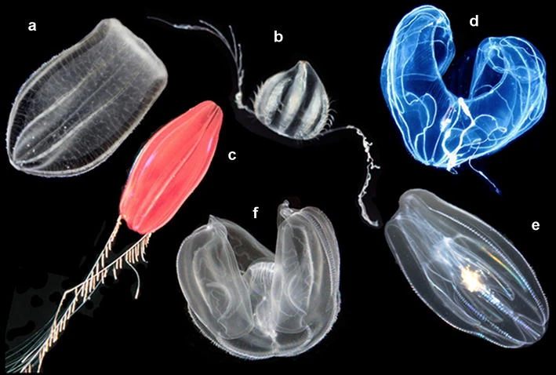
```

Almost all ctenophores function as predators, taking prey ranging from microscopic larvae and rotifers to the adults of small crustaceans; the exceptions are juveniles of two species, which live as parasites on the salps on which adults of their species feed.

Despite their soft, gelatinous bodies, fossils thought to represent ctenophores appear in lagerstätten dating as far back as the early Cambrian, about 525 million years ago. The position of the ctenophores in the "tree of life" has long been debated in molecular phylogenetics studies. Biologists proposed that ctenophores constitute the second-earliest branching animal lineage, with sponges being the sister-group to all other multicellular animals. Other biologists once believed that ctenophores were emerging earlier than the sponges, which themselves appeared before the split between cnidarians and bilaterians. However reanalysis of the data showed that the computer algorithms used for analysis were misled by the presence of specific ctenophore genes that were markedly different from those of other species. Molecular phylogenetics studies indicate that the common ancestor of modern ctenophores was cydippid-like, descending from various cydippids after the Cretaceous–Paleogene extinction event 66 million years ago.

Among animal phyla, the Ctenophores are more complex than sponges, about as complex as cnidarians (jellyfish, sea anemones, etc.), and less complex than bilaterians (which include almost all other animals). Unlike sponges, both ctenophores and cnidarians have: cells bound by inter-cell connections and carpet-like basement membranes; muscles; nervous systems; and some have sensory organs. Ctenophores are distinguished from all other animals by having colloblasts, which are sticky and adhere to prey, although a few ctenophore species lack them.

Like sponges and cnidarians, ctenophores have two main layers of cells that sandwich a middle layer of jelly-like material, which is called the mesoglea in cnidarians and ctenophores; more complex animals have three main cell layers and no intermediate jelly-like layer. Hence ctenophores and cnidarians have traditionally been labelled diploblastic, along with sponges. Both ctenophores and cnidarians have a type of muscle that, in more complex animals, arises from the middle cell layer, and as a result some recent text books classify ctenophores as triploblastic, while others still regard them as diploblastic. The comb jellies have more than 80 different cell types, exceeding the numbers from other groups like placozoans, sponges, cnidarians, and some deep-branching bilaterians.

Ranging from about 1 millimeter (0.039 in) to 1.5 meters (4.9 ft) in size, ctenophores are the largest non-colonial animals that use cilia ("hairs") as their main method of locomotion. Most species have eight strips, called comb rows, that run the length of their bodies and bear comb-like bands of cilia, called "ctenes", stacked along the comb rows so that when the cilia beat, those of each comb touch the comb below. 

The phylogenetic relationship of ctenophores to the rest of Metazoa is very important to our understanding of the early evolution of animals and the origin of multicellularity. It has been the focus of debate for many years. Ctenophores have been purported to be the sister lineage to the Bilateria, sister to the Cnidaria, sister to Cnidaria, Placozoa, and Bilateria, and sister to all other animals.

A series of studies that looked at the presence and absence of members of gene families and signalling pathways (e.g., homeoboxes, nuclear receptors, the Wnt signaling pathway, and sodium channels) showed evidence congruent with the latter two scenarios, that ctenophores are either sister to Cnidaria, Placozoa, and Bilateria or sister to all other animal phyla.     Several more recent studies comparing complete sequenced genomes of ctenophores with other sequenced animal genomes have also supported ctenophores as the sister lineage to all other animals. This position would suggest that neural and muscle cell types either were lost in major animal lineages (e.g., Porifera and Placozoa) or evolved independently in the ctenophore lineage.

Other researchers have argued that the placement of Ctenophora as sister to all other animals is a statistical anomaly caused by the high rate of evolution in ctenophore genomes, and that Porifera (sponges) is the earliest-diverging animal taxon instead. As such, the Ctenophora appear to be a basal diploblast clade. In agreement with the latter point, the analysis of a very large sequence alignment at the metazoan taxonomic scale (1,719 proteins totalizing ca. 400,000 amino acid positions) showed that ctenophores emerge as the second-earliest branching animal lineage, and sponges are sister-group to all other multicellular animals. Also, research on mucin genes, which allow an animal to produce mucus, shows that sponges have never had them while all other animals, including comb jellies, appear to share genes with a common origin.

### Cnidaria

[Cnidaria](https://en.wikipedia.org/wiki/Cnidaria) is a phylum under kingdom Animalia containing over 11,000 species of aquatic animals found both in freshwater and marine environments: they are predominantly marine.

Their distinguishing feature is cnidocytes, specialized cells that they use mainly for capturing prey. Their bodies consist of mesoglea, a non-living jelly-like substance, sandwiched between two layers of epithelium that are mostly one cell thick.

They have two basic body forms: swimming medusae and sessile polyps, both of which are radially symmetrical with mouths surrounded by tentacles that bear cnidocytes. Both forms have a single orifice and body cavity that are used for digestion and respiration. Many cnidarian species produce colonies that are single organisms composed of medusa-like or polyp-like zooids, or both (hence they are trimorphic). Cnidarians' activities are coordinated by a decentralized nerve net and simple receptors. Several free-swimming species of Cubozoa and Scyphozoa possess balance-sensing statocysts, and some have simple eyes. Not all cnidarians reproduce sexually, with many species having complex life cycles of asexual polyp stages and sexual medusae. Some, however, omit either the polyp or the medusa stage.

Cnidarians are classified into four main groups: the almost wholly sessile Anthozoa (sea anemones, corals, sea pens); swimming Scyphozoa (jellyfish); Cubozoa (box jellies); and Hydrozoa (a diverse group that includes all the freshwater cnidarians as well as many marine forms, and has both sessile members, such as Hydra, and colonial swimmers, such as the Portuguese Man o' War). Staurozoa have recently been recognised as a class in their own right rather than a sub-group of Scyphozoa, and the parasitic Myxozoa and Polypodiozoa were firmly recognized as cnidarians in 2007.

```{r cnidariaclasses, out.width='75%', echo=FALSE, message=FALSE, warning=FALSE}
library(tidyverse)
library(printr)        
library(kableExtra)
setwd("~/Dropbox/R/biology-text-master")

jellyfish <-  as_tibble(read.csv("data/cnidaria.csv"))

knitr::kable(jellyfish, col.names = c("", "Hydrozoa", "Scyphozoa", "Cubozoa", "Anthozoa", "Myxozoa"), digits = 2, align = 'llllll', booktabs = TRUE, caption = "Comparison of 4 classes of cnidaria.") %>% kable_styling(latex_options = c("striped", "hold_position"))
```

Most cnidarians prey on organisms ranging in size from plankton to animals several times larger than themselves, but many obtain much of their nutrition from dinoflagellates, and a few are parasites. Many are preyed on by other animals including starfish, sea slugs, fish, turtles, and even other cnidarians. Many scleractinian corals—which form the structural foundation for coral reefs—possess polyps that are filled with symbiotic photo-synthetic zooxanthellae. While reef-forming corals are almost entirely restricted to warm and shallow marine waters, other cnidarians can be found at great depths, in polar regions, and in freshwater.

Recent phylogenetic analyses support monophyly of cnidarians, as well as the position of cnidarians as the sister group of bilaterians. Fossil cnidarians have been found in rocks formed about 580 million years ago, and other fossils show that corals may have been present shortly before 490 million years ago and diversified a few million years later. However, molecular clock analysis of mitochondrial genes suggests a much older age for the crown group of cnidarians, estimated around 741 million years ago, almost 200 million years before the Cambrian period as well as any fossils.

(ref:cnida) [Four examples of Cnidaria:](https://commons.wikimedia.org/wiki/File:Cnidaria.png) A jellyfish Chrysaora melanaster,  a gorgonian Annella mollis, a rocky coral Acropora cervicornis, and a sea anemone Nemanthus annamensis.

```{r cnidaria, fig.cap='(ref:cnida)', echo=FALSE, message=FALSE, warning=FALSE}
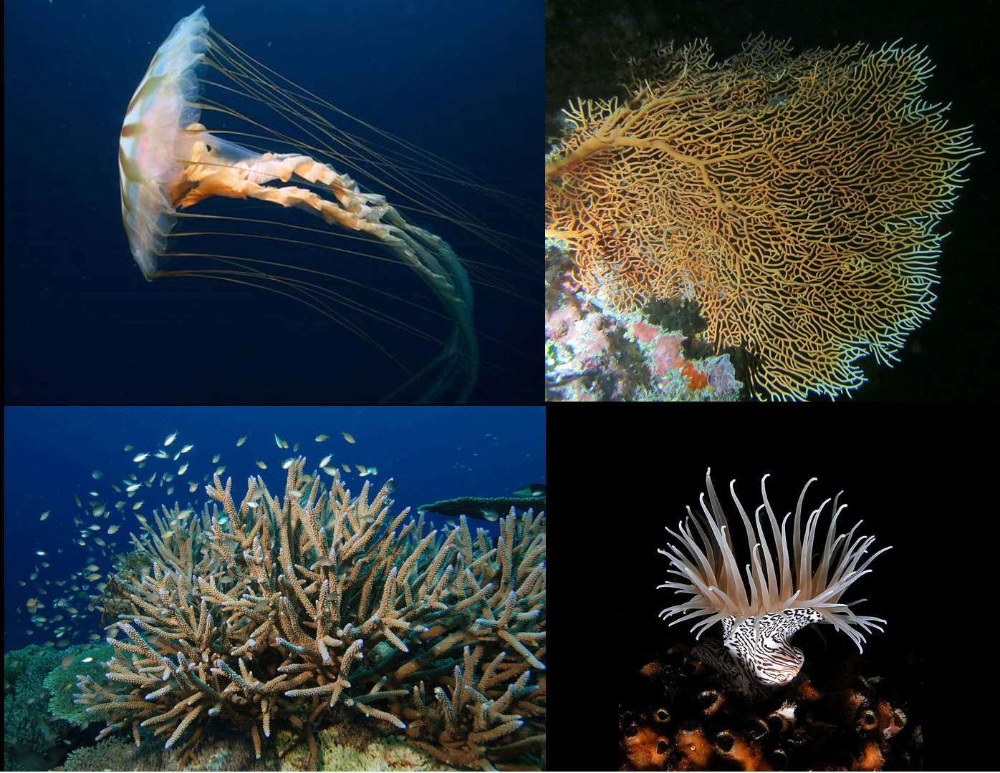
```

Cnidarians form a phylum of animal that are more complex than sponges, about as complex as ctenophores (comb jellies), and less complex than bilaterians, which include almost all other animals. Both cnidarians and ctenophores are more complex than sponges as they have: cells bound by inter-cell connections and carpet-like basement membranes; muscles; nervous systems; and some have sensory organs. Cnidarians are distinguished from all other animals by having cnidocytes that fire harpoon like structures and are usually used mainly to capture prey. In some species, cnidocytes can also be used as anchors. Cnidarians are also distinguished by the fact that they have only one opening in their body for ingestion and excretion i.e. they don't have a separate mouth and anus.

Like sponges and ctenophores, cnidarians have two main layers of cells that sandwich a middle layer of jelly-like material, which is called the mesoglea in cnidarians; more complex animals have three main cell layers and no intermediate jelly-like layer. Hence, cnidarians and ctenophores have traditionally been labelled diploblastic, along with sponges. However, both cnidarians and ctenophores have a type of muscle that, in more complex animals, arises from the middle cell layer. As a result, some recent text books classify ctenophores as triploblastic, and it has been suggested that cnidarians evolved from triploblastic ancestors.

Most adult cnidarians appear as either free-swimming medusae or sessile polyps, and many hydrozoans species are known to alternate between the two forms.

Both are radially symmetrical, like a wheel and a tube respectively. Since these animals have no heads, their ends are described as "oral" (nearest the mouth) and "aboral" (furthest from the mouth).

Most have fringes of tentacles equipped with cnidocytes around their edges, and medusae generally have an inner ring of tentacles around the mouth. Some hydroids may consist of colonies of zooids that serve different purposes, such as defense, reproduction and catching prey. The mesoglea of polyps is usually thin and often soft, but that of medusae is usually thick and springy, so that it returns to its original shape after muscles around the edge have contracted to squeeze water out, enabling medusae to swim by a sort of jet propulsion.

Cnidaria are diploblastic animals; in other words, they have two main cell layers, while more complex animals are triploblasts having three main layers. The two main cell layers of cnidarians form epithelia that are mostly one cell thick, and are attached to a fibrous basement membrane, which they secrete. They also secrete the jelly-like mesoglea that separates the layers. The layer that faces outwards, known as the ectoderm ("outside skin"), generally contains the following types of cells:

* Epitheliomuscular cells whose bodies form part of the epithelium but whose bases extend to form muscle fibers in parallel rows. The fibers of the outward-facing cell layer generally run at right angles to the fibers of the inward-facing one. In Anthozoa (anemones, corals, etc.) and Scyphozoa (jellyfish), the mesoglea also contains some muscle cells.
* Cnidocytes, the harpoon-like "nettle cells" that give the phylum Cnidaria its name. These appear between or sometimes on top of the muscle cells.
* Nerve cells. Sensory cells appear between or sometimes on top of the muscle cells, and communicate via synapses (gaps across which chemical signals flow) with motor nerve cells, which lie mostly between the bases of the muscle cells. Some form a simple nerve net.
* Interstitial cells, which are unspecialized and can replace lost or damaged cells by transforming into the appropriate types. These are found between the bases of muscle cells.

In addition to epitheliomuscular, nerve and interstitial cells, the inward-facing gastroderm ("stomach skin") contains gland cells that secrete digestive enzymes. In some species it also contains low concentrations of cnidocytes, which are used to subdue prey that is still struggling.

The mesoglea contains small numbers of amoeba-like cells, and muscle cells in some species. However, the number of middle-layer cells and types are much lower than in sponges.

Medusae swim by a form of jet propulsion: muscles, especially inside the rim of the bell, squeeze water out of the cavity inside the bell, and the springiness of the mesoglea powers the recovery stroke. Since the tissue layers are very thin, they provide too little power to swim against currents and just enough to control movement within currents.

Hydras and some sea anemones can move slowly over rocks and sea or stream beds by various means: creeping like snails, crawling like inchworms, or by somersaulting. A few can swim clumsily by waggling their bases.

Cnidarians are generally thought to have no brains or even central nervous systems. However, they do have integrative areas of neural tissue that could be considered some form of centralization. Most of their bodies are innervated by decentralized nerve nets that control their swimming musculature and connect with sensory structures, though each clade has slightly different structures. These sensory structures, usually called rhopalia, can generate signals in response to various types of stimuli such as light, pressure, and much more. Medusa usually have several of them around the margin of the bell that work together to control the motor nerve net, that directly innervates the swimming muscles. Most Cnidarians also have a parallel system. In scyphozoans, this takes the form of a diffuse nerve net, which has modulatory effects on the nervous system. As well as forming the "signal cables" between sensory neurons and motoneurons, intermediate neurons in the nerve net can also form ganglia that act as local coordination centers. Communication between nerve cells can occur by chemical synapses or gap junctions in hydrozoans, though gap junctions are not present in all groups. Cnidarians have many of the same neurotransmitters as many animals, including chemicals such as glutamate, GABA, and acetylcholine.

This structure ensures that the musculature is excited rapidly and simultaneously, and can be directly stimulated from any point on the body, and it also is better able to recover after injury.

Medusae and complex swimming colonies such as siphonophores and chondrophores sense tilt and acceleration by means of statocysts, chambers lined with hairs which detect the movements of internal mineral grains called statoliths. If the body tilts in the wrong direction, the animal rights itself by increasing the strength of the swimming movements on the side that is too low. Most species have ocelli ("simple eyes"), which can detect sources of light. However, the agile box jellyfish are unique among Medusae because they possess four kinds of true eyes that have retinas, corneas and lenses. Although the eyes probably do not form images, Cubozoa can clearly distinguish the direction from which light is coming as well as negotiate around solid-colored objects.

Cnidarians feed in several ways: predation, absorbing dissolved organic chemicals, filtering food particles out of the water, obtaining nutrients from symbiotic algae within their cells, and parasitism. Most obtain the majority of their food from predation but some, including the corals Hetroxenia and Leptogorgia, depend almost completely on their endosymbionts and on absorbing dissolved nutrients. Cnidaria give their symbiotic algae carbon dioxide, some nutrients, a place in the sun and protection against predators.

Predatory species use their cnidocytes to poison or entangle prey, and those with venomous nematocysts may start digestion by injecting digestive enzymes. The "smell" of fluids from wounded prey makes the tentacles fold inwards and wipe the prey off into the mouth. In medusae the tentacles round the edge of the bell are often short and most of the prey capture is done by "oral arms", which are extensions of the edge of the mouth and are often frilled and sometimes branched to increase their surface area. Medusae often trap prey or suspended food particles by swimming upwards, spreading their tentacles and oral arms and then sinking. In species for which suspended food particles are important, the tentacles and oral arms often have rows of cilia whose beating creates currents that flow towards the mouth, and some produce nets of mucus to trap particles. Their digestion is both intra and extracellular.

Once the food is in the digestive cavity, gland cells in the gastroderm release enzymes that reduce the prey to slurry, usually within a few hours. This circulates through the digestive cavity and, in colonial cnidarians, through the connecting tunnels, so that gastroderm cells can absorb the nutrients. Absorption may take a few hours, and digestion within the cells may take a few days. The circulation of nutrients is driven by water currents produced by cilia in the gastroderm or by muscular movements or both, so that nutrients reach all parts of the digestive cavity. Nutrients reach the outer cell layer by diffusion or, for animals or zooids such as medusae which have thick mesogleas, are transported by mobile cells in the mesoglea.

Indigestible remains of prey are expelled through the mouth. The main waste product of cells' internal processes is ammonia, which is removed by the external and internal water currents.

There are no respiratory organs, and both cell layers absorb oxygen from and expel carbon dioxide into the surrounding water. When the water in the digestive cavity becomes stale it must be replaced, and nutrients that have not been absorbed will be expelled with it. Some Anthozoa have ciliated grooves on their tentacles, allowing them to pump water out of and into the digestive cavity without opening the mouth. This improves respiration after feeding and allows these animals, which use the cavity as a hydrostatic skeleton, to control the water pressure in the cavity without expelling undigested food.

Cnidaria that carry photosynthetic symbionts may have the opposite problem, an excess of oxygen, which may prove toxic. The animals produce large quantities of antioxidants to neutralize the excess oxygen.

Cnidarian sexual reproduction often involves a complex life cycle with both polyp and medusa stages. For example, in Scyphozoa (jellyfish) and Cubozoa (box jellies) a larva swims until it finds a good site, and then becomes a polyp. This grows normally but then absorbs its tentacles and splits horizontally into a series of disks that become juvenile medusae, a process called strobilation. The juveniles swim off and slowly grow to maturity, while the polyp re-grows and may continue strobilating periodically. The adults have gonads in the gastroderm, and these release ova and sperm into the water in the breeding season.

This phenomenon of succession of differently organized generations (one asexually reproducing, sessile polyp, followed by a free-swimming medusa or a sessile polyp that reproduces sexually) is sometimes called "alternation of asexual and sexual phases" or "metagenesis", but should not be confused with the alternation of generations as found in plants.

Spawning is generally driven by environmental factors such as changes in the water temperature, and their release is triggered by lighting conditions such as sunrise, sunset or the phase of the moon. Many species of Cnidaria may spawn simultaneously in the same location, so that there are too many ova and sperm for predators to eat more than a tiny percentage — one famous example is the Great Barrier Reef, where at least 110 corals and a few non-cnidarian invertebrates produce enough gametes to turn the water cloudy. These mass spawnings may produce hybrids, some of which can settle and form polyps, but it is not known how long these can survive. In some species the ova release chemicals that attract sperm of the same species.

The fertilized eggs develop into larvae by dividing until there are enough cells to form a hollow sphere (blastula) and then a depression forms at one end (gastrulation) and eventually becomes the digestive cavity. However, in cnidarians the depression forms at the end further from the yolk (at the animal pole), while in bilaterians it forms at the other end (vegetal pole). The larvae, called planulae, swim or crawl by means of cilia. They are cigar-shaped but slightly broader at the "front" end, which is the aboral, vegetal-pole end and eventually attaches to a substrate if the species has a polyp stage.

Anthozoan larvae either have large yolks or are capable of feeding on plankton, and some already have endosymbiotic algae that help to feed them. Since the parents are immobile, these feeding capabilities extend the larvae's range and avoid overcrowding of sites. Scyphozoan and hydrozoan larvae have little yolk and most lack endosymbiotic algae, and therefore have to settle quickly and metamorphose into polyps. Instead, these species rely on their medusae to extend their ranges.

## Bilaterian animals

The remaining animals, the great majority—comprising some 29 phyla and over a million species—form a clade, the Bilateria. The body is triploblastic, with three well-developed germ layers, and their tissues form distinct organs. The digestive chamber has two openings, a mouth and an anus, and there is an internal body cavity, a coelom or pseudocoelom. Animals with this bilaterally symmetric body plan and a tendency to move in one direction have a head end (anterior) and a tail end (posterior) as well as a back (dorsal) and a belly (ventral); therefore they also have a left side and a right side.

(ref:bilat) [Diversity of bilaterians.](https://commons.wikimedia.org/wiki/File:Animal_diversity_October_2007.jpg) 

```{r bilateriandiversity, fig.cap='(ref:bilat)', echo=FALSE, message=FALSE, warning=FALSE}
knitr::include_graphics("./figures/animals/Animal_diversity_October_2007.jpg")
```

Having a front end means that this part of the body encounters stimuli, such as food, favouring cephalisation, the development of a head with sense organs and a mouth. Many bilaterians have a combination of circular muscles that constrict the body, making it longer, and an opposing set of longitudinal muscles, that shorten the body; these enable soft-bodied animals with a hydrostatic skeleton to move by peristalsis. They also have a gut that extends through the basically cylindrical body from mouth to anus. Many bilaterian phyla have primary larvae which swim with cilia and have an apical organ containing sensory cells. However, there are exceptions to each of these characteristics; for example, adult echinoderms are radially symmetric (unlike their larvae), while some parasitic worms have extremely simplified body structures.

(ref:bibod) [Idealised bilaterian body plan.](https://commons.wikimedia.org/wiki/File:Bilaterian_body_plan.svg) With an elongated body and a direction of movement the animal has head and tail ends. Sense organs and mouth form the basis of the head. Opposed circular and longitudinal muscles enable peristaltic motion.

```{r bilaterianbodyplan, fig.cap='(ref:bibod)', echo=FALSE, message=FALSE, warning=FALSE}
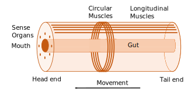
```

Genetic studies have considerably changed zoologists' understanding of the relationships within the Bilateria. Most appear to belong to two major lineages, the protostomes and the deuterostomes that together form the Nephrozoa. Their sister clade are the Xenacoelomorpha, the basalmost bilaterian phylum of small and very simple animals. All xenacoelomorphs lack a typical stomatogastric system, i.e., they do not have a true gut and lack an excretory system, circulatory and respiratory system. The nervous system is a simple nerve net without a brain. 


(ref:xena) [*Xenoturbella japonica*, a xenacoelomorph member (xenoturbellids).](https://commons.wikimedia.org/wiki/File:Xenoturbella_japonica.jpg) 

```{r xenacoelomorpha, fig.cap='(ref:xena)', echo=FALSE, message=FALSE, warning=FALSE}
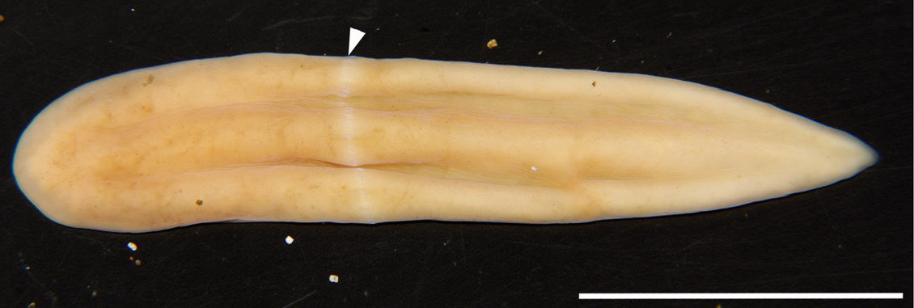
```

```{r anicomparison, out.width='75%', echo=FALSE, message=FALSE, warning=FALSE}
library(tidyverse)
library(printr)        
library(kableExtra)
setwd("~/Dropbox/R/biology-text-master")

animalcomp <-  as_tibble(read.csv("data/animal_comparison.csv"))

knitr::kable(animalcomp, col.names = c("","Sponges","Cnidarians","Ctenophores","Bilateria"), digits = 2, align = 'lll', booktabs = TRUE, caption = "Comparison of major characteristics of porifera, cnidaria, ctenophora and bilateria.") %>% kable_styling(latex_options = c("striped", "hold_position")) 
```

### Protostomes and deuterostomes

Protostomes and deuterostomes differ in several ways. Early in development, deuterostome embryos undergo radial cleavage during cell division, while many protostomes (the Spiralia) undergo spiral cleavage. Animals from both groups possess a complete digestive tract, but in protostomes the first opening of the embryonic gut develops into the mouth, and the anus forms secondarily. In deuterostomes, the anus forms first while the mouth develops secondarily. Most protostomes have schizocoelous development, where cells simply fill in the interior of the gastrula to form the mesoderm. In deuterostomes, the mesoderm forms by enterocoelic pouching, through invagination of the endoderm.

(ref:prodeu) [The bilaterian gut develops in two ways. In many protostomes, the blastopore develops into the mouth, while in deuterostomes it becomes the anus.](https://commons.wikimedia.org/wiki/File:Protovsdeuterostomes.svg)

```{r protovsdeutero, fig.cap='(ref:prodeu)', echo=FALSE, message=FALSE, warning=FALSE}
knitr::include_graphics("./figures/animals/Protovsdeuterostomes.svg")
```

The main deuterostome phyla are the Echinodermata and the Chordata. Echinoderms are exclusively marine and include starfish, sea urchins, and sea cucumbers. The chordates are dominated by the vertebrates (animals with backbones), which consist of fishes, amphibians, reptiles, birds, and mammals. The deuterostomes also include the Hemichordata (acorn worms).

### Echinoderms

[Echinoderm](https://en.wikipedia.org/wiki/Echinoderm) is the common name given to any member of the phylum Echinodermata (from Ancient Greek, ἐχῖνος, echinos – "hedgehog" and δέρμα, derma – "skin") of marine animals. The adults are recognizable by their (usually five-point) radial symmetry, and include starfish, sea urchins, sand dollars, and sea cucumbers, as well as the sea lilies or "stone lilies". Echinoderms are found at every ocean depth, from the intertidal zone to the abyssal zone. The phylum contains about 7000 living species, making it the second-largest grouping of deuterostomes (a superphylum), after the chordates (which include the vertebrates, such as birds, fishes, mammals, and reptiles). Echinoderms are also the largest phylum that has no freshwater or terrestrial (land-based) representatives.

(ref:seacucu) [A sea cucumber from Malaysia.](https://commons.wikimedia.org/wiki/File:Sea_cucumber_at_Pulau_Redang.jpg) 

```{r seacucumber, fig.cap='(ref:seacucu)', echo=FALSE, message=FALSE, warning=FALSE}
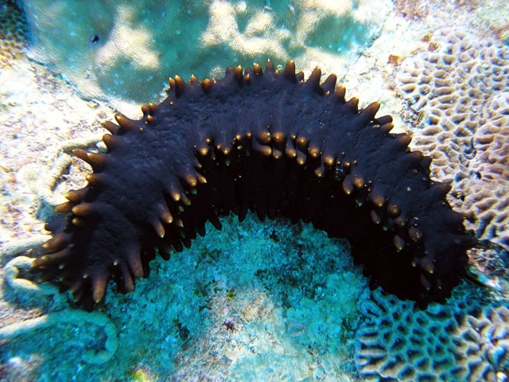
```

Aside from the hard-to-classify Arkarua (a Precambrian animal with echinoderm-like pentamerous radial symmetry), the first definitive members of the phylum appeared near the start of the Cambrian. One group of Cambrian echinoderms, the cinctans (Homalozoa), which are close to the base of the echinoderm origin, have been found to possess external gills used for filter feeding, similar to those possessed by chordates and hemichordates.

The echinoderms are important both ecologically and geologically. Ecologically, there are few other groupings so abundant in the biotic desert of the deep sea, as well as shallower oceans. Most echinoderms are able to reproduce asexually and regenerate tissue, organs, and limbs; in some cases, they can undergo complete regeneration from a single limb. Geologically, the value of echinoderms is in their ossified skeletons, which are major contributors to many limestone formations, and can provide valuable clues as to the geological environment. They were the most used species in regenerative research in the 19th and 20th centuries. Further, some scientists hold that the radiation of echinoderms was responsible for the Mesozoic Marine Revolution.

(ref:starfi) [Starfish exhibit a wide range of colours.](https://commons.wikimedia.org/wiki/File:Nerr0878.jpg) 

```{r starfish, fig.cap='(ref:starfi)', echo=FALSE, message=FALSE, warning=FALSE}
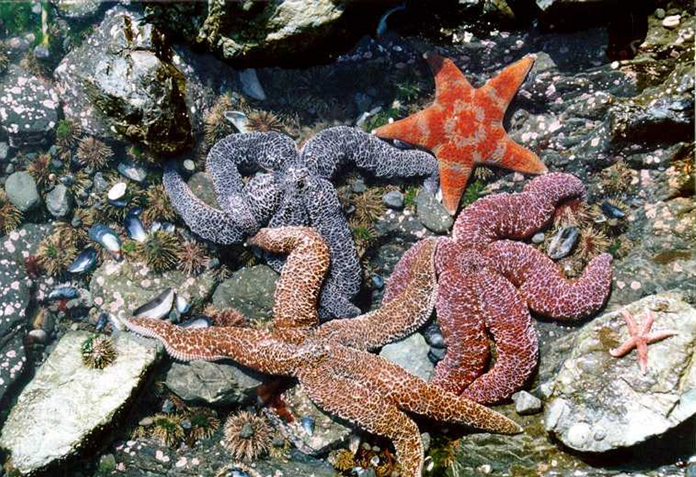
```

Along with the chordates and hemichordates, echinoderms are deuterostomes, one of the two major divisions of the bilaterians, the other being the protostomes. During the early development of the embryo, in deuterostomes, the blastopore (the first opening to form) becomes the anus whereas in the protostomes, it becomes the mouth. In deuterostomes, the mouth develops at a later stage, at the opposite end of the blastula from the blastopore, and a gut forms connecting the two. The larvae of echinoderms have bilateral symmetry but this is lost during metamorphosis when their bodies are reorganised and develop the characteristic radial symmetry of the echinoderm, typically pentamerism. The characteristics of adult echinoderms are the possession of a water vascular system with external tube feet and a calcareous endoskeleton consisting of ossicles connected by a mesh of collagen fibres. A 2014 analysis of 219 genes from all classes of echinoderms gives the following phylogenetic tree.

There are a total of about 7,000 extant species of echinoderm as well as about 13,000 extinct species. They are found in habitats ranging from shallow intertidal areas to abyssal depths. Two main subdivisions are traditionally recognised: the more familiar motile Eleutherozoa, which encompasses the Asteroidea (starfish, 1,745 recent species), Ophiuroidea (brittle stars, 2,300 species), Echinoidea (sea urchins and sand dollars, 900 species) and Holothuroidea (sea cucumbers, 1,430 species); and the Pelmatozoa, some of which are sessile while others move around. These consist of the Crinoidea (feather stars and sea lilies, 580 species) and the extinct blastoids and Paracrinoids. A fifth class of Eleutherozoa consisting of just three species, the Concentricycloidea (sea daisies), were recently merged into the Asteroidea

(ref:seaurch) [Strongylocentrotus purpuratus, a well-armoured sea urchin.](https://commons.wikimedia.org/wiki/File:Strongylocentrotus_purpuratus_1.jpg) 

```{r seaurchin, fig.cap='(ref:seaurch)', echo=FALSE, message=FALSE, warning=FALSE}
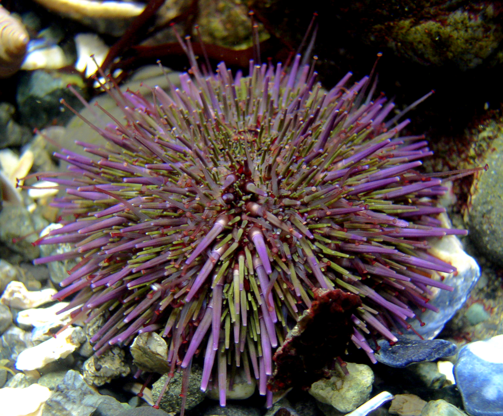
```

Echinoderms evolved from animals with bilateral symmetry. Although adult echinoderms possess pentaradial, or five-sided, symmetry, echinoderm larvae are ciliated, free-swimming organisms that organize in bilateral symmetry which makes them look like embryonic chordates. Later, the left side of the body grows at the expense of the right side, which is eventually absorbed. The left side then grows in a pentaradially symmetric fashion, in which the body is arranged in five parts around a central axis. Within the Asterozoa, there can be a few exceptions from the rule. The starfish genus Leptasterias normally have six arms, although five-armed individuals can occur. Also the Brisingida have six armed species. Amongst the brittle stars, six-armed species such as Ophiothela danae, Ophiactis savignyi, and Ophionotus hexactis exists, and Ophiacantha vivipara often has more than six.

Echinoderms exhibit secondary radial symmetry in portions of their body at some stage of life. This, however, is an adaptation to their sessile existence. They developed from other members of the Bilateria and exhibit bilateral symmetry in their larval stage. Many crinoids and some seastars exhibit symmetry in multiples of the basic five, with starfish such as Labidiaster annulatus known to possess up to fifty arms, and the sea-lily Comaster schlegelii having two hundred.

Echinoderms have a mesodermal skeleton composed of calcareous plates or ossicles. Each one of these, even the articulating spine of a sea urchin, is composed mineralogically of a crystal of calcite. If solid, these would form a heavy skeleton, so they have a sponge-like porous structure known as stereom. Ossicles may be fused together, as in the test of sea urchins, or may articulate with each other as in the arms of sea stars, brittle stars and crinoids. The ossicles may be flat plates or bear external projections in the form of spines, granules or warts and they are supported by a tough epidermis (skin). Skeletal elements are also deployed in some specialized ways, such as the "Aristotle's lantern" mouthparts of sea urchins used for grinding, the supportive stalks of crinoids and the structural "lime ring" of sea cucumbers.

Despite the robustness of the individual skeletal modules complete skeletons of starfish, brittle stars and crinoids are rare in the fossil record. This is because they quickly disarticulate (disconnect from each other) once the encompassing skin rots away, and in the absence of tissue there is nothing to hold the plates together. The modular construction is a result of the growth system employed by echinoderms, which adds new segments at the centre of the radial limbs, pushing the existing plates outwards and lengthening the arms. Sea urchins on the other hand are often well preserved in chalk beds or limestone. During fossilization, the cavities in the stereom are filled in with calcite that is in crystalline continuity with the surrounding material. On fracturing such rock, distinctive cleavage patterns can be seen and sometimes even the intricate internal and external structure of the test.

The epidermis consists of cells responsible for the support and maintenance of the skeleton, as well as pigment cells, mechanoreceptor cells (which detect motion on the animal's surface), and sometimes gland cells which secrete sticky fluids or even toxins. The varied and often vivid colours of echinoderms are produced by the action of skin pigment cells. These are produced by a variable combination of coloured pigments, such as the dark melanin, red carotinoids, and carotene proteins, which can be blue, green, or violet. These may be light-sensitive, and as a result many echinoderms change appearance completely as night falls. The reaction can happen quickly – the sea urchin Centrostephanus longispinus changes from jet black to grey-brown in just fifty minutes when exposed to light.

One characteristic of most echinoderms is a special kind of tissue known as "catch connective tissue". This collagenous material can change its mechanical properties in a few seconds or minutes through nervous control rather than by muscular means. This tissue enables a starfish to change from moving flexibly around the seabed to becoming rigid while prying open a bivalve mollusc or preventing itself from being extracted from a crevice. Similarly, sea urchins can lock their normally mobile spines rigidly as a defensive mechanism when attacked.

Echinoderms possess a unique water vascular system. This is a network of fluid-filled canals derived from the coelom (body cavity) that function in gas exchange, feeding, sensory reception and locomotion. This system varies between different classes of echinoderm but typically opens to the exterior through a sieve-like madreporite on the aboral (upper) surface of the animal. The madreporite is linked to a slender duct, the stone canal, which extends to a ring canal that encircles the mouth or oesophagus. From this, radial canals extend along the arms of asteroids and adjoin the test in the ambulacral areas of echinoids. Short lateral canals branch off the radial canals, each one ending in an ampulla. Part of the ampulla can protrude through a pore (or a pair of pores in sea urchins) to the exterior and is known as a podium or tube feet. The water vascular system assists with the distribution of nutrients throughout the animal's body and is most obviously expressed in the tube feet which can be extended or contracted by the redistribution of fluid between the foot and the internal sac.

The organization of the system is somewhat different in ophiuroids where the madreporite may be on the oral surface and the podia lack suckers. In holothuroids, the podia may be reduced or absent and the madreporite opens into the body cavity so that the circulating liquid is coelomic fluid rather than sea water. The arrangements in crinoids is similar to asteroids but the tube feet lack suckers and are used to pass food particles captured by the arms towards the central mouth. In the asteroids, the same wafting motion is employed to move the animal across the ground. Sea urchins use their feet to prevent the larvae of encrusting organisms from settling on their surfaces; potential settlers are moved to the urchin's mouth and eaten. Some burrowing sea stars extend their elongated dorsal tube feet to the surface of the sand or mud above and use them to absorb oxygen from the water column.

Echinoderms possess a simple digestive system which varies according to the animal's diet. Starfish are mostly carnivorous and have a mouth, oesophagus, two-part stomach, intestine and rectum, with the anus located in the centre of the aboral body surface. With a few exceptions, the members of the order Paxillosida do not possess an anus. In many species of starfish, the large cardiac stomach can be everted and digest food outside the body. In other species, whole food items such as molluscs may be ingested. Brittle stars have a blind gut with no intestine or anus. They have varying diets and expel food waste through their mouth. Sea urchins are herbivores and use their specialised mouthparts to graze, tear and chew algae and sometimes other animal or vegetable material. They have an oesophagus, a large stomach and a rectum with the anus at the apex of the test. Sea cucumbers are mostly detritivores, sorting through the sediment with their buccal tentacles which are modified tube feet. Sand and mud accompanies their food through their simple gut which has a long coiled intestine and a capacious cloaca. Crinoids are passive suspension feeders, catching plankton with their outstretched arms. Boluses of mucus-trapped food are passed to the mouth which is linked to the anus by a loop consisting of a short oesophagus and longer intestine.

The coelomic cavities of echinoderms are complex. Aside from the water vascular system, echinoderms have a haemal coelom (or haemal system, the "haemal" being a misnomer), a perivisceral coelom, a gonadal coelom and often also a perihaemal coelom (or perihaemal system). During development, echinoderm coelom is divided in metacoel, mesocoel and protocoel (also called somatocoel, hydrocoel and axocoel, respectively). The water vascular system, haemal system and perihaemal system form the tubular coelomic system. Echinoderms are an exception having both a coelomic circulatory system (i.e., the water vascular system) and a haemal circulatory system (i.e., the haemal and perihaemal systems).

Haemal and perihaemal systems are derived from the coelom and form an open and reduced circulatory system. This usually consists of a central ring and five radial vessels. There is no true heart and the blood often lacks any respiratory pigment. Gaseous exchange occurs via dermal branchiae or papulae in starfish, genital bursae in brittle stars, peristominal gills in sea urchins and cloacal trees in sea cucumbers. Exchange of gases also takes place through the tube feet. Echinoderms lack specialized excretory (waste disposal) organs and so nitrogenous waste, chiefly in the form of ammonia, diffuses out through the respiratory surfaces.

The coelomic fluid contains the coelomocytes, or immune cells. There are several types of immune cells, which vary among classes and species. All classes possess a type of phagocytic amebocyte, which engulf invading particles and infected cells, aggregate or clot, and may be involved in cytotoxicity. These cells are usually larger and granular, and are suggested to be a main line of defense against potential pathogens. Depending on the class, echinoderms may have spherule cells (for cytotoxicity, inflammation, and anti-bacterial activity), vibratile cells (for coelomic fluid movement and clotting), and crystal cells (potential osmoregulatory cells in sea cucumbers),. The coelomocytes also secrete Anti-Microbial Peptides (AMPs) against bacteria, and have a set of lectins and complement proteins as part of an innate immune system that is still being characterized.

Echinoderms have a simple radial nervous system that consists of a modified nerve net consisting of interconnecting neurons with no central brain, although some do possess ganglia. Nerves radiate from central rings around the mouth into each arm or along the body wall; the branches of these nerves coordinate the movements of the organism and the synchronisation of the tube feet. Starfish have sensory cells in the epithelium and have simple eyespots and touch-sensitive tentacle-like tube feet at the tips of their arms. Sea urchins have no particular sense organs but do have statocysts that assist in gravitational orientation, and they have sensory cells in their epidermis, particularly in the tube feet, spines and pedicellariae. Brittle stars, crinoids and sea cucumbers in general do not have sensory organs but some burrowing sea cucumbers of the order Apodida have a single statocyst adjoining each radial nerve and some have an eyespot at the base of each tentacle.

The gonads occupy much of the body cavities of sea urchins and sea cucumbers, while the less voluminous crinoids, brittle stars and starfish have two gonads in each arm. While the ancestral condition is considered to be the possession of one genital aperture, many organisms have multiple gonopores through which eggs or sperm may be released.

Many echinoderms have remarkable powers of regeneration. Many species routinely autotomize and regenerate arms and viscera. Sea cucumbers often discharge parts of their internal organs if they perceive themselves to be threatened. The discharged organs and tissues are regenerated over the course of several months. Sea urchins are constantly replacing spines lost through damage. Sea stars and sea lilies readily lose and regenerate their arms. In most cases, a single severed arm cannot grow into a new starfish in the absence of at least part of the disc. However, in a few species a single arm can survive and develop into a complete individual and in some species, the arms are intentionally detached for the purpose of asexual reproduction. During periods when they have lost their digestive tracts, sea cucumbers live off stored nutrients and absorb dissolved organic matter directly from the water.

Echinoderms become sexually mature after approximately two to three years, depending on the species and the environmental conditions. They are nearly all gonochoric, though a few species are hermaphroditic. The eggs and sperm cells are typically released into open water, where fertilization takes place. The release of sperm and eggs is synchronised in some species, usually with regard to the lunar cycle. In other species, individuals may aggregate during the reproductive season, thereby increasing the likelihood of successful fertilisation. Internal fertilisation has currently been observed in three species of sea star, three brittle stars and a deep water sea cucumber. Even at abyssal depths, where no light penetrates, synchronisation of reproductive activity in echinoderms is surprisingly frequent.

Some echinoderms brood their eggs. This is especially common in cold water species where planktonic larvae might not be able to find sufficient food. These retained eggs are usually few in number and are supplied with large yolks to nourish the developing embryos. In starfish, the female may carry the eggs in special pouches, under her arms, under her arched body or even in her cardiac stomach. Many brittle stars are hermaphrodites. Egg brooding is quite common and usually takes place in special chambers on their oral surfaces, but sometimes the ovary or coelom is used. In these starfish and brittle stars, direct development without passing through a bilateral larval stage usually takes place. A few sea urchins and one species of sand dollar carry their eggs in cavities, or near their anus, holding them in place with their spines. Some sea cucumbers use their buccal tentacles to transfer their eggs to their underside or back where they are retained. In a very small number of species, the eggs are retained in the coelom where they develop viviparously, later emerging through ruptures in the body wall. In some species of crinoid, the embryos develop in special breeding bags, where the eggs are held until sperm released by a male happens to find them.

The development of an echinoderm begins with a bilaterally symmetrical embryo, with a coeloblastula developing first. Gastrulation marks the opening of the "second mouth" that places echinoderms within the deuterostomes, and the mesoderm, which will host the skeleton, migrates inwards. The secondary body cavity, the coelom, forms by the partitioning of three body cavities. The larvae are mostly planktonic but in some species the eggs are retained inside the female and in some, the larvae are also brooded by the female.

The larvae of echinoderms pass through a number of stages and these have specific names derived from the taxonomic names of the adults or from their appearance. For example, a sea urchin has an 'echinopluteus' larva while a brittle star has an 'ophiopluteus' larva. A starfish has a 'bipinnaria' larva but this later develops into a multi-armed 'brachiolaria' larva. A sea cucumber larva is an 'auricularia' while a crinoid one is a 'vitellaria'. All these larvae are bilaterally symmetrical and have bands of cilia with which they swim and some, usually known as 'pluteus' larvae, have arms. When fully developed they settle on the seabed to undergo metamorphosis and the larval arms and gut degenerate. The left hand side of the larva develops into the oral surface of the juvenile while the right side becomes the aboral surface. At this stage the bilateral symmetry is lost and radial symmetry develops.

The planktotrophic larva is considered to be the ancestral larval type for echinoderms but after 500 million years of larval evolution, about 68% of species whose development is known have a lecithotrophic larval type. The provision of a yolk-sac means that smaller numbers of eggs are produced, the larvae have a shorter development period, smaller dispersal potential but a greater chance of survival. There seems to be an evolutionary trend towards a "lower-risk–lower-gain" strategy of direct development.

Echinoderms are globally distributed in almost all depths, latitudes and environments in the ocean. They reach highest diversity in reef environments but are also widespread on shallow shores, around the poles – refugia where crinoids are at their most abundant – and throughout the deep ocean, where bottom-dwelling and burrowing sea cucumbers are common – sometimes accounting for up to 90% of organisms. While almost all echinoderms are benthic – that is, they live on the sea floor – some sea-lilies can swim at great velocity for brief periods of time, and a few deep-sea sea cucumbers are fully floating. Some crinoids are pseudo-planktonic, attaching themselves to floating logs and debris, although this behaviour was exercised most extensively in the Paleozoic, before competition from such organisms as barnacles restricted the extent of the behaviour.

The larvae of echinoderms, especially starfish and sea urchins, are pelagic, and with the aid of ocean currents can be transported for great distances, reinforcing the global distribution of the phylum.

### Hemichordata

[Hemichordata](https://en.wikipedia.org/wiki/Hemichordate) is a phylum of marine deuterostome animals, generally considered the sister group of the echinoderms. They appear in the Lower or Middle Cambrian and include two main classes: Enteropneusta (acorn worms), and Pterobranchia. A third class, Planctosphaeroidea, is known only from the larva of a single species, Planctosphaera pelagica. The extinct class Graptolithina is closely related to the pterobranchs.

(ref:hemich) [Acorn worm, a hemichordate.](https://commons.wikimedia.org/wiki/File:Eichelwurm_(cropped).jpg) 

```{r hemichordate, fig.cap='(ref:hemich)', echo=FALSE, message=FALSE, warning=FALSE}
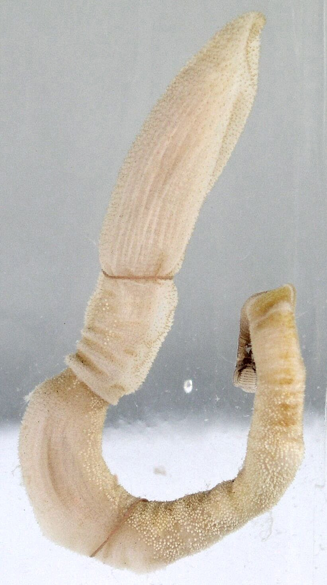
```

Acorn worms are solitary worm-shaped organisms. They generally live in burrows (the earliest secreted tubes) and are deposit feeders, but some species are pharyngeal filter feeders, while the family Torquaratoridae are free living detritivores. Many are well known for their production and accumulation of various halogenated phenols and pyrroles. Pterobranchs are filter-feeders, mostly colonial, living in a collagenous tubular structure called a coenecium.

## Chordata

A [chordate](https://en.wikipedia.org/wiki/Chordate) is an animal of the phylum Chordata. During some period of their life cycle, chordates possess a notochord, a dorsal nerve cord, pharyngeal slits, and a post-anal tail: these four anatomical features define this phylum. Chordates are also bilaterally symmetric, and have a coelom, metameric segmentation, and circulatory system.

The Chordata and [Ambulacraria](https://en.wikipedia.org/wiki/Ambulacraria) together form the superphylum Deuterostomia. Chordates are divided into three subphyla: [Vertebrata](https://en.wikipedia.org/wiki/Vertebrate) (fish, amphibians, reptiles, birds, and mammals); [Tunicata](https://en.wikipedia.org/wiki/Tunicate) or Urochordata (sea squirts, salps); and [Cephalochordata](https://en.wikipedia.org/wiki/Cephalochordate) (which includes lancelets). There are also extinct taxa such as the Vetulicolia. [Hemichordata](https://en.wikipedia.org/wiki/Hemichordate) (which includes the acorn worms) has been presented as a fourth chordate subphylum, but now is treated as a separate phylum: hemichordates and Echinodermata form the Ambulacraria, the sister phylum of the Chordates. Of the more than 65,000 living species of chordates, about half are bony fish that are members of the superclass Pisces, class [Osteichthyes](https://en.wikipedia.org/wiki/Osteichthyes).

(ref:lanc) [A Lancelet (*Branchiostoma lanceolatum*).](https://commons.wikimedia.org/wiki/File:Branchiostoma_lanceolatum.jpg)

```{r lancelet, fig.cap='(ref:lanc)', echo=FALSE, message=FALSE, warning=FALSE}
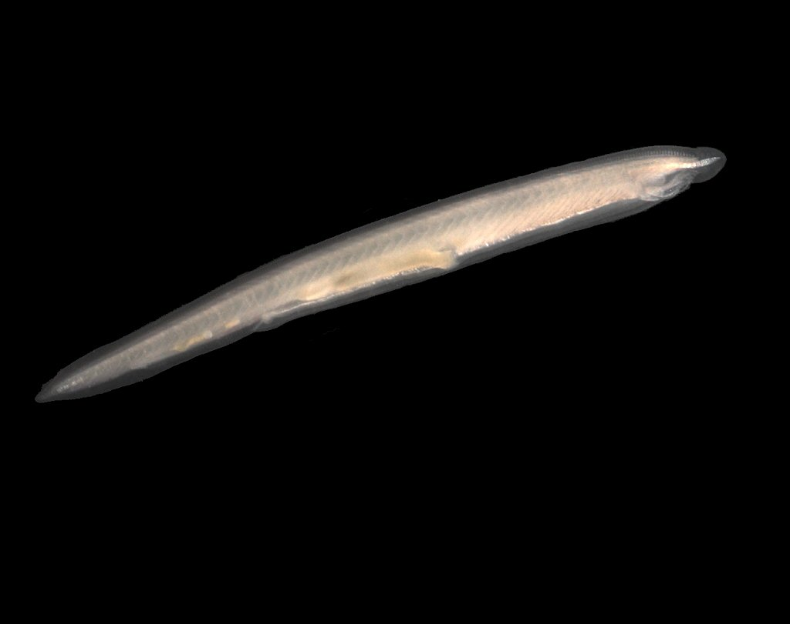
```

Chordate fossils have been found from as early as the Cambrian explosion, 541 million years ago. Cladistically (phylogenetically), vertebrates – chordates with the notochord replaced by a vertebral column during development – are considered to be a subgroup of the clade Craniata, which consists of chordates with a skull. The Craniata and Tunicata compose the clade Olfactores. 

Chordates form a phylum of animals that are defined by having at some stage in their lives all of the following anatomical features:

* A notochord, a fairly stiff rod of cartilage that extends along the inside of the body. Among the vertebrate sub-group of chordates the notochord develops into the spine, and in wholly aquatic species this helps the animal to swim by flexing its tail.
* A dorsal neural tube. In fish and other vertebrates, this develops into the spinal cord, the main communications trunk of the nervous system.
* Pharyngeal slits. The pharynx is the part of the throat immediately behind the mouth. In fish, the slits are modified to form gills, but in some other chordates they are part of a filter-feeding system that extracts particles of food from the water in which the animals live.
* Post-anal tail. A muscular tail that extends backwards behind the anus.
* An endostyle. This is a groove in the ventral wall of the pharynx. In filter-feeding species it produces mucus to gather food particles, which helps in transporting food to the esophagus. It also stores iodine, and may be a precursor of the vertebrate thyroid gland.

There are soft constraints that separate chordates from certain other biological lineages, but are not part of the formal definition:

* All chordates are deuterostomes. This means that, during the embryo development stage, the anus forms before the mouth.
* All chordates are based on a bilateral body plan.
* All chordates are coelomates, and have a fluid-filled body cavity called a coelom with a complete lining called peritoneum derived from mesoderm (see Brusca and Brusca).

Cephalochordates, one of the three subdivisions of chordates, are small, "vaguely fish-shaped" animals that lack brains, clearly defined heads and specialized sense organs. These burrowing filter-feeders compose the earliest-branching chordate sub-phylum.

(ref:tunic) [Gold-mouth sea squirt (*Polycarpa aurata*), a tunicate.](https://commons.wikimedia.org/wiki/File:Tunicate_komodo.jpg) 

```{r tunicate, fig.cap='(ref:tunic)', echo=FALSE, message=FALSE, warning=FALSE}
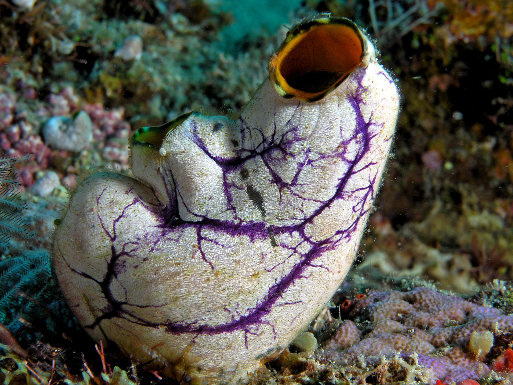
```

Most tunicates appear as adults in two major forms, known as "sea squirts" and salps, both of which are soft-bodied filter-feeders that lack the standard features of chordates. Sea squirts are sessile and consist mainly of water pumps and filter-feeding apparatus; salps float in mid-water, feeding on plankton, and have a two-generation cycle in which one generation is solitary and the next forms chain-like colonies. However, all tunicate larvae have the standard chordate features, including long, tadpole-like tails; they also have rudimentary brains, light sensors and tilt sensors. The third main group of tunicates, Appendicularia (also known as Larvacea), retain tadpole-like shapes and active swimming all their lives, and were for a long time regarded as larvae of sea squirts or salps. The etymology of the term Urochordata (Balfour 1881) is from the ancient Greek οὐρά (oura, "tail") + Latin chorda ("cord"), because the notochord is only found in the tail. The term Tunicata (Lamarck 1816) is recognised as having precedence and is now more commonly used.

(ref:compchor) [A. Lancelet, B. Larval tunicate, C. Adult tunicate](https://commons.wikimedia.org/wiki/File:Comparison_of_Three_Invertebrate_Chordates.svg) 1. Notochord, 2. Nerve chord, 3. Buccal cirri, 4. Pharynx, 5. Gill slit, 6. Gonad, 7. Gut, 8. V-shaped muscles, 9. Anus, 10. Inhalant syphon, 11. Exhalant syphon, 12. Heart, 13. Stomach, 14. Esophagus, 15. Intestines, 16. Tail, 17. Atrium, 18. Tunic

```{r chordatecomparison, fig.cap='(ref:compchor)', echo=FALSE, message=FALSE, warning=FALSE}
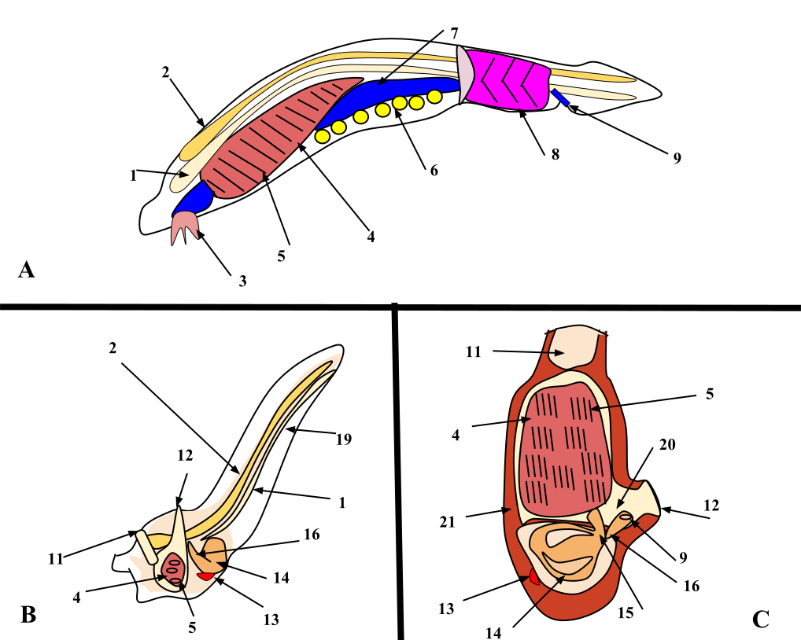
```

Craniates all have distinct skulls. They include the hagfish, which have no vertebrae. Michael J. Benton commented that "craniates are characterized by their heads, just as chordates, or possibly all deuterostomes, are by their tails".

Most craniates are vertebrates, in which the notochord is replaced by the vertebral column. These consist of a series of bony or cartilaginous cylindrical vertebrae, generally with neural arches that protect the spinal cord, and with projections that link the vertebrae. However hagfish have incomplete braincases and no vertebrae, and are therefore not regarded as vertebrates, but as members of the craniates, the group from which vertebrates are thought to have evolved. However the cladistic exclusion of hagfish from the vertebrates is controversial, as they may be degenerate vertebrates who have lost their vertebral columns.

The position of lampreys is ambiguous. They have complete braincases and rudimentary vertebrae, and therefore may be regarded as vertebrates and true fish. However, molecular phylogenetics, which uses biochemical features to classify organisms, has produced both results that group them with vertebrates and others that group them with hagfish. If lampreys are more closely related to the hagfish than the other vertebrates, this would suggest that they form a clade, which has been named the Cyclostomata.

### Fish

[Fish](https://en.wikipedia.org/wiki/Fish) are gill-bearing aquatic craniate animals that lack limbs with digits. They form a sister group to the tunicates, together forming the olfactores. Included in this definition are the living jawless ([Agnatha](https://en.wikipedia.org/wiki/Agnatha)), and cartilaginous ([Chondrichthyes](https://en.wikipedia.org/wiki/Chondrichthyes)) and bony ([Osteichthyes](https://en.wikipedia.org/wiki/Osteichthyes)) fish as well as various extinct related groups. The group Osteichthyes is divided into the ray-finned fish ([Actinopterygii](https://en.wikipedia.org/wiki/Actinopterygii)) and lobe-finned fish ([Sarcopterygii](https://en.wikipedia.org/wiki/Sarcopterygii)). 

(ref:actino) [Actinopterygii - Rayed-Finned Fish](https://commons.wikimedia.org/wiki/File:Actinopterygii-0001.jpg) 

```{r actinopterygii, fig.cap='(ref:actino)', echo=FALSE, message=FALSE, warning=FALSE}
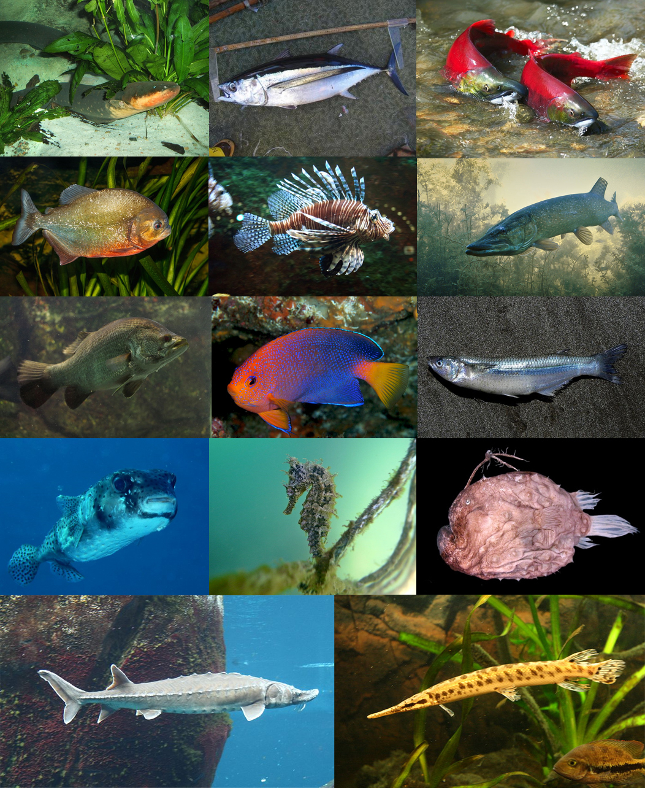
```

The earliest organisms that can be classified as fish were soft-bodied chordates that first appeared during the Cambrian period. Although they lacked a true spine, they possessed notochords which allowed them to be more agile than their invertebrate counterparts. Fish would continue to evolve through the Paleozoic era, diversifying into a wide variety of forms. Many fish of the Paleozoic developed external armor that protected them from predators. The first fish with jaws appeared in the Silurian period, after which many (such as sharks) became formidable marine predators rather than just the prey of arthropods.

Most fish are ectothermic ("cold-blooded"), allowing their body temperatures to vary as ambient temperatures change, though some of the large active swimmers like white shark and tuna can hold a higher core temperature.

Fish can communicate in their underwater environments through the use of acoustic communication. Acoustic communication in fish involves the transmission of acoustic signals from one individual of a species to another. The production of sounds as a means of communication among fish is most often used in the context of feeding, aggression or courtship behaviour. The sounds emitted by fish can vary depending on the species and stimulus involved. They can produce either stridulatory sounds by moving components of the skeletal system, or can produce non-stridulatory sounds by manipulating specialized organs such as the swimbladder.

Fish are abundant in most bodies of water. They can be found in nearly all aquatic environments, from high mountain streams (e.g., char and gudgeon) to the abyssal and even hadal depths of the deepest oceans (e.g., cusk-eels and snailfish), although no species has yet been documented in the deepest 25% of the ocean. With 34,300 described species, fish exhibit greater species diversity than any other group of vertebrates.

Fish are an important resource for humans worldwide, especially as food. Commercial and subsistence fishers hunt fish in wild fisheries (see fishing) or farm them in ponds or in cages in the ocean (see aquaculture). They are also caught by recreational fishers, kept as pets, raised by fishkeepers, and exhibited in public aquaria. Fish have had a role in culture through the ages, serving as deities, religious symbols, and as the subjects of art, books and movies.

Tetrapods emerged within lobe-finned fishes, so cladistically they are fish as well. However, traditionally fish are rendered paraphyletic by excluding the tetrapods (i.e., the amphibians, reptiles, birds and mammals which all descended from within the same ancestry). Because in this manner the term "fish" is defined negatively as a paraphyletic group, it is not considered a formal taxonomic grouping in systematic biology, unless it is used in the cladistic sense, including tetrapods. The traditional term pisces (also ichthyes) is considered a typological, but not a phylogenetic classification.

(ref:ostei) [Example of Osteichthyes: Queensland lungfish and West Indian Ocean coelacanth (two Sarcopterygii), Iridescent shark and American black sturgeon (two Actinopterygii).](https://commons.wikimedia.org/wiki/File:Osteichthyes.jpg) 

```{r osteichthyes, fig.cap='(ref:ostei)', echo=FALSE, message=FALSE, warning=FALSE}
knitr::include_graphics("./figures/animals/Osteichthyes.jpg")
```

### Amphibians

[Amphibians](https://en.wikipedia.org/wiki/Amphibian) are ectothermic, tetrapod vertebrates of the class Amphibia. All living amphibians belong to the group Lissamphibia. They inhabit a wide variety of habitats, with most species living within terrestrial, fossorial, arboreal or freshwater aquatic ecosystems. Thus amphibians typically start out as larvae living in water, but some species have developed behavioural adaptations to bypass this.

(ref:amphibians) [Diversity of amphibians:](https://commons.wikimedia.org/wiki/File:Amphibians.png) Clockwise from top right: Seymouria, Mexican burrowing caecilian, eastern newt and leaf green tree frog.

```{r amphibiandiversity, fig.cap='(ref:amphibians)', echo=FALSE, message=FALSE, warning=FALSE}
knitr::include_graphics("./figures/animals/Amphibians.png")
```
Amphibians are ectothermic, tetrapod vertebrates of the class Amphibia. All living amphibians belong to the group Lissamphibia. They inhabit a wide variety of habitats, with most species living within terrestrial, fossorial, arboreal or freshwater aquatic ecosystems. Thus amphibians typically start out as larvae living in water, but some species have developed behavioural adaptations to bypass this.

### Reptiles

[Reptiles](https://en.wikipedia.org/wiki/Reptile) are tetrapod animals in the class Reptilia, comprising today's turtles, crocodilians, snakes, amphisbaenians, lizards, tuatara, and their extinct relatives. The study of these traditional reptile orders, historically combined with that of modern amphibians, is called herpetology.

(ref:reptiles) [Diversity of reptiles:](https://commons.wikimedia.org/wiki/File:Extant_reptilia.jpg) Clockwise from above left: Green sea turtle (*Chelonia mydas*), Tuatara (*Sphenodon punctatus*), Nile crocodile (*Crocodylus niloticus*), and Sinai agama (*Pseudotrapelus sinaitus*)

```{r reptilediversity, fig.cap='(ref:reptiles)', echo=FALSE, message=FALSE, warning=FALSE}
knitr::include_graphics("./figures/animals/Extant_reptilia.jpg")
```

Because some reptiles are more closely related to birds than they are to other reptiles (e.g., crocodiles are more closely related to birds than they are to lizards), the traditional groups of "reptiles" listed above do not together constitute a monophyletic grouping or clade (consisting of all descendants of a common ancestor). For this reason, many modern scientists prefer to consider the birds part of Reptilia as well, thereby making Reptilia a monophyletic class, including all living diapsids. The term reptiles is sometimes used as shorthand for 'non-avian Reptilia'.

The earliest known proto-reptiles originated around 312 million years ago during the Carboniferous period, having evolved from advanced reptiliomorph tetrapods that became increasingly adapted to life on dry land. Some early examples include the lizard-like Hylonomus and Casineria. In addition to the living reptiles, there are many diverse groups that are now extinct, in some cases due to mass extinction events. In particular, the Cretaceous–Paleogene extinction event wiped out the pterosaurs, plesiosaurs, ornithischians, and sauropods, alongside many species of theropods, crocodyliforms, and squamates (e.g., mosasaurs).

Modern non-avian reptiles inhabit all the continents except Antarctica, although some birds are found on the periphery of Antarctica. Several living subgroups are recognized: Testudines (turtles and tortoises), 350 species; Rhynchocephalia (tuatara from New Zealand), 1 species; Squamata (lizards, snakes, and worm lizards), over 10,200 species; and Crocodilia (crocodiles, gharials, caimans, and alligators), 24 species.

Reptiles are tetrapod vertebrates, creatures that either have four limbs or, like snakes, are descended from four-limbed ancestors. Unlike amphibians, reptiles do not have an aquatic larval stage. Most reptiles are oviparous, although several species of squamates are viviparous, as were some extinct aquatic clades – the fetus develops within the mother, contained in a placenta rather than an eggshell. As amniotes, reptile eggs are surrounded by membranes for protection and transport, which adapt them to reproduction on dry land. Many of the viviparous species feed their fetuses through various forms of placenta analogous to those of mammals, with some providing initial care for their hatchlings. Extant reptiles range in size from a tiny gecko, Sphaerodactylus ariasae, which can grow up to 17 mm (0.7 in) to the saltwater crocodile, Crocodylus porosus, which can reach 6 m (19.7 ft) in length and weigh over 1,000 kg (2,200 lb).

### Birds

[Birds](https://en.wikipedia.org/wiki/Bird) are a group of warm-blooded vertebrates constituting the class Aves, characterized by feathers, toothless beaked jaws, the laying of hard-shelled eggs, a high metabolic rate, a four-chambered heart, and a strong yet lightweight skeleton. Birds live worldwide and range in size from the 5 cm (2 in) bee hummingbird to the 2.75 m (9 ft) ostrich. There are about ten thousand living species, more than half of which are passerine, or "perching" birds. Birds have wings whose development varies according to species; the only known groups without wings are the extinct moa and elephant birds. Wings, which evolved from forelimbs, gave birds the ability to fly, although further evolution has led to the loss of flight in some birds, including ratites, penguins, and diverse endemic island species. The digestive and respiratory systems of birds are also uniquely adapted for flight. Some bird species of aquatic environments, particularly seabirds and some waterbirds, have further evolved for swimming.

Birds are a group of feathered theropod dinosaurs, and constitute the only living dinosaurs. Likewise, birds are considered reptiles in the modern cladistic sense of the term, and their closest living relatives are the crocodilians. Birds are descendants of the primitive avialans (whose members include Archaeopteryx) which first appeared about 160 million years ago (mya) in China. According to DNA evidence, modern birds (Neornithes) evolved in the Middle to Late Cretaceous, and diversified dramatically around the time of the Cretaceous–Paleogene extinction event 66 mya, which killed off the pterosaurs and all non-avian dinosaurs.

(ref:birds) [The diversity of birds:](https://en.wikipedia.org/wiki/File:Bird_Diversity_2013.png) This image shows 17 biological orders of birds (from top, left to right): Musophagiformes, Pelecaniformes, Phaethontiformes, Accipitriformes, Gruiformes, Galliformes, Columbiformes, Apodiformes, Charadriiformes, Casuariiformes, Psittaciformes, Phoenicopteriformes, Sphenisciformes, Pelecaniformes, Suliformes, Passeriformes, Strigiformes, Piciformes.

```{r birddiversity, fig.cap='(ref:birds)', echo=FALSE, message=FALSE, warning=FALSE}
knitr::include_graphics("./figures/animals/Bird_Diversity_2013.png")
```

Many social species pass on knowledge across generations, which is considered a form of culture. Birds are social, communicating with visual signals, calls, and songs, and participating in such behaviours as cooperative breeding and hunting, flocking, and mobbing of predators. The vast majority of bird species are socially (but not necessarily sexually) monogamous, usually for one breeding season at a time, sometimes for years, but rarely for life. Other species have breeding systems that are polygynous (one male with many females) or, rarely, polyandrous (one female with many males). Birds produce offspring by laying eggs which are fertilised through sexual reproduction. They are usually laid in a nest and incubated by the parents. Most birds have an extended period of parental care after hatching.

Many species of birds are economically important as food for human consumption and raw material in manufacturing, with domesticated and undomesticated birds being important sources of eggs, meat, and feathers. Songbirds, parrots, and other species are popular as pets. Guano (bird excrement) is harvested for use as a fertiliser. Birds figure throughout human culture. About 120 to 130 species have become extinct due to human activity since the 17th century, and hundreds more before then. Human activity threatens about 1,200 bird species with extinction, though efforts are underway to protect them. Recreational birdwatching is an important part of the ecotourism industry.

### Mammals

[Mammals](https://en.wikipedia.org/wiki/Mammal) (from Latin mamma "breast") are vertebrate animals constituting the class Mammalia, and characterized by the presence of mammary glands which in females produce milk for feeding (nursing) their young, a neocortex (a region of the brain), fur or hair, and three middle ear bones. These characteristics distinguish them from reptiles and birds, from which they diverged in the late Carboniferous, approximately 300 million years ago. Around 6,400 extant species of mammals have been described. The largest orders are the rodents, bats and Eulipotyphla (hedgehogs, moles, shrews, and others). The next three are the Primates (apes including humans, monkeys, and others), the Cetartiodactyla (cetaceans and even-toed ungulates), and the Carnivora (cats, dogs, seals, and others).

(ref:mammals) [Diversity of mammals.](https://en.wikipedia.org/wiki/File:Mammal_Diversity_2011.png) 

```{r mammaldiversity, fig.cap='(ref:mammals)', echo=FALSE, message=FALSE, warning=FALSE}
knitr::include_graphics("./figures/animals/Mammal_Diversity_2011.png")
```

In terms of cladistics, which reflects evolutionary history, mammals are the only living members of the Synapsida; this clade, together with Sauropsida (reptiles and birds), constitutes the larger Amniota clade. The early synapsid mammalian ancestors were sphenacodont pelycosaurs, a group that included the non-mammalian Dimetrodon. At the end of the Carboniferous period around 300 million years ago, this group diverged from the sauropsid line that led to today's reptiles and birds. The line following the stem group Sphenacodontia split into several diverse groups of non-mammalian synapsids—sometimes incorrectly referred to as mammal-like reptiles—before giving rise to Therapsida in the Early Permian period. The modern mammalian orders arose in the Paleogene and Neogene periods of the Cenozoic era, after the extinction of non-avian dinosaurs, and have been the dominant terrestrial animal group from 66 million years ago to the present.

The basic body type is quadruped, and most mammals use their four extremities for terrestrial locomotion; but in some, the extremities are adapted for life at sea, in the air, in trees, underground, or on two legs. Mammals range in size from the 30–40 mm (1.2–1.6 in) bumblebee bat to the 30 m (98 ft) blue whale—possibly the largest animal to have ever lived. Maximum lifespan varies from two years for the shrew to 211 years for the bowhead whale. All modern mammals give birth to live young, except the five species of monotremes, which are egg-laying mammals. The most species-rich group of mammals, the cohort called placentals, have a placenta, which enables the feeding of the fetus during gestation.

Most mammals are intelligent, with some possessing large brains, self-awareness, and tool use. Mammals can communicate and vocalize in several ways, including the production of ultrasound, scent-marking, alarm signals, singing, and echolocation. Mammals can organize themselves into fission-fusion societies, harems, and hierarchies—but can also be solitary and territorial. Most mammals are polygynous, but some can be monogamous or polyandrous.

Domestication of many types of mammals by humans played a major role in the Neolithic revolution, and resulted in farming replacing hunting and gathering as the primary source of food for humans. This led to a major restructuring of human societies from nomadic to sedentary, with more co-operation among larger and larger groups, and ultimately the development of the first civilizations. Domesticated mammals provided, and continue to provide, power for transport and agriculture, as well as food (meat and dairy products), fur, and leather. Mammals are also hunted and raced for sport, and are used as model organisms in science. Mammals have been depicted in art since Palaeolithic times, and appear in literature, film, mythology, and religion. Decline in numbers and extinction of many mammals is primarily driven by human poaching and habitat destruction, primarily deforestation.

### Ecdysozoa

The [Ecdysozoa]() are protostomes, named after their shared trait of ecdysis, growth by moulting. They include the largest animal phylum, the Arthropoda, which contains insects, spiders, crabs, and their kin. All of these have a body divided into repeating segments, typically with paired appendages. Two smaller phyla, the Onychophora and Tardigrada, are close relatives of the arthropods and share these traits. The ecdysozoans also include the Nematoda or roundworms, perhaps the second largest animal phylum. Roundworms are typically microscopic, and occur in nearly every environment where there is water; some are important parasites. Smaller phyla related to them are the Nematomorpha or horsehair worms, and the Kinorhyncha, Priapulida, and Loricifera. These groups have a reduced coelom, called a pseudocoelom.

### Arthropods

An [arthropod](https://en.wikipedia.org/wiki/Arthropod) (from Greek ἄρθρον arthron, "joint" and πούς pous, "foot" (gen. ποδός)) is an invertebrate animal having an exoskeleton, a segmented body, and paired jointed appendages. Arthropods form the phylum Euarthropoda, which includes insects, arachnids, myriapods, and crustaceans. The term Arthropoda as originally proposed refers to a proposed grouping of Euarthropods and the phylum Onychophora.

(ref:arthropods) [Diversity of arthropods:](https://commons.wikimedia.org/wiki/File:Arthropoda.jpg) From left to right and from top to bottom: Kolihapeltis, Stylonurus, scorpion, crab, centipede, butterfly.

```{r arthropoddiversity, fig.cap='(ref:arthropods)', echo=FALSE, message=FALSE, warning=FALSE}
knitr::include_graphics("./figures/animals/Arthropoda.jpg")
```

Arthropods are characterized by their jointed limbs and cuticle made of chitin, often mineralised with calcium carbonate. The arthropod body plan consists of segments, each with a pair of appendages. The rigid cuticle inhibits growth, so arthropods replace it periodically by moulting. Arthropods are bilaterally symmetrical and their body possesses an external skeleton. Some species have wings.

Their versatility has enabled arthropods to become the most species-rich members of all ecological guilds in most environments. They have over a million described species, making up more than 80 percent of all described living animal species, some of which, unlike most other animals, are very successful in dry environments. Arthropods range in size from the microscopic crustacean Stygotantulus up to the Japanese spider crab.

An arthropod's primary internal cavity is a haemocoel, which accommodates its internal organs, and through which its haemolymph – analogue of blood – circulates; it has an open circulatory system. Like their exteriors, the internal organs of arthropods are generally built of repeated segments. Their nervous system is "ladder-like", with paired ventral nerve cords running through all segments and forming paired ganglia in each segment. Their heads are formed by fusion of varying numbers of segments, and their brains are formed by fusion of the ganglia of these segments and encircle the esophagus. The respiratory and excretory systems of arthropods vary, depending as much on their environment as on the subphylum to which they belong.

Their vision relies on various combinations of compound eyes and pigment-pit ocelli: in most species the ocelli can only detect the direction from which light is coming, and the compound eyes are the main source of information, but the main eyes of spiders are ocelli that can form images and, in a few cases, can swivel to track prey. Arthropods also have a wide range of chemical and mechanical sensors, mostly based on modifications of the many bristles known as setae that project through their cuticles.

Arthropods' methods of reproduction and development are diverse; all terrestrial species use internal fertilization, but this is often by indirect transfer of the sperm via an appendage or the ground, rather than by direct injection. Aquatic species use either internal or external fertilization. Almost all arthropods lay eggs, but scorpions give birth to live young after the eggs have hatched inside the mother. Arthropod hatchlings vary from miniature adults to grubs and caterpillars that lack jointed limbs and eventually undergo a total metamorphosis to produce the adult form. The level of maternal care for hatchlings varies from nonexistent to the prolonged care provided by scorpions.

The evolutionary ancestry of arthropods dates back to the Cambrian period. The group is generally regarded as monophyletic, and many analyses support the placement of arthropods with cycloneuralians (or their constituent clades) in a superphylum Ecdysozoa. Overall, however, the basal relationships of animals are not yet well resolved. Likewise, the relationships between various arthropod groups are still actively debated.

Arthropods belong to phylum Euarthropoda. The phylum is sometimes called Arthropoda, but strictly this term denotes a (putative - see Tactopoda) clade that also encompasses the phylum Onychophora.

Euarthropoda is typically subdivided into five subphyla, of which one is extinct:

* Trilobites are a group of formerly numerous marine animals that disappeared in the Permian–Triassic extinction event, though they were in decline prior to this killing blow, having been reduced to one order in the Late Devonian extinction.
* Chelicerates include horseshoe crabs, spiders, mites, scorpions and related organisms. They are characterised by the presence of chelicerae, appendages just above / in front of the mouth. Chelicerae appear in scorpions and horseshoe crabs as tiny claws that they use in feeding, but those of spiders have developed as fangs that inject venom.
* Myriapods comprise millipedes, centipedes, and their relatives and have many body segments, each segment bearing one or two pairs of legs (or in a few cases being legless). They are sometimes grouped with the hexapods.
* Crustaceans are primarily aquatic (a notable exception being woodlice) and are characterised by having biramous appendages. They include lobsters, crabs, barnacles, crayfish, shrimp and many others.
* Hexapods comprise insects and three small orders of insect-like animals with six thoracic legs. They are sometimes grouped with the myriapods, in a group called Uniramia, though genetic evidence tends to support a closer relationship between hexapods and crustaceans.

Aside from these major groups, there are also a number of fossil forms, mostly from the Early Cambrian, which are difficult to place, either from lack of obvious affinity to any of the main groups or from clear affinity to several of them. Marrella was the first one to be recognized as significantly different from the well-known groups.

The phylogeny of the major extant arthropod groups has been an area of considerable interest and dispute. Recent studies strongly suggest that Crustacea, as traditionally defined, is paraphyletic, with Hexapoda having evolved from within it, so that Crustacea and Hexapoda form a clade, Pancrustacea. The position of Myriapoda, Chelicerata and Pancrustacea remains unclear as of April 2012. In some studies, Myriapoda is grouped with Chelicerata (forming Myriochelata); in other studies, Myriapoda is grouped with Pancrustacea (forming Mandibulata), or Myriapoda may be sister to Chelicerata plus Pancrustacea.

Arthropods contribute to the human food supply both directly as food, and more importantly indirectly as pollinators of crops.


(ref:lobs) [A Maine Lobster served in Boston.](https://commons.wikimedia.org/wiki/File:Lobster_in_Boston.jpg) 

```{r lobster, fig.cap='(ref:lobs)', echo=FALSE, message=FALSE, warning=FALSE}
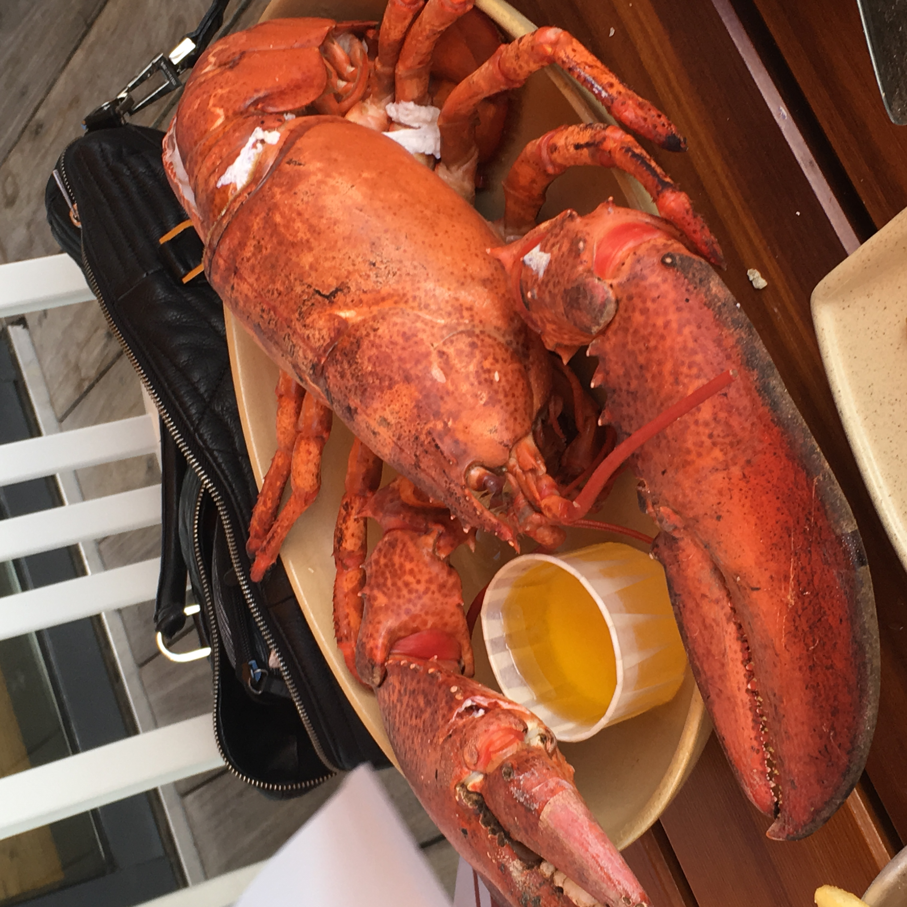
```

Some species are known to spread severe disease to humans, livestock, and crops.

### Nematodes

The [nematodes](https://en.wikipedia.org/wiki/Nematode) or roundworms constitute the phylum Nematoda (also called Nemathelminthes), with plant-parasitic nematodes being known as eelworms. The word nematode comes from the Modern Latin compound of nemat- "thread" (from Greek nema, genitive nematos "thread," from stem of nein "to spin"; see needle) + -odes "like, of the nature of" (see -oid). They are a diverse animal phylum inhabiting a broad range of environments. Taxonomically, they are classified along with insects and other moulting animals in the clade Ecdysozoa, and unlike flatworms, have tubular digestive systems with openings at both ends. Like tardigrades they have a reduced number of Hox genes, but as their sister phylum Nematomorpha has kept the ancestral protostome Hox genotype, it shows that the reduction has occurred within the nematode phylum.

(ref:celeg) [*Caenorhabditis elegans*, a free-living transparent nematode about 1 mm in length that lives in temperate soil environments.](https://commons.wikimedia.org/wiki/File:Adult_Caenorhabditis_elegans.jpg) In 1963, Sydney Brenner proposed research into C. elegans, primarily in the area of neuronal development. In 1974, he began research into the molecular and developmental biology of C. elegans, which has since been extensively used as a model organism. It was the first multicellular organism to have its whole genome sequenced, and as of 2019, is the only organism to have its connectome (neuronal "wiring diagram") completed.

```{r celegans, fig.cap='(ref:celeg)', echo=FALSE, message=FALSE, warning=FALSE}
knitr::include_graphics("./figures/animals/Adult_Caenorhabditis_elegans.jpg")
```

Nematode species can be difficult to distinguish from one another. Consequently, estimates of the number of nematode species described to date vary by author and may change rapidly over time. A 2013 survey of animal biodiversity published in the mega journal Zootaxa puts this figure at over 25,000. Estimates of the total number of extant species are subject to even greater variation. A widely referenced article published in 1993 estimated there may be over 1 million species of nematode, a claim which has since been repeated in numerous publications. Many other publications have since vigorously refuted this claim on the grounds that it is unsupported by fact. More recent, fact-based estimates have placed the true figure closer to 40,000 species worldwide.

Nematodes have successfully adapted to nearly every ecosystem: from marine (salt) to fresh water, soils, from the polar regions to the tropics, as well as the highest to the lowest of elevations (including mountains). They are ubiquitous in freshwater, marine, and terrestrial environments, where they often outnumber other animals in both individual and species counts, and are found in locations as diverse as mountains, deserts, and oceanic trenches. They are found in every part of the earth's lithosphere, even at great depths, 0.9–3.6 km (3,000–12,000 ft) below the surface of the Earth in gold mines in South Africa. They represent 90% of all animals on the ocean floor. In total, 4.4 × 1020 nematodes inhabit the Earth's topsoil, or approximately 60 billion for each human, with the highest densities observed in tundra and boreal forests. Their numerical dominance, often exceeding a million individuals per square meter and accounting for about 80% of all individual animals on earth, their diversity of lifecycles, and their presence at various trophic levels point to an important role in many ecosystems. They have been shown to play crucial roles in polar ecosystems. The roughly 2,271 genera are placed in 256 families. The many parasitic forms include pathogens in most plants and animals. A third of the genera occur as parasites of vertebrates; about 35 nematode species occur in humans.

### Spiralia

The [Spiralia](https://en.wikipedia.org/wiki/Spiralia) are a large group of protostomes that develop by spiral cleavage in the early embryo. The Spiralia's phylogeny has been disputed, but it contains a large clade, the superphylum [Lophotrochozoa](https://en.wikipedia.org/wiki/Lophotrochozoa), and smaller groups of phyla such as the Rouphozoa which includes the gastrotrichs and the flatworms. All of these are grouped as the Platytrochozoa, which has a sister group, the [Gnathifera](https://en.wikipedia.org/wiki/Gnathifera_(clade)) (from the Greek gnáthos, “jaw”, and the Latin -fera, “bearing”), which includes the rotifers.

### Rotifera

The [rotifers](https://en.wikipedia.org/wiki/Rotifer) (from Latin rota "wheel" and -fer "bearing"), commonly called wheel animals or wheel animalcules, make up a phylum (Rotifera) of microscopic and near-microscopic pseudocoelomate animals.

(ref:rotifer) [A Rotifera (wheel animal).](https://commons.wikimedia.org/wiki/File:Mikrofoto.de-Raedertier_Ptygura_pilula_2.jpg) 

```{r rotifera, fig.cap='(ref:rotifer)', echo=FALSE, message=FALSE, warning=FALSE}
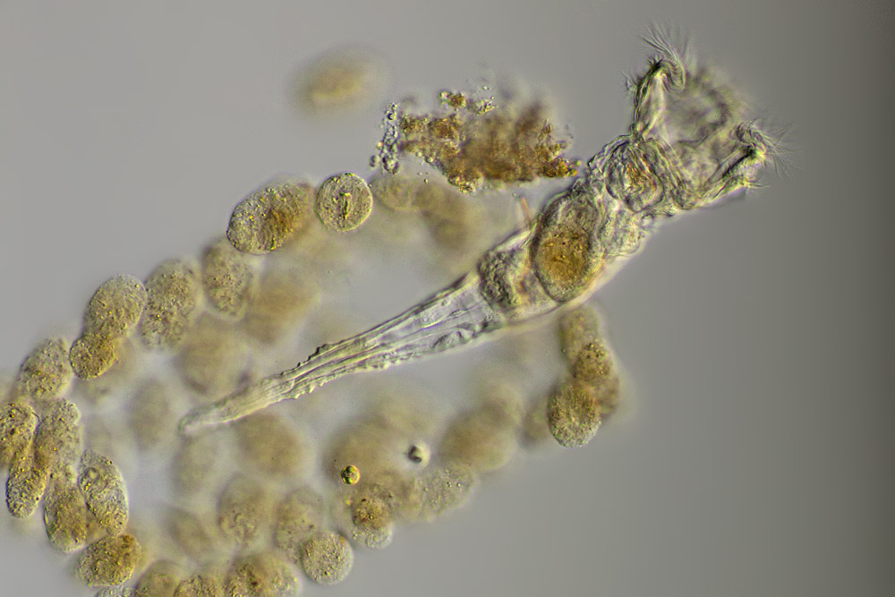
```

They were first described by Rev. John Harris in 1696, and other forms were described by Antonie van Leeuwenhoek in 1703. Most rotifers are around 0.1–0.5 mm long (although their size can range from 50 μm to over 2 mm), and are common in freshwater environments throughout the world with a few saltwater species.

Some rotifers are free swimming and truly planktonic, others move by inchworming along a substrate, and some are sessile, living inside tubes or gelatinous holdfasts that are attached to a substrate. About 25 species are colonial (e.g., Sinantherina semibullata), either sessile or planktonic. Rotifers are an important part of the freshwater zooplankton, being a major foodsource and with many species also contributing to the decomposition of soil organic matter. Most species of the rotifers are cosmopolitan, but there are also some endemic species, like Cephalodella vittata to Lake Baikal. Recent barcoding evidence, however, suggests that some 'cosmopolitan' species, such as Brachionus plicatilis, B. calyciflorus, Lecane bulla, among others, are actually species complexes.

Rotifers have bilateral symmetry and a variety of different shapes. The body of a rotifer is divided into a head, trunk, and foot, and is typically somewhat cylindrical. There is a well-developed cuticle, which may be thick and rigid, giving the animal a box-like shape, or flexible, giving the animal a worm-like shape; such rotifers are respectively called loricate and illoricate. Rigid cuticles are often composed of multiple plates, and may bear spines, ridges, or other ornamentation. Their cuticle is nonchitinous and is formed from sclerotized proteins.

The most distinctive feature of rotifers is the presence of a ciliated structure, called the corona, on the head. In the more primitive species, this forms a simple ring of cilia around the mouth from which an additional band of cilia stretches over the back of the head. In the great majority of rotifers, however, this has evolved into a more complex structure.

Modifications to the basic plan of the corona include alteration of the cilia into bristles or large tufts, and either expansion or loss of the ciliated band around the head. In genera such as Collotheca, the corona is modified to form a funnel surrounding the mouth. In many species, such as those in the genus Testudinella, the cilia around the mouth have disappeared, leaving just two small circular bands on the head. In the bdelloids, this plan is further modified, with the upper band splitting into two rotating wheels, raised up on a pedestal projecting from the upper surface of the head.

The trunk forms the major part of the body, and encloses most of the internal organs. The foot projects from the rear of the trunk, and is usually much narrower, giving the appearance of a tail. The cuticle over the foot often forms rings, making it appear segmented, although the internal structure is uniform. Many rotifers can retract the foot partially or wholly into the trunk. The foot ends in from one to four toes, which, in sessile and crawling species, contain adhesive glands to attach the animal to the substratum. In many free-swimming species, the foot as a whole is reduced in size, and may even be absent.

The coronal cilia create a current that sweeps food into the mouth. The mouth opens into a characteristic chewing pharynx (called the mastax), sometimes via a ciliated tube, and sometimes directly. The pharynx has a powerful muscular wall and contains tiny, calcified, jaw-like structures called trophi, which are the only fossilizable parts of a rotifer. The shape of the trophi varies between different species, depending partly on the nature of their diet. In suspension feeders, the trophi are covered in grinding ridges, while in more actively carnivorous species, they may be shaped like forceps to help bite into prey. In some ectoparasitic rotifers, the mastax is adapted to grip onto the host, although, in others, the foot performs this function instead.

Behind the mastax lies an oesophagus, which opens into a stomach where most of the digestion and absorption occurs. The stomach opens into a short intestine that terminates in a cloaca on the posterior dorsal surface of the animal. Up to seven salivary glands are present in some species, emptying to the mouth in front of the oesophagus, while the stomach is associated with two gastric glands that produce digestive enzymes.

A pair of protonephridia open into a bladder that drains into the cloaca. These organs expel water from the body, helping to maintain osmotic balance.

Rotifers have a small brain, located just above the mastax, from which a number of nerves extend throughout the body. The number of nerves varies among species, although the nervous system usually has a simple layout. Close to the brain lies a retrocerebral organ, consisting of two glands either side of a medial sac. The sac drains into a duct that divides into two before opening through pores on the uppermost part of the head. The function of the retrocerebral organ is unclear.

The nervous system comprises about 25% of the roughly 1,000 cells in a rotifer.

Rotifers typically possess one or two pairs of short antennae and up to five eyes. The eyes are simple in structure, sometimes with just a single photoreceptor cell. In addition, the bristles of the corona are sensitive to touch, and there are also a pair of tiny sensory pits lined by cilia in the head region.

The coronal cilia pull the animal, when unattached, through the water.

Like many other microscopic animals, adult rotifers frequently exhibit eutely—they have a fixed number of cells within a species, usually on the order of 1,000.

Bdelloid rotifer genomes contain two or more divergent copies of each gene, suggesting a long-term asexual evolutionary history. For example, four copies of hsp82 are found. Each is different and found on a different chromosome excluding the possibility of homozygous sexual reproduction.

Rotifers eat particulate organic detritus, dead bacteria, algae, and protozoans. They eat particles up to 10 micrometres in size. Like crustaceans, rotifers contribute to nutrient recycling. For this reason, they are used in fish tanks to help clean the water, to prevent clouds of waste matter. Rotifers affect the species composition of algae in ecosystems through their choice in grazing. Rotifers may be in competition with cladocera and copepods for planktonic food sources.

Rotifers are dioecious and reproduce sexually or parthenogenetically. They are sexually dimorphic, with the females always being larger than the males. In some species, this is relatively mild, but in others the female may be up to ten times the size of the male. In parthenogenetic species, males may be present only at certain times of the year, or absent altogether.

The female reproductive system consists of one or two ovaries, each with a vitellarium gland that supplies the eggs with yolk. Together, each ovary and vitellarium form a single syncitial structure in the anterior part of the animal, opening through an oviduct into the cloaca.

Males do not usually have a functional digestive system, and are therefore short-lived, often being sexually fertile at birth. They have a single testicle and sperm duct, associated with a pair of glandular structures referred to as prostates (unrelated to the vertebrate prostate). The sperm duct opens into a gonopore at the posterior end of the animal, which is usually modified to form a penis. The gonopore is homologous to the cloaca of females, but in most species has no connection to the vestigial digestive system, which lacks an anus.

The phylum Rotifera encloses three classes that reproduce by three different mechanisms: Seisonidea only reproduce sexually; Bdelloidea reproduce exclusively by asexual parthenogenesis; Monogononta reproduce alternating these two mechanisms ("cyclical parthenogenesis" or "heterogony"). Parthenogenesis (amictic phase) dominates the monogonont life cycle, promoting fast population growth and colonization. In this phase males are absent and amictic females produce diploid eggs by mitosis which develop parthenogenetically into females that are clones of their mothers. Some amictic females can generate mictic females that will produce haploid eggs by meiosis. Mixis (meiosis) is induced by different types of stimulus depending on species. Haploid eggs develop into haploid dwarf males if they are not fertilized and into diploid "resting eggs" (or "diapausing eggs") if they are fertilized by males.

Fertilization is internal. The male either inserts his penis into the female's cloaca or uses it to penetrate her skin, injecting the sperm into the body cavity. The egg secretes a shell, and is attached either to the substratum, nearby plants, or the female's own body. A few species, such as members of the Rotaria, are ovoviviparous, retaining the eggs inside their body until they hatch.

Most species hatch as miniature versions of the adult. Sessile species, however, are born as free-swimming larvae, which closely resemble the adults of related free-swimming species. Females grow rapidly, reaching their adult size within a few days, while males typically do not grow in size at all.

The life span of monogonont females varies from two days to about three weeks.


### Flatworms

The [flatworms](https://en.wikipedia.org/wiki/Flatworm), flat worms, Platyhelminthes, Plathelminthes, or platyhelminths (from the Greek πλατύ, platy, meaning "flat" and ἕλμινς (root: ἑλμινθ-), helminth-, meaning "worm") are a phylum of relatively simple bilaterian, unsegmented, soft-bodied invertebrates. Unlike other bilaterians, they are acoelomates (having no body cavity), and have no specialized circulatory and respiratory organs, which restricts them to having flattened shapes that allow oxygen and nutrients to pass through their bodies by diffusion. The digestive cavity has only one opening for both ingestion (intake of nutrients) and egestion (removal of undigested wastes); as a result, the food cannot be processed continuously.

(ref:turb) [The turbellarian *Pseudoceros dimidiatus*.](https://commons.wikimedia.org/wiki/File:Pseudoceros_dimidiatus.jpg) 

```{r turbellarian, fig.cap='(ref:turb)', echo=FALSE, message=FALSE, warning=FALSE}
knitr::include_graphics("./figures/animals/Pseudoceros_dimidiatus.jpg")
```
In traditional medicinal texts, Platyhelminthes are divided into Turbellaria, which are mostly non-parasitic animals such as planarians, and three entirely parasitic groups: Cestoda, Trematoda and Monogenea; however, since the turbellarians have since been proven not to be monophyletic, this classification is now deprecated. Free-living flatworms are mostly predators, and live in water or in shaded, humid terrestrial environments, such as leaf litter. Cestodes (tapeworms) and trematodes (flukes) have complex life-cycles, with mature stages that live as parasites in the digestive systems of fish or land vertebrates, and intermediate stages that infest secondary hosts. The eggs of trematodes are excreted from their main hosts, whereas adult cestodes generate vast numbers of hermaphroditic, segment-like proglottids that detach when mature, are excreted, and then release eggs. Unlike the other parasitic groups, the monogeneans are external parasites infesting aquatic animals, and their larvae metamorphose into the adult form after attaching to a suitable host.

Platyhelminthes are bilaterally symmetrical animals: their left and right sides are mirror images of each other; this also implies they have distinct top and bottom surfaces and distinct head and tail ends. Like other bilaterians, they have three main cell layers (endoderm, mesoderm, and ectoderm), while the radially symmetrical cnidarians and ctenophores (comb jellies) have only two cell layers. Beyond that, they are "defined more by what they do not have than by any particular series of specializations." Unlike other bilaterians, Platyhelminthes have no internal body cavity, so are described as acoelomates. They also lack specialized circulatory and respiratory organs, both of these facts are defining features when classifying a flatworm's anatomy. Their bodies are soft and unsegmented.

Because they do not have internal body cavities, Platyhelminthes were regarded as a primitive stage in the evolution of bilaterians (animals with bilateral symmetry and hence with distinct front and rear ends). However, analyses since the mid-1980s have separated out one subgroup, the Acoelomorpha, as basal bilaterians – closer to the original bilaterians than to any other modern groups. The remaining Platyhelminthes form a monophyletic group, one that contains all and only descendants of a common ancestor that is itself a member of the group. The redefined Platyhelminthes is part of the Lophotrochozoa, one of the three main groups of more complex bilaterians. These analyses had concluded the redefined Platyhelminthes, excluding Acoelomorpha, consists of two monophyletic subgroups, Catenulida and Rhabditophora, with Cestoda, Trematoda and Monogenea forming a monophyletic subgroup within one branch of the Rhabditophora. Hence, the traditional platyhelminth subgroup "Turbellaria" is now regarded as paraphyletic, since it excludes the wholly parasitic groups, although these are descended from one group of "turbellarians".

The lack of circulatory and respiratory organs limits platyhelminths to sizes and shapes that enable oxygen to reach and carbon dioxide to leave all parts of their bodies by simple diffusion. Hence, many are microscopic and the large species have flat ribbon-like or leaf-like shapes. The guts of large species have many branches, allowing nutrients to diffuse to all parts of the body. Respiration through the whole surface of the body makes them vulnerable to fluid loss, and restricts them to environments where dehydration is unlikely: sea and freshwater, moist terrestrial environments such as leaf litter or between grains of soil, and as parasites within other animals.

The space between the skin and gut is filled with mesenchyme, also known as parenchyma, a connective tissue made of cells and reinforced by collagen fibers that act as a type of skeleton, providing attachment points for muscles. The mesenchyme contains all the internal organs and allows the passage of oxygen, nutrients and waste products. It consists of two main types of cell: fixed cells, some of which have fluid-filled vacuoles; and stem cells, which can transform into any other type of cell, and are used in regenerating tissues after injury or asexual reproduction.

Most platyhelminths have no anus and regurgitate undigested material through the mouth. However, some long species have an anus and some with complex, branched guts have more than one anus, since excretion only through the mouth would be difficult for them. The gut is lined with a single layer of endodermal cells that absorb and digest food. Some species break up and soften food first by secreting enzymes in the gut or pharynx (throat).

All animals need to keep the concentration of dissolved substances in their body fluids at a fairly constant level. Internal parasites and free-living marine animals live in environments with high concentrations of dissolved material, and generally let their tissues have the same level of concentration as the environment, while freshwater animals need to prevent their body fluids from becoming too dilute. Despite this difference in environments, most platyhelminths use the same system to control the concentration of their body fluids. Flame cells, so called because the beating of their flagella looks like a flickering candle flame, extract from the mesenchyme water that contains wastes and some reusable material, and drive it into networks of tube cells which are lined with flagella and microvilli. The tube cells' flagella drive the water towards exits called nephridiopores, while their microvilli reabsorb reusable materials and as much water as is needed to keep the body fluids at the right concentration. These combinations of flame cells and tube cells are called protonephridia.

In all platyhelminths, the nervous system is concentrated at the head end. This is least marked in the acoels, which have nerve nets rather like those of cnidarians and ctenophores, but densest around the head. Other platyhelminths have rings of ganglia in the head and main nerve trunks running along their bodies.

### Trematoda

These parasites' name refers to the cavities in their holdfasts (Greek τρῆμα, hole), which resemble suckers and anchor them within their hosts. The skin of all species is a syncitium, which is a layer of cells that shares a single external membrane. Trematodes are divided into two groups, Digenea and Aspidogastrea (also known as Aspodibothrea)

### Digenea

These are often called flukes, as most have flat rhomboid shapes like that of a flounder (Old English flóc). There are about 11,000 species, more than all other platyhelminthes combined, and second only to roundworms among parasites on metazoans. Adults usually have two holdfasts: a ring around the mouth and a larger sucker midway along what would be the underside in a free-living flatworm. Although the name "Digeneans" means "two generations", most have very complex life cycles with up to seven stages, depending on what combinations of environments the early stages encounter – the most important factor being whether the eggs are deposited on land or in water. The intermediate stages transfer the parasites from one host to another. The definitive host in which adults develop is a land vertebrate; the earliest host of juvenile stages is usually a snail that may live on land or in water, whilst in many cases, a fish or arthropod is the second host. For example, (Figure \@ref(fig:schisto)) shows the life cycle of the fluke *Schistosoma mansoni*, which causes the devastating tropical disease bilharzia. Infected individuals release Schistosoma eggs into water via their fecal material or urine. After larvae hatch from these eggs, the larvae infect a very specific type of freshwater snail. For example, in *S. mansoni* it is snaill of the genus *Biomphalaria*. The Schistosoma larvae undergo the next phase of their lifecycles in these snails, spending their time reproducing and developing. Once this step has been completed, the parasite leaves the snail and enters the water. The parasite can live in the water for only 48 hours without a mammalian host. Humans encounter larvae of the Schistosoma parasite when they enter contaminated water while bathing, playing, swimming, washing, fishing, or walking through the water. Once a host has been found, the worm enters its blood vessels. For several weeks, the worm remains in the vessels, continuing its development into its adult phase. When maturity is reached, mating occurs and eggs are produced. Eggs enter the bladder/intestine and are excreted through urine and feces and the process repeats. If the eggs do not get excreted, they can become engrained in the body tissues and cause a variety of problems such as immune reactions and organ damage.


(ref:schisto) [Schistosoma life cycle.](https://commons.wikimedia.org/wiki/File:Schistosoma_life_cycle.svg) Schistosoma eggs are eliminated with feces or urine, depending on species (1). Under appropriate conditions the eggs hatch and release miracidia (2), which swim and penetrate specific snail intermediate hosts (3). The stages in the snail include two generations of sporocysts (4) and the production of cercariae (5). Upon release from the snail, the infective cercariae swim, penetrate the skin of the human host (6), and shed their forked tails, becoming schistosomulae (7). The schistosomulae migrate via venous circulation to lungs, then to the heart, and then develop in the liver, exiting the liver via the portal vein system when mature, (8)(9). Male and female adult worms copulate and reside in the mesenteric venules, the location of which varies by species (with some exceptions) (10). For instance, S. japonicum is more frequently found in the superior mesenteric veins draining the small intestine (A), and S. mansoni occurs more often in the inferior mesenteric veins draining the large intestine (B). However, both species can occupy either location and are capable of moving between sites. S. intercalatum and S. guineensis also inhabit the inferior mesenteric plexus but lower in the bowel than S. mansoni. S. haematobium most often inhabitsin the vesicular and pelvic venous plexus of the bladder (C), but it can also be found in the rectal venules. The females (size ranges from 7–28 mm, depending on species) deposit eggs in the small venules of the portal and perivesical systems. The eggs are moved progressively toward the lumen of the intestine (S. mansoni,S. japonicum, S. mekongi, S. intercalatum/guineensis) and of the bladder and ureters (S. haematobium), and are eliminated with feces or urine, respectively (1).

```{r schistosomalifecycle, fig.cap='(ref:schisto)', echo=FALSE, message=FALSE, warning=FALSE}
knitr::include_graphics("./figures/animals/Schistosoma_life_cycle.svg")
```

Adults range between 0.2 mm (0.0079 in) and 6 mm (0.24 in) in length. Individual adult digeneans are of a single sex, and in some species slender females live in enclosed grooves that run along the bodies of the males, partially emerging to lay eggs. In all species the adults have complex reproductive systems, capable of producing between 10,000 and 100,000 times as many eggs as a free-living flatworm. In addition, the intermediate stages that live in snails reproduce asexually.

Adults of different species infest different parts of the definitive host - for example the intestine, lungs, large blood vessels, and liver. The adults use a relatively large, muscular pharynx to ingest cells, cell fragments, mucus, body fluids or blood. In both the adult and snail-inhabiting stages, the external syncytium absorbs dissolved nutrients from the host. Adult digeneans can live without oxygen for long periods.

### Cestoda

These are often called [tapeworms](https://en.wikipedia.org/wiki/Cestoda) because of their flat, slender but very long bodies – the name "cestode" is derived from the Latin word cestus, which means "tape". The adults of all 3,400 cestode species are internal parasites. Cestodes have no mouths or guts, and the syncitial skin absorbs nutrients – mainly carbohydrates and amino acids – from the host, and also disguises it chemically to avoid attacks by the host's immune system. Shortage of carbohydrates in the host's diet stunts the growth of parasites and may even kill them. Their metabolisms generally use simple but inefficient chemical processes, compensating for this inefficiency by consuming large amounts of food relative to their physical size.

(ref:taenia) [Life cycle of the cestode Taenia:](https://commons.wikimedia.org/wiki/File:Taenia_solium_Life_cycle.tif) Taeniasis is the infection of humans with the adult tapeworm of *Taenia saginata* or *Taenia solium*. Humans are the only definitive hosts for *T. saginata* and *T. solium*. Eggs or gravid proglottids are passed with feces (1); the eggs can survive for days to months in the environment. Cattle (*T. saginata*) and pigs (*T. solium*) become infected by ingesting vegetation contaminated with eggs or gravid proglottids (2). In the animal’s intestine, the oncospheres hatch (3), invade the intestinal wall, and migrate to the striated muscles, where they develop into cysticerci. A cysticercus can survive for several years in the animal. Humans become infected by ingesting raw or undercooked infected meat (4). In the human intestine, the cysticercus develops over 2 months into an adult tapeworm, which can survive for years. The adult tapeworms attach to the small intestine by their scolex (5) and reside in the small intestine (6). Length of adult worms is usually 5 m or less for *T. saginata* (however it may reach up to 25 m) and 2 to 7 m for T. solium. The adults produce proglottids which mature, become gravid, detach from the tapeworm, and migrate to the anus or are passed in the stool (approximately 6 per day). *T. saginata* adults usually have 1,000 to 2,000 proglottids, while *T. solium* adults have an average of 1,000 proglottids. The eggs contained in the gravid proglottids are released after the proglottids are passed with the feces. *T. saginata* may produce up to 100,000 and *T. solium* may produce 50,000 eggs per proglottid respectively.

```{r taenialifecycle, fig.cap='(ref:taenia)', echo=FALSE, message=FALSE, warning=FALSE}
knitr::include_graphics("./figures/animals/Taenia_solium_Life_cycle.tif")
```

In the majority of species, known as eucestodes ("true tapeworms"), the neck produces a chain of segments called proglottids via a process known as strobilation. As a result, the most mature proglottids are furthest from the scolex. Adults of Taenia saginata, which infests humans, can form proglottid chains over 20 metres (66 ft) long, although 4 metres (13 ft) is more typical. Each proglottid has both male and female reproductive organs. If the host's gut contains two or more adults of the same cestode species they generally fertilize each other, however, proglottids of the same worm can fertilize each other and even themselves. When the eggs are fully developed, the proglottids separate and are excreted by the host. 

### Lophotrochozoa 

The clade [Lophotrochozoa](https://en.wikipedia.org/wiki/Lophotrochozoa) is named after the two distinct characteristics of its members; the feeding structure lophophore, which is a ciliated crown of tentacles surrounding a mouth, and the developmental stage trochophore larvae. This clade includes the molluscs, annelids, brachiopods, nemerteans (ribbon worms or proboscis worms), bryozoa and entoprocts. The molluscs, the second-largest animal phylum by number of described species, includes snails, clams, and squids, while the annelids are the segmented worms, such as earthworms, lugworms, and leeches. These two groups have long been considered close relatives because they share trochophore larvae.

### Brachiopods

[Brachiopods](https://en.wikipedia.org/wiki/Brachiopod) (from the Ancient Greek words brachion ("arm") and podos ("foot") are a group of lophotrochozoan animals that have hard "valves" (shells) on the upper and lower surfaces, unlike the left and right arrangement in bivalve molluscs. They are often known as "lamp shells", since the curved shells of the class Terebratulida resemble pottery oil-lamps. Brachiopod valves are hinged at the rear end, while the front can be opened for feeding or closed for protection. Two major groups are recognized, articulate and inarticulate. The word "articulate" is used to describe the tooth-and-groove features of the valve-hinge which is present in the articulate group, and absent from the inarticulate group. This is the leading diagnostic feature (fossilizable), by which the two main groups can be readily distinguished. Articulate brachiopods have toothed hinges and simple opening and closing muscles, while inarticulate brachiopods have untoothed hinges and a more complex system of muscles used to keep the two valves aligned. In a typical brachiopod a stalk-like pedicle projects from an opening in one of the valves near the hinges, known as the pedicle valve, keeping the animal anchored to the seabed but clear of silt that would obstruct the opening.

(ref:brachio) [*Lingula anatina*, a brachipod, from Stradbroke Island, Australia.](https://commons.wikimedia.org/wiki/File:LingulaanatinaAA.JPG) 

```{r brachiopod, fig.cap='(ref:brachio)', echo=FALSE, message=FALSE, warning=FALSE}
knitr::include_graphics("./figures/animals/LingulaanatinaAA.JPG")
```

### Bryozoa 

[Bryozoa](https://en.wikipedia.org/wiki/Bryozoa) (also known as the Polyzoa, Ectoprocta or commonly as moss animals) are a phylum of aquatic invertebrate animals. Typically about 0.5 millimetres (1⁄64 inch) long, they are filter feeders that sieve food particles out of the water using a retractable lophophore, a "crown" of tentacles lined with cilia. Most marine species live in tropical waters, but a few occur in oceanic trenches, and others are found in polar waters. One class lives only in a variety of freshwater environments, and a few members of a mostly marine class prefer brackish water. 5869 living species are known. One genus is solitary and the rest are colonial.

### Nemertea 

[Nemertea](https://en.wikipedia.org/wiki/Nemertea) is a phylum of invertebrate animals also known as ribbon worms or proboscis worms. Many have patterns of yellow, orange, red and green coloration. The foregut, stomach and intestine run a little below the midline of the body, the anus is at the tip of the tail, and the mouth is under the front. A little above the gut is the rhynchocoel, a cavity which mostly runs above the midline and ends a little short of the rear of the body. All species have a proboscis which lies in the rhynchocoel when inactive but everts (turns inside-out) to emerge just above the mouth and capture the animal's prey with venom. A highly extensible muscle in the back of the rhynchocoel pulls the proboscis in when an attack ends. A few species with stubby bodies filter feed and have suckers at the front and back ends, with which they attach to a host.

Entoprocta, whose name means "anus inside", or Kamptozoa, is a phylum of mostly sessile aquatic animals, ranging from 0.1 to 7 millimetres (0.004 to 0.3 in) long. Mature individuals are goblet-shaped, on relatively long stalks. They have a "crown" of solid tentacles whose cilia generate water currents that draw food particles towards the mouth, and both the mouth and anus lie inside the "crown". The superficially similar Bryozoa (Ectoprocta) have the anus outside a "crown" of hollow tentacles. Most families of entoprocts are colonial, and all but 2 of the 150 species are marine. A few solitary species can move slowly.


(ref:entoproct) [An entoproct: *Barentsia discreta*.](https://commons.wikimedia.org/wiki/File:Barentsa_discreta_suzukokemusi02.jpg) 

```{r entoproctbarentsia, fig.cap='(ref:entoproct)', echo=FALSE, message=FALSE, warning=FALSE}
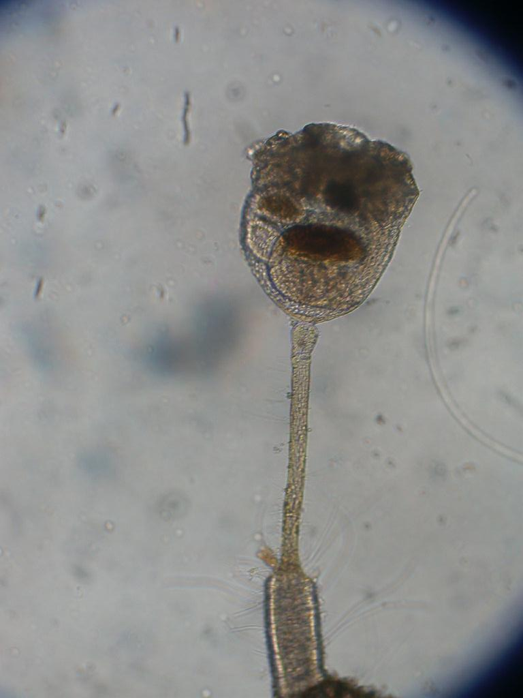
```

### Molluscs

[Mollusca](https://en.wikipedia.org/wiki/Mollusca) is the second-largest phylum of invertebrate animals after the Arthropoda. The members are known as molluscs or mollusks. Around 85,000 extant species of molluscs are recognized. The number of fossil species is estimated between 60,000 and 100,000 additional species. The proportion of undescribed species is very high. Many taxa remain poorly studied.

(ref:snai) [*Cornu aspersum* (formerly *Helix aspersa*) – a common land snail, a gastropod.](https://commons.wikimedia.org/wiki/File:Snail-wiki-120-Zachi-Evenor.jpg) 

```{r snail, fig.cap='(ref:snai)', echo=FALSE, message=FALSE, warning=FALSE}
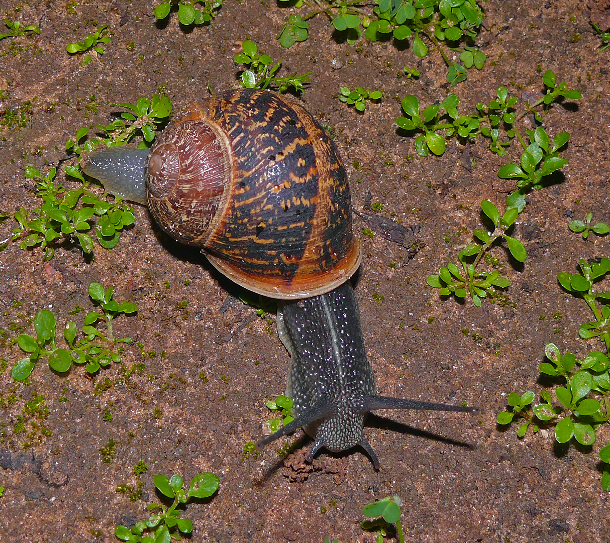
```

Molluscs are the largest marine phylum, comprising about 23% of all the named marine organisms. Numerous molluscs also live in freshwater and terrestrial habitats. They are highly diverse, not just in size and anatomical structure, but also in behaviour and habitat. The phylum is typically divided into 8 or 9 taxonomic classes, of which two are entirely extinct. Cephalopod molluscs, such as squid, cuttlefish, and octopuses, are among the most neurologically advanced of all invertebrates—and either the giant squid or the colossal squid is the largest known invertebrate species. The gastropods (snails and slugs) are by far the most numerous molluscs and account for 80% of the total classified species.

(ref:cuttle) [The common cuttlefish *Sepia officinalis*, a cephalopod.](https://commons.wikimedia.org/wiki/File:Washington_DC_Zoo_-_Sepia_officinalis_2.jpg)

```{r cuttlefish, fig.cap='(ref:cuttle)', echo=FALSE, message=FALSE, warning=FALSE}
knitr::include_graphics("./figures/animals/Washington_DC_Zoo_-_Sepia_officinalis_2.jpg")
```

The three most universal features defining modern molluscs are a mantle with a significant cavity used for breathing and excretion, the presence of a radula (except for bivalves), and the structure of the nervous system. Other than these common elements, molluscs express great morphological diversity, so many textbooks base their descriptions on a "hypothetical ancestral mollusc" (see image below). This has a single, "limpet-like" shell on top, which is made of proteins and chitin reinforced with calcium carbonate, and is secreted by a mantle covering the whole upper surface. The underside of the animal consists of a single muscular "foot". Although molluscs are coelomates, the coelom tends to be small. The main body cavity is a hemocoel through which blood circulates; as such, their circulatory systems are mainly open. The "generalized" mollusc's feeding system consists of a rasping "tongue", the radula, and a complex digestive system in which exuded mucus and microscopic, muscle-powered "hairs" called cilia play various important roles. The generalized mollusc has two paired nerve cords, or three in bivalves. The brain, in species that have one, encircles the esophagus. Most molluscs have eyes, and all have sensors to detect chemicals, vibrations, and touch. The simplest type of molluscan reproductive system relies on external fertilization, but more complex variations occur. Nearly all produce eggs, from which may emerge trochophore larvae, more complex veliger larvae, or miniature adults. The coelomic cavity is reduced. They have an open circulatory system and kidney-like organs for excretion.

(ref:bivalv) [*Argopecten irradians*, the Atlantic bay scallop, a bivalve.](https://commons.wikimedia.org/wiki/File:Argopecten_irradians.jpg) 

```{r bivalve, fig.cap='(ref:bivalv)', echo=FALSE, message=FALSE, warning=FALSE}
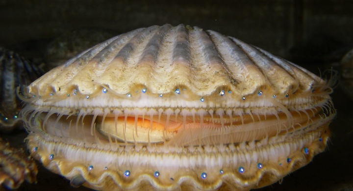
```

Good evidence exists for the appearance of gastropods, cephalopods, and bivalves in the Cambrian period, 541–485.4 million years ago. However, the evolutionary history both of molluscs' emergence from the ancestral Lophotrochozoa and of their diversification into the well-known living and fossil forms are still subjects of vigorous debate among scientists.

Fossilized ammonite displayed at the National Museum of the Philippines
Molluscs have been and still are an important food source for anatomically modern humans. A risk of food poisoning exists from toxins that can accumulate in certain molluscs under specific conditions, however, and because of this, many countries have regulations to reduce this risk. Molluscs have, for centuries, also been the source of important luxury goods, notably pearls, mother of pearl, Tyrian purple dye, and sea silk. Their shells have also been used as money in some preindustrial societies.

Mollusc species can also represent hazards or pests for human activities. The bite of the blue-ringed octopus is often fatal, and that of Octopus apollyon causes inflammation that can last over a month. Stings from a few species of large tropical cone shells can also kill, but their sophisticated, though easily produced, venoms have become important tools in neurological research. Schistosomiasis (also known as bilharzia, bilharziosis, or snail fever) is transmitted to humans by water snail hosts, and affects about 200 million people. Snails and slugs can also be serious agricultural pests, and accidental or deliberate introduction of some snail species into new environments has seriously damaged some ecosystems.

```{r mollusca, out.width='75%', echo=FALSE, message=FALSE, warning=FALSE}
library(tidyverse)
library(printr)        
library(kableExtra)
setwd("~/Dropbox/R/biology-text-master")

moll <-  as_tibble(read.csv("data/mollusca.csv"))

knitr::kable(moll, col.names = c("Class", "Major organisms", "Described living species","Distribution"), digits = 2, align = 'lll', booktabs = TRUE, caption = "The commonly recognized classes of living molluscs.") %>% kable_styling(latex_options = c("striped", "hold_position"))
```

### Annelids

The [annelids](https://en.wikipedia.org/wiki/Annelid) (Annelida, from Latin anellus, "little ring"[a]), also known as the ringed worms or segmented worms, are a large phylum, with over 22,000 extant species including ragworms, earthworms, and leeches. The species exist in and have adapted to various ecologies – some in marine environments as distinct as tidal zones and hydrothermal vents, others in fresh water, and yet others in moist terrestrial environments.

(ref:annelid) [The earthworm *Lumbricus terrestris* is a representative of the annelids.](https://commons.wikimedia.org/wiki/File:Nerr0328.jpg) 

```{r annelidrep, fig.cap='(ref:annelid)', echo=FALSE, message=FALSE, warning=FALSE}
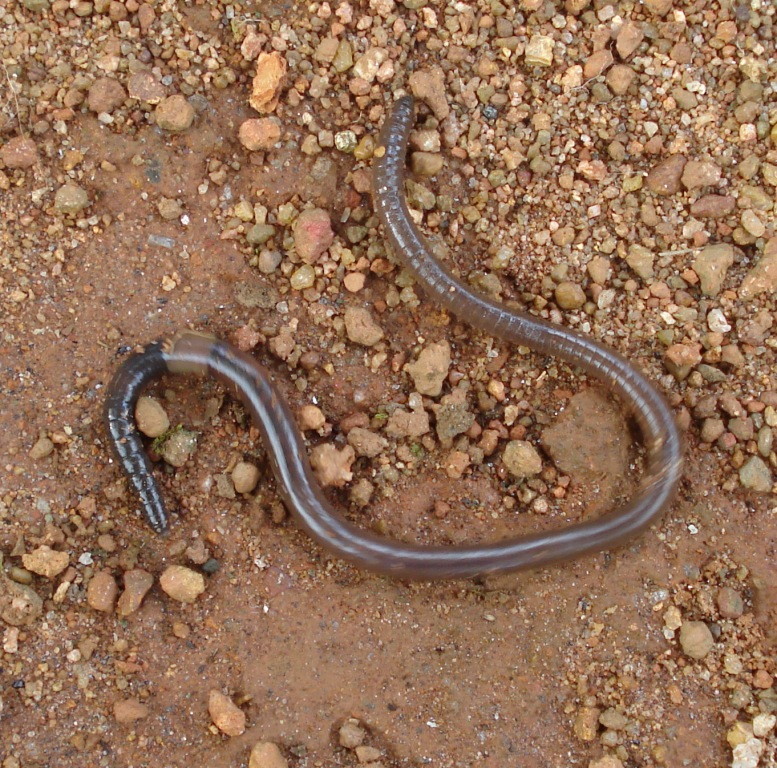
```

The Annelids are bilaterally symmetrical, triploblastic, coelomate, invertebrate organisms. They also have parapodia for locomotion. Most textbooks still use the traditional division into polychaetes (almost all marine), oligochaetes (which include earthworms) and leech-like species. Cladistic research since 1997 has radically changed this scheme, viewing leeches as a sub-group of oligochaetes and oligochaetes as a sub-group of polychaetes. In addition, the Pogonophora, Echiura and Sipuncula, previously regarded as separate phyla, are now regarded as sub-groups of polychaetes. Annelids are considered members of the Lophotrochozoa, a "super-phylum" of protostomes that also includes molluscs, brachiopods, and nemerteans.

(ref:lee) [The leech *Hirudo medicinalis* sucking blood.](https://commons.wikimedia.org/wiki/File:Sucking_leech.jpg) Although blood-letting is used less frequently by doctors, some leech species are regarded as endangered species because they have been over-harvested for this purpose in the last few centuries. 

```{r leech, fig.cap='(ref:lee)', echo=FALSE, message=FALSE, warning=FALSE}
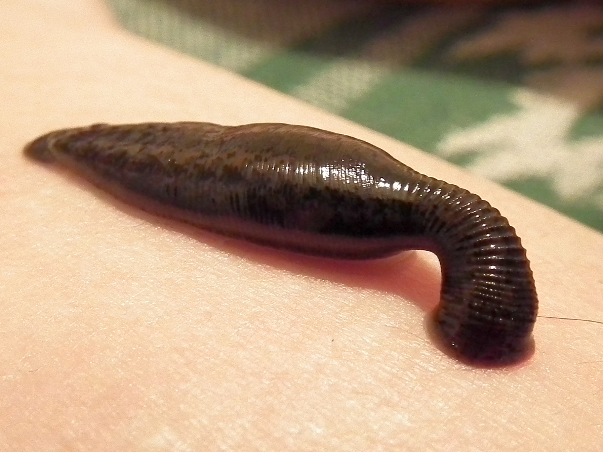
```

The basic annelid form consists of multiple segments. Each segment has the same sets of organs and, in most polychates, has a pair of parapodia that many species use for locomotion. Septa separate the segments of many species, but are poorly defined or absent in others, and Echiura and Sipuncula show no obvious signs of segmentation. In species with well-developed septa, the blood circulates entirely within blood vessels, and the vessels in segments near the front ends of these species are often built up with muscles that act as hearts. The septa of such species also enable them to change the shapes of individual segments, which facilitates movement by peristalsis ("ripples" that pass along the body) or by undulations that improve the effectiveness of the parapodia. In species with incomplete septa or none, the blood circulates through the main body cavity without any kind of pump, and there is a wide range of locomotory techniques – some burrowing species turn their pharynges inside out to drag themselves through the sediment.

Earthworms are oligochaetes that support terrestrial food chains both as prey and in some regions are important in aeration and enriching of soil. Oligochaetes have few setae (chaetae) or "bristles" on their outer body surfaces, and lack parapodia, unlike polychaeta. The body segments of polychaetes or bristle worms have a pair of fleshy protrusions called parapodia that bear many bristles, called chaetae, which are made of chitin. More than 10,000 species are described in this class. The burrowing of marine polychaetes, which may constitute up to a third of all species in near-shore environments, encourages the development of ecosystems by enabling water and oxygen to penetrate the sea floor. 

(ref:polychae) [*Nereis virens*, a polychaete annelid.](https://commons.wikimedia.org/wiki/File:Nereis_virens.jpg) These sandworms eat seaweed and microorganisms and can be longer than four feet.

```{r , fig.cap='(ref:)', echo=FALSE, message=FALSE, warning=FALSE}
knitr::include_graphics("./figures//")
```

Since annelids are soft-bodied, their fossils are rare – mostly jaws and the mineralized tubes that some of the species secreted. Although some late Ediacaran fossils may represent annelids, the oldest known fossil that is identified with confidence comes from about 518 million years ago in the early Cambrian period. Fossils of most modern mobile polychaete groups appeared by the end of the Carboniferous, about 299 million years ago. Palaeontologists disagree about whether some body fossils from the mid Ordovician, about 472 to 461 million years ago, are the remains of oligochaetes, and the earliest indisputable fossils of the group appear in the Tertiary period, which began 66 million years ago.

## Tissues, Organs And Organ Systems

In biology, tissue is a cellular organizational level between cells and a complete organ. A tissue is an ensemble of similar cells and their extracellular matrix from the same origin that together carry out a specific function. Organs are then formed by the functional grouping together of multiple tissues. The English word "tissue" derives from the French word "tissu", meaning that something that is "woven", from the verb tisser, "to weave".

An organ is a group of tissues with similar functions. Plant life and animal life rely on many organs that coexist in organ systems.

The study of human and animal tissues is known as histology or, in connection with disease, as histopathology. For plants, the discipline is called plant anatomy. The classical tools for studying tissues are the paraffin block in which tissue is embedded and then sectioned, the histological stain, and the optical microscope. Developments in electron microscopy, immunofluorescence, and the use of frozen tissue-sections have enhanced the detail that can be observed in tissues. With these tools, the classical appearances of tissues can be examined in health and disease, enabling considerable refinement of medical diagnosis and prognosis.

Animal tissues are grouped into four basic types: connective, muscle, nervous, and epithelial. Collections of tissues joined in units to serve a common function compose organs. While all animals can generally be considered to contain the four tissue types, the manifestation of these tissues can differ depending on the type of organism. For example, the origin of the cells comprising a particular tissue type may differ developmentally for different classifications of animals.

The epithelium in all animals is derived from the ectoderm and endoderm, with a small contribution from the mesoderm, forming the endothelium, a specialized type of epithelium that composes the vasculature. By contrast, a true epithelial tissue is present only in a single layer of cells held together via occluding junctions called tight junctions, to create a selectively permeable barrier. This tissue covers all organismal surfaces that come in contact with the external environment such as the skin, the airways, and the digestive tract. It serves functions of protection, secretion, and absorption, and is separated from other tissues below by a basal lamina.

### Epithelial tissue

The epithelial tissues are formed by cells that cover the organ surfaces, such as the surface of skin, the airways, surfaces of soft organs,the reproductive tract, and the inner lining of the digestive tract. The cells comprising an epithelial layer are linked via semi-permeable, tight junctions; hence, this tissue provides a barrier between the external environment and the organ it covers. In addition to this protective function, epithelial tissue may also be specialized to function in secretion, excretion and absorption. Epithelial tissue helps to protect organs from microorganisms, injury, and fluid loss.

Functions of epithelial tissue:

* The principle function of epithelial tissues are covering and lining of free surface
* The cells of the body's surface form the outer layer of skin.
* Inside the body, epithelial cells form the lining of the mouth and alimentary canal and protect these organs.
* Epithelial tissues help in absorption of water and nutrients.
* Epithelial tissues help in the elimination of waste.
* Epithelial tissues secrete enzymes and/or hormones in the form of glands.
* Some epithelial tissue perform secretory functions. They secrete a variety of substances including sweat, saliva, mucus, enzymes.

There are many kinds of epithelium, and nomenclature is somewhat variable. Most classification schemes combine a description of the cell-shape in the upper layer of the epithelium with a word denoting the number of layers: either simple (one layer of cells) or stratified (multiple layers of cells). However, other cellular features such as cilia may also be described in the classification system. Some common kinds of epithelium are listed below:

* Simple squamous epithelium
* Stratified squamous epithelium
* Simple cuboidal epithelium
* Transitional epithelium
* Pseudostratified columnar epithelium (also known as ciliated columnar epithelium)
* Columnar epithelium
* Glandular epithelium

(ref:epithelium) [Types of epithelia](https://commons.wikimedia.org/wiki/File:Illu_epithelium.jpg)

```{r epithelium, fig.cap='(ref:epithelium)', echo=FALSE, message=FALSE, warning=FALSE}
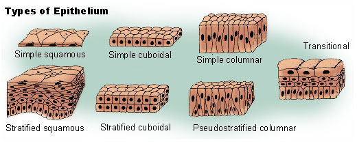
```

### Connective tissue

Connective tissues are fibrous tissues made up of cells separated by non-living material, which is called an extracellular matrix. This matrix can be liquid or rigid. For example, blood contains plasma as its matrix and bone's matrix is rigid. Connective tissue gives shape to organs and holds them in place. Blood, bone, tendon, ligament, adipose, and areolar tissues are examples of connective tissues. One method of classifying connective tissues is to divide them into three types: fibrous connective tissue, skeletal connective tissue, and fluid connective tissue.

### Muscular tissue

Muscle cells form the active contractile tissue of the body known as muscle tissue or muscular tissue. Muscle tissue functions to produce force and cause motion, either locomotion or movement within internal organs. Muscle tissue is separated into three distinct categories: visceral or smooth muscle, found in the inner linings of organs; skeletal muscle, typically attached to bones, which generate gross movement; and cardiac muscle, found in the heart, where it contracts to pump blood throughout an organism.

### Nervous tissue

Cells comprising the central nervous system and peripheral nervous system are classified as nervous (or neural) tissue. In the central nervous system, neural tissues form the brain and spinal cord. In the peripheral nervous system, neural tissues form the cranial nerves and spinal nerves, inclusive of the motor neurons.

A given organ's tissues can be broadly categorized as parenchyma, the tissue peculiar to (or at least archetypal of) the organ and that does the organ's specialized job, and stroma, the tissues with supportive, structural, connective, or ancillary functions. For example, in a gland, the tissue that makes the hormones is the parenchyma, whereas the stroma includes the nerves that innervate the parenchyma, the blood vessels that oxygenate and nourish it and carry away its metabolic wastes, and the connective tissues that provide a suitable place for it to be situated and anchored. The main tissues that make up an organ tend to have common embryologic origins, such as arising from the same germ layer. Functionally related organs often cooperate to form whole organ systems. Organs exist in most multicellular organisms. In single-celled organisms such as bacteria, the functional analogue of an organ is known as an organelle. In plants, there are three main organs. A hollow organ is an internal organ that forms a hollow tube, or pouch such as the stomach, intestine, or bladder.

In the study of anatomy, the term viscus refers to an internal organ. Viscera is the plural form.

The number of organs in any organism depends on which precise definition of the term one uses. By one widely used definition, 79 organs have been identified in the human body.

Two or more organs working together in the execution of a specific body function form an organ system, also called a biological system or body system. The functions of organ systems often share significant overlap. For instance, the nervous and endocrine system both operate via a shared organ, the hypothalamus. For this reason, the two systems are combined and studied as the neuroendocrine system. The same is true for the musculoskeletal system because of the relationship between the muscular and skeletal systems.

The organ level of organisation in animals can be first detected in flatworms and the more derived phyla. The less-advanced taxa (like Placozoa, Sponges and Radiata) do not show consolidation of their tissues into organs.

More complex animals are composed of different organs, which have been evolving over time. For example, the liver evolved in the stem vertebrates more than 500 million years ago, while the gut and brain are even more ancient, arising in the ancestor of vertebrates, insects, and worms more than 600 million years ago.

(ref:orgev) [Relationship of major animal lineages with indication of how long ago these animals shared a common ancestor. On the left, important organs are shown, which allows us to determine how long ago these may have evolved.](https://commons.wikimedia.org/wiki/File:Origin_of_major_organs_on_the_animal_phylogeny.jpg) 

```{r organevolution, fig.cap='(ref:orgev)', echo=FALSE, message=FALSE, warning=FALSE}
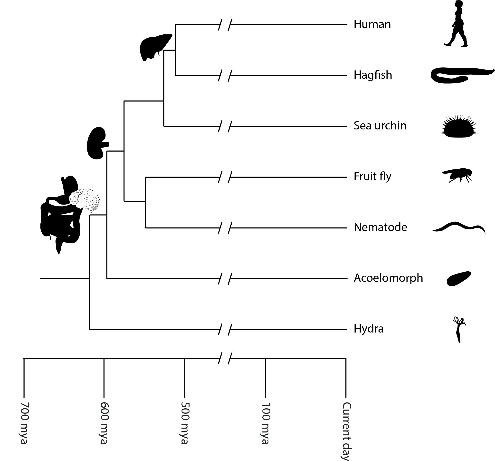
```

Given the ancient origin of most vertebrate organs, researchers have looked for model systems, where organs have evolved more recently, and ideally have evolved multiple times independently. An outstanding model for this kind of research is the placenta, which has evolved more than 100 times independently in vertebrates, has evolved relatively recently in some lineages, and exists in intermediate forms in extant taxa. Studies on the evolution of the placenta have identified a variety of genetic and physiological processes that contribute to the origin and evolution of organs, these include the re-purposing of existing animal tissues, the acquisition of new functional properties by these tissues, and novel interactions of distinct tissue types.

Bilateral animals have a variety of organ systems: 

* Cardiovascular system: pumping and channeling blood to and from the body and lungs with heart, blood and blood vessels.
* Digestive system: digestion and processing food with salivary glands, esophagus, stomach, liver, gallbladder, pancreas, intestines, colon, rectum and anus.
* Endocrine system: communication within the body using hormones made by endocrine glands such as the hypothalamus, pituitary gland, pineal body or pineal gland, thyroid, parathyroids and adrenals, i.e., adrenal glands.
* Excretory system: kidneys, ureters, bladder and urethra involved in fluid balance, electrolyte balance and excretion of urine.
* Lymphatic system: structures involved in the transfer of lymph between tissues and the blood stream, the lymph and the nodes and vessels that transport it including the Immune system: defending against disease-causing agents with leukocytes, tonsils, adenoids, thymus and spleen.
* Integumentary system: skin, hair and nails of mammals. Also scales of fish, reptiles, and birds, and feathers of birds.
* Muscular system: movement with muscles.
* Nervous system: collecting, transferring and processing information with brain, spinal cord and nerves.
* Reproductive system: the sex organs, such as ovaries, fallopian tubes, uterus, vulva, vagina, testes, vas deferens, seminal vesicles, prostate and penis.
* Respiratory system: the organs used for breathing, the pharynx, larynx, trachea, bronchi, lungs and diaphragm.
* Skeletal system: structural support and protection with bones, cartilage, ligaments and tendons.

(ref:humorg) [Selection of internal organs in human anatomy.](https://commons.wikimedia.org/wiki/File:Internal_organs.svg) 

```{r humanorgans, fig.cap='(ref:humorg)', echo=FALSE, message=FALSE, warning=FALSE}
knitr::include_graphics("./figures/animals/Internal_organs.svg")
```

### The Integumentary System

The [integumentary system](https://en.wikipedia.org/wiki/Integumentary_system) comprises the skin and its appendages acting to protect the body from various kinds of damage, such as loss of water or damages from outside. The integumentary system includes hair, scales, feathers, hooves, and nails. It has a variety of additional functions; it may serve to waterproof, and protect the deeper tissues, excrete wastes, and regulate body temperature, and is the attachment site for sensory receptors to detect pain, sensation, pressure, and temperature. In most land vertebrates with significant exposure to sunlight, the integumentary system also provides for vitamin D synthesis.

The skin is the largest organ of the body. In humans, it accounts for about 12 to 15 percent of total body weight and covers 1.5-2m2 of surface area.

The human skin (integument) is composed of at least two major layers of tissue: the epidermis and dermis. (The hypodermis or subcutaneous layer is not part of the skin[citation needed].) The epidermis is the outermost layer, providing the initial barrier to the external environment. It is separated from the dermis by the basement membrane. The epidermis contains melanocytes and gives color to the skin. The deepest layer of epidermis also contains nerve endings. Beneath this, the dermis comprises two sections, the papillary and reticular layers, and contains connective tissues, vessels, glands, follicles, hair roots, sensory nerve endings, and muscular tissue. The deepest layer, the hypodermis, is primarily made up of adipose tissue. Substantial collagen bundles anchor the dermis to the hypodermis in a way that permits most areas of the skin to move freely over the deeper tissue layers

(ref:skin) [Anatomy of human skin.](https://commons.wikimedia.org/wiki/File:Skin.jpg)

```{r skin, fig.cap='(ref:skin)', echo=FALSE, message=FALSE, warning=FALSE}
knitr::include_graphics("./figures/animals/Skin.png")
```

The epidermis is the top layer of skin made up of epithelial cells. It contains blood vessels. Its main functions are protection, absorption of nutrients, and homeostasis. In structure, it consists of a keratinized stratified squamous epithelium; four types of cells: keratinocytes, melanocytes, Merkel cells, and Langerhans cells. The major cell of the epidermis is the keratinocyte, which produces keratin, a fibrous protein that aids in skin protection. An overwhelming amount of keratin can cause disease by giving rise to eruptions from the skin that will protrude outwards and lead to infection.[citation needed] Keratin is also a waterproofing protein. Millions of dead keratinocytes rub off daily. The majority of the skin on the body is keratinized. The only skin on the body that is non-keratinized is the lining of mucous membranes, such as the inside of the mouth. Non-keratinized cells allow water to "stay" atop the structure.

The protein keratin stiffens epidermal tissue to form fingernails. Nails grow from a thin area called the nail matrix at an average of 1 mm per week. The lunula is the crescent-shape area at the base of the nail, lighter in color as it mixes with matrix cells. Also, the stratum corneum is the top part of the epidermis.

The dermis is the middle layer of skin, composed of dense irregular connective tissue and areolar connective tissue such as a collagen with elastin arranged in a diffusely bundled and woven pattern. The dermis has two layers. One is the papillary layer which is the superficial layer and consists of the areolar connective tissue. The other is the reticular layer which is the deep layer of the dermis and consists of the dense irregular connective tissue. These layers serve to give elasticity to the integument, allowing stretching and conferring flexibility, while also resisting distortions, wrinkling, and sagging. The dermal layer provides a site for the endings of blood vessels and nerves. Many chromatophores are also stored in this layer, as are the bases of integumental structures such as hair, feathers, and glands.

The hypodermis, otherwise known as the subcutaneous layer, is a layer beneath the skin. It invaginates into the dermis and is attached to the latter, immediately above it, by collagen and elastin fibers. It is essentially composed of a type of cell known as adipocytes specialized in accumulating and storing fats. These cells are grouped together in lobules separated by connective tissue.

The hypodermis acts as an energy reserve. The fats contained in the adipocytes can be put back into circulation, via the venous route, during intense effort or when there is a lack of energy-providing substances, and are then transformed into energy. The hypodermis participates, passively at least, in thermoregulation since fat is a heat insulator.

The integumentary system has multiple roles in maintaining the body's equilibrium. All body systems work in an interconnected manner to maintain the internal conditions essential to the function of the body. The skin has an important job of protecting the body and acts as the body's first line of defense against infection, temperature change, and other challenges to homeostasis. Functions include:

* Protect the body's internal living tissues and organs
* Protect against invasion by infectious organisms
* Protect the body from dehydration
* Protect the body against abrupt changes in temperature, maintain homeostasis
* Help excrete waste materials through perspiration
* Act as a receptor for touch, pressure, pain, heat, and cold (see Somatosensory system)
* Protect the body against sunburns by secreting melanin
* Generate vitamin D through exposure to ultraviolet light
* Store water, fat, glucose, vitamin D
* Maintenance of the body form
* Formation of new cells from stratum germinativum to repair minor injuries
* Protect from UV rays.
* Regulates body temperature

It distinguishes, separates, and protects the organism from its surroundings. Small-bodied invertebrates of aquatic or continually moist habitats respire using the outer layer (integument). This gas exchange system, where gases simply diffuse into and out of the interstitial fluid, is called integumentary exchange.

## Human evolution

[Human evolution](https://en.wikipedia.org/wiki/Human_evolution) is the evolutionary process that led to the emergence of anatomically modern humans, beginning with the evolutionary history of primates—in particular genus Homo—and leading to the emergence of *Homo sapiens* as a distinct species of the hominid family, which includes the great apes. This process involved the gradual development of traits such as human bipedalism and language, as well as interbreeding with other hominins, which indicate that human evolution was not linear but a web.

(ref:hominidae) [All extant species of hominid:](https://commons.wikimedia.org/wiki/File:Hominidae_(extant_species).jpg) Top) Human, Middle) Common chimpanzee, bonobo, western gorilla & eastern gorilla, Bottom) Bornean, Sumatran & Tapanuli orangutan]

```{r extanthomonidae, fig.cap='(ref:hominidae)', echo=FALSE, message=FALSE, warning=FALSE}
knitr::include_graphics("./figures/animals/Hominidae_(extant_species).jpg")
```

The study of human evolution involves several scientific disciplines, including physical anthropology, primatology, archaeology, paleontology, neurobiology, ethology, linguistics, evolutionary psychology, embryology and genetics. Genetic studies show that primates diverged from other mammals about 85 million years ago, in the Late Cretaceous period, and the earliest fossils appear in the Paleocene, around 55 million years ago.

Within the superfamily Hominoidea, the family [Hominidae](https://en.wikipedia.org/wiki/Hominidae) diverged from the family Hylobatidae some 15–20 million years ago; subfamily Homininae (African apes) diverged from Ponginae (orangutans) about 14 million years ago; the tribe Hominini (including humans, Australopithecus, and chimpanzees) parted from the tribe Gorillini (gorillas) between 8–9 million years ago; and, in turn, the subtribes Hominina (humans and extinct biped ancestors) and Panina (chimpanzees) separated 4–7 million years ago.

(ref:homphylo) [Model of the phylogeny of Hominidae, with adjacent branches of Hominoidea, over the past 20 million years.](https://commons.wikimedia.org/wiki/File:Hominoidea_lineage.svg)

```{r phylogenyhominidae, fig.cap='(ref:homphylo)', echo=FALSE, message=FALSE, warning=FALSE}
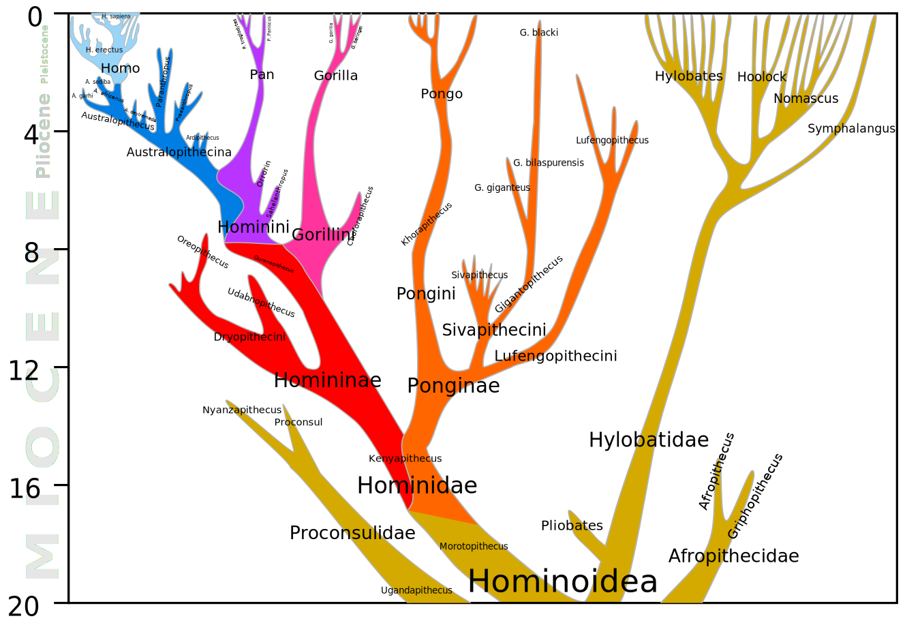
```

Human evolution from its first separation from the last common ancestor of humans and chimpanzees is characterized by a number of morphological, developmental, physiological, and behavioral changes. The most significant of these adaptations are bipedalism, increased brain size, lengthened ontogeny (gestation and infancy), and decreased sexual dimorphism. The relationship between these changes is the subject of ongoing debate. Other significant morphological changes included the evolution of a power and precision grip, a change first occurring in H. erectus.

Bipedalism is the basic adaptation of the hominid and is considered the main cause behind a suite of skeletal changes shared by all bipedal hominids. The earliest hominin, of presumably primitive bipedalism, is considered to be either Sahelanthropus or Orrorin, both of which arose some 6 to 7 million years ago. The non-bipedal knuckle-walkers, the gorillas and chimpanzees, diverged from the hominin line over a period covering the same time, so either Sahelanthropus or Orrorin may be our last shared ancestor. Ardipithecus, a full biped, arose approximately 5.6 million years ago.

(ref:skelcomp) [From Thomas Huxley's 1863 Evidence as to Man's Place in Nature, the compared skeletons of apes to humans.](https://commons.wikimedia.org/wiki/File:Huxley_-_Mans_Place_in_Nature.jpg) 

```{r skeletoncomparison, fig.cap='(ref:skelcomp)', echo=FALSE, message=FALSE, warning=FALSE}
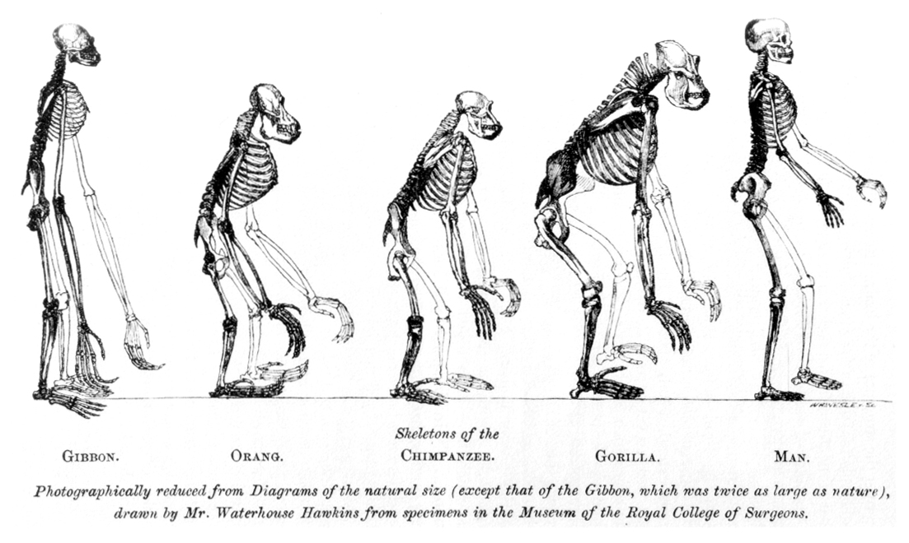
```

The early bipeds eventually evolved into the australopithecines and still later into the genus Homo. There are several theories of the adaptation value of bipedalism. It is possible that bipedalism was favored because it freed the hands for reaching and carrying food, saved energy during locomotion, enabled long-distance running and hunting, provided an enhanced field of vision, and helped avoid hyperthermia by reducing the surface area exposed to direct sun; features all advantageous for thriving in the new savanna and woodland environment created as a result of the East African Rift Valley uplift versus the previous closed forest habitat. A 2007 study provides support for the hypothesis that walking on two legs, or bipedalism, evolved because it used less energy than quadrupedal knuckle-walking. However, recent studies suggest that bipedality without the ability to use fire would not have allowed global dispersal. This change in gait saw a lengthening of the legs proportionately when compared to the length of the arms, which were shortened through the removal of the need for brachiation. Another change is the shape of the big toe. Recent studies suggest that australopithecines still lived part of the time in trees as a result of maintaining a grasping big toe. This was progressively lost in habilines.

Anatomically, the evolution of bipedalism has been accompanied by a large number of skeletal changes, not just to the legs and pelvis, but also to the vertebral column, feet and ankles, and skull. The femur evolved into a slightly more angular position to move the center of gravity toward the geometric center of the body. The knee and ankle joints became increasingly robust to better support increased weight. To support the increased weight on each vertebra in the upright position, the human vertebral column became S-shaped and the lumbar vertebrae became shorter and wider. In the feet the big toe moved into alignment with the other toes to help in forward locomotion. The arms and forearms shortened relative to the legs making it easier to run. The foramen magnum migrated under the skull and more anterior.

The most significant changes occurred in the pelvic region, where the long downward facing iliac blade was shortened and widened as a requirement for keeping the center of gravity stable while walking; bipedal hominids have a shorter but broader, bowl-like pelvis due to this. A drawback is that the birth canal of bipedal apes is smaller than in knuckle-walking apes, though there has been a widening of it in comparison to that of australopithecine and modern humans, permitting the passage of newborns due to the increase in cranial size but this is limited to the upper portion, since further increase can hinder normal bipedal movement.

The shortening of the pelvis and smaller birth canal evolved as a requirement for bipedalism and had significant effects on the process of human birth which is much more difficult in modern humans than in other primates. During human birth, because of the variation in size of the pelvic region, the fetal head must be in a transverse position (compared to the mother) during entry into the birth canal and rotate about 90 degrees upon exit. The smaller birth canal became a limiting factor to brain size increases in early humans and prompted a shorter gestation period leading to the relative immaturity of human offspring, who are unable to walk much before 12 months and have greater neoteny, compared to other primates, who are mobile at a much earlier age. The increased brain growth after birth and the increased dependency of children on mothers had a major effect upon the female reproductive cycle, and the more frequent appearance of alloparenting in humans when compared with other hominids. Delayed human sexual maturity also led to the evolution of menopause with one explanation providing that elderly women could better pass on their genes by taking care of their daughter's offspring, as compared to having more children of their own.

The human species eventually developed a much larger brain than that of other primates—typically 1,330 cm^3^ (81 cu in) in modern humans, nearly three times the size of a chimpanzee or gorilla brain. After a period of stasis with Australopithecus anamensis and Ardipithecus, species which had smaller brains as a result of their bipedal locomotion, the pattern of encephalization started with Homo habilis, whose 600 cm^3^ (37 cu in) brain was slightly larger than that of chimpanzees. This evolution continued in Homo erectus with 800–1,100 cm^3^ (49–67 cu in), and reached a maximum in Neanderthals with 1,200–1,900 cm^3^ (73–116 cu in), larger even than modern Homo sapiens. This brain increase manifested during postnatal brain growth, far exceeding that of other apes (heterochrony). It also allowed for extended periods of social learning and language acquisition in juvenile humans, beginning as much as 2 million years ago.

Furthermore, the changes in the structure of human brains may be even more significant than the increase in size.

The temporal lobes, which contain centers for language processing, have increased disproportionately, as has the prefrontal cortex, which has been related to complex decision-making and moderating social behavior. Encephalization has been tied to increased meat and starches in the diet, and the development of cooking, and it has been proposed that intelligence increased as a response to an increased necessity for solving social problems as human society became more complex. Changes in skull morphology, such as smaller mandibles and mandible muscle attachments, allowed more room for the brain to grow.

The increase in volume of the neocortex also included a rapid increase in size of the cerebellum. Its function has traditionally been associated with balance and fine motor control, but more recently with speech and cognition. The great apes, including hominids, had a more pronounced cerebellum relative to the neocortex than other primates. It has been suggested that because of its function of sensory-motor control and learning complex muscular actions, the cerebellum may have underpinned human technological adaptations, including the preconditions of speech.

The immediate survival advantage of encephalization is difficult to discern, as the major brain changes from Homo erectus to Homo heidelbergensis were not accompanied by major changes in technology. It has been suggested that the changes were mainly social and behavioural, including increased empathic abilities, increases in size of social groups, and increased behavioural plasticity. Encephalization may be due to a dependency on calorie-dense, difficult-to-acquire food.

The reduced degree of sexual dimorphism in humans is visible primarily in the reduction of the male canine tooth relative to other ape species (except gibbons) and reduced brow ridges and general robustness of males. Another important physiological change related to sexuality in humans was the evolution of hidden estrus. Humans are the only hominoids in which the female is fertile year round and in which no special signals of fertility are produced by the body (such as genital swelling or overt changes in proceptivity during estrus).

Nonetheless, humans retain a degree of sexual dimorphism in the distribution of body hair and subcutaneous fat, and in the overall size, males being around 15% larger than females. These changes taken together have been interpreted as a result of an increased emphasis on pair bonding as a possible solution to the requirement for increased parental investment due to the prolonged infancy of offspring.

The ulnar opposition—the contact between the thumb and the tip of the little finger of the same hand—is unique to the genus Homo, including Neanderthals, the Sima de los Huesos hominins and anatomically modern humans. In other primates, the thumb is short and unable to touch the little finger. The ulnar opposition facilitates the precision grip and power grip of the human hand, underlying all the skilled manipulations.

A number of other changes have also characterized the evolution of humans, among them an increased importance on vision rather than smell; a longer juvenile developmental period and higher infant dependency; a smaller gut; faster basal metabolism; loss of body hair; evolution of sweat glands; a change in the shape of the dental arcade from being u-shaped to being parabolic; development of a chin (found in *Homo sapiens* alone); development of styloid processes; and the development of a descended larynx.

The word homo, the name of the biological genus to which humans belong, is Latin for "human". It was chosen originally by Carl Linnaeus in his classification system. The word "human" is from the Latin humanus, the adjectival form of homo. The Latin "homo" derives from the Indo-European root \*dhghem, or "earth". Linnaeus and other scientists of his time also considered the great apes to be the closest relatives of humans based on morphological and anatomical similarities.

The possibility of linking humans with earlier apes by descent became clear only after 1859 with the publication of Charles Darwin's On the Origin of Species, in which he argued for the idea of the evolution of new species from earlier ones. Darwin's book did not address the question of human evolution, saying only that "Light will be thrown on the origin of man and his history."

The first debates about the nature of human evolution arose between Thomas Henry Huxley and Richard Owen. Huxley argued for human evolution from apes by illustrating many of the similarities and differences between humans and apes, and did so particularly in his 1863 book Evidence as to Man's Place in Nature. However, many of Darwin's early supporters (such as Alfred Russel Wallace and Charles Lyell) did not initially agree that the origin of the mental capacities and the moral sensibilities of humans could be explained by natural selection, though this later changed. Darwin applied the theory of evolution and sexual selection to humans when he published The Descent of Man in 1871.

A major problem in the 19th century was the lack of fossil intermediaries. Neanderthal remains were discovered in a limestone quarry in 1856, three years before the publication of On the Origin of Species, and Neanderthal fossils had been discovered in Gibraltar even earlier, but it was originally claimed that these were human remains of a creature suffering some kind of illness. Despite the 1891 discovery by Eugène Dubois of what is now called Homo erectus at Trinil, Java, it was only in the 1920s when such fossils were discovered in Africa, that intermediate species began to accumulate. In 1925, Raymond Dart described Australopithecus africanus. The type specimen was the Taung Child, an australopithecine infant which was discovered in a cave. The child's remains were a remarkably well-preserved tiny skull and an endocast of the brain.

Although the brain was small (410 cm^3^), its shape was rounded, unlike that of chimpanzees and gorillas, and more like a modern human brain. Also, the specimen showed short canine teeth, and the position of the foramen magnum (the hole in the skull where the spine enters) was evidence of bipedal locomotion. All of these traits convinced Dart that the Taung Child was a bipedal human ancestor, a transitional form between apes and humans.

During the 1960s and 1970s, hundreds of fossils were found in East Africa in the regions of the Olduvai Gorge and Lake Turkana. These searches were carried out by the Leakey family, with Louis Leakey and his wife Mary Leakey, and later their son Richard and daughter-in-law Meave, fossil hunters and paleoanthropologists. From the fossil beds of Olduvai and Lake Turkana they amassed specimens of the early hominins: the australopithecines and Homo species, and even Homo erectus.

These finds cemented Africa as the cradle of humankind. In the late 1970s and the 1980s, Ethiopia emerged as the new hot spot of paleoanthropology after "Lucy", the most complete fossil member of the species Australopithecus afarensis, was found in 1974 by Donald Johanson near Hadar in the desertic Afar Triangle region of northern Ethiopia. Although the specimen had a small brain, the pelvis and leg bones were almost identical in function to those of modern humans, showing with certainty that these hominins had walked erect. Lucy was classified as a new species, Australopithecus afarensis, which is thought to be more closely related to the genus Homo as a direct ancestor, or as a close relative of an unknown ancestor, than any other known hominid or hominin from this early time range; see terms "hominid" and "hominin". (The specimen was nicknamed "Lucy" after the Beatles' song "Lucy in the Sky with Diamonds", which was played loudly and repeatedly in the camp during the excavations.) The Afar Triangle area would later yield discovery of many more hominin fossils, particularly those uncovered or described by teams headed by Tim D. White in the 1990s, including Ardipithecus ramidus and Ardipithecus kadabba.

In 2013, fossil skeletons of Homo naledi, an extinct species of hominin assigned (provisionally) to the genus Homo, were found in the Rising Star Cave system, a site in South Africa's Cradle of Humankind region in Gauteng province near Johannesburg. As of September 2015, fossils of at least fifteen individuals, amounting to 1,550 specimens, have been excavated from the cave. The species is characterized by a body mass and stature similar to small-bodied human populations, a smaller endocranial volume similar to Australopithecus, and a cranial morphology (skull shape) similar to early Homo species. The skeletal anatomy combines primitive features known from australopithecines with features known from early hominins. The individuals show signs of having been deliberately disposed of within the cave near the time of death. The fossils were dated close to 250,000 years ago, and thus are not a direct ancestor but a contemporary with the first appearance of larger-brained anatomically modern humans.

The genetic revolution in studies of human evolution started when Vincent Sarich and Allan Wilson measured the strength of immunological cross-reactions of blood serum albumin between pairs of creatures, including humans and African apes (chimpanzees and gorillas). The strength of the reaction could be expressed numerically as an immunological distance, which was in turn proportional to the number of amino acid differences between homologous proteins in different species. By constructing a calibration curve of the ID of species' pairs with known divergence times in the fossil record, the data could be used as a molecular clock to estimate the times of divergence of pairs with poorer or unknown fossil records.

In their seminal 1967 paper in Science, Sarich and Wilson estimated the divergence time of humans and apes as four to five million years ago, at a time when standard interpretations of the fossil record gave this divergence as at least 10 to as much as 30 million years. Subsequent fossil discoveries, notably "Lucy", and reinterpretation of older fossil materials, notably Ramapithecus, showed the younger estimates to be correct and validated the albumin method.

Progress in DNA sequencing, specifically mitochondrial DNA (mtDNA) and then Y-chromosome DNA (Y-DNA) advanced the understanding of human origins. Application of the molecular clock principle revolutionized the study of molecular evolution.

On the basis of a separation from the orangutan between 10 and 20 million years ago, earlier studies of the molecular clock suggested that there were about 76 mutations per generation that were not inherited by human children from their parents; this evidence supported the divergence time between hominins and chimpanzees noted above. However, a 2012 study in Iceland of 78 children and their parents suggests a mutation rate of only 36 mutations per generation; this datum extends the separation between humans and chimpanzees to an earlier period greater than 7 million years ago (Ma). Additional research with 226 offspring of wild chimpanzee populations in eight locations suggests that chimpanzees reproduce at age 26.5 years on average; which suggests the human divergence from chimpanzees occurred between 7 and 13 million years ago. And these data suggest that Ardipithecus (4.5 Ma), Orrorin (6 Ma) and Sahelanthropus (7 Ma) all may be on the hominid lineage, and even that the separation may have occurred outside the East African Rift region.

Furthermore, analysis of the two species' genes in 2006 provides evidence that after human ancestors had started to diverge from chimpanzees, interspecies mating between "proto-human" and "proto-chimpanzees" nonetheless occurred regularly enough to change certain genes in the new gene pool:

A new comparison of the human and chimpanzee genomes suggests that after the two lineages separated, they may have begun interbreeding... A principal finding is that the X chromosomes of humans and chimpanzees appear to have diverged about 1.2 million years more recently than the other chromosomes.

The research suggests:

There were in fact two splits between the human and chimpanzee lineages, with the first being followed by interbreeding between the two populations and then a second split. The suggestion of a hybridization has startled paleoanthropologists, who nonetheless are treating the new genetic data seriously.

In the 1990s, several teams of paleoanthropologists were working throughout Africa looking for evidence of the earliest divergence of the hominin lineage from the great apes. In 1994, Meave Leakey discovered Australopithecus anamensis. The find was overshadowed by Tim D. White's 1995 discovery of Ardipithecus ramidus, which pushed back the fossil record to 4.2 million years ago.

In 2000, Martin Pickford and Brigitte Senut discovered, in the Tugen Hills of Kenya, a 6-million-year-old bipedal hominin which they named Orrorin tugenensis. And in 2001, a team led by Michel Brunet discovered the skull of Sahelanthropus tchadensis which was dated as 7.2 million years ago, and which Brunet argued was a bipedal, and therefore a hominid—that is, a hominin (cf Hominidae; terms "hominids" and hominins).

### Human Dispersal

Anthropologists in the 1980s were divided regarding some details of reproductive barriers and migratory dispersals of the genus Homo. Subsequently, genetics has been used to investigate and resolve these issues. According to the Sahara pump theory evidence suggests that the genus Homo have migrated out of Africa at least three and possibly four times (e.g. Homo erectus, Homo heidelbergensis and two or three times for Homo sapiens). Recent evidence suggests these dispersals are closely related to fluctuating periods of climate change.

(ref:humevo) [A model of the evolution of the genus Homo](https://en.wikipedia.org/wiki/Human_evolution#/media/File:Homo_lineage_2017update.svg) over the last 2 million years (vertical axis). The rapid "Out of Africa" expansion of H. sapiens is indicated at the top of the diagram, with admixture indicated with Neanderthals, Denisovans, and unspecified archaic African hominins. Late survival of robust australopithecines (Paranthropus) alongside Homo until 1.2 Mya is indicated in purple.

```{r humanevolution, fig.cap='(ref:humevo)', echo=FALSE, message=FALSE, warning=FALSE}
knitr::include_graphics("./figures/animals/Homo_lineage_2017update.svg")
```

Recent evidence suggests that humans may have left Africa half a million years earlier than previously thought. A joint Franco-Indian team has found human artifacts in the Siwalk Hills north of New Delhi dating back at least 2.6 million years. This is earlier than the previous earliest finding of genus Homo at Dmanisi, in Georgia, dating to 1.85 million years. Although controversial, tools found at a Chinese cave strengthen the case that humans used tools as far back as 2.48 million years ago. This suggests that the Asian "Chopper" tool tradition, found in Java and northern China may have left Africa before the appearance of the Acheulian hand axe.

Up until the genetic evidence became available, there were two dominant models for the dispersal of modern humans. The multiregional hypothesis proposed that the genus Homo contained only a single interconnected population as it does today (not separate species), and that its evolution took place worldwide continuously over the last couple of million years. This model was proposed in 1988 by Milford H. Wolpoff. In contrast, the "out of Africa" model proposed that modern H. sapiens speciated in Africa recently (that is, approximately 200,000 years ago) and the subsequent migration through Eurasia resulted in the nearly complete replacement of other Homo species. This model has been developed by Chris B. Stringer and Peter Andrews.

Sequencing mtDNA and Y-DNA sampled from a wide range of indigenous populations revealed ancestral information relating to both male and female genetic heritage, and strengthened the "out of Africa" theory and weakened the views of multiregional evolutionism. Aligned in genetic tree differences were interpreted as supportive of a recent single origin. Analyses have shown a greater diversity of DNA patterns throughout Africa, consistent with the idea that Africa is the ancestral home of mitochondrial Eve and Y-chromosomal Adam, and that modern human dispersal out of Africa has only occurred over the last 55,000 years.

"Out of Africa" has thus gained much support from research using female mitochondrial DNA and the male Y chromosome. After analysing genealogy trees constructed using 133 types of mtDNA, researchers concluded that all were descended from a female African progenitor, dubbed Mitochondrial Eve. "Out of Africa" is also supported by the fact that mitochondrial genetic diversity is highest among African populations.

A broad study of African genetic diversity, headed by Sarah Tishkoff, found the San people had the greatest genetic diversity among the 113 distinct populations sampled, making them one of 14 "ancestral population clusters". The research also located a possible origin of modern human migration in southwestern Africa, near the coastal border of Namibia and Angola. The fossil evidence was insufficient for archaeologist Richard Leakey to resolve the debate about exactly where in Africa modern humans first appeared. Studies of haplogroups in Y-chromosomal DNA and mitochondrial DNA have largely supported a recent African origin. All the evidence from autosomal DNA also predominantly supports a Recent African origin. However, evidence for archaic admixture in modern humans, both in Africa and later, throughout Eurasia has recently been suggested by a number of studies.

Recent sequencing of Neanderthal and Denisovan genomes shows that some admixture with these populations has occurred. All modern human groups outside Africa have 1–4% or (according to more recent research) about 1.5-2.6% Neanderthal alleles in their genome, and some Melanesians have an additional 4–6% of Denisovan alleles. These new results do not contradict the "out of Africa" model, except in its strictest interpretation, although they make the situation more complex. After recovery from a genetic bottleneck that some researchers speculate might be linked to the Toba supervolcano catastrophe, a fairly small group left Africa and interbred with Neanderthals, probably in the Middle East, on the Eurasian steppe or even in North Africa before their departure. Their still predominantly African descendants spread to populate the world. A fraction in turn interbred with Denisovans, probably in southeastern Asia, before populating Melanesia. HLA haplotypes of Neanderthal and Denisova origin have been identified in modern Eurasian and Oceanian populations. The Denisovan EPAS1 gene has also been found in Tibetan populations. Studies of the human genome using machine learning have identified additional genetic contributions in Eurasians from an "unknown" ancestral population potentially related to the Neanderthal-Denisovan lineage.

(ref:neander) [Dermoplastic reconstruction of a Neanderthal](https://commons.wikimedia.org/wiki/File:Neandertaler_reconst.jpg) 

```{r neanderthal, fig.cap='(ref:neander)', echo=FALSE, message=FALSE, warning=FALSE}
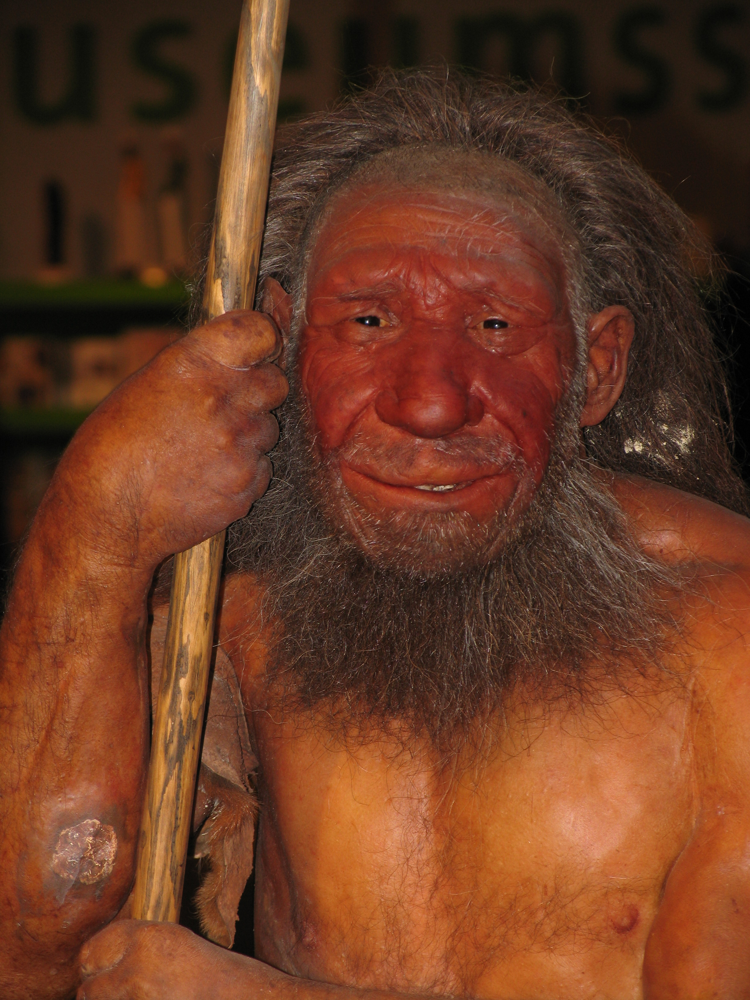
```

There are still differing theories on whether there was a single exodus from Africa or several. A multiple dispersal model involves the Southern Dispersal theory, which has gained support in recent years from genetic, linguistic and archaeological evidence. In this theory, there was a coastal dispersal of modern humans from the Horn of Africa crossing the Bab el Mandib to Yemen at a lower sea level around 70,000 years ago. This group helped to populate Southeast Asia and Oceania, explaining the discovery of early human sites in these areas much earlier than those in the Levant. This group seems to have been dependent upon marine resources for their survival.

Recent genetic evidence suggests that all modern non-African populations, including those of Eurasia and Oceania, are descended from a single wave that left Africa between 65,000 and 50,000 years ago.

### Evidence of Human Evolution

The evidence on which scientific accounts of human evolution are based comes from many fields of natural science. The main source of knowledge about the evolutionary process has traditionally been the fossil record, but since the development of genetics beginning in the 1970s, DNA analysis has come to occupy a place of comparable importance. The studies of ontogeny, phylogeny and especially evolutionary developmental biology of both vertebrates and invertebrates offer considerable insight into the evolution of all life, including how humans evolved. The specific study of the origin and life of humans is anthropology, particularly paleoanthropology which focuses on the study of human prehistory.

The closest living relatives of humans are bonobos and chimpanzees (both genus Pan) and gorillas (genus Gorilla). With the sequencing of both the human and chimpanzee genome, as of 2012 estimates of the similarity between their DNA sequences range between 95% and 99%. By using the technique called the molecular clock which estimates the time required for the number of divergent mutations to accumulate between two lineages, the approximate date for the split between lineages can be calculated.

The gibbons (family Hylobatidae) and then the orangutans (genus Pongo) were the first groups to split from the line leading to the hominins, including humans—followed by gorillas (genus Gorilla), and, ultimately, by the chimpanzees (genus Pan). The splitting date between hominin and chimpanzee lineages is placed by some between 4 to 8 million years ago, that is, during the Late Miocene. Speciation, however, appears to have been unusually drawn out. Initial divergence occurred sometime between 7 to 13 million years ago, but ongoing hybridization blurred the separation and delayed complete separation during several millions of years. Patterson (2006) dated the final divergence at 5 to 6 million years ago.

Genetic evidence has also been employed to resolve the question of whether there was any gene flow between early modern humans and Neanderthals, and to enhance our understanding of the early human migration patterns and splitting dates. By comparing the parts of the genome that are not under natural selection and which therefore accumulate mutations at a fairly steady rate, it is possible to reconstruct a genetic tree incorporating the entire human species since the last shared ancestor.

Each time a certain mutation (single-nucleotide polymorphism) appears in an individual and is passed on to his or her descendants, a haplogroup is formed including all of the descendants of the individual who will also carry that mutation. By comparing mitochondrial DNA which is inherited only from the mother, geneticists have concluded that the last female common ancestor whose genetic marker is found in all modern humans, the so-called mitochondrial Eve, must have lived around 200,000 years ago.

Human evolutionary genetics studies how one human genome differs from the other, the evolutionary past that gave rise to it, and its current effects. Differences between genomes have anthropological, medical and forensic implications and applications. Genetic data can provide important insight into human evolution.

There is little fossil evidence for the divergence of the gorilla, chimpanzee and hominin lineages. The earliest fossils that have been proposed as members of the hominin lineage are Sahelanthropus tchadensis dating from 7 million years ago, Orrorin tugenensis dating from 5.7 million years ago, and Ardipithecus kadabba dating to 5.6 million years ago. Each of these have been argued to be a bipedal ancestor of later hominins but, in each case, the claims have been contested. It is also possible that one or more of these species are ancestors of another branch of African apes, or that they represent a shared ancestor between hominins and other apes.

The question then of the relationship between these early fossil species and the hominin lineage is still to be resolved. From these early species, the australopithecines arose around 4 million years ago and diverged into robust (also called Paranthropus) and gracile branches, one of which (possibly A. garhi) probably went on to become ancestors of the genus Homo. The australopithecine species that is best represented in the fossil record is Australopithecus afarensis with more than 100 fossil individuals represented, found from Northern Ethiopia (such as the famous "Lucy"), to Kenya, and South Africa. Fossils of robust australopithecines such as Au. robustus (or alternatively Paranthropus robustus) and Au./P. boisei are particularly abundant in South Africa at sites such as Kromdraai and Swartkrans, and around Lake Turkana in Kenya.

The earliest member of the genus Homo is Homo habilis which evolved around 2.8 million years ago. Homo habilis is the first species for which we have positive evidence of the use of stone tools. They developed the Oldowan lithic technology, named after the Olduvai Gorge in which the first specimens were found. Some scientists consider Homo rudolfensis, a larger bodied group of fossils with similar morphology to the original H. habilis fossils, to be a separate species, while others consider them to be part of H. habilis—simply representing intraspecies variation, or perhaps even sexual dimorphism. The brains of these early hominins were about the same size as that of a chimpanzee, and their main adaptation was bipedalism as an adaptation to terrestrial living.

During the next million years, a process of encephalization began and, by the arrival (about 1.9 million years ago) of Homo erectus in the fossil record, cranial capacity had doubled. Homo erectus were the first of the hominins to emigrate from Africa, and, from 1.8 to 1.3 million years ago, this species spread through Africa, Asia, and Europe. One population of H. erectus, also sometimes classified as a separate species Homo ergaster, remained in Africa and evolved into Homo sapiens. It is believed that these species, H. erectus and H. ergaster, were the first to use fire and complex tools.

(ref:ergaster) [Replica of fossil skull of Homo ergaster (African Homo erectus). Fossil number Khm-Heu 3733 discovered in 1975 in Kenya.](https://commons.wikimedia.org/wiki/File:Homo_ergaster.jpg) 

```{r homoergaster, fig.cap='(ref:ergaster)', echo=FALSE, message=FALSE, warning=FALSE}
knitr::include_graphics("./figures/animals/Homo_ergaster.jpg")
```

The earliest transitional fossils between H. ergaster/erectus and archaic H. sapiens are from Africa, such as Homo rhodesiensis. These descendants of African H. erectus spread through Eurasia from ca. 500,000 years ago, evolving into H. antecessor, H. heidelbergensis and H. neanderthalensis. The earliest fossils of anatomically modern humans are from the Middle Paleolithic, about 300–200,000 years ago such as the Herto and Omo remains of Ethiopia, Jebel Irhoud remains of Morocco, and Florisbad remains of South Africa; later fossils from Es Skhul cave in Israel and Southern Europe begin around 90,000 years ago (0.09 million years ago).

As modern humans spread out from Africa, they encountered other hominins such as Homo neanderthalensis and the Denisovans, who may have evolved from populations of Homo erectus that had left Africa around 2 million years ago. The nature of interaction between early humans and these sister species has been a long-standing source of controversy, the question being whether humans replaced these earlier species or whether they were in fact similar enough to interbreed, in which case these earlier populations may have contributed genetic material to modern humans.

This migration out of Africa is estimated to have begun about 70–50,000 years BP and modern humans subsequently spread globally, replacing earlier hominins either through competition or hybridization. They inhabited Eurasia and Oceania by 40,000 years BP, and the Americas by at least 14,500 years BP.

The hypothesis of interbreeding, also known as hybridization, admixture or hybrid-origin theory, has been discussed ever since the discovery of Neanderthal remains in the 19th century. The linear view of human evolution began to be abandoned in the 1970s as different species of humans were discovered that made the linear concept increasingly unlikely. In the 21st century with the advent of molecular biology techniques and computerization, whole-genome sequencing of Neanderthal and human genome were performed, confirming recent admixture between different human species. In 2010, evidence based on molecular biology was published, revealing unambiguous examples of interbreeding between archaic and modern humans during the Middle Paleolithic and early Upper Paleolithic. It has been demonstrated that interbreeding happened in several independent events that included Neanderthals and Denisovans, as well as several unidentified hominins. Today, approximately 2% of DNA from all non-African populations (including Europeans, Asians, and Oceanians) is Neanderthal, with traces of Denisovan heritage. Also, 4–6% of modern Melanesian genetics are Denisovan. Comparisons of the human genome to the genomes of Neandertals, Denisovans and apes can help identify features that set modern humans apart from other hominin species. In a 2016 comparative genomics study, a Harvard Medical School/UCLA research team made a world map on the distribution and made some predictions about where Denisovan and Neanderthal genes may be impacting modern human biology.

For example, comparative studies in the mid-2010s found several traits related to neurological, immunological, developmental, and metabolic phenotypes, that were developed by archaic humans to European and Asian environments and inherited to modern humans through admixture with local hominins.

Although the narratives of human evolution are often contentious, several discoveries since 2010 show that human evolution should not be seen as a simple linear or branched progression, but a mix of related species. In fact, genomic research has shown that hybridization between substantially diverged lineages is the rule, not the exception, in human evolution. Furthermore, it is argued that hybridization was an essential creative force in the emergence of modern humans.

### Early Evolution of Primates

The evolutionary history of the primates can be traced back 65 million years. One of the oldest known primate-like mammal species, the Plesiadapis, came from North America; another, Archicebus, came from China. Other similar basal primates were widespread in Eurasia and Africa during the tropical conditions of the Paleocene and Eocene.

David R. Begun  concluded that early primates flourished in Eurasia and that a lineage leading to the African apes and humans, including to Dryopithecus, migrated south from Europe or Western Asia into Africa. The surviving tropical population of primates—which is seen most completely in the Upper Eocene and lowermost Oligocene fossil beds of the Faiyum depression southwest of Cairo—gave rise to all extant primate species, including the lemurs of Madagascar, lorises of Southeast Asia, galagos or "bush babies" of Africa, and to the anthropoids, which are the Platyrrhines or New World monkeys, the Catarrhines or Old World monkeys, and the great apes, including humans and other hominids.

The earliest known catarrhine is Kamoyapithecus from uppermost Oligocene at Eragaleit in the northern Great Rift Valley in Kenya, dated to 24 million years ago. Its ancestry is thought to be species related to Aegyptopithecus, Propliopithecus, and Parapithecus from the Faiyum, at around 35 million years ago. In 2010, Saadanius was described as a close relative of the last common ancestor of the crown catarrhines, and tentatively dated to 29–28 million years ago, helping to fill an 11-million-year gap in the fossil record.

In the Early Miocene, about 22 million years ago, the many kinds of arboreally adapted primitive catarrhines from East Africa suggest a long history of prior diversification. Fossils at 20 million years ago include fragments attributed to Victoriapithecus, the earliest Old World monkey. Among the genera thought to be in the ape lineage leading up to 13 million years ago are Proconsul, Rangwapithecus, Dendropithecus, Limnopithecus, Nacholapithecus, Equatorius, Nyanzapithecus, Afropithecus, Heliopithecus, and Kenyapithecus, all from East Africa.

The presence of other generalized non-cercopithecids of Middle Miocene from sites far distant—Otavipithecus from cave deposits in Namibia, and Pierolapithecus and Dryopithecus from France, Spain and Austria—is evidence of a wide diversity of forms across Africa and the Mediterranean basin during the relatively warm and equable climatic regimes of the Early and Middle Miocene. The youngest of the Miocene hominoids, Oreopithecus, is from coal beds in Italy that have been dated to 9 million years ago.

Molecular evidence indicates that the lineage of gibbons (family Hylobatidae) diverged from the line of great apes some 18–12 million years ago, and that of orangutans (subfamily Ponginae) diverged from the other great apes at about 12 million years; there are no fossils that clearly document the ancestry of gibbons, which may have originated in a so-far-unknown Southeast Asian hominoid population, but fossil proto-orangutans may be represented by Sivapithecus from India and Griphopithecus from Turkey, dated to around 10 million years ago.

### Divergence of The Human Clade From Other Great Apes

Species close to the last common ancestor of gorillas, chimpanzees and humans may be represented by Nakalipithecus fossils found in Kenya and Ouranopithecus found in Greece. Molecular evidence suggests that between 8 and 4 million years ago, first the gorillas, and then the chimpanzees (genus Pan) split off from the line leading to the humans. Human DNA is approximately 98.4% identical to that of chimpanzees when comparing single nucleotide polymorphisms (see human evolutionary genetics). The fossil record, however, of gorillas and chimpanzees is limited; both poor preservation — rain forest soils tend to be acidic and dissolve bone — and sampling bias probably contribute to this problem.

Other hominins probably adapted to the drier environments outside the equatorial belt; and there they encountered antelope, hyenas, dogs, pigs, elephants, horses, and others. The equatorial belt contracted after about 8 million years ago, and there is very little fossil evidence for the split—thought to have occurred around that time—of the hominin lineage from the lineages of gorillas and chimpanzees. The earliest fossils argued by some to belong to the human lineage are Sahelanthropus tchadensis (7 Ma) and Orrorin tugenensis (6 Ma), followed by Ardipithecus (5.5–4.4 Ma), with species Ar. kadabba and Ar. ramidus.

It has been argued in a study of the life history of Ar. ramidus that the species provides evidence for a suite of anatomical and behavioral adaptations in very early hominins unlike any species of extant great ape. This study demonstrated affinities between the skull morphology of Ar. ramidus and that of infant and juvenile chimpanzees, suggesting the species evolved a juvenalised or paedomorphic craniofacial morphology via heterochronic dissociation of growth trajectories. It was also argued that the species provides support for the notion that very early hominins, akin to bonobos (Pan paniscus) the less aggressive species of the genus Pan, may have evolved via the process of self-domestication. Consequently, arguing against the so-called "chimpanzee referential model" the authors suggest it is no longer tenable to use chimpanzee (Pan troglodytes) social and mating behaviors in models of early hominin social evolution. When commenting on the absence of aggressive canine morphology in Ar. ramidus and the implications this has for the evolution of hominin social psychology, they wrote:

Of course Ar. ramidus differs significantly from bonobos, bonobos having retained a functional canine honing complex. However, the fact that Ar. ramidus shares with bonobos reduced sexual dimorphism, and a more paedomorphic form relative to chimpanzees, suggests that the developmental and social adaptations evident in bonobos may be of assistance in future reconstructions of early hominin social and sexual psychology. In fact the trend towards increased maternal care, female mate selection and self-domestication may have been stronger and more refined in Ar. ramidus than what we see in bonobos.:128

The authors argue that many of the basic human adaptations evolved in the ancient forest and woodland ecosystems of late Miocene and early Pliocene Africa. Consequently, they argue that humans may not represent evolution from a chimpanzee-like ancestor as has traditionally been supposed. This suggests many modern human adaptations represent phylogenetically deep traits and that the behavior and morphology of chimpanzees may have evolved subsequent to the split with the common ancestor they share with humans.

### Genus Australopithecus

The genus Australopithecus evolved in eastern Africa around 4 million years ago before spreading throughout the continent and eventually becoming extinct 2 million years ago. During this time period various forms of australopiths existed, including Australopithecus anamensis, Au. afarensis, Au. sediba, and Au. africanus. There is still some debate among academics whether certain African hominid species of this time, such as Au. robustus and Au. boisei, constitute members of the same genus; if so, they would be considered to be Au. robust australopiths whilst the others would be considered Au. gracile australopiths. However, if these species do indeed constitute their own genus, then they may be given their own name, Paranthropus.

* Australopithecus (4–1.8 Ma), with species Au. anamensis, Au. afarensis, Au. africanus, Au. bahrelghazali, Au. garhi, and Au. sediba;
* Kenyanthropus (3–2.7 Ma), with species K. platyops;
* Paranthropus (3–1.2 Ma), with species P. aethiopicus, P. boisei, and P. robustus

A new proposed species Australopithecus deyiremeda is claimed to have been discovered living at the same time period of Au. afarensis. There is debate if Au. deyiremeda is a new species or is Au. afarensis. Australopithecus prometheus, otherwise known as Little Foot has recently been dated at 3.67 million years old through a new dating technique, making the genus Australopithecus as old as afarensis. Given the opposable big toe found on Little Foot, it seems that he was a good climber, and it is thought given the night predators of the region, he probably, like gorillas and chimpanzees, built a nesting platform at night, in the trees.

### Evolution of Genus Homo

The earliest documented representative of the genus Homo is Homo habilis, which evolved around 2.8 million years ago, and is arguably the earliest species for which there is positive evidence of the use of stone tools. The brains of these early hominins were about the same size as that of a chimpanzee, although it has been suggested that this was the time in which the human SRGAP2 gene doubled, producing a more rapid wiring of the frontal cortex. During the next million years a process of rapid encephalization occurred, and with the arrival of Homo erectus and Homo ergaster in the fossil record, cranial capacity had doubled to 850 cm^3^. (Such an increase in human brain size is equivalent to each generation having 125,000 more neurons than their parents.) It is believed that Homo erectus and Homo ergaster were the first to use fire and complex tools, and were the first of the hominin line to leave Africa, spreading throughout Africa, Asia, and Europe between 1.3 to 1.8 million years ago.

(ref:habilis) [Replica of fossil skull of Homo habilis. Fossil number KNM ER 1813, found at Koobi Fora, Kenya.](https://commons.wikimedia.org/wiki/File:Homo_habilis-KNM_ER_1813.jpg) 

```{r homohabilis, fig.cap='(ref:habilis)', echo=FALSE, message=FALSE, warning=FALSE}
knitr::include_graphics("./figures/animals/Homo_habilis-KNM_ER_1813.jpg")
```

According to the recent African origin of modern humans theory, modern humans evolved in Africa possibly from Homo heidelbergensis, Homo rhodesiensis or Homo antecessor and migrated out of the continent some 50,000 to 100,000 years ago, gradually replacing local populations of Homo erectus, Denisova hominins, Homo floresiensis, Homo luzonensis and Homo neanderthalensis. Archaic Homo sapiens, the forerunner of anatomically modern humans, evolved in the Middle Paleolithic between 400,000 and 250,000 years ago. Recent DNA evidence suggests that several haplotypes of Neanderthal origin are present among all non-African populations, and Neanderthals and other hominins, such as Denisovans, may have contributed up to 6% of their genome to present-day humans, suggestive of a limited interbreeding between these species. The transition to behavioral modernity with the development of symbolic culture, language, and specialized lithic technology happened around 50,000 years ago, according to some anthropologists, although others point to evidence that suggests that a gradual change in behavior took place over a longer time span.

Homo sapiens is the only extant species of its genus, Homo. While some (extinct) Homo species might have been ancestors of Homo sapiens, many, perhaps most, were likely "cousins", having speciated away from the ancestral hominin line. There is yet no consensus as to which of these groups should be considered a separate species and which should be a subspecies; this may be due to the dearth of fossils or to the slight differences used to classify species in the genus Homo. The Sahara pump theory (describing an occasionally passable "wet" Sahara desert) provides one possible explanation of the early variation in the genus Homo.

Based on archaeological and paleontological evidence, it has been possible to infer, to some extent, the ancient dietary practices of various Homo species and to study the role of diet in physical and behavioral evolution within Homo.

Some anthropologists and archaeologists subscribe to the Toba catastrophe theory, which posits that the supereruption of Lake Toba on Sumatran island in Indonesia some 70,000 years ago caused global consequences, killing the majority of humans and creating a population bottleneck that affected the genetic inheritance of all humans today. The genetic and archaeological evidence for this remains in question however.

### H. habilis and H. gautengensis

Homo habilis lived from about 2.8 to 1.4 Ma. The species evolved in South and East Africa in the Late Pliocene or Early Pleistocene, 2.5–2 Ma, when it diverged from the australopithecines. Homo habilis had smaller molars and larger brains than the australopithecines, and made tools from stone and perhaps animal bones. One of the first known hominins was nicknamed 'handy man' by discoverer Louis Leakey due to its association with stone tools. Some scientists have proposed moving this species out of Homo and into Australopithecus due to the morphology of its skeleton being more adapted to living on trees rather than to moving on two legs like Homo sapiens.

In May 2010, a new species, Homo gautengensis, was discovered in South Africa.

### H. rudolfensis and H. georgicus

These are proposed species names for fossils from about 1.9–1.6 Ma, whose relation to Homo habilis is not yet clear.

* Homo rudolfensis refers to a single, incomplete skull from Kenya. Scientists have suggested that this was another Homo habilis, but this has not been confirmed.
* Homo georgicus, from Georgia, may be an intermediate form between Homo habilis and Homo erectus, or a subspecies of Homo erectus.

### H. ergaster and H. erectus

The first fossils of Homo erectus were discovered by Dutch physician Eugene Dubois in 1891 on the Indonesian island of Java. He originally named the material Anthropopithecus erectus (1892–1893, considered at this point as a chimpanzee-like fossil primate) and Pithecanthropus erectus (1893–1894, changing his mind as of based on its morphology, which he considered to be intermediate between that of humans and apes). Years later, in the 20th century, the German physician and paleoanthropologist Franz Weidenreich (1873–1948) compared in detail the characters of Dubois' Java Man, then named Pithecanthropus erectus, with the characters of the Peking Man, then named Sinanthropus pekinensis. Weidenreich concluded in 1940 that because of their anatomical similarity with modern humans it was necessary to gather all these specimens of Java and China in a single species of the genus Homo, the species Homo erectus. Homo erectus lived from about 1.8 Ma to about 70,000 years ago — which would indicate that they were probably wiped out by the Toba catastrophe; however, nearby Homo floresiensis survived it. The early phase of Homo erectus, from 1.8 to 1.25 Ma, is considered by some to be a separate species, Homo ergaster, or as Homo erectus ergaster, a subspecies of Homo erectus.

In Africa in the Early Pleistocene, 1.5–1 Ma, some populations of Homo habilis are thought to have evolved larger brains and to have made more elaborate stone tools; these differences and others are sufficient for anthropologists to classify them as a new species, Homo erectus—in Africa. The evolution of locking knees and the movement of the foramen magnum are thought to be likely drivers of the larger population changes. This species also may have used fire to cook meat. Richard Wrangham suggests that the fact that Homo seems to have been ground dwelling, with reduced intestinal length, smaller dentition, "and swelled our brains to their current, horrendously fuel-inefficient size", suggest that control of fire and releasing increased nutritional value through cooking was the key adaptation that separated Homo from tree-sleeping Australopithecines.

A famous example of Homo erectus is Peking Man; others were found in Asia (notably in Indonesia), Africa, and Europe. Many paleoanthropologists now use the term Homo ergaster for the non-Asian forms of this group, and reserve Homo erectus only for those fossils that are found in Asia and meet certain skeletal and dental requirements which differ slightly from H. ergaster.

### H. cepranensis and H. antecessor

These are proposed as species that may be intermediate between H. erectus and H. heidelbergensis.

H. antecessor is known from fossils from Spain and England that are dated 1.2 Ma–500 ka.
H. cepranensis refers to a single skull cap from Italy, estimated to be about 800,000 years old.

### H. heidelbergensis

H. heidelbergensis ("Heidelberg Man") lived from about 800,000 to about 300,000 years ago. Also proposed as *Homo sapiens* heidelbergensis or *Homo sapiens* paleohungaricus.

### H. rhodesiensis, and the Gawis cranium

H. rhodesiensis, estimated to be 300,000–125,000 years old. Most current researchers place Rhodesian Man within the group of Homo heidelbergensis, though other designations such as archaic *Homo sapiens* and *Homo sapiens* rhodesiensis have been proposed.
In February 2006 a fossil, the Gawis cranium, was found which might possibly be a species intermediate between H. erectus and H. sapiens or one of many evolutionary dead ends. The skull from Gawis, Ethiopia, is believed to be 500,000–250,000 years old. Only summary details are known, and the finders have not yet released a peer-reviewed study. Gawis man's facial features suggest its being either an intermediate species or an example of a "Bodo man" female.

### Neanderthal and Denisovan

Homo neanderthalensis, alternatively designated as *Homo sapiens* neanderthalensis, lived in Europe and Asia from 400,000 to about 28,000 years ago. There are a number of clear anatomical differences between anatomically modern humans (AMH) and Neanderthal populations. Many of these relate to the superior adaptation to cold environments possessed by the Neanderthal populations. Their surface to volume ratio is an extreme version of that found amongst Inuit populations, indicating that they were less inclined to lose body heat than were AMH. From brain Endocasts, Neanderthals also had significantly larger brains. This would seem to indicate that the intellectual superiority of AMH populations may be questionable. More recent research by Eiluned Pearce, Chris Stringer, R.I.M. Dunbar, however, have shown important differences in brain architecture. For example, in both the orbital chamber size and in the size of the occipital lobe, the larger size suggests that the Neanderthal had a better visual acuity than modern humans. This would give a superior vision in the inferior light conditions found in Glacial Europe. It also seems that the higher body mass of Neanderthals had a correspondingly larger brain mass required for body care and control.

The Neanderthal populations seem to have been physically superior to AMH populations. These differences may have been sufficient to give Neanderthal populations an environmental superiority to AMH populations from 75,000 to 45,000 years BP. With these differences, Neanderthal brains show a smaller area was available for social functioning. Plotting group size possible from endocranial volume, suggests that AMH populations (minus occipital lobe size), had a Dunbars number of 144 possible relationships. Neanderthal populations seem to have been limited to about 120 individuals. This would show up in a larger number of possible mates for AMH humans, with increased risks of inbreeding amongst Neanderthal populations. It also suggests that humans had larger trade catchment areas than Neanderthals (confirmed in the distribution of stone tools). With larger populations, social and technological innovations were easier to fix in human populations, which may have all contributed to the fact that modern *Homo sapiens* replaced the Neanderthal populations by 28,000 BP.


Earlier evidence from sequencing mitochondrial DNA suggested that no significant gene flow occurred between H. neanderthalensis and H. sapiens, and that the two were separate species that shared a common ancestor about 660,000 years ago. However, a sequencing of the Neanderthal genome in 2010 indicated that Neanderthals did indeed interbreed with anatomically modern humans circa 45,000 to 80,000 years ago (at the approximate time that modern humans migrated out from Africa, but before they dispersed into Europe, Asia and elsewhere). The genetic sequencing of a 40,000 year old human skeleton from Romania showed that 11% of its genome was Neanderthal, and it was estimated that the individual had a Neanderthal ancestor 4–6 generations previously, in addition to a contribution from earlier interbreeding in the Middle East. Though this interbred Romanian population seems not to have been ancestral to modern humans, the finding indicates that interbreeding happened repeatedly.

All modern non-African humans have about 1% to 4% or, according to more recent data, about 1.5% to 2.6% of their DNA derived from Neanderthal DNA, and this finding is consistent with recent studies indicating that the divergence of some human alleles dates to one Ma, although the interpretation of these studies has been questioned. Neanderthals and *Homo sapiens* could have co-existed in Europe for as long as 10,000 years, during which human populations exploded vastly outnumbering Neanderthals, possibly outcompeting them by sheer numerical strength.

In 2008, archaeologists working at the site of Denisova Cave in the Altai Mountains of Siberia uncovered a small bone fragment from the fifth finger of a juvenile member of Denisovans. Artifacts, including a bracelet, excavated in the cave at the same level were carbon dated to around 40,000 BP. As DNA had survived in the fossil fragment due to the cool climate of the Denisova Cave, both mtDNA and nuclear DNA were sequenced.

Alleles thought to have originated in Neanderthals and Denisovans have been identified at several genetic loci in the genomes of modern humans outside of Africa. HLA haplotypes from Denisovans and Neanderthal represent more than half the HLA alleles of modern Eurasians, indicating strong positive selection for these introgressed alleles. Corinne Simoneti at Vanderbilt University, in Nashville and her team have found from medical records of 28,000 people of European descent that the presence of Neanderthal DNA segments may be associated with a likelihood to suffer depression more frequently.

The flow of genes from Neanderthal populations to modern humans was not all one way. Sergi Castellano of the Max Planck Institute for Evolutionary Anthropology in Leipzig, Germany, has in 2016 reported that while Denisovan and Neanderthal genomes are more related to each other than they are to us, Siberian Neanderthal genomes show similarity to the modern human gene pool, more so than to European Neanderthal populations. The evidence suggests that the Neanderthal populations interbred with modern humans possibly 100,000 years ago, probably somewhere in the Near East.

Studies of a Neanderthal child at Gibraltar show from brain development and teeth eruption that Neanderthal children may have matured more rapidly than is the case for Homo sapiens.

### H. floresiensis

H. floresiensis, which lived from approximately 190,000 to 50,000 years before present (BP), has been nicknamed the hobbit for its small size, possibly a result of insular dwarfism. H. floresiensis is intriguing both for its size and its age, being an example of a recent species of the genus Homo that exhibits derived traits not shared with modern humans. In other words, H. floresiensis shares a common ancestor with modern humans, but split from the modern human lineage and followed a distinct evolutionary path. The main find was a skeleton believed to be a woman of about 30 years of age. Found in 2003, it has been dated to approximately 18,000 years old. The living woman was estimated to be one meter in height, with a brain volume of just 380 cm^3^ (considered small for a chimpanzee and less than a third of the H. sapiens average of 1400 cm^3^).

However, there is an ongoing debate over whether H. floresiensis is indeed a separate species. Some scientists hold that H. floresiensis was a modern H. sapiens with pathological dwarfism. This hypothesis is supported in part, because some modern humans who live on Flores, the Indonesian island where the skeleton was found, are pygmies. This, coupled with pathological dwarfism, could have resulted in a significantly diminutive human. The other major attack on H. floresiensis as a separate species is that it was found with tools only associated with H. sapiens.

The hypothesis of pathological dwarfism, however, fails to explain additional anatomical features that are unlike those of modern humans (diseased or not) but much like those of ancient members of our genus. Aside from cranial features, these features include the form of bones in the wrist, forearm, shoulder, knees, and feet. Additionally, this hypothesis fails to explain the find of multiple examples of individuals with these same characteristics, indicating they were common to a large population, and not limited to one individual.

### H. luzonensis

A small number of specimens from the island of Luzon, dated 50,000 to 67,000 years ago, have recently been assigned by their discoverers, based on dental characteristics, to a novel human species, H. luzonensis.

### H. sapiens

H. sapiens (the adjective sapiens is Latin for "wise" or "intelligent") emerged in Africa around 300,000 years ago, likely derived from Homo heidelbergensis or a related lineage. In September 2019, scientists reported the computerized determination, based on 260 CT scans, of a virtual skull shape of the last common human ancestor to modern humans/H. sapiens, representative of the earliest modern humans, and suggested that modern humans arose between 260,000 and 350,000 years ago through a merging of populations in East and South Africa.

Between 400,000 years ago and the second interglacial period in the Middle Pleistocene, around 250,000 years ago, the trend in intra-cranial volume expansion and the elaboration of stone tool technologies developed, providing evidence for a transition from H. erectus to H. sapiens. The direct evidence suggests there was a migration of H. erectus out of Africa, then a further speciation of H. sapiens from H. erectus in Africa. A subsequent migration (both within and out of Africa) eventually replaced the earlier dispersed H. erectus. This migration and origin theory is usually referred to as the "recent single-origin hypothesis" or "out of Africa" theory. H. sapiens interbred with archaic humans both in Africa and in Eurasia, in Eurasia notably with Neanderthals and Denisovans.

The Toba catastrophe theory, which postulates a population bottleneck for H. sapiens about 70,000 years ago, was controversial from its first proposal in the 1990s and by the 2010s had very little support. Distinctive human genetic variability has arisen as the result of the founder effect, by archaic admixture and by recent evolutionary pressures.

The use of tools has been interpreted as a sign of intelligence, and it has been theorized that tool use may have stimulated certain aspects of human evolution, especially the continued expansion of the human brain. Paleontology has yet to explain the expansion of this organ over millions of years despite being extremely demanding in terms of energy consumption. The brain of a modern human consumes about 13 watts (260 kilocalories per day), a fifth of the body's resting power consumption. Increased tool use would allow hunting for energy-rich meat products, and would enable processing more energy-rich plant products. Researchers have suggested that early hominins were thus under evolutionary pressure to increase their capacity to create and use tools.

Precisely when early humans started to use tools is difficult to determine, because the more primitive these tools are (for example, sharp-edged stones) the more difficult it is to decide whether they are natural objects or human artifacts. There is some evidence that the australopithecines (4 Ma) may have used broken bones as tools, but this is debated.

Many species make and use tools, but it is the human genus that dominates the areas of making and using more complex tools. The oldest known tools are flakes from West Turkana, Kenya, which date to 3.3 million years ago. The next oldest stone tools are from Gona, Ethiopia, and are considered the beginning of the Oldowan technology. These tools date to about 2.6 million years ago. A Homo fossil was found near some Oldowan tools, and its age was noted at 2.3 million years old, suggesting that maybe the Homo species did indeed create and use these tools. It is a possibility but does not yet represent solid evidence. The third metacarpal styloid process enables the hand bone to lock into the wrist bones, allowing for greater amounts of pressure to be applied to the wrist and hand from a grasping thumb and fingers. It allows humans the dexterity and strength to make and use complex tools. This unique anatomical feature separates humans from apes and other nonhuman primates, and is not seen in human fossils older than 1.8 million years.

(ref:oldo) [Oldowan-tradition stone chopper.](https://commons.wikimedia.org/wiki/File:Oldowan_tradition_chopper.jpg)

```{r oldowan, fig.cap='(ref:oldo)', echo=FALSE, message=FALSE, warning=FALSE}
knitr::include_graphics("./figures/animals/Oldowan_tradition_chopper.jpg")
```

Bernard Wood noted that Paranthropus co-existed with the early Homo species in the area of the "Oldowan Industrial Complex" over roughly the same span of time. Although there is no direct evidence which identifies Paranthropus as the tool makers, their anatomy lends to indirect evidence of their capabilities in this area. Most paleoanthropologists agree that the early Homo species were indeed responsible for most of the Oldowan tools found. They argue that when most of the Oldowan tools were found in association with human fossils, Homo was always present, but Paranthropus was not.

In 1994, Randall Susman used the anatomy of opposable thumbs as the basis for his argument that both the Homo and Paranthropus species were toolmakers. He compared bones and muscles of human and chimpanzee thumbs, finding that humans have 3 muscles which are lacking in chimpanzees. Humans also have thicker metacarpals with broader heads, allowing more precise grasping than the chimpanzee hand can perform. Susman posited that modern anatomy of the human opposable thumb is an evolutionary response to the requirements associated with making and handling tools and that both species were indeed toolmakers.

Stone tools are first attested around 2.6 million years ago, when hominins in Eastern Africa used so-called core tools, choppers made out of round cores that had been split by simple strikes. This marks the beginning of the Paleolithic, or Old Stone Age; its end is taken to be the end of the last Ice Age, around 10,000 years ago. The Paleolithic is subdivided into the Lower Paleolithic (Early Stone Age), ending around 350,000–300,000 years ago, the Middle Paleolithic (Middle Stone Age), until 50,000–30,000 years ago, and the Upper Paleolithic, (Late Stone Age), 50,000–10,000 years ago.

Archaeologists working in the Great Rift Valley in Kenya have discovered the oldest known stone tools in the world. Dated to around 3.3 million years ago, the implements are some 700,000 years older than stone tools from Ethiopia that previously held this distinction.

The period from 700,000–300,000 years ago is also known as the Acheulean, when H. ergaster (or erectus) made large stone hand axes out of flint and quartzite, at first quite rough (Early Acheulian), later "retouched" by additional, more-subtle strikes at the sides of the flakes. After 350,000 BP the more refined so-called Levallois technique was developed, a series of consecutive strikes, by which scrapers, slicers ("racloirs"), needles, and flattened needles were made. Finally, after about 50,000 BP, ever more refined and specialized flint tools were made by the Neanderthals and the immigrant Cro-Magnons (knives, blades, skimmers). Bone tools were also made by H. sapiens in Africa by 90–70,000 years ago and are also known from early H. sapiens sites in Eurasia by about 50,000 years ago.

Until about 50,000–40,000 years ago, the use of stone tools seems to have progressed stepwise. Each phase (H. habilis, H. ergaster, H. neanderthalensis) started at a higher level than the previous one, but after each phase started, further development was slow. Currently paleoanthropologists are debating whether these Homo species possessed some or many of the cultural and behavioral traits associated with modern humans such as language, complex symbolic thinking, technological creativity etc. It seems that they were culturally conservative maintaining simple technologies and foraging patterns over very long periods.

Around 50,000 BP, modern human culture started to evolve more rapidly. The transition to behavioral modernity has been characterized by some as a "Great Leap Forward", or as the "Upper Palaeolithic Revolution", due to the sudden appearance of distinctive signs of modern behavior and big game hunting in the archaeological record. Evidence of behavioral modernity significantly earlier also exists from Africa, with older evidence of abstract imagery, widened subsistence strategies, more sophisticated tools and weapons, and other "modern" behaviors, and many scholars have recently argued that the transition to modernity occurred sooner than previously believed. Some other scholars consider the transition to have been more gradual, noting that some features had already appeared among archaic African *Homo sapiens* since 300–200,000 years ago. Recent evidence suggests that the Australian Aboriginal population separated from the African population 75,000 years ago, and that they made a sea journey of up to 160 km 60,000 years ago, which may diminish the evidence of the Upper Paleolithic Revolution.

Modern humans started burying their dead, using animal hides to make clothing, hunting with more sophisticated techniques (such as using trapping pits or driving animals off cliffs), and engaging in cave painting. As human culture advanced, different populations of humans introduced novelty to existing technologies: artifacts such as fish hooks, buttons, and bone needles show signs of variation among different populations of humans, something that had not been seen in human cultures prior to 50,000 BP. Typically, H. neanderthalensis populations do not vary in their technologies, although the Chatelperronian assemblages have been found to be Neanderthal innovations produced as a result of exposure to the *Homo sapiens* Aurignacian technologies.

(ref:aurignac) [Aurignacian Culture bone tools (needdle, points and tools for punching holes), Hayonim Cave, 30000 BP (Before Present).](https://commons.wikimedia.org/wiki/File:Aurignacian_Culture_Bone_Tools,_Hayonim_Cave,_30000_BP.jpg) HaYonim Cave (Hebrew: מערת היונים, Me'arat HaYonim, lit. Cave of the Pigeons) is a cave located in a limestone bluff about 250 meters above modern sea level, in the Upper Galilee, Israel.

```{r aurignactools, fig.cap='(ref:aurignac)', echo=FALSE, message=FALSE, warning=FALSE}
knitr::include_graphics("./figures/animals/Aurignacian_Culture_Bone_Tools,_Hayonim_Cave,_30000_BP.jpg")
```

Among concrete examples of modern human behavior, anthropologists include specialization of tools, use of jewellery and images (such as cave drawings), organization of living space, rituals (for example, burials with grave gifts), specialized hunting techniques, exploration of less hospitable geographical areas, and barter trade networks. Debate continues as to whether a "revolution" led to modern humans ("the big bang of human consciousness"), or whether the evolution was more "gradual".

