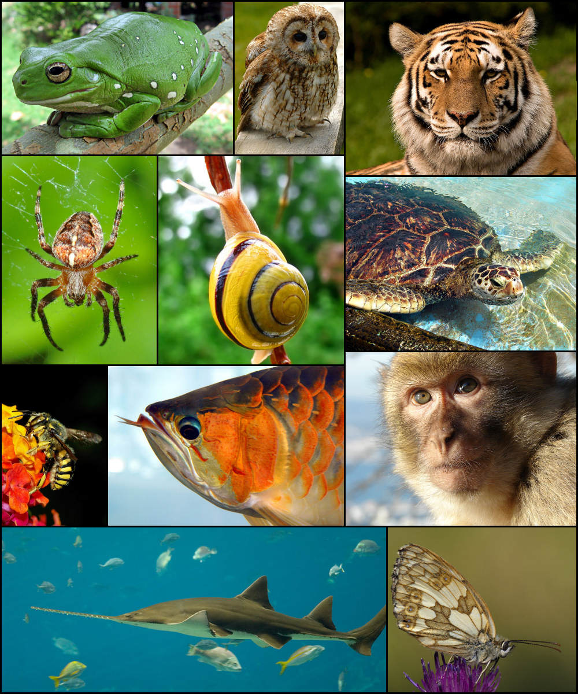

# Animals

Animals (from the Latin animalis, meaning having breath, having soul or living being) are heterotrophic multicellular eukaryotic organisms with internal digestion that form the biological kingdom Animalia. Animals consume organic material, breathe oxygen, are able to move, can reproduce sexually, and grow from a hollow sphere of cells, the blastula, during embryonic development. Over 1.5 million living animal species have been described—of which around 1 million are insects—but it has been estimated there are over 7 million animal species in total. Animals range in length from 8.5 micrometres (0.00033 in) to 33.6 metres (110 ft). They have complex interactions with each other and their environments, forming intricate food webs. The kingdom Animalia includes humans but in colloquial use the term animal often refers only to non-human animals. The scientific study of animals is known as zoology.

(ref:animdiv) [Diversity of animals.](https://en.wikipedia.org/wiki/File:Animal_diversity.png)

```{r animaldiversity, fig.cap='(ref:animdiv)', echo=FALSE, message=FALSE, warning=FALSE}
knitr::include_graphics("./figures/animals/Animal_diversity.png")
```

Most living animal species are in Bilateria, a clade whose members have a bilaterally symmetric body plan. The Bilateria include the protostomes—in which many groups of invertebrates are found, such as nematodes, arthropods, and molluscs—and the deuterostomes, containing both the echinoderms as well as the chordates, the latter containing the vertebrates. Life forms interpreted as early animals were present in the Ediacaran biota of the late Precambrian. Many modern animal phyla became clearly established in the fossil record as marine species during the Cambrian explosion, which began around 542 million years ago. 6,331 groups of genes common to all living animals have been identified; these may have arisen from a single common ancestor that lived 650 million years ago.

Historically, Aristotle divided animals into those with blood and those without. Carl Linnaeus created the first hierarchical biological classification for animals in 1758 with his Systema Naturae, which Jean-Baptiste Lamarck expanded into 14 phyla by 1809. In 1874, Ernst Haeckel divided the animal kingdom into the multicellular Metazoa (synonymous for Animalia) and the Protozoa, single-celled organisms no longer considered animals. In modern times, the biological classification of animals relies on advanced techniques, such as molecular phylogenetics, which are effective at demonstrating the evolutionary relationships between animal taxa.

Humans make use of many other animal species, such as for food (including meat, milk, and eggs), for materials (such as leather and wool), and also as pets, and for transports, as working animals. Dogs have been used in hunting, while many terrestrial and aquatic animals were hunted for sports. Non-human animals have appeared in art from the earliest times and are featured in mythology and religion.

Animals have several characteristics that set them apart from other living things. Animals are eukaryotic and multicellular, unlike bacteria, which are prokaryotic, and unlike protists, which are eukaryotic but unicellular. Unlike plants and algae, which produce their own nutrients animals are heterotrophic, feeding on organic material and digesting it internally. With very few exceptions, animals respire aerobically. All animals are motile (able to spontaneously move their bodies) during at least part of their life cycle, but some animals, such as sponges, corals, mussels, and barnacles, later become sessile. The blastula is a stage in embryonic development that is unique to most animals, allowing cells to be differentiated into specialised tissues and organs.

All animals are composed of cells, surrounded by a characteristic extracellular matrix composed of collagen and elastic glycoproteins. During development, the animal extracellular matrix forms a relatively flexible framework upon which cells can move about and be reorganised, making the formation of complex structures possible. This may be calcified, forming structures such as shells, bones, and spicules. In contrast, the cells of other multicellular organisms (primarily algae, plants, and fungi) are held in place by cell walls, and so develop by progressive growth. Animal cells uniquely possess the cell junctions called tight junctions, gap junctions, and desmosomes.

With few exceptions—in particular, the sponges and placozoans—animal bodies are differentiated into tissues. These include muscles, which enable locomotion, and nerve tissues, which transmit signals and coordinate the body. Typically, there is also an internal digestive chamber with either one opening (in Ctenophora, Cnidaria, and flatworms) or two openings (in most bilaterians).

Nearly all animals make use of some form of sexual reproduction. They produce haploid gametes by meiosis; the smaller, motile gametes are spermatozoa and the larger, non-motile gametes are ova. These fuse to form zygotes, which develop via mitosis into a hollow sphere, called a blastula. In sponges, blastula larvae swim to a new location, attach to the seabed, and develop into a new sponge. In most other groups, the blastula undergoes more complicated rearrangement. It first invaginates to form a gastrula with a digestive chamber and two separate germ layers, an external ectoderm and an internal endoderm. In most cases, a third germ layer, the mesoderm, also develops between them. These germ layers then differentiate to form tissues and organs.

Repeated instances of mating with a close relative during sexual reproduction generally leads to inbreeding depression within a population due to the increased prevalence of harmful recessive traits. Animals have evolved numerous mechanisms for avoiding close inbreeding.

Some animals are capable of asexual reproduction, which often results in a genetic clone of the parent. This may take place through fragmentation; budding, such as in Hydra and other cnidarians; or parthenogenesis, where fertile eggs are produced without mating, such as in aphids.

Animals are categorised into ecological groups depending on how they obtain or consume organic material, including carnivores, herbivores, omnivores, detritivores, and parasites. Interactions between animals form complex food webs. In carnivorous or omnivorous species, predation is a consumer-resource interaction where a predator feeds on another organism (called its prey). Selective pressures imposed on one another lead to an evolutionary arms race between predator and prey, resulting in various anti-predator adaptations. Almost all multicellular predators are animals. Some consumers use multiple methods; for example, in parasitoid wasps, the larvae feed on the hosts' living tissues, killing them in the process, but the adults primarily consume nectar from flowers. Other animals may have very specific feeding behaviours, such as hawksbill sea turtles primarily eating sponges.

Most animals rely on the biomass and energy produced by plants through photosynthesis. Herbivores eat plant material directly, while carnivores, and other animals on higher trophic levels typically acquire it indirectly by eating other animals. Animals oxidize carbohydrates, lipids, proteins, and other biomolecules to unlock the chemical energy of molecular oxygen, which allows the animal to grow and to sustain biological processes such as locomotion. Animals living close to hydrothermal vents and cold seeps on the dark sea floor consume organic matter of archaea and bacteria produced in these locations through chemosynthesis (by oxidizing inorganic compounds, such as hydrogen sulfide).

Animals originally evolved in the sea. Lineages of arthropods colonised land around the same time as land plants, probably between 510–471 million years ago during the Late Cambrian or Early Ordovician. Vertebrates such as the lobe-finned fish Tiktaalik started to move on to land in the late Devonian, about 375 million years ago. Animals occupy virtually all of earth's habitats and microhabitats, including salt water, hydrothermal vents, fresh water, hot springs, swamps, forests, pastures, deserts, air, and the interiors of animals, plants, fungi and rocks. Animals are however not particularly heat tolerant; very few of them can survive at constant temperatures above 50 °C (122 °F). Only very few species of a

(ref:tikta) [Tiktaalik, ≈375 Ma](https://commons.wikimedia.org/wiki/File:Tiktaalik_BW.jpg)

```{r tiktaalik, fig.cap='(ref:tikta)', echo=FALSE, message=FALSE, warning=FALSE}
knitr::include_graphics("./figures/animals/Tiktaalik_BW.jpg")
```

Animals (mostly nematodes) inhabit the most extreme cold deserts of continental Antarctica.

The blue whale (Balaenoptera musculus) is the largest animal that has ever lived, weighing up to at least 190 tonnes and measuring up to 33.6 metres (110 ft) long. The largest extant terrestrial animal is the African bush elephant (Loxodonta africana), weighing up to 12.25 tonnes and measuring up to 10.67 metres (35.0 ft) long. The largest terrestrial animals that ever lived were titanosaur sauropod dinosaurs such as Argentinosaurus, which may have weighed as much as 73 tonnes. Several animals are microscopic; some Myxozoa (obligate parasites within the Cnidaria) never grow larger than 20 µm, and one of the smallest species (Myxobolus shekel) is no more than 8.5 µm when fully grown.

The oldest animals are found in the Ediacaran biota, towards the end of the Precambrian, around 610 million years ago. It had long been doubtful whether these included animals, but the discovery of the animal lipid cholesterol in fossils of Dickinsonia establishes that these were indeed animals. Animals are thought to have originated under low-oxygen conditions, suggesting that they were capable of living entirely by anaerobic respiration, but as they became specialized for aerobic metabolism they became fully dependent on oxygen in their environments.

(ref:edia) [Dickinsonia costata from the Ediacaran biota (c. 635–542 MYA) is one of the earliest animal species known.](https://commons.wikimedia.org/wiki/File:DickinsoniaCostata.jpg)

```{r ediacara, fig.cap='(ref:edia)', echo=FALSE, message=FALSE, warning=FALSE}
knitr::include_graphics("./figures/animals/DickinsoniaCostata.jpg")
```

Many animal phyla first appear in the fossil record during the Cambrian explosion, starting about 542 million years ago, in beds such as the Burgess shale. Extant phyla in these rocks include molluscs, brachiopods, onychophorans, tardigrades, arthropods, echinoderms and hemichordates, along with numerous now-extinct forms such as the predatory Anomalocaris. The apparent suddenness of the event may however be an artefact of the fossil record, rather than showing that all these animals appeared simultaneously.

(ref:anoma) [Anomalocaris canadensis](https://commons.wikimedia.org/wiki/File:Anomalocaris2019.jpg) is one of the many animal species that emerged in the Cambrian explosion, starting some 542 million years ago, and found in the fossil beds of the Burgess shale.

```{r amomalocaris, fig.cap='(ref:anoma)', echo=FALSE, message=FALSE, warning=FALSE}
knitr::include_graphics("./figures/animals/Anomalocaris2019.jpg")
```

Some palaeontologists have suggested that animals appeared much earlier than the Cambrian explosion, possibly as early as 1 billion years ago. Trace fossils such as tracks and burrows found in the Tonian period may indicate the presence of triploblastic worm-like animals, roughly as large (about 5 mm wide) and complex as earthworms. However, similar tracks are produced today by the giant single-celled protist Gromia sphaerica, so the Tonian trace fossils may not indicate early animal evolution. Around the same time, the layered mats of microorganisms called stromatolites decreased in diversity, perhaps due to grazing by newly-evolved animals.

Animals are monophyletic, meaning they are derived from a common ancestor. Animals are sister to the Choanoflagellata, with which they form the Choanozoa. The most basal animals, the Porifera, Ctenophora, Cnidaria, and Placozoa, have body plans that lack bilateral symmetry. Their relationships are still disputed; the sister group to all other animals could be the Porifera or the Ctenophora, both of which lack hox genes, important in body plan development.

(ref:placo) The Placozoa are a basal form of free-living (non-parasitic) multicellular organism.[1] They are the simplest in structure of all animals. Three genera have been found: the classical [Trichoplax adhaerens](https://commons.wikimedia.org/wiki/File:Trichoplax_adhaerens_photograph.png), Hoilungia hongkongensis, and Polyplacotoma mediterranea.

```{r trichoplax, fig.cap='(ref:placo)', echo=FALSE, message=FALSE, warning=FALSE}
knitr::include_graphics("./figures/animals/Trichoplax_adhaerens_photograph.png")
```

```{r animalphyla, out.width='75%', echo=FALSE, message=FALSE, warning=FALSE}
library(tidyverse)
library(printr)        
library(kableExtra)
setwd("~/Dropbox/R/biology-text-master")

animalphy <-  as_tibble(read.csv("data/animal_phyla.csv"))

knitr::kable(animalphy, col.names = c("Phylum", "No. of Species", "Land", "Sea", "Freshwater", "Free-living", "Parasitic"), digits = 2, align = 'lllllll', booktabs = TRUE, caption = "Estimated numbers of described extant species for the animal groups with the largest numbers of species, along with their principal habitats (terrestrial, fresh water, and marine), and free-living or parasitic ways of life.") %>% kable_styling(latex_options = c("striped", "hold_position"))
```

These genes are found in the Placozoa and the higher animals, the Bilateria. 6,331 groups of genes common to all living animals have been identified; these may have arisen from a single common ancestor that lived 650 million years ago in the Precambrian. 25 of these are novel core gene groups, found only in animals; of those, 8 are for essential components of the Wnt and TGF-beta signalling pathways which may have enabled animals to become multicellular by providing a pattern for the body's system of axes (in three dimensions), and another 7 are for transcription factors including homeodomain proteins involved in the control of development.

## Non-bilaterian animals

Several animal phyla lack bilateral symmetry. Among these, the sponges (Porifera) probably diverged first, representing the oldest animal phylum. Sponges lack the complex organization found in most other animal phyla; their cells are differentiated, but in most cases not organised into distinct tissues. They typically feed by drawing in water through pores.

(ref:sponges) [Sponge biodiversity and morphotypes at the lip of a wall site in 60 feet (20 m) of water. Included are the yellow tube sponge, Aplysina fistularis, the purple vase sponge, Niphates digitalis, the red encrusting sponge, Spirastrella coccinea [nl], and the gray rope sponge, Callyspongia sp.](https://commons.wikimedia.org/wiki/File:Reef3859_-_Flickr_-_NOAA_Photo_Library.jpg) 

```{r spongediversity, fig.cap='(ref:sponges)', echo=FALSE, message=FALSE, warning=FALSE}
knitr::include_graphics("./figures/animals/Reef3859_-_Flickr_-_NOAA_Photo_Library.jpg")
```

The Ctenophora (comb jellies) and Cnidaria (which includes jellyfish, sea anemones, and corals) are radially symmetric and have digestive chambers with a single opening, which serves as both mouth and anus. Animals in both phyla have distinct tissues, but these are not organised into organs. They are diploblastic, having only two main germ layers, ectoderm and endoderm. The tiny placozoans are similar, but they do not have a permanent digestive chamber.

(ref:cteno) [Pelagic (open ocean) ctenophores (a) Beroe ovata, (b) Euplokamis sp., (c) Nepheloctena sp., (d) Bathocyroe fosteri, (e) Mnemiopsis leidyi, and (f) Ocyropsis sp.](https://commons.wikimedia.org/wiki/File:Pelagic_ctenophores.png) 

```{r ctenophora, fig.cap='(ref:cteno)', echo=FALSE, message=FALSE, warning=FALSE}
knitr::include_graphics("./figures/animals/Pelagic_ctenophores.png")
```

(ref:cnida) [Four examples of Cnidaria:](https://commons.wikimedia.org/wiki/File:Cnidaria.png) A jellyfish Chrysaora melanaster,  a gorgonian Annella mollis, a rocky coral Acropora cervicornis, and a sea anemone Nemanthus annamensis.

```{r cnidaria, fig.cap='(ref:cnida)', echo=FALSE, message=FALSE, warning=FALSE}
knitr::include_graphics("./figures/animals/Cnidaria.png")
```

## Bilaterian animals

The remaining animals, the great majority—comprising some 29 phyla and over a million species—form a clade, the Bilateria. The body is triploblastic, with three well-developed germ layers, and their tissues form distinct organs. The digestive chamber has two openings, a mouth and an anus, and there is an internal body cavity, a coelom or pseudocoelom. Animals with this bilaterally symmetric body plan and a tendency to move in one direction have a head end (anterior) and a tail end (posterior) as well as a back (dorsal) and a belly (ventral); therefore they also have a left side and a right side.

(ref:bilat) [Diversity of bilaterians.](https://commons.wikimedia.org/wiki/File:Animal_diversity_October_2007.jpg) 

```{r bilateriandiversity, fig.cap='(ref:bilat)', echo=FALSE, message=FALSE, warning=FALSE}

```

Having a front end means that this part of the body encounters stimuli, such as food, favouring cephalisation, the development of a head with sense organs and a mouth. Many bilaterians have a combination of circular muscles that constrict the body, making it longer, and an opposing set of longitudinal muscles, that shorten the body; these enable soft-bodied animals with a hydrostatic skeleton to move by peristalsis. They also have a gut that extends through the basically cylindrical body from mouth to anus. Many bilaterian phyla have primary larvae which swim with cilia and have an apical organ containing sensory cells. However, there are exceptions to each of these characteristics; for example, adult echinoderms are radially symmetric (unlike their larvae), while some parasitic worms have extremely simplified body structures.

(ref:bibod) [Idealised bilaterian body plan.](https://commons.wikimedia.org/wiki/File:Bilaterian_body_plan.svg) With an elongated body and a direction of movement the animal has head and tail ends. Sense organs and mouth form the basis of the head. Opposed circular and longitudinal muscles enable peristaltic motion.

```{r bilaterianbodyplan, fig.cap='(ref:bipod)', echo=FALSE, message=FALSE, warning=FALSE}
knitr::include_graphics("./figures/animals/Bilaterian_body_plan.svg")
```

Genetic studies have considerably changed zoologists' understanding of the relationships within the Bilateria. Most appear to belong to two major lineages, the protostomes and the deuterostomes. The basalmost bilaterians are the Xenacoelomorpha.

```{r anicomparison, out.width='75%', echo=FALSE, message=FALSE, warning=FALSE}
library(tidyverse)
library(printr)        
library(kableExtra)
setwd("~/Dropbox/R/biology-text-master")

animalcomp <-  as_tibble(read.csv("data/animal_comparison.csv"))

knitr::kable(animalcomp, col.names = c("","Sponges","Cnidarians","Ctenophores","Bilateria"), digits = 2, align = 'lll', booktabs = TRUE) %>% kable_styling(latex_options = c("striped", "hold_position")) 
```

## Protostomes and deuterostomes

Protostomes and deuterostomes differ in several ways. Early in development, deuterostome embryos undergo radial cleavage during cell division, while many protostomes (the Spiralia) undergo spiral cleavage. Animals from both groups possess a complete digestive tract, but in protostomes the first opening of the embryonic gut develops into the mouth, and the anus forms secondarily. In deuterostomes, the anus forms first while the mouth develops secondarily. Most protostomes have schizocoelous development, where cells simply fill in the interior of the gastrula to form the mesoderm. In deuterostomes, the mesoderm forms by enterocoelic pouching, through invagination of the endoderm.

(ref:prodeu) [The bilaterian gut develops in two ways. In many protostomes, the blastopore develops into the mouth, while in deuterostomes it becomes the anus.](https://commons.wikimedia.org/wiki/File:Protovsdeuterostomes.svg)

```{r protovsdeutero, fig.cap='(ref:prodeu)', echo=FALSE, message=FALSE, warning=FALSE}
knitr::include_graphics("./figures/animals/Protovsdeuterostomes.svg")
```

The main deuterostome phyla are the Echinodermata and the Chordata. Echinoderms are exclusively marine and include starfish, sea urchins, and sea cucumbers. The chordates are dominated by the vertebrates (animals with backbones), which consist of fishes, amphibians, reptiles, birds, and mammals. The deuterostomes also include the Hemichordata (acorn worms).

## Ecdysozoa

The Ecdysozoa are protostomes, named after their shared trait of ecdysis, growth by moulting. They include the largest animal phylum, the Arthropoda, which contains insects, spiders, crabs, and their kin. All of these have a body divided into repeating segments, typically with paired appendages. Two smaller phyla, the Onychophora and Tardigrada, are close relatives of the arthropods and share these traits. The ecdysozoans also include the Nematoda or roundworms, perhaps the second largest animal phylum. Roundworms are typically microscopic, and occur in nearly every environment where there is water; some are important parasites. Smaller phyla related to them are the Nematomorpha or horsehair worms, and the Kinorhyncha, Priapulida, and Loricifera. These groups have a reduced coelom, called a pseudocoelom.

## Spiralia

The Spiralia are a large group of protostomes that develop by spiral cleavage in the early embryo. The Spiralia's phylogeny has been disputed, but it contains a large clade, the superphylum Lophotrochozoa, and smaller groups of phyla such as the Rouphozoa which includes the gastrotrichs and the flatworms. All of these are grouped as the Platytrochozoa, which has a sister group, the Gnathifera, which includes the rotifers.

The Lophotrochozoa includes the molluscs, annelids, brachiopods, nemerteans, bryozoa and entoprocts. The molluscs, the second-largest animal phylum by number of described species, includes snails, clams, and squids, while the annelids are the segmented worms, such as earthworms, lugworms, and leeches. These two groups have long been considered close relatives because they share trochophore larvae.

## Animal Development

The main processes involved in the embryonic development of animals are: tissue patterning (via regional specification and patterned cell differentiation); tissue growth; and tissue morphogenesis.

(ref:andev) [Animals are unique in having the ball of cells of the early embryo (1) develop into a hollow ball or blastula (2).](https://commons.wikimedia.org/wiki/File:Blastulation.png)

```{r animaldev, fig.cap='(ref:andev)', echo=FALSE, message=FALSE, warning=FALSE}

```

* Regional specification refers to the processes that create spatial pattern in a ball or sheet of initially similar cells. This generally involves the action of cytoplasmic determinants, located within parts of the fertilized egg, and of inductive signals emitted from signaling centers in the embryo. The early stages of regional specification do not generate functional differentiated cells, but cell populations committed to develop to a specific region or part of the organism. These are defined by the expression of specific combinations of transcription factors.
* Cell differentiation relates specifically to the formation of functional cell types such as nerve, muscle, secretory epithelia etc. Differentiated cells contain large amounts of specific proteins associated with the cell function.
* Morphogenesis relates to the formation of three-dimensional shape. It mainly involves the orchestrated movements of cell sheets and of individual cells. Morphogenesis is important for creating the three germ layers of the early embryo (ectoderm, mesoderm and endoderm) and for building up complex structures during organ development.
* Tissue growth involves both an overall increase in tissue size, and also the differential growth of parts (allometry) which contributes to morphogenesis. Growth mostly occurs through cell proliferation but also through changes of cell size or the deposition of extracellular materials.

Cell differentiation is the process whereby different functional cell types arise in development. For example, neurons, muscle fibers and hepatocytes (liver cells) are well known types of differentiated cells. Differentiated cells usually produce large amounts of a few proteins that are required for their specific function and this gives them the characteristic appearance that enables them to be recognized under the light microscope. The genes encoding these proteins are highly active. Typically their chromatin structure is very open, allowing access for the transcription enzymes, and specific transcription factors bind to regulatory sequences in the DNA in order to activate gene expression. For example, NeuroD is a key transcription factor for neuronal differentiation, myogenin for muscle differentiation, and HNF4 for hepatocyte differentiation. Cell differentiation is usually the final stage of development, preceded by several states of commitment which are not visibly differentiated. A single tissue, formed from a single type of progenitor cell or stem cell, often consists of several differentiated cell types. Control of their formation involves a process of lateral inhibition, based on the properties of the Notch signaling pathway. For example, in the neural plate of the embryo this system operates to generate a population of neuronal precursor cells in which NeuroD is highly expressed.

## Embryonic Development of Animals

The sperm and egg fuse in the process of fertilization to form a fertilized egg, or zygote. This undergoes a period of divisions to form a ball or sheet of similar cells called a blastula or blastoderm. These cell divisions are usually rapid with no growth so the daughter cells are half the size of the mother cell and the whole embryo stays about the same size. They are called cleavage divisions.

Mouse epiblast primordial germ cells (see Figure: “The initial stages of human embryogenesis”) undergo extensive epigenetic reprogramming. This process involves genome-wide DNA demethylation, chromatin reorganization and epigenetic imprint erasure leading to totipotency. DNA demethylation is carried out by a process that utilizes the DNA base excision repair pathway.

Morphogenetic movements convert the cell mass into a three layered structure consisting of multicellular sheets called ectoderm, mesoderm and endoderm. These sheets are known as germ layers. This is the process of gastrulation. During cleavage and gastrulation the first regional specification events occur. In addition to the formation of the three germ layers themselves, these often generate extraembryonic structures, such as the mammalian placenta, needed for support and nutrition of the embryo, and also establish differences of commitment along the anteroposterior axis (head, trunk and tail).

Regional specification is initiated by the presence of cytoplasmic determinants in one part of the zygote. The cells that contain the determinant become a signaling center and emit an inducing factor. Because the inducing factor is produced in one place, diffuses away, and decays, it forms a concentration gradient, high near the source cells and low further away. The remaining cells of the embryo, which do not contain the determinant, are competent to respond to different concentrations by upregulating specific developmental control genes. This results in a series of zones becoming set up, arranged at progressively greater distance from the signaling center. In each zone a different combination of developmental control genes is upregulated. These genes encode transcription factors which upregulate new combinations of gene activity in each region. Among other functions, these transcription factors control expression of genes conferring specific adhesive and motility properties on the cells in which they are active. Because of these different morphogenetic properties, the cells of each germ layer move to form sheets such that the ectoderm ends up on the outside, mesoderm in the middle, and endoderm on the inside. Morphogenetic movements not only change the shape and structure of the embryo, but by bringing cell sheets into new spatial relationships they also make possible new phases of signaling and response between them.

Growth in embryos is mostly autonomous. For each territory of cells the growth rate is controlled by the combination of genes that are active. Free-living embryos do not grow in mass as they have no external food supply. But embryos fed by a placenta or extraembryonic yolk supply can grow very fast, and changes to relative growth rate between parts in these organisms help to produce the final overall anatomy.

The whole process needs to be coordinated in time and how this is controlled is not understood. There may be a master clock able to communicate with all parts of the embryo that controls the course of events, or timing may depend simply on local causal sequences of events.

## Metamorphosis

Developmental processes are very evident during the process of metamorphosis. This occurs in various types of animal. Well-known examples are seen in frogs, which usually hatch as a tadpole and metamorphoses to an adult frog, and certain insects which hatch as a larva and then become remodeled to the adult form during a pupal stage.

(ref:metamorph) [Two types of metamorphosis are shown.](https://commons.wikimedia.org/wiki/File:Holometabolous_vs._Hemimetabolous.svg) In a complete (holometabolous) metamorphosis the insect passes through four distinct phases, which produce an adult that does not resemble the larva. In an incomplete (hemimetabolous) metamorphosis an insect does not go through a full transformation, but instead transitions from a nymph to an adult by molting its exoskeleton as it grows.

```{r metamorphosis, fig.cap='(ref:metamorph)', echo=FALSE, message=FALSE, warning=FALSE}

```

All the developmental processes listed above occur during metamorphosis. Examples that have been especially well studied include tail loss and other changes in the tadpole of the frog Xenopus, and the biology of the imaginal discs, which generate the adult body parts of the fly Drosophila melanogaster.

## Tissues

In biology, tissue is a cellular organizational level between cells and a complete organ. A tissue is an ensemble of similar cells and their extracellular matrix from the same origin that together carry out a specific function. Organs are then formed by the functional grouping together of multiple tissues.

The English word "tissue" derives from the French word "tissu", meaning that something that is "woven", from the verb tisser, "to weave".

The study of human and animal tissues is known as histology or, in connection with disease, as histopathology. For plants, the discipline is called plant anatomy. The classical tools for studying tissues are the paraffin block in which tissue is embedded and then sectioned, the histological stain, and the optical microscope. Developments in electron microscopy, immunofluorescence, and the use of frozen tissue-sections have enhanced the detail that can be observed in tissues. With these tools, the classical appearances of tissues can be examined in health and disease, enabling considerable refinement of medical diagnosis and prognosis.

Animal tissues are grouped into four basic types: connective, muscle, nervous, and epithelial. Collections of tissues joined in units to serve a common function compose organs. While all animals can generally be considered to contain the four tissue types, the manifestation of these tissues can differ depending on the type of organism. For example, the origin of the cells comprising a particular tissue type may differ developmentally for different classifications of animals.

The epithelium in all animals is derived from the ectoderm and endoderm, with a small contribution from the mesoderm, forming the endothelium, a specialized type of epithelium that composes the vasculature. By contrast, a true epithelial tissue is present only in a single layer of cells held together via occluding junctions called tight junctions, to create a selectively permeable barrier. This tissue covers all organismal surfaces that come in contact with the external environment such as the skin, the airways, and the digestive tract. It serves functions of protection, secretion, and absorption, and is separated from other tissues below by a basal lamina.

## Epithelial tissue

The epithelial tissues are formed by cells that cover the organ surfaces, such as the surface of skin, the airways, surfaces of soft organs,the reproductive tract, and the inner lining of the digestive tract. The cells comprising an epithelial layer are linked via semi-permeable, tight junctions; hence, this tissue provides a barrier between the external environment and the organ it covers. In addition to this protective function, epithelial tissue may also be specialized to function in secretion, excretion and absorption. Epithelial tissue helps to protect organs from microorganisms, injury, and fluid loss.

Functions of epithelial tissue:

* The principle function of epithelial tissues are covering and lining of free surface
* The cells of the body's surface form the outer layer of skin.
* Inside the body, epithelial cells form the lining of the mouth and alimentary canal and protect these organs.
* Epithelial tissues help in absorption of water and nutrients.
* Epithelial tissues help in the elimination of waste.
* Epithelial tissues secrete enzymes and/or hormones in the form of glands.
* Some epithelial tissue perform secretory functions. They secrete a variety of substances including sweat, saliva, mucus, enzymes.

There are many kinds of epithelium, and nomenclature is somewhat variable. Most classification schemes combine a description of the cell-shape in the upper layer of the epithelium with a word denoting the number of layers: either simple (one layer of cells) or stratified (multiple layers of cells). However, other cellular features such as cilia may also be described in the classification system. Some common kinds of epithelium are listed below:

* Simple squamous epithelium
* Stratified squamous epithelium
* Simple cuboidal epithelium
* Transitional epithelium
* Pseudostratified columnar epithelium (also known as ciliated columnar epithelium)
* Columnar epithelium
* Glandular epithelium

## Connective tissue

Connective tissues are fibrous tissues made up of cells separated by non-living material, which is called an extracellular matrix. This matrix can be liquid or rigid. For example, blood contains plasma as its matrix and bone's matrix is rigid. Connective tissue gives shape to organs and holds them in place. Blood, bone, tendon, ligament, adipose, and areolar tissues are examples of connective tissues. One method of classifying connective tissues is to divide them into three types: fibrous connective tissue, skeletal connective tissue, and fluid connective tissue.

## Muscular tissue

Muscle cells form the active contractile tissue of the body known as muscle tissue or muscular tissue. Muscle tissue functions to produce force and cause motion, either locomotion or movement within internal organs. Muscle tissue is separated into three distinct categories: visceral or smooth muscle, found in the inner linings of organs; skeletal muscle, typically attached to bones, which generate gross movement; and cardiac muscle, found in the heart, where it contracts to pump blood throughout an organism.

## Nervous tissue

Cells comprising the central nervous system and peripheral nervous system are classified as nervous (or neural) tissue. In the central nervous system, neural tissues form the brain and spinal cord. In the peripheral nervous system, neural tissues form the cranial nerves and spinal nerves, inclusive of the motor neurons.

## Human evolution

Human evolution is the evolutionary process that led to the emergence of anatomically modern humans, beginning with the evolutionary history of primates—in particular genus Homo—and leading to the emergence of Homo sapiens as a distinct species of the hominid family, which includes the great apes. This process involved the gradual development of traits such as human bipedalism and language, as well as interbreeding with other hominins, which indicate that human evolution was not linear but a web.

The study of human evolution involves several scientific disciplines, including physical anthropology, primatology, archaeology, paleontology, neurobiology, ethology, linguistics, evolutionary psychology, embryology and genetics. Genetic studies show that primates diverged from other mammals about 85 million years ago, in the Late Cretaceous period, and the earliest fossils appear in the Paleocene, around 55 million years ago.

Within the superfamily Hominoidea, the family Hominidae diverged from the family Hylobatidae some 15–20 million years ago; subfamily Homininae (African apes) diverged from Ponginae (orangutans) about 14 million years ago; the tribe Hominini (including humans, Australopithecus, and chimpanzees) parted from the tribe Gorillini (gorillas) between 8–9 million years ago; and, in turn, the subtribes Hominina (humans and extinct biped ancestors) and Panina (chimpanzees) separated 4–7 million years ago.

Human evolution from its first separation from the last common ancestor of humans and chimpanzees is characterized by a number of morphological, developmental, physiological, and behavioral changes. The most significant of these adaptations are bipedalism, increased brain size, lengthened ontogeny (gestation and infancy), and decreased sexual dimorphism. The relationship between these changes is the subject of ongoing debate.[page needed] Other significant morphological changes included the evolution of a power and precision grip, a change first occurring in H. erectus.

Bipedalism is the basic adaptation of the hominid and is considered the main cause behind a suite of skeletal changes shared by all bipedal hominids. The earliest hominin, of presumably primitive bipedalism, is considered to be either Sahelanthropus or Orrorin, both of which arose some 6 to 7 million years ago. The non-bipedal knuckle-walkers, the gorillas and chimpanzees, diverged from the hominin line over a period covering the same time, so either Sahelanthropus or Orrorin may be our last shared ancestor. Ardipithecus, a full biped, arose approximately 5.6 million years ago.

The early bipeds eventually evolved into the australopithecines and still later into the genus Homo. There are several theories of the adaptation value of bipedalism. It is possible that bipedalism was favored because it freed the hands for reaching and carrying food, saved energy during locomotion, enabled long-distance running and hunting, provided an enhanced field of vision, and helped avoid hyperthermia by reducing the surface area exposed to direct sun; features all advantageous for thriving in the new savanna and woodland environment created as a result of the East African Rift Valley uplift versus the previous closed forest habitat. A 2007 study provides support for the hypothesis that walking on two legs, or bipedalism, evolved because it used less energy than quadrupedal knuckle-walking. However, recent studies suggest that bipedality without the ability to use fire would not have allowed global dispersal. This change in gait saw a lengthening of the legs proportionately when compared to the length of the arms, which were shortened through the removal of the need for brachiation. Another change is the shape of the big toe. Recent studies suggest that australopithecines still lived part of the time in trees as a result of maintaining a grasping big toe. This was progressively lost in habilines.

Anatomically, the evolution of bipedalism has been accompanied by a large number of skeletal changes, not just to the legs and pelvis, but also to the vertebral column, feet and ankles, and skull. The femur evolved into a slightly more angular position to move the center of gravity toward the geometric center of the body. The knee and ankle joints became increasingly robust to better support increased weight. To support the increased weight on each vertebra in the upright position, the human vertebral column became S-shaped and the lumbar vertebrae became shorter and wider. In the feet the big toe moved into alignment with the other toes to help in forward locomotion. The arms and forearms shortened relative to the legs making it easier to run. The foramen magnum migrated under the skull and more anterior.

The most significant changes occurred in the pelvic region, where the long downward facing iliac blade was shortened and widened as a requirement for keeping the center of gravity stable while walking; bipedal hominids have a shorter but broader, bowl-like pelvis due to this. A drawback is that the birth canal of bipedal apes is smaller than in knuckle-walking apes, though there has been a widening of it in comparison to that of australopithecine and modern humans, permitting the passage of newborns due to the increase in cranial size but this is limited to the upper portion, since further increase can hinder normal bipedal movement.

The shortening of the pelvis and smaller birth canal evolved as a requirement for bipedalism and had significant effects on the process of human birth which is much more difficult in modern humans than in other primates. During human birth, because of the variation in size of the pelvic region, the fetal head must be in a transverse position (compared to the mother) during entry into the birth canal and rotate about 90 degrees upon exit. The smaller birth canal became a limiting factor to brain size increases in early humans and prompted a shorter gestation period leading to the relative immaturity of human offspring, who are unable to walk much before 12 months and have greater neoteny, compared to other primates, who are mobile at a much earlier age. The increased brain growth after birth and the increased dependency of children on mothers had a major effect upon the female reproductive cycle, and the more frequent appearance of alloparenting in humans when compared with other hominids. Delayed human sexual maturity also led to the evolution of menopause with one explanation providing that elderly women could better pass on their genes by taking care of their daughter's offspring, as compared to having more children of their own.

The human species eventually developed a much larger brain than that of other primates—typically 1,330 cm3 (81 cu in) in modern humans, nearly three times the size of a chimpanzee or gorilla brain. After a period of stasis with Australopithecus anamensis and Ardipithecus, species which had smaller brains as a result of their bipedal locomotion, the pattern of encephalization started with Homo habilis, whose 600 cm3 (37 cu in) brain was slightly larger than that of chimpanzees. This evolution continued in Homo erectus with 800–1,100 cm3 (49–67 cu in), and reached a maximum in Neanderthals with 1,200–1,900 cm3 (73–116 cu in), larger even than modern Homo sapiens. This brain increase manifested during postnatal brain growth, far exceeding that of other apes (heterochrony). It also allowed for extended periods of social learning and language acquisition in juvenile humans, beginning as much as 2 million years ago.

Furthermore, the changes in the structure of human brains may be even more significant than the increase in size.

The temporal lobes, which contain centers for language processing, have increased disproportionately, as has the prefrontal cortex, which has been related to complex decision-making and moderating social behavior. Encephalization has been tied to increased meat and starches in the diet, and the development of cooking, and it has been proposed that intelligence increased as a response to an increased necessity for solving social problems as human society became more complex. Changes in skull morphology, such as smaller mandibles and mandible muscle attachments, allowed more room for the brain to grow.

The increase in volume of the neocortex also included a rapid increase in size of the cerebellum. Its function has traditionally been associated with balance and fine motor control, but more recently with speech and cognition. The great apes, including hominids, had a more pronounced cerebellum relative to the neocortex than other primates. It has been suggested that because of its function of sensory-motor control and learning complex muscular actions, the cerebellum may have underpinned human technological adaptations, including the preconditions of speech.

The immediate survival advantage of encephalization is difficult to discern, as the major brain changes from Homo erectus to Homo heidelbergensis were not accompanied by major changes in technology. It has been suggested that the changes were mainly social and behavioural, including increased empathic abilities, increases in size of social groups, and increased behavioural plasticity. Encephalization may be due to a dependency on calorie-dense, difficult-to-acquire food.

The reduced degree of sexual dimorphism in humans is visible primarily in the reduction of the male canine tooth relative to other ape species (except gibbons) and reduced brow ridges and general robustness of males. Another important physiological change related to sexuality in humans was the evolution of hidden estrus. Humans are the only hominoids in which the female is fertile year round and in which no special signals of fertility are produced by the body (such as genital swelling or overt changes in proceptivity during estrus).

Nonetheless, humans retain a degree of sexual dimorphism in the distribution of body hair and subcutaneous fat, and in the overall size, males being around 15% larger than females. These changes taken together have been interpreted as a result of an increased emphasis on pair bonding as a possible solution to the requirement for increased parental investment due to the prolonged infancy of offspring.

The ulnar opposition—the contact between the thumb and the tip of the little finger of the same hand—is unique to the genus Homo, including Neanderthals, the Sima de los Huesos hominins and anatomically modern humans. In other primates, the thumb is short and unable to touch the little finger. The ulnar opposition facilitates the precision grip and power grip of the human hand, underlying all the skilled manipulations.

A number of other changes have also characterized the evolution of humans, among them an increased importance on vision rather than smell; a longer juvenile developmental period and higher infant dependency; a smaller gut; faster basal metabolism; loss of body hair; evolution of sweat glands; a change in the shape of the dental arcade from being u-shaped to being parabolic; development of a chin (found in Homo sapiens alone); development of styloid processes; and the development of a descended larynx.

The word homo, the name of the biological genus to which humans belong, is Latin for "human". It was chosen originally by Carl Linnaeus in his classification system. The word "human" is from the Latin humanus, the adjectival form of homo. The Latin "homo" derives from the Indo-European root \*dhghem, or "earth". Linnaeus and other scientists of his time also considered the great apes to be the closest relatives of humans based on morphological and anatomical similarities.

The possibility of linking humans with earlier apes by descent became clear only after 1859 with the publication of Charles Darwin's On the Origin of Species, in which he argued for the idea of the evolution of new species from earlier ones. Darwin's book did not address the question of human evolution, saying only that "Light will be thrown on the origin of man and his history."

The first debates about the nature of human evolution arose between Thomas Henry Huxley and Richard Owen. Huxley argued for human evolution from apes by illustrating many of the similarities and differences between humans and apes, and did so particularly in his 1863 book Evidence as to Man's Place in Nature. However, many of Darwin's early supporters (such as Alfred Russel Wallace and Charles Lyell) did not initially agree that the origin of the mental capacities and the moral sensibilities of humans could be explained by natural selection, though this later changed. Darwin applied the theory of evolution and sexual selection to humans when he published The Descent of Man in 1871.

A major problem in the 19th century was the lack of fossil intermediaries. Neanderthal remains were discovered in a limestone quarry in 1856, three years before the publication of On the Origin of Species, and Neanderthal fossils had been discovered in Gibraltar even earlier, but it was originally claimed that these were human remains of a creature suffering some kind of illness. Despite the 1891 discovery by Eugène Dubois of what is now called Homo erectus at Trinil, Java, it was only in the 1920s when such fossils were discovered in Africa, that intermediate species began to accumulate. In 1925, Raymond Dart described Australopithecus africanus. The type specimen was the Taung Child, an australopithecine infant which was discovered in a cave. The child's remains were a remarkably well-preserved tiny skull and an endocast of the brain.

Although the brain was small (410 cm^3^), its shape was rounded, unlike that of chimpanzees and gorillas, and more like a modern human brain. Also, the specimen showed short canine teeth, and the position of the foramen magnum (the hole in the skull where the spine enters) was evidence of bipedal locomotion. All of these traits convinced Dart that the Taung Child was a bipedal human ancestor, a transitional form between apes and humans.

During the 1960s and 1970s, hundreds of fossils were found in East Africa in the regions of the Olduvai Gorge and Lake Turkana. These searches were carried out by the Leakey family, with Louis Leakey and his wife Mary Leakey, and later their son Richard and daughter-in-law Meave, fossil hunters and paleoanthropologists. From the fossil beds of Olduvai and Lake Turkana they amassed specimens of the early hominins: the australopithecines and Homo species, and even Homo erectus.

These finds cemented Africa as the cradle of humankind. In the late 1970s and the 1980s, Ethiopia emerged as the new hot spot of paleoanthropology after "Lucy", the most complete fossil member of the species Australopithecus afarensis, was found in 1974 by Donald Johanson near Hadar in the desertic Afar Triangle region of northern Ethiopia. Although the specimen had a small brain, the pelvis and leg bones were almost identical in function to those of modern humans, showing with certainty that these hominins had walked erect. Lucy was classified as a new species, Australopithecus afarensis, which is thought to be more closely related to the genus Homo as a direct ancestor, or as a close relative of an unknown ancestor, than any other known hominid or hominin from this early time range; see terms "hominid" and "hominin". (The specimen was nicknamed "Lucy" after the Beatles' song "Lucy in the Sky with Diamonds", which was played loudly and repeatedly in the camp during the excavations.) The Afar Triangle area would later yield discovery of many more hominin fossils, particularly those uncovered or described by teams headed by Tim D. White in the 1990s, including Ardipithecus ramidus and Ardipithecus kadabba.

In 2013, fossil skeletons of Homo naledi, an extinct species of hominin assigned (provisionally) to the genus Homo, were found in the Rising Star Cave system, a site in South Africa's Cradle of Humankind region in Gauteng province near Johannesburg. As of September 2015, fossils of at least fifteen individuals, amounting to 1,550 specimens, have been excavated from the cave. The species is characterized by a body mass and stature similar to small-bodied human populations, a smaller endocranial volume similar to Australopithecus, and a cranial morphology (skull shape) similar to early Homo species. The skeletal anatomy combines primitive features known from australopithecines with features known from early hominins. The individuals show signs of having been deliberately disposed of within the cave near the time of death. The fossils were dated close to 250,000 years ago, and thus are not a direct ancestor but a contemporary with the first appearance of larger-brained anatomically modern humans.

The genetic revolution in studies of human evolution started when Vincent Sarich and Allan Wilson measured the strength of immunological cross-reactions of blood serum albumin between pairs of creatures, including humans and African apes (chimpanzees and gorillas). The strength of the reaction could be expressed numerically as an immunological distance, which was in turn proportional to the number of amino acid differences between homologous proteins in different species. By constructing a calibration curve of the ID of species' pairs with known divergence times in the fossil record, the data could be used as a molecular clock to estimate the times of divergence of pairs with poorer or unknown fossil records.

In their seminal 1967 paper in Science, Sarich and Wilson estimated the divergence time of humans and apes as four to five million years ago, at a time when standard interpretations of the fossil record gave this divergence as at least 10 to as much as 30 million years. Subsequent fossil discoveries, notably "Lucy", and reinterpretation of older fossil materials, notably Ramapithecus, showed the younger estimates to be correct and validated the albumin method.

Progress in DNA sequencing, specifically mitochondrial DNA (mtDNA) and then Y-chromosome DNA (Y-DNA) advanced the understanding of human origins. Application of the molecular clock principle revolutionized the study of molecular evolution.

On the basis of a separation from the orangutan between 10 and 20 million years ago, earlier studies of the molecular clock suggested that there were about 76 mutations per generation that were not inherited by human children from their parents; this evidence supported the divergence time between hominins and chimpanzees noted above. However, a 2012 study in Iceland of 78 children and their parents suggests a mutation rate of only 36 mutations per generation; this datum extends the separation between humans and chimpanzees to an earlier period greater than 7 million years ago (Ma). Additional research with 226 offspring of wild chimpanzee populations in eight locations suggests that chimpanzees reproduce at age 26.5 years on average; which suggests the human divergence from chimpanzees occurred between 7 and 13 million years ago. And these data suggest that Ardipithecus (4.5 Ma), Orrorin (6 Ma) and Sahelanthropus (7 Ma) all may be on the hominid lineage, and even that the separation may have occurred outside the East African Rift region.

Furthermore, analysis of the two species' genes in 2006 provides evidence that after human ancestors had started to diverge from chimpanzees, interspecies mating between "proto-human" and "proto-chimpanzees" nonetheless occurred regularly enough to change certain genes in the new gene pool:

A new comparison of the human and chimpanzee genomes suggests that after the two lineages separated, they may have begun interbreeding... A principal finding is that the X chromosomes of humans and chimpanzees appear to have diverged about 1.2 million years more recently than the other chromosomes.

The research suggests:

There were in fact two splits between the human and chimpanzee lineages, with the first being followed by interbreeding between the two populations and then a second split. The suggestion of a hybridization has startled paleoanthropologists, who nonetheless are treating the new genetic data seriously.

In the 1990s, several teams of paleoanthropologists were working throughout Africa looking for evidence of the earliest divergence of the hominin lineage from the great apes. In 1994, Meave Leakey discovered Australopithecus anamensis. The find was overshadowed by Tim D. White's 1995 discovery of Ardipithecus ramidus, which pushed back the fossil record to 4.2 million years ago.

In 2000, Martin Pickford and Brigitte Senut discovered, in the Tugen Hills of Kenya, a 6-million-year-old bipedal hominin which they named Orrorin tugenensis. And in 2001, a team led by Michel Brunet discovered the skull of Sahelanthropus tchadensis which was dated as 7.2 million years ago, and which Brunet argued was a bipedal, and therefore a hominid—that is, a hominin (cf Hominidae; terms "hominids" and hominins).

## Human dispersal

Anthropologists in the 1980s were divided regarding some details of reproductive barriers and migratory dispersals of the genus Homo. Subsequently, genetics has been used to investigate and resolve these issues. According to the Sahara pump theory evidence suggests that the genus Homo have migrated out of Africa at least three and possibly four times (e.g. Homo erectus, Homo heidelbergensis and two or three times for Homo sapiens). Recent evidence suggests these dispersals are closely related to fluctuating periods of climate change.

(ref:humevo) [A model of the evolution of the genus Homo](https://en.wikipedia.org/wiki/Human_evolution#/media/File:Homo_lineage_2017update.svg) over the last 2 million years (vertical axis). The rapid "Out of Africa" expansion of H. sapiens is indicated at the top of the diagram, with admixture indicated with Neanderthals, Denisovans, and unspecified archaic African hominins. Late survival of robust australopithecines (Paranthropus) alongside Homo until 1.2 Mya is indicated in purple.

```{r humanevolution, fig.cap='(ref:humevo)', echo=FALSE, message=FALSE, warning=FALSE}

```


Recent evidence suggests that humans may have left Africa half a million years earlier than previously thought. A joint Franco-Indian team has found human artifacts in the Siwalk Hills north of New Delhi dating back at least 2.6 million years. This is earlier than the previous earliest finding of genus Homo at Dmanisi, in Georgia, dating to 1.85 million years. Although controversial, tools found at a Chinese cave strengthen the case that humans used tools as far back as 2.48 million years ago. This suggests that the Asian "Chopper" tool tradition, found in Java and northern China may have left Africa before the appearance of the Acheulian hand axe.

Up until the genetic evidence became available, there were two dominant models for the dispersal of modern humans. The multiregional hypothesis proposed that the genus Homo contained only a single interconnected population as it does today (not separate species), and that its evolution took place worldwide continuously over the last couple of million years. This model was proposed in 1988 by Milford H. Wolpoff. In contrast, the "out of Africa" model proposed that modern H. sapiens speciated in Africa recently (that is, approximately 200,000 years ago) and the subsequent migration through Eurasia resulted in the nearly complete replacement of other Homo species. This model has been developed by Chris B. Stringer and Peter Andrews.

Sequencing mtDNA and Y-DNA sampled from a wide range of indigenous populations revealed ancestral information relating to both male and female genetic heritage, and strengthened the "out of Africa" theory and weakened the views of multiregional evolutionism. Aligned in genetic tree differences were interpreted as supportive of a recent single origin. Analyses have shown a greater diversity of DNA patterns throughout Africa, consistent with the idea that Africa is the ancestral home of mitochondrial Eve and Y-chromosomal Adam, and that modern human dispersal out of Africa has only occurred over the last 55,000 years.

"Out of Africa" has thus gained much support from research using female mitochondrial DNA and the male Y chromosome. After analysing genealogy trees constructed using 133 types of mtDNA, researchers concluded that all were descended from a female African progenitor, dubbed Mitochondrial Eve. "Out of Africa" is also supported by the fact that mitochondrial genetic diversity is highest among African populations.

A broad study of African genetic diversity, headed by Sarah Tishkoff, found the San people had the greatest genetic diversity among the 113 distinct populations sampled, making them one of 14 "ancestral population clusters". The research also located a possible origin of modern human migration in southwestern Africa, near the coastal border of Namibia and Angola. The fossil evidence was insufficient for archaeologist Richard Leakey to resolve the debate about exactly where in Africa modern humans first appeared. Studies of haplogroups in Y-chromosomal DNA and mitochondrial DNA have largely supported a recent African origin. All the evidence from autosomal DNA also predominantly supports a Recent African origin. However, evidence for archaic admixture in modern humans, both in Africa and later, throughout Eurasia has recently been suggested by a number of studies.

Recent sequencing of Neanderthal and Denisovan genomes shows that some admixture with these populations has occurred. All modern human groups outside Africa have 1–4% or (according to more recent research) about 1.5-2.6% Neanderthal alleles in their genome, and some Melanesians have an additional 4–6% of Denisovan alleles. These new results do not contradict the "out of Africa" model, except in its strictest interpretation, although they make the situation more complex. After recovery from a genetic bottleneck that some researchers speculate might be linked to the Toba supervolcano catastrophe, a fairly small group left Africa and interbred with Neanderthals, probably in the Middle East, on the Eurasian steppe or even in North Africa before their departure. Their still predominantly African descendants spread to populate the world. A fraction in turn interbred with Denisovans, probably in southeastern Asia, before populating Melanesia. HLA haplotypes of Neanderthal and Denisova origin have been identified in modern Eurasian and Oceanian populations. The Denisovan EPAS1 gene has also been found in Tibetan populations. Studies of the human genome using machine learning have identified additional genetic contributions in Eurasians from an "unknown" ancestral population potentially related to the Neanderthal-Denisovan lineage.

(ref:neander) [Dermoplastic reconstruction of a Neanderthal](https://commons.wikimedia.org/wiki/File:Neandertaler_reconst.jpg) 

```{r neanderthal, fig.cap='(ref:neander)', echo=FALSE, message=FALSE, warning=FALSE}
knitr::include_graphics("./figures/animals/Neandertaler_reconst.jpg")
```

There are still differing theories on whether there was a single exodus from Africa or several. A multiple dispersal model involves the Southern Dispersal theory, which has gained support in recent years from genetic, linguistic and archaeological evidence. In this theory, there was a coastal dispersal of modern humans from the Horn of Africa crossing the Bab el Mandib to Yemen at a lower sea level around 70,000 years ago. This group helped to populate Southeast Asia and Oceania, explaining the discovery of early human sites in these areas much earlier than those in the Levant. This group seems to have been dependent upon marine resources for their survival.

Recent genetic evidence suggests that all modern non-African populations, including those of Eurasia and Oceania, are descended from a single wave that left Africa between 65,000 and 50,000 years ago.

## Evidence of Human Evolution

The evidence on which scientific accounts of human evolution are based comes from many fields of natural science. The main source of knowledge about the evolutionary process has traditionally been the fossil record, but since the development of genetics beginning in the 1970s, DNA analysis has come to occupy a place of comparable importance. The studies of ontogeny, phylogeny and especially evolutionary developmental biology of both vertebrates and invertebrates offer considerable insight into the evolution of all life, including how humans evolved. The specific study of the origin and life of humans is anthropology, particularly paleoanthropology which focuses on the study of human prehistory.

The closest living relatives of humans are bonobos and chimpanzees (both genus Pan) and gorillas (genus Gorilla). With the sequencing of both the human and chimpanzee genome, as of 2012 estimates of the similarity between their DNA sequences range between 95% and 99%. By using the technique called the molecular clock which estimates the time required for the number of divergent mutations to accumulate between two lineages, the approximate date for the split between lineages can be calculated.

The gibbons (family Hylobatidae) and then the orangutans (genus Pongo) were the first groups to split from the line leading to the hominins, including humans—followed by gorillas (genus Gorilla), and, ultimately, by the chimpanzees (genus Pan). The splitting date between hominin and chimpanzee lineages is placed by some between 4 to 8 million years ago, that is, during the Late Miocene. Speciation, however, appears to have been unusually drawn out. Initial divergence occurred sometime between 7 to 13 million years ago, but ongoing hybridization blurred the separation and delayed complete separation during several millions of years. Patterson (2006) dated the final divergence at 5 to 6 million years ago.

Genetic evidence has also been employed to resolve the question of whether there was any gene flow between early modern humans and Neanderthals, and to enhance our understanding of the early human migration patterns and splitting dates. By comparing the parts of the genome that are not under natural selection and which therefore accumulate mutations at a fairly steady rate, it is possible to reconstruct a genetic tree incorporating the entire human species since the last shared ancestor.

Each time a certain mutation (single-nucleotide polymorphism) appears in an individual and is passed on to his or her descendants, a haplogroup is formed including all of the descendants of the individual who will also carry that mutation. By comparing mitochondrial DNA which is inherited only from the mother, geneticists have concluded that the last female common ancestor whose genetic marker is found in all modern humans, the so-called mitochondrial Eve, must have lived around 200,000 years ago.

Human evolutionary genetics studies how one human genome differs from the other, the evolutionary past that gave rise to it, and its current effects. Differences between genomes have anthropological, medical and forensic implications and applications. Genetic data can provide important insight into human evolution.

There is little fossil evidence for the divergence of the gorilla, chimpanzee and hominin lineages. The earliest fossils that have been proposed as members of the hominin lineage are Sahelanthropus tchadensis dating from 7 million years ago, Orrorin tugenensis dating from 5.7 million years ago, and Ardipithecus kadabba dating to 5.6 million years ago. Each of these have been argued to be a bipedal ancestor of later hominins but, in each case, the claims have been contested. It is also possible that one or more of these species are ancestors of another branch of African apes, or that they represent a shared ancestor between hominins and other apes.

The question then of the relationship between these early fossil species and the hominin lineage is still to be resolved. From these early species, the australopithecines arose around 4 million years ago and diverged into robust (also called Paranthropus) and gracile branches, one of which (possibly A. garhi) probably went on to become ancestors of the genus Homo. The australopithecine species that is best represented in the fossil record is Australopithecus afarensis with more than 100 fossil individuals represented, found from Northern Ethiopia (such as the famous "Lucy"), to Kenya, and South Africa. Fossils of robust australopithecines such as Au. robustus (or alternatively Paranthropus robustus) and Au./P. boisei are particularly abundant in South Africa at sites such as Kromdraai and Swartkrans, and around Lake Turkana in Kenya.

The earliest member of the genus Homo is Homo habilis which evolved around 2.8 million years ago. Homo habilis is the first species for which we have positive evidence of the use of stone tools. They developed the Oldowan lithic technology, named after the Olduvai Gorge in which the first specimens were found. Some scientists consider Homo rudolfensis, a larger bodied group of fossils with similar morphology to the original H. habilis fossils, to be a separate species, while others consider them to be part of H. habilis—simply representing intraspecies variation, or perhaps even sexual dimorphism. The brains of these early hominins were about the same size as that of a chimpanzee, and their main adaptation was bipedalism as an adaptation to terrestrial living.

During the next million years, a process of encephalization began and, by the arrival (about 1.9 million years ago) of Homo erectus in the fossil record, cranial capacity had doubled. Homo erectus were the first of the hominins to emigrate from Africa, and, from 1.8 to 1.3 million years ago, this species spread through Africa, Asia, and Europe. One population of H. erectus, also sometimes classified as a separate species Homo ergaster, remained in Africa and evolved into Homo sapiens. It is believed that these species, H. erectus and H. ergaster, were the first to use fire and complex tools.

(ref:ergaster) [Replica of fossil skull of Homo ergaster (African Homo erectus). Fossil number Khm-Heu 3733 discovered in 1975 in Kenya.](https://commons.wikimedia.org/wiki/File:Homo_ergaster.jpg) 

```{r homoergaster, fig.cap='(ref:ergaster)', echo=FALSE, message=FALSE, warning=FALSE}
knitr::include_graphics("./figures/animals/Homo_ergaster.jpg")
```

The earliest transitional fossils between H. ergaster/erectus and archaic H. sapiens are from Africa, such as Homo rhodesiensis. These descendants of African H. erectus spread through Eurasia from ca. 500,000 years ago, evolving into H. antecessor, H. heidelbergensis and H. neanderthalensis. The earliest fossils of anatomically modern humans are from the Middle Paleolithic, about 300–200,000 years ago such as the Herto and Omo remains of Ethiopia, Jebel Irhoud remains of Morocco, and Florisbad remains of South Africa; later fossils from Es Skhul cave in Israel and Southern Europe begin around 90,000 years ago (0.09 million years ago).

As modern humans spread out from Africa, they encountered other hominins such as Homo neanderthalensis and the Denisovans, who may have evolved from populations of Homo erectus that had left Africa around 2 million years ago. The nature of interaction between early humans and these sister species has been a long-standing source of controversy, the question being whether humans replaced these earlier species or whether they were in fact similar enough to interbreed, in which case these earlier populations may have contributed genetic material to modern humans.

This migration out of Africa is estimated to have begun about 70–50,000 years BP and modern humans subsequently spread globally, replacing earlier hominins either through competition or hybridization. They inhabited Eurasia and Oceania by 40,000 years BP, and the Americas by at least 14,500 years BP.

The hypothesis of interbreeding, also known as hybridization, admixture or hybrid-origin theory, has been discussed ever since the discovery of Neanderthal remains in the 19th century. The linear view of human evolution began to be abandoned in the 1970s as different species of humans were discovered that made the linear concept increasingly unlikely. In the 21st century with the advent of molecular biology techniques and computerization, whole-genome sequencing of Neanderthal and human genome were performed, confirming recent admixture between different human species. In 2010, evidence based on molecular biology was published, revealing unambiguous examples of interbreeding between archaic and modern humans during the Middle Paleolithic and early Upper Paleolithic. It has been demonstrated that interbreeding happened in several independent events that included Neanderthals and Denisovans, as well as several unidentified hominins. Today, approximately 2% of DNA from all non-African populations (including Europeans, Asians, and Oceanians) is Neanderthal, with traces of Denisovan heritage. Also, 4–6% of modern Melanesian genetics are Denisovan. Comparisons of the human genome to the genomes of Neandertals, Denisovans and apes can help identify features that set modern humans apart from other hominin species. In a 2016 comparative genomics study, a Harvard Medical School/UCLA research team made a world map on the distribution and made some predictions about where Denisovan and Neanderthal genes may be impacting modern human biology.

For example, comparative studies in the mid-2010s found several traits related to neurological, immunological, developmental, and metabolic phenotypes, that were developed by archaic humans to European and Asian environments and inherited to modern humans through admixture with local hominins.

Although the narratives of human evolution are often contentious, several discoveries since 2010 show that human evolution should not be seen as a simple linear or branched progression, but a mix of related species. In fact, genomic research has shown that hybridization between substantially diverged lineages is the rule, not the exception, in human evolution. Furthermore, it is argued that hybridization was an essential creative force in the emergence of modern humans.

## Early Evolution of Primates

The evolutionary history of the primates can be traced back 65 million years. One of the oldest known primate-like mammal species, the Plesiadapis, came from North America; another, Archicebus, came from China. Other similar basal primates were widespread in Eurasia and Africa during the tropical conditions of the Paleocene and Eocene.

David R. Begun  concluded that early primates flourished in Eurasia and that a lineage leading to the African apes and humans, including to Dryopithecus, migrated south from Europe or Western Asia into Africa. The surviving tropical population of primates—which is seen most completely in the Upper Eocene and lowermost Oligocene fossil beds of the Faiyum depression southwest of Cairo—gave rise to all extant primate species, including the lemurs of Madagascar, lorises of Southeast Asia, galagos or "bush babies" of Africa, and to the anthropoids, which are the Platyrrhines or New World monkeys, the Catarrhines or Old World monkeys, and the great apes, including humans and other hominids.

The earliest known catarrhine is Kamoyapithecus from uppermost Oligocene at Eragaleit in the northern Great Rift Valley in Kenya, dated to 24 million years ago. Its ancestry is thought to be species related to Aegyptopithecus, Propliopithecus, and Parapithecus from the Faiyum, at around 35 million years ago. In 2010, Saadanius was described as a close relative of the last common ancestor of the crown catarrhines, and tentatively dated to 29–28 million years ago, helping to fill an 11-million-year gap in the fossil record.

In the Early Miocene, about 22 million years ago, the many kinds of arboreally adapted primitive catarrhines from East Africa suggest a long history of prior diversification. Fossils at 20 million years ago include fragments attributed to Victoriapithecus, the earliest Old World monkey. Among the genera thought to be in the ape lineage leading up to 13 million years ago are Proconsul, Rangwapithecus, Dendropithecus, Limnopithecus, Nacholapithecus, Equatorius, Nyanzapithecus, Afropithecus, Heliopithecus, and Kenyapithecus, all from East Africa.

The presence of other generalized non-cercopithecids of Middle Miocene from sites far distant—Otavipithecus from cave deposits in Namibia, and Pierolapithecus and Dryopithecus from France, Spain and Austria—is evidence of a wide diversity of forms across Africa and the Mediterranean basin during the relatively warm and equable climatic regimes of the Early and Middle Miocene. The youngest of the Miocene hominoids, Oreopithecus, is from coal beds in Italy that have been dated to 9 million years ago.

Molecular evidence indicates that the lineage of gibbons (family Hylobatidae) diverged from the line of great apes some 18–12 million years ago, and that of orangutans (subfamily Ponginae) diverged from the other great apes at about 12 million years; there are no fossils that clearly document the ancestry of gibbons, which may have originated in a so-far-unknown Southeast Asian hominoid population, but fossil proto-orangutans may be represented by Sivapithecus from India and Griphopithecus from Turkey, dated to around 10 million years ago.

## Divergence of The Human Clade From Other Great Apes

Species close to the last common ancestor of gorillas, chimpanzees and humans may be represented by Nakalipithecus fossils found in Kenya and Ouranopithecus found in Greece. Molecular evidence suggests that between 8 and 4 million years ago, first the gorillas, and then the chimpanzees (genus Pan) split off from the line leading to the humans. Human DNA is approximately 98.4% identical to that of chimpanzees when comparing single nucleotide polymorphisms (see human evolutionary genetics). The fossil record, however, of gorillas and chimpanzees is limited; both poor preservation — rain forest soils tend to be acidic and dissolve bone — and sampling bias probably contribute to this problem.

Other hominins probably adapted to the drier environments outside the equatorial belt; and there they encountered antelope, hyenas, dogs, pigs, elephants, horses, and others. The equatorial belt contracted after about 8 million years ago, and there is very little fossil evidence for the split—thought to have occurred around that time—of the hominin lineage from the lineages of gorillas and chimpanzees. The earliest fossils argued by some to belong to the human lineage are Sahelanthropus tchadensis (7 Ma) and Orrorin tugenensis (6 Ma), followed by Ardipithecus (5.5–4.4 Ma), with species Ar. kadabba and Ar. ramidus.

It has been argued in a study of the life history of Ar. ramidus that the species provides evidence for a suite of anatomical and behavioral adaptations in very early hominins unlike any species of extant great ape. This study demonstrated affinities between the skull morphology of Ar. ramidus and that of infant and juvenile chimpanzees, suggesting the species evolved a juvenalised or paedomorphic craniofacial morphology via heterochronic dissociation of growth trajectories. It was also argued that the species provides support for the notion that very early hominins, akin to bonobos (Pan paniscus) the less aggressive species of the genus Pan, may have evolved via the process of self-domestication. Consequently, arguing against the so-called "chimpanzee referential model" the authors suggest it is no longer tenable to use chimpanzee (Pan troglodytes) social and mating behaviors in models of early hominin social evolution. When commenting on the absence of aggressive canine morphology in Ar. ramidus and the implications this has for the evolution of hominin social psychology, they wrote:

Of course Ar. ramidus differs significantly from bonobos, bonobos having retained a functional canine honing complex. However, the fact that Ar. ramidus shares with bonobos reduced sexual dimorphism, and a more paedomorphic form relative to chimpanzees, suggests that the developmental and social adaptations evident in bonobos may be of assistance in future reconstructions of early hominin social and sexual psychology. In fact the trend towards increased maternal care, female mate selection and self-domestication may have been stronger and more refined in Ar. ramidus than what we see in bonobos.:128

The authors argue that many of the basic human adaptations evolved in the ancient forest and woodland ecosystems of late Miocene and early Pliocene Africa. Consequently, they argue that humans may not represent evolution from a chimpanzee-like ancestor as has traditionally been supposed. This suggests many modern human adaptations represent phylogenetically deep traits and that the behavior and morphology of chimpanzees may have evolved subsequent to the split with the common ancestor they share with humans.

## Genus Australopithecus

The genus Australopithecus evolved in eastern Africa around 4 million years ago before spreading throughout the continent and eventually becoming extinct 2 million years ago. During this time period various forms of australopiths existed, including Australopithecus anamensis, Au. afarensis, Au. sediba, and Au. africanus. There is still some debate among academics whether certain African hominid species of this time, such as Au. robustus and Au. boisei, constitute members of the same genus; if so, they would be considered to be Au. robust australopiths whilst the others would be considered Au. gracile australopiths. However, if these species do indeed constitute their own genus, then they may be given their own name, Paranthropus.

* Australopithecus (4–1.8 Ma), with species Au. anamensis, Au. afarensis, Au. africanus, Au. bahrelghazali, Au. garhi, and Au. sediba;
* Kenyanthropus (3–2.7 Ma), with species K. platyops;
* Paranthropus (3–1.2 Ma), with species P. aethiopicus, P. boisei, and P. robustus

A new proposed species Australopithecus deyiremeda is claimed to have been discovered living at the same time period of Au. afarensis. There is debate if Au. deyiremeda is a new species or is Au. afarensis. Australopithecus prometheus, otherwise known as Little Foot has recently been dated at 3.67 million years old through a new dating technique, making the genus Australopithecus as old as afarensis. Given the opposable big toe found on Little Foot, it seems that he was a good climber, and it is thought given the night predators of the region, he probably, like gorillas and chimpanzees, built a nesting platform at night, in the trees.

## Evolution of Genus Homo

The earliest documented representative of the genus Homo is Homo habilis, which evolved around 2.8 million years ago, and is arguably the earliest species for which there is positive evidence of the use of stone tools. The brains of these early hominins were about the same size as that of a chimpanzee, although it has been suggested that this was the time in which the human SRGAP2 gene doubled, producing a more rapid wiring of the frontal cortex. During the next million years a process of rapid encephalization occurred, and with the arrival of Homo erectus and Homo ergaster in the fossil record, cranial capacity had doubled to 850 cm3. (Such an increase in human brain size is equivalent to each generation having 125,000 more neurons than their parents.) It is believed that Homo erectus and Homo ergaster were the first to use fire and complex tools, and were the first of the hominin line to leave Africa, spreading throughout Africa, Asia, and Europe between 1.3 to 1.8 million years ago.

(ref:habilis) [Replica of fossil skull of Homo habilis. Fossil number KNM ER 1813, found at Koobi Fora, Kenya.](https://commons.wikimedia.org/wiki/File:Homo_habilis-KNM_ER_1813.jpg) 

```{r homohabilis, fig.cap='(ref:habilis)', echo=FALSE, message=FALSE, warning=FALSE}
knitr::include_graphics("./figures/animals/Homo_habilis-KNM_ER_1813.jpg")
```

According to the recent African origin of modern humans theory, modern humans evolved in Africa possibly from Homo heidelbergensis, Homo rhodesiensis or Homo antecessor and migrated out of the continent some 50,000 to 100,000 years ago, gradually replacing local populations of Homo erectus, Denisova hominins, Homo floresiensis, Homo luzonensis and Homo neanderthalensis. Archaic Homo sapiens, the forerunner of anatomically modern humans, evolved in the Middle Paleolithic between 400,000 and 250,000 years ago. Recent DNA evidence suggests that several haplotypes of Neanderthal origin are present among all non-African populations, and Neanderthals and other hominins, such as Denisovans, may have contributed up to 6% of their genome to present-day humans, suggestive of a limited interbreeding between these species. The transition to behavioral modernity with the development of symbolic culture, language, and specialized lithic technology happened around 50,000 years ago, according to some anthropologists, although others point to evidence that suggests that a gradual change in behavior took place over a longer time span.

Homo sapiens is the only extant species of its genus, Homo. While some (extinct) Homo species might have been ancestors of Homo sapiens, many, perhaps most, were likely "cousins", having speciated away from the ancestral hominin line. There is yet no consensus as to which of these groups should be considered a separate species and which should be a subspecies; this may be due to the dearth of fossils or to the slight differences used to classify species in the genus Homo. The Sahara pump theory (describing an occasionally passable "wet" Sahara desert) provides one possible explanation of the early variation in the genus Homo.

Based on archaeological and paleontological evidence, it has been possible to infer, to some extent, the ancient dietary practices of various Homo species and to study the role of diet in physical and behavioral evolution within Homo.

Some anthropologists and archaeologists subscribe to the Toba catastrophe theory, which posits that the supereruption of Lake Toba on Sumatran island in Indonesia some 70,000 years ago caused global consequences, killing the majority of humans and creating a population bottleneck that affected the genetic inheritance of all humans today. The genetic and archaeological evidence for this remains in question however.

## H. habilis and H. gautengensis

Homo habilis lived from about 2.8 to 1.4 Ma. The species evolved in South and East Africa in the Late Pliocene or Early Pleistocene, 2.5–2 Ma, when it diverged from the australopithecines. Homo habilis had smaller molars and larger brains than the australopithecines, and made tools from stone and perhaps animal bones. One of the first known hominins was nicknamed 'handy man' by discoverer Louis Leakey due to its association with stone tools. Some scientists have proposed moving this species out of Homo and into Australopithecus due to the morphology of its skeleton being more adapted to living on trees rather than to moving on two legs like Homo sapiens.

In May 2010, a new species, Homo gautengensis, was discovered in South Africa.

## H. rudolfensis and H. georgicus

These are proposed species names for fossils from about 1.9–1.6 Ma, whose relation to Homo habilis is not yet clear.

* Homo rudolfensis refers to a single, incomplete skull from Kenya. Scientists have suggested that this was another Homo habilis, but this has not been confirmed.
* Homo georgicus, from Georgia, may be an intermediate form between Homo habilis and Homo erectus, or a subspecies of Homo erectus.

## H. ergaster and H. erectus

The first fossils of Homo erectus were discovered by Dutch physician Eugene Dubois in 1891 on the Indonesian island of Java. He originally named the material Anthropopithecus erectus (1892–1893, considered at this point as a chimpanzee-like fossil primate) and Pithecanthropus erectus (1893–1894, changing his mind as of based on its morphology, which he considered to be intermediate between that of humans and apes). Years later, in the 20th century, the German physician and paleoanthropologist Franz Weidenreich (1873–1948) compared in detail the characters of Dubois' Java Man, then named Pithecanthropus erectus, with the characters of the Peking Man, then named Sinanthropus pekinensis. Weidenreich concluded in 1940 that because of their anatomical similarity with modern humans it was necessary to gather all these specimens of Java and China in a single species of the genus Homo, the species Homo erectus. Homo erectus lived from about 1.8 Ma to about 70,000 years ago — which would indicate that they were probably wiped out by the Toba catastrophe; however, nearby Homo floresiensis survived it. The early phase of Homo erectus, from 1.8 to 1.25 Ma, is considered by some to be a separate species, Homo ergaster, or as Homo erectus ergaster, a subspecies of Homo erectus.

In Africa in the Early Pleistocene, 1.5–1 Ma, some populations of Homo habilis are thought to have evolved larger brains and to have made more elaborate stone tools; these differences and others are sufficient for anthropologists to classify them as a new species, Homo erectus—in Africa. The evolution of locking knees and the movement of the foramen magnum are thought to be likely drivers of the larger population changes. This species also may have used fire to cook meat. Richard Wrangham suggests that the fact that Homo seems to have been ground dwelling, with reduced intestinal length, smaller dentition, "and swelled our brains to their current, horrendously fuel-inefficient size", suggest that control of fire and releasing increased nutritional value through cooking was the key adaptation that separated Homo from tree-sleeping Australopithecines.

A famous example of Homo erectus is Peking Man; others were found in Asia (notably in Indonesia), Africa, and Europe. Many paleoanthropologists now use the term Homo ergaster for the non-Asian forms of this group, and reserve Homo erectus only for those fossils that are found in Asia and meet certain skeletal and dental requirements which differ slightly from H. ergaster.

## H. cepranensis and H. antecessor

These are proposed as species that may be intermediate between H. erectus and H. heidelbergensis.

H. antecessor is known from fossils from Spain and England that are dated 1.2 Ma–500 ka.
H. cepranensis refers to a single skull cap from Italy, estimated to be about 800,000 years old.

## H. heidelbergensis

H. heidelbergensis ("Heidelberg Man") lived from about 800,000 to about 300,000 years ago. Also proposed as Homo sapiens heidelbergensis or Homo sapiens paleohungaricus.

## H. rhodesiensis, and the Gawis cranium

H. rhodesiensis, estimated to be 300,000–125,000 years old. Most current researchers place Rhodesian Man within the group of Homo heidelbergensis, though other designations such as archaic Homo sapiens and Homo sapiens rhodesiensis have been proposed.
In February 2006 a fossil, the Gawis cranium, was found which might possibly be a species intermediate between H. erectus and H. sapiens or one of many evolutionary dead ends. The skull from Gawis, Ethiopia, is believed to be 500,000–250,000 years old. Only summary details are known, and the finders have not yet released a peer-reviewed study. Gawis man's facial features suggest its being either an intermediate species or an example of a "Bodo man" female.

## Neanderthal and Denisovan

Homo neanderthalensis, alternatively designated as Homo sapiens neanderthalensis, lived in Europe and Asia from 400,000 to about 28,000 years ago. There are a number of clear anatomical differences between anatomically modern humans (AMH) and Neanderthal populations. Many of these relate to the superior adaptation to cold environments possessed by the Neanderthal populations. Their surface to volume ratio is an extreme version of that found amongst Inuit populations, indicating that they were less inclined to lose body heat than were AMH. From brain Endocasts, Neanderthals also had significantly larger brains. This would seem to indicate that the intellectual superiority of AMH populations may be questionable. More recent research by Eiluned Pearce, Chris Stringer, R.I.M. Dunbar, however, have shown important differences in brain architecture. For example, in both the orbital chamber size and in the size of the occipital lobe, the larger size suggests that the Neanderthal had a better visual acuity than modern humans. This would give a superior vision in the inferior light conditions found in Glacial Europe. It also seems that the higher body mass of Neanderthals had a correspondingly larger brain mass required for body care and control.

The Neanderthal populations seem to have been physically superior to AMH populations. These differences may have been sufficient to give Neanderthal populations an environmental superiority to AMH populations from 75,000 to 45,000 years BP. With these differences, Neanderthal brains show a smaller area was available for social functioning. Plotting group size possible from endocranial volume, suggests that AMH populations (minus occipital lobe size), had a Dunbars number of 144 possible relationships. Neanderthal populations seem to have been limited to about 120 individuals. This would show up in a larger number of possible mates for AMH humans, with increased risks of inbreeding amongst Neanderthal populations. It also suggests that humans had larger trade catchment areas than Neanderthals (confirmed in the distribution of stone tools). With larger populations, social and technological innovations were easier to fix in human populations, which may have all contributed to the fact that modern Homo sapiens replaced the Neanderthal populations by 28,000 BP.


Earlier evidence from sequencing mitochondrial DNA suggested that no significant gene flow occurred between H. neanderthalensis and H. sapiens, and that the two were separate species that shared a common ancestor about 660,000 years ago. However, a sequencing of the Neanderthal genome in 2010 indicated that Neanderthals did indeed interbreed with anatomically modern humans circa 45,000 to 80,000 years ago (at the approximate time that modern humans migrated out from Africa, but before they dispersed into Europe, Asia and elsewhere). The genetic sequencing of a 40,000 year old human skeleton from Romania showed that 11% of its genome was Neanderthal, and it was estimated that the individual had a Neanderthal ancestor 4–6 generations previously, in addition to a contribution from earlier interbreeding in the Middle East. Though this interbred Romanian population seems not to have been ancestral to modern humans, the finding indicates that interbreeding happened repeatedly.

All modern non-African humans have about 1% to 4% or, according to more recent data, about 1.5% to 2.6% of their DNA derived from Neanderthal DNA, and this finding is consistent with recent studies indicating that the divergence of some human alleles dates to one Ma, although the interpretation of these studies has been questioned. Neanderthals and Homo sapiens could have co-existed in Europe for as long as 10,000 years, during which human populations exploded vastly outnumbering Neanderthals, possibly outcompeting them by sheer numerical strength.

In 2008, archaeologists working at the site of Denisova Cave in the Altai Mountains of Siberia uncovered a small bone fragment from the fifth finger of a juvenile member of Denisovans. Artifacts, including a bracelet, excavated in the cave at the same level were carbon dated to around 40,000 BP. As DNA had survived in the fossil fragment due to the cool climate of the Denisova Cave, both mtDNA and nuclear DNA were sequenced.

Alleles thought to have originated in Neanderthals and Denisovans have been identified at several genetic loci in the genomes of modern humans outside of Africa. HLA haplotypes from Denisovans and Neanderthal represent more than half the HLA alleles of modern Eurasians, indicating strong positive selection for these introgressed alleles. Corinne Simoneti at Vanderbilt University, in Nashville and her team have found from medical records of 28,000 people of European descent that the presence of Neanderthal DNA segments may be associated with a likelihood to suffer depression more frequently.

The flow of genes from Neanderthal populations to modern humans was not all one way. Sergi Castellano of the Max Planck Institute for Evolutionary Anthropology in Leipzig, Germany, has in 2016 reported that while Denisovan and Neanderthal genomes are more related to each other than they are to us, Siberian Neanderthal genomes show similarity to the modern human gene pool, more so than to European Neanderthal populations. The evidence suggests that the Neanderthal populations interbred with modern humans possibly 100,000 years ago, probably somewhere in the Near East.

Studies of a Neanderthal child at Gibraltar show from brain development and teeth eruption that Neanderthal children may have matured more rapidly than is the case for Homo sapiens.

## H. floresiensis

H. floresiensis, which lived from approximately 190,000 to 50,000 years before present (BP), has been nicknamed the hobbit for its small size, possibly a result of insular dwarfism. H. floresiensis is intriguing both for its size and its age, being an example of a recent species of the genus Homo that exhibits derived traits not shared with modern humans. In other words, H. floresiensis shares a common ancestor with modern humans, but split from the modern human lineage and followed a distinct evolutionary path. The main find was a skeleton believed to be a woman of about 30 years of age. Found in 2003, it has been dated to approximately 18,000 years old. The living woman was estimated to be one meter in height, with a brain volume of just 380 cm3 (considered small for a chimpanzee and less than a third of the H. sapiens average of 1400 cm3).

However, there is an ongoing debate over whether H. floresiensis is indeed a separate species. Some scientists hold that H. floresiensis was a modern H. sapiens with pathological dwarfism. This hypothesis is supported in part, because some modern humans who live on Flores, the Indonesian island where the skeleton was found, are pygmies. This, coupled with pathological dwarfism, could have resulted in a significantly diminutive human. The other major attack on H. floresiensis as a separate species is that it was found with tools only associated with H. sapiens.

The hypothesis of pathological dwarfism, however, fails to explain additional anatomical features that are unlike those of modern humans (diseased or not) but much like those of ancient members of our genus. Aside from cranial features, these features include the form of bones in the wrist, forearm, shoulder, knees, and feet. Additionally, this hypothesis fails to explain the find of multiple examples of individuals with these same characteristics, indicating they were common to a large population, and not limited to one individual.

## H. luzonensis

A small number of specimens from the island of Luzon, dated 50,000 to 67,000 years ago, have recently been assigned by their discoverers, based on dental characteristics, to a novel human species, H. luzonensis.

## H. sapiens

H. sapiens (the adjective sapiens is Latin for "wise" or "intelligent") emerged in Africa around 300,000 years ago, likely derived from Homo heidelbergensis or a related lineage. In September 2019, scientists reported the computerized determination, based on 260 CT scans, of a virtual skull shape of the last common human ancestor to modern humans/H. sapiens, representative of the earliest modern humans, and suggested that modern humans arose between 260,000 and 350,000 years ago through a merging of populations in East and South Africa.

Between 400,000 years ago and the second interglacial period in the Middle Pleistocene, around 250,000 years ago, the trend in intra-cranial volume expansion and the elaboration of stone tool technologies developed, providing evidence for a transition from H. erectus to H. sapiens. The direct evidence suggests there was a migration of H. erectus out of Africa, then a further speciation of H. sapiens from H. erectus in Africa. A subsequent migration (both within and out of Africa) eventually replaced the earlier dispersed H. erectus. This migration and origin theory is usually referred to as the "recent single-origin hypothesis" or "out of Africa" theory. H. sapiens interbred with archaic humans both in Africa and in Eurasia, in Eurasia notably with Neanderthals and Denisovans.

The Toba catastrophe theory, which postulates a population bottleneck for H. sapiens about 70,000 years ago, was controversial from its first proposal in the 1990s and by the 2010s had very little support. Distinctive human genetic variability has arisen as the result of the founder effect, by archaic admixture and by recent evolutionary pressures.

The use of tools has been interpreted as a sign of intelligence, and it has been theorized that tool use may have stimulated certain aspects of human evolution, especially the continued expansion of the human brain. Paleontology has yet to explain the expansion of this organ over millions of years despite being extremely demanding in terms of energy consumption. The brain of a modern human consumes about 13 watts (260 kilocalories per day), a fifth of the body's resting power consumption. Increased tool use would allow hunting for energy-rich meat products, and would enable processing more energy-rich plant products. Researchers have suggested that early hominins were thus under evolutionary pressure to increase their capacity to create and use tools.

Precisely when early humans started to use tools is difficult to determine, because the more primitive these tools are (for example, sharp-edged stones) the more difficult it is to decide whether they are natural objects or human artifacts. There is some evidence that the australopithecines (4 Ma) may have used broken bones as tools, but this is debated.

Many species make and use tools, but it is the human genus that dominates the areas of making and using more complex tools. The oldest known tools are flakes from West Turkana, Kenya, which date to 3.3 million years ago. The next oldest stone tools are from Gona, Ethiopia, and are considered the beginning of the Oldowan technology. These tools date to about 2.6 million years ago. A Homo fossil was found near some Oldowan tools, and its age was noted at 2.3 million years old, suggesting that maybe the Homo species did indeed create and use these tools. It is a possibility but does not yet represent solid evidence. The third metacarpal styloid process enables the hand bone to lock into the wrist bones, allowing for greater amounts of pressure to be applied to the wrist and hand from a grasping thumb and fingers. It allows humans the dexterity and strength to make and use complex tools. This unique anatomical feature separates humans from apes and other nonhuman primates, and is not seen in human fossils older than 1.8 million years.

(ref:oldo) [Oldowan-tradition stone chopper.](https://commons.wikimedia.org/wiki/File:Oldowan_tradition_chopper.jpg)

```{r oldowan, fig.cap='(ref:oldo)', echo=FALSE, message=FALSE, warning=FALSE}
knitr::include_graphics("./figures/animals/Oldowan_tradition_chopper.jpg")
```

Bernard Wood noted that Paranthropus co-existed with the early Homo species in the area of the "Oldowan Industrial Complex" over roughly the same span of time. Although there is no direct evidence which identifies Paranthropus as the tool makers, their anatomy lends to indirect evidence of their capabilities in this area. Most paleoanthropologists agree that the early Homo species were indeed responsible for most of the Oldowan tools found. They argue that when most of the Oldowan tools were found in association with human fossils, Homo was always present, but Paranthropus was not.

In 1994, Randall Susman used the anatomy of opposable thumbs as the basis for his argument that both the Homo and Paranthropus species were toolmakers. He compared bones and muscles of human and chimpanzee thumbs, finding that humans have 3 muscles which are lacking in chimpanzees. Humans also have thicker metacarpals with broader heads, allowing more precise grasping than the chimpanzee hand can perform. Susman posited that modern anatomy of the human opposable thumb is an evolutionary response to the requirements associated with making and handling tools and that both species were indeed toolmakers.

Stone tools are first attested around 2.6 million years ago, when hominins in Eastern Africa used so-called core tools, choppers made out of round cores that had been split by simple strikes. This marks the beginning of the Paleolithic, or Old Stone Age; its end is taken to be the end of the last Ice Age, around 10,000 years ago. The Paleolithic is subdivided into the Lower Paleolithic (Early Stone Age), ending around 350,000–300,000 years ago, the Middle Paleolithic (Middle Stone Age), until 50,000–30,000 years ago, and the Upper Paleolithic, (Late Stone Age), 50,000–10,000 years ago.

Archaeologists working in the Great Rift Valley in Kenya have discovered the oldest known stone tools in the world. Dated to around 3.3 million years ago, the implements are some 700,000 years older than stone tools from Ethiopia that previously held this distinction.

The period from 700,000–300,000 years ago is also known as the Acheulean, when H. ergaster (or erectus) made large stone hand axes out of flint and quartzite, at first quite rough (Early Acheulian), later "retouched" by additional, more-subtle strikes at the sides of the flakes. After 350,000 BP the more refined so-called Levallois technique was developed, a series of consecutive strikes, by which scrapers, slicers ("racloirs"), needles, and flattened needles were made. Finally, after about 50,000 BP, ever more refined and specialized flint tools were made by the Neanderthals and the immigrant Cro-Magnons (knives, blades, skimmers). Bone tools were also made by H. sapiens in Africa by 90–70,000 years ago and are also known from early H. sapiens sites in Eurasia by about 50,000 years ago.

Until about 50,000–40,000 years ago, the use of stone tools seems to have progressed stepwise. Each phase (H. habilis, H. ergaster, H. neanderthalensis) started at a higher level than the previous one, but after each phase started, further development was slow. Currently paleoanthropologists are debating whether these Homo species possessed some or many of the cultural and behavioral traits associated with modern humans such as language, complex symbolic thinking, technological creativity etc. It seems that they were culturally conservative maintaining simple technologies and foraging patterns over very long periods.

Around 50,000 BP, modern human culture started to evolve more rapidly. The transition to behavioral modernity has been characterized by some as a "Great Leap Forward", or as the "Upper Palaeolithic Revolution", due to the sudden appearance of distinctive signs of modern behavior and big game hunting in the archaeological record. Evidence of behavioral modernity significantly earlier also exists from Africa, with older evidence of abstract imagery, widened subsistence strategies, more sophisticated tools and weapons, and other "modern" behaviors, and many scholars have recently argued that the transition to modernity occurred sooner than previously believed. Some other scholars consider the transition to have been more gradual, noting that some features had already appeared among archaic African Homo sapiens since 300–200,000 years ago. Recent evidence suggests that the Australian Aboriginal population separated from the African population 75,000 years ago, and that they made a sea journey of up to 160 km 60,000 years ago, which may diminish the evidence of the Upper Paleolithic Revolution.

Modern humans started burying their dead, using animal hides to make clothing, hunting with more sophisticated techniques (such as using trapping pits or driving animals off cliffs), and engaging in cave painting. As human culture advanced, different populations of humans introduced novelty to existing technologies: artifacts such as fish hooks, buttons, and bone needles show signs of variation among different populations of humans, something that had not been seen in human cultures prior to 50,000 BP. Typically, H. neanderthalensis populations do not vary in their technologies, although the Chatelperronian assemblages have been found to be Neanderthal innovations produced as a result of exposure to the Homo sapiens Aurignacian technologies.

(ref:aurignac) [Aurignacian Culture bone tools (needdle, points and tools for punching holes), Hayonim Cave, 30000 BP (Before Present).](https://commons.wikimedia.org/wiki/File:Aurignacian_Culture_Bone_Tools,_Hayonim_Cave,_30000_BP.jpg) HaYonim Cave (Hebrew: מערת היונים, Me'arat HaYonim, lit. Cave of the Pigeons) is a cave located in a limestone bluff about 250 meters above modern sea level, in the Upper Galilee, Israel.

```{r aurignactools, fig.cap='(ref:aurignac)', echo=FALSE, message=FALSE, warning=FALSE}
knitr::include_graphics("./figures/animals/Aurignacian_Culture_Bone_Tools,_Hayonim_Cave,_30000_BP.jpg")
```

Among concrete examples of modern human behavior, anthropologists include specialization of tools, use of jewellery and images (such as cave drawings), organization of living space, rituals (for example, burials with grave gifts), specialized hunting techniques, exploration of less hospitable geographical areas, and barter trade networks. Debate continues as to whether a "revolution" led to modern humans ("the big bang of human consciousness"), or whether the evolution was more "gradual".

