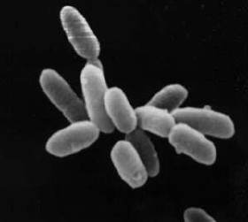

# Bacteria, Archaea And Viruses

Bacteria (singular bacterium) and Archaea (singular archaeon) constitute two domains of single-celled organisms. These microorganisms lack cell nuclei and are therefore prokaryotes. 

(ref:ecoli) [Scanning electron micrograph of Escherichia coli bacteria.](https://commons.wikimedia.org/wiki/File:EscherichiaColi_NIAID.jpg) 

```{r semecoli, fig.cap='(ref:ecoli)', echo=FALSE, message=FALSE, warning=FALSE}
knitr::include_graphics("./figures/bacteria/EscherichiaColi_NIAID.jpg")
```

For much of the 20th century, prokaryotes were regarded as a single group of organisms and classified based on their biochemistry, morphology and metabolism. Microbiologists tried to classify microorganisms based on the structures of their cell walls, their shapes, and the substances they consume. In 1965, Emile Zuckerkandl and Linus Pauling instead proposed using the sequences of the genes in different prokaryotes to work out how they are related to each other. This phylogenetic approach is the main method used today.

Archaea – at that time only the methanogens were known – were first classified separately from bacteria in 1977 by Carl Woese and George E. Fox based on their ribosomal RNA (rRNA) genes. They called these groups the Urkingdoms of Archaebacteria and Eubacteria, though other researchers treated them as kingdoms or subkingdoms. Woese and Fox gave the first evidence for Archaebacteria as a separate "line of descent": 1. lack of peptidoglycan in their cell walls, 2. two unusual coenzymes, 3. results of 16S ribosomal RNA gene sequencing. To emphasize this difference, Woese, Otto Kandler and Mark Wheelis later proposed reclassifying organisms into three natural domains known as the three-domain system: the Eukarya, the Bacteria and the Archaea, in what is now known as "The Woesian Revolution".

(ref:archaea) [Halobacterium sp. strain NRC-1, each cell about 5 μm long](https://commons.wikimedia.org/wiki/File:Halobacteria.jpg) 

```{r haloarchaea, fig.cap='(ref:archaea)', echo=FALSE, message=FALSE, warning=FALSE}

```

A virus is a submicroscopic infectious agent that replicates only inside the living cells of an organism. Viruses infect all types of life forms, from animals and plants to microorganisms, including bacteria and archaea. Since Dmitri Ivanovsky's 1892 article describing a non-bacterial pathogen infecting tobacco plants, and the discovery of the tobacco mosaic virus by Martinus Beijerinck in 1898, more than 6,000 virus species have been described in detail, of the millions of types of viruses in the environment. Viruses are found in almost every ecosystem on Earth and are the most numerous type of biological entity. The study of viruses is known as virology, a subspeciality of microbiology.

(ref:sarscov) [Severe acute respiratory syndrome coronavirus 2 (SARS-CoV-2) is the strain of coronavirus that causes coronavirus disease 2019 (COVID-19), the respiratory illness responsible for the COVID-19 pandemic.](https://commons.wikimedia.org/wiki/File:SARS-CoV-2_without_background.png) 

```{r sarscovi2, fig.cap='(ref:sarscov)', echo=FALSE, message=FALSE, warning=FALSE}
knitr::include_graphics("./figures/bacteria/SARS-CoV-2_without_background.png")
```

When infected, a host cell is forced to rapidly produce thousands of identical copies of the original virus. When not inside an infected cell or in the process of infecting a cell, viruses exist in the form of independent particles, or virions, consisting of: (i) the genetic material, i.e. long molecules of DNA or RNA that encode the structure of the proteins by which the virus acts; (ii) a protein coat, the capsid, which surrounds and protects the genetic material; and in some cases (iii) an outside envelope of lipids. The shapes of these virus particles range from simple helical and icosahedral forms to more complex structures. Most virus species have virions too small to be seen with an optical microscope as they are one hundredth the size of most bacteria.

The origins of viruses in the evolutionary history of life are unclear: some may have evolved from plasmids—pieces of DNA that can move between cells—while others may have evolved from bacteria. In evolution, viruses are an important means of horizontal gene transfer, which increases genetic diversity in a way analogous to sexual reproduction. Viruses are considered by some biologists to be a life form, because they carry genetic material, reproduce, and evolve through natural selection, although they lack the key characteristics such as cell structure that are generally considered necessary criteria for life. Because they possess some but not all such qualities, viruses have been described as "organisms at the edge of life", and as self-replicators.

## Bacteria

Bacteria (plural of the New Latin bacterium, which is the latinisation of the Greek βακτήριον (bakterion), the diminutive of βακτηρία (bakteria), meaning "staff, cane", because the first ones to be discovered were rod-shaped) constitute a large domain of prokaryotic microorganisms. Typically a few micrometres in length, bacteria have a number of shapes, ranging from spheres to rods and spirals. Bacteria were among the first life forms to appear on Earth, and are present in most of its habitats. Bacteria inhabit soil, water, acidic hot springs, radioactive waste, and the deep biosphere of the earth's crust. Bacteria also live in symbiotic and parasitic relationships with plants and animals. Most bacteria have not been characterised, and only about 27 percent of the bacterial phyla have species that can be grown in the laboratory. The study of bacteria is known as bacteriology, a branch of microbiology.

Nearly all animal life is dependent on bacteria for survival as only bacteria and some archaea possess the genes and enzymes necessary to synthesize vitamin B12, also known as cobalamin, and provide it through the food chain. Vitamin B12 is a water-soluble vitamin that is involved in the metabolism of every cell of the human body. It is a cofactor in DNA synthesis, and in both fatty acid and amino acid metabolism. It is particularly important in the normal functioning of the nervous system via its role in the synthesis of myelin.

There are typically 40 million bacterial cells in a gram of soil and a million bacterial cells in a millilitre of fresh water. There are approximately 5×1030 bacteria on Earth, forming a biomass which exceeds that of all plants and animals. Bacteria are vital in many stages of the nutrient cycle by recycling nutrients such as the fixation of nitrogen from the atmosphere. The nutrient cycle includes the decomposition of dead bodies; bacteria are responsible for the putrefaction stage in this process. In the biological communities surrounding hydrothermal vents and cold seeps, extremophile bacteria provide the nutrients needed to sustain life by converting dissolved compounds, such as hydrogen sulphide and methane, to energy.

In humans and most animals the largest number of bacteria exist in the gut, and a large number on the skin. The vast majority of the bacteria in the body are rendered harmless by the protective effects of the immune system, though many are beneficial, particularly in the gut flora. However, several species of bacteria are pathogenic and cause infectious diseases, including cholera, syphilis, anthrax, leprosy, and bubonic plague. The most common fatal bacterial diseases are respiratory infections. Tuberculosis alone kills about 2 million people per year, mostly in sub-Saharan Africa. Antibiotics are used to treat bacterial infections and are also used in farming, making antibiotic resistance a growing problem. In industry, bacteria are important in sewage treatment and the breakdown of oil spills, the production of cheese and yogurt through fermentation, the recovery of gold, palladium, copper and other metals in the mining sector, as well as in biotechnology, and the manufacture of antibiotics and other chemicals.

Once regarded as plants constituting the class Schizomycetes ("fission fungi"), bacteria are now classified as prokaryotes. Unlike cells of animals and other eukaryotes, bacterial cells do not contain a nucleus and rarely harbour membrane-bound organelles. Although the term bacteria traditionally included all prokaryotes, the scientific classification changed after the discovery in the 1990s that prokaryotes consist of two very different groups of organisms that evolved from an ancient common ancestor. These evolutionary domains are called Bacteria and Archaea.

The ancestors of modern bacteria were unicellular microorganisms that were the first forms of life to appear on Earth, about 4 billion years ago. For about 3 billion years, most organisms were microscopic, and bacteria and archaea were the dominant forms of life. Although bacterial fossils exist, such as stromatolites, their lack of distinctive morphology prevents them from being used to examine the history of bacterial evolution, or to date the time of origin of a particular bacterial species. However, gene sequences can be used to reconstruct the bacterial phylogeny, and these studies indicate that bacteria diverged first from the archaeal/eukaryotic lineage. The most recent common ancestor of bacteria and archaea was probably a hyperthermophile that lived about 2.5 billion–3.2 billion years ago. The earliest life on land may have been bacteria some 3.22 billion years ago.

Bacteria were also involved in the second great evolutionary divergence, that of the archaea and eukaryotes. Here, eukaryotes resulted from the entering of ancient bacteria into endosymbiotic associations with the ancestors of eukaryotic cells, which were themselves possibly related to the Archaea. This involved the engulfment by proto-eukaryotic cells of alphaproteobacterial symbionts to form either mitochondria or hydrogenosomes, which are still found in all known Eukarya (sometimes in highly reduced form, e.g. in ancient "amitochondrial" protozoa). Later, some eukaryotes that already contained mitochondria also engulfed cyanobacteria-like organisms, leading to the formation of chloroplasts in algae and plants. This is known as primary endosymbiosis.

Bacteria display a wide diversity of shapes and sizes, called morphologies. Bacterial cells are about one-tenth the size of eukaryotic cells and are typically 0.5–5.0 micrometres in length. However, a few species are visible to the unaided eye—for example, Thiomargarita namibiensis is up to half a millimetre long and Epulopiscium fishelsoni reaches 0.7 mm. Among the smallest bacteria are members of the genus Mycoplasma, which measure only 0.3 micrometres, as small as the largest viruses. Some bacteria may be even smaller, but these ultramicrobacteria are not well-studied.

(ref:bacshape) [Bacteria display various cell morphologies and arrangements](https://commons.wikimedia.org/wiki/File:Bacterial_morphology_diagram.svg) 

```{r bacteriashape, fig.cap='(ref:bacshape)', echo=FALSE, message=FALSE, warning=FALSE}
knitr::include_graphics("./figures/bacteria/Bacterial_morphology_diagram.svg")
```

Most bacterial species are either spherical, called cocci (singular coccus, from Greek kókkos, grain, seed), or rod-shaped, called bacilli (sing. bacillus, from Latin baculus, stick). Some bacteria, called vibrio, are shaped like slightly curved rods or comma-shaped; others can be spiral-shaped, called spirilla, or tightly coiled, called spirochaetes. A small number of other unusual shapes have been described, such as star-shaped bacteria. This wide variety of shapes is determined by the bacterial cell wall and cytoskeleton, and is important because it can influence the ability of bacteria to acquire nutrients, attach to surfaces, swim through liquids and escape predators.

Many bacterial species exist simply as single cells, others associate in characteristic patterns: Neisseria form diploids (pairs), Streptococcus form chains, and Staphylococcus group together in "bunch of grapes" clusters. Bacteria can also group to form larger multicellular structures, such as the elongated filaments of Actinobacteria, the aggregates of Myxobacteria, and the complex hyphae of Streptomyces. These multicellular structures are often only seen in certain conditions. For example, when starved of amino acids, Myxobacteria detect surrounding cells in a process known as quorum sensing, migrate towards each other, and aggregate to form fruiting bodies up to 500 micrometres long and containing approximately 100,000 bacterial cells. In these fruiting bodies, the bacteria perform separate tasks; for example, about one in ten cells migrate to the top of a fruiting body and differentiate into a specialised dormant state called a myxospore, which is more resistant to drying and other adverse environmental conditions.

Bacteria often attach to surfaces and form dense aggregations called biofilms, and larger formations known as microbial mats. These biofilms and mats can range from a few micrometres in thickness to up to half a metre in depth, and may contain multiple species of bacteria, protists and archaea. Bacteria living in biofilms display a complex arrangement of cells and extracellular components, forming secondary structures, such as microcolonies, through which there are networks of channels to enable better diffusion of nutrients. In natural environments, such as soil or the surfaces of plants, the majority of bacteria are bound to surfaces in biofilms. Biofilms are also important in medicine, as these structures are often present during chronic bacterial infections or in infections of implanted medical devices, and bacteria protected within biofilms are much harder to kill than individual isolated bacteria.

### Intracellular Structure

The bacterial cell is surrounded by a cell membrane, which is made primarily of phospholipids. This membrane encloses the contents of the cell and acts as a barrier to hold nutrients, proteins and other essential components of the cytoplasm within the cell. Unlike eukaryotic cells, bacteria usually lack large membrane-bound structures in their cytoplasm such as a nucleus, mitochondria, chloroplasts and the other organelles present in eukaryotic cells. However, some bacteria have protein-bound organelles in the cytoplasm which compartmentalize aspects of bacterial metabolism, such as the carboxysome. Additionally, bacteria have a multi-component cytoskeleton to control the localisation of proteins and nucleic acids within the cell, and to manage the process of cell division.

Many important biochemical reactions, such as energy generation, occur due to concentration gradients across membranes, creating a potential difference analogous to a battery. The general lack of internal membranes in bacteria means these reactions, such as electron transport, occur across the cell membrane between the cytoplasm and the outside of the cell or periplasm. However, in many photosynthetic bacteria the plasma membrane is highly folded and fills most of the cell with layers of light-gathering membrane. These light-gathering complexes may even form lipid-enclosed structures called chlorosomes in green sulfur bacteria.

Bacteria do not have a membrane-bound nucleus, and their genetic material is typically a single circular bacterial chromosome of DNA located in the cytoplasm in an irregularly shaped body called the nucleoid. The nucleoid contains the chromosome with its associated proteins and RNA. Like all other organisms, bacteria contain ribosomes for the production of proteins, but the structure of the bacterial ribosome is different from that of eukaryotes and Archaea.

Some bacteria produce intracellular nutrient storage granules, such as glycogen, polyphosphate, sulfur or polyhydroxyalkanoates. Bacteria such as the photosynthetic cyanobacteria, produce internal gas vacuoles, which they use to regulate their buoyancy, allowing them to move up or down into water layers with different light intensities and nutrient levels.

### Extracellular Structures

Around the outside of the cell membrane is the cell wall. Bacterial cell walls are made of peptidoglycan (also called murein), which is made from polysaccharide chains cross-linked by peptides containing D-amino acids. Bacterial cell walls are different from the cell walls of plants and fungi, which are made of cellulose and chitin, respectively. The cell wall of bacteria is also distinct from that of Archaea, which do not contain peptidoglycan. The cell wall is essential to the survival of many bacteria, and the antibiotic penicillin (produced by a fungus called Penicillium) is able to kill bacteria by inhibiting a step in the synthesis of peptidoglycan.

There are broadly speaking two different types of cell wall in bacteria, that classify bacteria into Gram-positive bacteria and Gram-negative bacteria. The names originate from the reaction of cells to the Gram stain, a long-standing test for the classification of bacterial species.

Gram-positive bacteria possess a thick cell wall containing many layers of peptidoglycan and teichoic acids. In contrast, Gram-negative bacteria have a relatively thin cell wall consisting of a few layers of peptidoglycan surrounded by a second lipid membrane containing lipopolysaccharides and lipoproteins. Most bacteria have the Gram-negative cell wall, and only the Firmicutes and Actinobacteria (previously known as the low G+C and high G+C Gram-positive bacteria, respectively) have the alternative Gram-positive arrangement. These differences in structure can produce differences in antibiotic susceptibility; for instance, vancomycin can kill only Gram-positive bacteria and is ineffective against Gram-negative pathogens, such as Haemophilus influenzae or Pseudomonas aeruginosa. Some bacteria have cell wall structures that are neither classically Gram-positive or Gram-negative. This includes clinically important bacteria such as Mycobacteria which have a thick peptidoglycan cell wall like a Gram-positive bacterium, but also a second outer layer of lipids.

In many bacteria, an S-layer of rigidly arrayed protein molecules covers the outside of the cell. This layer provides chemical and physical protection for the cell surface and can act as a macromolecular diffusion barrier. S-layers have diverse but mostly poorly understood functions, but are known to act as virulence factors in Campylobacter and contain surface enzymes in Bacillus stearothermophilus.

(ref:hpyl) [Helicobacter pylori electron micrograph](https://commons.wikimedia.org/wiki/File:EMpylori.jpg), showing multiple flagella on the cell surface

```{r helicopylori, fig.cap='(ref:hpyl)', echo=FALSE, message=FALSE, warning=FALSE}
knitr::include_graphics("./figures/bacteria/EMpylori.jpg")
```

Flagella are rigid protein structures, about 20 nanometres in diameter and up to 20 micrometres in length, that are used for motility. Flagella are driven by the energy released by the transfer of ions down an electrochemical gradient across the cell membrane.

Fimbriae (sometimes called "attachment pili") are fine filaments of protein, usually 2–10 nanometres in diameter and up to several micrometres in length. They are distributed over the surface of the cell, and resemble fine hairs when seen under the electron microscope. Fimbriae are believed to be involved in attachment to solid surfaces or to other cells, and are essential for the virulence of some bacterial pathogens. Pili (sing. pilus) are cellular appendages, slightly larger than fimbriae, that can transfer genetic material between bacterial cells in a process called conjugation where they are called conjugation pili or sex pili (see bacterial genetics, below). They can also generate movement where they are called type IV pili.

Glycocalyx is produced by many bacteria to surround their cells, and varies in structural complexity: ranging from a disorganised slime layer of extracellular polymeric substances to a highly structured capsule. These structures can protect cells from engulfment by eukaryotic cells such as macrophages (part of the human immune system). They can also act as antigens and be involved in cell recognition, as well as aiding attachment to surfaces and the formation of biofilms.

The assembly of these extracellular structures is dependent on bacterial secretion systems. These transfer proteins from the cytoplasm into the periplasm or into the environment around the cell. Many types of secretion systems are known and these structures are often essential for the virulence of pathogens, so are intensively studied.

### Endospores

Certain genera of Gram-positive bacteria, such as Bacillus, Clostridium, Sporohalobacter, Anaerobacter, and Heliobacterium, can form highly resistant, dormant structures called endospores. Endospores develop within the cytoplasm of the cell; generally a single endospore develops in each cell. Each endospore contains a core of DNA and ribosomes surrounded by a cortex layer and protected by a multilayer rigid coat composed of peptidoglycan and a variety of proteins.

(ref:endosp) [A stained preparation of the cell Bacillus subtilis showing endospores as green and the vegetative cell as red.](https://commons.wikimedia.org/wiki/File:Bacillus_subtilis_Spore.jpg) 

```{r endospore, fig.cap='(ref:endosp)', echo=FALSE, message=FALSE, warning=FALSE}
knitr::include_graphics("./figures/bacteria/Bacillus_subtilis_Spore.jpg")
```

Endospores show no detectable metabolism and can survive extreme physical and chemical stresses, such as high levels of UV light, gamma radiation, detergents, disinfectants, heat, freezing, pressure, and desiccation. In this dormant state, these organisms may remain viable for millions of years, and endospores even allow bacteria to survive exposure to the vacuum and radiation in space, possibly bacteria could be distributed throughout the Universe by space dust, meteoroids, asteroids, comets, planetoids or via directed panspermia. Endospore-forming bacteria can also cause disease: for example, anthrax can be contracted by the inhalation of Bacillus anthracis endospores, and contamination of deep puncture wounds with Clostridium tetani endospores causes tetanus.

(ref:endospf) [Formation of an endospore through the process of sporulation.](https://commons.wikimedia.org/wiki/File:Endospore_Formation.png) 

```{r endosporeform, fig.cap='(ref:endospf)', echo=FALSE, message=FALSE, warning=FALSE}
knitr::include_graphics("./figures/bacteria/Endospore_Formation.png")
```

### Metabolism

Bacteria exhibit an extremely wide variety of metabolic types. The distribution of metabolic traits within a group of bacteria has traditionally been used to define their taxonomy, but these traits often do not correspond with modern genetic classifications. Bacterial metabolism is classified into nutritional groups on the basis of three major criteria: the source of energy, the electron donors used, and the source of carbon used for growth.

Bacteria either derive energy from light using photosynthesis (called phototrophy), or by breaking down chemical compounds using oxidation (called chemotrophy). Chemotrophs use chemical compounds as a source of energy by transferring electrons from a given electron donor to a terminal electron acceptor in a redox reaction. This reaction releases energy that can be used to drive metabolism. Chemotrophs are further divided by the types of compounds they use to transfer electrons. Bacteria that use inorganic compounds such as hydrogen, carbon monoxide, or ammonia as sources of electrons are called lithotrophs, while those that use organic compounds are called organotrophs. The compounds used to receive electrons are also used to classify bacteria: aerobic organisms use oxygen as the terminal electron acceptor, while anaerobic organisms use other compounds such as nitrate, sulfate, or carbon dioxide.

Many bacteria get their carbon from other organic carbon, called heterotrophy. Others such as cyanobacteria and some purple bacteria are autotrophic, meaning that they obtain cellular carbon by fixing carbon dioxide. In unusual circumstances, the gas methane can be used by methanotrophic bacteria as both a source of electrons and a substrate for carbon anabolism.


```{r bacteriametabo, out.width='75%', echo=FALSE, message=FALSE, warning=FALSE}
library(tidyverse)
library(printr)        
library(kableExtra)
setwd("~/Dropbox/R/biology-text-master")

bacmet <-  as_tibble(read.csv("data/bacterial_metabolism.csv"))

knitr::kable(bacmet, col.names = c("Nutritional Type", "Source of Energy", "Source of Carbon", "Examples"), digits = 2, align = 'llll', booktabs = TRUE) %>% kable_styling(latex_options = c("striped", "hold_position"))
```

In many ways, bacterial metabolism provides traits that are useful for ecological stability and for human society. One example is that some bacteria have the ability to fix nitrogen gas using the enzyme nitrogenase. This environmentally important trait can be found in bacteria of most metabolic types listed above. This leads to the ecologically important processes of denitrification, sulfate reduction, and acetogenesis, respectively. Bacterial metabolic processes are also important in biological responses to pollution; for example, sulfate-reducing bacteria are largely responsible for the production of the highly toxic forms of mercury (methyl- and dimethylmercury) in the environment. Non-respiratory anaerobes use fermentation to generate energy and reducing power, secreting metabolic by-products (such as ethanol in brewing) as waste. Facultative anaerobes can switch between fermentation and different terminal electron acceptors depending on the environmental conditions in which they find themselves.

### Growth and reproduction

Many bacteria reproduce through binary fission, which is compared to mitosis and meiosis in this image.

Unlike in multicellular organisms, increases in cell size (cell growth) and reproduction by cell division are tightly linked in unicellular organisms. Bacteria grow to a fixed size and then reproduce through binary fission, a form of asexual reproduction. Under optimal conditions, bacteria can grow and divide extremely rapidly, and bacterial populations can double as quickly as every 9.8 minutes. In cell division, two identical clone daughter cells are produced. Some bacteria, while still reproducing asexually, form more complex reproductive structures that help disperse the newly formed daughter cells. Examples include fruiting body formation by Myxobacteria and aerial hyphae formation by Streptomyces, or budding. Budding involves a cell forming a protrusion that breaks away and produces a daughter cell.

In the laboratory, bacteria are usually grown using solid or liquid media. Solid growth media, such as agar plates, are used to isolate pure cultures of a bacterial strain. However, liquid growth media are used when the measurement of growth or large volumes of cells are required. Growth in stirred liquid media occurs as an even cell suspension, making the cultures easy to divide and transfer, although isolating single bacteria from liquid media is difficult. The use of selective media (media with specific nutrients added or deficient, or with antibiotics added) can help identify specific organisms.

Most laboratory techniques for growing bacteria use high levels of nutrients to produce large amounts of cells cheaply and quickly. However, in natural environments, nutrients are limited, meaning that bacteria cannot continue to reproduce indefinitely. This nutrient limitation has led the evolution of different growth strategies (see r/K selection theory). Some organisms can grow extremely rapidly when nutrients become available, such as the formation of algal (and cyanobacterial) blooms that often occur in lakes during the summer. Other organisms have adaptations to harsh environments, such as the production of multiple antibiotics by Streptomyces that inhibit the growth of competing microorganisms. In nature, many organisms live in communities (e.g., biofilms) that may allow for increased supply of nutrients and protection from environmental stresses. These relationships can be essential for growth of a particular organism or group of organisms (syntrophy).

Bacterial growth follows four phases. When a population of bacteria first enter a high-nutrient environment that allows growth, the cells need to adapt to their new environment. The first phase of growth is the lag phase, a period of slow growth when the cells are adapting to the high-nutrient environment and preparing for fast growth. The lag phase has high biosynthesis rates, as proteins necessary for rapid growth are produced. The second phase of growth is the logarithmic phase, also known as the exponential phase. The log phase is marked by rapid exponential growth. The rate at which cells grow during this phase is known as the growth rate (k), and the time it takes the cells to double is known as the generation time (g). During log phase, nutrients are metabolised at maximum speed until one of the nutrients is depleted and starts limiting growth. The third phase of growth is the stationary phase and is caused by depleted nutrients. The cells reduce their metabolic activity and consume non-essential cellular proteins. The stationary phase is a transition from rapid growth to a stress response state and there is increased expression of genes involved in DNA repair, antioxidant metabolism and nutrient transport. The final phase is the death phase where the bacteria run out of nutrients and die.

### Genetics

Most bacteria have a single circular chromosome that can range in size from only 160,000 base pairs in the endosymbiotic bacteria Carsonella ruddii, to 12,200,000 base pairs (12.2 Mbp) in the soil-dwelling bacteria Sorangium cellulosum. There are many exceptions to this, for example some Streptomyces and Borrelia species contain a single linear chromosome, while some Vibrio species contain more than one chromosome. Bacteria can also contain plasmids, small extra-chromosomal molecules of DNA that may contain genes for various useful functions such as antibiotic resistance, metabolic capabilities, or various virulence factors.

Bacteria genomes usually encode a few hundred to a few thousand genes. The genes in bacterial genomes are usually a single continuous stretch of DNA and although several different types of introns do exist in bacteria, these are much rarer than in eukaryotes.

Bacteria, as asexual organisms, inherit an identical copy of the parent's genomes and are clonal. However, all bacteria can evolve by selection on changes to their genetic material DNA caused by genetic recombination or mutations. Mutations come from errors made during the replication of DNA or from exposure to mutagens. Mutation rates vary widely among different species of bacteria and even among different clones of a single species of bacteria. Genetic changes in bacterial genomes come from either random mutation during replication or "stress-directed mutation", where genes involved in a particular growth-limiting process have an increased mutation rate.

Some bacteria also transfer genetic material between cells. This can occur in three main ways. First, bacteria can take up exogenous DNA from their environment, in a process called transformation. Many bacteria can naturally take up DNA from the environment, while others must be chemically altered in order to induce them to take up DNA. The development of competence in nature is usually associated with stressful environmental conditions, and seems to be an adaptation for facilitating repair of DNA damage in recipient cells. The second way bacteria transfer genetic material is by transduction, when the integration of a bacteriophage introduces foreign DNA into the chromosome. Many types of bacteriophage exist, some simply infect and lyse their host bacteria, while others insert into the bacterial chromosome. Bacteria resist phage infection through restriction modification systems that degrade foreign DNA, and a system that uses CRISPR sequences to retain fragments of the genomes of phage that the bacteria have come into contact with in the past, which allows them to block virus replication through a form of RNA interference. The third method of gene transfer is conjugation, whereby DNA is transferred through direct cell contact. In ordinary circumstances, transduction, conjugation, and transformation involve transfer of DNA between individual bacteria of the same species, but occasionally transfer may occur between individuals of different bacterial species and this may have significant consequences, such as the transfer of antibiotic resistance. In such cases, gene acquisition from other bacteria or the environment is called horizontal gene transfer and may be common under natural conditions.

### Movement

Many bacteria are motile (able to move themselves) and do so using a variety of mechanisms. The best studied of these are flagella, long filaments that are turned by a motor at the base to generate propeller-like movement. The bacterial flagellum is made of about 20 proteins, with approximately another 30 proteins required for its regulation and assembly. The flagellum is a rotating structure driven by a reversible motor at the base that uses the electrochemical gradient across the membrane for power.

Bacteria can use flagella in different ways to generate different kinds of movement. Many bacteria (such as E. coli) have two distinct modes of movement: forward movement (swimming) and tumbling. The tumbling allows them to reorient and makes their movement a three-dimensional random walk. Bacterial species differ in the number and arrangement of flagella on their surface; some have a single flagellum (monotrichous), a flagellum at each end (amphitrichous), clusters of flagella at the poles of the cell (lophotrichous), while others have flagella distributed over the entire surface of the cell (peritrichous). The flagella of a unique group of bacteria, the spirochaetes, are found between two membranes in the periplasmic space. They have a distinctive helical body that twists about as it moves.

Two other types of bacterial motion are called twitching motility that relies on a structure called the type IV pilus, and gliding motility, that uses other mechanisms. In twitching motility, the rod-like pilus extends out from the cell, binds some substrate, and then retracts, pulling the cell forward.

Motile bacteria are attracted or repelled by certain stimuli in behaviours called taxes: these include chemotaxis, phototaxis, energy taxis, and magnetotaxis. In one peculiar group, the myxobacteria, individual bacteria move together to form waves of cells that then differentiate to form fruiting bodies containing spores. The myxobacteria move only when on solid surfaces, unlike E. coli, which is motile in liquid or solid media.

Several Listeria and Shigella species move inside host cells by usurping the cytoskeleton, which is normally used to move organelles inside the cell. By promoting actin polymerisation at one pole of their cells, they can form a kind of tail that pushes them through the host cell's cytoplasm.

### Communication

Bacteria often function as multicellular aggregates known as biofilms, exchanging a variety of molecular signals for inter-cell communication, and engaging in coordinated multicellular behaviour.

The communal benefits of multicellular cooperation include a cellular division of labour, accessing resources that cannot effectively be used by single cells, collectively defending against antagonists, and optimising population survival by differentiating into distinct cell types. For example, bacteria in biofilms can have more than 500 times increased resistance to antibacterial agents than individual "planktonic" bacteria of the same species.

One type of inter-cellular communication by a molecular signal is called quorum sensing, which serves the purpose of determining whether there is a local population density that is sufficiently high that it is productive to invest in processes that are only successful if large numbers of similar organisms behave similarly, as in excreting digestive enzymes or emitting light.

Quorum sensing allows bacteria to coordinate gene expression, and enables them to produce, release and detect autoinducers or pheromones which accumulate with the growth in cell population.

### Classification and identification

Classification seeks to describe the diversity of bacterial species by naming and grouping organisms based on similarities. Bacteria can be classified on the basis of cell structure, cellular metabolism or on differences in cell components, such as DNA, fatty acids, pigments, antigens and quinones. While these schemes allowed the identification and classification of bacterial strains, it was unclear whether these differences represented variation between distinct species or between strains of the same species. This uncertainty was due to the lack of distinctive structures in most bacteria, as well as lateral gene transfer between unrelated species. Due to lateral gene transfer, some closely related bacteria can have very different morphologies and metabolisms. To overcome this uncertainty, modern bacterial classification emphasises molecular systematics, using genetic techniques such as guanine cytosine ratio determination, genome-genome hybridisation, as well as sequencing genes that have not undergone extensive lateral gene transfer, such as the rRNA gene. Classification of bacteria is determined by publication in the International Journal of Systematic Bacteriology, and Bergey's Manual of Systematic Bacteriology. The International Committee on Systematic Bacteriology (ICSB) maintains international rules for the naming of bacteria and taxonomic categories and for the ranking of them in the International Code of Nomenclature of Bacteria.

The term "bacteria" was traditionally applied to all microscopic, single-cell prokaryotes. However, molecular systematics showed prokaryotic life to consist of two separate domains, originally called Eubacteria and Archaebacteria, but now called Bacteria and Archaea that evolved independently from an ancient common ancestor. The archaea and eukaryotes are more closely related to each other than either is to the bacteria. These two domains, along with Eukarya, are the basis of the three-domain system, which is currently the most widely used classification system in microbiology. However, due to the relatively recent introduction of molecular systematics and a rapid increase in the number of genome sequences that are available, bacterial classification remains a changing and expanding field. For example, Cavalier-Smith argued that the Archaea and Eukaryotes evolved from Gram-positive bacteria.

The identification of bacteria in the laboratory is particularly relevant in medicine, where the correct treatment is determined by the bacterial species causing an infection. Consequently, the need to identify human pathogens was a major impetus for the development of techniques to identify bacteria.

The Gram stain, developed in 1884 by Hans Christian Gram, characterises bacteria based on the structural characteristics of their cell walls. The thick layers of peptidoglycan in the "Gram-positive" cell wall stain purple, while the thin "Gram-negative" cell wall appears pink. By combining morphology and Gram-staining, most bacteria can be classified as belonging to one of four groups (Gram-positive cocci, Gram-positive bacilli, Gram-negative cocci and Gram-negative bacilli). Some organisms are best identified by stains other than the Gram stain, particularly mycobacteria or Nocardia, which show acid-fastness on Ziehl–Neelsen or similar stains. Other organisms may need to be identified by their growth in special media, or by other techniques, such as serology.

Culture techniques are designed to promote the growth and identify particular bacteria, while restricting the growth of the other bacteria in the sample. Often these techniques are designed for specific specimens; for example, a sputum sample will be treated to identify organisms that cause pneumonia, while stool specimens are cultured on selective media to identify organisms that cause diarrhoea, while preventing growth of non-pathogenic bacteria. Specimens that are normally sterile, such as blood, urine or spinal fluid, are cultured under conditions designed to grow all possible organisms. Once a pathogenic organism has been isolated, it can be further characterised by its morphology, growth patterns (such as aerobic or anaerobic growth), patterns of hemolysis, and staining.

As with bacterial classification, identification of bacteria is increasingly using molecular methods. Diagnostics using DNA-based tools, such as polymerase chain reaction, are increasingly popular due to their specificity and speed, compared to culture-based methods. These methods also allow the detection and identification of "viable but nonculturable" cells that are metabolically active but non-dividing. However, even using these improved methods, the total number of bacterial species is not known and cannot even be estimated with any certainty. Following present classification, there are a little less than 9,300 known species of prokaryotes, which includes bacteria and archaea; but attempts to estimate the true number of bacterial diversity have ranged from 107 to 109 total species—and even these diverse estimates may be off by many orders of magnitude.

### Interactions With Other Organisms

Despite their apparent simplicity, bacteria can form complex associations with other organisms. These symbiotic associations can be divided into parasitism, mutualism and commensalism. Due to their small size, commensal bacteria are ubiquitous and grow on animals and plants exactly as they will grow on any other surface. However, their growth can be increased by warmth and sweat, and large populations of these organisms in humans are the cause of body odour.

Some species of bacteria kill and then consume other microorganisms, these species are called predatory bacteria. These include organisms such as Myxococcus xanthus, which forms swarms of cells that kill and digest any bacteria they encounter. Other bacterial predators either attach to their prey in order to digest them and absorb nutrients, such as Vampirovibrio chlorellavorus, or invade another cell and multiply inside the cytosol, such as Daptobacter. These predatory bacteria are thought to have evolved from saprophages that consumed dead microorganisms, through adaptations that allowed them to entrap and kill other organisms.

Certain bacteria form close spatial associations that are essential for their survival. One such mutualistic association, called interspecies hydrogen transfer, occurs between clusters of anaerobic bacteria that consume organic acids, such as butyric acid or propionic acid, and produce hydrogen, and methanogenic Archaea that consume hydrogen. The bacteria in this association are unable to consume the organic acids as this reaction produces hydrogen that accumulates in their surroundings. Only the intimate association with the hydrogen-consuming Archaea keeps the hydrogen concentration low enough to allow the bacteria to grow.

In soil, microorganisms that reside in the rhizosphere (a zone that includes the root surface and the soil that adheres to the root after gentle shaking) carry out nitrogen fixation, converting nitrogen gas to nitrogenous compounds. This serves to provide an easily absorbable form of nitrogen for many plants, which cannot fix nitrogen themselves. Many other bacteria are found as symbionts in humans and other organisms. For example, the presence of over 1,000 bacterial species in the normal human gut flora of the intestines can contribute to gut immunity, synthesise vitamins, such as folic acid, vitamin K and biotin, convert sugars to lactic acid (see Lactobacillus), as well as fermenting complex undigestible carbohydrates. The presence of this gut flora also inhibits the growth of potentially pathogenic bacteria (usually through competitive exclusion) and these beneficial bacteria are consequently sold as probiotic dietary supplements.

### Bacteria as Pathogens

If bacteria form a parasitic association with other organisms, they are classed as pathogens. Pathogenic bacteria are a major cause of human death and disease and cause infections such as tetanus (Caused by Clostridium tetani), typhoid fever, diphtheria, syphilis, cholera, foodborne illness, leprosy (caused by Micobacterium leprae) and tuberculosis (Caused by Mycobacterium tuberculosis). A pathogenic cause for a known medical disease may only be discovered many years after, as was the case with Helicobacter pylori and peptic ulcer disease. Bacterial diseases are also important in agriculture, with bacteria causing leaf spot, fire blight and wilts in plants, as well as Johne's disease, mastitis, salmonella and anthrax in farm animals.

Each species of pathogen has a characteristic spectrum of interactions with its human hosts. Some organisms, such as Staphylococcus or Streptococcus, can cause skin infections, pneumonia, meningitis and even overwhelming sepsis, a systemic inflammatory response producing shock, massive vasodilation and death. Yet these organisms are also part of the normal human flora and usually exist on the skin or in the nose without causing any disease at all. Other organisms invariably cause disease in humans, such as the Rickettsia, which are obligate intracellular parasites able to grow and reproduce only within the cells of other organisms. One species of Rickettsia causes typhus, while another causes Rocky Mountain spotted fever. Chlamydia, another phylum of obligate intracellular parasites, contains species that can cause pneumonia, or urinary tract infection and may be involved in coronary heart disease. Finally, some species, such as Pseudomonas aeruginosa, Burkholderia cenocepacia, and Mycobacterium avium, are opportunistic pathogens and cause disease mainly in people suffering from immunosuppression or cystic fibrosis.

Bacterial infections may be treated with antibiotics, which are classified as bacteriocidal if they kill bacteria, or bacteriostatic if they just prevent bacterial growth. There are many types of antibiotics and each class inhibits a process that is different in the pathogen from that found in the host. An example of how antibiotics produce selective toxicity are chloramphenicol and puromycin, which inhibit the bacterial ribosome, but not the structurally different eukaryotic ribosome. Antibiotics are used both in treating human disease and in intensive farming to promote animal growth, where they may be contributing to the rapid development of antibiotic resistance in bacterial populations. Infections can be prevented by antiseptic measures such as sterilising the skin prior to piercing it with the needle of a syringe, and by proper care of indwelling catheters. Surgical and dental instruments are also sterilised to prevent contamination by bacteria. Disinfectants such as bleach are used to kill bacteria or other pathogens on surfaces to prevent contamination and further reduce the risk of infection.

### Significance in Technology And Industry

Bacteria, often lactic acid bacteria, such as Lactobacillus and Lactococcus, in combination with yeasts and moulds, have been used for thousands of years in the preparation of fermented foods, such as cheese, pickles, soy sauce, sauerkraut, vinegar, wine and yogurt.

The ability of bacteria to degrade a variety of organic compounds is remarkable and has been used in waste processing and bioremediation. Bacteria capable of digesting the hydrocarbons in petroleum are often used to clean up oil spills. Fertiliser was added to some of the beaches in Prince William Sound in an attempt to promote the growth of these naturally occurring bacteria after the 1989 Exxon Valdez oil spill. These efforts were effective on beaches that were not too thickly covered in oil. Bacteria are also used for the bioremediation of industrial toxic wastes. In the chemical industry, bacteria are most important in the production of enantiomerically pure chemicals for use as pharmaceuticals or agrichemicals.

Bacteria can also be used in the place of pesticides in the biological pest control. This commonly involves Bacillus thuringiensis (also called BT), a Gram-positive, soil dwelling bacterium. Subspecies of this bacteria are used as a Lepidopteran-specific insecticides under trade names such as Dipel and Thuricide. Because of their specificity, these pesticides are regarded as environmentally friendly, with little or no effect on humans, wildlife, pollinators and most other beneficial insects.

Because of their ability to quickly grow and the relative ease with which they can be manipulated, bacteria are the workhorses for the fields of molecular biology, genetics and biochemistry. By making mutations in bacterial DNA and examining the resulting phenotypes, scientists can determine the function of genes, enzymes and metabolic pathways in bacteria, then apply this knowledge to more complex organisms. This aim of understanding the biochemistry of a cell reaches its most complex expression in the synthesis of huge amounts of enzyme kinetic and gene expression data into mathematical models of entire organisms. This is achievable in some well-studied bacteria, with models of Escherichia coli metabolism now being produced and tested. This understanding of bacterial metabolism and genetics allows the use of biotechnology to bioengineer bacteria for the production of therapeutic proteins, such as insulin, growth factors, or antibodies.

Because of their importance for research in general, samples of bacterial strains are isolated and preserved in Biological Resource Centers. This ensures the availability of the strain to scientists worldwide.

## Archaea

The word archaea comes from the Ancient Greek ἀρχαῖα, meaning "ancient things", as the first representatives of the domain Archaea were methanogens and it was assumed that their metabolism reflected Earth's primitive atmosphere and the organisms' antiquity, but as new habitats were studied, more organisms were discovered. Extreme halophilic and hyperthermophilic microbes were also included in Archaea. For a long time, archaea were seen as extremophiles that exist only in extreme habitats such as hot springs and salt lakes, but by the end of the 20th century, archaea had been identified in non-extreme environments as well. Today, they are known to be a large and diverse group of organisms abundantly distributed throughout nature. This new appreciation of the importance and ubiquity of archaea came from using polymerase chain reaction (PCR) to detect prokaryotes from environmental samples (such as water or soil) by multiplying their ribosomal genes. This allows the detection and identification of organisms that have not been cultured in the laboratory.

Archaeal cells have unique properties separating them from the other two domains, Bacteria and Eukaryota. Archaea are further divided into multiple recognized phyla. Classification is difficult because most have not been isolated in the laboratory and have been detected only by analysis of their nucleic acids in samples from their environment.

Archaea and bacteria are generally similar in size and shape, although a few archaea have very different shapes, such as the flat and square cells of Haloquadratum walsbyi. Despite this morphological similarity to bacteria, archaea possess genes and several metabolic pathways that are more closely related to those of eukaryotes, notably for the enzymes involved in transcription and translation. Other aspects of archaeal biochemistry are unique, such as their reliance on ether lipids in their cell membranes, including archaeols. Archaea use more energy sources than eukaryotes: these range from organic compounds, such as sugars, to ammonia, metal ions or even hydrogen gas. Salt-tolerant archaea (the Haloarchaea) use sunlight as an energy source, and other species of archaea fix carbon, but unlike plants and cyanobacteria, no known species of archaea does both. Archaea reproduce asexually by binary fission, fragmentation, or budding; unlike bacteria, no known species of Archaea form endospores. The first observed archaea were extremophiles, living in extreme environments, such as hot springs and salt lakes with no other organisms. Improved detection tools led to the discovery of archaea in almost every habitat, including soil, oceans, and marshlands. Archaea are particularly numerous in the oceans, and the archaea in plankton may be one of the most abundant groups of organisms on the planet.

Archaea are a major part of Earth's life. They are part of the microbiota of all organisms. In the human microbiota, they are important in the gut, mouth, and on the skin. Their morphological, metabolic, and geographical diversity permits them to play multiple ecological roles: carbon fixation; nitrogen cycling; organic compound turnover; and maintaining microbial symbiotic and syntrophic communities, for example.

No clear examples of archaeal pathogens or parasites are known. Instead they are often mutualists or commensals, such as the methanogens (methane-producing strains) that inhabit the gastrointestinal tract in humans and ruminants, where their vast numbers aid digestion. Methanogens are also used in biogas production and sewage treatment, and biotechnology exploits enzymes from extremophile archaea that can endure high temperatures and organic solvents.

### Origin and evolution

The age of the Earth is about 4.54 billion years. Scientific evidence suggests that life began on Earth at least 3.5 billion years ago. The earliest evidence for life on Earth is graphite found to be biogenic in 3.7-billion-year-old metasedimentary rocks discovered in Western Greenland and microbial mat fossils found in 3.48-billion-year-old sandstone discovered in Western Australia. In 2015, possible remains of biotic matter were found in 4.1-billion-year-old rocks in Western Australia.

Although probable prokaryotic cell fossils date to almost 3.5 billion years ago, most prokaryotes do not have distinctive morphologies, and fossil shapes cannot be used to identify them as archaea. Instead, chemical fossils of unique lipids are more informative because such compounds do not occur in other organisms. Some publications suggest that archaeal or eukaryotic lipid remains are present in shales dating from 2.7 billion years ago; though such data have since been questioned. These lipids have also been detected in even older rocks from west Greenland. The oldest such traces come from the Isua district, which includes Earth's oldest known sediments, formed 3.8 billion years ago. The archaeal lineage may be the most ancient that exists on Earth.

Woese argued that the Bacteria, Archaea, and Eukaryotes represent separate lines of descent that diverged early on from an ancestral colony of organisms. One possibility is that this occurred before the evolution of cells, when the lack of a typical cell membrane allowed unrestricted lateral gene transfer, and that the common ancestors of the three domains arose by fixation of specific subsets of genes. It is possible that the last common ancestor of bacteria and archaea was a thermophile, which raises the possibility that lower temperatures are "extreme environments" for archaea, and organisms that live in cooler environments appeared only later. Since archaea and bacteria are no more related to each other than they are to eukaryotes, the term prokaryote may suggest a false similarity between them. However, structural and functional similarities between lineages often occur because of shared ancestral traits or evolutionary convergence. These similarities are known as a grade, and prokaryotes are best thought of a grade of life, characterized by such features as an absence of membrane-bound organelles.

The following table (\@ref(tab:domaincomparison) compares some major characteristics of the three domains, to illustrate their similarities and differences.

```{r domaincomparison, out.width='75%', echo=FALSE, message=FALSE, warning=FALSE}
library(tidyverse)
library(printr)        
library(kableExtra)
setwd("~/Dropbox/R/biology-text-master")

domaincomp <-  as_tibble(read.csv("data/bacteria_archaea_comp.csv"))

knitr::kable(domaincomp, col.names = c("Property", "Bacteria", "Archaea", "Eukarya"), digits = 2, align = 'llll', booktabs = TRUE, caption = "A comparison of major characterisitcs of the domains of Bacteria, Archaea and Eukaryia") %>% kable_styling(latex_options = c("striped", "hold_position")) 
```

Archaea were split off as a third domain because of the large differences in their ribosomal RNA structure. The particular molecule 16S rRNA is key to the production of proteins in all organisms. Because this function is so central to life, organisms with mutations in their 16S rRNA are unlikely to survive, leading to great (but not absolute) stability in the structure of this nucleotide over generations. 16S rRNA is large enough to show organism-specific variations, but still small enough to be compared quickly. In 1977, Carl Woese, a microbiologist studying the genetic sequences of organisms, developed a new comparison method that involved splitting the RNA into fragments that could be sorted and compared with other fragments from other organisms. The more similar the patterns between species, the more closely they are related.

Woese used his new rRNA comparison method to categorize and contrast different organisms. He compared a variety of species and happened upon a group of methanogens with rRNA vastly different from any known prokaryotes or eukaryotes. These methanogens were much more similar to each other than to other organisms, leading Woese to propose the new domain of Archaea. His experiments showed that the archaea were genetically more similar to eukaryotes than prokaryotes, even though they were more similar to prokaryotes in structure. This led to the conclusion that Archaea and Eukarya shared a common ancestor more recent than Eukarya and Bacteria. The development of the nucleus occurred after the split between Bacteria and this common ancestor.

One property unique to archaea is the abundant use of ether-linked lipids in their cell membranes. Ether linkages are more chemically stable than the ester linkages found in bacteria and eukarya, which may be a contributing factor to the ability of many archaea to survive in extreme environments that place heavy stress on cell membranes, such as extreme heat and salinity. Comparative analysis of archaeal genomes has also identified several molecular conserved signature indels and signature proteins uniquely present in either all archaea or different main groups within archaea. Another unique feature of archaea, found in no other organisms, is methanogenesis (the metabolic production of methane). Methanogenic archaea play a pivotal role in ecosystems with organisms that derive energy from oxidation of methane, many of which are bacteria, as they are often a major source of methane in such environments and can play a role as primary producers. Methanogens also play a critical role in the carbon cycle, breaking down organic carbon into methane, which is also a major greenhouse gas.

### Relationship to Bacteria

The relationships among the three domains are of central importance for understanding the origin of life. Most of the metabolic pathways, which are the object of the majority of an organism's genes, are common between Archaea and Bacteria, while most genes involved in genome expression are common between Archaea and Eukarya. Within prokaryotes, archaeal cell structure is most similar to that of gram-positive bacteria, largely because both have a single lipid bilayer and usually contain a thick sacculus (exoskeleton) of varying chemical composition. In some phylogenetic trees based upon different gene/protein sequences of prokaryotic homologs, the archaeal homologs are more closely related to those of gram-positive bacteria. Archaea and gram-positive bacteria also share conserved indels in a number of important proteins, such as Hsp70 and glutamine synthetase I; but the phylogeny of these genes was interpreted to reveal interdomain gene transfer, and might not reflect the organismal relationship(s).

It has been proposed that the archaea evolved from gram-positive bacteria in response to antibiotic selection pressure. This is suggested by the observation that archaea are resistant to a wide variety of antibiotics that are produced primarily by gram-positive bacteria, and that these antibiotics act primarily on the genes that distinguish archaea from bacteria. The proposal is that the selective pressure towards resistance generated by the gram-positive antibiotics was eventually sufficient to cause extensive changes in many of the antibiotics' target genes, and that these strains represented the common ancestors of present-day Archaea. The evolution of Archaea in response to antibiotic selection, or any other competitive selective pressure, could also explain their adaptation to extreme environments (such as high temperature or acidity) as the result of a search for unoccupied niches to escape from antibiotic-producing organisms; Cavalier-Smith has made a similar suggestion. This proposal is also supported by other work investigating protein structural relationships and studies that suggest that gram-positive bacteria may constitute the earliest branching lineages within the prokaryotes.

### Relation to Eukaryotes

The evolutionary relationship between archaea and eukaryotes remains unclear. Aside from the similarities in cell structure and function that are discussed below, many genetic trees group the two.

Complicating factors include claims that the relationship between eukaryotes and the archaeal phylum Crenarchaeota is closer than the relationship between the Euryarchaeota and the phylum Crenarchaeota and the presence of archaea-like genes in certain bacteria, such as Thermotoga maritima, from horizontal gene transfer. The standard hypothesis states that the ancestor of the eukaryotes diverged early from the Archaea, and that eukaryotes arose through fusion of an archaean and eubacterium, which became the nucleus and cytoplasm; this hypothesis explains various genetic similarities but runs into difficulties explaining cell structure. An alternative hypothesis, the eocyte hypothesis, posits that Eukaryota emerged relatively late from the Archaea.

A lineage of archaea discovered in 2015, Lokiarchaeum (of proposed new Phylum "Lokiarchaeota"), named for a hydrothermal vent called Loki's Castle in the Arctic Ocean, was found to be the most closely related to eukaryotes known at that time. It has been called a transitional organism between prokaryotes and eukaryotes.

Several sister phyla of "Lokiarchaeota" have since been found ("Thorarchaeota", "Odinarchaeota", "Heimdallarchaeota"), all together comprising a newly proposed supergroup Asgard, which may appear as a sister taxon to Proteoarchaeota.

Details of the relation of Asgard members and eukaryotes are still under consideration, although, in January 2020, scientists reported that Candidatus Prometheoarchaeum syntrophicum, a type of Asgard archaea, may be a possible link between simple prokaryotic and complex eukaryotic microorganisms about two billion years ago.

### Morphology

Individual archaea range from 0.1 micrometers (μm) to over 15 μm in diameter, and occur in various shapes, commonly as spheres, rods, spirals or plates. Other morphologies in the Crenarchaeota include irregularly shaped lobed cells in Sulfolobus, needle-like filaments that are less than half a micrometer in diameter in Thermofilum, and almost perfectly rectangular rods in Thermoproteus and Pyrobaculum. Archaea in the genus Haloquadratum such as Haloquadratum walsbyi are flat, square specimens that live in hypersaline pools. These unusual shapes are probably maintained by both their cell walls and a prokaryotic cytoskeleton. Proteins related to the cytoskeleton components of other organisms exist in archaea, and filaments form within their cells, but in contrast with other organisms, these cellular structures are poorly understood. In Thermoplasma and Ferroplasma the lack of a cell wall means that the cells have irregular shapes, and can resemble amoebae.

Some species form aggregates or filaments of cells up to 200 μm long. These organisms can be prominent in biofilms. Notably, aggregates of Thermococcus coalescens cells fuse together in culture, forming single giant cells. Archaea in the genus Pyrodictium produce an elaborate multicell colony involving arrays of long, thin hollow tubes called cannulae that stick out from the cells' surfaces and connect them into a dense bush-like agglomeration. The function of these cannulae is not settled, but they may allow communication or nutrient exchange with neighbors. Multi-species colonies exist, such as the "string-of-pearls" community that was discovered in 2001 in a German swamp. Round whitish colonies of a novel Euryarchaeota species are spaced along thin filaments that can range up to 15 centimetres (5.9 in) long; these filaments are made of a particular bacteria species.

### Structure, Composition Development, And Operation

Archaea and bacteria have generally similar cell structure, but cell composition and organization set the archaea apart. Like bacteria, archaea lack interior membranes and organelles. Like bacteria, the cell membranes of archaea are usually bounded by a cell wall and they swim using one or more flagella. Structurally, archaea are most similar to gram-positive bacteria. Most have a single plasma membrane and cell wall, and lack a periplasmic space; the exception to this general rule is Ignicoccus, which possess a particularly large periplasm that contains membrane-bound vesicles and is enclosed by an outer membrane.

### Cell Wall And Flagella

Most archaea (but not Thermoplasma and Ferroplasma) possess a cell wall. In most archaea the wall is assembled from surface-layer proteins, which form an S-layer. An S-layer is a rigid array of protein molecules that cover the outside of the cell (like chain mail). This layer provides both chemical and physical protection, and can prevent macromolecules from contacting the cell membrane. Unlike bacteria, archaea lack peptidoglycan in their cell walls. Methanobacteriales do have cell walls containing pseudopeptidoglycan, which resembles eubacterial peptidoglycan in morphology, function, and physical structure, but pseudopeptidoglycan is distinct in chemical structure; it lacks D-amino acids and N-acetylmuramic acid, substituting the latter with N-Acetyltalosaminuronic acid.

Archaeal flagella are known as archaella, that operate like bacterial flagella – their long stalks are driven by rotatory motors at the base. These motors are powered by a proton gradient across the membrane, but archaella are notably different in composition and development. The two types of flagella evolved from different ancestors. The bacterial flagellum shares a common ancestor with the type III secretion system, while archaeal flagella appear to have evolved from bacterial type IV pili. In contrast with the bacterial flagellum, which is hollow and assembled by subunits moving up the central pore to the tip of the flagella, archaeal flagella are synthesized by adding subunits at the base.

### Membranes

Archaeal membranes are made of molecules that are distinctly different from those in all other life forms, showing that archaea are related only distantly to bacteria and eukaryotes. In all organisms, cell membranes are made of molecules known as phospholipids. These molecules possess both a polar part that dissolves in water (the phosphate "head"), and a "greasy" non-polar part that does not (the lipid tail). These dissimilar parts are connected by a glycerol moiety. In water, phospholipids cluster, with the heads facing the water and the tails facing away from it. The major structure in cell membranes is a double layer of these phospholipids, which is called a lipid bilayer.

The phospholipids of archaea are unusual in four ways:

* They have membranes composed of glycerol-ether lipids, whereas bacteria and eukaryotes have membranes composed mainly of glycerol-ester lipids. The difference is the type of bond that joins the lipids to the glycerol moiety; the two types are shown in yellow in the figure at the right. In ester lipids this is an ester bond, whereas in ether lipids this is an ether bond.
* The stereochemistry of the archaeal glycerol moiety is the mirror image of that found in other organisms. The glycerol moiety can occur in two forms that are mirror images of one another, called enantiomers. Just as a right hand does not fit easily into a left-handed glove, enantiomers of one type generally cannot be used or made by enzymes adapted for the other. The archaeal phospholipids are built on a backbone of sn-glycerol-1-phosphate, which is an enantiomer of sn-glycerol-3-phosphate, the phospholipid backbone found in bacteria and eukaryotes. This suggests that archaea use entirely different enzymes for synthesizing phospholipids as compared to bacteria and eukaryotes. Such enzymes developed very early in life's history, indicating an early split from the other two domains.
* Archaeal lipid tails differ from those of other organisms in that they are based upon long isoprenoid chains with multiple side-branches, sometimes with cyclopropane or cyclohexane rings. By contrast, the fatty acids in the membranes of other organisms have straight chains without side branches or rings. Although isoprenoids play an important role in the biochemistry of many organisms, only the archaea use them to make phospholipids. These branched chains may help prevent archaeal membranes from leaking at high temperatures.
* In some archaea, the lipid bilayer is replaced by a monolayer. In effect, the archaea fuse the tails of two phospholipid molecules into a single molecule with two polar heads (a bolaamphiphile); this fusion may make their membranes more rigid and better able to resist harsh environments. For example, the lipids in Ferroplasma are of this type, which is thought to aid this organism's survival in its highly acidic habitat.

(ref:membcomp) [A comparison of the membrane structures of Archaea, Bacteria and Eukarya. Top, an archaeal phospholipid: 1, isoprene chains; 2, ether linkages; 3, L-glycerol moiety; 4, phosphate group. Middle, a bacterial or eukaryotic phospholipid: 5, fatty acid chains; 6, ester linkages; 7, D-glycerol moiety; 8, phosphate group. Bottom: 9, lipid bilayer of bacteria and eukaryotes; 10, lipid monolayer of some archaea.](https://commons.wikimedia.org/wiki/File:Archaea_membrane.svg) 

```{r membranestruccomp, fig.cap='(ref:membcomp)', echo=FALSE, message=FALSE, warning=FALSE}
knitr::include_graphics("./figures/bacteria/Archaea_membrane.svg")
```

### Metabolism

Archaea exhibit a great variety of chemical reactions in their metabolism and use many sources of energy. These reactions are classified into nutritional groups, depending on energy and carbon sources. Some archaea obtain energy from inorganic compounds such as sulfur or ammonia (they are chemotrophs). These include nitrifiers, methanogens and anaerobic methane oxidisers. In these reactions one compound passes electrons to another (in a redox reaction), releasing energy to fuel the cell's activities. One compound acts as an electron donor and one as an electron acceptor. The energy released is used to generate adenosine triphosphate (ATP) through chemiosmosis, the same basic process that happens in the mitochondrion of eukaryotic cells.

Other groups of archaea use sunlight as a source of energy (they are phototrophs), but oxygen–generating photosynthesis does not occur in any of these organisms. Many basic metabolic pathways are shared among all forms of life; for example, archaea use a modified form of glycolysis (the Entner–Doudoroff pathway) and either a complete or partial citric acid cycle. These similarities to other organisms probably reflect both early origins in the history of life and their high level of efficiency.

```{r archaeametabo, out.width='75%', echo=FALSE, message=FALSE, warning=FALSE}
library(tidyverse)
library(printr)        
library(kableExtra)
setwd("~/Dropbox/R/biology-text-master")

archmet <-  as_tibble(read.csv("data/archaea_metabolism.csv"))

knitr::kable(archmet, col.names = c("Nutritional Type", "Source of Energy", "Source of Carbon", "Examples"), digits = 2, align = 'llll', booktabs = TRUE) %>% kable_styling(latex_options = c("striped", "hold_position")) 
```

Some Euryarchaeota are methanogens (archaea that produce methane as a result of metabolism) living in anaerobic environments, such as swamps. This form of metabolism evolved early, and it is even possible that the first free-living organism was a methanogen. A common reaction involves the use of carbon dioxide as an electron acceptor to oxidize hydrogen. Methanogenesis involves a range of coenzymes that are unique to these archaea, such as coenzyme M and methanofuran. Other organic compounds such as alcohols, acetic acid or formic acid are used as alternative electron acceptors by methanogens. These reactions are common in gut-dwelling archaea. Acetic acid is also broken down into methane and carbon dioxide directly, by acetotrophic archaea. These acetotrophs are archaea in the order Methanosarcinales, and are a major part of the communities of microorganisms that produce biogas.


Other archaea use CO~2~ in the atmosphere as a source of carbon, in a process called carbon fixation (they are autotrophs). This process involves either a highly modified form of the Calvin cycle or another metabolic pathway called the 3-hydroxypropionate/ 4-hydroxybutyrate cycle. The Crenarchaeota also use the reverse Krebs cycle while the Euryarchaeota also use the reductive acetyl-CoA pathway. Carbon fixation is powered by inorganic energy sources. No known archaea carry out photosynthesis. Archaeal energy sources are extremely diverse, and range from the oxidation of ammonia by the Nitrosopumilales to the oxidation of hydrogen sulfide or elemental sulfur by species of Sulfolobus, using either oxygen or metal ions as electron acceptors.

Phototrophic archaea use light to produce chemical energy in the form of ATP. In the Halobacteria, light-activated ion pumps like bacteriorhodopsin and halorhodopsin generate ion gradients by pumping ions out of and into the cell across the plasma membrane. The energy stored in these electrochemical gradients is then converted into ATP by ATP synthase. This process is a form of photophosphorylation. The ability of these light-driven pumps to move ions across membranes depends on light-driven changes in the structure of a retinol cofactor buried in the center of the protein.

### Genetics

Archaea usually have a single circular chromosome, with as many as 5,751,492 base pairs in Methanosarcina acetivorans, the largest known archaeal genome. The tiny 490,885 base-pair genome of Nanoarchaeum equitans is one-tenth of this size and the smallest archaeal genome known; it is estimated to contain only 537 protein-encoding genes. Smaller independent pieces of DNA, called plasmids, are also found in archaea. Plasmids may be transferred between cells by physical contact, in a process that may be similar to bacterial conjugation.

Archaea are genetically distinct from bacteria and eukaryotes, with up to 15% of the proteins encoded by any one archaeal genome being unique to the domain, although most of these unique genes have no known function. Of the remainder of the unique proteins that have an identified function, most belong to the Euryarchaea and are involved in methanogenesis. The proteins that archaea, bacteria and eukaryotes share form a common core of cell function, relating mostly to transcription, translation, and nucleotide metabolism. Other characteristic archaeal features are the organization of genes of related function – such as enzymes that catalyze steps in the same metabolic pathway into novel operons, and large differences in tRNA genes and their aminoacyl tRNA synthetases.

Transcription in archaea more closely resembles eukaryotic than bacterial transcription, with the archaeal RNA polymerase being very close to its equivalent in eukaryotes, while archaeal translation shows signs of both bacterial and eukaryotic equivalents. Although archaea have only one type of RNA polymerase, its structure and function in transcription seems to be close to that of the eukaryotic RNA polymerase II, with similar protein assemblies (the general transcription factors) directing the binding of the RNA polymerase to a gene's promoter, but other archaeal transcription factors are closer to those found in bacteria. Post-transcriptional modification is simpler than in eukaryotes, since most archaeal genes lack introns, although there are many introns in their transfer RNA and ribosomal RNA genes, and introns may occur in a few protein-encoding genes.


### Ecology

Archaea exist in a broad range of habitats, and are now recognized as a major part of global ecosystems, and may represent about 20% of microbial cells in the oceans. However, the first-discovered archaeans were extremophiles. Indeed, some archaea survive high temperatures, often above 100 °C (212 °F), as found in geysers, black smokers, and oil wells. Other common habitats include very cold habitats and highly saline, acidic, or alkaline water, but archaea include mesophiles that grow in mild conditions, in swamps and marshland, sewage, the oceans, the intestinal tract of animals, and soils.

Extremophile archaea are members of four main physiological groups. These are the halophiles, thermophiles, alkaliphiles, and acidophiles. These groups are not comprehensive or phylum-specific, nor are they mutually exclusive, since some archaea belong to several groups. Nonetheless, they are a useful starting point for classification.

Halophiles, including the genus Halobacterium, live in extremely saline environments such as salt lakes and outnumber their bacterial counterparts at salinities greater than 20–25%. Thermophiles grow best at temperatures above 45 °C (113 °F), in places such as hot springs; hyperthermophilic archaea grow optimally at temperatures greater than 80 °C (176 °F). The archaeal Methanopyrus kandleri Strain 116 can even reproduce at 122 °C (252 °F), the highest recorded temperature of any organism.

Other archaea exist in very acidic or alkaline conditions. For example, one of the most extreme archaean acidophiles is Picrophilus torridus, which grows at pH 0, which is equivalent to thriving in 1.2 molar sulfuric acid.

This resistance to extreme environments has made archaea the focus of speculation about the possible properties of extraterrestrial life. Some extremophile habitats are not dissimilar to those on Mars, leading to the suggestion that viable microbes could be transferred between planets in meteorites.

Recently, several studies have shown that archaea exist not only in mesophilic and thermophilic environments but are also present, sometimes in high numbers, at low temperatures as well. For example, archaea are common in cold oceanic environments such as polar seas. Even more significant are the large numbers of archaea found throughout the world's oceans in non-extreme habitats among the plankton community (as part of the picoplankton). Although these archaea can be present in extremely high numbers (up to 40% of the microbial biomass), almost none of these species have been isolated and studied in pure culture. Consequently, our understanding of the role of archaea in ocean ecology is rudimentary, so their full influence on global biogeochemical cycles remains largely unexplored. Some marine Crenarchaeota are capable of nitrification, suggesting these organisms may affect the oceanic nitrogen cycle, although these oceanic Crenarchaeota may also use other sources of energy.

Vast numbers of archaea are also found in the sediments that cover the sea floor, with these organisms making up the majority of living cells at depths over 1 meter below the ocean bottom. It has been demonstrated that in all oceanic surface sediments (from 1000- to 10,000-m water depth), the impact of viral infection is higher on archaea than on bacteria and virus-induced lysis of archaea accounts for up to one-third of the total microbial biomass killed, resulting in the release of ~0.3 to 0.5 gigatons of carbon per year globally.

### Significance in Technology And Industry

Extremophile archaea, particularly those resistant either to heat or to extremes of acidity and alkalinity, are a source of enzymes that function under these harsh conditions. These enzymes have found many uses. For example, thermostable DNA polymerases, such as the Pfu DNA polymerase from Pyrococcus furiosus, revolutionized molecular biology by allowing the polymerase chain reaction to be used in research as a simple and rapid technique for cloning DNA. In industry, amylases, galactosidases and pullulanases in other species of Pyrococcus that function at over 100 °C (212 °F) allow food processing at high temperatures, such as the production of low lactose milk and whey. Enzymes from these thermophilic archaea also tend to be very stable in organic solvents, allowing their use in environmentally friendly processes in green chemistry that synthesize organic compounds. This stability makes them easier to use in structural biology. Consequently, the counterparts of bacterial or eukaryotic enzymes from extremophile archaea are often used in structural studies.

In contrast with the range of applications of archaean enzymes, the use of the organisms themselves in biotechnology is less developed. Methanogenic archaea are a vital part of sewage treatment, since they are part of the community of microorganisms that carry out anaerobic digestion and produce biogas. In mineral processing, acidophilic archaea display promise for the extraction of metals from ores, including gold, cobalt and copper.

Archaea host a new class of potentially useful antibiotics. A few of these archaeocins have been characterized, but hundreds more are believed to exist, especially within Haloarchaea and Sulfolobus. These compounds differ in structure from bacterial antibiotics, so they may have novel modes of action. In addition, they may allow the creation of new selectable markers for use in archaeal molecular biology.

## Viruses

Viruses are found wherever there is life and have probably existed since living cells first evolved. The origin of viruses is unclear because they do not form fossils, so molecular techniques are used to investigate how they arose. In addition, viral genetic material occasionally integrates into the germline of the host organisms, by which they can be passed on vertically to the offspring of the host for many generations. This provides an invaluable source of information for paleovirologists to trace back ancient viruses that have existed up to millions of years ago. There are three main hypotheses that aim to explain the origins of viruses:

The word is from the Latin neuter vīrus referring to poison and other noxious liquids, from the same Indo-European base as Sanskrit viṣa, Avestan vīša, and ancient Greek ἰός (all meaning "poison"), first attested in English in 1398 in John Trevisa's translation of Bartholomeus Anglicus's De Proprietatibus Rerum. Virulent, from Latin virulentus (poisonous), dates to c. 1400. A meaning of "agent that causes infectious disease" is first recorded in 1728, long before the discovery of viruses by Dmitri Ivanovsky in 1892. The English plural is viruses (sometimes also vira) whereas the Latin word is a mass noun, which has no classically attested plural (vīra is used in Neo-Latin). The adjective viral dates to 1948. The term virion (plural virions), which dates from 1959, is also used to refer to a single viral particle that is released from the cell and is capable of infecting other cells of the same type.

Scientific opinions differ on whether viruses are a form of life, or organic structures that interact with living organisms. They have been described as "organisms at the edge of life", since they resemble organisms in that they possess genes, evolve by natural selection, and reproduce by creating multiple copies of themselves through self-assembly. Although they have genes, they do not have a cellular structure, which is often seen as the basic unit of life. Viruses do not have their own metabolism, and require a host cell to make new products. They therefore cannot naturally reproduce outside a host cell—although bacterial species such as rickettsia and chlamydia are considered living organisms despite the same limitation. Accepted forms of life use cell division to reproduce, whereas viruses spontaneously assemble within cells. They differ from autonomous growth of crystals as they inherit genetic mutations while being subject to natural selection. Virus self-assembly within host cells has implications for the study of the origin of life, as it lends further credence to the hypothesis that life could have started as self-assembling organic molecules.

Viruses display a wide diversity of shapes and sizes, called 'morphologies'. In general, viruses are much smaller than bacteria. Most viruses that have been studied have a diameter between 20 and 300 nanometres. Some filoviruses have a total length of up to 1400 nm; their diameters are only about 80 nm. Most viruses cannot be seen with an optical microscope, so scanning and transmission electron microscopes are used to visualise them. To increase the contrast between viruses and the background, electron-dense "stains" are used. These are solutions of salts of heavy metals, such as tungsten, that scatter the electrons from regions covered with the stain. When virions are coated with stain (positive staining), fine detail is obscured. Negative staining overcomes this problem by staining the background only.

A complete virus particle, known as a virion, consists of nucleic acid surrounded by a protective coat of protein called a capsid. These are formed from identical protein subunits called capsomeres. Viruses can have a lipid "envelope" derived from the host cell membrane. The capsid is made from proteins encoded by the viral genome and its shape serves as the basis for morphological distinction. Virally-coded protein subunits will self-assemble to form a capsid, in general requiring the presence of the virus genome. Complex viruses code for proteins that assist in the construction of their capsid. Proteins associated with nucleic acid are known as nucleoproteins, and the association of viral capsid proteins with viral nucleic acid is called a nucleocapsid. The capsid and entire virus structure can be mechanically (physically) probed through atomic force microscopy. In general, there are four main morphological virus types:

Helical viruses are composed of a single type of capsomere stacked around a central axis to form a helical structure, which may have a central cavity, or tube. This arrangement results in rod-shaped or filamentous virions which can be short and highly rigid, or long and very flexible. The genetic material (typically single-stranded RNA, but ssDNA in some cases) is bound into the protein helix by interactions between the negatively charged nucleic acid and positive charges on the protein. Overall, the length of a helical capsid is related to the length of the nucleic acid contained within it, and the diameter is dependent on the size and arrangement of capsomeres. The well-studied tobacco mosaic virus is an example of a helical virus.

(ref:tmv) [Structure of tobacco mosaic virus: RNA coiled in a helix of repeating protein sub-units](https://commons.wikimedia.org/wiki/File:TMV_structure_simple.png) 

```{r tmvirus, fig.cap='(ref:tmv)', echo=FALSE, message=FALSE, warning=FALSE}
knitr::include_graphics("./figures/bacteria/TMV_structure_simple.png")
```

Most animal viruses are icosahedral or near-spherical with chiral icosahedral symmetry. A regular icosahedron is the optimum way of forming a closed shell from identical sub-units. The minimum number of identical capsomeres required for each triangular face is 3, which gives 60 for the icosahedron. Many viruses, such as rotavirus, have more than 60 capsomers and appear spherical but they retain this symmetry. To achieve this, the capsomeres at the apices are surrounded by five other capsomeres and are called pentons. Capsomeres on the triangular faces are surrounded by six others and are called hexons. Hexons are in essence flat and pentons, which form the 12 vertices, are curved. The same protein may act as the subunit of both the pentamers and hexamers or they may be composed of different proteins.

(ref:icosa) [Structure of an icosahedral cowpea mosaic virus](https://commons.wikimedia.org/wiki/File:CowpeaMosaicVirus3D.png) 

```{r icosavirus, fig.cap='(ref:icosa)', echo=FALSE, message=FALSE, warning=FALSE}
knitr::include_graphics("./figures/bacteria/CowpeaMosaicVirus3D.png")
```

Some species of virus envelop themselves in a modified form of one of the cell membranes, either the outer membrane surrounding an infected host cell or internal membranes such as nuclear membrane or endoplasmic reticulum, thus gaining an outer lipid bilayer known as a viral envelope. This membrane is studded with proteins coded for by the viral genome and host genome; the lipid membrane itself and any carbohydrates present originate entirely from the host. The influenza virus and HIV use this strategy. Most enveloped viruses are dependent on the envelope for their infectivity.

These viruses possess a capsid that is neither purely helical nor purely icosahedral, and that may possess extra structures such as protein tails or a complex outer wall. Some bacteriophages, such as Enterobacteria phage T4, have a complex structure consisting of an icosahedral head bound to a helical tail, which may have a hexagonal base plate with protruding protein tail fibres. This tail structure acts like a molecular syringe, attaching to the bacterial host and then injecting the viral genome into the cell.
The poxviruses are large, complex viruses that have an unusual morphology. The viral genome is associated with proteins within a central disc structure known as a nucleoid. The nucleoid is surrounded by a membrane and two lateral bodies of unknown function. The virus has an outer envelope with a thick layer of protein studded over its surface. The whole virion is slightly pleomorphic, ranging from ovoid to brick-shaped.

Mimivirus is one of the largest characterised viruses, with a capsid diameter of 400 nm. Protein filaments measuring 100 nm project from the surface. The capsid appears hexagonal under an electron microscope, therefore the capsid is probably icosahedral. In 2011, researchers discovered the largest then known virus in samples of water collected from the ocean floor off the coast of Las Cruces, Chile. Provisionally named Megavirus chilensis, it can be seen with a basic optical microscope. In 2013, the Pandoravirus genus was discovered in Chile and Australia, and has genomes about twice as large as Megavirus and Mimivirus. All giant viruses have dsDNA genomes and they are classified into several families: Mimiviridae, Pithoviridae, Pandoraviridae, Phycodnaviridae, and the Mollivirus genus.

Some viruses that infect Archaea have complex structures unrelated to any other form of virus, with a wide variety of unusual shapes, ranging from spindle-shaped structures to viruses that resemble hooked rods, teardrops or even bottles. Other archaeal viruses resemble the tailed bacteriophages, and can have multiple tail structures.

An enormous variety of genomic structures can be seen among viral species; as a group, they contain more structural genomic diversity than plants, animals, archaea, or bacteria. There are millions of different types of viruses, although fewer than 7,000 types have been described in detail. As of September 2015, the NCBI Virus genome database has more than 75,000 complete genome sequences, but there are doubtlessly many more to be discovered.

A virus has either a DNA or an RNA genome and is called a DNA virus or an RNA virus, respectively. The vast majority of viruses have RNA genomes. Plant viruses tend to have single-stranded RNA genomes and bacteriophages tend to have double-stranded DNA genomes.

Viral genomes are circular, as in the polyomaviruses, or linear, as in the adenoviruses. The type of nucleic acid is irrelevant to the shape of the genome. Among RNA viruses and certain DNA viruses, the genome is often divided up into separate parts, in which case it is called segmented. For RNA viruses, each segment often codes for only one protein and they are usually found together in one capsid. All segments are not required to be in the same virion for the virus to be infectious, as demonstrated by brome mosaic virus and several other plant viruses.

A viral genome, irrespective of nucleic acid type, is almost always either single-stranded or double-stranded. Single-stranded genomes consist of an unpaired nucleic acid, analogous to one-half of a ladder split down the middle. Double-stranded genomes consist of two complementary paired nucleic acids, analogous to a ladder. The virus particles of some virus families, such as those belonging to the Hepadnaviridae, contain a genome that is partially double-stranded and partially single-stranded.

For most viruses with RNA genomes and some with single-stranded DNA genomes, the single strands are said to be either positive-sense (called the 'plus-strand') or negative-sense (called the 'minus-strand'), depending on if they are complementary to the viral messenger RNA (mRNA). Positive-sense viral RNA is in the same sense as viral mRNA and thus at least a part of it can be immediately translated by the host cell. Negative-sense viral RNA is complementary to mRNA and thus must be converted to positive-sense RNA by an RNA-dependent RNA polymerase before translation. DNA nomenclature for viruses with single-sense genomic ssDNA is similar to RNA nomenclature, in that positive-strand viral ssDNA is identical in sequence to the viral mRNA and is thus a coding strand, while negative-strand viral ssDNA is complementary to the viral mRNA and is thus a template strand. Several types of ssDNA and ssRNA viruses have genomes that are ambisense in that transcription can occur off both strands in a double-stranded replicative intermediate. Examples include geminiviruses, which are ssDNA plant viruses and arenaviruses, which are ssRNA viruses of animals.

(ref:influ) [This negative-stained transmission electron micrograph (TEM) depicts the ultrastructural details of an influenza virus particle, or “virion”. A member of the taxonomic family Orthomyxoviridae, the influenza virus is an enveloped, single-stranded RNA virus. Eight helical capsis are surrounded by the viral envelope. Particle diameter: 80 -120 nm](https://commons.wikimedia.org/wiki/File:Influenza_virus_particle_8430_lores.jpg) 

```{r influenza, fig.cap='(ref:influ)', echo=FALSE, message=FALSE, warning=FALSE}

```

Genome size varies greatly between species. The smallest—the ssDNA circoviruses, family Circoviridae—code for only two proteins and have a genome size of only two kilobases; the largest—the pandoraviruses—have genome sizes of around two megabases which code for about 2500 proteins. Virus genes rarely have introns and often are arranged in the genome so that they overlap.

In general, RNA viruses have smaller genome sizes than DNA viruses because of a higher error-rate when replicating, and have a maximum upper size limit. Beyond this, errors when replicating render the virus useless or uncompetitive. To compensate, RNA viruses often have segmented genomes—the genome is split into smaller molecules—thus reducing the chance that an error in a single-component genome will incapacitate the entire genome. In contrast, DNA viruses generally have larger genomes because of the high fidelity of their replication enzymes. Single-strand DNA viruses are an exception to this rule, as mutation rates for these genomes can approach the extreme of the ssRNA virus case.

Viruses undergo genetic change by several mechanisms. These include a process called antigenic drift where individual bases in the DNA or RNA mutate to other bases. Most of these point mutations are "silent"—they do not change the protein that the gene encodes—but others can confer evolutionary advantages such as resistance to antiviral drugs. Antigenic shift occurs when there is a major change in the genome of the virus. This can be a result of recombination or reassortment. When this happens with influenza viruses, pandemics might result. RNA viruses often exist as quasispecies or swarms of viruses of the same species but with slightly different genome nucleoside sequences. Such quasispecies are a prime target for natural selection.

Segmented genomes confer evolutionary advantages; different strains of a virus with a segmented genome can shuffle and combine genes and produce progeny viruses (or offspring) that have unique characteristics. This is called reassortment or 'viral sex'.

Genetic recombination is the process by which a strand of DNA is broken and then joined to the end of a different DNA molecule. This can occur when viruses infect cells simultaneously and studies of viral evolution have shown that recombination has been rampant in the species studied. Recombination is common to both RNA and DNA viruses.

Viral populations do not grow through cell division, because they are acellular. Instead, they use the machinery and metabolism of a host cell to produce multiple copies of themselves, and they assemble in the cell. When infected, the host cell is forced to rapidly produce thousands of identical copies of the original virus.

(ref:repc) [A typical virus replication cycle.](https://commons.wikimedia.org/wiki/File:HepC_replication.png) 

```{r virusrepc, fig.cap='(ref:repc)', echo=FALSE, message=FALSE, warning=FALSE}
knitr::include_graphics("./figures/bacteria/HepC_replication.png")
```

Their life cycle differs greatly between species, but there are six basic stages in their life cycle:

Attachment is a specific binding between viral capsid proteins and specific receptors on the host cellular surface. This specificity determines the host range and type of host cell of a virus. For example, HIV infects a limited range of human leucocytes. This is because its surface protein, gp120, specifically interacts with the CD4 molecule—a chemokine receptor—which is most commonly found on the surface of CD4+ T-Cells. This mechanism has evolved to favour those viruses that infect only cells in which they are capable of replication. Attachment to the receptor can induce the viral envelope protein to undergo changes that result in the fusion of viral and cellular membranes, or changes of non-enveloped virus surface proteins that allow the virus to enter.

Penetration follows attachment: Virions enter the host cell through receptor-mediated endocytosis or membrane fusion in a process often known as viral entry. The infection of plant and fungal cells is different from that of animal cells. Plants have a rigid cell wall made of cellulose, and fungi one of chitin, so most viruses can get inside these cells only after trauma to the cell wall. Nearly all plant viruses (such as tobacco mosaic virus) can also move directly from cell to cell, in the form of single-stranded nucleoprotein complexes, through pores called plasmodesmata. Bacteria, like plants, have strong cell walls that a virus must breach to infect the cell. Given that bacterial cell walls are much thinner than plant cell walls due to their much smaller size, some viruses have evolved mechanisms that inject their genome into the bacterial cell across the cell wall, while the viral capsid remains outside.

Uncoating is a process in which the viral capsid is removed: This may be by degradation by viral enzymes or host enzymes or by simple dissociation; the end-result is the releasing of the viral genomic nucleic acid.

Replication of viruses involves primarily multiplication of the genome. Replication involves synthesis of viral messenger RNA (mRNA) from "early" genes (with exceptions for positive sense RNA viruses), viral protein synthesis, possible assembly of viral proteins, then viral genome replication mediated by early or regulatory protein expression. This may be followed, for complex viruses with larger genomes, by one or more further rounds of mRNA synthesis: "late" gene expression is, in general, of structural or virion proteins.

Assembly – Following the structure-mediated self-assembly of the virus particles, some modification of the proteins often occurs. In viruses such as HIV, this modification (sometimes called maturation) occurs after the virus has been released from the host cell.

Release – Viruses can be released from the host cell by lysis, a process that kills the cell by bursting its membrane and cell wall if present: this is a feature of many bacterial and some animal viruses. Some viruses undergo a lysogenic cycle where the viral genome is incorporated by genetic recombination into a specific place in the host's chromosome. The viral genome is then known as a "provirus" or, in the case of bacteriophages a "prophage". Whenever the host divides, the viral genome is also replicated. The viral genome is mostly silent within the host. At some point, the provirus or prophage may give rise to active virus, which may lyse the host cells. Enveloped viruses (e.g., HIV) typically are released from the host cell by budding. During this process the virus acquires its envelope, which is a modified piece of the host's plasma or other, internal membrane.

The genetic material within virus particles, and the method by which the material is replicated, varies considerably between different types of viruses.

The genome replication of most DNA viruses takes place in the cell's nucleus. If the cell has the appropriate receptor on its surface, these viruses enter the cell either by direct fusion with the cell membrane (e.g., herpesviruses) or—more usually—by receptor-mediated endocytosis. Most DNA viruses are entirely dependent on the host cell's DNA and RNA synthesising machinery, and RNA processing machinery. Viruses with larger genomes may encode much of this machinery themselves. In eukaryotes the viral genome must cross the cell's nuclear membrane to access this machinery, while in bacteria it need only enter the cell.

Replication of RNA viruses usually takes place in the cytoplasm. RNA viruses can be placed into four different groups depending on their modes of replication. The polarity (whether or not it can be used directly by ribosomes to make proteins) of single-stranded RNA viruses largely determines the replicative mechanism; the other major criterion is whether the genetic material is single-stranded or double-stranded. All RNA viruses use their own RNA replicase enzymes to create copies of their genomes.

Reverse transcribing viruses have ssRNA (Retroviridae, Metaviridae, Pseudoviridae) or dsDNA (Caulimoviridae, and Hepadnaviridae) in their particles. Reverse transcribing viruses with RNA genomes (retroviruses) use a DNA intermediate to replicate, whereas those with DNA genomes (pararetroviruses) use an RNA intermediate during genome replication. Both types use a reverse transcriptase, or RNA-dependent DNA polymerase enzyme, to carry out the nucleic acid conversion. Retroviruses integrate the DNA produced by reverse transcription into the host genome as a provirus as a part of the replication process; pararetroviruses do not, although integrated genome copies of especially plant pararetroviruses can give rise to infectious virus. They are susceptible to antiviral drugs that inhibit the reverse transcriptase enzyme, e.g. zidovudine and lamivudine. An example of the first type is HIV, which is a retrovirus. Examples of the second type are the Hepadnaviridae, which includes Hepatitis B virus.

(ref:rnavir) [Taxonomy and replication strategies of RNA viruses.](https://commons.wikimedia.org/wiki/File:18_2014_1695_Fig1_HTML.webp) A) Simplified taxonomy of the genome architecture of the RNA viruses described in this review. See main text for used abbreviations. B) (+RNA virus) Infection with a +RNA virus—as exemplified here with a CoV-like virion—releases a single-stranded RNA genome into the cytoplasm (1). (2) Translation of the 5′-terminal open-reading frame of the genome produces the viral replicase. (3) This multi-enzyme complex includes RdRp activity (orange) and associates with intracellular membranes before −RNA synthesis commences. Newly synthesised −RNAs are subsequently used to produce new +RNAs (4), which are typically capped (yellow) and polyadenylated (polyA). (Retrovirus) HIV-1 genomes are packaged as ssRNA in virions. When the ssRNA is released (1) a cDNA copy is synthesised by the RT (2). The RNA is next degraded by the intrinsic RNase H activity in the RT (3) and the single stranded cDNA converted to dsDNA (4). The dsDNA is imported in the nucleus (5) for integration into the host’s genetic material. (−RNA virus) (1) As illustrated here with an IAV-like particle, infection with an −RNA virus releases a viral RNA genome that is associated with a viral polymerase (orange) and nucleoprotein (green). (2) In the case of non-segmented −RNA viruses, these complexes support transcription to produce viral mRNAs or cRNAs. (3) Viral mRNAs are next translated and new viral proteins complex with cRNAs to synthesise new vRNAs. (5) The vRNA-containing complexes of some segmented −RNA viruses are imported into the nucleus of the host cell, where (6) the RdRp produces mRNAs or cRNAs. (7) mRNAs are transported to the cytoplasm, while cRNAs are bound by new viral proteins to form cRNPs for −RNA synthesis. (dsRNA virus) Fully duplexed RNA genomes lack cap and polyA elements. (1) The RdRp (orange), therefore, transcribes the viral genome inside the capsid of the virion (blue and red), so viral mRNAs can be (2) released into the cytoplasm as illustrated here with a rotavirus-like virion. In the cytoplasm the mRNA is translated (3) or replicated by newly synthesised viral RdRps (4)] 

```{r rnavirus, fig.cap='(ref:rnavir)', echo=FALSE, message=FALSE, warning=FALSE}

```

The range of structural and biochemical effects that viruses have on the host cell is extensive. These are called 'cytopathic effects'. Most virus infections eventually result in the death of the host cell. The causes of death include cell lysis, alterations to the cell's surface membrane and apoptosis. Often cell death is caused by cessation of its normal activities because of suppression by virus-specific proteins, not all of which are components of the virus particle. The distinction between cytopathic and harmless is gradual. Some viruses, such as Epstein–Barr virus, can cause cells to proliferate without causing malignancy, while others, such as papillomaviruses, are established causes of cancer.

Some viruses cause no apparent changes to the infected cell. Cells in which the virus is latent and inactive show few signs of infection and often function normally. This causes persistent infections and the virus is often dormant for many months or years. This is often the case with herpes viruses.

Viruses are by far the most abundant biological entities on Earth and they outnumber all the others put together. They infect all types of cellular life including animals, plants, bacteria and fungi. Different types of viruses can infect only a limited range of hosts and many are species-specific. Some, such as smallpox virus for example, can infect only one species—in this case humans, and are said to have a narrow host range. Other viruses, such as rabies virus, can infect different species of mammals and are said to have a broad range. The viruses that infect plants are harmless to animals, and most viruses that infect other animals are harmless to humans. The host range of some bacteriophages is limited to a single strain of bacteria and they can be used to trace the source of outbreaks of infections by a method called phage typing. The complete set of viruses in an organism or habitat is called the virome; for example, all human viruses constitute the human virome.

### Role in human disease

Examples of common human diseases caused by viruses include the common cold, influenza, chickenpox, and cold sores. Many serious diseases such as rabies, Ebola virus disease, AIDS (HIV), avian influenza, and SARS are caused by viruses. The relative ability of viruses to cause disease is described in terms of virulence. Other diseases are under investigation to discover if they have a virus as the causative agent, such as the possible connection between human herpesvirus 6 (HHV6) and neurological diseases such as multiple sclerosis and chronic fatigue syndrome. There is controversy over whether the bornavirus, previously thought to cause neurological diseases in horses, could be responsible for psychiatric illnesses in humans.

Viruses have different mechanisms by which they produce disease in an organism, which depends largely on the viral species. Mechanisms at the cellular level primarily include cell lysis, the breaking open and subsequent death of the cell. In multicellular organisms, if enough cells die, the whole organism will start to suffer the effects. Although viruses cause disruption of healthy homeostasis, resulting in disease, they may exist relatively harmlessly within an organism. An example would include the ability of the herpes simplex virus, which causes cold sores, to remain in a dormant state within the human body. This is called latency and is a characteristic of the herpes viruses, including Epstein–Barr virus, which causes glandular fever, and varicella zoster virus, which causes chickenpox and shingles. Most people have been infected with at least one of these types of herpes virus. These latent viruses might sometimes be beneficial, as the presence of the virus can increase immunity against bacterial pathogens, such as Yersinia pestis.

Some viruses can cause lifelong or chronic infections, where the viruses continue to replicate in the body despite the host's defence mechanisms. This is common in hepatitis B virus and hepatitis C virus infections. People chronically infected are known as carriers, as they serve as reservoirs of infectious virus. In populations with a high proportion of carriers, the disease is said to be endemic.

Viral epidemiology is the branch of medical science that deals with the transmission and control of virus infections in humans. Transmission of viruses can be vertical, which means from mother to child, or horizontal, which means from person to person. Examples of vertical transmission include hepatitis B virus and HIV, where the baby is born already infected with the virus. Another, more rare, example is the varicella zoster virus, which, although causing relatively mild infections in children and adults, can be fatal to the foetus and newborn baby.

Horizontal transmission is the most common mechanism of spread of viruses in populations. Horizontal transmission can occur when body fluids are exchanged during sexual activity, by exchange of saliva or when contaminated food or water is ingested. It can also occur when aerosols containing viruses are inhaled or by insect vectors such as when infected mosquitoes penetrate the skin of a host. Most types of viruses are restricted to just one or two of these mechanisms and they are referred to as "respiratory viruses" or "enteric viruses" and so forth. The rate or speed of transmission of viral infections depends on factors that include population density, the number of susceptible individuals, (i.e., those not immune), the quality of healthcare and the weather.

Epidemiology is used to break the chain of infection in populations during outbreaks of viral diseases. Control measures are used that are based on knowledge of how the virus is transmitted. It is important to find the source, or sources, of the outbreak and to identify the virus. Once the virus has been identified, the chain of transmission can sometimes be broken by vaccines. When vaccines are not available, sanitation and disinfection can be effective. Often, infected people are isolated from the rest of the community, and those that have been exposed to the virus are placed in quarantine. To control the outbreak of foot-and-mouth disease in cattle in Britain in 2001, thousands of cattle were slaughtered. Most viral infections of humans and other animals have incubation periods during which the infection causes no signs or symptoms. Incubation periods for viral diseases range from a few days to weeks, but are known for most infections. Somewhat overlapping, but mainly following the incubation period, there is a period of communicability—a time when an infected individual or animal is contagious and can infect another person or animal. This, too, is known for many viral infections, and knowledge of the length of both periods is important in the control of outbreaks. When outbreaks cause an unusually high proportion of cases in a population, community, or region, they are called epidemics. If outbreaks spread worldwide, they are called pandemics.

A pandemic is a worldwide epidemic. The 1918 flu pandemic, which lasted until 1919, was a category 5 influenza pandemic caused by an unusually severe and deadly influenza A virus. The victims were often healthy young adults, in contrast to most influenza outbreaks, which predominantly affect juvenile, elderly, or otherwise-weakened patients. Older estimates say it killed 40–50 million people, while more recent research suggests that it may have killed as many as 100 million people, or 5% of the world's population in 1918.

Although viral pandemics are rare events, HIV—which evolved from viruses found in monkeys and chimpanzees—has been pandemic since at least the 1980s. During the 20th century there were four pandemics caused by influenza virus and those that occurred in 1918, 1957 and 1968 were severe. Most researchers believe that HIV originated in sub-Saharan Africa during the 20th century; it is now a pandemic, with an estimated 37.9 million people now living with the disease worldwide. There were about 770,000 deaths from AIDS in 2018. The Joint United Nations Programme on HIV/AIDS (UNAIDS) and the World Health Organization (WHO) estimate that AIDS has killed more than 25 million people since it was first recognised on 5 June 1981, making it one of the most destructive epidemics in recorded history. In 2007 there were 2.7 million new HIV infections and 2 million HIV-related deaths.

Several highly lethal viral pathogens are members of the Filoviridae. Filoviruses are filament-like viruses that cause viral hemorrhagic fever, and include ebolaviruses and marburgviruses. Marburg virus, first discovered in 1967, attracted widespread press attention in April 2005 for an outbreak in Angola. Ebola virus disease has also caused intermittent outbreaks with high mortality rates since 1976 when it was first identified. The worst and most recent one is the 2013–2016 West Africa epidemic.

With the exception of smallpox, most pandemics are caused by newly evolved viruses. These "emergent" viruses are usually mutants of less harmful viruses that have circulated previously either in humans or other animals.

Severe acute respiratory syndrome (SARS) and Middle East respiratory syndrome (MERS) are caused by new types of coronaviruses. Other coronaviruses are known to cause mild infections in humans, so the virulence and rapid spread of SARS infections—that by July 2003 had caused around 8,000 cases and 800 deaths—was unexpected and most countries were not prepared.

A related coronavirus emerged in Wuhan, China in November 2019 and spread rapidly around the world. Thought to have originated in bats and subsequently named severe acute respiratory syndrome coronavirus 2, infections with the virus caused a pandemic in 2020. Unprecedented restrictions in peacetime have been placed on international travel, and curfews imposed in several major cities worldwide.

Viruses are an established cause of cancer in humans and other species. Viral cancers occur only in a minority of infected persons (or animals). Cancer viruses come from a range of virus families, including both RNA and DNA viruses, and so there is no single type of "oncovirus" (an obsolete term originally used for acutely transforming retroviruses). The development of cancer is determined by a variety of factors such as host immunity and mutations in the host. Viruses accepted to cause human cancers include some genotypes of human papillomavirus, hepatitis B virus, hepatitis C virus, Epstein–Barr virus, Kaposi's sarcoma-associated herpesvirus and human T-lymphotropic virus. The most recently discovered human cancer virus is a polyomavirus (Merkel cell polyomavirus) that causes most cases of a rare form of skin cancer called Merkel cell carcinoma. Hepatitis viruses can develop into a chronic viral infection that leads to liver cancer. Infection by human T-lymphotropic virus can lead to tropical spastic paraparesis and adult T-cell leukaemia. Human papillomaviruses are an established cause of cancers of cervix, skin, anus, and penis. Within the Herpesviridae, Kaposi's sarcoma-associated herpesvirus causes Kaposi's sarcoma and body-cavity lymphoma, and Epstein–Barr virus causes Burkitt's lymphoma, Hodgkin's lymphoma, B lymphoproliferative disorder, and nasopharyngeal carcinoma. Merkel cell polyomavirus closely related to SV40 and mouse polyomaviruses that have been used as animal models for cancer viruses for over 50 years.

The body's first line of defence against viruses is the innate immune system. This comprises cells and other mechanisms that defend the host from infection in a non-specific manner. This means that the cells of the innate system recognise, and respond to, pathogens in a generic way, but, unlike the adaptive immune system, it does not confer long-lasting or protective immunity to the host.

RNA interference is an important innate defence against viruses. Many viruses have a replication strategy that involves double-stranded RNA (dsRNA). When such a virus infects a cell, it releases its RNA molecule or molecules, which immediately bind to a protein complex called a dicer that cuts the RNA into smaller pieces. A biochemical pathway—the RISC complex—is activated, which ensures cell survival by degrading the viral mRNA. Rotaviruses have evolved to avoid this defence mechanism by not uncoating fully inside the cell, and releasing newly produced mRNA through pores in the particle's inner capsid. Their genomic dsRNA remains protected inside the core of the virion.

When the adaptive immune system of a vertebrate encounters a virus, it produces specific antibodies that bind to the virus and often render it non-infectious. This is called humoral immunity. Two types of antibodies are important. The first, called IgM, is highly effective at neutralising viruses but is produced by the cells of the immune system only for a few weeks. The second, called IgG, is produced indefinitely. The presence of IgM in the blood of the host is used to test for acute infection, whereas IgG indicates an infection sometime in the past. IgG antibody is measured when tests for immunity are carried out.

Antibodies can continue to be an effective defence mechanism even after viruses have managed to gain entry to the host cell. A protein that is in cells, called TRIM21, can attach to the antibodies on the surface of the virus particle. This primes the subsequent destruction of the virus by the enzymes of the cell's proteosome system.

A second defence of vertebrates against viruses is called cell-mediated immunity and involves immune cells known as T cells. The body's cells constantly display short fragments of their proteins on the cell's surface, and, if a T cell recognises a suspicious viral fragment there, the host cell is destroyed by 'killer T' cells and the virus-specific T-cells proliferate. Cells such as the macrophage are specialists at this antigen presentation. The production of interferon is an important host defence mechanism. This is a hormone produced by the body when viruses are present. Its role in immunity is complex; it eventually stops the viruses from reproducing by killing the infected cell and its close neighbours.

Not all virus infections produce a protective immune response in this way. HIV evades the immune system by constantly changing the amino acid sequence of the proteins on the surface of the virion. This is known as "escape mutation" as the viral epitopes escape recognition by the host immune response. These persistent viruses evade immune control by sequestration, blockade of antigen presentation, cytokine resistance, evasion of natural killer cell activities, escape from apoptosis, and antigenic shift. Other viruses, called 'neurotropic viruses', are disseminated by neural spread where the immune system may be unable to reach them.

Because viruses use vital metabolic pathways within host cells to replicate, they are difficult to eliminate without using drugs that cause toxic effects to host cells in general. The most effective medical approaches to viral diseases are vaccinations to provide immunity to infection, and antiviral drugs that selectively interfere with viral replication.

Vaccination is a cheap and effective way of preventing infections by viruses. Vaccines were used to prevent viral infections long before the discovery of the actual viruses. Their use has resulted in a dramatic decline in morbidity (illness) and mortality (death) associated with viral infections such as polio, measles, mumps and rubella. Smallpox infections have been eradicated. Vaccines are available to prevent over thirteen viral infections of humans, and more are used to prevent viral infections of animals. Vaccines can consist of live-attenuated or killed viruses, or viral proteins (antigens). Live vaccines contain weakened forms of the virus, which do not cause the disease but, nonetheless, confer immunity. Such viruses are called attenuated. Live vaccines can be dangerous when given to people with a weak immunity (who are described as immunocompromised), because in these people, the weakened virus can cause the original disease. Biotechnology and genetic engineering techniques are used to produce subunit vaccines. These vaccines use only the capsid proteins of the virus. Hepatitis B vaccine is an example of this type of vaccine. Subunit vaccines are safe for immunocompromised patients because they cannot cause the disease. The yellow fever virus vaccine, a live-attenuated strain called 17D, is probably the safest and most effective vaccine ever generated.

Antiviral drugs are often nucleoside analogues (fake DNA building-blocks), which viruses mistakenly incorporate into their genomes during replication. The life-cycle of the virus is then halted because the newly synthesised DNA is inactive. This is because these analogues lack the hydroxyl groups, which, along with phosphorus atoms, link together to form the strong "backbone" of the DNA molecule. This is called DNA chain termination. Examples of nucleoside analogues are aciclovir for Herpes simplex virus infections and lamivudine for HIV and hepatitis B virus infections. Aciclovir is one of the oldest and most frequently prescribed antiviral drugs. Other antiviral drugs in use target different stages of the viral life cycle. HIV is dependent on a proteolytic enzyme called the HIV-1 protease for it to become fully infectious. There is a large class of drugs called protease inhibitors that inactivate this enzyme.

Hepatitis C is caused by an RNA virus. In 80% of people infected, the disease is chronic, and without treatment, they are infected for the remainder of their lives. There is now an effective treatment that uses the nucleoside analogue drug ribavirin combined with interferon. The treatment of chronic carriers of the hepatitis B virus by using a similar strategy using lamivudine has been developed.

### Animal viruses

Viruses are important pathogens of livestock. Diseases such as foot-and-mouth disease and bluetongue are caused by viruses. Companion animals such as cats, dogs, and horses, if not vaccinated, are susceptible to serious viral infections. Canine parvovirus is caused by a small DNA virus and infections are often fatal in pups. Like all invertebrates, the honey bee is susceptible to many viral infections. Most viruses co-exist harmlessly in their host and cause no signs or symptoms of disease.

### Plant viruses

There are many types of plant virus, but often they cause only a loss of yield, and it is not economically viable to try to control them. Plant viruses are often spread from plant to plant by organisms, known as vectors. These are usually insects, but some fungi, nematode worms, and single-celled organisms have been shown to be vectors. When control of plant virus infections is considered economical, for perennial fruits, for example, efforts are concentrated on killing the vectors and removing alternate hosts such as weeds. Plant viruses cannot infect humans and other animals because they can reproduce only in living plant cells.

Originally from Peru, the potato has become a staple crop worldwide. The potato virus Y causes disease in potatoes and related species including tomatoes and peppers. In the 1980s, this virus acquired economical importance when it proved difficult to control in seed potato crops. Transmitted by aphids, this virus can reduce crop yields by up to 80 per cent, causing significant losses to potato yields.

Plants have elaborate and effective defence mechanisms against viruses. One of the most effective is the presence of so-called resistance (R) genes. Each R gene confers resistance to a particular virus by triggering localised areas of cell death around the infected cell, which can often be seen with the unaided eye as large spots. This stops the infection from spreading. RNA interference is also an effective defence in plants. When they are infected, plants often produce natural disinfectants that kill viruses, such as salicylic acid, nitric oxide, and reactive oxygen molecules.

Plant virus particles or virus-like particles (VLPs) have applications in both biotechnology and nanotechnology. The capsids of most plant viruses are simple and robust structures and can be produced in large quantities either by the infection of plants or by expression in a variety of heterologous systems. Plant virus particles can be modified genetically and chemically to encapsulate foreign material and can be incorporated into supramolecular structures for use in biotechnology.

### Bacterial viruses

A bacteriophage, also known informally as a phage, is a virus that infects and replicates within bacteria and archaea. The term was derived from "bacteria" and the Greek φαγεῖν (phagein), meaning "to devour". Bacteriophages are composed of proteins that encapsulate a DNA or RNA genome, and may have structures that are either simple or elaborate. Their genomes may encode as few as four genes and as many as hundreds of genes.

(ref:phagestruc) [Structural overview of T2 phage](https://en.wikipedia.org/wiki/Hershey–Chase_experiment#/media/File:Tevenphage.svg) 

```{r phage, fig.cap='(ref:phagestruc)', echo=FALSE, message=FALSE, warning=FALSE}
knitr::include_graphics("./figures/bacteria/Tevenphage.svg")
```

These viruses infect specific bacteria by binding to surface receptor molecules and then entering the cell. Within a short amount of time, in some cases just minutes, bacterial polymerase starts translating viral mRNA into protein. These proteins go on to become either new virions within the cell, helper proteins, which help assembly of new virions, or proteins involved in cell lysis. Viral enzymes aid in the breakdown of the cell membrane, and, in the case of the T4 phage, in just over twenty minutes after injection over three hundred phages could be released.

(ref:phagebac) [Diagram showing bacteriophages infecting a bacterial cell (not to scale; bacteriophages are much smaller than bacteria)](https://commons.wikimedia.org/wiki/File:Phage_injecting_its_genome_into_bacteria.svg) 

```{r bacphage, fig.cap='(ref:phagebac)', echo=FALSE, message=FALSE, warning=FALSE}
knitr::include_graphics("./figures/bacteria/Phage_injecting_its_genome_into_bacteria.svg")
```

The major way bacteria defend themselves from bacteriophages is by producing enzymes that destroy foreign DNA. These enzymes, called restriction endonucleases, cut up the viral DNA that bacteriophages inject into bacterial cells. Bacteria also contain a system that uses CRISPR sequences to retain fragments of the genomes of viruses that the bacteria have come into contact with in the past, which allows them to block the virus's replication through a form of RNA interference. This genetic system provides bacteria with acquired immunity to infection.

Bacteriophages are among the most common and diverse entities in the biosphere. Bacteriophages are ubiquitous viruses, found wherever bacteria exist. It is estimated there are more than 1031 bacteriophages on the planet, more than every other organism on Earth, including bacteria, combined. One of the densest natural sources for phages and other viruses is seawater, where up to 9x10^8^ virions per millilitre have been found in microbial mats at the surface, and up to 70% of marine bacteria may be infected by phages.

Phages have been used since the late 20th century as an alternative to antibiotics in the former Soviet Union and Central Europe, as well as in France. They are seen as a possible therapy against multi-drug-resistant strains of many bacteria (see phage therapy). On the other hand, phages of Inoviridae have been shown to complicate biofilms involved in pneumonia and cystic fibrosis and to shelter the bacteria from drugs meant to eradicate disease, thus promoting persistent infection.
