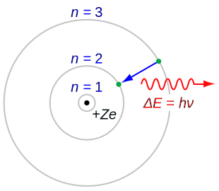
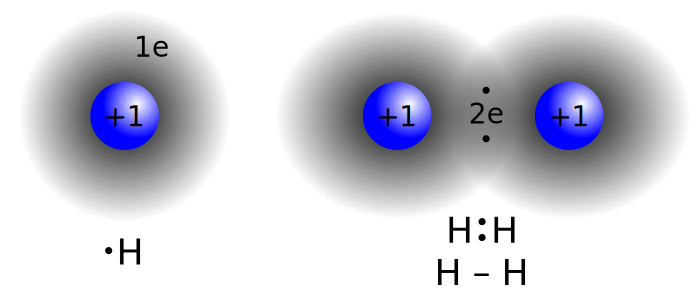
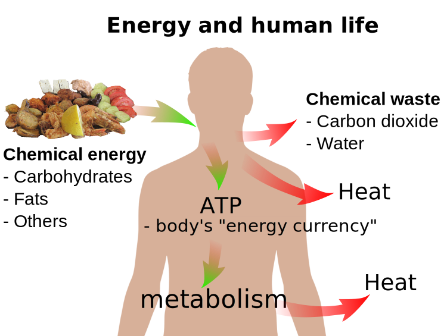
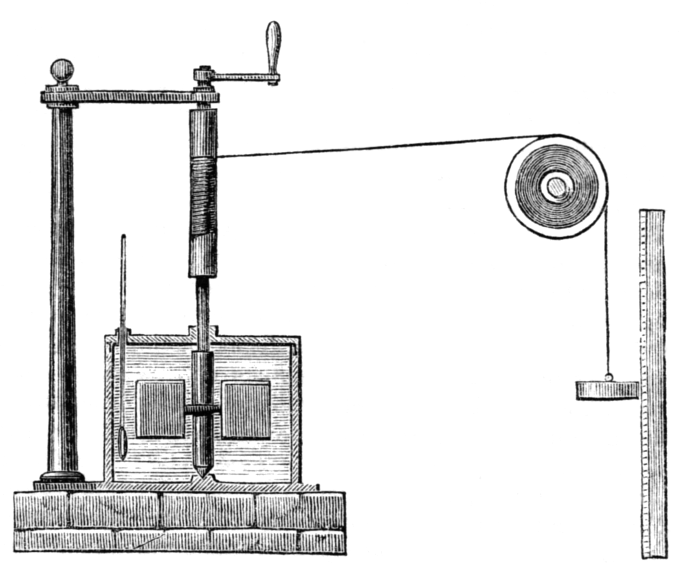
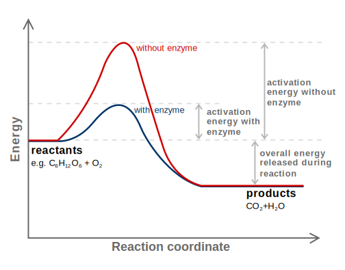

# Basic General Chemistry For Biology

Chemistry is the scientific discipline involved with elements and compounds composed of atoms, molecules and ions: their composition, structure, properties, behavior and the changes they undergo during a reaction with other substances.

In the scope of its subject, chemistry occupies an intermediate position between physics and biology. For example, chemistry explains aspects of plant chemistry (botany), the formation of igneous rocks (geology), how atmospheric ozone is formed and how environmental pollutants are degraded (ecology), the properties of the soil on the moon (astrophysics), how medications work (pharmacology), and how to collect DNA evidence at a crime scene (forensics).

Chemistry addresses topics such as how atoms and molecules interact via chemical bonds to form new chemical compounds. There are four types of chemical bonds: covalent bonds, in which compounds share one or more electron(s); ionic bonds, in which a compound donates one or more electrons to another compound to produce ions (cations and anions); hydrogen bonds; and Van der Waals force bonds.

The current model of atomic structure is the quantum mechanical model. Traditional chemistry starts with the study of elementary particles, atoms, molecules, substances, metals, crystals and other aggregates of matter. Matter can be studied in solid, liquid, gas and plasma states, in isolation or in combination. The interactions, reactions and transformations that are studied in chemistry are usually the result of interactions between atoms, leading to rearrangements of the chemical bonds which hold atoms together. 

A chemical reaction is a transformation of some substances into one or more different substances. The basis of such a chemical transformation is the rearrangement of electrons in the chemical bonds between atoms. It can be symbolically depicted through a chemical equation, which usually involves atoms as subjects. The number of atoms on the left and the right in the equation for a chemical transformation is equal. (When the number of atoms on either side is unequal, the transformation is referred to as a nuclear reaction or radioactive decay.) The type of chemical reactions a substance may undergo and the energy changes that may accompany it are constrained by certain basic rules, known as chemical laws.

## Matter

In classical physics and general chemistry, matter is any substance that has mass and takes up space by having volume. Matter should not be confused with mass, as the two are not the same in modern physics. Matter is a general term describing any 'physical substance'. By contrast, mass is not a substance but rather a quantitative property of matter and other substances or systems. All everyday objects that can be touched are ultimately composed of atoms, which are made up of interacting subatomic particles, and in everyday as well as scientific usage, "matter" generally includes atoms and anything made up of them, and any particles (or combination of particles) that act as if they have both rest mass and volume. However it does not include massless particles such as photons, or other energy phenomena or waves such as light or sound. Matter exists in various states (also known as phases). These include classical everyday phases such as solid, liquid, and gas – for example water exists as ice, liquid water, and gaseous steam – but other states are possible, including plasma, Bose–Einstein condensates, fermionic condensates, and quark–gluon plasma.

Usually atoms can be imagined as a nucleus of protons and neutrons, and a surrounding "cloud" of orbiting electrons which "take up space". However this is only somewhat correct, because subatomic particles and their properties are governed by their quantum nature, which means they do not act as everyday objects appear to act – they can act like waves as well as particles and they do not have well-defined sizes or positions. In the Standard Model of particle physics, matter is not a fundamental concept because the elementary constituents of atoms are quantum entities which do not have an inherent "size" or "volume" in any everyday sense of the word. Due to the exclusion principle and other fundamental interactions, some "point particles" known as fermions (quarks, leptons), and many composites and atoms, are effectively forced to keep a distance from other particles under everyday conditions; this creates the property of matter which appears to us as matter taking up space.


## The Atom

An atom is the smallest unit of ordinary matter that forms a chemical element. Every solid, liquid, gas, and plasma is composed of neutral or ionized atoms. Atoms are extremely small, typically around 100 picometers across. They are so small that accurately predicting their behavior using classical physics—as if they were tennis balls, for example—is not possible due to quantum effects. The word atom is derived from Ancient Greek ἄτομος (átomos, “indivisible”), from ἀ- (a-, “not”) + τέμνω (témnō, “I cut”), which means "uncuttable".

Every atom is composed of a nucleus and one or more electrons surrounding the nucleus. The nucleus is made of one or more protons and a number of neutrons. Only the most common variety of hydrogen has no neutrons. More than 99.94% of an atom's mass is in the nucleus. The protons have a positive electric charge, the electrons have a negative electric charge, and the neutrons have no electric charge. If the number of protons and electrons are equal, then the atom is electrically neutral. If an atom has more or fewer electrons than protons, then it has an overall negative or positive charge, respectively — such atoms are called ions.

The electrons of an atom are attracted to the protons in an atomic nucleus by the electromagnetic force. The protons and neutrons in the nucleus are attracted to each other by the nuclear force. This force is usually stronger than the electromagnetic force that repels the positively charged protons from one another. Under certain circumstances, the repelling electromagnetic force becomes stronger than the nuclear force. In this case, the nucleus splits and leaves behind different elements. This is a form of nuclear decay.

The number of protons in the nucleus is the atomic number and it defines to which chemical element the atom belongs. For example, any atom that contains 29 protons is copper. The number of neutrons defines the isotope of the element. Atoms can attach to one or more other atoms by chemical bonds to form chemical compounds such as molecules or crystals. The ability of atoms to associate and dissociate is responsible for most of the physical changes observed in nature. Chemistry is the discipline that studies these changes.

Atoms are extremely small, typically around 100 picometers (1 picometer = 10^-12^m) across. They are so small that accurately predicting their behavior using classical physics—as if they were billiard balls, for example—is not possible due to quantum effects. Current atomic models use [quantum mechanics](https://en.wikipedia.org/wiki/Quantum_mechanics) to better explain and predict this behavior. The word quantum derives from the Latin, meaning "how great" or "how much". In quantum mechanics, it refers to a discrete unit assigned to certain physical quantities such as the energy of an atom at rest. The discovery that particles are discrete packets of energy with wave-like properties led to the branch of physics dealing with atomic and subatomic systems which is today called quantum mechanics. It underlies the mathematical framework of many fields of physics and chemistry.

Quantum mechanics is essential for understanding the behavior of systems at atomic length scales and smaller. If the physical nature of an atom were solely described by classical mechanics, electrons would not orbit the nucleus, since orbiting electrons emit radiation (due to circular motion) and so would quickly lose energy and collide with the nucleus. This framework was unable to explain the stability of atoms. Instead, electrons remain in an uncertain, non-deterministic, smeared, probabilistic wave–particle orbital about the nucleus, defying the traditional assumptions of classical mechanics and electromagnetism.

Quantum mechanics is also critically important for understanding how individual atoms are joined by covalent bonds to form molecules. The application of quantum mechanics to chemistry is known as quantum chemistry. Quantum mechanics can also provide quantitative insight into ionic and covalent bonding processes by explicitly showing which molecules are energetically favorable to which others and the magnitudes of the energies involved. Furthermore, most of the calculations performed in modern computational chemistry rely on quantum mechanics.

(ref:atom) An [illustration of the helium atom](https://commons.wikimedia.org/wiki/File:Helium_atom_QM.svg), depicting the nucleus (pink) and the electron cloud distribution (black). The nucleus (upper right) in helium-4 is in reality spherically symmetric and closely resembles the electron cloud, although for more complicated nuclei this is not always the case. The black bar is one angstrom (10^−10^ m or100 pm).

```{r atomcartoon, fig.cap='(ref:atom)', echo=FALSE, message=FALSE, warning=FALSE}
knitr::include_graphics("./figures/chemistry/Helium_atom_QM.svg")
```
For much of the history of the natural sciences people have contemplated the exact nature of matter. The idea that matter was built of discrete building blocks, the so-called particulate theory of matter, independently appeared in ancient Greece and ancient India among Buddhists, Hindus and Jains in 1st-millennium BC. Ancient philosophers who proposed the particulate theory of matter include Kanada (c. 6th–century BC or after), Leucippus (~490 BC) and Democritus (~470–380 BC).

In the early 1800s, [John Dalton](https://en.wikipedia.org/wiki/John_Dalton) compiled experimental data gathered by himself and other scientists and observed that chemical elements seemed to combine by weight in ratios of small whole numbers; he called this pattern the "law of multiple proportions". For instance, there are two types of tin oxide: one is 88.1% tin and 11.9% oxygen, and the other is 78.7% tin and 21.3% oxygen. Adjusting these figures, for every 100 g of tin there is either 13.5 g or 27 g of oxygen respectively. 13.5 and 27 form a ratio of 1:2, a ratio of small whole numbers. Similarly, there are two common types of iron oxide, in which for every 112 g of iron there is either 32 g or 48 g of oxygen respectively, which gives a ratio of 2:3. As a final example, there are three oxides of nitrogen in which for every 140 g of nitrogen, there is 80 g, 160 g, and 320 g of oxygen respectively, which gives a ratio of 1:2:4. This recurring pattern in the data suggested that elements always combine in multiples of discrete units, which Dalton concluded were atoms. In the case of the tin oxides, for every one tin atom, there are either one or two oxygen atoms (SnO and SnO~2~). In the case of the iron oxides, for every two iron atoms, there are either two or three oxygen atoms (FeO and Fe~2~O~3~). In the case of the nitrogen oxides, their formulas are N~2~O, NO, and NO~2~.

In the late 18th century, a number of scientists found that they could better explain the behavior of gases by describing them as collections of sub-microscopic particles and modelling their behavior using statistics and probability. Unlike Dalton's atomic theory, the kinetic theory of gases describes not how gases react chemically with each other to form compounds, but how they behave physically: diffusion, viscosity, conductivity, pressure, etc.

In 1827, botanist [Robert Brown](https://en.wikipedia.org/wiki/Robert_Brown_(botanist,_born_1773)) used a microscope to look at dust grains floating in water and discovered that they moved about erratically, a phenomenon that became known as "Brownian motion". This was thought to be caused by water molecules knocking the grains about. In 1905, [Albert Einstein](https://en.wikipedia.org/wiki/Albert_Einstein) proved the reality of these molecules and their motions by producing the first statistical physics analysis of Brownian motion. French physicist [Jean Perrin](https://en.wikipedia.org/wiki/Jean_Baptiste_Perrin) used Einstein's work to experimentally determine the mass and dimensions of atoms, thereby verifying Dalton's atomic theory.

In 1897, [J.J. Thomson](https://en.wikipedia.org/wiki/J._J._Thomson) discovered that cathode rays are not electromagnetic waves but made of particles that are 1,800 times lighter than hydrogen (the lightest atom). Therefore, they were not atoms, but a new particle, the first subatomic particle to be discovered. He called these new particles corpuscles but they were later renamed electrons. Thomson also showed that electrons were identical to particles given off by photoelectric and radioactive materials. It was quickly recognized that electrons are the particles that carry electric currents in metal wires, and carry the negative electric charge within atoms. Thus Thomson overturned the belief that atoms are the indivisible, fundamental particles of matter. The misnomer "atom" is still used, even though atoms are not literally "uncuttable".

J. J. Thomson postulated that the negatively-charged electrons were distributed throughout the atom in a uniform sea of positive charge. This was known as the plum pudding model. In 1909, [Hans Geiger](https://en.wikipedia.org/wiki/Hans_Geiger) and [Ernest Marsden](https://en.wikipedia.org/wiki/Ernest_Marsden), working under the direction of [Ernest Rutherford](https://en.wikipedia.org/wiki/Ernest_Rutherford), bombarded metal foil with alpha particles to observe how they scattered. They expected all the charged particles to pass straight through with little deflection, because Thomson's model said that the charges in the atom are so diffuse that their electric fields in the foil could not affect the alpha particles much. Yet Geiger and Marsden spotted alpha particles being deflected by angles greater than 90°, which was supposed to be impossible according to Thomson's model. To explain this, Rutherford proposed that the positive charge of the atom is concentrated in a tiny nucleus at the center. Only such an intense concentration of charge could produce an electric field strong enough to deflect alpha particles that much.

While experimenting with the products of radioactive decay, in 1913 radiochemist Frederick Soddy discovered that there appeared to be more than one type of atom at each position on the periodic table. The term isotope was coined by Margaret Todd as a suitable name for different atoms that belong to the same element. J.J. Thomson created a technique for isotope separation through his work on ionized gases, which subsequently led to the discovery of stable isotopes.

The development of the mass spectrometer allowed the mass of atoms to be measured with increased accuracy. The device uses a magnet to bend the trajectory of a beam of ions, and the amount of deflection is determined by the ratio of an atom's mass to its charge. The chemist [Francis William Aston](https://en.wikipedia.org/wiki/Francis_William_Aston) used this instrument to show that isotopes had different masses. The atomic mass of these isotopes varied by integer amounts, called the whole number rule. The explanation for these different isotopes awaited the discovery of the neutron, an uncharged particle with a mass similar to the proton, by the physicist [James Chadwick](https://en.wikipedia.org/wiki/James_Chadwick) in 1932. Isotopes were then explained as elements with the same number of protons, but different numbers of neutrons within the nucleus.

In 1913 the physicist [Niels Bohr](https://en.wikipedia.org/wiki/Niels_Bohr) proposed a model in which the electrons of an atom were assumed to orbit the nucleus but could only do so in a finite set of orbits, and could jump between these orbits only in discrete changes of energy corresponding to absorption or radiation of a photon. This quantization was used to explain why the electrons' orbits are stable (given that normally, charges in acceleration, including circular motion, lose kinetic energy which is emitted as electromagnetic radiation, see synchrotron radiation) and why elements absorb and emit electromagnetic radiation in discrete spectra.

(ref:bohr) Niels Bohr's 1913 [quantum model of the atom](https://en.wikipedia.org/wiki/Bohr_model#/media/File:Bohr_atom_model.svg), which incorporated an explanation of Johannes Rydberg's 1888 formula, Max Planck's 1900 quantum hypothesis, i.e. that atomic energy radiators have discrete energy values (ε = hν), J. J. Thomson's 1904 plum pudding model, Albert Einstein's 1905 light quanta postulate, and Ernest Rutherford's 1907 discovery of the atomic nucleus. Note that the electron does not travel along the black line when emitting a photon. It "jumps", disappearing from the outer orbit and appearing in the inner one and cannot exist in the space between orbits 2 and 3. The Bohr model of the hydrogen atom (Z = 1) or a hydrogen-like ion (Z > 1), where the negatively charged electron confined to an atomic shell encircles a small, positively charged atomic nucleus and where an electron jumps between orbits, is accompanied by an emitted or absorbed amount of electromagnetic energy (hν). The orbits in which the electron may travel are shown as grey circles; their radius increases as n2, where n is the principal quantum number. The 3 → 2 transition depicted here produces the first line of the Balmer series, and for hydrogen (Z = 1) it results in a photon of wavelength 656 nm (red light). 

```{r bohrmodel, fig.cap='(ref:bohr)', echo=FALSE, message=FALSE, warning=FALSE}

```

Later in the same year Henry Moseley provided additional experimental evidence in favor of Niels Bohr's theory. These results refined Ernest Rutherford's and Antonius Van den Broek's model, which proposed that the atom contains in its nucleus a number of positive nuclear charges that is equal to its (atomic) number in the periodic table. Until these experiments, atomic number was not known to be a physical and experimental quantity. That it is equal to the atomic nuclear charge remains the accepted atomic model today.

Atomic dimensions are thousands of times smaller than the wavelengths of light (400–700 nm) so they cannot be viewed using an optical microscope, although individual atoms can be observed using a scanning tunneling microscope. To visualize the minuteness of the atom, consider that a typical human hair is about 1 million carbon atoms in width. A single drop of water contains about 2 sextillion (2×10^21^) atoms of oxygen, and twice the number of hydrogen atoms. A single carat diamond with a mass of 2×10^−4^ kg contains about 10 sextillion (10^22^) atoms of carbon. If an apple were magnified to the size of the Earth, then an atom would be approximately the size of the original apple.

### Structure of The Atom

Though the word atom originally denoted a particle that cannot be cut into smaller particles, in modern scientific usage the atom is composed of various subatomic particles. The constituent particles of an atom are the electron, the proton and the neutron.

The electron is by far the least massive of these particles at 9.11×10^−31^ kg, with a negative electrical charge and a size that is too small to be measured using available techniques. Under ordinary conditions, electrons are bound to the positively charged nucleus by the attraction created from opposite electric charges. If an atom has more or fewer electrons than its atomic number, then it becomes respectively negatively or positively charged as a whole; a charged atom is called an ion. 

Protons have a positive charge and a mass 1,836 times that of the electron, at 1.6726×10^−27^ kg. The number of protons in an atom is called its atomic number. 

Neutrons have no electrical charge and have a free mass of 1,839 times the mass of the electron, or 1.6749×10^−27^ kg. Neutrons are the heaviest of the three constituent particles, but their mass can be reduced by the nuclear binding energy. Neutrons and protons (collectively known as nucleons) have comparable dimensions—on the order of 2.5×10^−15^ m.

In the Standard Model of physics, electrons are truly elementary particles with no internal structure, whereas protons and neutrons are composite particles composed of elementary particles called quarks. There are two types of quarks in atoms, each having a fractional electric charge. Protons are composed of two up quarks (each with charge $+\frac{2}{3}$) and one down quark (with a charge of $−\frac{1}{3}$). Neutrons consist of one up quark and two down quarks. This distinction accounts for the difference in mass and charge between the two particles.

The quarks are held together by the strong interaction (or strong force), which is mediated by gluons. The protons and neutrons, in turn, are held to each other in the nucleus by the nuclear force, which is a residuum of the strong force that has somewhat different range-properties (see the article on the nuclear force for more). The gluon is a member of the family of gauge bosons, which are elementary particles that mediate physical forces.

### The Atomic Nucleus

The nucleus of an atom consists of neutrons and protons, which in turn are the manifestation of more elementary particles, called quarks, that are held together by the nuclear strong force. The nuclear strong force extends far enough so as to bind the neutrons and protons together against the repulsive electrical force between the positively charged protons. The nuclear strong force has a very short range, and essentially drops to zero just beyond the edge of the nucleus. The collective action of the positively charged nucleus is to hold the electrically negative charged electrons in their orbits about the nucleus. The collection of negatively charged electrons orbiting the nucleus display an affinity for certain configurations and numbers of electrons that make their orbits stable. Which chemical element an atom represents is determined by the number of protons in the nucleus; the neutral atom will have an equal number of electrons orbiting that nucleus. Individual chemical elements can create more stable electron configurations by combining to share their electrons. It is that sharing of electrons to create stable electronic orbits about the nucleus that appears to us as the chemistry of our world.

Protons define the entire charge of a nucleus, and hence its chemical identity. Neutrons are electrically neutral, but contribute to the mass of a nucleus to nearly the same extent as the protons. Neutrons can explain the phenomenon of isotopes (same atomic number with different atomic mass). The main role of neutrons is to reduce electrostatic repulsion inside the nucleus.

The electrons of an atom are attracted to the protons in an atomic nucleus by the electromagnetic force. The protons and neutrons in the nucleus are attracted to each other by the nuclear force. This force is usually stronger than the electromagnetic force that repels the positively charged protons from one another. Under certain circumstances, the repelling electromagnetic force becomes stronger than the nuclear force. In this case, the nucleus splits and leaves behind different elements. This is a form of nuclear decay.

The number of protons in the nucleus is the atomic number and it defines to which chemical element the atom belongs. For example, any atom that contains 6 protons is carbon. The number of neutrons defines the isotope of the element. For example, the most common isotope of carbon is ^12^C with 6 neutrons. Another carbon isotope found in nature is ^14^C, which has 8 neutrons. Atoms can attach to one or more other atoms by chemical bonds to form chemical compounds such as molecules or crystals. The ability of atoms to associate and dissociate is responsible for most of the physical changes observed in nature.

### The Electron Cloud

The electron cloud is a region surrounding the nucleus. The electrons in an atom are attracted to the protons in the nucleus by the electromagnetic force. This force binds the electrons to the nucleus, which means that an external source of energy is needed for the electron to escape. The closer an electron is to the nucleus, the greater the attractive force. Hence the electrons that are closer to the nucleus require more energy to escape than those at greater separations.

Electrons, like other particles, have properties of both a particle and a wave. In atomic theory and quantum mechanics, an atomic orbital is a mathematical function describing the location and wave-like behavior of electrons surrounding an atom. The term "orbital" was coined by [Robert Mulliken](https://en.wikipedia.org/wiki/Robert_S._Mulliken) in 1932 as an abbreviation for one-electron orbital wave function. The term atomic orbital is also used to refer to the physical region or space where the electron can be calculated to be present using this function. Each atomic orbital corresponds to a particular energy level of the electron. The electron can change its state to a higher energy level by absorbing sufficient energy to boost it into the new quantum state. Likewise, through spontaneous emission, an electron in a higher energy state can drop to a lower energy state while radiating the excess energy. 

The electrons in an atom are described by a unique set of values of four so-called quantum numbers n, ℓ, and m~ℓ~, and s. As n increases, the electron is farther from the nucleus, on average, has a higher energy and is, therefore, less tightly bound to the nucleus. For each value of n, ℓ can take integer (whole number) values ranging from 0 to n − 1 and m~ℓ~  can take integer values ranging from -ℓ to +ℓ, and two values of s ($+\frac{1}{2}$ or $-\frac{1}{2}$) hence higher-n electron states are more numerous. Thus, each n-shell can accommodate up to a maximum of 2n^2^ electrons. In chemistry, values n = 1, 2, 3, 4, 5, 6, 7 correspond to the so-called electron shells, which may be thought of as onion-like layers surrounding the nucleus that are filled with electrons. The shell terminology comes from [Arnold Sommerfeld's](https://en.wikipedia.org/wiki/Arnold_Sommerfeld) modification of the Bohr model. Sommerfeld retained Bohr's planetary model (electrons orbiting the atomic nucleus like planets the sun), but added orbits that formed a thick "shell" instead of the infinitely thin circular orbit of Bohr's model. The closest shell to the nucleus is called the "1 shell" (also called the "K shell"), followed by the "2 shell" (or "L shell"), then the "3 shell" (or "M shell"), and so on farther and farther from the nucleus. The shells correspond to the principal quantum numbers (n = 1, 2, 3, 4 ...) or are labeled alphabetically with the letters used in [X-ray notation](https://en.wikipedia.org/wiki/x-ray_notation) (K, L, M, …). Each shell is composed of one or more subshells (labeled with the letters s, p, d, and f, which are derived from the terms *s*harp, *p*rincipal, *d*iffuse, and *f*undamental historically used in the description of atomic spectral lines). For example, the first shell (with principal quantum number n = 1 also referred to as K shell) has one subshell, called 1s; the second (with principal quantum number n = 2 also referred to as L shell) shell has two subshells, called 2s (ℓ = 0) and 2p (ℓ = 1 and m~ℓ~ = -1, 0, 1); the third shell (with principal quantum number n = 3 also referred to as M shell) has 3s (ℓ = 0), 3p (ℓ = 1 and m~ℓ~ = -1, 0, 1), and 3d (ℓ = 2 and m~ℓ~ = -2, -1, 0, 1, 2); the fourth shell (with principal quantum number n = 4 also referred to as N shell) has 4s, 4p, 4d and 4f; the fifth shell (with principal quantum number n = 5 also referred to as O shell) has 5s, 5p, 5d, and 5f and can theoretically hold more in the 5g subshell that is not occupied in the ground-state electron configuration of any known element. 

(ref:atomorb) [The five filled atomic orbitals of a neon atom](https://commons.wikimedia.org/wiki/File:S-p-Orbitals.svg) separated and arranged in order of increasing energy from left to right, with the last three orbitals being equal in energy. Each orbital holds up to two electrons, which most probably exist in the zones represented by the colored bubbles. Each electron is equally present in both orbital zones, shown here by color only to highlight the different wave phase.

```{r atomicorbitals, fig.cap='(ref:atomorb)', echo=FALSE, message=FALSE, warning=FALSE}
knitr::include_graphics("./figures/chemistry/S-p-Orbitals.svg")
```
Several rules govern the placement of electrons in orbitals in each atom referred to as the atom's electron configuration. The first dictates that no two electrons in an atom may have the same set of values of quantum numbers (this is the Pauli exclusion principle). These quantum numbers include the three that define orbitals, as well as s, or spin quantum number. Thus, two electrons may occupy a single orbital, so long as they have different values of s. However, only two electrons, because of their spin, can be associated with each orbital.

Additionally, an electron always tends to fall to the lowest possible energy state. It is possible for it to occupy any orbital so long as it does not violate the Pauli exclusion principle, but if lower-energy orbitals are available, this condition is unstable. The electron will eventually lose energy (by releasing a photon) and drop into the lower orbital. Thus, electrons fill orbitals in the order specified by the energy sequence given above. This behavior is responsible for the structure of the periodic table.

## The Periodic Table of The Elements

The [periodic table](https://en.wikipedia.org/wiki/Periodic_table), also known as the periodic table of elements, is a tabular display of the chemical elements. In chemistry, an element is a pure substance which cannot be broken down by chemical means, consisting of atoms which have identical numbers of protons in their atomic nuclei. The number of protons in the nucleus is the defining property of an element, and is referred to as the atomic number (represented by the symbol Z). The mass number is the sum of the number of protons and neutrons in a nucleus. Although all the nuclei of all atoms belonging to one element will have the same atomic number, they may not necessarily have the same mass number; atoms of an element which have different mass numbers are known as isotopes. For example, all atoms with 6 protons in their nuclei are atoms of the chemical element carbon, but atoms of carbon may have mass numbers of 12 or 13.

In the periodic table, elements are arranged by atomic number, electron configuration, and recurring chemical properties. The organization of the periodic table can be used to derive relationships between the various element properties, and also to predict chemical properties and behaviours of undiscovered or newly synthesized elements. Russian chemist [Dmitri Mendeleev](https://en.wikipedia.org/wiki/Dmitri_Mendeleev) published the first recognizable periodic table in 1869, developed mainly to illustrate periodic trends of the then-known elements. He also predicted some properties of unidentified elements that were expected to fill gaps within the table. Most of his forecasts proved to be correct. Mendeleev's idea has been slowly expanded and refined with the discovery or synthesis of further new elements and the development of new theoretical models to explain chemical behaviour. In total, 118 elements have been identified. The first 94 occur naturally on Earth, and the remaining 24 are synthetic elements produced in nuclear reactions. 

(ref:period) [A simple depiction of the periodic table of the elements.](https://commons.wikimedia.org/wiki/File:Simple_Periodic_Table_Chart-en.svg)  

```{r periodictable, fig.cap='(ref:period)', echo=FALSE, message=FALSE, warning=FALSE}
knitr::include_graphics("./figures/chemistry/Simple_Periodic_Table_Chart-en.svg")
```

The structure of the table shows periodic trends. The seven rows of the table, called periods, generally have metals on the left and nonmetals on the right. The columns, called groups, contain elements with similar chemical behaviours. Six groups have accepted names as well as assigned numbers: for example, group 17 elements are the halogens; and group 18 are the noble gases. Also displayed are four simple rectangular areas or blocks associated with the filling of different atomic orbitals.

The periodic table may also be divided into several numbered rectangular 'blocks'. The elements belonging to a given block have this common feature: their highest-energy electrons all belong to the same ℓ-state (but the n associated with that ℓ-state depends upon the period). For instance, the leftmost two columns constitute the 's-block'. The outermost electrons of Li and Be respectively belong to the 2s subshell, and those of Na and Mg to the 3s subshell.

The following is the order for filling the "subshell" orbitals, which also gives the order of the "blocks" in the periodic table:

1s, 2s, 2p, 3s, 3p, 4s, 3d, 4p, 5s, 4d, 5p, 6s, 4f, 5d, 6p, 7s, 5f, 6d, 7p

The "periodic" nature of the filling of orbitals, as well as emergence of the s, p, d, and f "blocks", is more obvious if this order of filling is given in matrix form, with increasing principal quantum numbers starting the new rows ("periods") in the matrix. Then, each subshell (composed of the first two quantum numbers) is repeated as many times as required for each pair of electrons it may contain. The result is a compressed periodic table, with each entry representing two successive elements:

|    |    |    |    |    |    |    |    |    |    |    |    |    |    |    |    |
|----|----|----|----|----|----|----|----|----|----|----|----|----|----|----|----|
| 1s |    |    |    |    |    |    |    |    |    |    |    |    |    |    |    |
| 2s |    |    |    |    |    |    |    |    |    |    |    |    | 2p | 2p | 2p |
| 3s |    |    |    |    |    |    |    |    |    |    |    |    | 3p | 3p | 3p |
| 4s |    |    |    |    |    |    |    | 3d | 3d | 3d | 3d | 3d | 4p | 4p | 4p |
| 5s |    |    |    |    |    |    |    | 4d | 4d | 4d | 4d | 4d | 5p | 5p | 5p |
| 6s | 4f | 4f | 4f | 4f | 4f | 4f | 4f | 5d | 5d | 5d | 5d | 5d | 6p | 6p | 6p |
| 7s | 5f | 5f | 5f | 5f | 5f | 5f | 5f | 6d | 6d | 6d | 6d | 6d | 7p | 7p | 7p |

Although this is the general order of orbital filling, there are exceptions, and the actual electronic energies of each element are also dependent upon additional details of the atoms. 

The number of electrons in an electrically neutral atom increases with the atomic number. The electrons in the outermost shell of a given atom, called valence electrons, tend to be responsible for an element's chemical behavior. Elements that contain the same number of valence electrons can be grouped together and display similar chemical properties. The elements at the far right of the table have their outer shell completely filled with electrons, which results in chemically inert elements known as the noble gases.

## Chemical Bonds, Molecules, And Compounds 

A chemical bond is an attraction between atoms. This attraction may be seen as the result of different behaviors of the outermost or valence electrons of atoms. Chemical bonds between atoms were explained by [Gilbert Newton Lewis](https://en.wikipedia.org/wiki/Gilbert_N._Lewis) in 1916, as the interactions between their constituent electrons. As the chemical properties of the elements were known to largely repeat themselves according to the periodic law, in 1919 the American chemist [Irving Langmuir](https://en.wikipedia.org/wiki/Irving_Langmuir) suggested that this could be explained if the electrons in an atom were connected or clustered in some manner. Groups of electrons were thought to occupy a set of electron shells about the nucleus.

(ref:bond) [Examples of Lewis dot-style representations of chemical bonds](https://en.wikipedia.org/wiki/Chemical_bond#/media/File:Electron_dot.svg) between carbon (C), hydrogen (H), and oxygen (O). Lewis dot diagrams were an early attempt to describe chemical bonding and are still widely used today. 

```{r lewisbond, fig.cap='(ref:bond)', echo=FALSE, message=FALSE, warning=FALSE}
knitr::include_graphics("./figures/chemistry/Electron_dot.svg")
```
A chemical bond can be a [covalent bond](https://en.wikipedia.org/wiki/Covalent_bond), an [ionic bond](https://en.wikipedia.org/wiki/Ionic_bonding), a [hydrogen bond](https://en.wikipedia.org/wiki/Hydrogen_bond) or just because of Van der Waals force. All bonds can be explained by quantum theory, but, in practice, simplification rules allow chemists to predict the strength, directionality, and polarity of bonds.

Covalent bonding is a common type of bonding in which two or more atoms share valence electrons more or less equally. The simplest and most common type is a single bond in which two atoms share two electrons. Other types include the double bond, the triple bond. In non-polar covalent bonds, the electrons are shared equally between the bonding atoms. Molecules that are formed primarily from non-polar covalent bonds are often immiscible in water or other polar solvents, but much more soluble in non-polar solvents such as hexane. A polar covalent bond is a covalent bond with a significant ionic character. This means that the two shared electrons are closer to one of the atoms than the other, creating an imbalance of charge. 

Atoms will share valence electrons in such a way as to create a noble gas electron configuration (eight electrons in their outermost shell) for each atom. Atoms that tend to combine in such a way that they each have eight electrons in their valence shell are said to follow the octet rule. However, some elements like hydrogen and lithium need only two electrons in their outermost shell to attain this stable configuration; these atoms are said to follow the duet rule, and in this way they are reaching the electron configuration of the noble gas helium, which has two electrons in its outer shell. In a polar covalent bond, one or more electrons are unequally shared between two nuclei. 

(ref:covalent) [A covalent bond between two hydrogen atoms forming a hydrogen molecule.](https://commons.wikimedia.org/wiki/File:Covalent_bond_hydrogen.svg) 

```{r covalentbond, fig.cap='(ref:covalent)', echo=FALSE, message=FALSE, warning=FALSE}

```
        
An ionic bond is formed when a metal loses one or more of its electrons, becoming a positively charged cation, and the electrons are then gained by the non-metal atom, becoming a negatively charged anion. The two oppositely charged ions attract one another, and the ionic bond is the electrostatic force of attraction between them. For example, sodium (Na), a metal, loses one electron to become an Na^+^ cation while chlorine (Cl), a non-metal, gains this electron to become Cl−. The ions are held together due to electrostatic attraction, and that compound sodium chloride (NaCl), or common table salt, is formed.

(ref:ionic) [Formation of an ionic bond.](https://commons.wikimedia.org/wiki/File:NaF.gif) Sodium and fluorine atoms undergoing a redox reaction to form sodium fluoride. Sodium loses its outer electron to give it a stable electron configuration, and this electron enters the fluorine atom exothermically. The oppositely charged ions – typically a great many of them – are then attracted to each other to form a solid.

```{r ionicbond, fig.cap='(ref:ionic)', echo=FALSE, message=FALSE, warning=FALSE}
knitr::include_graphics("./figures/chemistry/NaF.gif")
```

A molecule (from French molécule, from New Latin molecula (“a molecule”), diminutive of Latin moles (“a mass”); see mole + -cule.) is a group of two or more atoms held together by chemical bonds. A molecule may be homonuclear, that is, it consists of atoms of one chemical element, as with two atoms in the oxygen molecule (O~2~); or it may be heteronuclear, a chemical compound composed of more than one element, as with water (two hydrogen atoms and one oxygen atom; H~2~O).

Molecules exist as electrically neutral units, unlike ions. When this rule is broken, giving the "molecule" a charge, the result is sometimes named a molecular ion or a polyatomic ion. 

The "inert" or noble gas elements (helium, neon, argon, krypton, xenon and radon) are composed of lone atoms as their smallest discrete unit, but the other isolated chemical elements consist of either molecules or networks of atoms bonded to each other in some way. Identifiable molecules compose familiar substances such as water, air, and many organic compounds like alcohol, sugar, gasoline, and the various pharmaceuticals.

However, not all substances or chemical compounds consist of discrete molecules, and indeed most of the solid substances that make up the solid crust, mantle, and core of the Earth are chemical compounds without molecules. These other types of substances, such as ionic compounds and network solids, are organized in such a way as to lack the existence of identifiable molecules per se. Instead, these substances are discussed in terms of formula units or unit cells as the smallest repeating structure within the substance. Examples of such substances are mineral salts (such as table salt), solids like carbon and diamond, metals, and familiar silica and silicate minerals such as quartz and granite.

One of the main characteristics of a molecule is its geometry often called its structure. While the structure of diatomic, triatomic or tetra-atomic molecules may be trivial, (linear, angular pyramidal etc.) the structure of polyatomic molecules, that are constituted of more than six atoms (of several elements) can be crucial for its chemical nature.

## Energy

In physics, energy (from the Ancient Greek: ἐνέργεια, romanized: energeia, lit. 'activity, operation') is the quantitative property that must be transferred to an object in order to perform work on, or to heat, the object. Energy is a conserved quantity; the law of conservation of energy states that energy can be converted in form, but not created or destroyed. The SI unit of energy is the joule, which is the energy transferred to an object by the work of moving it a distance of 1 metre against a force of 1 newton.

The American physist [Richard Feynman](https://en.wikipedia.org/wiki/Richard_Feynman) said during a 1961 lecture:

>There is a fact, or if you wish, a law, governing all natural phenomena that are known to date. There is no known exception to this law – it is exact so far as we know. The law is called the conservation of energy. It states that there is a certain quantity, which we call energy, that does not change in manifold changes which nature undergoes. That is a most abstract idea, because it is a mathematical principle; it says that there is a numerical quantity which does not change when something happens. It is not a description of a mechanism, or anything concrete; it is just a strange fact that we can calculate some number and when we finish watching nature go through her tricks and calculate the number again, it is the same.
        
>— The Feynman Lectures on Physics

Common forms of energy include the kinetic energy of a moving object, the potential energy stored by an object's position in a force field (gravitational, electric or magnetic), the elastic energy stored by stretching solid objects, the chemical energy released when a fuel burns, the radiant energy carried by light, and the thermal energy due to an object's temperature.

Mass and energy are closely related. Due to mass–energy equivalence, any object that has mass when stationary (called rest mass) also has an equivalent amount of energy whose form is called rest energy, and any additional energy (of any form) acquired by the object above that rest energy will increase the object's total mass just as it increases its total energy. For example, after heating an object, its increase in energy could be measured as a small increase in mass, with a sensitive enough scale.

Living organisms require energy to stay alive, such as the energy humans get from food. Human civilization requires energy to function, which it gets from energy resources such as fossil fuels, nuclear fuel, or renewable energy. The processes of Earth's climate and ecosystem are driven by the radiant energy Earth receives from the sun and the geothermal energy contained within the earth.

(ref:energ) [Basic overview of energy and human life.](https://commons.wikimedia.org/wiki/File:Energy_and_life.svg) 

```{r energylife, fig.cap='(ref:energ)', echo=FALSE, message=FALSE, warning=FALSE}

```

In 1843, [James Prescott Joule](https://en.wikipedia.org/wiki/James_Prescott_Joule) discovered the link between mechanical work and the generation of heat in a series of experiments. The most famous of them used the "Joule apparatus": a descending weight, attached to a string, caused rotation of a paddle immersed in water, practically insulated from heat transfer. It showed that the gravitational potential energy lost by the weight in descending was equal to the internal energy gained by the water through friction with the paddle.

(ref:joule) [Joule's apparatus for measuring the mechanical equivalent of heat. A descending weight attached to a string causes a paddle immersed in water to rotate.](https://commons.wikimedia.org/wiki/File:Joule%27s_Apparatus_(Harper%27s_Scan).png) 

```{r jouleapparatus, fig.cap='(ref:joule)', echo=FALSE, message=FALSE, warning=FALSE}

```

In the International System of Units (SI), the unit of energy is the joule, named after James Prescott Joule. It is a derived unit. It is equal to the energy expended (or work done) in applying a force of one newton through a distance of one metre. However energy is also expressed in many other units not part of the SI, such as ergs, calories, British Thermal Units, kilowatt-hours and kilocalories, which require a conversion factor when expressed in SI units.

The SI unit of energy rate (energy per unit time) is the watt, which is a joule per second. Thus, one joule is one watt-second, and 3600 joules equal one watt-hour. The CGS energy unit is the erg and the imperial and US customary unit is the foot pound. Other energy units such as the electronvolt, food calorie or thermodynamic kcal (based on the temperature change of water in a heating process), and BTU are used in specific areas of science and commerce.

In the context of chemistry, energy is an attribute of a substance as a consequence of its atomic, molecular or aggregate structure. Since a chemical transformation is accompanied by a change in one or more of these kinds of structures, it is invariably accompanied by an increase or decrease of energy of the substances involved. Some energy is transferred between the surroundings and the reactants of the reaction in the form of heat or light; thus the products of a reaction may have more or less energy than the reactants.

A reaction is said to be exergonic if the final state is lower on the energy scale than the initial state; in the case of endergonic reactions the situation is the reverse. A reaction is said to be exothermic if the reaction releases heat to the surroundings; in the case of endothermic reactions, the reaction absorbs heat from the surroundings.

Chemical reactions are invariably not possible unless the reactants surmount an energy barrier known as the activation energy. The activation energy (E~a~) of a reaction is measured in joules per mole (J/mol), kilojoules per mole (kJ/mol) or kilocalories per mole (kcal/mol). For a chemical reaction to proceed at a reasonable rate, the temperature of the system should be high enough such that there exists an appreciable number of molecules with translational energy equal to or greater than the activation energy. The term Activation Energy was introduced in 1889 by the Swedish scientist [Svante Arrhenius](https://en.wikipedia.org/wiki/Svante_Arrhenius). The Arrhenius equation gives the quantitative basis of the relationship between the activation energy and the rate at which a reaction proceeds. From the equation, the activation energy can be found through the relation
$$ k=A\mathrm{e}^{-E_a/(RT)} $$ 
where A is the pre-exponential factor for the reaction, R is the universal gas constant, T is the absolute temperature (usually in kelvins), and k is the reaction rate coefficient. Even without knowing A, E~a~ can be evaluated from the variation in reaction rate coefficients as a function of temperature (within the validity of the Arrhenius equation).The activation energy necessary for a chemical reaction to occur can be in the form of heat, light, electricity or mechanical force.

A substance that modifies the transition state to lower the activation energy is termed a catalyst; a catalyst composed only of protein and (if applicable) small molecule cofactors is termed an enzyme. A catalyst increases the rate of reaction without being consumed in the reaction. In addition, the catalyst lowers the activation energy, but it does not change the energies of the original reactants or products, and so does not change equilibrium. Rather, the reactant energy and the product energy remain the same and only the activation energy is altered (lowered).

(ref:activation) [Example of an enzyme-catalysed exothermic reaction.](https://commons.wikimedia.org/wiki/File:Activation2_updated.svg)

```{r activationenergydiagram, fig.cap='(ref:activation)', echo=FALSE, message=FALSE, warning=FALSE}

```

A catalyst is able to reduce the activation energy by forming a transition state in a more favorable manner. Catalysts, by nature, create a more "comfortable" fit for the substrate of a reaction to progress to a transition state. This is possible due to a release of energy that occurs when the substrate binds to the active site of a catalyst. This energy is known as Binding Energy. Upon binding to a catalyst, substrates partake in numerous stabilizing forces while within the active site (i.e. Hydrogen bonding, van der Waals forces). Specific and favorable bonding occurs within the active site until the substrate forms to become the high-energy transition state. Forming the transition state is more favorable with the catalyst because the favorable stabilizing interactions within the active site release energy. A chemical reaction is able to manufacture a high-energy transition state molecule more readily when there is a stabilizing fit within the active site of a catalyst. The binding energy of a reaction is this energy released when favorable interactions between substrate and catalyst occur. The binding energy released assists in achieving the unstable transition state. Reactions otherwise without catalysts need a higher input of energy to achieve the transition state. Non-catalyzed reactions do not have free energy available from active site stabilizing interactions, such as catalytic enzyme reactions.

A related concept free energy, which also incorporates entropy considerations, is a very useful means for predicting the feasibility of a reaction and determining the state of equilibrium of a chemical reaction, in chemical thermodynamics. A reaction is feasible only if the total change in the Gibbs free energy is negative, $$ \Delta G \leq 0 $$ if it is equal to zero the chemical reaction is said to be at equilibrium.

There exist only limited possible states of energy for electrons, atoms and molecules. These are determined by the rules of quantum mechanics, which require quantization of energy of a bound system. The atoms/molecules in a higher energy state are said to be excited. The molecules/atoms of substance in an excited energy state are often much more reactive; that is, more amenable to chemical reactions.

## Chemical Reactions

When a chemical substance is transformed as a result of its interaction with another substance or with energy, a chemical reaction is said to have occurred. A chemical reaction is therefore a concept related to the "reaction" of a substance when it comes in close contact with another, whether as a mixture or a solution; exposure to some form of energy, or both. It results in some energy exchange between the constituents of the reaction as well as with the system environment, which may be designed vessels—often laboratory glassware.

Chemical reactions can result in the formation or dissociation of molecules, that is, molecules breaking apart to form two or more molecules or rearrangement of atoms within or across molecules. Chemical reactions usually involve the making or breaking of chemical bonds. Oxidation, reduction, dissociation, acid-base neutralization and molecular rearrangement are some of the commonly used kinds of chemical reactions.

A chemical reaction can be symbolically depicted through a chemical equation. In a chemical reaction the number and kind of atoms on both sides of the equation are always equal. This fact is referred to as the the law of conservation of mass. The law implies that mass can neither be created nor destroyed, although it may be rearranged in space, or the entities associated with it may be changed in form. For example, in chemical reactions, the mass of the chemical components before the reaction is equal to the mass of the components after the reaction. Thus, during any chemical reaction and low-energy thermodynamic processes in an isolated system, the total mass of the reactants, or starting materials, must be equal to the mass of the products.

## Radioactive Decay of Atoms

Radioactive decay (also known as nuclear decay, radioactivity, radioactive disintegration or nuclear disintegration) is the process by which an unstable atomic nucleus loses energy by radiation. Every element has one or more isotopes that have unstable nuclei that are subject to radioactive decay, causing the nucleus to emit particles or electromagnetic radiation. Radioactivity can occur when the radius of a nucleus is large compared with the radius of the strong force, which only acts over distances on the order of 1 fm.

The most common forms of radioactive decay are:

* Alpha decay: this process is caused when the nucleus emits an alpha particle, which is a helium nucleus consisting of two protons and two neutrons. The result of the emission is a new element with a lower atomic number.
* Beta decay (and electron capture): these processes are regulated by the weak force, and result from a transformation of a neutron into a proton, or a proton into a neutron. The neutron to proton transition is accompanied by the emission of an electron and an antineutrino, while proton to neutron transition (except in electron capture) causes the emission of a positron and a neutrino. The electron or positron emissions are called beta particles. Beta decay either increases or decreases the atomic number of the nucleus by one. Electron capture is more common than positron emission, because it requires less energy. In this type of decay, an electron is absorbed by the nucleus, rather than a positron emitted from the nucleus. A neutrino is still emitted in this process, and a proton changes to a neutron.
* Gamma decay: this process results from a change in the energy level of the nucleus to a lower state, resulting in the emission of electromagnetic radiation. The excited state of a nucleus which results in gamma emission usually occurs following the emission of an alpha or a beta particle. Thus, gamma decay usually follows alpha or beta decay.

Each radioactive isotope has a characteristic decay time period—the half-life—that is determined by the amount of time needed for half of a sample to decay. This is an exponential decay process that steadily decreases the proportion of the remaining isotope by 50% every half-life. Hence after two half-lives have passed only 25% of the isotope is present, and so forth.

Within living things, isotopic labels (both radioactive and nonradioactive) can be used to probe how the complex web of reactions which makes up the metabolism of an organism converts one substance to another. For instance a green plant uses light energy to convert water and carbon dioxide into glucose by photosynthesis. When plants performed photoshytnesis using water in which the oxygen was the heavy oxygen (^18^O) isotope, this oxygen isotope appeared in the oxygen gas formed by the plant and not in the glucose formed in the chloroplasts within the plant cells.

Radioactivity was discovered in 1896 by the French scientist [Henri Becquerel](https://en.wikipedia.org/wiki/Henri_Becquerel), while working with phosphorescent materials. These materials glow in the dark after exposure to light, and he suspected that the glow produced in cathode ray tubes by X-rays might be associated with phosphorescence. He wrapped a photographic plate in black paper and placed various phosphorescent salts on it. All results were negative until he used uranium salts. The uranium salts caused a blackening of the plate in spite of the plate being wrapped in black paper. These radiations were given the name "Becquerel Rays".

It soon became clear that the blackening of the plate had nothing to do with phosphorescence, as the blackening was also produced by non-phosphorescent salts of uranium and by metallic uranium. It became clear from these experiments that there was a form of invisible radiation that could pass through paper and was causing the plate to react as if exposed to light.

At first, it seemed as though the new radiation was similar to the then recently discovered X-rays. Further research by Becquerel, [Ernest Rutherford](https://en.wikipedia.org/wiki/Ernest_Rutherford), [Paul Villard](https://en.wikipedia.org/wiki/Paul_Ulrich_Villard), [Pierre Curie](https://en.wikipedia.org/wiki/Pierre_Curie), [Marie Curie](https://en.wikipedia.org/wiki/Marie_Curie), and others showed that this form of radioactivity was significantly more complicated. Rutherford was the first to realize that all such elements decay in accordance with the same mathematical exponential formula. Rutherford and his student Frederick Soddy were the first to realize that many decay processes resulted in the transmutation of one element to another. Subsequently, the radioactive displacement law of Fajans and Soddy was formulated to describe the products of alpha and beta decay.

The early researchers also discovered that many other chemical elements, besides uranium, have radioactive isotopes. A systematic search for the total radioactivity in uranium ores also guided Pierre and Marie Curie to isolate two new elements: polonium and radium. Except for the radioactivity of radium, the chemical similarity of radium to barium made these two elements difficult to distinguish.

Marie and Pierre Curie's study of radioactivity is an important factor in science and medicine. After their research on Becquerel's rays led them to the discovery of both radium and polonium, they coined the term "radioactivity". Their research on the penetrating rays in uranium and the discovery of radium launched an era of using radium for the treatment of cancer. Their exploration of radium could be seen as the first peaceful use of nuclear energy and the start of modern nuclear medicine.

## Ions And Salts

An ion is a charged species, an atom or a molecule, that has lost or gained one or more electrons. When an atom loses an electron and thus has more protons than electrons, the atom is a positively charged ion or cation. When an atom gains an electron and thus has more electrons than protons, the atom is a negatively charged ion or anion. Cations and anions can form a crystalline lattice of neutral salts, such as the Na^+^ and Cl^−^ ions forming sodium chloride, or NaCl. Examples of polyatomic ions that do not split up during acid-base reactions are hydroxide (OH^−^) and phosphate (PO~4~^3−^).

Plasma is composed of gaseous matter that has been completely ionized, usually through high temperature.

## Acids And Bases

A substance can often be classified as an acid or a base. There are several different theories which explain acid-base behavior. The simplest is Arrhenius theory, which states that acid is a substance that produces hydronium ions (H~3~O^+^) when it is dissolved in water, and a base is one that produces hydroxide ions (OH^−^) when dissolved in water. According to Brønsted–Lowry acid-base theory, acids are substances that donate a positive hydrogen ion (H^+^) to another substance in a chemical reaction; by extension, a base is the substance which receives that hydrogen ion.

(ref:hydronium) [3D diagram showing the pyramidal structure of the hydroxonium ion.](https://commons.wikimedia.org/wiki/File:Hydroxonium-cation.svg) 

```{r hydroxoniumion, fig.cap='(ref:hydronium)', echo=FALSE, message=FALSE, warning=FALSE}

```

(ref:hydroxide) [Lewis structure of the hydroxide ion showing three lone pairs on the oxygen atom](https://commons.wikimedia.org/wiki/File:Hydroxide_lone_pairs-2D.svg) 

```{r hydroxideion, fig.cap='(ref:hydroxide)', echo=FALSE, message=FALSE, warning=FALSE}

```

A third common theory is Lewis acid-base theory, which is based on the formation of new chemical bonds. Lewis theory explains that an acid is a substance which is capable of accepting a pair of electrons from another substance during the process of bond formation, while a base is a substance which can provide a pair of electrons to form a new bond. According to this theory, the crucial things being exchanged are charges.

Acid strength is commonly measured by two methods. One measurement, based on the Arrhenius definition of acidity, is pH. The other measurement, based on the Brønsted–Lowry definition, is the acid dissociation constant (K~a~), which measures the relative ability of a substance to act as an acid under the Brønsted–Lowry definition of an acid. That is, substances with a higher K~a~ are more likely to donate hydrogen ions in chemical reactions than those with lower K~a~ values.

In chemistry, pH ("potential of hydrogen" or "power of hydrogen) is a scale used to specify the acidity or basicity of an aqueous solution. Lower pH values correspond to solutions which are more acidic in nature, while higher values correspond to solutions which are more basic or alkaline. At room temperature (25 °C or 77 °F), pure water is neutral (neither acidic nor basic) and has a pH of 7.

The pH scale is logarithmic and inversely indicates the concentration of hydrogen ions in the solution (a lower pH indicates a higher concentration of hydrogen ions). This is because the formula used to calculate pH approximates the negative of the base 10 logarithm of the molar concentration of hydrogen ions in the solution. More precisely, pH is the negative of the base 10 logarithm of the activity of the hydrogen ion:

$$pH = - \log_{10} [H_3O^+]$$

At 25 °C, solutions with a pH less than 7 are acidic, and solutions with a pH greater than 7 are basic. The neutral value of the pH depends on the temperature, being lower than 7 if the temperature increases. The pH value can be less than 0 for very strong acids, or greater than 14 for very strong bases.

```{r solutions, out.width='75%', echo=FALSE, message=FALSE, warning=FALSE}
library(tidyverse)
library(printr)        
library(kableExtra)
setwd("~/Dropbox/R/biology-text-master")

solutionspH <-  as_tibble(read.csv("data/pH_common_solutions.csv"))

knitr::kable(solutionspH, col.names = c("Substance", "pH Range", "Type"), digits = 2, align = 'lcl', booktabs = TRUE, caption = "Average values of pH in common solutions") %>% kable_styling(latex_options = c("striped", "hold_position"))
```

The pH of different cellular compartments, body fluids, and organs is usually tightly regulated in a process called acid-base homeostasis. The most common disorder in acid-base homeostasis is acidosis, which means an acid overload in the body, generally defined by pH falling below 7.35. Alkalosis is the opposite condition, with blood pH being excessively high.

The pH of blood is usually slightly basic with a value of pH 7.365. This value is often referred to as physiological pH in biology and medicine. Plaque can create a local acidic environment that can result in tooth decay by demineralization. Enzymes and other proteins have an optimum pH range and can become inactivated or denatured outside this range.

```{r pH, out.width='75%', echo=FALSE, message=FALSE, warning=FALSE}
library(tidyverse)
library(printr)        
library(kableExtra)
setwd("~/Dropbox/R/biology-text-master")

systemspH <-  as_tibble(read.csv("data/pH_living_systems.csv"))

knitr::kable(systemspH, col.names = c("Compartment", "ph"), digits = 2, align = 'lc', booktabs = TRUE, caption = "Values of pH in living systems") %>% kable_styling(latex_options = c("striped", "hold_position"))
```

Many biologically important molecules are acids. Nucleic acids, which contain acidic phosphate groups, include DNA and RNA. Nucleic acids contain the genetic code that determines many of an organism's characteristics, and is passed from parents to offspring. DNA contains the chemical blueprint for the synthesis of proteins which are made up of amino acid subunits. Cell membranes contain fatty acid esters such as phospholipids.

An α-amino acid has a central carbon (the α or alpha carbon) which is covalently bonded to a carboxyl group (thus they are carboxylic acids), an amino group, a hydrogen atom and a variable group. The variable group, also called the R group or side chain, determines the identity and many of the properties of a specific amino acid. In glycine, the simplest amino acid, the R group is a hydrogen atom, but in all other amino acids it is contains one or more carbon atoms bonded to hydrogens, and may contain other elements such as sulfur, oxygen or nitrogen. With the exception of glycine, naturally occurring amino acids are chiral and almost invariably occur in the L-configuration. Peptidoglycan, found in some bacterial cell walls contains some D-amino acids. At physiological pH, typically around 7, free amino acids exist in a charged form, where the acidic carboxyl group (-COOH) loses a proton (-COO^−^) and the basic amine group (-NH~2~) gains a proton (-NH^+^~3~). The entire molecule has a net neutral charge and is a zwitterion, with the exception of amino acids with basic or acidic side chains. Aspartic acid, for example, possesses one protonated amine and two deprotonated carboxyl groups, for a net charge of −1 at physiological pH.

Fatty acids and fatty acid derivatives are another group of carboxylic acids that play a significant role in biology. These contain long hydrocarbon chains and a carboxylic acid group on one end. The cell membrane of nearly all organisms is primarily made up of a phospholipid bilayer, a micelle of hydrophobic fatty acid esters with polar, hydrophilic phosphate "head" groups. Membranes contain additional components, some of which can participate in acid-base reactions.

In humans and many other animals, hydrochloric acid is a part of the gastric acid secreted within the stomach to help hydrolyze proteins and polysaccharides, as well as converting the inactive pro-enzyme, pepsinogen into the enzyme, pepsin. Some organisms produce acids for defense; for example, ants produce formic acid.

Acid-base equilibrium plays a critical role in regulating mammalian breathing. Oxygen gas (O~2~) drives cellular respiration, the process by which animals release the chemical potential energy stored in food, producing carbon dioxide (CO~2~) as a byproduct. Oxygen and carbon dioxide are exchanged in the lungs, and the body responds to changing energy demands by adjusting the rate of ventilation. For example, during periods of exertion the body rapidly breaks down stored carbohydrates and fat, releasing CO~2~ into the blood stream. In aqueous solutions such as blood CO~2~ exists in equilibrium with carbonic acid and bicarbonate ion.

CO~2~ + H~2~O ⇌ H~2~CO~3~ ⇌ H^+^ + HCO~3~^−^

It is the decrease in pH that signals the brain to breathe faster and deeper, expelling the excess CO~2~ and resupplying the cells with O~2~.

Cell membranes are generally impermeable to charged or large, polar molecules because of the lipophilic fatty acyl chains comprising their interior. Many biologically important molecules, including a number of pharmaceutical agents, are organic weak acids which can cross the membrane in their protonated, uncharged form but not in their charged form (i.e. as the conjugate base). For this reason the activity of many drugs can be enhanced or inhibited by the use of antacids or acidic foods. The charged form, however, is often more soluble in blood and cytosol, both aqueous environments. When the extracellular environment is more acidic than the neutral pH within the cell, certain acids will exist in their neutral form and will be membrane soluble, allowing them to cross the phospholipid bilayer. Acids that lose a proton at the intracellular pH will exist in their soluble, charged form and are thus able to diffuse through the cytosol to their target. Ibuprofen, aspirin and penicillin are examples of drugs that are weak acids.

## Redox

Redox (reduction-oxidation) reactions include all chemical reactions in which atoms have their oxidation state changed by either gaining electrons (reduction) or losing electrons (oxidation). Substances that have the ability to oxidize other substances are said to be oxidative and are known as oxidizing agents, oxidants or oxidizers. An oxidant removes electrons from another substance. Similarly, substances that have the ability to reduce other substances are said to be reductive and are known as reducing agents, reductants, or reducers. The chemical species from which the electron is removed is said to have been oxidized, while the chemical species to which the electron is added is said to have been reduced. In other words:

* Oxidation is the loss of electrons or an increase in the oxidation state of an atom, an ion, or of certain atoms in a molecule.
* Reduction is the gain of electrons or a decrease in the oxidation state of an atom, an ion, or of certain atoms in a molecule.


"Redox" is a portmanteau of the words "reduction" and "oxidation". The word oxidation originally implied reaction with oxygen to form an oxide, since dioxygen (O~2~)(g)) was historically the first recognized oxidizing agent. Later, the term was expanded to encompass oxygen-like substances that accomplished parallel chemical reactions. Ultimately, the meaning was generalized to include all processes involving loss of electrons.

The word reduction originally referred to the loss in weight upon heating a metallic ore such as a metal oxide to extract the metal. In other words, ore was "reduced" to metal. Antoine Lavoisier showed that this loss of weight was due to the loss of oxygen as a gas. Later, scientists realized that the metal atom gains electrons in this process. The meaning of reduction then became generalized to include all processes involving a gain of electrons.

The term "hydrogenation" could often be used instead of reduction, since hydrogen is the reducing agent in a large number of reactions, especially in organic chemistry and biochemistry. But, unlike oxidation, which has been generalized beyond its root element, hydrogenation has maintained its specific connection to reactions that add hydrogen to another substance (e.g., the hydrogenation of unsaturated fats into saturated fats, R−CH=CH−R + H~2~ → R−CH~2~−CH~2~    −R). The word "redox" was first used in 1928.


Many reactions in organic chemistry are redox reactions due to changes in oxidation states but without distinct electron transfer. For example, during the combustion of wood with molecular oxygen, the oxidation state of carbon atoms in the wood increases and that of oxygen atoms decreases as carbon dioxide and water are formed. The oxygen atoms undergo reduction, formally gaining electrons, while the carbon atoms undergo oxidation, losing electrons. Thus oxygen is the oxidizing agent and carbon is the reducing agent in this reaction.

Although oxidation reactions are commonly associated with the formation of oxides from oxygen molecules, oxygen is not necessarily included in such reactions, as other chemical species can serve the same function.

Redox reactions can occur relatively slowly, as in the formation of rust, or much more rapidly, as in the case of burning fuel. There are simple redox processes, such as the oxidation of carbon to yield carbon dioxide (CO~2~) or the reduction of carbon by hydrogen to yield methane (CH~4~), and more complex processes such as the oxidation of glucose (C~6~H~12~O~6~) in the human body. Analysis of bond energies and ionization energies in water allow calculation of the redox potentials.

A reductant transfers electrons to another substance and is thus oxidized itself. And because it "donates" electrons it is also called an electron donor. Oxidation and reduction properly refer to a change in oxidation number—the actual transfer of electrons may never occur. Thus, oxidation is better defined as an increase in oxidation number, and reduction as a decrease in oxidation number.

Many important biological processes involve redox reactions.

Cellular respiration, for instance, is the oxidation of glucose (C~6~H~12~O~6~) to CO~2~ and the reduction of oxygen to water. The summary equation for cell respiration is:

C~6~H~12~O~6~ + 6 O~2~ → 6 CO~2~ + 6 H~2~0
The process of cell respiration also depends heavily on the reduction of NAD^+^ to NADH and the reverse reaction (the oxidation of NADH to NAD^+^). Photosynthesis and cellular respiration are complementary, but photosynthesis is not the reverse of the redox reaction in cell respiration:

6 CO~2~ + 6 H~2~O + light energy → C~6~H~12~O~6~ + 6 O~2~

Biological energy is frequently stored and released by means of redox reactions. Photosynthesis involves the reduction of carbon dioxide into sugars and the oxidation of water into molecular oxygen. The reverse reaction, respiration, oxidizes sugars to produce carbon dioxide and water. As intermediate steps, the reduced carbon compounds are used to reduce nicotinamide adenine dinucleotide (NAD^+^) to NADH, which then contributes to the creation of a proton gradient, which drives the synthesis of adenosine triphosphate (ATP) and is maintained by the reduction of oxygen. In animal cells, mitochondria perform similar functions. See the Membrane potential article.

Free radical reactions are redox reactions that occur as a part of homeostasis and killing microorganisms, where an electron detaches from a molecule and then reattaches almost instantaneously. Free radicals are a part of redox molecules and can become harmful to the human body if they do not reattach to the redox molecule or an antioxidant. Unsatisfied free radicals can spur the mutation of cells they encounter and are, thus, causes of cancer.

The term redox state is often used to describe the balance of GSH/GSSG, NAD^+^/NADH and NADP^+^/NADPH in a biological system such as a cell or organ. The redox state is reflected in the balance of several sets of metabolites (e.g., lactate and pyruvate, beta-hydroxybutyrate, and acetoacetate), whose interconversion is dependent on these ratios. An abnormal redox state can develop in a variety of deleterious situations, such as hypoxia, shock, and sepsis. Redox mechanism also control some cellular processes. Redox proteins and their genes must be co-located for redox regulation according to the CoRR hypothesis for the function of DNA in mitochondria and chloroplasts.

## Water

Water is an inorganic, transparent, tasteless, odorless, and nearly colorless chemical substance, which is the main constituent of Earth's hydrosphere and the fluids of all known living organisms. It is vital for all known forms of life, even though it provides no calories or organic nutrients. Its chemical formula is H~2~O, meaning that each of its molecules contains one oxygen and two hydrogen atoms, connected by covalent bonds.

From a biological standpoint, water has many distinct properties that are critical for the proliferation of life. It carries out this role by allowing organic compounds to react in ways that ultimately allow replication. All known forms of life depend on water. Water is vital both as a solvent in which many of the body's solutes dissolve and as an essential part of many metabolic processes within the body. Metabolism is the sum total of anabolism and catabolism. In anabolism, water is removed from molecules (through energy requiring enzymatic chemical reactions) in order to grow larger molecules (e.g., starches, triglycerides and proteins for storage of fuels and information). In catabolism, water is used to break bonds in order to generate smaller molecules (e.g., glucose, fatty acids and amino acids to be used for fuels for energy use or other purposes). Without water, these particular metabolic processes could not exist.

Water is fundamental to photosynthesis and respiration. Photosynthetic cells use the sun's energy to split off water's hydrogen from oxygen. Hydrogen is combined with CO~2~ (absorbed from air or water) to form glucose and release oxygen. All living cells use such fuels and oxidize the hydrogen and carbon to capture the sun's energy and reform water and CO~2~ in the process (cellular respiration).

Water is also central to acid-base neutrality and enzyme function. An acid, a hydrogen ion (H^+^, that is, a proton) donor, can be neutralized by a base, a proton acceptor such as a hydroxide ion (OH^−^) to form water. Water is considered to be neutral, with a pH  of 7. Acids have pH values less than 7 while bases have values greater than 7.

Earth surface waters are filled with life. The earliest life forms appeared in water; nearly all fish live exclusively in water, and there are many types of marine mammals, such as dolphins and whales. Some kinds of animals, such as amphibians, spend portions of their lives in water and portions on land. Plants such as kelp and algae grow in the water and are the basis for some underwater ecosystems. Plankton is generally the foundation of the ocean food chain.

Aquatic vertebrates must obtain oxygen to survive, and they do so in various ways. Fish have gills instead of lungs, although some species of fish, such as the lungfish, have both. Marine mammals, such as dolphins, whales, and seals need to surface periodically to breathe air. Some amphibians are able to absorb oxygen through their skin. Invertebrates exhibit a wide range of modifications to survive in poorly oxygenated waters including breathing tubes (see insect and mollusc siphons) and gills (Carcinus). However as invertebrate life evolved in an aquatic habitat most have little or no specialization for respiration in water.

"Water" is the name of the liquid state of H~2~O at standard ambient temperature and pressure. It forms precipitation in the form of rain and aerosols in the form of fog. Clouds are formed from suspended droplets of water and ice, its solid state. When finely divided, crystalline ice may precipitate in the form of snow. The gaseous state of water is steam or water vapor. Water moves continually through the water cycle of evaporation, transpiration (evapotranspiration), condensation, precipitation, and runoff, usually reaching the sea.

Water covers 71% of the Earth's surface, mostly in seas and oceans. Small portions of water occur as groundwater (1.7%), in the glaciers and the ice caps of Antarctica and Greenland (1.7%), and in the air as vapor, clouds (formed of ice and liquid water suspended in air), and precipitation (0.001%).

Water plays an important role in the world economy. Approximately 70% of the freshwater used by humans goes to agriculture. Fishing in salt and fresh water bodies is a major source of food for many parts of the world. Much of the long-distance trade of commodities (such as oil, natural gas, and manufactured products) is transported by boats through seas, rivers, lakes, and canals. Large quantities of water, ice, and steam are used for cooling and heating, in industry and homes. Water is an excellent solvent for a wide variety of substances both mineral and organic; as such it is widely used in industrial processes, and in cooking and washing.

Water (H~2~O) is a polar inorganic compound that is at room temperature a tasteless and odorless liquid, nearly colorless with a hint of blue. This simplest hydrogen chalcogenide is by far the most studied chemical compound and is described as the "universal solvent" for its ability to dissolve many substances. This allows it to be the "solvent of life": indeed, water as found in nature almost always includes various dissolved substances, and special steps are required to obtain chemically pure water. Water is the only common substance to exist as a solid, liquid, and gas in normal terrestrial conditions.

Water is one of the two official names for the chemical compound H~2~O; it is also the liquid phase of H~2~O. The other two common states of matter of water are the solid phase, ice, and the gaseous phase, water vapor or steam. The addition or removal of heat can cause phase transitions: freezing (water to ice), melting (ice to water), vaporization (water to vapor), condensation (vapor to water), sublimation (ice to vapor) and deposition (vapor to ice).

Water differs from most liquids in that it becomes less dense as it freezes. In 1 atm pressure, it reaches its maximum density of 1,000 kg/m^3^ (62.43 lb/cu ft) at 3.98 °C (39.16 °F). The density of ice is 917 kg/m^3^ (57.25 lb/cu ft), an expansion of 9%. This expansion can exert enormous pressure, bursting pipes and cracking rocks.

In a lake or ocean, water at 4 °C sinks to the bottom and ice forms on the surface, floating on the liquid water. This ice insulates the water below, preventing it from freezing solid. Without this protection, most aquatic organisms would perish during the winter.

At a pressure of one atmosphere (atm), ice melts or water freezes at 0 °C (32 °F) and water boils or vapor condenses at 100 °C (212 °F).

In a water molecule, the hydrogen atoms form a 104.5° angle with the oxygen atom. The hydrogen atoms are close to two corners of a tetrahedron centered on the oxygen. At the other two corners are lone pairs of valence electrons that do not participate in the bonding. In a perfect tetrahedron, the atoms would form a 109.5° angle, but the repulsion between the lone pairs is greater than the repulsion between the hydrogen atoms.

Other substances have a tetrahedral molecular structure, for example, methane (CH~4~) and hydrogen sulfide (H~2~S). However, oxygen is more electronegative (holds on to its electrons more tightly) than most other elements, so the oxygen atom retains a negative charge while the hydrogen atoms are positively charged. Along with the bent structure, this gives the molecule an electrical dipole moment and it is classified as a polar molecule.

Water is a good polar solvent, that dissolves many salts and hydrophilic organic molecules such as sugars and simple alcohols such as ethanol. Water also dissolves many gases, such as oxygen and carbon dioxide—the latter giving the fizz of carbonated beverages, sparkling wines and beers. In addition, many substances in living organisms, such as proteins, DNA and polysaccharides, are dissolved in water. The interactions between water and the subunits of these biomacromolecules shape protein folding, DNA base pairing, and other phenomena crucial to life (hydrophobic effect).

Many organic substances (such as fats and oils and alkanes) are hydrophobic, that is, insoluble in water. Many inorganic substances are insoluble too, including most metal oxides, sulfides, and silicates.

Because of its polarity, a molecule of water in the liquid or solid state can form up to four hydrogen bonds with neighboring molecules. Hydrogen bonds are about ten times as strong as the Van der Waals force that attracts molecules to each other in most liquids. This is the reason why the melting and boiling points of water are much higher than those of other analogous compounds like hydrogen sulfide. They also explain its exceptionally high specific heat capacity (about 4.2 J/g/K), heat of fusion (about 333 J/g), heat of vaporization (2257 J/g), and thermal conductivity (between 0.561 and 0.679 W/m/K). These properties make water more effective at moderating Earth's climate, by storing heat and transporting it between the oceans and the atmosphere. The hydrogen bonds of water are around 23 kJ/mol (compared to a covalent O-H bond at 492 kJ/mol). Of this, it is estimated that 90% is attributable to electrostatics, while the remaining 10% is partially covalent.

(ref:water) [Model of hydrogen bonds (1) between molecules of water.](https://commons.wikimedia.org/wiki/File:3D_model_hydrogen_bonds_in_water.svg) 

```{r waterbonds, fig.cap='(ref:water)', echo=FALSE, message=FALSE, warning=FALSE}
knitr::include_graphics("./figures/chemistry/3D_model_hydrogen_bonds_in_water.svg")
```

These bonds are the cause of water's high surface tension and capillary forces. The capillary action refers to the tendency of water to move up a narrow tube against the force of gravity. This property is relied upon by all vascular plants, such as trees.

Water is a weak solution of hydronium hydroxide - there is an equilibrium 2H~2~O  ⇆
H~3~O^+^ + OH^-^ to form water. Water is considered to be neutral, with a pH  of 7. Acids have pH values less than 7 while bases have values greater than 7.

Pure water has a low electrical conductivity, which increases with the dissolution of a small amount of ionic material such as common salt.

Liquid water can be split into the elements hydrogen and oxygen by passing an electric current through it—a process called electrolysis. The decomposition requires more energy input than the heat released by the inverse process (285.8 kJ/mol, or 15.9 MJ/kg).
