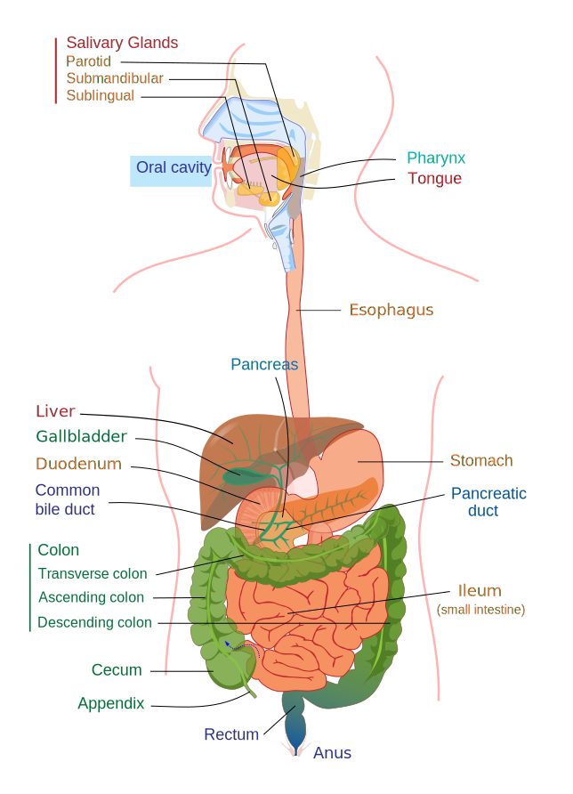
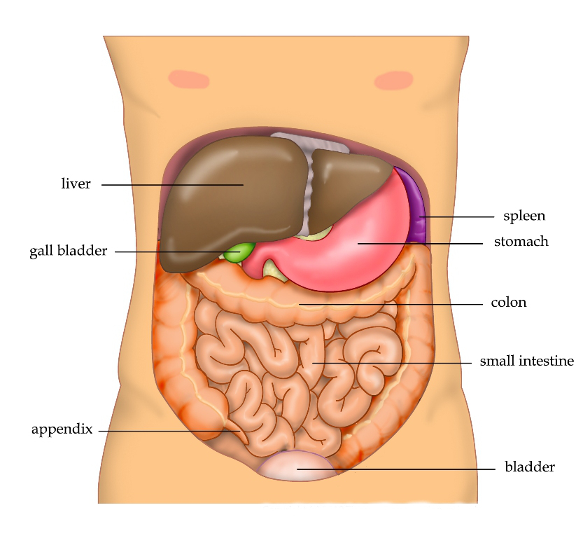
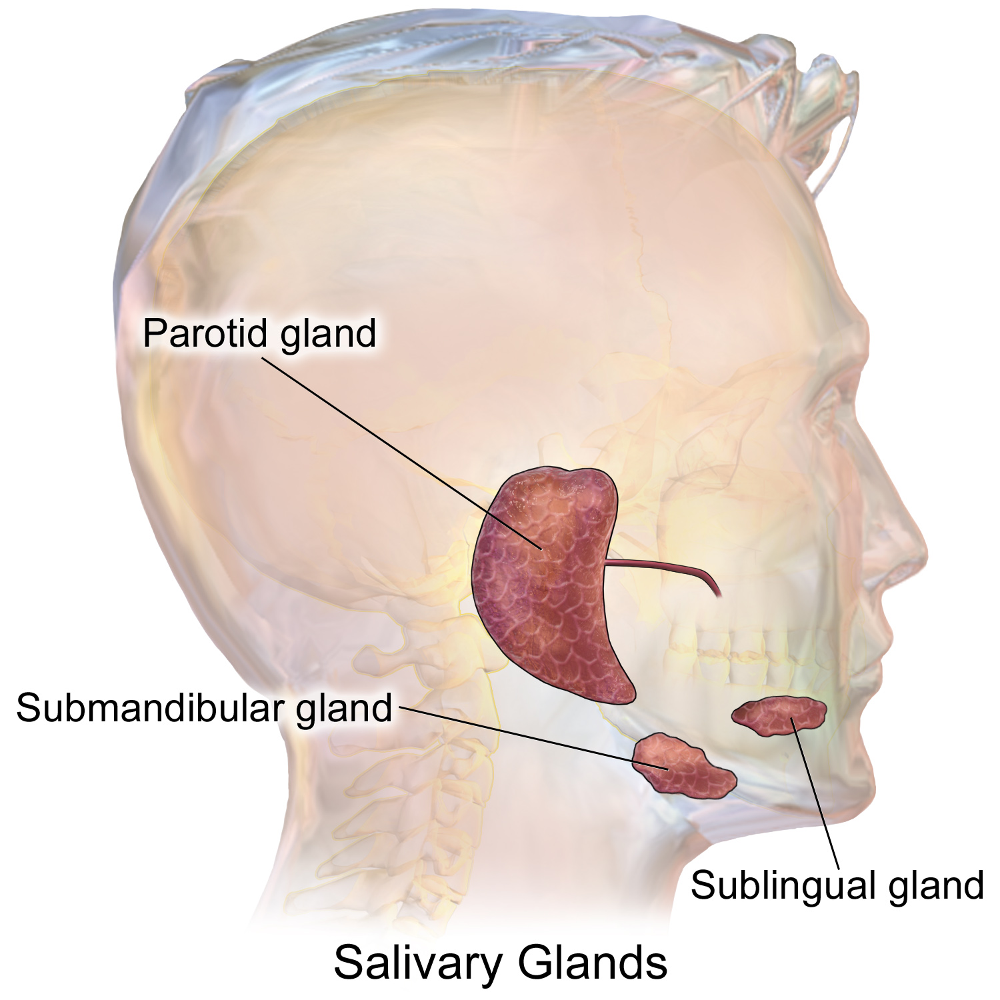
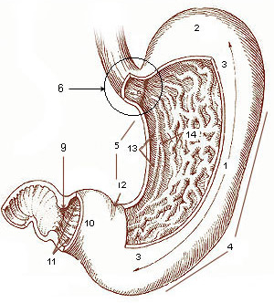
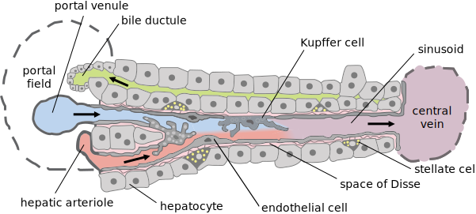
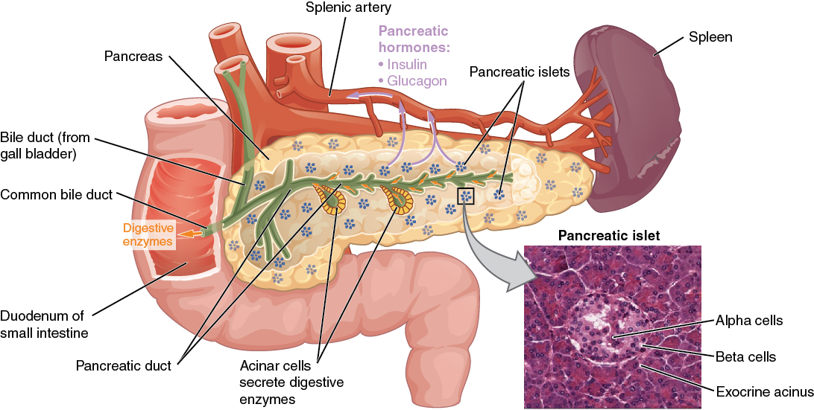

# Digestive Systems

Digestion is the breakdown of large insoluble food molecules into small water-soluble food molecules so that they can be absorbed into the watery blood plasma. In certain organisms, these smaller substances are absorbed through the small intestine into the blood stream. Digestion is a form of catabolism that is often divided into two processes based on how food is broken down: mechanical and chemical digestion. The term mechanical digestion refers to the physical breakdown of large pieces of food into smaller pieces which can subsequently be accessed by digestive enzymes. In chemical digestion, enzymes break down food into the small molecules the body can use.

Digestive systems take many forms. There is a fundamental distinction between internal and external digestion. External digestion developed earlier in evolutionary history, and most fungi still rely on it. In this process, enzymes are secreted into the environment surrounding the organism, where they break down an organic material, and some of the products diffuse back to the organism. Animals have a tube (gastrointestinal tract) in which internal digestion occurs, which is more efficient because more of the broken down products can be captured, and the internal chemical environment can be more efficiently controlled.

Some organisms, including nearly all spiders, simply secrete biotoxins and digestive chemicals (e.g., enzymes) into the extracellular environment prior to ingestion of the consequent "soup". In others, once potential nutrients or food is inside the organism, digestion can be conducted to a vesicle or a sac-like structure, through a tube, or through several specialized organs aimed at making the absorption of nutrients more efficient.

In the human digestive system, food enters the mouth and mechanical digestion of the food starts by the action of mastication (chewing), a form of mechanical digestion, and the wetting contact of saliva. Saliva, a liquid secreted by the salivary glands, contains salivary amylase, an enzyme which starts the digestion of starch in the food; the saliva also contains mucus, which lubricates the food, and hydrogen carbonate, which provides the ideal conditions of pH (alkaline) for amylase to work. After undergoing mastication and starch digestion, the food will be in the form of a small, round slurry mass called a bolus. It will then travel down the esophagus and into the stomach by the action of peristalsis. Gastric juice in the stomach starts protein digestion. Gastric juice mainly contains hydrochloric acid and pepsin. In infants and toddlers gastric juice also contains rennin. As the first two chemicals may damage the stomach wall, mucus is secreted by the stomach, providing a slimy layer that acts as a shield against the damaging effects of the chemicals. At the same time protein digestion is occurring, mechanical mixing occurs by peristalsis, which is waves of muscular contractions that move along the stomach wall. This allows the mass of food to further mix with the digestive enzymes.

After some time (typically 1–2 hours in humans, 4–6 hours in dogs, 3–4 hours in house cats), the resulting thick liquid is called chyme. When the pyloric sphincter valve opens, chyme enters the duodenum where it mixes with digestive enzymes from the pancreas and bile juice from the liver and then passes through the small intestine, in which digestion continues. When the chyme is fully digested, it is absorbed into the blood. 95% of nutrient absorption occurs in the small intestine. Water and minerals are reabsorbed back into the blood in the colon (large intestine) where the pH is slightly acidic about 5.6 ~ 6.9. Some vitamins, such as biotin and vitamin K produced by bacteria in the colon are also absorbed into the blood in the colon. Waste material is eliminated from the rectum during defecation.

In most vertebrates, digestion is a multistage process in the digestive system, starting from ingestion of raw materials, most often other organisms. Ingestion usually involves some type of mechanical and chemical processing. Digestion is separated into four steps:

* Ingestion: placing food into the mouth (entry of food in the digestive system),
* Mechanical and chemical breakdown: mastication and the mixing of the resulting bolus with water, acids, bile and enzymes in the stomach and intestine to break down complex molecules into simple structures,
* Absorption: of nutrients from the digestive system to the circulatory and lymphatic capillaries through osmosis, active transport, and diffusion, and
* Egestion (Excretion): Removal of undigested materials from the digestive tract through defecation.

Underlying the process is muscle movement throughout the system through swallowing and peristalsis. Each step in digestion requires energy, and thus imposes an "overhead charge" on the energy made available from absorbed substances. Differences in that overhead cost are important influences on lifestyle, behavior, and even physical structures. Examples may be seen in humans, who differ considerably from other hominids (lack of hair, smaller jaws and musculature, different dentition, length of intestines, cooking, etc.).

The major part of digestion takes place in the small intestine. The large intestine primarily serves as a site for fermentation of indigestible matter by gut bacteria and for resorption of water from digests before excretion.

Different phases of digestion take place including: the cephalic phase, gastric phase, and intestinal phase.

The cephalic phase occurs at the sight, thought and smell of food, which stimulate the cerebral cortex. Taste and smell stimuli are sent to the hypothalamus and medulla oblongata. After this it is routed through the vagus nerve and release of acetylcholine. Gastric secretion at this phase rises to 40% of maximum rate. Acidity in the stomach is not buffered by food at this point and thus acts to inhibit parietal (secretes acid) and G cell (secretes gastrin) activity via D cell secretion of somatostatin.

The gastric phase takes 3 to 4 hours. It is stimulated by distension of the stomach, presence of food in stomach and decrease in pH. Distention activates long and myenteric reflexes. This activates the release of acetylcholine, which stimulates the release of more gastric juices. As protein enters the stomach, it binds to hydrogen ions, which raises the pH of the stomach. Inhibition of gastrin and gastric acid secretion is lifted. This triggers G cells to release gastrin, which in turn stimulates parietal cells to secrete gastric acid. Gastric acid is about 0.5% hydrochloric acid (HCl), which lowers the pH to the desired pH of 1–3. Acid release is also triggered by acetylcholine and histamine.

The intestinal phase has two parts, the excitatory and the inhibitory. Partially digested food fills the duodenum. This triggers intestinal gastrin to be released. Enterogastric reflex inhibits vagal nuclei, activating sympathetic fibers causing the pyloric sphincter to tighten to prevent more food from entering, and inhibits local reflexes.
In mammals, preparation for digestion begins with the cephalic phase in which saliva is produced in the mouth and digestive enzymes are produced in the stomach. Mechanical and chemical digestion begin in the mouth where food is chewed, and mixed with saliva to begin enzymatic processing of starches. The stomach continues to break food down mechanically and chemically through churning and mixing with both acids and enzymes. Absorption occurs in the stomach and gastrointestinal tract, and the process finishes with defecation.

Herbivores have evolved cecums (or an abomasum in the case of ruminants). Ruminants have a fore-stomach with four chambers. These are the rumen, reticulum, omasum, and abomasum. In the first two chambers, the rumen and the reticulum, the food is mixed with saliva and separates into layers of solid and liquid material. Solids clump together to form the cud (or bolus). The cud is then regurgitated, chewed slowly to completely mix it with saliva and to break down the particle size.

Fibre, especially cellulose and hemi-cellulose, is primarily broken down into the volatile fatty acids, acetic acid, propionic acid and butyric acid in these chambers (the reticulo-rumen) by microbes: (bacteria, protozoa, and fungi). In the omasum, water and many of the inorganic mineral elements are absorbed into the blood stream.

The abomasum is the fourth and final stomach compartment in ruminants. It is a close equivalent of a monogastric stomach (e.g., those in humans or pigs), and digesta is processed here in much the same way. It serves primarily as a site for acid hydrolysis of microbial and dietary protein, preparing these protein sources for further digestion and absorption in the small intestine. Digesta is finally moved into the small intestine, where the digestion and absorption of nutrients occurs. Microbes produced in the reticulo-rumen are also digested in the small intestine.

## The Human Digestive System

The gastrointestinal tract, (GI tract, GIT, digestive tract, digestion tract, alimentary canal) is the tract from the mouth to the anus which includes all the organs of the digestive system in humans and other animals. Food taken in through the mouth is digested to extract nutrients and absorb energy, and expelled in the remaining waste as feces. The mouth, esophagus, stomach and intestines are all part of the gastrointestinal tract. Gastrointestinal is an adjective meaning of or pertaining to the stomach and intestines. A tract is a collection of related anatomic structures or a series of connected body organs.

(ref:uplowgit) [Upper and lower human gastrointestinal tract.](https://en.wikipedia.org/wiki/File:Digestive_system_diagram_edit.svg) 

```{r upperlowergitract, fig.cap='(ref:uplowgit)', echo=FALSE, message=FALSE, warning=FALSE}

```

All vertebrates and most invertebrates have a digestive tract. The sponges, cnidarians, and ctenophores are the early invertebrates with an incomplete digestive tract having just one opening instead of two, where food is taken in and waste expelled.

The human gastrointestinal tract is around 9 meters long. Food digestion physiology varies between individuals and upon other factors such as the characteristics of the food and size of the meal, and the process of digestion normally takes between 24 and 72 hours.

Digestion begins in the mouth with the secretion of saliva and its digestive enzymes. Food is formed into a bolus by the mechanical mastication and swallowed into the esophagus from where it enters the stomach through the action of peristalsis. Gastric juice contains hydrochloric acid and pepsin which would damage the walls of the stomach and mucus is secreted for protection. In the stomach further release of enzymes break down the food further and this is combined with the churning action of the stomach. The partially digested food enters the duodenum as a thick semi-liquid chyme. In the small intestine, the larger part of digestion takes place and this is helped by the secretions of bile, pancreatic juice and intestinal juice. The intestinal walls are lined with villi, and their epithelial cells is covered with numerous microvilli to improve the absorption of nutrients by increasing the surface area of the intestine.

In the large intestine the passage of food is slower to enable fermentation by the gut flora to take place. Here water is absorbed and waste material stored as feces to be removed by defecation via the anal canal and anus.

The human digestive system consists of the gastrointestinal tract plus the accessory organs of digestion (the tongue, salivary glands, pancreas, liver, and gallbladder). Digestion involves the breakdown of food into smaller and smaller components, until they can be absorbed and assimilated into the body. The process of digestion has three stages. The first stage is the cephalic phase of digestion which begins with gastric secretions in response to the sight and smell of food. This stage includes the mechanical breakdown of food by chewing, and the chemical breakdown by digestive enzymes, that takes place in the mouth.

(ref:humanab) [Location of the liver, gallbladder, spleen, stomach, colon, appendix, and small intestine in the human abdomen.](https://commons.wikimedia.org/wiki/File:Anatomy_Abdomen_Tiesworks.jpg) 

```{r humanabdomen, fig.cap='(ref:humanab)', echo=FALSE, message=FALSE, warning=FALSE}

```

Saliva contains digestive enzymes called amylase, and lingual lipase, secreted by the salivary glands and serous glands on the tongue. The enzymes start to break down the food in the mouth. Chewing, in which the food is mixed with saliva, begins the mechanical process of digestion. This produces a bolus which can be swallowed down the esophagus to enter the stomach. In the stomach the gastric phase of digestion takes place. The food is further broken down by mixing with gastric acid until it passes into the duodenum, in the third intestinal phase of digestion, where it is mixed with a number of enzymes produced by the pancreas. Digestion is helped by the chewing of food carried out by the muscles of mastication, the tongue, and the teeth, and also by the contractions of peristalsis, and segmentation. Gastric acid, and the production of mucus in the stomach, are essential for the continuation of digestion.

Peristalsis is the rhythmic contraction of muscles that begins in the esophagus and continues along the wall of the stomach and the rest of the gastrointestinal tract. This initially results in the production of chyme which when fully broken down in the small intestine is absorbed as chyle into the lymphatic system. Most of the digestion of food takes place in the small intestine. Water and some minerals are reabsorbed back into the blood in the colon of the large intestine. The waste products of digestion (feces) are defecated from the anus via the rectum.

There are several organs and other components involved in the digestion of food. The organs known as the accessory digestive organs are the liver, gall bladder and pancreas. Other components include the mouth, salivary glands, tongue, teeth and epiglottis.

The largest structure of the digestive system is the gastrointestinal tract (GI tract). This starts at the mouth and ends at the anus, covering a distance of about nine (9) metres.

The largest part of the GI tract is the colon or large intestine. Water is absorbed here and the remaining waste matter is stored prior to defecation.

Most of the digestion of food takes place in the small intestine which is the longest part of the GI tract.

A major digestive organ is the stomach. Within its mucosa are millions of embedded gastric glands. Their secretions are vital to the functioning of the organ.

There are many specialised cells of the GI tract. These include the various cells of the gastric glands, taste cells, pancreatic duct cells, enterocytes and microfold cells.

Some parts of the digestive system are also part of the excretory system, including the large intestine.

The mouth is the first part of the upper gastrointestinal tract and is equipped with several structures that begin the first processes of digestion. These include salivary glands, teeth and the tongue. The mouth consists of two regions; the vestibule and the oral cavity proper. The vestibule is the area between the teeth, lips and cheeks, and the rest is the oral cavity proper. Most of the oral cavity is lined with oral mucosa, a mucous membrane that produces a lubricating mucus, of which only a small amount is needed. Mucous membranes vary in structure in the different regions of the body but they all produce a lubricating mucus, which is either secreted by surface cells or more usually by underlying glands. The mucous membrane in the mouth continues as the thin mucosa which lines the bases of the teeth. The main component of mucus is a glycoprotein called mucin and the type secreted varies according to the region involved. Mucin is viscous, clear, and clinging. Underlying the mucous membrane in the mouth is a thin layer of smooth muscle tissue and the loose connection to the membrane gives it its great elasticity. It covers the cheeks, inner surfaces of the lips, and floor of the mouth, and the mucin produced is highly protective against tooth decay.

The roof of the mouth is termed the palate and it separates the oral cavity from the nasal cavity. The palate is hard at the front of the mouth since the overlying mucosa is covering a plate of bone; it is softer and more pliable at the back being made of muscle and connective tissue, and it can move to swallow food and liquids. The soft palate ends at the uvula. The surface of the hard palate allows for the pressure needed in eating food, to leave the nasal passage clear. The opening between the lips is termed the oral fissure, and the opening into the throat is called the fauces.

At either side of the soft palate are the palatoglossus muscles which also reach into regions of the tongue. These muscles raise the back of the tongue and also close both sides of the fauces to enable food to be swallowed.:1208 Mucus helps in the mastication of food in its ability to soften and collect the food in the formation of the bolus.

### The Salivary Glands

There are three pairs of main salivary glands and between 800 and 1,000 minor salivary glands, all of which mainly serve the digestive process, and also play an important role in the maintenance of dental health and general mouth lubrication, without which speech would be impossible. The main glands are all exocrine glands, secreting via ducts. All of these glands terminate in the mouth. The largest of these are the parotid glands—their secretion is mainly serous. The next pair are underneath the jaw, the submandibular glands, these produce both serous fluid and mucus. The serous fluid is produced by serous glands in these salivary glands which also produce lingual lipase. They produce about 70% of the oral cavity saliva. The third pair are the sublingual glands located underneath the tongue and their secretion is mainly mucous with a small percentage of saliva.

(ref:saliva) [The main salivary glands.](https://en.wikipedia.org/wiki/Human_digestive_system#/media/File:Blausen_0780_SalivaryGlands.png)

```{r salivaryglands, fig.cap='(ref:saliva)', echo=FALSE, message=FALSE, warning=FALSE}

```

Within the oral mucosa, and also on the tongue, palates, and floor of the mouth, are the minor salivary glands; their secretions are mainly mucous and they are innervated by the facial nerve (CN7). The glands also secrete amylase a first stage in the breakdown of food acting on the carbohydrate in the food to transform the starch content into maltose. There are other serous glands on the surface of the tongue that encircle taste buds on the back part of the tongue and these also produce lingual lipase. Lipase is a digestive enzyme that catalyses the hydrolysis of lipids (fats). These glands are termed Von Ebner's glands which have also been shown to have another function in the secretion of histatins which offer an early defense (outside of the immune system) against microbes in food, when it makes contact with these glands on the tongue tissue. Sensory information can stimulate the secretion of saliva providing the necessary fluid for the tongue to work with and also to ease swallowing of the food.

Saliva moistens and softens food, and along with the chewing action of the teeth, transforms the food into a smooth bolus. The bolus is further helped by the lubrication provided by the saliva in its passage from the mouth into the esophagus. Also of importance is the presence in saliva of the digestive enzymes amylase and lipase. Amylase starts to work on the starch in carbohydrates, breaking it down into the simple sugars of maltose and dextrose that can be further broken down in the small intestine. Saliva in the mouth can account for 30% of this initial starch digestion. Lipase starts to work on breaking down fats. Lipase is further produced in the pancreas where it is released to continue this digestion of fats. The presence of salivary lipase is of prime importance in young babies whose pancreatic lipase has yet to be developed.

As well as its role in supplying digestive enzymes, saliva has a cleansing action for the teeth and mouth. It also has an immunological role in supplying antibodies to the system, such as immunoglobulin A. This is seen to be key in preventing infections of the salivary glands, importantly that of parotitis.

Saliva also contains a glycoprotein called haptocorrin which is a binding protein to vitamin B12. It binds with the vitamin in order to carry it safely through the acidic content of the stomach. When it reaches the duodenum, pancreatic enzymes break down the glycoprotein and free the vitamin which then binds with intrinsic factor.

### The Tongue

Food enters the mouth where the first stage in the digestive process takes place, with the action of the tongue and the secretion of saliva. The tongue is a fleshy and muscular sensory organ, and the very first sensory information is received via the taste buds in the papillae on its surface. If the taste is agreeable, the tongue will go into action, manipulating the food in the mouth which stimulates the secretion of saliva from the salivary glands. The liquid quality of the saliva will help in the softening of the food and its enzyme content will start to break down the food whilst it is still in the mouth. The first part of the food to be broken down is the starch of carbohydrates (by the enzyme amylase in the saliva).

The tongue is attached to the floor of the mouth by a ligamentous band called the frenum and this gives it great mobility for the manipulation of food (and speech); the range of manipulation is optimally controlled by the action of several muscles and limited in its external range by the stretch of the frenum. The tongue's two sets of muscles, are four intrinsic muscles that originate in the tongue and are involved with its shaping, and four extrinsic muscles originating in bone that are involved with its movement.

Taste is a form of chemoreception that takes place in the specialised taste receptors, contained in structures called taste buds in the mouth. Taste buds are mainly on the upper surface (dorsum) of the tongue. The function of taste perception is vital to help prevent harmful or rotten foods from being consumed. There are also taste buds on the epiglottis and upper part of the esophagus. The taste buds are innervated by a branch of the facial nerve the chorda tympani, and the glossopharyngeal nerve. Taste messages are sent via these cranial nerves to the brain. The brain can distinguish between the chemical qualities of the food. The five basic tastes are referred to as those of saltiness, sourness, bitterness, sweetness, and umami. The detection of saltiness and sourness enables the control of salt and acid balance. The detection of bitterness warns of poisons—many of a plant's defences are of poisonous compounds that are bitter. Sweetness guides to those foods that will supply energy; the initial breakdown of the energy-giving carbohydrates by salivary amylase creates the taste of sweetness since simple sugars are the first result. The taste of umami is thought to signal protein-rich food. Sour tastes are acidic which is often found in bad food. The brain has to decide very quickly whether the food should be eaten or not. It was the findings in 1991, describing the first olfactory receptors that helped to prompt the research into taste. The olfactory receptors are located on cell surfaces in the nose which bind to chemicals enabling the detection of smells. It is assumed that signals from taste receptors work together with those from the nose, to form an idea of complex food flavours.

### The Teeth

Teeth are complex structures made of materials specific to them. They are made of a bone-like material called dentin, which is covered by the hardest tissue in the body—enamel. Teeth have different shapes to deal with different aspects of mastication employed in tearing and chewing pieces of food into smaller and smaller pieces. This results in a much larger surface area for the action of digestive enzymes. The teeth are named after their particular roles in the process of mastication—incisors are used for cutting or biting off pieces of food; canines, are used for tearing, premolars and molars are used for chewing and grinding. Mastication of the food with the help of saliva and mucus results in the formation of a soft bolus which can then be swallowed to make its way down the upper gastrointestinal tract to the stomach. The digestive enzymes in saliva also help in keeping the teeth clean by breaking down any lodged food particles.

### The Epiglottis

The epiglottis is a flap of elastic cartilage attached to the entrance of the larynx. It is covered with a mucous membrane and there are taste buds on its lingual surface which faces into the mouth. Its laryngeal surface faces into the larynx. The epiglottis functions to guard the entrance of the glottis, the opening between the vocal folds. It is normally pointed upward during breathing with its underside functioning as part of the pharynx, but during swallowing, the epiglottis folds down to a more horizontal position, with its upper side functioning as part of the pharynx. In this manner it prevents food from going into the trachea and instead directs it to the esophagus, which is behind. During swallowing, the backward motion of the tongue forces the epiglottis over the glottis' opening to prevent any food that is being swallowed from entering the larynx which leads to the lungs; the larynx is also pulled upwards to assist this process. Stimulation of the larynx by ingested matter produces a strong cough reflex in order to protect the lungs.

### The Pharynx

The pharynx is a part of the conducting zone of the respiratory system and also a part of the digestive system. It is the part of the throat immediately behind the nasal cavity at the back of the mouth and above the esophagus and larynx. The pharynx is made up of three parts. The lower two parts—the oropharynx and the laryngopharynx are involved in the digestive system. The laryngopharynx connects to the esophagus and it serves as a passageway for both air and food. Air enters the larynx anteriorly but anything swallowed has priority and the passage of air is temporarily blocked. The pharynx is innervated by the pharyngeal plexus of the vagus nerve.:1465 Muscles in the pharynx push the food into the esophagus. The pharynx joins the esophagus at the oesophageal inlet which is located behind the cricoid cartilage.

### The Esophagus

The esophagus, commonly known as the foodpipe or gullet, consists of a muscular tube through which food passes from the pharynx to the stomach. The esophagus is continuous with the laryngopharynx. It passes through the posterior mediastinum in the thorax and enters the stomach through a hole in the thoracic diaphragm—the esophageal hiatus, at the level of the tenth thoracic vertebra (T10). Its length averages 25 cm, varying with an individual's height. It is divided into cervical, thoracic and abdominal parts. The pharynx joins the esophagus at the esophageal inlet which is behind the cricoid cartilage.

At rest the esophagus is closed at both ends, by the upper and lower esophageal sphincters. The opening of the upper sphincter is triggered by the swallowing reflex so that food is allowed through. The sphincter also serves to prevent back flow from the esophagus into the pharynx. The esophagus has a mucous membrane and the epithelium which has a protective function is continuously replaced due to the volume of food that passes inside the esophagus. During swallowing, food passes from the mouth through the pharynx into the esophagus. The epiglottis folds down to a more horizontal position to direct the food into the esophagus, and away from the trachea.

Once in the esophagus, the bolus travels down to the stomach via rhythmic contraction and relaxation of muscles known as peristalsis. The lower esophageal sphincter is a muscular sphincter surrounding the lower part of the esophagus. The gastroesophageal junction between the esophagus and the stomach is controlled by the lower esophageal sphincter, which remains constricted at all times other than during swallowing and vomiting to prevent the contents of the stomach from entering the esophagus. As the esophagus does not have the same protection from acid as the stomach, any failure of this sphincter can lead to heartburn.

### The Diaphragm

The diaphragm is an important part of the body's digestive system. The muscular diaphragm separates the thoracic cavity from the abdominal cavity where most of the digestive organs are located. The suspensory muscle attaches the ascending duodenum to the diaphragm. This muscle is thought to be of help in the digestive system in that its attachment offers a wider angle to the duodenojejunal flexure for the easier passage of digesting material. The diaphragm also attaches to, and anchors the liver at its bare area. The esophagus enters the abdomen through a hole in the diaphragm at the level of T10.

### The Stomach

The stomach is a major organ of the gastrointestinal tract and digestive system. It is a consistently J-shaped organ joined to the esophagus at its upper end and to the duodenum at its lower end. Gastric acid (informally gastric juice), produced in the stomach plays a vital role in the digestive process, and mainly contains hydrochloric acid and sodium chloride. A peptide hormone, gastrin, produced by G cells in the gastric glands, stimulates the production of gastric juice which activates the digestive enzymes. Pepsinogen is a precursor enzyme (zymogen) produced by the gastric chief cells, and gastric acid activates this to the enzyme pepsin which begins the digestion of proteins. As these two chemicals would damage the stomach wall, mucus is secreted by innumerable gastric glands in the stomach, to provide a slimy protective layer against the damaging effects of the chemicals on the inner layers of the stomach.

(ref:stom) [The human stomach.](https://commons.wikimedia.org/wiki/File:Illu_stomach.jpg) 1. Body of stomach 2. Fundus 3. Anterior wall 4. Greater curvature 5. Lesser curvature 6. Cardia 9. Pyloric sphincter 10. Pyloric antrum 11. Pyloric canal 12. Angular incisure 13. Gastric canal 14. Rugae

```{r humanstomach, fig.cap='(ref:stom)', echo=FALSE, message=FALSE, warning=FALSE}

```

At the same time that protein is being digested, mechanical churning occurs through the action of peristalsis, waves of muscular contractions that move along the stomach wall. This allows the mass of food to further mix with the digestive enzymes. Gastric lipase secreted by the chief cells in the fundic glands in the gastric mucosa of the stomach, is an acidic lipase, in contrast with the alkaline pancreatic lipase. This breaks down fats to some degree though is not as efficient as the pancreatic lipase.

The pylorus, the lowest section of the stomach which attaches to the duodenum via the pyloric canal, contains countless glands which secrete digestive enzymes including gastrin. After an hour or two, a thick semi-liquid called chyme is produced. When the pyloric sphincter, or valve opens, chyme enters the duodenum where it mixes further with digestive enzymes from the pancreas, and then passes through the small intestine, where digestion continues. When the chyme is fully digested, it is absorbed into the blood. 95% of absorption of nutrients occurs in the small intestine. Water and minerals are reabsorbed back into the blood in the colon of the large intestine, where the environment is slightly acidic. Some vitamins, such as biotin and vitamin K produced by bacteria in the gut flora of the colon are also absorbed.

The parietal cells in the fundus of the stomach, produce a glycoprotein called intrinsic factor which is essential for the absorption of vitamin B12. Vitamin B12 (cobalamin), is carried to, and through the stomach, bound to a glycoprotein secreted by the salivary glands - transcobalamin I also called haptocorrin, which protects the acid-sensitive vitamin from the acidic stomach contents. Once in the more neutral duodenum, pancreatic enzymes break down the protective glycoprotein. The freed vitamin B12 then binds to intrinsic factor which is then absorbed by the enterocytes in the ileum.

The stomach is a distensible organ and can normally expand to hold about one litre of food. This expansion is enabled by a series of gastric folds in the inner walls of the stomach. The stomach of a newborn baby will only be able to expand to retain about 30 ml.

### The Spleen

The spleen is the largest lymphoid organ in the body but has other functions. It breaks down both red and white blood cells that are spent. This is why it is sometimes known as the 'graveyard of red blood cells'. A product of this digestion is the pigment bilirubin, which is sent to the liver and secreted in the bile. Another product is iron, which is used in the formation of new blood cells in the bone marrow. Medicine treats the spleen solely as belonging to the lymphatic system, though it is acknowledged that the full range of its important functions is not yet understood.:1751

### The Liver, Bile And Gallbladder

The liver is an organ only found in vertebrates. In humans, it is located in the right upper quadrant of the abdomen, below the diaphragm. The liver is the second largest organ (after the skin) and is an accessory digestive gland which plays a role in the body's metabolism. The liver has many functions some of which are important to digestion. The liver can detoxify various metabolites; synthesise proteins and produce biochemicals needed for digestion. It regulates the storage of glycogen which it can form from glucose (glycogenesis). The liver can also synthesise glucose from certain amino acids. Its digestive functions are largely involved with the breaking down of carbohydrates. It also maintains protein metabolism in its synthesis and degradation. In lipid metabolism it synthesises cholesterol. Fats are also produced in the process of lipogenesis. The liver synthesises the bulk of lipoproteins. The liver is located in the upper right quadrant of the abdomen and below the diaphragm to which it is attached at one part, the bare area of the liver. This is to the right of the stomach and it overlies the gall bladder. The liver synthesises bile acids and lecithin to promote the digestion of fat.

The liver is grossly divided into two parts when viewed from above – a right and a left lobe - and four parts when viewed from below (left, right, caudate, and quadrate lobes). Microscopically, each liver lobe is seen to be made up of hepatic lobules. The lobules are roughly hexagonal, and consist of plates of hepatocytes, and sinusoids radiating from a central vein towards an imaginary perimeter of interlobular portal triads. The central vein joins to the hepatic vein to carry blood out from the liver. A distinctive component of a lobule is the portal triad, which can be found running along each of the lobule's corners. The portal triad, consists of the hepatic artery, the portal vein, and the common bile duct. The triad may be seen on a liver ultrasound, as a Mickey Mouse sign with the portal vein as the head, and the hepatic artery, and the common bile duct as the ears.

(ref:microliv) [Diagram of the microscopic structure of the liever.](https://commons.wikimedia.org/wiki/File:Hepatic_structure2.svg) 

```{r microliver, fig.cap='(ref:microliv)', echo=FALSE, message=FALSE, warning=FALSE}

```

Bile produced by the liver is made up of water (97%), bile salts, mucus and pigments, 1% fats and inorganic salts. Bilirubin is its major pigment. Bile acts partly as a surfactant which lowers the surface tension between either two liquids or a solid and a liquid and helps to emulsify the fats in the chyme. Food fat is dispersed by the action of bile into smaller units called micelles. The breaking down into micelles creates a much larger surface area for the pancreatic enzyme, lipase to work on. Lipase digests the triglycerides which are broken down into two fatty acids and a monoglyceride. These are then absorbed by villi on the intestinal wall. If fats are not absorbed in this way in the small intestine problems can arise later in the large intestine which is not equipped to absorb fats. Bile also helps in the absorption of vitamin K from the diet. Bile is collected and delivered through the common hepatic duct. This duct joins with the cystic duct to connect in a common bile duct with the gallbladder. Bile is stored in the gallbladder for release when food is discharged into the duodenum and also after a few hours.

The gallbladder is a hollow part of the biliary tract that sits just beneath the liver, with the gallbladder body resting in a small depression. It is a small organ where the bile produced by the liver is stored, before being released into the small intestine. Bile flows from the liver through the bile ducts and into the gall bladder for storage. The bile is released in response to cholecystokinin (CCK) a peptide hormone released from the duodenum. The production of CCK (by endocrine cells of the duodenum) is stimulated by the presence of fat in the duodenum.

It is divided into three sections, a fundus, body and neck. The neck tapers and connects to the biliary tract via the cystic duct, which then joins the common hepatic duct to form the common bile duct. At this junction is a mucosal fold called Hartmann's pouch, where gallstones commonly get stuck. The muscular layer of the body is of smooth muscle tissue that helps the gallbladder contract, so that it can discharge its bile into the bile duct. The gallbladder needs to store bile in a natural, semi-liquid form at all times. Hydrogen ions secreted from the inner lining of the gallbladder keep the bile acidic enough to prevent hardening. To dilute the bile, water and electrolytes from the digestion system are added. Also, salts attach themselves to cholesterol molecules in the bile to keep them from crystallising. If there is too much cholesterol or bilirubin in the bile, or if the gallbladder doesn't empty properly the systems can fail. This is how gallstones form when a small piece of calcium gets coated with either cholesterol or bilirubin and the bile crystallises and forms a gallstone. The main purpose of the gallbladder is to store and release bile, or gall. Bile is released into the small intestine in order to help in the digestion of fats by breaking down larger molecules into smaller ones. After the fat is absorbed, the bile is also absorbed and transported back to the liver for reuse.

### The Pancreas

The pancreas is a major organ functioning as an accessory digestive gland in the digestive system. It is both an endocrine gland and an exocrine gland. The endocrine part secretes insulin when the blood sugar becomes high; insulin moves glucose from the blood into the muscles and other tissues for use as energy. The endocrine part releases glucagon when the blood sugar is low; glucagon allows stored sugar to be broken down into glucose by the liver in order to re-balance the sugar levels. The pancreas produces and releases important digestive enzymes in the pancreatic juice that it delivers to the duodenum. The pancreas lies below and at the back of the stomach. It connects to the duodenum via the pancreatic duct which it joins near to the bile duct's connection where both the bile and pancreatic juice can act on the chyme that is released from the stomach into the duodenum. Aqueous pancreatic secretions from pancreatic duct cells contain bicarbonate ions which are alkaline and help with the bile to neutralise the acidic chyme that is churned out by the stomach.

(ref:pancreas) [The pancreas has a role in digestion, highlighted here. Ducts in the pancreas (green) conduct digestive enzymes into the duodenum. This image also shows a pancreatic islet, part of the endocrine pancreas, which contains cells responsible for secretion of insulin and glucagon.](https://upload.wikimedia.org/wikipedia/commons/e/e0/1820_The_Pancreas.jpg) 

```{r humanpancreas, fig.cap='(ref:pancreas)', echo=FALSE, message=FALSE, warning=FALSE}

```

The pancreas is also the main source of enzymes for the digestion of fats and proteins. Some of these are released in response to the production of CKK in the duodenum. (The enzymes that digest polysaccharides, by contrast, are primarily produced by the walls of the intestines.) The cells are filled with secretory granules containing the precursor digestive enzymes. The major proteases, the pancreatic enzymes which work on proteins, are trypsinogen and chymotrypsinogen. Elastase is also produced. Smaller amounts of lipase and amylase are secreted. The pancreas also secretes phospholipase A2, lysophospholipase, and cholesterol esterase. The precursor zymogens, are inactive variants of the enzymes; which avoids the onset of pancreatitis caused by autodegradation. Once released in the intestine, the enzyme enteropeptidase present in the intestinal mucosa activates trypsinogen by cleaving it to form trypsin; further cleavage results in chymotripsin.

### Lower Gastrointestinal Tract

The lower gastrointestinal tract (GI), includes the small intestine and all of the large intestine. The intestine is also called the bowel or the gut. The lower GI starts at the pyloric sphincter of the stomach and finishes at the anus. The small intestine is subdivided into the duodenum, the jejunum and the ileum. The cecum marks the division between the small and large intestine. The large intestine includes the rectum and anal canal.

### The Small Intestine

Partially digested food starts to arrive in the small intestine as semi-liquid chyme, one hour after it is eaten.[citation needed] The stomach is half empty after an average of 1.2 hours. After four or five hours the stomach has emptied.

In the small intestine, the pH becomes crucial; it needs to be finely balanced in order to activate digestive enzymes. The chyme is very acidic, with a low pH, having been released from the stomach and needs to be made much more alkaline. This is achieved in the duodenum by the addition of bile from the gall bladder combined with the bicarbonate secretions from the pancreatic duct and also from secretions of bicarbonate-rich mucus from duodenal glands known as Brunner's glands. The chyme arrives in the intestines having been released from the stomach through the opening of the pyloric sphincter. The resulting alkaline fluid mix neutralises the gastric acid which would damage the lining of the intestine. The mucus component lubricates the walls of the intestine.

When the digested food particles are reduced enough in size and composition, they can be absorbed by the intestinal wall and carried to the bloodstream. The first receptacle for this chyme is the duodenal bulb. From here it passes into the first of the three sections of the small intestine, the duodenum. (The next section is the jejunum and the third is the ileum). The duodenum is the first and shortest section of the small intestine. It is a hollow, jointed C-shaped tube connecting the stomach to the jejunum. It starts at the duodenal bulb and ends at the suspensory muscle of duodenum. The attachment of the suspensory muscle to the diaphragm is thought to help the passage of food by making a wider angle at its attachment.

Most food digestion takes place in the small intestine. Segmentation contractions act to mix and move the chyme more slowly in the small intestine allowing more time for absorption (and these continue in the large intestine). In the duodenum, pancreatic lipase is secreted together with a co-enzyme, colipase to further digest the fat content of the chyme. From this breakdown, smaller particles of emulsified fats called chylomicrons are produced. There are also digestive cells called enterocytes lining the intestines (the majority being in the small intestine). They are unusual cells in that they have villi on their surface which in turn have innumerable microvilli on their surface. All these villi make for a greater surface area, not only for the absorption of chyme but also for its further digestion by large numbers of digestive enzymes present on the microvilli.

The chylomicrons are small enough to pass through the enterocyte villi and into their lymph capillaries called lacteals. A milky fluid called chyle, consisting mainly of the emulsified fats of the chylomicrons, results from the absorbed mix with the lymph in the lacteals.[clarification needed] Chyle is then transported through the lymphatic system to the rest of the body.

The suspensory muscle marks the end of the duodenum and the division between the upper gastrointestinal tract and the lower GI tract. The digestive tract continues as the jejunum which continues as the ileum. The jejunum, the midsection of the small intestine contains circular folds, flaps of doubled mucosal membrane which partially encircle and sometimes completely encircle the lumen of the intestine. These folds together with villi serve to increase the surface area of the jejunum enabling an increased absorption of digested sugars, amino acids and fatty acids into the bloodstream. The circular folds also slow the passage of food giving more time for nutrients to be absorbed.

The last part of the small intestine is the ileum. This also contains villi and vitamin B12; bile acids and any residue nutrients are absorbed here. When the chyme is exhausted of its nutrients the remaining waste material changes into the semi-solids called feces, which pass to the large intestine, where bacteria in the gut flora further break down residual proteins and starches.

Transit time through the small intestine is an average of 4 hours. Half of the food residues of a meal have emptied from the small intestine by an average of 5.4 hours after ingestion. Emptying of the small intestine is complete after an average of 8.6 hours.

### The Cecum

The cecum is a pouch marking the division between the small intestine and the large intestine. It lies below the ileocecal valve in the lower right quadrant of the abdomen. The cecum receives chyme from the last part of the small intestine, the ileum, and connects to the ascending colon of the large intestine. At this junction there is a sphincter or valve, the ileocecal valve which slows the passage of chyme from the ileum, allowing further digestion. It is also the site of the appendix attachment.

### The Large Intestine

In the large intestine, the passage of the digesting food in the colon is a lot slower, taking from 30 to 40 hours until it is removed by defecation. The colon mainly serves as a site for the fermentation of digestible matter by the gut flora. The time taken varies considerably between individuals. The remaining semi-solid waste is termed feces and is removed by the coordinated contractions of the intestinal walls, termed peristalsis, which propels the excreta forward to reach the rectum and exit via defecation from the anus. The wall has an outer layer of longitudinal muscles, the taeniae coli, and an inner layer of circular muscles. The circular muscle keeps the material moving forward and also prevents any back flow of waste. Also of help in the action of peristalsis is the basal electrical rhythm that determines the frequency of contractions. The taeniae coli can be seen and are responsible for the bulges (haustra) present in the colon. Most parts of the GI tract are covered with serous membranes and have a mesentery. Other more muscular parts are lined with adventitia.


### Protein Digestion

Protein digestion occurs in the stomach and duodenum in which 3 main enzymes, pepsin secreted by the stomach and trypsin and chymotrypsin secreted by the pancreas, break down food proteins into polypeptides that are then broken down by various exopeptidases and dipeptidases into amino acids. The digestive enzymes however are mostly secreted as their inactive precursors, the zymogens. For example, trypsin is secreted by pancreas in the form of trypsinogen, which is activated in the duodenum by enterokinase to form trypsin. Trypsin then cleaves proteins to smaller polypeptides.

### Fat Digestion

Digestion of some fats can begin in the mouth where lingual lipase breaks down some short chain lipids into diglycerides. However fats are mainly digested in the small intestine. The presence of fat in the small intestine produces hormones that stimulate the release of pancreatic lipase from the pancreas and bile from the liver which helps in the emulsification of fats for absorption of fatty acids. Complete digestion of one molecule of fat (a triglyceride) results a mixture of fatty acids, mono- and di-glycerides, as well as some undigested triglycerides, but no free glycerol molecules.

### Carbohydrate Digestion

In humans, dietary starches are composed of glucose units arranged in long chains called amylose, a polysaccharide. During digestion, bonds between glucose molecules are broken by salivary and pancreatic amylase, resulting in progressively smaller chains of glucose. This results in simple sugars glucose and maltose (2 glucose molecules) that can be absorbed by the small intestine.

Lactase is an enzyme that breaks down the disaccharide lactose to its component parts, glucose and galactose. Glucose and galactose can be absorbed by the small intestine. Approximately 65 percent of the adult population produce only small amounts of lactase and are unable to eat unfermented milk-based foods. This is commonly known as lactose intolerance. Lactose intolerance varies widely by genetic heritage; more than 90 percent of peoples of east Asian descent are lactose intolerant, in contrast to about 5 percent of people of northern European descent.

Sucrase is an enzyme that breaks down the disaccharide sucrose, commonly known as table sugar, cane sugar, or beet sugar. Sucrose digestion yields the sugars fructose and glucose which are readily absorbed by the small intestine.

### DNA And RNA Digestion

DNA and RNA are broken down into mononucleotides by the nucleases deoxyribonuclease and ribonuclease (DNase and RNase) from the pancreas.

### Non-destructive digestion

Some nutrients are complex molecules (for example vitamin B12) which would be destroyed if they were broken down into their functional groups. To digest vitamin B12 non-destructively, haptocorrin in saliva strongly binds and protects the B12 molecules from stomach acid as they enter the stomach and are cleaved from their protein complexes.

After the B12-haptocorrin complexes pass from the stomach via the pylorus to the duodenum, pancreatic proteases cleave haptocorrin from the B12 molecules which rebind to intrinsic factor (IF). These B12-IF complexes travel to the ileum portion of the small intestine where cubilin receptors enable assimilation and circulation of B12-IF complexes in the blood.

### The Digestive System of Birds

Many birds possess a muscular pouch along the esophagus called a crop. The crop functions to both soften food and regulate its flow through the system by storing it temporarily. The size and shape of the crop is quite variable among the birds. Members of the family Columbidae, such as pigeons, produce a nutritious crop milk which is fed to their young by regurgitation.

The avian stomach is composed of two organs, the proventriculus and the gizzard that work together during digestion. The proventriculus is a rod shaped tube, which is found between the esophagus and the gizzard, that secretes hydrochloric acid and pepsinogen into the digestive tract. The acid converts the inactive pepsinogen into the active proteolytic enzyme, pepsin, which breaks down specific peptide bonds found in proteins, to produce a set of peptides, which are amino acid chains that are shorter than the original dietary protein. The gastric juices (hydrochloric acid and pepsinogen) are mixed with the stomach contents through the muscular contractions of the gizzard.

The gizzard is composed of four muscular bands that rotate and crush food by shifting the food from one area to the next within the gizzard. The gizzard of some species of herbivorous birds, like turkey and quails, contains small pieces of grit or stone called gastroliths that are swallowed by the bird to aid in the grinding process, serving the function of teeth. The use of gizzard stones is a similarity found between birds and dinosaurs, which left gastroliths as trace fossils.

The partially digested and pulverized gizzard contents, now called a bolus, are passed into the intestine, where pancreatic and intestinal enzymes complete the digestion of the digestible food. The digestion products are then absorbed through the intestinal mucosa into the blood. The intestine ends via the large intestine in the vent or cloaca which serves as the common exit for renal and intestinal excrements as well as for the laying of eggs. However, unlike mammals, many birds do not excrete the bulky portions (roughage) of their undigested food (e.g. feathers, fur, bone fragments, and seed husks) via the cloaca, but regurgitate them as food pellets.

## The Digestive System of Fish

As with other vertebrates, the intestines of fish consist of two segments, the small intestine and the large intestine. In most higher vertebrates, the small intestine is further divided into the duodenum and other parts. In fish, the divisions of the small intestine are not as clear, and the terms anterior intestine or proximal intestine may be used instead of duodenum. In bony fish, the intestine is relatively short, typically around one and a half times the length of the fish's body. It commonly has a number of pyloric caeca, small pouch-like structures along its length that help to increase the overall surface area of the organ for digesting food. There is no ileocaecal valve in teleosts, with the boundary between the small intestine and the rectum being marked only by the end of the digestive epithelium. There is no small intestine as such in non-teleost fish, such as sharks, sturgeons, and lungfish. Instead, the digestive part of the gut forms a spiral intestine, connecting the stomach to the rectum. In this type of gut, the intestine itself is relatively straight, but has a long fold running along the inner surface in a spiral fashion, sometimes for dozens of turns. This fold creates a valve-like structure that greatly increases both the surface area and the effective length of the intestine. The lining of the spiral intestine is similar to that of the small intestine in teleosts and non-mammalian tetrapods. In lampreys, the spiral valve is extremely small, possibly because their diet requires little digestion. Hagfish have no spiral valve at all, with digestion occurring for almost the entire length of the intestine, which is not subdivided into different regions.

The pyloric caecum is a pouch, usually peritoneal, at the beginning of the large intestine. It receives faecal material from the ileum, and connects to the ascending colon of the large intestine. It is present in most amniotes, and also in lungfish. Many fish in addition have a number of small outpocketings, also called pyloric caeca, along their intestine; despite the name they are not homologous with the caecum of amniotes. Their purpose is to increase the overall surface area of the digestive epithelium, therefore optimizing the absorption of sugars, amino acids, and dipeptides, among other nutrients.

As with other vertebrates, the relative positions of the esophageal and duodenal openings to the stomach remain relatively constant. As a result, the stomach always curves somewhat to the left before curving back to meet the pyloric sphincter. However, lampreys, hagfishes, chimaeras, lungfishes, and some teleost fish have no stomach at all, with the esophagus opening directly into the intestine. These fish consume diets that either require little storage of food, or no pre-digestion with gastric juices, or both.

## The Digestive System of Annelids

An earthworm's digestive system consists of a mouth, pharynx, esophagus, crop, gizzard, and intestine. The mouth is surrounded by strong lips, which act like a hand to grab pieces of dead grass, leaves, and weeds, with bits of soil to help chew. The lips break the food down into smaller pieces. In the pharynx, the food is lubricated by mucus secretions for easier passage. The esophagus adds calcium carbonate to neutralize the acids formed by food matter decay. Temporary storage occurs in the crop where food and calcium carbonate are mixed. The powerful muscles of the gizzard churn and mix the mass of food and dirt. When the churning is complete, the glands in the walls of the gizzard add enzymes to the thick paste, which helps chemically breakdown the organic matter. By peristalsis, the mixture is sent to the intestine where friendly bacteria continue chemical breakdown. This releases carbohydrates, protein, fat, and various vitamins and minerals for absorption into the body.


