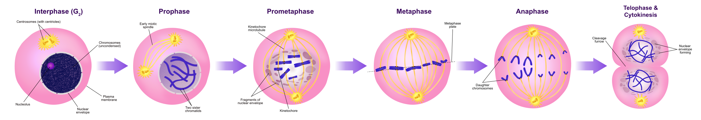
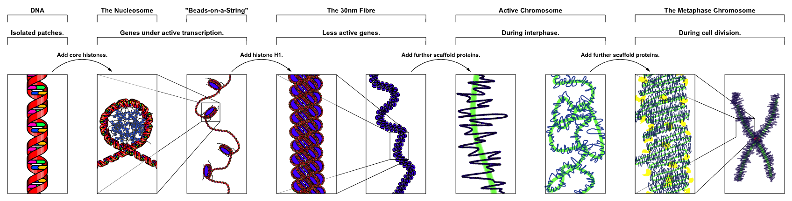
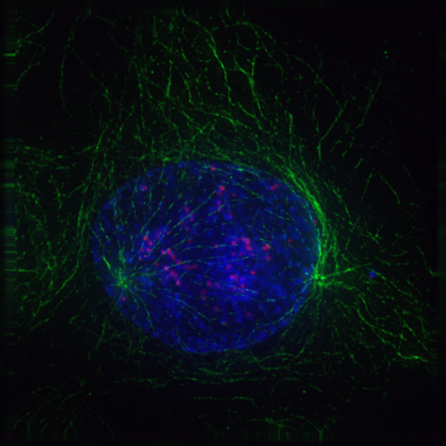
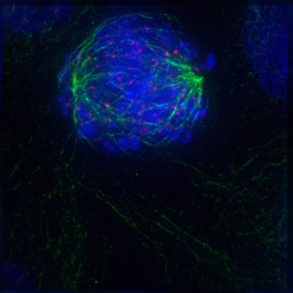
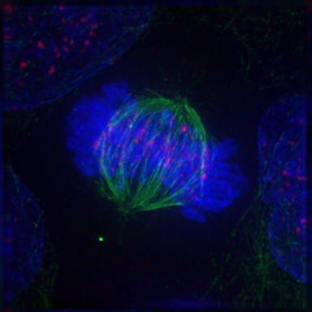
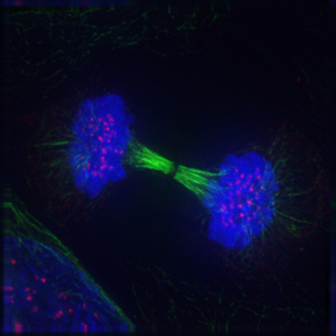

# The Cell Cycle And Cell Division

The cell cycle, or cell-division cycle, is the series of events that take place in a cell that cause it to divide into two daughter cells. These events include the duplication of its DNA (DNA replication) and some of its organelles, and subsequently the partitioning of its cytoplasm and other components into two daughter cells in a process called cell division.

In cells with nuclei (eukaryotes), (i.e., animal, plant, fungal, and protist cells), the cell cycle is divided into two main stages: interphase and the mitotic (M) phase (including mitosis and cytokinesis). During interphase, the cell grows, accumulating nutrients needed for mitosis, and replicates its DNA and some of its organelles. During the mitotic phase, the replicated chromosomes, organelles, and cytoplasm separate into two new daughter cells. To ensure the proper replication of cellular components and division, there are control mechanisms known as cell cycle checkpoints after each of the key steps of the cycle that determine if the cell can progress to the next phase.

## The Prokaryotic Cell Cycle 

In cells without nuclei (prokaryotes), (i.e., bacteria and archaea), the cell cycle is divided into the B, C, and D periods. The B period extends from the end of cell division to the beginning of DNA replication. DNA replication occurs during the C period. The D period refers to the stage between the end of DNA replication and the splitting of the bacterial cell into two daughter cells. Cell division in porkaryotes (the domains of Archaea and Bacteria) is called binary fission. This form of asexual reproduction and cell division is also used by some organelles within eukaryotic organisms (e.g., mitochondria). Binary fission results in the reproduction of a living prokaryotic cell (or organelle) by dividing the cell into two parts, each with the potential to grow to the size of the original.

The single DNA molecule first replicates, then attaches each copy to a different part of the cell membrane. When the cell begins to pull apart, the replicated and original chromosomes are separated. The consequence of this asexual method of reproduction is that all the cells are genetically identical, meaning that they have the same genetic material (barring random mutations). Unlike the processes of mitosis and meiosis used by eukaryotic cells, binary fission takes place without the formation of a spindle apparatus on the cell. Like in mitosis (and unlike in meiosis), the parental identity is preserved.

## Binary Fission

The process of binary fission in bacteria involves the following steps. First, the cell's DNA is replicated. The replicated DNA copies then move to opposite poles of the cell in an energy-dependent process. The cell lengthens. Then, the equatorial plane of the cell constricts and separates the plasma membrane such that each new cell has exactly the same genetic material.

More specifically, the following steps occur:

1. The DNA is tightly coiled.
1. The DNA is unwound and duplicated.
1. The DNA is pulled to the separate poles of the bacterium as it increases the size to prepare for splitting.
1. The growth of a new cell wall begins to separate the bacterium
1. The new cell wall fully develops, resulting in the complete split of the bacterium.
1. The new daughter cells have tightly coiled DNA rods, ribosomes, and plasmids; these are now brand-new organisms.

Binary fission is generally rapid though its speed varies between species. Under optimal conditions, *E. coli*, cells divide about every 20 minutes at 37 °C. Because the new cells will, in turn, undergo binary fission, the time binary fission requires is also the time the bacterial culture requires to double in the number of cells it contains. This time period is, therefore, be referred to as the doubling time. Some strains of *Mycobacterium tuberculosis* have doubling times of nearly 100 hours. Bacterial growth is limited by nutrient availability and density, so binary fission occurs at much lower rates in bacterial cultures once they enter the stationary phase of growth.

Some organelles in eukaryotic cells reproduce using binary fission. Mitochondrial fission occurs frequently within the cell, even when the cell is not actively undergoing mitosis, and is necessary to regulate the cell's metabolism. All chloroplasts and some mitochrondria (not in animals), both organelles derived from endosymbiosis of bacteria, also use FtsZ in a bacteria-like fashion.
The cell-division cycle is a vital process by which a single-celled fertilized egg develops into a mature organism, as well as the process by which hair, skin, blood cells, and some internal organs are renewed. After cell division, each of the daughter cells begin the interphase of a new cycle. Although the various stages of interphase are not usually morphologically distinguishable, each phase of the cell cycle has a distinct set of specialized biochemical processes that prepare the cell for initiation of the cell division.

## The Eukaryotic Cell Cycle # 

The eukaryotic cell cycle consists of four distinct phases: G1 phase, S phase (synthesis), G2 phase (collectively known as interphase) and M phase (mitosis and cytokinesis). M phase is itself composed of two tightly coupled processes: mitosis, in which the cell's nucleus divides, and cytokinesis, in which the cell's cytoplasm divides forming two daughter cells. Activation of each phase is dependent on the proper progression and completion of the previous one. Cells that have temporarily or reversibly stopped dividing are said to have entered a state of quiescence called G0 phase.

<table>
 <thead>
  <tr>
   <th style="text-align:left;"> State </th>
   <th style="text-align:left;"> Phase </th>
   <th style="text-align:left;"> Abbreviation </th>
   <th style="text-align:left;"> Description </th>
  </tr>
 </thead>
<tbody>
  <tr>
   <td style="text-align:left;"> Resting </td>
   <td style="text-align:left;"> Gap 0 </td>
   <td style="text-align:left;"> G0 </td>
   <td style="text-align:left;"> A phase where the cell has left the cycle and has stopped dividing. </td>
  </tr>
  <tr>
   <td style="text-align:left;vertical-align: middle !important;" rowspan="3"> Interphase </td>
   <td style="text-align:left;"> Gap 1 </td>
   <td style="text-align:left;"> G1 </td>
   <td style="text-align:left;"> Cells increase in size in Gap 1. The G1 checkpoint control mechanism ensures that everything is ready for DNA synthesis. </td>
  </tr>
  <tr>
   
   <td style="text-align:left;"> Synthesis </td>
   <td style="text-align:left;"> S </td>
   <td style="text-align:left;"> DNA replication occurs during this phase. </td>
  </tr>
  <tr>
   
   <td style="text-align:left;"> Gap 2 </td>
   <td style="text-align:left;"> G2 </td>
   <td style="text-align:left;"> During the gap between DNA synthesis and mitosis, the cell will continue to grow. The G2 checkpoint control mechanism ensures that everything is ready to enter the M (mitosis) phase and divide. </td>
  </tr>
  <tr>
   <td style="text-align:left;"> Cell division </td>
   <td style="text-align:left;"> Mitosis </td>
   <td style="text-align:left;"> M </td>
   <td style="text-align:left;"> Cell growth stops at this stage and cellular energy is focused on the orderly division into two daughter cells. A checkpoint in the middle of mitosis (Metaphase Checkpoint) ensures that the cell is ready to complete cell division. </td>
  </tr>
</tbody>
</table>

After cell division, each of the daughter cells begin the interphase of a new cycle. Although the various stages of interphase are not usually morphologically distinguishable, each phase of the cell cycle has a distinct set of specialized biochemical processes that prepare the cell for initiation of cell division.

## G0 phase (quiescence)

G0 is a resting phase where the cell has left the cycle and has stopped dividing. The cell cycle starts with this phase. Non-proliferative (non-dividing) cells in multicellular eukaryotes generally enter the quiescent G0 state from G1 and may remain quiescent for long periods of time, possibly indefinitely (as is often the case for neurons). This is very common for cells that are fully differentiated. Some cells enter the G0 phase semi-permanently and are considered post-mitotic, e.g., some liver, kidney, and stomach cells. Many cells do not enter G0 and continue to divide throughout an organism's life, e.g., epithelial cells.

The word "post-mitotic" is sometimes used to refer to both quiescent and senescent cells. Cellular senescence occurs in response to DNA damage and external stress and usually constitutes an arrest in G1. Cellular senescence may make a cell's progeny nonviable; it is often a biochemical alternative to the self-destruction of such a damaged cell by apoptosis.

## Interphase

Interphase is a series of changes that takes place in a newly formed cell and its nucleus before it becomes capable of division again. It is also called preparatory phase or intermitosis. Typically interphase lasts for at least 91% of the total time required for the cell cycle.

Interphase proceeds in three stages, G1, S, and G2, followed by the cycle of mitosis and cytokinesis. The cell's nuclear DNA contents are duplicated during S phase.

## G1 phase (First growth phase or Post mitotic gap phase)

The first phase within interphase, from the end of the previous M phase until the beginning of DNA synthesis, is called G1 (G indicating gap). It is also called the growth phase. During this phase, the biosynthetic activities of the cell, which are considerably slowed down during M phase, resume at a high rate. The duration of G1 is highly variable, even among different cells of the same species. In this phase, the cell increases its supply of proteins, increases the number of organelles (such as mitochondria, ribosomes), and grows in size. In G1 phase, a cell has three options.

* To continue cell cycle and enter S phase
* Stop cell cycle and enter G0 phase for undergoing differentiation.
* Become arrested in G1 phase hence it may enter G0 phase or re-enter cell cycle.

The deciding point is called check point (Restriction point). This check point is called the restriction point or START and is regulated by G1/S cyclins, which cause transition from G1 to S phase. Passage through the G1 check point commits the cell to division.

## S phase (DNA replication)

The ensuing S phase starts when DNA synthesis commences; when it is complete, all of the chromosomes have been replicated, i.e., each chromosome consists of two sister chromatids. Thus, during this phase, the amount of DNA in the cell has doubled, though the ploidy and number of chromosomes are unchanged. Rates of RNA transcription and protein synthesis are very low during this phase. An exception to this is histone production, most of which occurs during the S phase.

## G2 phase (growth)

G2 phase occurs after DNA replication and is a period of protein synthesis and rapid cell growth to prepare the cell for mitosis. During this phase microtubules begin to reorganize to form a spindle (preprophase). Before proceeding to mitotic phase, cells must be checked at the G2checkpoint for any DNA damage within the chromosomes. The G2 checkpoint is mainly regulated by the tumor protein p53. If the DNA is damaged, p53 will either repair the DNA or trigger the apoptosis of the cell. If p53 is dysfunctional or mutated, cells with damaged DNA may continue through the cell cycle, leading to the development of cancer.

## Mitotic Phase (Chromosome Separation)

The relatively brief M phase consists of nuclear division (karyokinesis). It is a relatively short period of the cell cycle. M phase is complex and highly regulated. The sequence of events is divided into phases, corresponding to the completion of one set of activities and the start of the next. These phases are sequentially known as:

* prometaphase
* metaphase
* anaphase
* telophase

Mitosis is the process by which a eukaryotic cell separates the chromosomes in its cell nucleus into two identical sets in two nuclei. During the process of mitosis the pairs of chromosomes condense and attach to microtubules that pull the sister chromatids to opposite sides of the cell.

(ref:mitosis) [A diagram of mitosis stages](https://commons.wikimedia.org/wiki/File:Mitosis_Stages.svg). Interphase (G₂): In this substage, the cell prepares for nuclear division and a protein that makes microtubles for cell division is synthesized. Prophase: The longest stage of mitosis. In this stage the chromosomes become visible and the centrioles separate and move to opposite poles of the cell. Prometaphase: The nuclear envelope disintegrates and microtubules can attach to kinetochores. Chromosomes congress toward the metaphase plate of the cell. Metaphase: In this stage the chromosomes line up across the center of the cell and become connected to the spindle fiber at their centromere. Anaphase: In this stage the sister chromatids separate into individual chromosomes and are pulled apart. Telophase & cytokinesis: Chromosomes decondense and are surrounded by a newly formed nuclear envelope. Cytokinesis typically coincides with and telophase.

(\#fig:mito)(ref:mitosis)

Mitosis occurs exclusively in eukaryotic cells, but occurs in different ways in different species. For example, animal cells undergo an "open" mitosis, where the nuclear envelope breaks down before the chromosomes separate, while fungi such as Aspergillus nidulans and Saccharomyces cerevisiae (yeast) undergo a "closed" mitosis, where chromosomes divide within an intact cell nucleus.

## Chromosomes: The Vectors of Heredity

A [chromosome](https://en.wikipedia.org/wiki/Chromosome) is a deoxyribonucleic acid (DNA) molecule with part or all of the genetic material (genome) of an organism. Most eukaryotic chromosomes include packaging proteins which, aided by chaperone proteins, bind to and condense the DNA molecule to prevent it from becoming an unmanageable tangle. This three-dimensional genome structure plays a significant role in transcriptional regulation

The word chromosome comes from the Greek χρῶμα (chroma, "colour") and σῶμα (soma, "body"), describing their strong staining by particular dyes. The term was coined by the German scientist [Heinrich Wilhelm Gottfired von Waldeyer-Hartz](https://en.wikipedia.org/wiki/Heinrich_Wilhelm_Gottfried_von_Waldeyer-Hartz), referring to the term chromatin, which was itself introduced by [Walther Flemming](https://en.wikipedia.org/wiki/Walther_Flemming), who discovered cell division.

Chromosomes are normally visible under a light microscope only when the cell is undergoing cell division. Before this happens, every chromosome is copied once (S phase), and the copy is joined to the original by a centromere, resulting either in an X-shaped structure if the centromere is located in the middle of the chromosome or a two-arm structure if the centromere is located near one of the ends. The original chromosome and the copy are now called sister chromatids. During metaphase the X-shape structure is called a metaphase chromosome. In this highly condensed form chromosomes are easiest to distinguish and study. In animal cells, chromosomes reach their highest compaction level in anaphase during chromosome segregation.

The prokaryotes – bacteria and archaea – typically have a single circular chromosome, but many variations exist. The chromosomes of most bacteria, which some authors prefer to call genophores, can range in size from only 130,000 base pairs in the endosymbiotic bacteria *Candidatus Hodgkinia cicadicola* and *Candidatus Tremblaya princeps*, to more than 14,000,000 base pairs in the soil-dwelling bacterium *Sorangium cellulosum*. Spirochaetes of the genus Borrelia are a notable exception to this arrangement, with bacteria such as *Borrelia burgdorferi*, the cause of [Lyme disease](https://en.wikipedia.org/wiki/Lyme_disease), containing a single linear chromosome.

Chromosomes in eukaryotes are composed of chromatin fiber. Chromatin fiber is made of nucleosomes (histone octamers with part of a DNA strand attached to and wrapped around it). Chromatin fibers are packaged by proteins into a condensed structure called chromatin. Chromatin contains the vast majority of DNA, but a small amount inherited maternally, can be found in the mitochondria. Chromatin is present in most cells, with a few exceptions, for example, red blood cells.

Chromatin allows the very long DNA molecules to fit into the cell nucleus. During cell division chromatin condenses further to form microscopically visible chromosomes. The structure of chromosomes varies through the cell cycle. During cellular division chromosomes are replicated, divided, and passed successfully to their daughter cells so as to ensure the genetic diversity and survival of their progeny. Chromosomes may exist as either duplicated or unduplicated. Unduplicated chromosomes are single double helixes, whereas duplicated chromosomes contain two identical copies (called chromatids or sister chromatids) joined by a centromere.

(ref:struc) [The major structures in DNA compaction: DNA, the nucleosome, the 10 nm "beads-on-a-string" fibre, the 30 nm fibre and the metaphase chromosome.](https://commons.wikimedia.org/wiki/File:Chromatin_Structures.png)

(\#fig:structure)(ref:struc)

Eukaryotes possess multiple large linear chromosomes contained in the cell's nucleus. Each chromosome has one centromere, with one or two arms projecting from the centromere, although, under most circumstances, these arms are not visible as such. In addition, most eukaryotes have a small circular mitochondrial genome, and some eukaryotes may have additional small circular or linear cytoplasmic chromosomes.

In the nuclear chromosomes of eukaryotes, the uncondensed DNA exists in a semi-ordered structure, where it is wrapped around histones (structural proteins), forming a composite material called chromatin.

### Interphase chromatin

During interphase (the period of the cell cycle where the cell is not dividing), two types of chromatin can be distinguished:

* Euchromatin, which consists of DNA that is active, e.g., being expressed as protein.
* Heterochromatin, which consists of mostly inactive DNA. It seems to serve structural purposes during the chromosomal stages.

Heterochromatin can be further distinguished into two types

* Constitutive heterochromatin, which is never expressed. It is located around the centromere and usually contains repetitive sequences.
* Facultative heterochromatin, which is sometimes expressed.

### Metaphase chromatin and division

In the early stages of mitosis or meiosis (cell division), the chromatin double helices become more and more condensed. They cease to function as accessible genetic material (transcription stops) and become a compact transportable form. This compact form makes the individual chromosomes visible, and they form the classic four arm structure, a pair of sister chromatids attached to each other at the centromere. The shorter arms are called p arms (from the French petit, small) and the longer arms are called q arms (q follows p in the Latin alphabet; q-g "grande"; alternatively it is sometimes said q is short for queue meaning tail in French). This is the only ntural context in which individual chromosomes are visible with an optical microscope.

Mitotic metaphase chromosomes are best described by a linearly organized longitudinally compressed array of consecutive chromatin loops.

During mitosis, microtubules grow from centrosomes located at opposite ends of the cell and also attach to the centromere at specialized structures called kinetochores, one of which is present on each sister chromatid. A special DNA base sequence in the region of the kinetochores provides, along with special proteins, longer-lasting attachment in this region. The microtubules then pull the chromatids apart toward the centrosomes, so that each daughter cell inherits one set of chromatids. Once the cells have divided, the chromatids are uncoiled and DNA can again be transcribed. In spite of their appearance, chromosomes are structurally highly condensed, which enables these giant DNA structures to be contained within a cell nucleus.

## Human chromosomes

Chromosomes in humans can be divided into two types: autosomes (body chromosome(s)) and allosomes (sex chromosome(s)). Certain genetic traits are linked to a person's sex and are passed on through the sex chromosomes. The autosomes contain the rest of the genetic hereditary information. All act in the same way during cell division. Human cells have 23 pairs of chromosomes (22 pairs of autosomes and one pair of sex chromosomes), giving a total of 46 per cell (Figure \@ref(fig:karyotype)). In addition to these, human cells have many hundreds of copies of the mitochondrial genome. Sequencing of the human genome has provided a great deal of information about each of the chromosomes (Table \@ref(tab:chr)). 

Table: (\#tab:chr) [Human Genome Assembly GRCh38.p12 (nucleotides) and GRCh38.p13 (coding genes)](https://www.ncbi.nlm.nih.gov/grc/human/data). Length of DNA sequence and number of coding genes of each human chromosome. Total lengths are calculated by summing the length of the sequenced bases and estimated gaps.

|Chromosome|Total length |Coding genes|
|:--------:|------------:|-----------:|
|1	   | 248,956,422 |2,057| 		
|2	   | 242,193,529 |1,303|     
|3	   | 198,295,559 |1,078|     
|4	   | 190,214,555 |753  |     
|5	   | 181,538,259 |885  |     
|6	   | 170,805,979 |1,048|     
|7	   | 159,345,973 |999  |     
|8	   | 145,138,636 |685  |     
|9	   | 138,394,717 |780  |     
|10	   | 133,797,422 |733  |     
|11	   | 135,086,622 |1,317|     
|12	   | 133,275,309 |1,034|     
|13	   | 114,364,328 |321  |     
|14	   | 107,043,718 |819  |     
|15	   | 101,991,189 |613  |     
|16	   | 90,338,345  |859  |
|17	   | 83,257,441  |1,186|
|18	   | 80,373,285  |268  |
|19	   | 58,617,616  |1,473|
|20	   | 64,444,167  |546  |
|21	   | 46,709,983  |233  |
|22	   | 50,818,468  |494  |
|X	   | 156,040,895 |852  |	     
|Y	   | 57,227,415  |66   |
|MT        | 16,569      |13   |
|Unplaced  | 4,485,509   |
|Genome    |3,099,734,149|20,415|

## Number of chromosomes in various organisms

The following tables (Tables \@ref(tab:numplants) and \@ref(tab:numanimals)) give the total number of chromosomes (including sex chromosomes) in a cell nucleus. For example, most eukaryotes are diploid, like humans who have 22 different types of autosomes, each present as homologous pairs (i.e. one chromosome of each type inherited from the mother and one from the father), and two sex chromosomes. This gives 46 chromosomes in total. Other organisms have more than two copies of their chromosome types, such as bread wheat, which is hexaploid and has six copies of seven different chromosome types – 42 chromosomes in total.

Normal members of a particular eukaryotic species all have the same number of nuclear chromosomes. Other eukaryotic chromosomes, i.e., mitochondrial and plasmid-like small chromosomes, are much more variable in number, and there may be thousands of copies per cell.

Table: (\#tab:numplants) Chromosome numbers in some plants.

|Plant Species| # |
|:------------|:-:|
|Adder's tongue fern (polyploid)|approx. 1,200
|Arabidopsis thaliana (diploid)|10
|Einkorn wheat (diploid)|14
|Rye (diploid)|14
|Maize (diploid or palaeotetraploid)|20
|Durum wheat (tetraploid)|28
|Bread wheat (hexaploid)|42
|Cultivated tobacco (tetraploid)|48

Table: (\#tab:numanimals) Chromosome numbers (2n) in some animals.

|Species|#|
|:------------|:-:|
|Indian muntjac|	7|
|Common fruit fly|	8|
|Pill millipede (*Arthrosphaera fumosa*)|	30|
|Earthworm (*Octodrilus complanatus*)|	36|
|Tibetan fox|	36|
|Domestic cat|	38|
|Domestic pig|	38|
|Laboratory mouse|	40|
|Laboratory rat|	42|
|Rabbit (*Oryctolagus cuniculus*)|	44|
|Syrian hamster|	44|
|Guppy (*Poecilia reticulata*)|	46|
|Human|	46|
|Hares|	48|
|Gorillas, chimpanzees|	48|
|Domestic sheep|	54|
|Garden snail|	54|
|Silkworm|	56|
|Elephants|	56|
|Cow|	60|
|Donkey|	62|
|Guinea pig|	64|
|Horse|	64|
|Dog|	78|
|Hedgehog|	90|
|Goldfish|	100–104|
|Kingfisher|	132|

Asexually reproducing species have one set of chromosomes that are the same in all body cells. However, asexual species can be either haploid or diploid.

Sexually reproducing species have somatic cells (body cells), which are diploid [2n] having two sets of chromosomes (23 pairs in humans with one set of 23 chromosomes from each parent), one set from the mother and one from the father. Gametes, reproductive cells, are haploid [n]: They have one set of chromosomes. Gametes are produced by meiosis of a diploid germ line cell. During meiosis, the matching chromosomes of father and mother can exchange small parts of themselves (crossover), and thus create new chrmosomes that are not inherited solely from either parent. When a male and a female gamete merge (fertilization), a new diploid organism is formed.

Some animal and plant species are polyploid [Xn]: They have more than two sets of homologous chromosomes. Plants important in agriculture such as tobacco or wheat are often polyploid, compared to their ancestral species. Wheat has a haploid number of seven chromosomes, still seen in some cultivars as well as the wild progenitors. The more-common pasta and bread wheat types are polyploid, having 28 (tetraploid) and 42 (hexaploid) chromosomes, compared to the 14 (diploid) chromosomes in the wild wheat.

### In prokaryotes

Prokaryote species generally have one copy of each major chromosome, but most cells can easily survive with multiple copies. For example, Buchnera, a symbiont of aphids has multiple copies of its chromosome, ranging from 10–400 copies per cell. However, in some large bacteria, such as *Epulopiscium fishelsoni* up to 100,000 copies of the chromosome can be present. Plasmids and plasmid-like small chromosomes are, as in eukaryotes, highly variable in copy number. The number of plasmids in the cell is almost entirely determined by the rate of division of the plasmid – fast division causes high copy number.

## Mitosis

In cell biology, [mitosis](https://en.wikipedia.org/wiki/Mitosis) is a part of the cell cycle when replicated chromosomes are separated into two new nuclei. Cell division gives rise to genetically identical cells in which the number of chromosomes is maintained. In general, mitosis (division of the nucleus) is preceded by the S stage of interphase (during which the DNA is replicated) and is often accompanied or followed by cytokinesis, which divides the cytoplasm, organelles and cell membrane into two new cells containing roughly equal shares of these cellular components (Figure \@ref(fig:cellcycle)). Mitosis and cytokinesis together define the mitotic (M) phase of an animal cell cycle—the division of the mother cell into two daughter cells genetically identical to each other.

(ref:cycle) [Mitosis in an animal cell (phases ordered counter-clockwise).](https://commons.wikimedia.org/wiki/File:Animal_cell_cycle-en.svg)

(\#fig:cellcyclefigure)(ref:cycle)

The process of mitosis is divided into stages corresponding to the completion of one set of activities and the start of the next. These stages are prophase, prometaphase, metaphase, anaphase, and telophase. During mitosis, the chromosomes, which have already duplicated, condense and attach to spindle fibers that pull one copy of each chromosome to opposite sides of the cell. The result is two genetically identical daughter nuclei. The rest of the cell may then continue to divide by cytokinesis to produce two daughter cells. Producing three or more daughter cells instead of the normal two is a mitotic error called tripolar mitosis or multipolar mitosis (direct cell triplication / multiplication). Other errors during mitosis can induce apoptosis (programmed cell death) or cause mutations. Certain types of cancer can arise from such mutations.

(ref:onion) Onion (Allium cepa) root cells in different phases of the cell cycle (drawn by [E. B. Wilson](https://en.wikipedia.org/wiki/Edmund_Beecher_Wilson), 1900). [General view of cells in the growing root-tip of the onion, from a longitudinal section, enlarged 800 diameters. a. non-dividing cells, with chromatin-network and deeply stained nucleoli; b. nuclei preparing for division (spireme-stage); c. dividing cells showing mitotic figures; e. pair of daughter-cells shortly after division.](https://commons.wikimedia.org/wiki/File:Wilson1900Fig2.jpg)

(\#fig:onionroot)(ref:onion)

Mitosis varies between organisms. For example, animal cells undergo an "open" mitosis, where the nuclear envelope breaks down before the chromosomes separate, whereas fungi undergo a "closed" mitosis, where chromosomes divide within an intact cell nucleus. Most animal cells undergo a shape change, known as mitotic cell rounding, to adopt a near spherical morphology at the start of mitosis. Most human cells are produced by mitotic cell division. Important exceptions include the gametes – sperm and egg cells – which are produced by meiosis.

Numerous descriptions of cell division were made during 18th and 19th centuries, with various degrees of accuracy. In 1835, the German botanist [Hugo von Mohl](https://en.wikipedia.org/wiki/Hugo_von_Mohl), described cell division in the green alga *Cladophora glomerata*, stating that multiplication of cells occurs through cell division. In 1838, Matthias Jakob Schleiden affirmed that the formation of new cells in their interior was a general law for cell multiplication in plants, a view later rejected in favour of Mohl model, due to contributions of Robert Remak and others.

The term "mitosis", coined by [Walther Flemming](https://en.wikipedia.org/wiki/Walther_Flemming) in 1882, is derived from the Greek word μίτος (mitos, "warp thread"). There are some alternative names for the process, e.g., "karyokinesis" (nuclear division), a term introduced by Schleicher in 1878, or "equational division", proposed by [August Weismann](https://en.wikipedia.org/wiki/August_Weismann) in 1887. However, the term "mitosis" is also used in a broad sense by some authors to refer to karyokinesis and cytokinesis together. Presently, "equational division" is more commonly used to refer to meiosis II, the part of meiosis most like mitosis.

The primary result of mitosis and cytokinesis is the transfer of a parent cell's genome into two daughter cells. The genome is composed of a number of chromosomes—complexes of tightly coiled DNA that contain genetic information vital for proper cell function. Because each resultant daughter cell should be genetically identical to the parent cell, the parent cell must make a copy of each chromosome before mitosis. This occurs during the S phase of interphase. Chromosome duplication results in two identical sister chromatids bound together by cohesin proteins at the centromere.

When mitosis begins, the chromosomes condense and become visible. In some eukaryotes, for example animals, the nuclear envelope, which segregates the DNA from the cytoplasm, disintegrates into small vesicles. The nucleolus also disappears. Microtubules project from opposite ends of the cell, attach to the centromeres, and align the chromosomes centrally within the cell. The microtubules then contract to pull the sister chromatids of each chromosome apart. Sister chromatids at this point are called daughter chromosomes. As the cell elongates, corresponding daughter chromosomes are pulled toward opposite ends of the cell and condense maximally in late anaphase. A new nuclear envelope forms around the separated daughter chromosomes, which decondense to form interphase nuclei.

During mitotic progression, typically after the anaphase onset, the cell may undergo cytokinesis. In animal cells, a cell membrane pinches inward between the two developing nuclei to produce two new cells. In plant cells, a cell plate forms between the two nuclei. Cytokinesis does not always occur; coenocytic (a type of multinucleate condition) cells undergo mitosis without cytokinesis.

### Interphase

The mitotic phase is a relatively short period of the cell cycle. It alternates with the much longer interphase, where the cell prepares itself for the process of cell division. Interphase is divided into three phases: G1 (first gap), S (synthesis), and G2 (second gap). During all three parts of interphase, the cell grows by producing proteins and cytoplasmic organelles. However, chromosomes are replicated only during the S phase. Thus, a cell grows (G1), continues to grow as it duplicates its chromosomes (S), grows more and prepares for mitosis (G2), and finally divides (M) before restarting the cycle. All these phases in the cell cycle are highly regulated by cyclins, cyclin-dependent kinases, and other cell cycle proteins. The phases follow one another in strict order and there are "checkpoints" that give the cell cues to proceed from one phase to another. Cells may also temporarily or permanently leave the cell cycle and enter G0 phase to stop dividing. This can occur when cells become overcrowded (density-dependent inhibition) or when they differentiate to carry out specific functions for the organism, as is the case for human heart muscle cells and neurons. Some G0 cells have the ability to re-enter the cell cycle.

### Preprophase (plant cells)

In plant cells only, prophase is preceded by a pre-prophase stage. In highly vacuolated plant cells, the nucleus has to migrate into the center of the cell before mitosis can begin. This is achieved through the formation of a phragmosome, a transverse sheet of cytoplasm that bisects the cell along the future plane of cell division. In addition to phragmosome formation, preprophase is characterized by the formation of a ring of microtubules and actin filaments (called preprophase band) underneath the plasma membrane around the equatorial plane of the future mitotic spindle. This band marks the position where the cell will eventually divide. The cells of higher plants (such as the flowering plants) lack centrioles; instead, microtubules form a spindle on the surface of the nucleus and are then organized into a spindle by the chromosomes themselves, after the nuclear envelope breaks down. The preprophase band disappears during nuclear envelope breakdown and spindle formation in prometaphase.:58–67

### Prophase

During prophase, which occurs after G2 interphase, the cell prepares to divide by tightly condensing its chromosomes and initiating mitotic spindle formation. During interphase, the genetic material in the nucleus consists of loosely packed chromatin. At the onset of prophase, chromatin fibers condense into discrete chromosomes that are typically visible at high magnification through a light microscope. In this stage, chromosomes are long, thin and thread-like. Each chromosome has two chromatids. The two chromatids are joined at the centromere.

Gene transcription ceases during prophase and does not resume until late anaphase to early G1 phase. The nucleolus also disappears during early prophase.

Close to the nucleus of animal cells are structures called centrosomes, consisting of a pair of centrioles surrounded by a loose collection of proteins. The centrosome is the coordinating center for the cell's microtubules. A cell inherits a single centrosome at cell division, which is duplicated by the cell before a new round of mitosis begins, giving a pair of centrosomes. The two centrosomes polymerize tubulin to help form a microtubule spindle apparatus. Motor proteins then push the centrosomes along these microtubules to opposite sides of the cell. Although centrosomes help organize microtubule assembly, they are not essential for the formation of the spidle apparatus, since they are absent from plants, and are not absolutely required for animal cell mitosis.

(ref:pro) [Early prophase: Polar microtubules, shown as green strands, have established a matrix around the currently intact nucleus, with the condensing chromosomes in blue. The red nodules are the centromeres.](https://commons.wikimedia.org/wiki/File:ProphaseIF.jpg)

(\#fig:prophase)(ref:pro)

### Prometaphase

At the beginning of prometaphase in animal cells, phosphorylation of nuclear lamins causes the nuclear envelope to disintegrate into small membrane vesicles. As this happens, microtubules invade the nuclear space. This is called open mitosis, and it occurs in some multicellular organisms. Fungi and some protists, such as algae or trichomonads, undergo a variation called closed mitosis where the spindle forms inside the nucleus, or the microtubules penetrate the intact nuclear envelope.

In late prometaphase, kinetochore microtubules begin to search for and attach to chromosomal kinetochores. A kinetochore is a proteinaceous microtubule-binding structure that forms on the chromosomal centromere during late prophase. A number of polar microtubules find and interact with corresponding polar microtubules from the opposite centrosome to form the mitotic spindle. Although the kinetochore structure and function are not fully understood, it is known that it contains some form of molecular motor. When a microtubule connects with the kinetochore, the motor activates, using energy from ATP to "crawl" up the tube toward the originating centrosome. This motor activity, coupled with polymerisation and depolymerisation of microtubules, provides the pulling force necessary to later separate the chromosome's two chromatids.

(ref:prometa) [Early prometaphase: The nuclear membrane has just disassembled, allowing the microtubules to quickly interact with the kinetochores, which assemble on the centromeres of the condensing chromosomes.](https://commons.wikimedia.org/wiki/File:Prometaphase.jpg)

(\#fig:prometaphase)(ref:prometa)

### Metaphase

After the microtubules have located and attached to the kinetochores in prometaphase, the two centrosomes begin pulling the chromosomes towards opposite ends of the cell. The resulting tension causes the chromosomes to align along the metaphase plate or equatorial plane, an imaginary line that is centrally located between the two centrosomes (at approximately the midline of the cell). To ensure equitable distribution of chromosomes at the end of mitosis, the metaphase checkpoint guarantees that kinetochores are properly attached to the mitotic spindle and that the chromosomes are aligned along the metaphase plate. If the cell successfully passes through the metaphase checkpoint, it proceeds to anaphase.

(ref:meta) [Metaphase: The centrosomes have moved to the poles of the cell and have established the mitotic spindle. The chromosomes have congressed at the metaphase plate.](https://commons.wikimedia.org/wiki/File:MetaphaseIF.jpg)

(\#fig:metaphase)(ref:meta)

### Anaphase

During anaphase A, the cohesins that bind sister chromatids together are cleaved, forming two identical daughter chromosomes. Shortening of the kinetochore microtubules pulls the newly formed daughter chromosomes to opposite ends of the cell. During anaphase B, polar microtubules push against each other, causing the cell to elongate. In late anaphase, chromosomes also reach their overall maximal condensation level, to help chromosome segregation and the re-formation of the nucleus. In most animal cells, anaphase A precedes anaphase B, but some vertebrate egg cells demonstrate the opposite order of events.

(ref:ana) [Anaphase: Kinetochore microtubules pull the two sets of chromosomes apart, and lengthening polar microtubules push the halves of the dividing cell further apart, while chromosomes are condensed maximally.](https://commons.wikimedia.org/wiki/File:Anaphase_IF.jpg)

(\#fig:anaphase)(ref:ana)

### Telophase

Telophase (from the Greek word τελος meaning "end") is a reversal of prophase and prometaphase events. At telophase, the polar microtubules continue to lengthen, elongating the cell even more. If the nuclear envelope has broken down, a new nuclear envelope forms using the membrane vesicles of the parent cell's old nuclear envelope. The new envelope forms around each set of separated daughter chromosomes (though the membrane does not enclose the centrosomes) and the nucleolus reappears. Both sets of chromosomes, now surrounded by new nuclear membrane, begin to "relax" or decondense. Mitosis is complete. Each daughter nucleus has an identical set of chromosomes.Cell division may or may not occur at this time depending on the organism.

(ref:telo) [Telophase: Reversal of prophase and prometaphase events and thus completing the cell cycle.](https://commons.wikimedia.org/wiki/File:TelophaseIF.jpg)

(\#fig:telophase)(ref:telo)

### Cytokinesis 

Cytokinesis is not a phase of mitosis but rather a separate process, necessary for completing cell division. In animal cells, a cleavage furrow (pinch) containing a contractile ring develops where the metaphase plate used to be, pinching off the separated nuclei. In both animal and plant cells, cell division is also driven by vesicles derived from the Golgi apparatus, which move along microtubules to the middle of the cell. In plants, this structure coalesces into a cell plate at the center of the phragmoplast and develops into a cell wall, separating the two nuclei. Each daughter cell has a complete copy of the genome of its parent cell. The end of cytokinesis marks the end of the M-phase.

There are many cells where mitosis and cytokinesis occur separately, forming single cells with multiple nuclei. The most notable occurrence of this is among the fungi, slime molds, and coenocytic algae, but the phenomenon is found in various other organisms. Even in animals, cytokinesis and mitosis may occur independently, for instance during certain stages of fruit fly embryonic development.

Mitosis occurs in the following circumstances:

* Development and growth: The number of cells within an organism increases by mitosis. This is the basis of the development of a multicellular body from a single cell, i.e., zygote and also the basis of the growth of a multicellular body.
* Cell replacement: In some parts of the body, e.g. skin and digestive tract, cells are constantly sloughed off and replaced by new ones. New cells are formed by mitosis and so are exact copies of the cells being replaced. 
* Regeneration: Some organisms can regenerate body parts. The production of new cells in such instances is achieved by mitosis. For example, starfish regenerate lost arms through mitosis.
* Asexual reproduction: Some organisms produce genetically similar offspring through asexual reproduction. For example, the hydra reproduces asexually by budding. The cells at the surface of hydra undergo mitosis and form a mass called a bud. Mitosis continues in the cells of the bud and this grows into a new individual. The same division happens during asexual reproduction or vegetative propagation in plants.

### Cytokinesis phase (separation of all cell components)

Mitosis is immediately followed by cytokinesis, which divides the nuclei, cytoplasm, organelles and cell membrane into two cells containing roughly equal shares of these cellular components. Mitosis and cytokinesis together define the division of the mother cell into two daughter cells, genetically identical to each other and to their parent cell. This accounts for approximately 10% of the cell cycle.

Because cytokinesis usually occurs in conjunction with mitosis, "mitosis" is often used interchangeably with "M phase". However, there are many cells where mitosis and cytokinesis occur separately, forming single cells with multiple nuclei in a process called endoreplication. This occurs most notably among the fungi and slime molds, but is found in various groups. Even in animals, cytokinesis and mitosis may occur independently, for instance during certain stages of fruit fly embryonic development. Errors in mitosis can result in cell death through apoptosis or cause mutations that may lead to cancer.

## Regulation of eukaryotic cell cycle

Levels of the three major cyclin types oscillate during the cell cycle (top), providing the basis for oscillations in the cyclin–Cdk complexes that drive cell-cycle events (bottom). In general, Cdk levels are constant and in large excess over cyclin levels; thus, cyclin–Cdk complexes form in parallel with cyclin levels. The enzymatic activities of cyclin–Cdk complexes also tend to rise and fall in parallel with cyclin levels, although in some cases Cdk inhibitor proteins or phosphorylation introduce a delay between the formation and activation of cyclin–Cdk complexes. Formation of active G1/S–Cdk complexes commits the cell to a new division cycle at the Start checkpoint in late G1. G1/S–Cdks then activate the S–Cdk complexes that initiate DNA replication at the beginning of S phase. M–Cdk activation occurs after the completion of S phase, resulting in progression through the G2/M checkpoint and assembly of the mitotic spindle. APC activation then triggers sister-chromatid separation at the metaphase-to-anaphase transition. APC activity also causes the destruction of S and M cyclins and thus the inactivation of Cdks, which promotes the completion of mitosis and cytokinesis. APC activity is maintained in G1 until G1/S–Cdk activity rises again and commits the cell to the next cycle. This scheme serves only as a general guide and does not apply to all cell types.
Regulation of the cell cycle involves processes crucial to the survival of a cell, including the detection and repair of genetic damage as well as the prevention of uncontrolled cell division. The molecular events that control the cell cycle are ordered and directional; that is, each process occurs in a sequential fashion and it is impossible to "reverse" the cycle.

### Role of cyclins and CDKs

Two key classes of regulatory molecules, cyclins and cyclin-dependent kinases (CDKs), determine a cell's progress through the cell cycle. Leland H. Hartwell, R. Timothy Hunt, and Paul M. Nurse won the 2001 Nobel Prize in Physiology or Medicine for their discovery of these central molecules. Many of the genes encoding cyclins and CDKs are conserved among all eukaryotes, but in general more complex organisms have more elaborate cell cycle control systems that incorporate more individual components. Many of the relevant genes were first identified by studying yeast, especially Saccharomyces cerevisiae; genetic nomenclature in yeast dubs many of these genes cdc (for "cell division cycle") followed by an identifying number, e.g. cdc25 or cdc20.

Cyclins form the regulatory subunits and CDKs the catalytic subunits of an activated heterodimer; cyclins have no catalytic activity and CDKs are inactive in the absence of a partner cyclin. When activated by a bound cyclin, CDKs perform a common biochemical reaction called phosphorylation that activates or inactivates target proteins to orchestrate coordinated entry into the next phase of the cell cycle. Different cyclin-CDK combinations determine the downstream proteins targeted. CDKs are constitutively expressed in cells whereas cyclins are synthesised at specific stages of the cell cycle, in response to various molecular signals.

General mechanism of cyclin-CDK interaction
Upon receiving a pro-mitotic extracellular signal, G1 cyclin-CDK complexes become active to prepare the cell for S phase, promoting the expression of transcription factors that in turn promote the expression of S cyclins and of enzymes required for DNA replication. The G1 cyclin-CDK complexes also promote the degradation of molecules that function as S phase inhibitors by targeting them for ubiquitination. Once a protein has been ubiquitinated, it is targeted for proteolytic degradation by the proteasome. However, results from a recent study of E2F transcriptional dynamics at the single-cell level argue that the role of G1 cyclin-CDK activities, in particular cyclin D-CDK4/6, is to tune the timing rather than the commitment of cell cycle entry.

Active S cyclin-CDK complexes phosphorylate proteins that make up the pre-replication complexes assembled during G1 phase on DNA replication origins. The phosphorylation serves two purposes: to activate each already-assembled pre-replication complex, and to prevent new complexes from forming. This ensures that every portion of the cell's genome will be replicated once and only once. The reason for prevention of gaps in replication is fairly clear, because daughter cells that are missing all or part of crucial genes will die. However, for reasons related to gene copy number effects, possession of extra copies of certain genes is also deleterious to the daughter cells.

Mitotic cyclin-CDK complexes, which are synthesized but inactivated during S and G2 phases, promote the initiation of mitosis by stimulating downstream proteins involved in chromosome condensation and mitotic spindle assembly. A critical complex activated during this process is a ubiquitin ligase known as the anaphase-promoting complex (APC), which promotes degradation of structural proteins associated with the chromosomal kinetochore. APC also targets the mitotic cyclins for degradation, ensuring that telophase and cytokinesis can proceed.

Specific action of cyclin-CDK complexes
Cyclin D is the first cyclin produced in the cells that enter the cell cycle, in response to extracellular signals (e.g. growth factors). Cyclin D levels stay low in resting cells that are not proliferating. Additionally, CDK4/6 and CDK2 are also inactive because CDK4/6 are bound by INK4 family members (e.g., p16), limiting kinase activity. Meanwhile, CDK2 complexes are inhibited by the CIP/KIP proteins such as p21 and p27, When it is time for a cell to enter the cell cycle, which is triggered by a mitogenic stimuli, levels of cyclin D increase. In response to this trigger, cyclin D binds to existing CDK4/6, forming the active cyclin D-CDK4/6 complex. Cyclin D-CDK4/6 complexes in turn mono-phosphorylates the retinoblastoma susceptibility protein (Rb) to pRb. The un-phosphorylated Rb tumour suppressor functions in inducing cell cycle exit and maintaining G0 arrest (senescence).

In the last few decades, a model has been widely accepted whereby pRB proteins are inactivated by cyclin D-Cdk4/6-mediated phosphorylation. Rb has 14+ potential phosphorylation sites. Cyclin D-Cdk 4/6 progressively phosphorylates Rb to hyperphosphorylated state, which triggers dissociation of pRB–E2F complexes, thereby inducing G1/S cell cycle gene expression and progression into S phase.

However, scientific observations from a recent study show that Rb is present in three types of isoforms: (1) un-phosphorylated Rb in G0 state; (2) mono-phosphorylated Rb, also referred to as “hypo-phosphorylated’ or ‘partially’ phosphorylated Rb in early G1 state; and (3) inactive hyper-phosphorylated Rb in late G1 state. In early G1 cells, mono-phosphorylated Rb exits as 14 different isoforms, one of each has distinct E2F binding affinity. Rb has been found to associate with hundreds of different proteins  and the idea that different mono-phosphorylated Rb isoforms have different protein partners was very appealing. A recent report confirmed that mono-phosphorylation controls Rb's association with other proteins and generates functional distinct forms of Rb. All different mono-phosphorylated Rb isoforms inhibit E2F transcriptional program and are able to arrest cells in G1-phase. Importantly, different mono-phosphorylated forms of RB have distinct transcriptional outputs that are extended beyond E2F regulation.

In general, the binding of pRb to E2F inhibits the E2F target gene expression of certain G1/S and S transition genes including E-type cyclins. The partial phosphorylation of RB de-represses the Rb-mediated suppression of E2F target gene expression, begins the expression of cyclin E. The molecular mechanism that causes the cell switched to cyclin E activation is currently not known, but as cyclin E levels rise, the active cyclin E-CDK2 complex is formed, bringing Rb to be inactivated by hyper-phosphorylation. Hyperphosphorylated Rb is completely dissociated from E2F, enabling further expression of a wide range of E2F target genes are required for driving cells to proceed into S phase . Recently, it has been identified that cyclin D-Cdk4/6 binds to a C-terminal alpha-helix region of Rb that is only distinguishable to cyclin D rather than other cyclins, cyclin E, A and B. This observation based on the structural analysis of Rb phosphorylation supports that Rb is phosphorylated in a different level through multiple Cyclin-Cdk complexes. This also makes feasible the current model of a simultaneous switch-like inactivation of all mono-phosphorylated Rb isoforms through one type of Rb hyper-phosphorylation mechanism. In addition, mutational analysis of the cyclin D- Cdk 4/6 specific Rb C-terminal helix shows that disruptions of cyclin D-Cdk 4/6 binding to Rb prevents Rb phosphorylation, arrests cells in G1, and bolsters Rb's functions in tumor suppressor. This cyclin-Cdk driven cell cycle transitional mechanism governs a cell committed to the cell cycle that allows cell proliferation. A cancerous cell growth often accompanies with deregulation of Cyclin D-Cdk 4/6 activity.

The hyperphosphorylated Rb dissociates from the E2F/DP1/Rb complex (which was bound to the E2F responsive genes, effectively "blocking" them from transcription), activating E2F. Activation of E2F results in transcription of various genes like cyclin E, cyclin A, DNA polymerase, thymidine kinase, etc. Cyclin E thus produced binds to CDK2, forming the cyclin E-CDK2 complex, which pushes the cell from G1 to S phase (G1/S, which initiates the G2/M transition). Cyclin B-cdk1 complex activation causes breakdown of nuclear envelope and initiation of prophase, and subsequently, its deactivation causes the cell to exit mitosis. A quantitative study of E2F transcriptional dynamics at the single-cell level by using engineered fluorescent reporter cells provided a quantitative framework for understanding the control logic of cell cycle entry, challenging the canonical textbook model. Genes that regulate the amplitude of E2F accumulation, such as Myc, determine the commitment in cell cycle and S phase entry. G1 cyclin-CDK activities are not the driver of cell cycle entry. Instead, they primarily tune the timing of E2F increase, thereby modulating the pace of cell cycle progression.

### Cell Cycle Checkpoints

Cell cycle checkpoints are used by the cell to monitor and regulate the progress of the cell cycle. Checkpoints prevent cell cycle progression at specific points, allowing verification of necessary phase processes and repair of DNA damage. The cell cannot proceed to the next phase until checkpoint requirements have been met. Checkpoints typically consist of a network of regulatory proteins that monitor and dictate the progression of the cell through the different stages of the cell cycle.

There are several checkpoints to ensure that damaged or incomplete DNA is not passed on to daughter cells. Three main checkpoints exist: the G1/S checkpoint, the G2/M checkpoint and the metaphase (mitotic) checkpoint.

G1/S transition is a rate-limiting step in the cell cycle and is also known as restriction point. This is where the cell checks whether it has enough raw materials to fully replicate its DNA (nucleotide bases, DNA synthase, chromatin, etc.). An unhealthy or malnourished cell will get stuck at this checkpoint.

The G2/M checkpoint is where the cell ensures that it has enough cytoplasm and phospholipids for two daughter cells. But sometimes more importantly, it checks to see if it is the right time to replicate. There are some situations where many cells need to all replicate simultaneously (for example, a growing embryo should have a symmetric cell distribution until it reaches the mid-blastula transition). This is done by controlling the G2/M checkpoint.

The metaphase checkpoint is a fairly minor checkpoint, in that once a cell is in metaphase, it has committed to undergoing mitosis. However that's not to say it isn't important. In this checkpoint, the cell checks to ensure that the spindle has formed and that all of the chromosomes are aligned at the spindle equator before anaphase begins.

While these are the three "main" checkpoints, not all cells have to pass through each of these checkpoints in this order to replicate. Many types of cancer are caused by mutations that allow the cells to speed through the various checkpoints or even skip them altogether. Going from S to M to S phase almost consecutively. Because these cells have lost their checkpoints, any DNA mutations that may have occurred are disregarded and passed on to the daughter cells. This is one reason why cancer cells have a tendency to exponentially accrue mutations. Aside from cancer cells, many fully differentiated cell types no longer replicate so they leave the cell cycle and stay in G0 until their death. Thus removing the need for cellular checkpoints. An alternative model of the cell cycle response to DNA damage has also been proposed, known as the postreplication checkpoint.

Checkpoint regulation plays an important role in an organism's development. In sexual reproduction, when egg fertilization occurs, when the sperm binds to the egg, it releases signalling factors that notify the egg that it has been fertilized. Among other things, this induces the now fertilized oocyte to return from its previously dormant, G0, state back into the cell cycle and on to mitotic replication and division.

p53 plays an important role in triggering the control mechanisms at both G1/S and G2/M checkpoints. In addition to p53, checkpoint regulators are being heavily researched for their roles in cancer growth and proliferation.

### Role in tumor formation

A disregulation of the cell cycle components may lead to tumor formation. As mentioned above, when some genes like the cell cycle inhibitors, RB, p53 etc. mutate, they may cause the cell to multiply uncontrollably, forming a tumor. Although the duration of cell cycle in tumor cells is equal to or longer than that of normal cell cycle, the proportion of cells that are in active cell division (versus quiescent cells in G0 phase) in tumors is much higher than that in normal tissue.[citation needed] Thus there is a net increase in cell number as the number of cells that die by apoptosis or senescence remains the same.

The cells which are actively undergoing cell cycle are targeted in cancer therapy as the DNA is relatively exposed during cell division and hence susceptible to damage by drugs or radiation. This fact is made use of in cancer treatment; by a process known as debulking, a significant mass of the tumor is removed which pushes a significant number of the remaining tumor cells from G0 to G1 phase (due to increased availability of nutrients, oxygen, growth factors etc.). Radiation or chemotherapy following the debulking procedure kills these cells which have newly entered the cell cycle.

The fastest cycling mammalian cells in culture, crypt cells in the intestinal epithelium, have a cycle time as short as 9 to 10 hours. Stem cells in resting mouse skin may have a cycle time of more than 200 hours. Most of this difference is due to the varying length of G1, the most variable phase of the cycle. M and S do not vary much.

In general, cells are most radiosensitive in late M and G2 phases and most resistant in late S phase.

For cells with a longer cell cycle time and a significantly long G1 phase, there is a second peak of resistance late in G1.

The pattern of resistance and sensitivity correlates with the level of sulfhydryl compounds in the cell. Sulfhydryls are natural substances that protect cells from radiation damage and tend to be at their highest levels in S and at their lowest near mitosis.

Homologous recombination (HR) is an accurate process for repairing DNA double-strand breaks. HR is nearly absent in G1 phase, is most active in S phase, and declines in G2/M. Non-homologous end joining, a less accurate and more mutagenic process for repairing double strand breaks, is active throughout the cell cycle.
