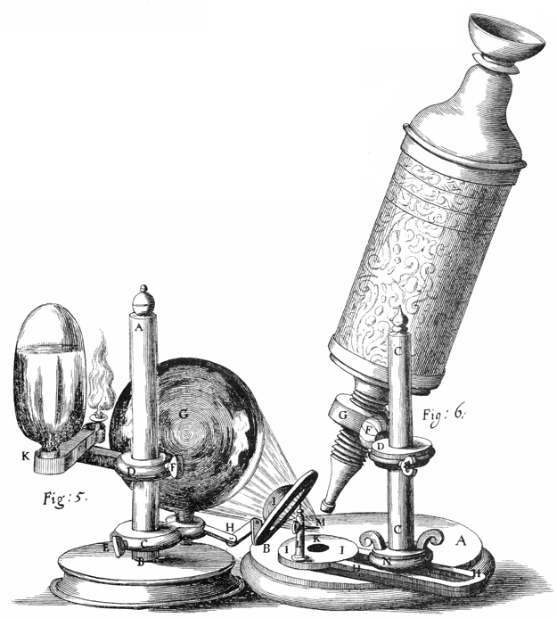

# The Cell

The [cell](https://en.wikipedia.org/wiki/Cell_(biology)) (from Latin cella, meaning "small room") is the basic structural, functional, and biological unit of all known organisms. A cell is the smallest unit of life. Cells are often called the "building blocks of life". The study of cells is called cell biology, cellular biology, or cytology.

Cells consist of cytoplasm enclosed within a membrane, which contains many biomolecules such as proteins and nucleic acids. Most plant and animal cells are only visible under a microscope, with dimensions between 1 and 100 micrometres. Organisms can be classified as unicellular (consisting of a single cell such as bacteria) or multicellular (including plants and animals). Most unicellular organisms are classed as microorganisms.

The number of cell in plants and animals varies from species to species; it has been estimated that humans contain somewhere around 40 trillion (4×10^13^) cells. The human brain accounts for around 80 billion of these cells.

In biology, cell theory is the historic scientific theory, now universally accepted, that living organisms are made up of cells, that they are the basic structural/organizational unit of all organisms, and that all cells come from pre-existing cells. Cells are the basic unit of structure in all organisms and also the basic unit of reproduction.

Credit for developing cell theory is usually given to two scientists: Theodor Schwann and Matthias Jakob Schleiden. While Rudolf Virchow contributed to the theory, he is not as credited for his attributions toward it. In 1839, Schleiden suggested that every structural part of a plant was made up of cells or the result of cells. He also suggested that cells were made by a crystallization process either within other cells or from the outside. However, this was not an original idea of Schleiden. He claimed this theory as his own, though Barthelemy Dumortier had stated it years before him. This crystallization process is no longer accepted with modern cell theory. In 1839, Theodor Schwann states that along with plants, animals are composed of cells or the product of cells in their structures. This was a major advancement in the field of biology since little was known about animal structure up to this point compared to plants. From these conclusions about plants and animals, two of the three tenets of cell theory were postulated.

1. All living organisms are composed of one or more cells
2. The cell is the most basic unit of life

Schleiden's theory of free cell formation through crystallization was refuted in the 1850s by Robert Remak, Rudolf Virchow, and Albert Kolliker. In 1855, Rudolf Virchow added the third tenet to cell theory. In Latin, this tenet states Omnis cellula e cellula. This translated to:

3. All cells arise only from pre-existing cells

However, the idea that all cells come from pre-existing cells had in fact already been proposed by Robert Remak; it has been suggested that Virchow plagiarized Remak and did not give him credit. Remak published observations in 1852 on cell division, claiming Schleiden and Schawnn were incorrect about generation schemes. He instead said that binary fission, which was first introduced by Dumortier, was how reproduction of new animal cells were made. Once this tenet was added, the classical cell theory was complete.

The generally accepted parts of modern cell theory include:

1. All living cells arise from pre-existing cells by division.
1. The cell is the fundamental unit of structure and function in all living organisms.
1. The activity of an organism depends on the total activity of independent cells.[citation needed]
1. Energy flow (metabolism and biochemistry) occurs within cells.
1. Cells contain DNA which is found specifically in the chromosome and RNA found in the cell nucleus and cytoplasm.
1. All cells are basically the same in chemical composition in organisms of similar species.

The discovery of the cell was made possible through the invention of the microscope. In the first century BC, Romans were able to make glass, discovering that objects appeared to be larger under the glass. In Italy during the 12th century, Salvino D’Armate made a piece of glass fit over one eye, allowing for a magnification effect to that eye. The expanded use of lenses in eyeglasses in the 13th century probably led to wider spread use of simple microscopes (magnifying glasses) with limited magnification. Compound microscopes, which combine an objective lens with an eyepiece to view a real image achieving much higher magnification, first appeared in Europe around 1620. In 1665, [Robert Hooke](https://en.wikipedia.org/wiki/Robert_Hooke) used a microscope about six inches long with two convex lenses inside and examined specimens under reflected light for the observations in his book [Micrographia](https://en.wikipedia.org/wiki/Micrographia). Hooke also used a simpler microscope with a single lens for examining specimens with directly transmitted light, because this allowed for a clearer image.

(ref:micrographia) [Title page](https://commons.wikimedia.org/wiki/File:Micrographia_title_page.gif) aof "MICROGRAPHIA or some physiological descriptions of minute bodies made by magnifying glasses with observations and inquiries thereupon".

(\#fig:hookemicrographia)(ref:micrographia)

(ref:microscope) [Hooke's microscope, from an engraving in Micrographia](https://commons.wikimedia.org/wiki/File:Hooke-microscope.png)

(\#fig:hookescope)(ref:microscope)

(ref:cork) Hooke was the first to apply the word "cell"to biological objects. [Cell structure of cork by Hooke](https://commons.wikimedia.org/wiki/File:RobertHookeMicrographia1665.jpg). 

(\#fig:hookecork)(ref:cork)

Extensive microscopic study was done by Anton van Leeuwenhoek, a draper who took the interest in microscopes after seeing one while on an apprenticeship in Amsterdam in 1648. At some point in his life before 1668, he was able to learn how to grind lenses. This eventually led to Leeuwenhoek making his own unique microscope. His was a single lens simple microscope, rather than a compound microscope. This was because he was able to use a single lens that was a small glass sphere but allowed for a magnification of 270x. This was a large progression since the magnification before was only a maximum of 50x. After Leeuwenhoek, there was not much progress in microscope technology until the 1850s, two hundred years later. Carl Zeiss, a German engineer who manufactured microscopes, began to make changes to the lenses used. But the optical quality did not improve until the 1880s when he hired Otto Schott and eventually Ernst Abbe.

Optical microscopes can focus on objects the size of a wavelength or larger, giving restrictions still to advancement in discoveries with objects smaller than the wavelengths of visible light. The development of the electron microscope in the 1920s made it possible to view objects that are smaller than optical wavelengths, once again opening up new possibilities in science.

The cell was first discovered by Robert Hooke in 1665, which can be found to be described in his book Micrographia. In this book, he gave 60 ‘observations’ in detail of various objects under a coarse, compound microscope. One observation was from very thin slices of bottle cork. Hooke discovered a multitude of tiny pores that he named "cells". This came from the Latin word Cella, meaning ‘a small room’ like monks lived in and also Cellulae, which meant the six sided cell of a honeycomb. However, Hooke did not know their real structure or function. What Hooke had thought were cells, were actually empty cell walls of plant tissues. With microscopes during this time having a low magnification, Hooke was unable to see that there were other internal components to the cells he was observing. Therefore, he did not think the "cellulae" were alive. His cell observations gave no indication of the nucleus and other organelles found in most living cells. In Micrographia, Hooke also observed mould, bluish in color, found on leather. After studying it under his microscope, he was unable to observe “seeds” that would have indicated how the mould was multiplying in quantity. This led to Hooke suggesting that spontaneous generation, from either natural or artificial heat, was the cause. Since this was an old Aristotelian theory still accepted at the time, others did not reject it and was not disproved until Leeuwenhoek later discovered that generation was achieved otherwise.

[Anton van Leeuwenhoek](https://en.wikipedia.org/wiki/Antonie_van_Leeuwenhoek) is another scientist who saw these cells soon after Hooke did. He made use of a microscope containing improved lenses that could magnify objects almost 300-fold, or 270x. Under these microscopes, Leeuwenhoek found motile objects. In a letter to The Royal Society on October 9, 1676, he states that motility is a quality of life therefore these were living organisms. Over time, he wrote many more papers in which described many specific forms of microorganisms. Leeuwenhoek named these “animalcules,” which included protozoa and other unicellular organisms, like bacteria. Though he did not have much formal education, he was able to identify the first accurate description of red blood cells and discovered bacteria after gaining interest in the sense of taste that resulted in Leeuwenhoek to observe the tongue of an ox, then leading him to study "pepper water" in 1676. He also found for the first time the sperm cells of animals and humans. Once discovering these types of cells, Leeuwenhoek saw that the fertilization process requires the sperm cell to enter the egg cell. This put an end to the previous theory of spontaneous generation. After reading letters by Leeuwenhoek, Hooke was the first to confirm his observations that were thought to be unlikely by other contemporaries.

The cells in animal tissues were observed after plants were because the tissues were so fragile and susceptible to tearing, it was difficult for such thin slices to be prepared for studying. Biologists believed that there was a fundamental unit to life, but were unsure what this was. It would not be until over a hundred years later that this fundamental unit was connected to cellular structure and existence of cells in animals or plants. This conclusion was not made until Henri Dutrochet. Besides stating “the cell is the fundamental element of organization”, Dutrochet also claimed that cells were not just a structural unit, but also a physiological unit.

In 1804, Karl Rudolphi and J.H.F. Link were awarded the prize for "solving the problem of the nature of cells", meaning they were the first to prove that cells had independent cell walls by the Königliche Societät der Wissenschaft (Royal Society of Science), Göttingen. Before, it had been thought that cells shared walls and the fluid passed between them this way.

Cells can be subdivided into the following subcategories:

1. Prokaryotes: Prokaryotes are relatively small cells surrounded by the plasma membrane, with a characteristic cell wall that may differ in composition depending on the particular organism. Prokaryotes lack a nucleus (although they do have circular or linear DNA) and other membrane-bound organelles (though they do contain ribosomes). The protoplasm of a prokaryote contains the chromosomal region that appears as fibrous deposits under the microscope, and the cytoplasm. Bacteria and Archaea are the two domains of prokaryotes.
1. Eukaryotes: Eukaryotic cells are also surrounded by the plasma membrane, but on the other hand, they have distinct nuclei bound by a nuclear membrane or envelope. Eukaryotic cells also contain membrane-bound organelles, such as (mitochondria, chloroplasts, lysosomes, rough and smooth endoplasmic reticulum, vacuoles). In addition, they possess organized chromosomes which store genetic material.
Animals have evolved a greater diversity of cell types in a multicellular body (100–150 different cell types), compared with 10–20 in plants, fungi, and protoctista.

The distinction between prokaryotes and eukaryotes was firmly established by the microbiologists Roger Stanier and C. B. van Niel in their 1962 paper The concept of a bacterium (though spelled procaryote and eucaryote there). That paper cites Édouard Chatton's 1937 book Titres et Travaux Scientifiques for using those terms and recognizing the distinction. One reason for this classification was so that what was then often called blue-green algae (now called cyanobacteria) would not be classified as plants but grouped with bacteria.

## Prokaryotic Cells

A prokaryote is a cellular organism that lacks an envelope-enclosed nucleus. The word prokaryote comes from the Greek πρό (pro, 'before') and κάρυον (karyon, 'nut' or 'kernel'). In the two-empire system arising from the work of Édouard Chatton, prokaryotes were classified within the empire Prokaryota. But in the three-domain system, based upon molecular analysis, prokaryotes are divided into two domains: Bacteria (formerly Eubacteria) and Archaea (formerly Archaebacteria). Organisms with nuclei are placed in a third domain, Eukaryota. In the study of the origins of life, prokaryotes are thought to have arisen before eukaryotes.

Prokaryotes lack mitochondria, or any other eukaryotic membrane-bound organelles; and it was once thought that prokayotes lacked cellular compartments, and therefore all cellular components within the cytoplasm were unenclosed, except for an outer cell membrane. But bacterial microcompartments, which are thought to be primitive organelles enclosed in protein shells, have been discovered; and there is also evidence of prokayotic membrane-bound organelles. While typically being unicellular, some prokaryotes, such as cyanobacteria, may form large colonies. Others, such as myxobacteria, have multicellular stages in their life cycles. Prokaryotes are asexual, reproducing without fusion of gametes, although horizontal gene transfer also takes place.

(ref:prokcell)[Structure of a typical prokaryotic cell](https://commons.wikimedia.org/wiki/File:Prokaryote_cell.svg) 

(\#fig:typicalprokcell)(ref:)

Molecular studies have provided insight into the evolution and interrelationships of the three domains of life. The division between prokaryotes and eukaryotes reflects the existence of two very different levels of cellular organization; only eukaryotic cells have a enveloped nucleus that contains its chromosomal DNA, and other characteristic membrane-bound organelles including mitochondria. Distinctive types of prokaryotes include extremophiles and methanogens; these are common in some extreme environments.

Prokaryotes include bacteria and archaea, two of the three domains of life. Prokaryotic cells were the first form of life on Earth, characterized by having vital biological processes including cell signaling. They are simpler and smaller than eukaryotic cells, and lack a nucleus, and other membrane-bound organelles. The DNA of a prokaryotic cell consists of a single circular chromosome that is in direct contact with the cytoplasm. The nuclear region in the cytoplas is called the nucleoid. Most prokaryotes are the smallest of all organisms ranging from 0.5 to 2.0 µm in diameter.

A prokaryotic cell has three regions:

* Enclosing the cell is the cell envelope – generally consisting of a plasma membrane covered by a cell wall which, for some bacteria, may be further covered by a third layer called a capsule. Though most prokaryotes have both a cell membrane and a cell wall, there are exceptions such as Mycoplasma (bacteria) and Thermoplasma (archaea) which only possess the cell membrane layer. The envelope gives rigidity to the cell and separates the interior of the cell from its environment, serving as a protective filter. The cell wall consists of peptidoglycan in bacteria, and acts as an additional barrier against exterior forces. It also prevents the cell from expanding and bursting (cytolysis) from osmotic pressure due to a hypotonic environment. Some eukaryotic cells (plant cells and fungal cells) also have a cell wall.
* Inside the cell is the cytoplasmic region that contains the genome (DNA), ribosomes and various sorts of inclusions. The genetic material is freely found in the cytoplasm. Prokaryotes can carry extrachromosomal DNA elements called plasmids, which are usually circular. Linear bacterial plasmids have been identified in several species of spirochete bacteria, including members of the genus Borrelia notably Borrelia burgdorferi, which causes Lyme disease. Though not forming a nucleus, the DNA is condensed in a nucleoid. Plasmids encode additional genes, such as antibiotic resistance genes.
* On the outside, flagella and pili project from the cell's surface. These are structures (not present in all prokaryotes) made of proteins that facilitate movement and communication between cells.

## Eukaryotic Cells

[Eukaryotes](https://en.wikipedia.org/wiki/Eukaryote) are organisms whose cells have a nucleus enclosed within a nuclear envelope. Eukaryotes belong to the domain Eukaryota or Eukarya; their name comes from the Greek εὖ (eu, "well" or "good") and κάρυον (karyon, "nut" or "kernel"). The domain Eukaryota makes up one of the domains of life in the three-domain system; the two other domains are Bacteria and Archaea (together known as prokaryotes). Eukaryotes represent a tiny minority of the number of living organisms; however, due to their generally much larger size, their collective worldwide biomass is estimated to be about equal to that of prokaryotes. Eukaryotes evolved approximately 1.6–2.1 billion years ago, during the Proterozoic eon.

Eukaryotic cells typically contain membrane-bound organelles such as mitochondria and Golgi apparatus, and chloroplasts can be found in plants and algae; these organelles are unique to eukaryotes, although primitive organelles can be found in prokaryotes. As well as being unicellular, eukaryotes may also be multicellular and include many cell types forming different kinds of tissue; in comparison, prokaryotes are typically unicellular. Animals, plants, and fungi are the most familiar eukaryotes; other eukaryotes are sometimes called protists.

(ref:animalcell)[Cartoon of the structure of a typical animal cell](https://commons.wikimedia.org/wiki/File:Animal_cell_structure_en.svg) 

(\#fig:typicalanimalcell)(ref:animalcell)

(ref:plantcell) [Cartoon of the structure of a typical plant cell](https://commons.wikimedia.org/wiki/File:Plant_cell_structure_en.svg) 

(\#fig:itypicalplantcell)(ref:plantcell)

Eukaryotes can reproduce both asexually through mitosis and sexually through meiosis and gamete fusion. In mitosis, one cell divides to produce two genetically identical cells. In meiosis, DNA replication is followed by two rounds of cell division to produce four haploid daughter cells. These act as sex cells (gametes). Each gamete has just one set of chromosomes, each a unique mix of the corresponding pair of parental chromosomes resulting from genetic recombination during meiosis.

Plants, animals, fungi, and protists are all eukaryotic. These cells are about fifteen times wider than a typical prokaryote and can be as much as a thousand times greater in volume. The main distinguishing feature of eukaryotes as compared to prokaryotes is compartmentalization: the presence of membrane-bound organelles (compartments) in which specific activities take place. Most important among these is a cell nucleus, an organelle that houses the cell's DNA. This nucleus gives the eukaryote its name, which means "true kernel (nucleus)". Other differences include:

* The eukaryotic DNA is organized in one or more linear molecules, called chromosomes, which are associated with histone proteins. All chromosomal DNA is stored in the cell nucleus, separated from the cytoplasm by a membrane. Some eukaryotic organelles such as mitochondria also contain some DNA.
* Many eukaryotic cells are ciliated with primary cilia. Primary cilia play important roles in chemosensation, mechanosensation, and thermosensation. Each cilium may thus be "viewed as a sensory cellular antennae that coordinates a large number of cellular signaling pathways, sometimes coupling the signaling to ciliary motility or alternatively to cell division and differentiation."
* Motile eukaryotes can move using motile cilia or flagella. Motile cells are absent in conifers and flowering plants. Eukaryotic flagella are more complex than those of prokaryotes.

<table class="table" style="margin-left: auto; margin-right: auto;">
 <thead>
  <tr>
   <th style="text-align:left;">  </th>
   <th style="text-align:left;"> Prokaryotes </th>
   <th style="text-align:left;"> Eukaryotes </th>
  </tr>
 </thead>
<tbody>
  <tr>
   <td style="text-align:left;"> Typical organisms </td>
   <td style="text-align:left;"> bacteria, archaea </td>
   <td style="text-align:left;"> protists; fungi; plants; animals </td>
  </tr>
  <tr>
   <td style="text-align:left;"> Typical size </td>
   <td style="text-align:left;"> ~1–5 µm </td>
   <td style="text-align:left;"> ~10–100 µm </td>
  </tr>
  <tr>
   <td style="text-align:left;"> Type of nucleus </td>
   <td style="text-align:left;"> nucleoid region; no true nucleus </td>
   <td style="text-align:left;"> true nucleus with double membrane </td>
  </tr>
  <tr>
   <td style="text-align:left;"> DNA </td>
   <td style="text-align:left;"> circular (usually) </td>
   <td style="text-align:left;"> linear molecules (chromosomes) with histone proteins </td>
  </tr>
  <tr>
   <td style="text-align:left;"> RNA/protein synthesis </td>
   <td style="text-align:left;"> coupled in the cytoplasm </td>
   <td style="text-align:left;"> RNA synthesis in the nucleus; protein synthesis in the cytoplasm </td>
  </tr>
  <tr>
   <td style="text-align:left;"> Ribosomes </td>
   <td style="text-align:left;"> 50S and 30S </td>
   <td style="text-align:left;"> 60S and 40S </td>
  </tr>
  <tr>
   <td style="text-align:left;"> Cytoplasmic structure </td>
   <td style="text-align:left;"> very few structures </td>
   <td style="text-align:left;"> highly structured by endomembranes and a cytoskeleton </td>
  </tr>
  <tr>
   <td style="text-align:left;"> Cell movement </td>
   <td style="text-align:left;"> flagella made of flagellin </td>
   <td style="text-align:left;"> flagella and cilia containing microtubules; lamellipodia and filopodia containing actin </td>
  </tr>
  <tr>
   <td style="text-align:left;"> Mitochondria </td>
   <td style="text-align:left;"> none </td>
   <td style="text-align:left;"> one to several thousand </td>
  </tr>
  <tr>
   <td style="text-align:left;"> Chloroplasts </td>
   <td style="text-align:left;"> none </td>
   <td style="text-align:left;"> in algae and plants </td>
  </tr>
  <tr>
   <td style="text-align:left;"> Organization </td>
   <td style="text-align:left;"> usually single cells </td>
   <td style="text-align:left;"> single cells, colonies, higher multicellular organisms with specialized cells </td>
  </tr>
  <tr>
   <td style="text-align:left;"> Cell division </td>
   <td style="text-align:left;"> binary fission (simple division) </td>
   <td style="text-align:left;"> mitosis (fission or budding);  meiosis </td>
  </tr>
  <tr>
   <td style="text-align:left;"> Chromosomes </td>
   <td style="text-align:left;"> single chromosome </td>
   <td style="text-align:left;"> more than one chromosome </td>
  </tr>
  <tr>
   <td style="text-align:left;"> Membranes </td>
   <td style="text-align:left;"> cell membrane </td>
   <td style="text-align:left;"> Cell membrane and membrane-bound organelles </td>
  </tr>
</tbody>
</table>

## Subcellular Components

All cells, whether prokaryotic or eukaryotic, have a membrane that envelops the cell, regulates what moves in and out (selectively permeable), and maintains the electric potential of the cell. Inside the membrane, the cytoplasm takes up most of the cell's volume. All cells (except red blood cells which lack a cell nucleus and most organelles to accommodate maximum space for hemoglobin) possess DNA, the hereditary material of genes, and RNA, containing the information necessary to build various proteins such as enzymes, the cell's primary machinery. There are also other kinds of biomolecules in cells. This article lists these primary cellular components, then briefly describes their function.

### The Cell Membrane

The cell membrane, or plasma membrane, is a biological membrane that surrounds the cytoplasm of a cell. In animals, the plasma membrane is the outer boundary of the cell, while in plants and prokaryotes it is usually covered by a cell wall. This membrane serves to separate and protect a cell from its surrounding environment and is made mostly from a double layer of phospholipids, which are amphiphilic (partly hydrophobic and partly hydrophilic). Hence, the layer is called a phospholipid bilayer, or sometimes a fluid mosaic membrane. Embedded within this membrane is a macromolecular structure called the porosome the universal secretory portal in cells and a variety of protein molecules that act as channels andpumps that move different molecules into and out of the cell. The membrane is semi-permeable, and selectively permeable, in that it can either let a substance (molecule or ion) pass through freely, pass through to a limited extent or not pass through at all. Cell surface membranes also contain receptor proteins that allow cells to detect external signaling molecules such as hormones.

(ref:membrane) [Detailed diagram of lipid bilayer cell membrane](https://commons.wikimedia.org/wiki/File:Cell_membrane_detailed_diagram_en.svg)

(\#fig:cellmembrane)(ref:membrane)

### The Cytoskeleton

The cytoskeleton acts to organize and maintain the cell's shape; anchors organelles in place; helps during endocytosis, the uptake of external materials by a cell, and cytokinesis, the separation of daughter cells after cell division; and moves parts of the cell in processes of growth and mobility. The eukaryotic cytoskeleton is composed of microfilaments, intermediate filaments and microtubules. There are a great number of proteins associated with them, each controlling a cell's structure by directing, bundling, and aligning filaments. The prokaryotic cytoskeleton is less well-studied but is involved in the maintenance of cell shape, polarity and cytokinesis. The subunit protein of microfilaments is a small, monomeric protein called actin. The subunit of microtubules is a dimeric molecule called tubulin. Intermediate filaments are heteropolymers whose subunits vary among the cell types in different tissues. 

### The Genetic Material

Two different kinds of genetic material exist: deoxyribonucleic acid (DNA) and ribonucleic acid (RNA). Cells use DNA for their long-term information storage. The biological information contained in an organism is encoded in its DNA sequence. RNA is used for information transport (e.g., mRNA) and enzymatic functions (e.g., ribosomal RNA). Transfer RNA (tRNA) molecules are used to add amino acids during protein translation.

Prokaryotic genetic material is organized in a simple circular bacterial chromosome in the nucleoid region of the cytoplasm. Eukaryotic genetic material is divided into different, linear molecules called chromosomes inside a discrete nucleus, usually with additional genetic material in some organelles like mitochondria and chloroplasts (see endosymbiotic theory).

A human cell has genetic material contained in the cell nucleus (the nuclear genome) and in the mitochondria (the mitochondrial genome). In humans the nuclear genome is divided into 46 linear DNA molecules called chromosomes, including 22 homologous chromosome pairs and a pair of sex chromosomes. The mitochondrial genome is a circular DNA molecule distinct from the nuclear DNA. Although the mitochondrial DNA is very small compared to nuclear chromosomes, it codes for 13 proteins involved in mitochondrial energy production and specific tRNAs.

Foreign genetic material (most commonly DNA) can also be artificially introduced into the cell by a process called transfection. This can be transient, if the DNA is not inserted into the cell's genome, or stable, if it is. Certain viruses also insert their genetic material into the genome.

### Organelles of Eukaryotic Cells

Organelles are parts of the cell which are adapted and/or specialized for carrying out one or more vital functions, analogous to the organs of the human body (such as the heart, lung, and kidney, with each organ performing a different function). Both eukaryotic and prokaryotic cells have organelles, but prokaryotic organelles are generally simpler and are not membrane-bound.

There are several types of organelles in a cell. Some (such as the nucleus and golgi apparatus) are typically solitary, while others (such as mitochondria, chloroplasts, peroxisomes and lysosomes) can be numerous (hundreds to thousands). The cytosol is the gelatinous fluid that fills the cell and surrounds the organelles.

* Cell nucleus: A cell's information center, the cell nucleus is the most conspicuous organelle found in a eukaryotic cell. It houses the cell's chromosomes, and is the place where almost all DNA replication and RNA synthesis (transcription) occur. The nucleus is spherical and separated from the cytoplasm by a double membrane called the nuclear envelope. The nuclear envelope isolates and protects a cell's DNA from various molecules that could accidentally damage its structure or interfere with its processing. During processing, DNA is transcribed, or copied into a special RNA, called messenger RNA (mRNA). This mRNA is then transported out of the nucleus, where it is translated into a specific protein molecule. The nucleolus is a specialized region within the nucleus where ribosome subunits are assembled. In prokaryotes, DNA processing takes place in the cytoplasm.
* Mitochondria and Chloroplasts: generate energy for the cell.Mitochondria are self-replicating organelles that occur in various numbers, shapes, and sizes in the cytoplasm of all eukaryotic cells. Respiration occurs in the cell mitochondria, which generate the cell's energy by oxidative phosphorylation, using oxygen to release energy stored in cellular nutrients (typically pertaining to glucose) to generate ATP. Mitochondria multiply by binary fission, like prokaryotes. Chloroplasts can only be found in plants and algae, and they capture the sun's energy to make carbohydrates through photosynthesis.
* Endoplasmic reticulum: The endoplasmic reticulum (ER) is a transport network for molecules targeted for certain modifications and specific destinations, as compared to molecules that float freely in the cytoplasm. The ER has two forms: the rough ER, which has ribosomes on its surface that secrete proteins into the ER, and the smooth ER, which lacks ribosomes. The smooth ER plays a role in calcium sequestration and release.
* Golgi apparatus: The primary function of the Golgi apparatus is to process and package the macromolecules such as proteins and lipids that are synthesized by the cell.
* Lysosomes and Peroxisomes: Lysosomes contain digestive enzymes (acid hydrolases). They digest excess or worn-out organelles, food particles, and engulfed viruses or bacteria. Peroxisomes have enzymes that rid the cell of toxic peroxides. The cell could not house these destructive enzymes if they were not contained in a membrane-bound system.
* Centrosome: the cytoskeleton organiser: The centrosome produces the microtubules of a cell – a key component of the cytoskeleton. It directs the transport through the ER and the Golgi apparatus. Centrosomes are composed of two centrioles, which separate during cell division and help in the formation of the mitotic spindle. A single centrosome is present in the animal cells. They are also found in some fungi and algae cells.
* Vacuoles: Vacuoles sequester waste products and in plant cells store water. They are often described as liquid filled space and are surrounded by a membrane. Some cells, most notably Amoeba, have contractile vacuoles, which can pump water out of the cell if there is too much water. The vacuoles of plant cells and fungal cells are usually larger than those of animal cells.

## The Cell Nucleus

In cell biology, the nucleus (pl. nuclei; from Latin nucleus or nuculeus, meaning kernel or seed) is a membrane-bound organelle found in eukaryotic cells. Eukaryotes usually have a single nucleus, but a few cell types, such as mammalian red blood cells, have no nuclei, and a few others including osteoclasts have many. Inside its fully enclosed nuclear membrane, it contains the majority of the cell's genetic material. This material is organized as DNA molecules, along with a variety of proteins, to form chromosomes.

The cell nucleus contains all of the cell's genome, except for a small fraction of mitochondrial DNA, organized as multiple long linear DNA molecules in a complex with a large variety of proteins, such as histones, to form chromosomes. The genes within these chromosomes are structured in such a way to promote cell function. The nucleus maintains the integrity of genes and controls the activities of the cell by regulating gene expression—the nucleus is, therefore, the control center of the cell. The main structures making up the nucleus are the nuclear envelope, a double membrane that encloses the entire organelle and isolates its contents from the cellular cytoplasm, and the nuclear matrix (which includes the nuclear lamina), a network within the nucleus that adds mechanical support, much like the cytoskeleton, which supports the cell as a whole.

Because the nuclear envelope is impermeable to large molecules, nuclear pores are required to regulate nuclear transport of molecules across the envelope. The pores cross both nuclear membranes, providing a channel through which larger molecules must be actively transported by carrier proteins while allowing free movement of small molecules and ions. Movement of large molecules such as proteins and RNA through the pores is required for both gene expression and the maintenance of chromosomes. Although the interior of the nucleus does not contain any membrane-bound subcompartments, its contents are not uniform, and a number of nuclear bodies exist, made up of unique proteins, RNA molecules, and particular parts of the chromosomes. The best-known of these is the nucleolus, which is mainly involved in the assembly of ribosomes. After being produced in the nucleolus, ribosomes are exported to the cytoplasm where they translate mRNA.

The nuclear envelope, otherwise known as nuclear membrane, consists of two cellular membranes, an inner and an outer membrane, arranged parallel to one another and separated by 10 to 50 nanometres (nm). The nuclear envelope completely encloses the nucleus and separates the cell's genetic material from the surrounding cytoplasm, serving as a barrier to prevent macromolecules from diffusing freely between the nucleoplasm and the cytoplasm. The outer nuclear membrane is continuous with the membrane of the rough endoplasmic reticulum (RER), and is similarly studded with ribosomes. The space between the membranes is called the perinuclear space and is continuous with the RER lumen.

Nuclear pores, which provide aqueous channels through the envelope, are composed of multiple proteins, collectively referred to as nucleoporins. The pores are about 125 million daltons in molecular weight and consist of around 50 (in yeast) to several hundred proteins (in vertebrates). The pores are 100 nm in total diameter; however, the gap through which molecules freely diffuse is only about 9 nm wide, due to the presence of regulatory systems within the center of the pore. This size selectively allows the passage of small water-soluble molecules while preventing larger molecules, such as nucleic acids and larger proteins, from inappropriately entering or exiting the nucleus. These large molecules must be actively transported into the nucleus instead. The nucleus of a typical mammalian cell will have about 3000 to 4000 pores throughout its envelope, each of which contains an eightfold-symmetric ring-shaped structure at a position where the inner and outer membranes fuse. Attached to the ring is a structure called the nuclear basket that extends into the nucleoplasm, and a series of filamentous extensions that reach into the cytoplasm. Both structures serve to mediate binding to nuclear transport proteins.

Most proteins, ribosomal subunits, and some DNAs are transported through the pore complexes in a process mediated by a family of transport factors known as karyopherins. Those karyopherins that mediate movement into the nucleus are also called importins, whereas those that mediate movement out of the nucleus are called exportins. Most karyopherins interact directly with their cargo, although some use adaptor proteins. Steroid hormones such as cortisol and aldosterone, as well as other small lipid-soluble molecules involved in intercellular signaling, can diffuse through the cell membrane and into the cytoplasm, where they bind nuclear receptor proteins that are trafficked into the nucleus. There they serve as transcription factors when bound to their ligand; in the absence of a ligand, many such receptors function as histone deacetylases that repress gene expression

The cell nucleus contains the majority of the cell's genetic material in the form of multiple linear DNA molecules organized into structures called chromosomes. Each human cell contains roughly two meters of DNA. During most of the cell cycle these are organized in a DNA-protein complex known as chromatin, and during cell division the chromatin can be seen to form the well-defined chromosomes familiar from a karyotype. A small fraction of the cell's genes are located instead in the mitochondria.

There are two types of chromatin. Euchromatin is the less compact DNA form, and contains genes that are frequently expressed by the cell. The other type, heterochromatin, is the more compact form, and contains DNA that is infrequently transcribed. This structure is further categorized into facultative heterochromatin, consisting of genes that are organized as heterochromatin only in certain cell types or at certain stages of development, and constitutive heterochromatin that consists of chromosome structural components such as telomeres and centromeres. During interphase the chromatin organizes itself into discrete individual patches, called chromosome territories. Active genes, which are generally found in the euchromatic region of the chromosome, tend to be located towards the chromosome's territory boundary.

The nucleolus is the largest of the discrete densely stained, membraneless structures known as nuclear bodies found in the nucleus. It forms around tandem repeats of rDNA, DNA coding for ribosomal RNA (rRNA). These regions are called nucleolar organizer regions (NOR). The main roles of the nucleolus are to synthesize rRNA and assemble ribosomes. The structural cohesion of the nucleolus depends on its activity, as ribosomal assembly in the nucleolus results in the transient association of nucleolar components, facilitating further ribosomal assembly, and hence further association. This model is supported by observations that inactivation of rDNA results in intermingling of nucleolar structures.

In the first step of ribosome assembly, a protein called RNA polymerase I transcribes rDNA, which forms a large pre-rRNA precursor. This is cleaved into the subunits 5.8S, 18S, and 28S rRNA. The transcription, post-transcriptional processing, and assembly of rRNA occurs in the nucleolus, aided by small nucleolar RNA (snoRNA) molecules, some of which are derived from spliced introns from messenger RNAs encoding genes related to ribosomal function. The assembled ribosomal subunits are the largest structures passed through the nuclear pores.

When observed under the electron microscope, the nucleolus can be seen to consist of three distinguishable regions: the innermost fibrillar centers (FCs), surrounded by the dense fibrillar component (DFC) (that contains fibrillarin and nucleolin), which in turn is bordered by the granular component (GC) (that contains the protein nucleophosmin). Transcription of the rDNA occurs either in the FC or at the FC-DFC boundary, and, therefore, when rDNA transcription in the cell is increased, more FCs are detected. Most of the cleavage and modification of rRNAs occurs in the DFC, while the latter steps involving protein assembly onto the ribosomal subunits occur in the GC.

## The Mitochondria

The [mitochondrion](https://en.wikipedia.org/wiki/Mitochondrion) (plural mitochondria) is a semi autonomous double-membrane-bound organelle found in most eukaryotic organisms. Some cells in some multicellular organisms may, however, lack mitochondria (for example, mature mammalian red blood cells). 

The word mitochondrion comes from the Greek μίτος, mitos, "thread", and χονδρίον, chondrion, "granule" or "grain-like". Mitochondria generate most of the cell's supply of adenosine triphosphate (ATP), used as a source of chemical energy. A mitochondrion is thus termed the powerhouse of the cell.

In addition to supplying cellular energy, mitochondria are involved in other tasks, such as signaling, cellular differentiation, and cell death, as well as maintaining control of the cell cycle and cell growth.  

The organelle is composed of compartments that carry out specialized functions. These compartments or regions include the outer membrane, the intermembrane space, the inner membrane, and the cristae and matrix.

Although most of a cell's DNA is contained in the cell nucleus, the mitochondrion has its own independent genome ("mitogenome") that shows substantial similarity to bacterial genomes. Mitochondrial proteins (proteins transcribed from mitochondrial DNA) vary depending on the tissue and the species. 

The endosymbiotic hypothesis suggests that mitochondria were originally prokaryotic cells, capable of implementing oxidative mechanisms that were not possible for eukaryotic cells; they became endosymbionts living inside the eukaryote. The endosymbiotic hypothesis suggests that mitochondria descended from bacteria that somehow survived endocytosis by another cell, and became incorporated into the cytoplasm. The ability of these bacteria to conduct respiration in host cells that had relied on glycolysis and fermentation would have provided a considerable evolutionary advantage. This symbiotic relationship probably developed 1.7 to 2 billion years ago.

A mitochondrion contains outer and inner membranes composed of phospholipid bilayers and proteins. The two membranes have different properties. Because of this double-membraned organization, there are five distinct parts to a mitochondrion. They are:

* the outer mitochondrial membrane,
* the intermembrane space (the space between the outer and inner membranes),
* the inner mitochondrial membrane,
* the cristae space (formed by infoldings of the inner membrane), and
* the matrix (space within the inner membrane).

The inner mitochondrial membrane contains proteins with three types of functions:

1. Those that perform the electron transport chain redox reactions
1. ATP synthase, which generates ATP in the matrix
1. Specific transport proteins that regulate metabolite passage into and out of the mitochondrial matrix

The most prominent roles of mitochondria are to produce the energy currency of the cell, ATP (i.e., phosphorylation of ADP), through respiration, and to regulate cellular metabolism. The central set of reactions involved in ATP production are collectively known as the citric acid cycle, or the Krebs cycle. However, the mitochondrion has many other functions in addition to the production of ATP.

(ref:fluocell) [A fluorescent image of an endothelial cell. Nuclei are stained blue, mitochondria are stained red, and microfilaments are stained green.](https://commons.wikimedia.org/wiki/File:DAPIMitoTrackerRedAlexaFluor488BPAE.jpg)

(\#fig:dapimitotracker)(ref:fluocell)

## The Chloroplasts

[Chloroplasts](https://en.wikipedia.org/wiki/Chloroplast) are organelles that conduct photosynthesis, where the photosynthetic pigment chlorophyll captures the energy from sunlight, converts it, and stores it in the energy-storage molecules ATP and NADPH while freeing oxygen from water in plant and algal cells. They then use the ATP and NADPH to make organic molecules from carbon dioxide in a process known as the Calvin cycle. Chloroplasts carry out a number of other functions, including fatty acid synthesis, much amino acid synthesis, and the immune response in plants. The number of chloroplasts per cell varies from one, in unicellular algae, up to 100 in plants like Arabidopsis and wheat.

A chloroplast is a type of organelle known as a plastid, characterized by its two membranes and a high concentration of chlorophyll. Other plastid types, such as the leucoplast and the chromoplast, contain little chlorophyll and do not carry out photosynthesis.

Chloroplasts are highly dynamic—they circulate and are moved around within plant cells, and occasionally pinch in two to reproduce. Their behavior is strongly influenced by environmental factors like light color and intensity. Chloroplasts, like mitochondria, contain their own DNA, which is thought to be inherited from their ancestor—a photosynthetic cyanobacterium that was engulfed by an early eukaryotic cell. Chloroplasts cannot be made by the plant cell and must be inherited by each daughter cell during cell division.

Chloroplasts are considered endosymbiotic Cyanobacteria. Cyanobacteria are sometimes called blue-green algae even though they are prokaryotes. Chloroplasts can probably be traced back to a single endosymbiotic event, when a cyanobacterium was engulfed by the eukaryote. Despite this, chloroplasts can be found in an extremely wide set of organisms, some not even directly related to each other—a consequence of many secondary and even tertiary endosymbiotic events.

The word chloroplast is derived from the Greek words chloros (χλωρός), which means green, and plastes (πλάστης), which means "the one who forms".

In land plants, chloroplasts are generally lens-shaped, 3–10 μm in diameter and 1–3 μm thick. 

All chloroplasts have at least three membrane systems—the outer chloroplast membrane, the inner chloroplast membrane, and the thylakoid system. Inside the outer and inner chloroplast membranes is the chloroplast stroma, a semi-gel-like fluid that makes up much of a chloroplast's volume, and in which the thylakoid system floats.

The chloroplast stroma contains many proteins, though the most common and important is RuBisCO, which is probably also the most abundant protein on the planet. RuBisCO is the enzyme that fixes CO~2~ into sugar molecules. In C3 plants, RuBisCO is abundant in all chloroplasts, though in C4 plants, it is confined to the bundle sheath chloroplasts, where the Calvin cycle is carried out in C4 plants.

Suspended within the chloroplast stroma is the thylakoid system, a highly dynamic collection of membranous sacks called thylakoids where chlorophyll is found and the light reactions of photosynthesis happen. In most vascular plant chloroplasts, the thylakoids are arranged in stacks called grana, though in certain C4 plant chloroplasts and some algal chloroplasts, the thylakoids are free floating.

Thylakoids (sometimes spelled thylakoïds), are small interconnected sacks which contain the membranes that the light reactions of photosynthesis take place on. The word thylakoid comes from the Greek word thylakos which means "sack".

Embedded in the thylakoid membranes are important protein complexes which carry out the light reactions of photosynthesis. Photosystem II and photosystem I contain light-harvesting complexes with chlorophyll and carotenoids that absorb light energy and use it to energize electrons. Molecules in the thylakoid membrane use the energized electrons to pump hydrogen ions into the thylakoid space, decreasing the pH and turning it acidic. ATP synthase is a large protein complex that harnesses the concentration gradient of the hydrogen ions in the thylakoid space to generate ATP energy as the hydrogen ions flow back out into the stroma—much like a dam turbine.

There are two types of thylakoids—granal thylakoids, which are arranged in grana, and stromal thylakoids, which are in contact with the stroma. Granal thylakoids are pancake-shaped circular disks about 300–600 nanometers in diameter. Stromal thylakoids are helicoid sheets that spiral around grana. The flat tops and bottoms of granal thylakoids contain only the relatively flat photosystem II protein complex. This allows them to stack tightly, forming grana with many layers of tightly appressed membrane, called granal membrane, increasing stability and surface area for light capture.

In contrast, photosystem I and ATP synthase are large protein complexes which jut out into the stroma. They can't fit in the appressed granal membranes, and so are found in the stromal thylakoid membrane—the edges of the granal thylakoid disks and the stromal thylakoids. These large protein complexes may act as spacers between the sheets of stromal thylakoids.

The number of thylakoids and the total thylakoid area of a chloroplast is influenced by light exposure. Shaded chloroplasts contain larger and more grana with more thylakoid membrane area than chloroplasts exposed to bright light, which have smaller and fewer grana and less thylakoid area. Thylakoid extent can change within minutes of light exposure or removal.

Inside the photosystems embedded in chloroplast thylakoid membranes are various photosynthetic pigments, which absorb and transfer light energy. The types of pigments found are different in various groups of chloroplasts, and are responsible for a wide variety of chloroplast colorations.

Chlorophyll a is found in all chloroplasts, as well as their cyanobacterial ancestors. Chlorophyll a is a blue-green pigment partially responsible for giving most cyanobacteria and chloroplasts their color. 

Chlorophyll b is an olive green pigment found only in the chloroplasts of plants, green algae, any secondary chloroplasts obtained through the secondary endosymbiosis of a green alga, and a few cyanobacteria. It is the chlorophylls a and b together that make most plant and green algal chloroplasts green.

In addition to chlorophylls, another group of yellow–orange pigments called carotenoids are also found in the photosystems. There are about thirty photosynthetic carotenoids. They help transfer and dissipate excess energy, and their bright colors sometimes override the chlorophyll green, like during the fall, when the leaves of some land plants change color. β-carotene is a bright red-orange carotenoid found in nearly all chloroplasts, like chlorophyll a. Xanthophylls, especially the orange-red zeaxanthin, are also common. Many other forms of carotenoids exist that are only found in certain groups of chloroplasts.

The chloroplasts of plant and algal cells can orient themselves to best suit the available light. In low-light conditions, they will spread out in a sheet—maximizing the surface area to absorb light. Under intense light, they will seek shelter by aligning in vertical columns along the plant cell's cell wall or turning sideways so that light strikes them edge-on. This reduces exposure and protects them from photooxidative damage. This ability to distribute chloroplasts so that they can take shelter behind each other or spread out may be the reason why land plants evolved to have many small chloroplasts instead of a few big ones. Chloroplast movement is considered one of the most closely regulated stimulus-response systems that can be found in plants.

One of the main functions of the chloroplast is its role in photosynthesis, the process by which light is transformed into chemical energy, to subsequently produce food in the form of sugars. Water (H~2~O) and carbon dioxide (CO~2~) are used in photosynthesis, and sugar and oxygen (O2) is made, using light energy. Photosynthesis is divided into two stages—the light reactions, where water is split to produce oxygen, and the dark reactions, or Calvin cycle, which builds sugar molecules from carbon dioxide. The two phases are linked by the energy carriers adenosine triphosphate (ATP) and nicotinamide adenine dinucleotide phosphate (NADP+).

## The Endoplasmic Reticulum

The [endoplasmic reticulum](https://en.wikipedia.org/wiki/Endoplasmic_reticulum) (ER) is a type of organelle made up of two subunits – rough endoplasmic reticulum (RER), and smooth endoplasmic reticulum (SER). The endoplasmic reticulum is found in most eukaryotic cells and forms an interconnected network of flattened, membrane-enclosed sacs known as cisternae (in the RER), and tubular structures in the SER. The membranes of the ER are continuous with the outer nuclear membrane. The endoplasmic reticulum is not found in red blood cells, or spermatozoa.

The two types of ER share many of the same proteins and engage in certain common activities such as the synthesis of certain lipids and cholesterol. Different types of cells contain different ratios of the two types of ER depending on the activities of the cell.

The outer (cytosolic) face of the rough endoplasmic reticulum is studded with ribosomes that are the sites of protein synthesis. The rough endoplasmic reticulum is especially prominent in cells such as hepatocytes. The smooth endoplasmic reticulum lacks ribosomes and functions in lipid synthesis but not metabolism, the production of steroid hormones, and detoxification. The smooth endoplasmic reticulum is especially abundant in mammalian liver and gonad cells.

The general structure of the endoplasmic reticulum is a network of membranes called cisternae. These sac-like structures are held together by the cytoskeleton. The phospholipid membrane encloses the cisternal space (or lumen), which is continuous with the perinuclear space but separate from the cytosol. The functions of the endoplasmic reticulum can be summarized as the synthesis and export of proteins and membrane lipids, but varies between ER and cell type and cell function. The quantity of both rough and smooth endoplasmic reticulum in a cell can slowly interchange from one type to the other, depending on the changing metabolic activities of the cell. Transformation can include embedding of new proteins in membrane as well as structural changes. Changes in protein content may occur without noticeable structural changes.

The surface of the rough endoplasmic reticulum (often abbreviated RER or rough ER; also called granular endoplasmic reticulum) is studded with protein-manufacturing ribosomes giving it a "rough" appearance (hence its name). The binding site of the ribosome on the rough endoplasmic reticulum is the translocon. However, the ribosomes are not a stable part of this organelle's structure as they are constantly being bound and released from the membrane. A ribosome only binds to the RER once a specific protein-nucleic acid complex forms in the cytosol. This special complex forms when a free ribosome begins translating the mRNA of a protein destined for the secretory pathway. The first 5–30 amino acids polymerized encode a signal peptide, a molecular message that is recognized and bound by a signal recognition particle (SRP). Translation pauses and the ribosome complex binds to the RER translocon where translation continues with the nascent (new) protein forming into the RER lumen and/or membrane. The protein is processed in the ER lumen by an enzyme (a signal peptidase), which removes the signal peptide. Ribosomes at this point may be released back into the cytosol; however, non-translating ribosomes are also known to stay associated with translocons.

In most cells the smooth endoplasmic reticulum (abbreviated SER) is scarce. Instead there are areas where the ER is partly smooth and partly rough, this area is called the transitional ER. The transitional ER gets its name because it contains ER exit sites. These are areas where the transport vesicles that contain lipids and proteins made in the ER, detach from the ER and start moving to the Golgi apparatus. Specialized cells can have a lot of smooth endoplasmic reticulum and in these cells the smooth ER has many functions. It synthesizes lipids, phospholipids, and steroids. Cells which secrete these products, such as those in the testes, ovaries, and sebaceous glands have an abundance of smooth endoplasmic reticulum. It also carries out the metabolism of carbohydrates, detoxification of natural metabolism products and of alcohol and drugs, attachment of receptors on cell membrane proteins, and steroid metabolism. In muscle cells, it regulates calcium ion concentration. 

## The Golgi Apparatus

The [Golgi apparatus](https://en.wikipedia.org/wiki/Golgi_apparatus), also known as the Golgi complex, Golgi body, or simply the Golgi, is an organelle found in most eukaryotic cells. Part of the endomembrane system in the cytoplasm, it packages proteins into membrane-bound vesicles inside the cell before the vesicles are sent to their destination. It resides at the intersection of the secretory, lysosomal, and endocytic pathways. It is of particular importance in processing proteins for secretion, containing a set of glycosylation enzymes that attach various sugar monomers to proteins as the proteins move through the apparatus.

It was identified in 1897 by the Italian scientist Camillo Golgi and was named after him in 1898.

In most eukaryotes, the Golgi apparatus is made up of a series of compartments and is a collection of fused, flattened membrane-enclosed disks known as cisternae (singular: cisterna, also called "dictyosomes"), originating from vesicular clusters that bud off the endoplasmic reticulum. A mammalian cell typically contains 40 to 100 stacks of cisternae. Between four and eight cisternae are usually present in a stack; however, in some protists as many as sixty cisternae have been observed. This collection of cisternae is broken down into cis, medial, and trans compartments, making up two main networks: the cis Golgi network (CGN) and the trans Golgi network (TGN). The CGN is the first cisternal structure, and the TGN is the final, from which proteins are packaged into vesicles destined to lysosomes, secretory vesicles, or the cell surface. The TGN is usually positioned adjacent to the stack, but can also be separate from it. The TGN may act as an early endosome in yeast and plants.

The Golgi apparatus is a major collection and dispatch station of protein products received from the endoplasmic reticulum (ER). Proteins synthesized in the ER are packaged into vesicles, which then fuse with the Golgi apparatus. These cargo proteins are modified and destined for secretion via exocytosis or for use in the cell. In this respect, the Golgi can be thought of as similar to a post office: it packages and labels items which it then sends to different parts of the cell or to the extracellular space. The Golgi apparatus is also involved in lipid transport and lysosome formation.

(ref:endomembrane) [Diagram of the endomembrane system](https://commons.wikimedia.org/wiki/File:Endomembrane_system_diagram_en.svg) 

(\#fig:endomembranediagram)(ref:endomembrane)

## The Ribosomes

* Ribosomes: The ribosome is a large complex of RNA and protein molecules. They each consist of two subunits, and act as an assembly line where RNA from the nucleus is used to synthesise proteins from amino acids. Ribosomes can be found either floating freely or bound to a membrane (the rough endoplasmatic reticulum in eukaryotes, or the cell membrane in prokaryotes).

### Structures Outside The Cell Membrane

Many cells also have structures which exist wholly or partially outside the cell membrane. These structures are notable because they are not protected from the external environment by the semipermeable cell membrane. In order to assemble these structures, their components must be carried across the cell membrane by export processes.

Many types of prokaryotic and eukaryotic cells have a cell wall. The cell wall acts to protect the cell mechanically and chemically from its environment, and is an additional layer of protection to the cell membrane. Different types of cell have cell walls made up of different materials; plant cell walls are primarily made up of cellulose, fungi cell walls are made up of chitin and bacteria cell walls are made up of peptidoglycan.

A gelatinous capsule is present in some bacteria outside the cell membrane and cell wall. The capsule may be polysaccharide as in pneumococci, meningococci or polypeptide as Bacillus anthracis or hyaluronic acid as in streptococci. Capsules are not marked by normal staining protocols and can be detected by India ink or methyl blue; which allows for higher contrast between the cells for observation.:87

Flagella are organelles for cellular mobility. The bacterial flagellum stretches from cytoplasm through the cell membrane(s) and extrudes through the cell wall. They are long and thick thread-like appendages, protein in nature. A different type of flagellum is found in archaea and a different type is found in eukaryotes.

A fimbria (plural fimbriae also known as a pilus, plural pili) is a short, thin, hair-like filament found on the surface of bacteria. Fimbriae are formed of a protein called pilin (antigenic) and are responsible for the attachment of bacteria to specific receptors on human cells (cell adhesion). There are special types of pili involved in bacterial conjugation.

## Cellular Replication

Cell division involves a single cell (called a mother cell) dividing into two daughter cells. This leads to growth in multicellular organisms (the growth of tissue) and to procreation (vegetative reproduction) in unicellular organisms. Prokaryotic cells divide by binary fission, while eukaryotic cells usually undergo a process of nuclear division, called mitosis, followed by division of the cell, called cytokinesis. A diploid cell may also undergo meiosis to produce haploid cells, usually four. Haploid cells serve as gametes in multicellular organisms, fusing to form new diploid cells.

DNA replication, or the process of duplicating a cell's genome, always happens when a cell divides through mitosis or binary fission. This occurs during the S phase of the cell cycle.

In meiosis, the DNA is replicated only once, while the cell divides twice. DNA replication only occurs before meiosis I. DNA replication does not occur when the cells divide the second time, in meiosis II. Replication, like all cellular activities, requires specialized proteins for carrying out the job.

## DNA repair

In general, cells of all organisms contain enzyme systems that scan their DNA for damages and carry out repair processes when damages are detected. Diverse repair processes have evolved in organisms ranging from bacteria to humans. The widespread prevalence of these repair processes indicates the importance of maintaining cellular DNA in an undamaged state in order to avoid cell death or errors of replication due to damages that could lead to mutation. E. coli bacteria are a well-studied example of a cellular organism with diverse well-defined DNA repair processes. These include: (1) nucleotide excision repair, (2) DNA mismatch repair, (3) non-homologous end joining of double-strand breaks, (4) recombinational repair and (5) light-dependent repair (photoreactivation).

## Cellular Growth And Metabolism

Between successive cell divisions, cells grow through the functioning of cellular metabolism. Cell metabolism is the process by which individual cells process nutrient molecules. Metabolism has two distinct divisions: catabolism, in which the cell breaks down complex molecules to produce energy and reducing power, and anabolism, in which the cell uses energy and reducing power to construct complex molecules and perform other biological functions. Complex sugars consumed by the organism can be broken down into simpler sugar molecules called monosaccharides such as glucose. Once inside the cell, glucose is broken down to make adenosine triphosphate (ATP), a molecule that possesses readily available energy, through two different pathways.

## Protein Synthesis

Cells are capable of synthesizing new proteins, which are essential for the modulation and maintenance of cellular activities. This process involves the formation of new protein molecules from amino acid building blocks based on information encoded in DNA/RNA. Protein synthesis generally consists of two major steps: transcription and translation.

Transcription is the process where genetic information in DNA is used to produce a complementary RNA strand. This RNA strand is then processed to give messenger RNA (mRNA), which is free to migrate through the cell. mRNA molecules bind to protein-RNA complexes called ribosomes located in the cytosol, where they are translated into polypeptide sequences. The ribosome mediates the formation of a polypeptide sequence based on the mRNA sequence. The mRNA sequence directly relates to the polypeptide sequence by binding to transfer RNA (tRNA) adapter molecules in binding pockets within the ribosome. The new polypeptide then folds into a functional three-dimensional protein molecule.

## Cell Motility

Unicellular organisms can move in order to find food or escape predators. Common mechanisms of motion include flagella and cilia.

In multicellular organisms, cells can move during processes such as wound healing, the immune response and cancer metastasis. For example, in wound healing in animals, white blood cells move to the wound site to kill the microorganisms that cause infection. Cell motility involves many receptors, crosslinking, bundling, binding, adhesion, motor and other proteins. The process is divided into three steps – protrusion of the leading edge of the cell, adhesion of the leading edge and de-adhesion at the cell body and rear, and cytoskeletal contraction to pull the cell forward. Each step is driven by physical forces generated by unique segments of the cytoskeleton.

Multicellular organisms are organisms that consist of more than one cell, in contrast to single-celled organisms.

In complex multicellular organisms, cells specialize into different cell types that are adapted to particular functions. In mammals, major cell types include skin cells, muscle cells, neurons, blood cells, fibroblasts, stem cells, and others. Cell types differ both in appearance and function, yet are genetically identical. Cells are able to be of the same genotype but of different cell type due to the differential expression of the genes they contain.

Most distinct cell types arise from a single totipotent cell, called a zygote, that differentiates into hundreds of different cell types during the course of development. Differentiatio of cells is driven by different environmental cues (such as cell–cell interaction) and intrinsic differences (such as those caused by the uneven distribution of molecules during division).

## Origin of The First Cell

There are several theories about the origin of small molecules that led to life on the early Earth. They may have been carried to Earth on meteorites (see Murchison meteorite), created at deep-sea vents, or synthesized by lightning in a reducing atmosphere (see Miller–Urey experiment). There is little experimental data defining what the first self-replicating forms were. RNA is thought to be the earliest self-replicating molecule, as it is capable of both storng genetic information and catalyzing chemical reactions (see RNA world hypothesis), but some other entity with the potential to self-replicate could have preceded RNA, such as clay or peptide nucleic acid.

Cells emerged at least 3.5 billion years ago. The current belief is that these cells were heterotrophs. The early cell membranes were probably more simple and permeable than modern ones, with only a single fatty acid chain per lipid. Lipids are known to spontaneously form bilayered vesicles in water, and could have preceded RNA, but the first cell membranes could also have been produced by catalytic RNA, or even have required structural proteins before they could form.

## Origin of Eukaryotic Cells

The eukaryotic cell seems to have evolved from a symbiotic community of prokaryotic cells. DNA-bearing organelles like the mitochondria and the chloroplasts are descended from ancient symbiotic oxygen-breathing proteobacteria and cyanobacteria, respectively, which were endosymbiosed by an ancestral archaean prokaryote.

