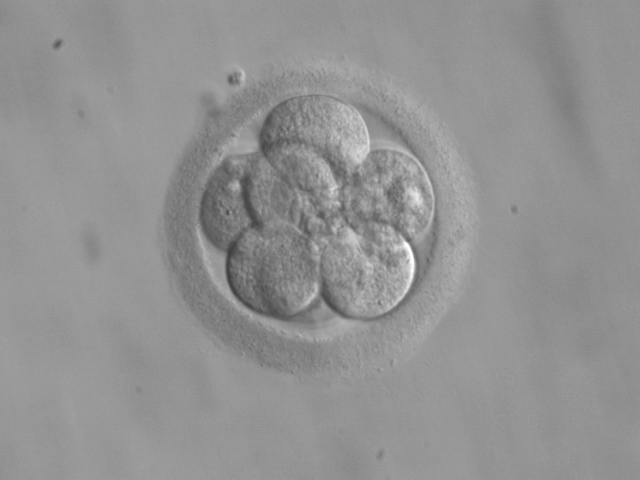
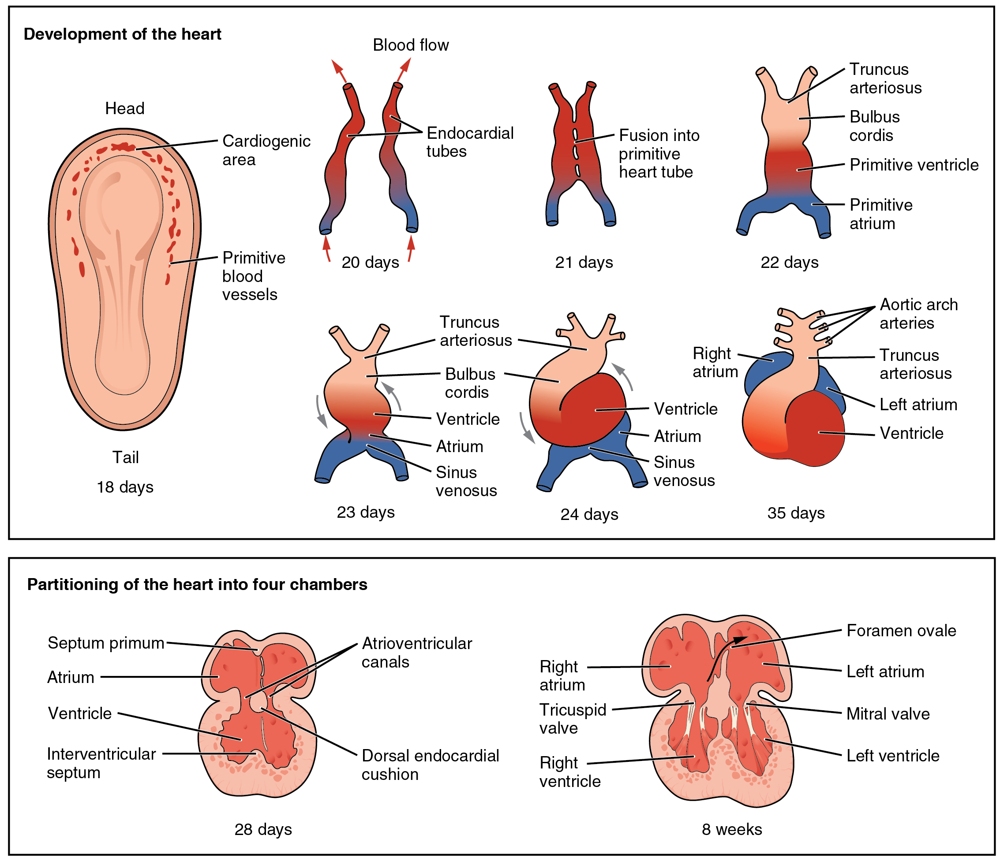
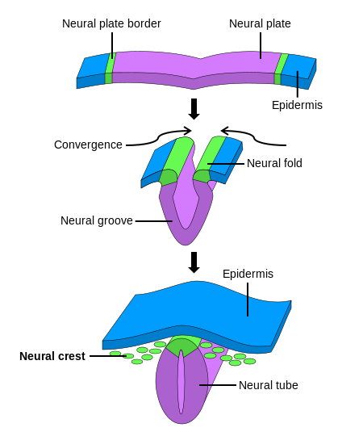
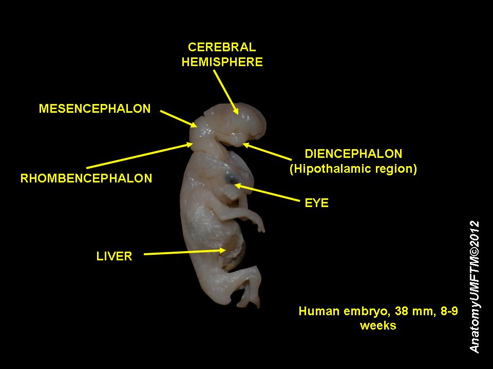

## Development And Aging

The main processes involved in the embryonic development of animals are: tissue patterning (via regional specification and patterned cell differentiation); tissue growth; and tissue morphogenesis.

* Regional specification refers to the processes that create spatial pattern in a ball or sheet of initially similar cells. This generally involves the action of cytoplasmic determinants, located within parts of the fertilized egg, and of inductive signals emitted from signaling centers in the embryo. The early stages of regional specification do not generate functional differentiated cells, but cell populations committed to develop to a specific region or part of the organism. These are defined by the expression of specific combinations of transcription factors.
* Cell differentiation relates specifically to the formation of functional cell types such as nerve, muscle, secretory epithelia etc. Differentiated cells contain large amounts of specific proteins associated with the cell function.
* Morphogenesis relates to the formation of three-dimensional shape. It mainly involves the orchestrated movements of cell sheets and of individual cells. Morphogenesis is important for creating the three germ layers of the early embryo (ectoderm, mesoderm and endoderm) and for building up complex structures during organ development.
* Tissue growth involves both an overall increase in tissue size, and also the differential growth of parts (allometry) which contributes to morphogenesis. Growth mostly occurs through cell proliferation but also through changes of cell size or the deposition of extracellular materials.

(ref:gendev) [Generalized scheme of the embryonic development of animals.](https://commons.wikimedia.org/wiki/File:Slack_Essential_Dev_Biol_Fig_02-08.jpg) 

(\#fig:generaldevelopmentscheme)(ref:gendev)

The development of plants involves similar processes to that of animals. However plant cells are mostly immotile so morphogenesis is achieved by differential growth, without cell movements. Also, the inductive signals and the genes involved are different from those that control animal development.

## Human Embryonic Development

Human embryonic development, or human embryogenesis, refers to the development and formation of the human embryo. It is characterised by the processes of cell division and cellular differentiation of the embryo that occurs during the early stages of development. In biological terms, the development of the human body entails growth from a one-celled zygote to an adult human being. Fertilisation occurs when the sperm cell successfully enters and fuses with an egg cell (ovum). The genetic material of the sperm and egg then combine to form a single cell called a zygote and the germinal stage of development commences. Embryonic development in the human, covers the first eight weeks of development; at the beginning of the ninth week the embryo is termed a fetus. Human embryology is the study of this development during the first eight weeks after fertilisation. The normal period of gestation (pregnancy) is about nine months or 40 weeks.

(ref:pregstag) [Stages during pregnancy. Embryonic development is marked in green. Weeks and months are numbered by gestation.](https://upload.wikimedia.org/wikipedia/commons/5/57/Prenatal_development_table.svg) 

(\#fig:pregnancystages)(ref:pregstag)

The germinal stage refers to the time from fertilization through the development of the early embryo until implantation is completed in the uterus. The germinal stage takes around 10 days. During this stage, the zygote begins to divide, in a process called cleavage. A blastocyst is then formed and implanted in the uterus. Embryogenesis continues with the next stage of gastrulation, when the three germ layers of the embryo form in a process called histogenesis, and the processes of neurulation and organogenesis follow.

(ref:blastoc) [Blastocyst with an inner cell mass and trophoblast.](https://commons.wikimedia.org/wiki/File:Blastocyst_English.svg)

(\#fig:blastocyst)(ref:blastoc)

In comparison to the embryo, the fetus has more recognizable external features and a more complete set of developing organs. The entire process of embryogenesis involves coordinated spatial and temporal changes in gene expression, cell growth and cellular differentiation. A nearly identical process occurs in other species, especially among chordates.

(ref:embdev) [The initial stages of human embryonic development.](https://commons.wikimedia.org/wiki/File:HumanEmbryogenesis.svg) 

(\#fig:humanembryonicdevelopment)(ref:embdev)

Fertilization takes place when the spermatozoon has successfully entered the ovum and the two sets of genetic material carried by the gametes fuse together, resulting in the zygote (a single diploid cell). This usually takes place in the ampulla of one of the fallopian tubes. The zygote contains the combined genetic material carried by both the male and female gametes which consists of the 23 chromosomes from the nucleus of the ovum and the 23 chromosomes from the nucleus of the sperm. The 46 chromosomes undergo changes prior to the mitotic division which leads to the formation of the embryo having two cells.

Successful fertilization is enabled by three processes, which also act as controls to ensure species-specificity. The first is that of chemotaxis which directs the movement of the sperm towards the ovum. Secondly there is an adhesive compatibility between the sperm and the egg. With the sperm adhered to the ovum, the third process of acrosomal reaction takes place; the front part of the spermatozoan head is capped by an acrosome which contains digestive enzymes to break down the zona pellucida and allow its entry. The entry of the sperm causes calcium to be released which blocks entry to other sperm cells. A parallel reaction takes place in the ovum called the zona reaction. This sees the release of cortical granules that release enzymes which digest sperm receptor proteins, thus preventing polyspermy. The granules also fuse with the plasma membrane and modify the zona pellucida in such a way as to prevent further sperm entry.

(ref:eighcell) [An embryo at the 8-cell stage, at 3 days.](https://commons.wikimedia.org/wiki/File:Embryo,_8_cells.jpg) 

(\#fig:eightcellembryo)(ref:eighcell)

The beginning of the cleavage process is marked when the zygote divides through mitosis into two cells. This mitosis continues and the first two cells divide into four cells, then into eight cells and so on. Each division takes from 12 to 24 hours. The zygote is large compared to any other cell and undergoes cleavage without any overall increase in size. This means that with each successive subdivision, the ratio of nuclear to cytoplasmic material increases. Initially the dividing cells, called blastomeres (blastos Greek for sprout), are undifferentiated and aggregated into a sphere enclosed within the membrane of glycoproteins (termed the zona pellucida) of the ovum. When eight blastomeres have formed they begin to develop gap junctions, enabling them to develop in an integrated way and co-ordinate their response to physiological signals and environmental cues.

When the cells number around sixteen the solid sphere of cells within the zona pellucida is referred to as a morula At this stage the cells start to bind firmly together in a process called compaction, and cleavage continues as cellular differentiation.

Cleavage itself is the first stage in blastulation, the process of forming the blastocyst. Cells differentiate into an outer layer of cells (collectively called the trophoblast) and an inner cell mass. With further compaction the individual outer blastomeres, the trophoblasts, become indistinguishable. They are still enclosed within the zona pellucida. This compaction serves to make the structure watertight, containing the fluid that the cells will later secrete. The inner mass of cells differentiate to become embryoblasts and polarise at one end. They close together and form gap junctions, which facilitate cellular communication. This polarisation leaves a cavity, the blastocoel, creating a structure that is now termed the blastocyst. (In animals other than mammals, this is called the blastula.) The trophoblasts secrete fluid into the blastocoel. The resulting increase in size of the blastocyst causes it to hatch through the zona pellucida, which then disintegrates.

The inner cell mass will give rise to the pre-embryo, the amnion, yolk sac and allantois, while the fetal part of the placenta will form from the outer trophoblast layer. The embryo plus its membranes is called the conceptus, and by this stage the conceptus has reached the uterus. The zona pellucida ultimately disappears completely, and the now exposed cells of the trophoblast allow the blastocyst to attach itself to the endometrium, where it will implant. The formation of the hypoblast and epiblast, which are the two main layers of the bilaminar germ disc, occurs at the beginning of the second week. Either the embryoblast or the trophoblast will turn into two sub-layers. The inner cells will turn into the hypoblast layer, which will surround the other layer, called the epiblast, and these layers will form the embryonic disc that will develop into the embryo. The trophoblast will also develop two sub-layers: the cytotrophoblast, which is in front of the syncytiotrophoblast, which in turn lies within the endometrium. Next, another layer called the exocoelomic membrane or Heuser’s membrane will appear and surround the cytotrophoblast, as well as the primitive yolk sac. The syncytiotrophoblast will grow and will enter a phase called lacunar stage, in which some vacuoles will appear and be filled by blood in the following days. The development of the yolk sac starts with the hypoblastic flat cells that form the exocoelomic membrane, which will coat the inner part of the cytotrophoblast to form the primitive yolk sac. An erosion of the endothelial lining of the maternal capillaries by the syncytiotrophoblastic cells of the sinusoids will form where the blood will begin to penetrate and flow through the trophoblast to give rise to the uteroplacental circulation. Subsequently new cells derived from yolk sac will be established between trophoblast and exocelomic membrane and will give rise to extra-embryonic mesoderm, which will form the chorionic cavity.

At the end of the second week of development, some cells of the trophoblast penetrate and form rounded columns into the syncytiotrophoblast. These columns are known as primary villi. At the same time, other migrating cells form into the exocelomic cavity a new cavity named the secondary or definitive yolk sac, smaller than the primitive yolk sac.

After ovulation, the endometrial lining becomes transformed into a secretory lining in preparation of accepting the embryo. It becomes thickened, with its secretory glands becoming elongated, and is increasingly vascular. This lining of the uterine cavity (or womb) is now known as the decidua, and it produces a great number of large decidual cells in its increased interglandular tissue. The blastomeres in the blastocyst are arranged into an outer layer called the trophoblast.The trophoblast then differentiates into an inner layer, the cytotrophoblast, and an outer layer, the syncytiotrophoblast. The cytotrophoblast contains cuboidal epithelial cells and is the source of dividing cells, and the syncytiotrophoblast is a syncytial layer without cell boundaries.

The syncytiotrophoblast implants the blastocyst in the decidual epithelium by projections of chorionic villi, forming the embryonic part of the placenta. The placenta develops once the blastocyst is implanted, connecting the embryo to the uterine wall. The decidua here is termed the decidua basalis; it lies between the blastocyst and the myometrium and forms the maternal part of the placenta. The implantation is assisted by hydrolytic enzymes that erode the epithelium. The syncytiotrophoblast also produces human chorionic gonadotropin, a hormone that stimulates the release of progesterone from the corpus luteum. Progesterone enriches the uterus with a thick lining of blood vessels and capillaries so that it can oxygenate and sustain the developing embryo. The uterus liberates sugar from stored glycogen from its cells to nourish the embryo. The villi begin to branch and contain blood vessels of the embryo. Other villi, called terminal or free villi, exchange nutrients. The embryo is joined to the trophoblastic shell by a narrow connecting stalk that develops into the umbilical cord to attach the placenta to the embryo. Arteries in the decidua are remodelled to increase the maternal blood flow into the intervillous spaces of the placenta, allowing gas exchange and the transfer of nutrients to the embryo. Waste products from the embryo will diffuse across the placenta.

As the syncytiotrophoblast starts to penetrate the uterine wall, the inner cell mass (embryoblast) also develops. The inner cell mass is the source of embryonic stem cells, which are pluripotent and can develop into any one of the three germ layer cells, and which have the potency to give rise to all the tissues and organs.

The embryoblast forms an embryonic disc, which is a bilaminar disc of two layers, an upper layer called the epiblast (primitive ectoderm) and a lower layer called the hypoblast (primitive endoderm). The disc is stretched between what will become the amniotic cavity and the yolk sac. The epiblast is adjacent to the trophoblast and made of columnar cells; the hypoblast is closest to the blastocyst cavity and made of cuboidal cells. The epiblast migrates away from the trophoblast downwards, forming the amniotic cavity, the lining of which is formed from amnioblasts developed from the epiblast. The hypoblast is pushed down and forms the yolk sac (exocoelomic cavity) lining. Some hypoblast cells migrate along the inner cytotrophoblast lining of the blastocoel, secreting an extracellular matrix along the way. These hypoblast cells and extracellular matrix are called Heuser's membrane (or the exocoelomic membrane), and they cover the blastocoel to form the yolk sac (or exocoelomic cavity). Cells of the hypoblast migrate along the outer edges of this reticulum and form the extraembryonic mesoderm; this disrupts the extraembryonic reticulum. Soon pockets form in the reticulum, which ultimately coalesce to form the chorionic cavity (extraembryonic coelom).
The primitive streak, a linear band of cells formed by the migrating epiblast, appears, and this marks the beginning of gastrulation, which takes place around the seventeenth day (week 3) after fertilisation. The process of gastrulation reorganises the two-layer embryo into a three-layer embryo, and also gives the embryo its specific head-to-tail, and front-to-back orientation, by way of the primitive streak which establishes bilateral symmetry. A primitive node (or primitive knot) forms in front of the primitive streak which is the organiser of neurulation. A primitive pit forms as a depression in the centre of the primitive node which connects to the notochord which lies directly underneath. The node has arisen from epiblasts of the amniotic cavity floor, and it is this node that induces the formation of the neural plate which serves as the basis for the nervous system. The neural plate will form opposite the primitive streak from ectodermal tissue which thickens and flattens into the neural plate. The epiblast in that region moves down into the streak at the location of the primitive pit where the process called ingression, which leads to the formation of the mesoderm takes place. This ingression sees the cells from the epiblast move into the primitive streak in an epithelial-mesenchymal transition; epithelial cells become mesenchymal stem cells, multipotent stromal cells that can differentiate into various cell types. The hypoblast is pushed out of the way and goes on to form the amnion. The epiblast keeps moving and forms a second layer, the mesoderm. The epiblast has now differentiated into the three germ layers of the embryo, so that the bilaminar disc is now a trilaminar disc, the gastrula.

The three germ layers are the ectoderm, mesoderm and endoderm, and are formed as three overlapping flat discs. It is from these three layers that all the structures and organs of the body will be derived through the processes of somitogenesis, histogenesis and organogenesis. The embryonic endoderm is formed by invagination of epiblastic cells that migrate to the hypoblast, while the mesoderm is formed by the cells that develop between the epiblast and endoderm. In general, all germ layers will derive from the epiblast. The upper layer of ectoderm will give rise to the outermost layer of skin, central and peripheral nervous systems, eyes, inner ear, and many connective tissues. The middle layer of mesoderm will give rise to the heart and the beginning of the circulatory system as well as the bones, muscles and kidneys. The inner layer of endoderm will serve as the starting point for the development of the lungs, intestine, thyroid, pancreas and bladder.

(ref:germlay) [Histogenesis of the three germ layers.](https://commons.wikimedia.org/wiki/File:Germ_layers.jpg) 

(\#fig:germlayers)(ref:germlay)

Following ingression, a blastopore develops where the cells have ingressed, in one side of the embryo and it deepens to become the archenteron, the first formative stage of the gut. As in all deuterostomes, the blastopore becomes the anus whilst the gut tunnels through the embryo to the other side where the opening becomes the mouth. With a functioning digestive tube, gastrulation is now completed and the next stage of neurulation can begin.

(ref:placen) [Embryo attached to the placenta in the amniotic cavity.](https://commons.wikimedia.org/wiki/File:2910_The_Placenta-02.jpg) 

(\#fig:embryoandplacenta)(ref:placen)

Following gastrulation, the ectoderm gives rise to epithelial and neural tissue, and the gastrula is now referred to as the neurula. The neural plate that has formed as a thickened plate from the ectoderm, continues to broaden and its ends start to fold upwards as neural folds. Neurulation refers to this folding process whereby the neural plate is transformed into the neural tube, and this takes place during the fourth week. They fold, along a shallow neural groove which has formed as a dividing median line in the neural plate. This deepens as the folds continue to gain height, when they will meet and close together at the neural crest. The cells that migrate through the most cranial part of the primitive line form the paraxial mesoderm, which will give rise to the somitomeres that in the process of somitogenesis will differentiate into somites that will form the sclerotomes, the syndetomes, the myotomes and the dermatomes to form cartilage and bone, tendons, dermis (skin), and muscle. The intermediate mesoderm gives rise to the urogenital tract and consists of cells that migrate from the middle region of the primitive line. Other cells migrate through the caudal part of the primitive line and form the lateral mesoderm, and those cells migrating by the most caudal part contribute to the extraembryonic mesoderm.

The embryonic disc begins flat and round, but eventually elongates to have a wider cephalic part and narrow-shaped caudal end. At the beginning, the primitive line extends in cephalic direction and 18 days after fertilization returns caudally until it disappears. In the cephalic portion, the germ layer shows specific differentiation at the beginning of the 4th week, while in the caudal portion it occurs at the end of the 4th week. Cranial and caudal neuropores become progressively smaller until they close completely (by day 26) forming the neural tube.

Development of organs and organ systems
Organogenesis is the development of the organs that begins during the third to eighth week, and continues until birth. Sometimes full development, as in the lungs, continues after birth. Different organs take part in the development of the many organ systems of the body.

Blood
Haematopoietic stem cells that give rise to all the blood cells develop from the mesoderm. The development of blood formation takes place in clusters of blood cells, known as blood islands, in the yolk sac. Blood islands develop outside the embryo, on the umbilical vesicle, allantois, connecting stalk, and chorion, from mesodermal hemangioblasts.

In the centre of a blood island, hemangioblasts form the haematopoietic stem cells that are the precursor to all types of blood cell. In the periphery of a blood island the hemangioblasts differentiate into angioblasts the precursors to the blood vessels.

Heart and circulatory system

The heart is the first functional organ to develop and starts to beat and pump blood at around 21 or 22 days. Cardiac myoblasts and blood islands in the splanchnopleuric mesenchyme on each side of the neural plate, give rise to the cardiogenic region.:165This is a horseshoe-shaped area near to the head of the embryo. By day 19, following cell signalling, two strands begin to form as tubes in this region, as a lumen develops within them. These two endocardial tubes grow and by day 21 have migrated towards each other and fused to form a single primitive heart tube, the tubular heart. This is enabled by the folding of the embryo which pushes the tubes into the thoracic cavity.

(ref:heartdev) [Embryonic development of the heart.](https://commons.wikimedia.org/wiki/File:2037_Embryonic_Development_of_Heart.jpg) 

(\#fig:heartdevelopment)(ref:heartdev)

Also at the same time that the endocardial tubes are forming, vasculogenesis (the development of the circulatory system) has begun. This starts on day 18 with cells in the splanchnopleuric mesoderm differentiating into angioblasts that develop into flattened endothelial cells. These join to form small vesicles called angiocysts which join up to form long vessels called angioblastic cords. These cords develop into a pervasive network of plexuses in the formation of the vascular network. This network grows by the additional budding and sprouting of new vessels in the process of angiogenesis. Following vasculogenesis and the development of an early vasculature, a stage of vascular remodelling takes place.

The tubular heart quickly forms five distinct regions. From head to tail, these are the infundibulum, bulbus cordis, primitive ventricle, primitive atrium, and the sinus venosus. Initially, all venous blood flows into the sinus venosus, and is propelled from tail to head to the truncus arteriosus. This will divide to form the aorta and pulmonary artery; the bulbus cordis will develop into the right (primitive) ventricle; the primitive ventricle will form the left ventricle; the primitive atrium will become the front parts of the left and right atria and their appendages, and the sinus venosus will develop into the posterior part of the right atrium, the sinoatrial node and the coronary sinus.

Cardiac looping begins to shape the heart as one of the processes of morphogenesis, and this completes by the end of the fourth week. Programmed cell death (apoptosis) at the joining surfaces enables fusion to take place. In the middle of the fourth week, the sinus venosus receives blood from the three major veins: the vitelline, the umbilical and the common cardinal veins.

During the first two months of development, the interatrial septum begins to form. This septum divides the primitive atrium into a right and a left atrium. Firstly it starts as a crescent-shaped piece of tissue which grows downwards as the septum primum. The crescent shape prevents the complete closure of the atria allowing blood to be shunted from the right to the left atrium through the opening known as the ostium primum. This closes with further development of the system but before it does, a second opening (the ostium secundum) begins to form in the upper atrium enabling the continued shunting of blood.

A second septum (the septum secundum) begins to form to the right of the septum primum. This also leaves a small opening, the foramen ovale which is continuous with the previous opening of the ostium secundum. The septum primum is reduced to a small flap that acts as the valve of the foramen ovale and this remains until its closure at birth. Between the ventricles the septum inferius also forms which develops into the muscular interventricular septum.

The digestive system starts to develop from the third week and by the twelfth week, the organs have correctly positioned themselves.

The respiratory system develops from the lung bud, which appears in the ventral wall of the foregut about four weeks into development. The lung bud forms the trachea and two lateral growths known as the bronchial buds, which enlarge at the beginning of the fifth week to form the left and right main bronchi. These bronchi in turn form secondary (lobar) bronchi; three on the right and two on the left (reflecting the number of lung lobes). Tertiary bronchi form from secondary bronchi.

While the internal lining of the larynx originates from the lung bud, its cartilages and muscles originate from the fourth and sixth pharyngeal arches.

Three different kidney systems form in the developing embryo: the pronephros, the mesonephros and the metanephros. Only the metanephros develops into the permanent kidney. All three are derived from the intermediate mesoderm.

Between the fourth and seventh weeks of development, the urorectal septum divides the cloaca into the urogenital sinus and the anal canal. The upper part of the urogenital sinus forms the bladder, while the lower part forms the urethra.

The superficial layer of the skin, the epidermis, is derived from the ectoderm. The deeper layer, the dermis, is derived from mesenchyme.

The formation of the epidermis begins in the second month of development and it acquires its definitive arrangement at the end of the fourth month. The ectoderm divides to form a flat layer of cells on the surface known as the periderm. Further division forms the individual layers of the epidermis.

The mesenchyme that will form the dermis is derived from three sources:

* The mesenchyme that forms the dermis in the limbs and body wall derives from the lateral plate mesoderm
* The mesenchyme that forms the dermis in the back derives from paraxial mesoderm
* The mesenchyme that forms the dermis in the face and neck derives from neural crest cells

Late in the fourth week, the superior part of the neural tube bends ventrally as the cephalic flexure at the level of the future midbrain—the mesencephalon. Above the mesencephalon is the prosencephalon (future forebrain) and beneath it is the rhombencephalon (future hindbrain).

(ref:neurul) [A diagram of the stages of neural tube formation.](https://en.wikipedia.org/wiki/Neural_tube#/media/File:Neural_crest.svg)
        

(\#fig:neurulation)(ref:neurul)

Cranial neural crest cells migrate to the pharyngeal arches as neural stem cells, where they develop in the process of neurogenesis into neurons.

The optical vesicle (which eventually becomes the optic nerve, retina and iris) forms at the basal plate of the prosencephalon. The alar plate of the prosencephalon expands to form the cerebral hemispheres (the telencephalon) whilst its basal plate becomes the diencephalon. Finally, the optic vesicle grows to form an optic outgrowth.

(ref:brainembryo) [An 8 week old human embryo.](https://commons.wikimedia.org/wiki/File:Human_embryo_8_weeks_4.JPG) 

(\#fig:humanembryo)(ref:brainembryo)

Fetal development is the third of the three stages of prenatal development, following from the initial germinal stage (preembryonic stage), and stage of embryonic development. These stages are also referred to in pregnancy as terms or trimesters.

From the 10th week of gestation (8th week of development), the developing organism is called a fetus.

All major structures are already formed in the fetus, but they continue to grow and develop. Since the precursors of all the major organs are created by this time, the fetal period is described both by organ and by a list of changes by weeks of gestational age.

Because the precursors of the organs are now formed, the fetus is not as sensitive to damage from environmental exposure as the embryo was. Instead, toxic exposure often causes physiological abnormalities or minor congenital malformation.
