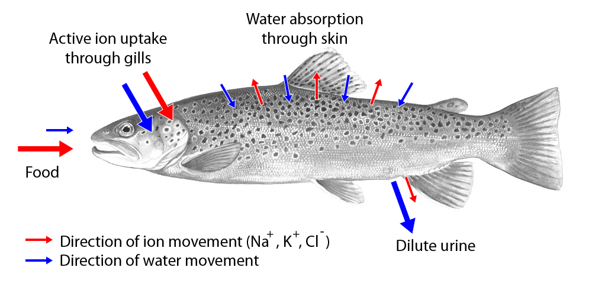
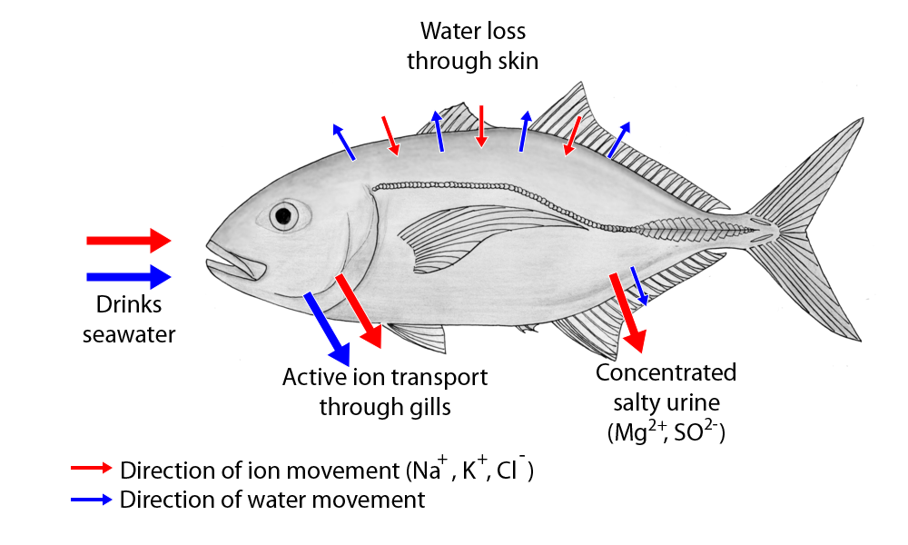
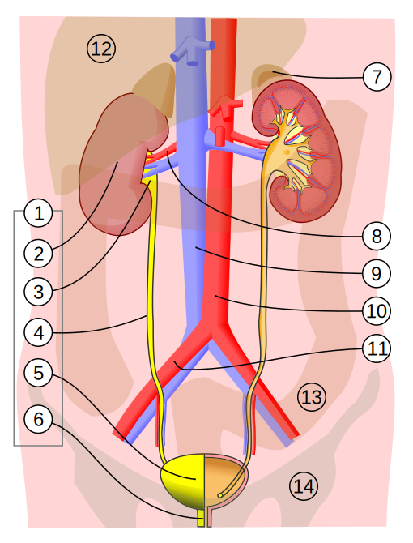
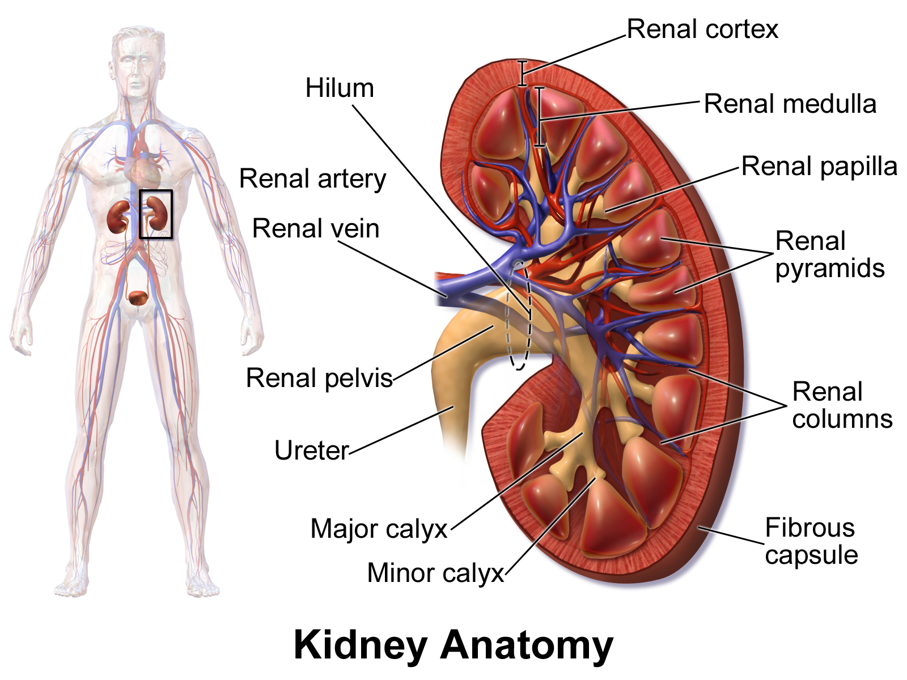
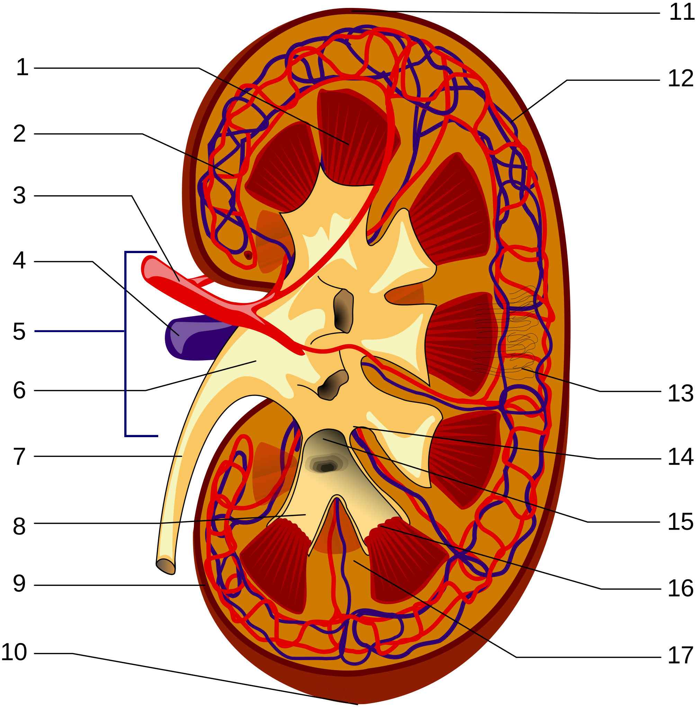
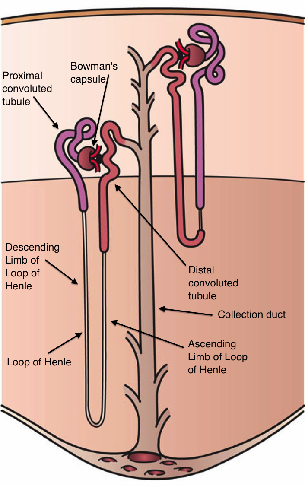
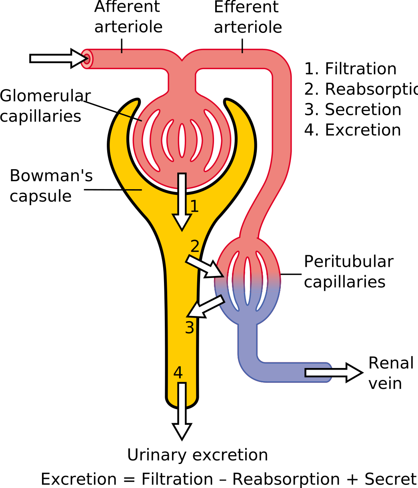
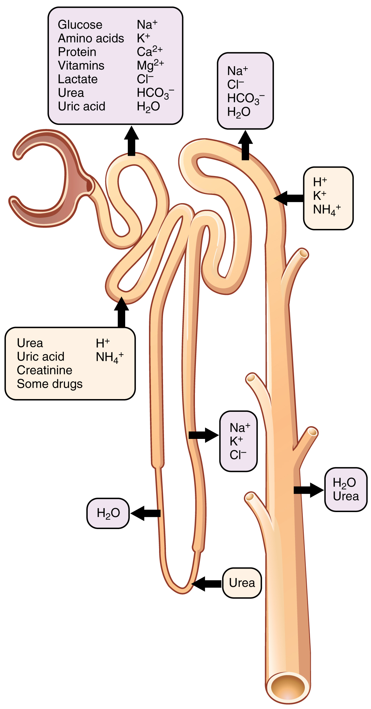

# Osmoregulation And Excretory Systems 

Osmoregulation is the active regulation of the osmotic pressure of an organism's body fluids, detected by osmoreceptors, to maintain the homeostasis of the organism's water content; that is, it maintains the fluid balance and the concentration of electrolytes (salts in solution which in this case is represented by body fluid) to keep the body fluids from becoming too diluted or concentrated. Osmotic pressure is a measure of the tendency of water to move into one solution from another by osmosis. The higher the osmotic pressure of a solution, the more water tends to move into it. Pressure must be exerted on the hypertonic side of a selectively permeable membrane to prevent diffusion of water by osmosis from the side containing pure water.

Two major types of osmoregulation are osmoconformers and osmoregulators. Osmoconformers match their body osmolarity to their environment actively or passively. Most marine invertebrates are osmoconformers, although their ionic composition may be different from that of seawater.

Osmoregulators tightly regulate their body osmolarity, maintaining constant internal conditions. They are more common in the animal kingdom. Osmoregulators actively control salt concentrations despite the salt concentrations in the environment. An example is freshwater fish. The gills actively uptake salt from the environment by the use of mitochondria-rich cells. Water will diffuse into the fish, so it excretes a very hypotonic (dilute) urine to expel all the excess water.

(ref:freshwfish) [Movement of water and ions in freshwater fish.](https://en.wikipedia.org/wiki/Osmoregulation#/media/File:Bachforelle_osmoregulatoin_bw_en2.png) 

(\#fig:freshwaterfish)(ref:freshwfish)

A marine fish has an internal osmotic concentration lower than that of the surrounding seawater, so it tends to lose water and gain salt. It actively excretes salt out from the gills. Most fish are stenohaline, which means they are restricted to either salt or fresh water and cannot survive in water with a different salt concentration than they are adapted to. 

(ref:salthwfish) [Movement of water and ions in saltwater fish.](https://en.wikipedia.org/wiki/File:Osmoseragulation_Carangoides_bartholomaei_bw_en2.png) 

(\#fig:saltwaterfish)(ref:saltwfish)

However, some fish show a tremendous ability to effectively osmoregulate across a broad range of salinities; fish with this ability are known as euryhaline species, e.g., Flounder. Flounder have been observed to inhabit two utterly disparate environments—marine and fresh water—and it is inherent to adapt to both by bringing in behavioral and physiological modifications.

Some marine fish, like sharks, have adopted a different, efficient mechanism to conserve water, i.e., osmoregulation. They retain urea in their blood in relatively higher concentration. Urea damages living tissues so, to cope with this problem, some fish retain trimethylamine oxide. This provides a better solution to urea's toxicity. Sharks, having slightly higher solute concentration (i.e., above 1000 mOsm which is sea solute concentration), do not drink water like fresh water fish.
Organisms in aquatic and terrestrial environments must maintain the right concentration of solutes and amount of water in their body fluids; this involves excretion (getting rid of metabolic nitrogen wastes and other substances such as hormones that would be toxic if allowed to accumulate in the blood) through organs such as the skin and the kidneys.
The excretory system is a passive biological system that removes excess, unnecessary materials from the body fluids of an organism, so as to help maintain internal chemical homeostasis and prevent damage to the body. The dual function of excretory systems is the elimination of the waste products of metabolism and to drain the body of used up and broken down components in a liquid and gaseous state. In humans and other amniotes (mammals, birds and reptiles) most of these substances leave the body as urine and to some degree exhalation, mammals also expel them through sweating.

Excretion is a process by which metabolic waste is eliminated from an organism. In vertebrates this is primarily carried out by the lungs, kidneys and skin. Excretion is an essential process in all forms of life. For example, in mammals urine is expelled through the urethra, which is part of the excretory system. In unicellular organisms, waste products are discharged directly through the surface of the cell.

During life activities such as cellular respiration, several chemical reactions take place in the body. These are known as metabolism. These chemical reactions produce waste products such as carbon dioxide, water, salts, urea and uric acid. Accumulation of these wastes beyond a level inside the body is harmful to the body. The excretory organs remove these wastes. This process of removal of metabolic waste from the body is known as excretion.

Green plants produce carbon dioxide and water as respiratory products. In green plants, the carbon dioxide released during respiration gets utilized during photosynthesis. Oxygen is a by product generated during photosynthesis, and exits through stomata, root cell walls, and other routes. Plants can get rid of excess water by transpiration and guttation. It has been shown that the leaf acts as an 'excretophore' and, in addition to being a primary organ of photosynthesis, is also used as a method of excreting toxic wastes via diffusion. Other waste materials that are exuded by some plants — resin, saps, latex, etc. are forced from the interior of the plant by hydrostatic pressures inside the plant and by absorptive forces of plant cells. These latter processes do not need added energy, they act passively. However, during the pre-abscission phase, the metabolic levels of a leaf are high. Plants also excrete some waste substances into the soil around them.

In animals, the main excretory products are carbon dioxide, ammonia (in many aquatic invertebrates), urea (in amphibians and mammals), uric acid (in insects, birds and other reptiles), guanine (in spiders) and creatine. The liver and kidneys clear many substances from the blood (for example, in renal excretion), and the cleared substances are then excreted from the body in the urine and feces.

## Nitrogenous Waste

The nitrogen compounds through which excess nitrogen is eliminated from organisms are called nitrogenous wastes or nitrogen wastes. They are ammonia, urea, uric acid, and creatinine. All of these substances are produced from protein metabolism. In many animals, the urine is the main route of excretion for such wastes; in some, the feces is.

Aquatic animals usually excrete ammonia directly into the external environment, as this compound has high solubility and there is ample water available for dilution. In terrestrial animals ammonia-like compounds are converted into other nitrogenous materials as there is less water in the environment and ammonia itself is toxic.

Birds excrete their nitrogenous wastes as uric acid in the form of a paste. Although this process is metabolically more expensive, it allows more efficient water retention and it can be stored more easily in the egg. Many avian species, especially seabirds, can also excrete salt via specialized nasal salt glands, the saline solution leaving through nostrils in the beak.

In insects, a system involving Malpighian tubules is utilized to excrete metabolic waste. Metabolic waste diffuses or is actively transported into the tubule, which transports the wastes to the intestines. The metabolic waste is then released from the body along with fecal matter.

## Excretory Systems

The excretory system is a passive biological system that removes excess, unnecessary materials from the body fluids of an organism, so as to help maintain internal chemical homeostasis and prevent damage to the body. The dual function of excretory systems is the elimination of the waste products of metabolism and to drain the body of used up and broken down components in a liquid and gaseous state. In humans and other amniotes (mammals, birds and reptiles) most of these substances leave the body as urine and to some degree exhalation, mammals also expel them through sweating.

Only the organs specifically used for the excretion are considered a part of the excretory system. In the narrow sense, the term refer to the urinary system. However, as excretion involves several functions that are only superficially related, it is not usually used in more formal classifications of anatomy or function.

As most healthy functioning organs produce metabolic and other wastes, the entire organism depends on the function of the system. Breaking down of one of more of the systems is a serious health condition, for example kidney failure.

## The Human Urinary System

The urinary system, also known as the renal system or urinary tract, consists of the kidneys, ureters, bladder, and the urethra. The purpose of the urinary system is to eliminate waste from the body, regulate blood volume and blood pressure, control levels of electrolytes and metabolites, and regulate blood pH. The urinary tract is the body's drainage system for the eventual removal of urine. The kidneys have an extensive blood supply via the renal arteries which leave the kidneys via the renal vein. Each kidney consists of functional units called nephrons. Following filtration of blood and further processing, wastes (in the form of urine) exit the kidney via the ureters, tubes made of smooth muscle fibres that propel urine towards the urinary bladder, where it is stored and subsequently expelled from the body by urination (voiding). The female and male urinary system are very similar, differing only in the length of the urethra.

(ref:urinsys) [The human urinary system.](https://commons.wikimedia.org/wiki/File:Urinary_system.svg) 1. Human urinary system: 2. Kidney, 3. Renal pelvis, 4. Ureter, 5. Urinary bladder, 6. Urethra. (Left side with frontal section) 7. Adrenal gland Vessels: 8. Renal artery and vein, 9. Inferior vena cava, 10. Abdominal aorta, 11. Common iliac artery and vein Transparent: 12. Liver, 13. Large intestine, 14. Pelvis

(\#fig:urinarysystem)(ref:urinsys)

Urine is formed in the kidneys through a filtration of blood. The urine is then passed through the ureters to the bladder, where it is stored. During urination, the urine is passed from the bladder through the urethra to the outside of the body.

800–2,000 milliliters (mL) of urine are normally produced every day in a healthy human. This amount varies according to fluid intake and kidney function.

The urinary system refers to the structures that produce and transport urine to the point of excretion. In the human urinary system there are two kidneys that are located between the dorsal body wall and parietal peritoneum on both the left and right sides.

The formation of urine begins within the functional unit of the kidney, the nephrons. Urine then flows through the nephrons, through a system of converging tubules called collecting ducts. These collecting ducts then join together to form the minor calyces, followed by the major calyces that ultimately join the renal pelvis. From here, urine continues its flow from the renal pelvis into the ureter, transporting urine into the urinary bladder. The anatomy of the human urinary system differs between males and females at the level of the urinary bladder. In males, the urethra begins at the internal urethral orifice in the trigone of the bladder, continues through the external urethral orifice, and then becomes the prostatic, membranous, bulbar, and penile urethra. Urine exits through the external urethral meatus. The female urethra is much shorter, beginning at the bladder neck and terminating in the vaginal vestibule.

The main functions of the urinary system and its components are to

* Regulate blood volume and composition (e.g. sodium, potassium and calcium)
* Regulate blood pressure.
* Regulate pH homeostasis of the blood.
* Contributes to the production of red blood cells by the kidney.
* Helps synthesize calcitriol the (active form of Vitamin D).
* Stores waste product (mainly urea and uric acid) before it and other products are removed from the body.

Average urine production in adult humans is about 1–2 litres (L) per day, depending on state of hydration, activity level, environmental factors, weight, and the individual's health. Producing too much or too little urine requires medical attention. Polyuria is a condition of excessive urine production (> 2.5 L/day). Oliguria when < 400 mL (millilitres) are produced, and anuria one of < 100 mL per day.

The first step in urine formation is the filtration of blood in the kidneys. In a healthy human the kidney receives between 12 and 30% of cardiac output, but it averages about 20% or about 1.25 L/min.

The kidneys are two bean-shaped organs found in vertebrates. They are located on the left and right in the retroperitoneal space, and in adult humans are about 12 centimetres (4 1⁄2 inches) in length. They receive blood from the paired renal arteries; blood exits into the paired renal veins. Each kidney is attached to a ureter, a tube that carries excreted urine to the bladder.

(ref:kid) [The kidneys lie in the retroperitoneal space behind the abdomen, and act to filter blood to create urine.](https://commons.wikimedia.org/wiki/File:Blausen_0592_KidneyAnatomy_01.png) 

(\#fig:kidney)(ref:kid)

The nephron is the structural and functional unit of the kidney. Each human adult kidney contains around 1 million nephrons, while a mouse kidney contains only about 12,500 nephrons. The kidney participates in the control of the volume of various body fluids, fluid osmolality, acid-base balance, various electrolyte concentrations, and removal of toxins. Filtration occurs in the glomerulus: one-fifth of the blood volume that enters the kidneys is filtered. Examples of substances reabsorbed are solute-free water, sodium, bicarbonate, glucose, and amino acids. Examples of substances secreted are hydrogen, ammonium, potassium and uric acid. The kidneys also carry out functions independent of the nephron. For example, they convert a precursor of vitamin D to its active form, calcitriol; and synthesize the hormones erythropoietin and renin.

In humans, the kidneys are located high in the abdominal cavity, one on each side of the spine, and lie in a retroperitoneal position at a slightly oblique angle. The asymmetry within the abdominal cavity, caused by the position of the liver, typically results in the right kidney being slightly lower and smaller than the left, and being placed slightly more to the middle than the left kidney. The left kidney is approximately at the vertebral level T12 to L3, and the right is slightly lower. The right kidney sits just below the diaphragm and posterior to the liver. The left kidney sits below the diaphragm and posterior to the spleen. On top of each kidney is an adrenal gland. The upper parts of the kidneys are partially protected by the 11th and 12th ribs. Each kidney, with its adrenal gland is surrounded by two layers of fat: the perirenal fat present between renal fascia and renal capsule and pararenal fat superior to the renal fascia.

(ref:kidneystruc) [The structure of the kidney.](https://commons.wikimedia.org/wiki/File:KidneyStructures_PioM.svg)  1. Renal pyramid • 2. Interlobular artery • 3. Renal artery • 4. Renal vein 5. Renal hilum • 6. Renal pelvis • 7. Ureter • 8. Minor calyx • 9. Renal capsule • 10. Inferior renal capsule • 11. Superior renal capsule • 12. Interlobular vein • 13. Nephron • 14. Renal sinus • 15. Major calyx • 16. Renal papilla • 17. Renal column

(\#fig:kidneystructure)(ref:kidneystruc)

The kidney is a bean-shaped structure with a convex and a concave border. A recessed area on the concave border is the renal hilum, where the renal artery enters the kidney and the renal vein and ureter leave. The kidney is surrounded by tough fibrous tissue, the renal capsule, which is itself surrounded by perirenal fat, renal fascia, and pararenal fat. The anterior (front) surface of these tissues is the peritoneum, while the posterior (rear) surface is the transversalis fascia.

The superior pole of the right kidney is adjacent to the liver. For the left kidney, it is next to the spleen. Both, therefore, move down upon inhalation.

The basic structural and functional unit of the kidney is the nephron. Its chief function is to regulate the concentration of water and soluble substances like sodium by filtering the blood, reabsorbing what is needed and excreting the rest as urine.

(ref:neph) [The nephron, shown here, is the functional unit of the kidneys. Its parts are labelled except the (gray) connecting tubule located after the (dark red) distal convoluted tubule and before the large (gray) collecting duct (mislabeled collection duct).](https://commons.wikimedia.org/wiki/File:Kidney_Nephron.png)

(\#fig:nephron)(ref:neph)

In the first part of the nephron, Bowman's capsule filters blood from the circulatory system into the tubules. Hydrostatic and osmotic pressure gradients facilitate filtration across a semipermeable membrane. The filtrate includes water, small molecules, and ions that easily pass through the filtration membrane. However larger molecules such as proteins and blood cells are prevented from passing through the filtration membrane. The amount of filtrate produced every minute is called the glomerular filtration rate or GFR and amounts to 180 litres per day. About 99% of this filtrate is reabsorbed as it passes through the nephron and the remaining 1% becomes urine.

(ref:nephphys) [The four main processes involved in the creation of urine: Excretion = Filtration - Reabsorption + Secretion](https://commons.wikimedia.org/wiki/File:Physiology_of_Nephron.svg) 

(\#fig:unnamed-chunk-1)(ref:)

(ref:secreabs) [Secretion and reabsorption of water, ions and various substances throughout the nephron.](https://upload.wikimedia.org/wikipedia/commons/2/26/2618_Nephron_Secretion_Reabsorption.jpg) 

(\#fig:secretionreabsorption)(ref:secreabs)

The urinary system is regulated by the endocrine system by hormones such as antidiuretic hormone, aldosterone, and parathyroid hormone.

The urinary system is under influence of the circulatory system, nervous system, and endocrine system.

Aldosterone plays a central role in regulating blood pressure through its effects on the kidney. It acts on the distal tubules and collecting ducts of the nephron and increases reabsorption of sodium from the glomerular filtrate. Reabsorption of sodium results in retention of water, which increases blood pressure and blood volume. Antidiuretic hormone (ADH), is a neurohypophysial hormone found in most mammals. Its two primary functions are to retain water in the body and vasoconstriction. Vasopressin regulates the body's retention of water by increasing water reabsorption in the collecting ducts of the kidney nephron. Vasopressin increases water permeability of the kidney's collecting duct and distal convoluted tubule by inducing translocation of aquaporin-CD water channels in the kidney nephron collecting duct plasma membrane.

In the majority of vertebrates, the mesonephros persists into the adult, albeit usually fused with the more advanced metanephros; only in amniotes is the mesonephros restricted to the embryo. The kidneys of fish and amphibians are typically narrow, elongated organs, occupying a significant portion of the trunk. The collecting ducts from each cluster of nephrons usually drain into an archinephric duct, which is homologous with the vas deferens of amniotes. However, the situation is not always so simple; in cartilaginous fish and some amphibians, there is also a shorter duct, similar to the amniote ureter, which drains the posterior (metanephric) parts of the kidney, and joins with the archinephric duct at the bladder or cloaca. Indeed, in many cartilaginous fish, the anterior portion of the kidney may degenerate or cease to function altogether in the adult.

In the most primitive vertebrates, the hagfish and lampreys, the kidney is unusually simple: it consists of a row of nephrons, each emptying directly into the archinephric duct. Invertebrates may possess excretory organs that are sometimes referred to as "kidneys", but, even in Amphioxus, these are never homologous with the kidneys of vertebrates, and are more accurately referred to by other names, such as nephridia. In amphibians, kidneys and the urinary bladder harbour specialized parasites, monogeneans of the family Polystomatidae.

The kidneys of reptiles consist of a number of lobules arranged in a broadly linear pattern. Each lobule contains a single branch of the ureter in its centre, into which the collecting ducts empty. Reptiles have relatively few nephrons compared with other amniotes of a similar size, possibly because of their lower metabolic rate.

Birds have relatively large, elongated kidneys, each of which is divided into three or more distinct lobes. The lobes consists of several small, irregularly arranged, lobules, each centred on a branch of the ureter. Birds have small glomeruli, but about twice as many nephrons as similarly sized mammals.

The human kidney is fairly typical of that of mammals. Distinctive features of the mammalian kidney, in comparison with that of other vertebrates, include the presence of the renal pelvis and renal pyramids and a clearly distinguishable cortex and medulla. The latter feature is due to the presence of elongated loops of Henle; these are much shorter in birds, and not truly present in other vertebrates (although the nephron often has a short intermediate segment between the convoluted tubules). It is only in mammals that the kidney takes on its classical "kidney" shape, although there are some exceptions, such as the multilobed reniculate kidneys of pinnipeds and cetaceans.
