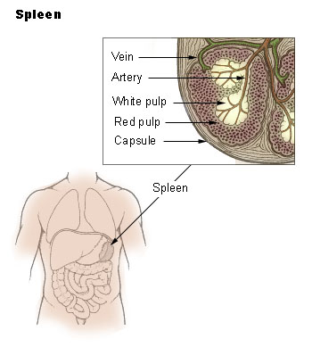
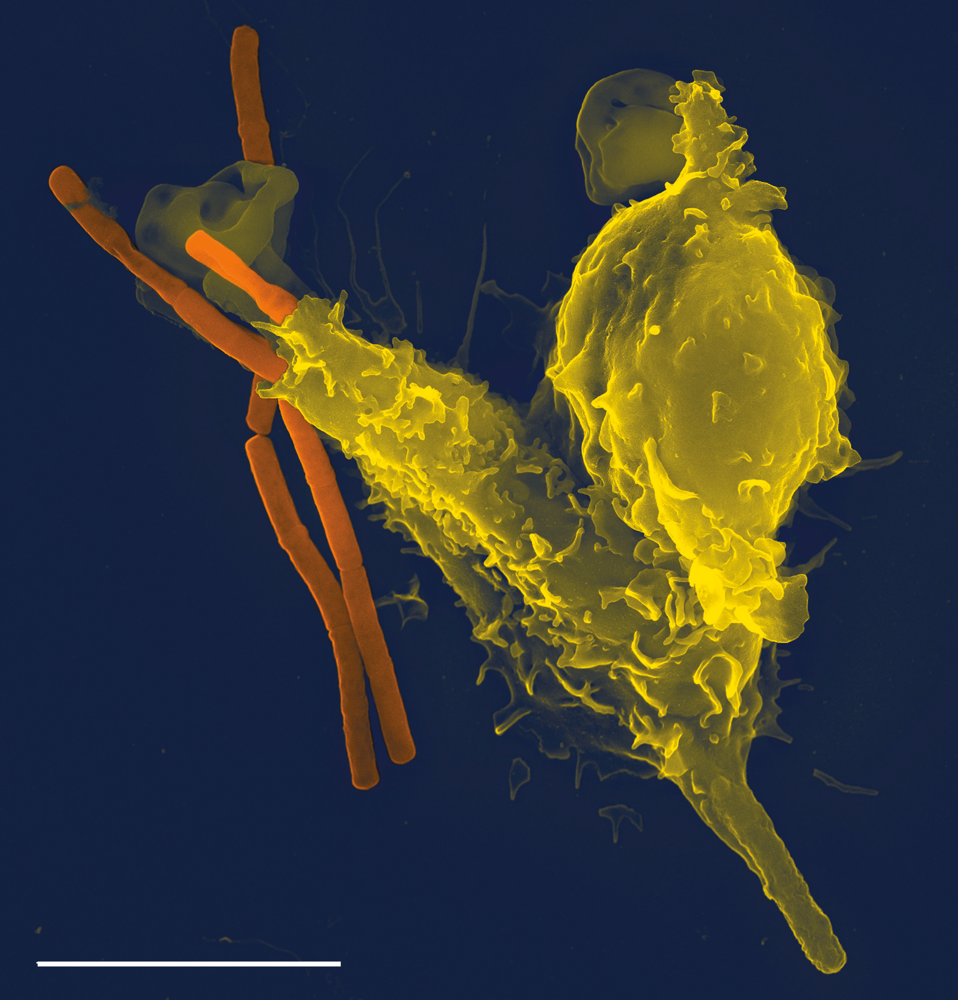

# The Lymphatic And Immune Systems

The lymphatic system consists of a network of lymphatic vessels and lymph capillaries, lymph nodes and organs, and lymphatic tissues and circulating lymph. Lymph is essentially recycled excess blood plasma after it has been filtered from the interstitial fluid (between cells) and returned to the lymphatic system. One of its major functions is to carry the lymph, draining and returning interstitial fluid back towards the heart for return to the cardiovascular system, by emptying into the lymphatic ducts. Its other main function is in the adaptive immune system. The lymphatic system is an open system providing an accessory route for excess interstitial fluid to be returned to the blood. 

The immune system is a host defense system comprising many biological structures and processes within an organism that protects against disease. To function properly, an immune system must detect a wide variety of agents, known as pathogens, from viruses to parasitic worms, and distinguish them from the organism's own healthy tissue. In many species, there are two major subsystems of the immune system: the innate immune system and the adaptive immune system. Both subsystems use humoral immunity and cell-mediated immunity to perform their functions. In humans, the blood–brain barrier, blood–cerebrospinal fluid barrier, and similar fluid–brain barriers separate the peripheral immune system from the neuroimmune system, which protects the brain.

## The Lymphatic System

The lymphatic system, or lymphoid system, is an organ system in vertebrates that is part of the circulatory system and the immune system. It is made up of a large network of lymphatic vessels, lymphatic or lymphoid organs, and lymphoid tissues. The vessels carry a clear fluid called lymph (the Latin word lympha refers to the deity of fresh water, "Lympha") towards the heart.

(ref:lymph) [The human lymphatic system.](https://commons.wikimedia.org/wiki/File:Blausen_0623_LymphaticSystem_Female.png)

(\#fig:lymphaticsystem)(ref:lymph)

The adjective used for the lymph-transporting system is lymphatic. The adjective used for the tissues where lymphocytes are formed is lymphoid. Lymphatic comes from the Latin word lymphaticus, meaning "connected to water."

Unlike the cardiovascular system, the lymphatic system is not a closed system. The human circulatory system processes an average of 20 litres of blood per day through capillary filtration, which removes plasma from the blood. Roughly 17 litres of the filtered plasma is reabsorbed directly into the blood vessels, while the remaining three litres remain in the interstitial fluid. One of the main functions of the lymphatic system is to provide an accessory return route to the blood for the surplus three litres.

The other main function is that of immune defense. Lymph is very similar to blood plasma, in that it contains waste products and cellular debris, together with bacteria and proteins. The cells of the lymph are mostly lymphocytes. Associated lymphoid organs are composed of lymphoid tissue, and are the sites either of lymphocyte production or of lymphocyte activation. These include the lymph nodes (where the highest lymphocyte concentration is found), the spleen, the thymus, and the tonsils. Lymphocytes are initially generated in the bone marrow. The lymphoid organs also contain other types of cells such as stromal cells for support. Lymphoid tissue is also associated with mucosas such as mucosa-associated lymphoid tissue (MALT).

Fluid from circulating blood leaks into the tissues of the body by capillary action, carrying nutrients to the cells. The fluid bathes the tissues as interstitial fluid, collecting waste products, bacteria, and damaged cells, and then drains as lymph into the lymphatic capillaries and lymphatic vessels. These vessels carry the lymph throughout the body, passing through numerous lymph nodes which filter out unwanted materials such as bacteria and damaged cells. Lymph then passes into much larger lymph vessels known as lymph ducts. The right lymphatic duct drains the right side of the region and the much larger left lymphatic duct, known as the thoracic duct, drains the left side of the body. The ducts empty into the subclavian veins to return to the blood circulation. Lymph is moved through the system by muscle contractions. In some vertebrates, a lymph heart is present that pumps the lymph to the veins.

The lymphatic system was first described in the 17th century independently by Olaus Rudbeck and Thomas Bartholin.

The lymphatic system consists of a conducting network of lymphatic vessels, lymphoid organs, lymphoid tissues, and the circulating lymph.

### Primary lymphoid organs

The primary (or central) lymphoid organs generate lymphocytes from immature progenitor cells. The thymus and the bone marrow constitute the primary lymphoid organs involved in the production and early clonal selection of lymphocyte tissues.

### The Bone Marrow

Bone marrow is responsible for both the creation of T cells and the production and maturation of B cells, which are important cell types of the immune system. From the bone marrow, B cells immediately join the circulatory system and travel to secondary lymphoid organs in search of pathogens. T cells, on the other hand, travel from the bone marrow to the thymus, where they develop further and mature. Mature T cells then join B cells in search of pathogens. The other 95% of T cells begin a process of apoptosis, a form of programmed cell death.

### The Thymus

The thymus increases in size from birth in response to postnatal antigen stimulation. It is most active during the neonatal and pre-adolescent periods. At puberty, by the early teens, the thymus begins to atrophy and regress, with adipose tissue mostly replacing the thymic stroma. However, residual T lymphopoiesis continues throughout adult life. The loss or lack of the thymus results in severe immunodeficiency and subsequent high susceptibility to infection. In most species, the thymus consists of lobules divided by septa which are made up of epithelium; it is therefore often considered an epithelial organ. T cells mature from thymocytes, proliferate, and undergo a selection process in the thymic cortex before entering the medulla to interact with epithelial cells.

(ref:thymus) [Location and microscopic anatomy of the human thymus](https://upload.wikimedia.org/wikipedia/commons/c/cf/Illu_thymus.jpg) 

(\#fig:humanthymus)(ref:thymus)

The thymus provides an inductive environment for the development of T cells from hematopoietic progenitor cells. In addition, thymic stromal cells allow for the selection of a functional and self-tolerant T cell repertoire. Therefore, one of the most important roles of the thymus is the induction of central tolerance.

### The Secondary Lymphoid Organs

The secondary (or peripheral) lymphoid organs (SLO), which include lymph nodes and the spleen, maintain mature naive lymphocytes and initiate an adaptive immune response. The peripheral lymphoid organs are the sites of lymphocyte activation by antigens. Activation leads to clonal expansion and affinity maturation. Mature lymphocytes recirculate between the blood and the peripheral lymphoid organs until they encounter their specific antigen.

### The Spleen

The main functions of the spleen are:

* to produce immune cells to fight antigens
* to remove particulate matter and aged blood cells, mainly red blood cells
* to produce blood cells during fetal life.

The spleen synthesizes antibodies in its white pulp and removes antibody-coated bacteria and antibody-coated blood cells by way of blood and lymph node circulation. A study published in 2009 using mice found that the spleen contains, in its reserve, half of the body's monocytes within the red pulp. These monocytes, upon moving to injured tissue (such as the heart), turn into dendritic cells and macrophages while promoting tissue healing. The spleen is a center of activity of the mononuclear phagocyte system and can be considered analogous to a large lymph node, as its absence causes a predisposition to certain infections.

(ref:spleen) [Location and microscopic anatomy of the human spleen.](https://commons.wikimedia.org/wiki/File:Illu_spleen.jpg) 

(\#fig:humanspleen)(ref:spleen)

Like the thymus, the spleen has only efferent lymphatic vessels. Both the short gastric arteries and the splenic artery supply it with blood. The germinal centers are supplied by arterioles called penicilliary radicles.

Until the fifth month of prenatal development, the spleen creates red blood cells; after birth, the bone marrow is solely responsible for hematopoiesis. As a major lymphoid organ and a central player in the reticuloendothelial system, the spleen retains the ability to produce lymphocytes. The spleen stores red blood cells and lymphocytes. It can store enough blood cells to help in an emergency. Up to 25% of lymphocytes can be stored at any one time.

### The Lymph Nodes

A lymph node is an organized collection of lymphoid tissue, through which the lymph passes on its way back to the blood. Lymph nodes are located at intervals along the lymphatic system. Several afferent lymph vessels bring in lymph, which percolates through the substance of the lymph node, and is then drained out by an efferent lymph vessel. Of the nearly 800 lymph nodes in the human body, about 300 are located in the head and neck. Many are grouped in clusters in different regions, as in the underarm and abdominal areas. Lymph node clusters are commonly found at the proximal ends of limbs (groin, armpits) and in the neck, where lymph is collected from regions of the body likely to sustain pathogen contamination from injuries. Lymph nodes are particularly numerous in the mediastinum in the chest, neck, pelvis, axilla, inguinal region, and in association with the blood vessels of the intestines.

(ref:lymphnod) [Schematic diagram of a lymph node showing flow of lymph through lymph sinuses](https://commons.wikimedia.org/wiki/File:Schematic_of_lymph_node_showing_lymph_sinuses.svg) 

(\#fig:lymphnode)(ref:lymphnod)

The substance of a lymph node consists of lymphoid follicles in an outer portion called the cortex. The inner portion of the node is called the medulla, which is surrounded by the cortex on all sides except for a portion known as the hilum. The hilum presents as a depression on the surface of the lymph node, causing the otherwise spherical lymph node to be bean-shaped or ovoid. The efferent lymph vessel directly emerges from the lymph node at the hilum. The arteries and veins supplying the lymph node with blood enter and exit through the hilum. The region of the lymph node called the paracortex immediately surrounds the medulla. Unlike the cortex, which has mostly immature T cells, or thymocytes, the paracortex has a mixture of immature and mature T cells. Lymphocytes enter the lymph nodes through specialised high endothelial venules found in the paracortex.

A lymph follicle is a dense collection of lymphocytes, the number, size, and configuration of which change in accordance with the functional state of the lymph node. For example, the follicles expand significantly when encountering a foreign antigen. The selection of B cells, or B lymphocytes, occurs in the germinal centre of the lymph nodes.

Secondary lymphoid tissue provides the environment for the foreign or altered native molecules (antigens) to interact with the lymphocytes. It is exemplified by the lymph nodes, and the lymphoid follicles in tonsils, Peyer's patches, spleen, adenoids, skin, etc. that are associated with the mucosa-associated lymphoid tissue (MALT).

In the gastrointestinal wall, the appendix has mucosa resembling that of the colon, but here it is heavily infiltrated with lymphocytes.

Lymphoid tissue associated with the lymphatic system is concerned with immune functions in defending the body against infections and the spread of tumours. It consists of connective tissue formed of reticular fibers, with various types of leukocytes (white blood cells), mostly lymphocytes enmeshed in it, through which the lymph passes. Regions of the lymphoid tissue that are densely packed with lymphocytes are known as lymphoid follicles. Lymphoid tissue can either be structurally well organized as lymph nodes or may consist of loosely organized lymphoid follicles known as the mucosa-associated lymphoid tissue (MALT).

### The Lymphatic Vessels

The lymphatic vessels, also called lymph vessels, are thin-walled vessels that conduct lymph between different parts of the body. They include the tubular vessels of the lymph capillaries, and the larger collecting vessels–the right lymphatic duct and the thoracic duct (the left lymphatic duct). The lymph capillaries are mainly responsible for the absorption of interstitial fluid from the tissues, while lymph vessels propel the absorbed fluid forward into the larger collecting ducts, where it ultimately returns to the bloodstream via one of the subclavian veins.

The tissues of the lymphatic system are responsible for maintaining the balance of the body fluids. Its network of capillaries and collecting lymphatic vessels work to efficiently drain and transport extravasated fluid, along with proteins and antigens, back to the circulatory system. Numerous intraluminal valves in the vessels ensure a unidirectional flow of lymph without reflux. Two valve systems, a primary and a secondary valve system, are used to achieve this unidirectional flow. The capillaries are blind-ended, and the valves at the ends of capillaries use specialised junctions together with anchoring filaments to allow a unidirectional flow to the primary vessels. The collecting lymphatics, however, act to propel the lymph by the combined actions of the intraluminal valves and lymphatic muscle cells.

(ref:lymphcap) [Lymph capillaries in the tissue spaces.](https://commons.wikimedia.org/wiki/File:2202_Lymphatic_Capillaries_big.png)

(\#fig:lymphaticcapillaries)(ref:lymphcap)

The lymphatic system has multiple interrelated functions:

* It is responsible for the removal of interstitial fluid from tissues
* It absorbs and transports fatty acids and fats as chyle from the digestive system
* It transports white blood cells to and from the lymph nodes into the bones
* The lymph transports antigen-presenting cells, such as dendritic cells, to the lymph nodes where an immune response is stimulated.

Nutrients in food are absorbed via intestinal vili (greatly enlarged in the picture) to blood and lymph. Long-chain fatty acids (and other lipids with similar fat solubility like some medicines) are absorbed to the lymph and move in it enveloped inside chylomicrons. They move via the thoracic duct of the lymphatic system and finally enter the blood via the left subclavian vein, thus bypassing the liver's first-pass metabolism completely.
Lymph vessels called lacteals are at the beginning of the gastrointestinal tract, predominantly in the small intestine. While most other nutrients absorbed by the small intestine are passed on to the portal venous system to drain via the portal vein into the liver for processing, fats (lipids) are passed on to the lymphatic system to be transported to the blood circulation via the thoracic duct. (There are exceptions, for example medium-chain triglycerides are fatty acid esters of glycerol that passively diffuse from the GI tract to the portal system.) The enriched lymph originating in the lymphatics of the small intestine is called chyle. The nutrients that are released into the circulatory system are processed by the liver, having passed through the systemic circulation.

(ref:lymphnut) [Nutrients in food are absorbed via intestinal vili (greatly enlarged in the picture) to blood and lymph. Long-chain fatty acids (and other lipids with similar fat solubility like some medicines) are absorbed to the lymph and move in it enveloped inside chylomicrons. They move via the thoracic duct of the lymphatic system and finally enter the blood via the left subclavian vein, thus bypassing the liver's first-pass metabolism completely.](https://commons.wikimedia.org/wiki/File:Nutrient_absorbtion_to_blood_and_lymph.png)

(\#fig:lymphnutrient)(ref:lymphnut)

The lymphatic system plays a major role in the body's immune system, as the primary site for cells relating to adaptive immune system including T-cells and B-cells. Cells in the lymphatic system react to antigens presented or found by the cells directly or by other dendritic cells. When an antigen is recognized, an immunological cascade begins involving the activation and recruitment of more and more cells, the production of antibodies and cytokines and the recruitment of other immunological cells such as macrophages.

## The Immune System

Pathogens can rapidly evolve and adapt, and thereby avoid detection and neutralization by the immune system; however, multiple defense mechanisms have also evolved to recognize and neutralize pathogens. Even simple unicellular organisms such as bacteria possess a rudimentary immune system in the form of enzymes that protect against bacteriophage infections. Other basic immune mechanisms evolved in ancient eukaryotes and remain in their modern descendants, such as plants and invertebrates. These mechanisms include phagocytosis, antimicrobial peptides called defensins, and the complement system. Jawed vertebrates, including humans, have even more sophisticated defense mechanisms, including the ability to adapt over time to recognize specific pathogens more efficiently. Adaptive (or acquired) immunity creates immunological memory after an initial response to a specific pathogen, leading to an enhanced response to subsequent encounters with that same pathogen. This process of acquired immunity is the basis of vaccination.

Disorders of the immune system can result in autoimmune diseases, inflammatory diseases and cancer. Immunodeficiency occurs when the immune system is less active than normal, resulting in recurring and life-threatening infections. In humans, immunodeficiency can either be the result of a genetic disease such as severe combined immunodeficiency, acquired conditions such as HIV/AIDS, or the use of immunosuppressive medication. In contrast, autoimmunity results from a hyperactive immune system attacking normal tissues as if they were foreign organisms. Common autoimmune diseases include Hashimoto's thyroiditis, rheumatoid arthritis, diabetes mellitus type 1, and systemic lupus erythematosus. Immunology covers the study of all aspects of the immune system.

The immune system protects its host from infection with layered defenses of increasing specificity. In simple terms, physical barriers prevent pathogens such as bacteria and viruses from entering the organism. If a pathogen breaches these barriers, the innate immune system provides an immediate, but non-specific response. Innate immune systems are found in all plants and animals. If pathogens successfully evade the innate response, vertebrates possess a second layer of protection, the adaptive immune system, which is activated by the innate response. Here, the immune system adapts its response during an infection to improve its recognition of the pathogen. This improved response is then retained after the pathogen has been eliminated, in the form of an immunological memory, and allows the adaptive immune system to mount faster and stronger attacks each time this pathogen is encountered.

<table class="table" style="margin-left: auto; margin-right: auto;">
<caption>(\#tab:immunesystem)Comparison of major characteristics of the innate and adaptive immune systems.</caption>
 <thead>
  <tr>
   <th style="text-align:left;"> Innate immune system </th>
   <th style="text-align:left;"> Adaptive immune system </th>
  </tr>
 </thead>
<tbody>
  <tr>
   <td style="text-align:left;"> Response is non-specific </td>
   <td style="text-align:left;"> Pathogen and antigen specific response </td>
  </tr>
  <tr>
   <td style="text-align:left;"> Composed of leukocytes </td>
   <td style="text-align:left;"> Composed of antigens, B cells, T cells </td>
  </tr>
  <tr>
   <td style="text-align:left;"> Exposure leads to immediate maximal response </td>
   <td style="text-align:left;"> Lag time between exposure and maximal response </td>
  </tr>
  <tr>
   <td style="text-align:left;"> Cell-mediated and humoral components </td>
   <td style="text-align:left;"> Cell-mediated and humoral components </td>
  </tr>
  <tr>
   <td style="text-align:left;"> No immunological memory </td>
   <td style="text-align:left;"> Exposure leads to immunological memory </td>
  </tr>
  <tr>
   <td style="text-align:left;"> Found in nearly all forms of life </td>
   <td style="text-align:left;"> Found only in jawed vertebrates </td>
  </tr>
</tbody>
</table>

Both innate and adaptive immunity depend on the ability of the immune system to distinguish between self and non-self molecules. In immunology, self molecules are those components of an organism's body that can be distinguished from foreign substances by the immune system. Conversely, non-self molecules are those recognized as foreign molecules. One class of non-self molecules are called antigens (short for antibody generators) and are defined as substances that bind to specific immune receptors and elicit an immune response.

Newborn infants have no prior exposure to microbes and are particularly vulnerable to infection. Several layers of passive protection are provided by the mother. During pregnancy, a particular type of antibody, called IgG, is transported from mother to baby directly through the placenta, so human babies have high levels of antibodies even at birth, with the same range of antigen specificities as their mother. Breast milk or colostrum also contains antibodies that are transferred to the gut of the infant and protect against bacterial infections until the newborn can synthesize its own antibodies. This is passive immunity because the fetus does not actually make any memory cells or antibodies—it only borrows them. This passive immunity is usually short-term, lasting from a few days up to several months. In medicine, protective passive immunity can also be transferred artificially from one individual to another via antibody-rich serum.

## The Innate Immune System

Microorganisms or toxins that successfully enter an organism encounter the cells and mechanisms of the innate immune system. The innate response is usually triggered when microbes are identified by pattern recognition receptors, which recognize components that are conserved among broad groups of microorganisms, or when damaged, injured or stressed cells send out alarm signals, many of which (but not all) are recognized by the same receptors as those that recognize pathogens. Innate immune defenses are non-specific, meaning these systems respond to pathogens in a generic way. This system does not confer long-lasting immunity against a pathogen. The innate immune system is the dominant system of host defense in most organisms.

Cells in the innate immune system use pattern recognition receptors (PRRs) to recognize molecular structures that are produced by microbial pathogens. PRRs are germline-encoded host sensors, which detect molecules typical for the pathogens. They are proteins expressed, mainly, by cells of the innate immune system, such as dendritic cells, macrophages, monocytes, neutrophils and epithelial cells, to identify two classes of molecules: pathogen-associated molecular patterns (PAMPs), which are associated with microbial pathogens, and damage-associated molecular patterns (DAMPs), which are associated with components of host's cells that are released during cell damage or death.

Recognition of extracellular or endosomal pathogen-associated molecular patterns (PAMPs) is mediated by transmembrane proteins known as toll-like receptors (TLRs). TLRs share a typical structural motif, the Leucine rich repeats (LRR), which give them their specific appearance and are also responsible for TLR functionality. Toll-like receptors were first discovered in Drosophila and trigger the synthesis and secretion of cytokines and activation of other host defense programs that are necessary for both innate or adaptive immune responses. To date, ten functional members of the TLR family have been described in humans.

Cells in the innate immune system have pattern recognition receptors that detect infection or cell damage in the cytosol. Three major classes of these cytosolic receptors are NOD–like receptors, RIG (retinoic acid-inducible gene)-like receptors, and cytosolic DNA sensors.

### Surface Barriers

Several barriers protect organisms from infection, including mechanical, chemical, and biological barriers. The waxy cuticle of most leaves, the exoskeleton of insects, the shells and membranes of externally deposited eggs, and skin are examples of mechanical barriers that are the first line of defense against infection. However, as organisms cannot be completely sealed from their environments, other systems act to protect body openings such as the lungs, intestines, and the genitourinary tract. In the lungs, coughing and sneezing mechanically eject pathogens and other irritants from the respiratory tract. The flushing action of tears and urine also mechanically expels pathogens, while mucus secreted by the respiratory and gastrointestinal tract serves to trap and entangle microorganisms.

Chemical barriers also protect against infection. The skin and respiratory tract secrete antimicrobial peptides such as the β-defensins. Enzymes such as lysozyme and phospholipase A2 in saliva, tears, and breast milk are also antibacterials. Vaginal secretions serve as a chemical barrier following menarche, when they become slightly acidic, while semen contains defensins and zinc to kill pathogens. In the stomach, gastric acid serves as a powerful chemical defense against ingested pathogens.

Within the genitourinary and gastrointestinal tracts, commensal flora serve as biological barriers by competing with pathogenic bacteria for food and space and, in some cases, by changing the conditions in their environment, such as pH or available iron. As a result of the symbiotic relationship between commensals and the immune system, the probability that pathogens will reach sufficient numbers to cause illness is reduced. However, since most antibiotics non-specifically target bacteria and do not affect fungi, oral antibiotics can lead to an "overgrowth" of fungi and cause conditions such as a vaginal candidiasis (a yeast infection). There is good evidence that re-introduction of probiotic flora, such as pure cultures of the lactobacilli normally found in unpasteurized yogurt, helps restore a healthy balance of microbial populations in intestinal infections in children and encouraging preliminary data in studies on bacterial gastroenteritis, inflammatory bowel diseases, urinary tract infection and post-surgical infections.

## Cellular Components of The Innate Immune System

All white blood cells (WBCs) are known as leukocytes. Most leukocytes differ from other cells of the body in that they are not tightly associated with a particular organ or tissue; thus, their function is similar to that of independent, single-cell organisms. Most leukocytes are able to move freely and interact with and capture cellular debris, foreign particles, and invading microorganisms (although macrophages, mast cells, and dendritic cells are less mobile). Unlike many other cells in the body, most innate immune leukocytes cannot divide or reproduce on their own, but are the products of multipotent hematopoietic stem cells present in the bone marrow.

The innate leukocytes include: natural killer cells, mast cells, eosinophils, basophils; and the phagocytic cells include macrophages, neutrophils, and dendritic cells, and function within the immune system by identifying and eliminating pathogens that might cause infection.

(ref:bloodcells) [A scanning electron microscope image of normal circulating human blood. ](https://commons.wikimedia.org/wiki/File:SEM_blood_cells.jpg) One can see red blood cells, several knobby white blood cells including lymphocytes, a monocyte, a neutrophil, and many small disc-shape platelets.

(\#fig:bloodcellsem)(ref:bloodcells)

Phagocytosis is an important feature of cellular innate immunity performed by cells called phagocytes that engulf, or eat, pathogens or particles. Phagocytes generally patrol the body searching for pathogens, but can be called to specific locations by cytokines. Once a pathogen has been engulfed by a phagocyte, it becomes trapped in an intracellular vesicle called a phagosome, which subsequently fuses with another vesicle called a lysosome to form a phagolysosome. The pathogen is killed by the activity of digestive enzymes or following a respiratory burst that releases free radicals into the phagolysosome. Phagocytosis evolved as a means of acquiring nutrients, but this role was extended in phagocytes to include engulfment of pathogens as a defense mechanism. Phagocytosis probably represents the oldest form of host defense, as phagocytes have been identified in both vertebrate and invertebrate animals.

### Mast cells

Mast cells are a type of innate immune cell that reside in connective tissue and in the mucous membranes. They are intimately associated with wound healing and defense against pathogens, but are also often associated with allergy and anaphylaxis (serious allergic reactions that can cause death). When activated, mast cells rapidly release characteristic granules, rich in histamine and heparin, along with various hormonal mediators and chemokines, or chemotactic cytokines into the environment. Histamine dilates blood vessels, causing the characteristic signs of inflammation, and recruits neutrophils and macrophages.

### Phagocytes

Phagocytes are cells that protect the body by ingesting harmful foreign particles, bacteria, and dead or dying cells. Their name comes from the Greek phagein, "to eat" or "devour", and "-cyte", the suffix in biology denoting "cell", from the Greek kutos, "hollow vessel". They are essential for fighting infections and for subsequent immunity. Phagocytes are important throughout the animal kingdom and are highly developed within vertebrates. One litre of human blood contains about six billion phagocytes. They were discovered in 1882 by Ilya Ilyich Mechnikov while he was studying starfish larvae. Mechnikov was awarded the 1908 Nobel Prize in Physiology or Medicine for his discovery. Phagocytes occur in many species; some amoebae behave like macrophage phagocytes, which suggests that phagocytes appeared early in the evolution of life.

Phagocytes of humans and other animals are called "professional" or "non-professional" depending on how effective they are at phagocytosis. The professional phagocytes include many types of white blood cells (such as neutrophils, monocytes, macrophages, mast cells, and dendritic cells). The main difference between professional and non-professional phagocytes is that the professional phagocytes have molecules called receptors on their surfaces that can detect harmful objects, such as bacteria, that are not normally found in the body. Phagocytes are crucial in fighting infections, as well as in maintaining healthy tissues by removing dead and dying cells that have reached the end of their lifespan.

(ref:phago) [Scanning electron micrograph of a neutrophil phagocytosing anthrax bacilli (orange). Scale bar is 5 micrometers.](https://commons.wikimedia.org/wiki/File:Neutrophil_with_anthrax_copy.jpg) 

(\#fig:neutrophago)(ref:phago)

During an infection, chemical signals attract phagocytes to places where the pathogen has invaded the body. These chemicals may come from bacteria or from other phagocytes already present. The phagocytes move by a method called chemotaxis. When phagocytes come into contact with bacteria, the receptors on the phagocyte's surface will bind to them. This binding will lead to the engulfing of the bacteria by the phagocyte. Some phagocytes kill the ingested pathogen with oxidants and nitric oxide. After phagocytosis, macrophages and dendritic cells can also participate in antigen presentation, a process in which a phagocyte moves parts of the ingested material back to its surface. This material is then displayed to other cells of the immune system. Some phagocytes then travel to the body's lymph nodes and display the material to white blood cells called lymphocytes. This process is important in building immunity, and many pathogens have evolved methods to evade attacks by phagocytes.

(ref:phagdia) [Simplified diagram of the phagocytosis and destruction of a bacterial cell.](https://commons.wikimedia.org/wiki/File:Phagocytosis2.png)

(\#fig:phagocytosisdiagram)(ref:phagdia)

### Macrophages

Macrophages, from the Greek, meaning "large eaters," are large phagocytic leukocytes, which are able to move outside of the vascular system by migrating through the walls of capillary vessels and entering the areas between cells in pursuit of invading pathogens. In tissues, organ-specific macrophages are differentiated from phagocytic cells present in the blood called monocytes. Macrophages are the most efficient phagocytes and can phagocytose substantial numbers of bacteria or other cells or microbes. The binding of bacterial molecules to receptors on the surface of a macrophage triggers it to engulf and destroy the bacteria through the generation of a “respiratory burst”, causing the release of reactive oxygen species. Pathogens also stimulate the macrophage to produce chemokines, which summon other cells to the site of infection.

### Neutrophils

Neutrophils, along with two other cell types (eosinophils and basophils; see below), are known as granulocytes due to the presence of granules in their cytoplasm, or as polymorphonuclear cells (PMNs) due to their distinctive lobed nuclei. Neutrophil granules contain a variety of toxic substances that kill or inhibit growth of bacteria and fungi. Similar to macrophages, neutrophils attack pathogens by activating a respiratory burst. The main products of the neutrophil respiratory burst are strong oxidizing agents including hydrogen peroxide, free oxygen radicals and hypochlorite. Neutrophils are the most abundant type of phagocyte, normally representing 50-60% of the total circulating leukocytes, and are usually the first cells to arrive at the site of an infection. The bone marrow of a normal healthy adult produces more than 100 billion neutrophils per day, and more than 10 times that many per day during acute inflammation.

(ref:neutro) [A neutrophil.](https://commons.wikimedia.org/wiki/File:PBNeutrophil.jpg) 

(\#fig:neutrophil)(ref:neutro)

### Dendritic Cells

Dendritic cells (DC) are phagocytes in tissues that are in contact with the external environment; therefore, they are located mainly in the skin, nose, lungs, stomach, and intestines. They are named for their resemblance to neuronal dendrites, as both have many spine-like projections, but dendritic cells are in no way connected to the nervous system. Dendritic cells serve as a link between the bodily tissues and the innate and adaptive immune systems, as they present antigens to T cells, one of the key cell types of the adaptive immune system.

### Basophils And Eosinophils

Basophils and eosinophils are cells related to the neutrophil. When activated by a pathogen encounter, histamine-releasing basophils are important in the defense against parasites and play a role in allergic reactions, such as asthma. Upon activation, eosinophils secrete a range of highly toxic proteins and free radicals that are highly effective in killing parasites, but may also damage tissue during an allergic reaction. Activation and release of toxins by eosinophils are, therefore, tightly regulated to prevent any inappropriate tissue destruction.

(ref:eosin) [An eosinophil.](https://commons.wikimedia.org/wiki/File:Eosinophil_blood_smear.JPG) Red blood cells surround the eosinophil, two platelets at the top left corner.

(\#fig:eosinophil)(ref:eosin)

### Innate Lymphoid Cells

Innate lymphoid cells (ILCs) are a group of innate immune cells that are derived from common lymphoid progenitor (CLP) and belong to the lymphoid lineage. These cells are defined by absence of antigen specific B or T cell receptor because of the lack of recombination activating gene (RAG). ILCs do not express myeloid or dendritic cell markers.

Natural killer cells, one of member ILCs, are lymphocytes and a component of the innate immune system which does not directly attack invading microbes. Rather, NK cells destroy compromised host cells, such as tumor cells or virus-infected cells, recognizing such cells by a condition known as "missing self." This term describes cells with low levels of a cell-surface marker called MHC I (major histocompatibility complex)—a situation that can arise in viral infections of host cells. They were named "natural killer" because of the initial notion that they do not require activation in order to kill cells that are "missing self." For many years it was unclear how NK cells recognize tumor cells and infected cells. It is now known that the MHC makeup on the surface of those cells is altered and the NK cells become activated through recognition of "missing self". Normal body cells are not recognized and attacked by NK cells because they express intact self MHC antigens. Those MHC antigens are recognized by killer cell immunoglobulin receptors (KIR) which essentially put the brakes on NK cells.

## Inflammation

Inflammation is one of the first responses of the immune system to infection or irritation. Inflammation is stimulated by chemical factors released by injured cells and serves to establish a physical barrier against the spread of infection, and to promote healing of any damaged tissue following the clearance of pathogens.

The process of acute inflammation is initiated by cells already present in all tissues, mainly resident macrophages, dendritic cells, histiocytes, Kupffer cells, and mast cells. These cells present receptors contained on the surface or within the cell, named pattern recognition receptors (PRRs), which recognize molecules that are broadly shared by pathogens but distinguishable from host molecules, collectively referred to as pathogen-associated molecular patterns (PAMPs). At the onset of an infection, burn, or other injuries, these cells undergo activation (one of their PRRs recognizes a PAMP) and release inflammatory mediators responsible for the clinical signs of inflammation.

Chemical factors produced during inflammation (histamine, bradykinin, serotonin, leukotrienes, and prostaglandins) sensitize pain receptors, cause local vasodilation of the blood vessels, and attract phagocytes, especially neutrophils. Neutrophils then trigger other parts of the immune system by releasing factors that summon additional leukocytes and lymphocytes. Cytokines produced by macrophages and other cells of the innate immune system mediate the inflammatory response. These cytokines include TNF, HMGB1, and IL-1.

The inflammatory response is characterized by the following symptoms:

* redness of the skin, due to locally increased blood circulation;
* heat, either increased local temperature, such as a warm feeling around a localized infection, or a systemic fever;
* swelling of affected tissues, such as the upper throat during the common cold or joints affected by rheumatoid arthritis;
* increased production of mucus, which can cause symptoms like a runny nose or a productive cough;
* pain, either local pain, such as painful joints or a sore throat, or affecting the whole body, such as body aches; and
* possible dysfunction of the organs or tissues involved.

## The Complement System

The complement system is a biochemical cascade that attacks the surfaces of foreign cells. It contains over 20 different proteins and is named for its ability to "complement" the killing of pathogens by antibodies. Complement is the major humoral component of the innate immune response. Many species have complement systems, including non-mammals like plants, fish, and some invertebrates.

(ref:complement) [The complement system](https://commons.wikimedia.org/wiki/File:Complement_pathway.svg) is made up of about 25 proteins that work together to “complement” the action of antibodies in destroying bacteria. Complement proteins circulate in the blood in an inactive form. When the first protein in the complement series is activated— typically by antibody that has locked onto an antigen—it sets in motion a domino effect. Each component takes its turn in a precise chain of steps known as the complement cascade. The end product is a cylinder inserted into—and puncturing a hole in—the cell’s wall. With fluids and molecules flowing in and out, the cell swells and bursts.

(\#fig:complementsystem)(ref:complement)

In humans, this response is activated by complement binding to antibodies that have attached to these microbes or the binding of complement proteins to carbohydrates on the surfaces of microbes. This recognition signal triggers a rapid killing response. The speed of the response is a result of signal amplification that occurs after sequential proteolytic activation of complement molecules, which are also proteases. After complement proteins initially bind to the microbe, they activate their protease activity, which in turn activates other complement proteases, and so on. This produces a catalytic cascade that amplifies the initial signal by controlled positive feedback. The cascade results in the production of peptides that attract immune cells, increase vascular permeability, and opsonize (coat) the surface of a pathogen, marking it for destruction. This deposition of complement can also kill cells directly by disrupting their plasma membrane.

Bacteria (and perhaps other prokaryotic organisms), utilize a unique defense mechanism, called the restriction modification system to protect themselves from pathogens, such as bacteriophages. In this system, bacteria produce enzymes, called restriction endonucleases, that attack and destroy specific regions of the viral DNA of invading bacteriophages. Methylation of the host's own DNA marks it as "self" and prevents it from being attacked by endonucleases. Restriction endonucleases and the restriction modification system exist exclusively in prokaryotes.

Invertebrates do not possess lymphocytes or an antibody-based humoral immune system, and it is likely that a multicomponent, adaptive immune system arose with the first vertebrates. Nevertheless, invertebrates possess mechanisms that appear to be precursors of these aspects of vertebrate immunity. Pattern recognition receptors are proteins used by nearly all organisms to identify molecules associated with microbial pathogens. Toll-like receptors are a major class of pattern recognition receptor, that exists in all coelomates (animals with a body-cavity), including humans. The complement system, as discussed above, is a biochemical cascade of the immune system that helps clear pathogens from an organism, and exists in most forms of life. Some invertebrates, including various insects, crabs, and worms utilize a modified form of the complement response known as the prophenoloxidase (proPO) system.

Antimicrobial peptides are an evolutionarily conserved component of the innate immune response found among all classes of life and represent the main form of invertebrate systemic immunity. Several species of insect produce antimicrobial peptides known as defensins and cecropins.

In invertebrates, pattern recognition proteins (PRPs) trigger proteolytic cascades that degrade proteins and control many of the mechanisms of the innate immune system of invertebrates—including hemolymph coagulation and melanization. Proteolytic cascades are important components of the invertebrate immune system because they are turned on more rapidly than other innate immune reactions because they do not rely on gene changes. Proteolytic cascades have been found to function the same in both vertebrate and invertebrates, even though different proteins are used throughout the cascades.

In the hemolymph, which makes up the fluid in the circulatory system of arthropods, a gel-like fluid surrounds pathogen invaders, similar to the way blood does in other animals. There are various different proteins and mechanisms that are involved in invertebrate clotting. In crustaceans, transglutaminase from blood cells and mobile plasma proteins make up the clotting system, where the transglutaminase polymerizes 210 kDa subunits of a plasma-clotting protein. On the other hand, in the horseshoe crab species clotting system, components of proteolytic cascades are stored as inactive forms in granules of hemocytes, which are released when foreign molecules, like lipopolysaccharides enter.

Members of every class of pathogen that infect humans also infect plants. Although the exact pathogenic species vary with the infected species, bacteria, fungi, viruses, nematodes, and insects can all cause plant disease. As with animals, plants attacked by insects or other pathogens use a set of complex metabolic responses which lead to the formation of defensive chemical compounds that fight infection or make the plant less attractive to insects and other herbivores. (see: plant defense against herbivory).

Like invertebrates, plants neither generate antibody or T-cell responses nor possess mobile cells that detect and attack pathogens. In addition, in case of infection, parts of some plants are treated as disposable and replaceable, in ways that very few animals are able to do. Walling off or discarding a part of a plant helps stop spread of an infection.

Most plant immune responses involve systemic chemical signals sent throughout a plant. Plants use pattern-recognition receptors to recognize conserved microbial signatures. This recognition triggers an immune response. The first plant receptors of conserved microbial signatures were identified in rice (XA21, 1995) and in Arabidopsis (FLS2, 2000). Plants also carry immune receptors that recognize highly variable pathogen effectors. These include the NBS-LRR class of proteins. When a part of a plant becomes infected with a microbial or viral pathogen, in case of an incompatible interaction triggered by specific elicitors, the plant produces a localized hypersensitive response (HR), in which cells at the site of infection undergo rapid programmed cell death to prevent the spread of the disease to other parts of the plant. HR has some similarities to animal pyroptosis, such as a requirement of caspase-1-like proteolytic activity of VPEγ, a cysteine protease that regulates cell disassembly during cell death.

"Resistance" (R) proteins, encoded by R genes, are widely present in plants and detect pathogens. These proteins contain domains similar to the NOD Like Receptors and Toll-like receptors utilized in animal innate immunity. Systemic acquired resistance (SAR) is a type of defensive response that renders the entire plant resistant to a broad spectrum of infectious agents. SAR involves the production of chemical messengers, such as salicylic acid or jasmonic acid. Some of these travel through the plant and signal other cells to produce defensive compounds to protect uninfected parts, e.g., leaves. Salicylic acid itself, although indispensable for expression of SAR, is not the translocated signal responsible for the systemic response. Recent evidence indicates a role for jasmonates in transmission of the signal to distal portions of the plant. RNA silencing mechanisms are also important in the plant systemic response, as they can block virus replication. The jasmonic acid response, is stimulated in leaves damaged by insects, and involves the production of methyl jasmonate.

## The Adaptive Immune System

The adaptive immune system, also referred as the acquired immune system, is a subsystem of the immune system that is composed of specialized, systemic cells and processes that eliminates pathogens by preventing their growth. The acquired immune system is one of the two main immunity strategies found in vertebrates (the other being the innate immune system).The adaptive immune system evolved in early vertebrates. 

Acquired immunity creates immunological memory after an initial response to a specific pathogen, and leads to an enhanced response to subsequent encounters with that pathogen. This process of acquired immunity is the basis of vaccination. Like the innate system, the acquired system includes both humoral immunity components and cell-mediated immunity components.

Unlike the innate immune system, the acquired immune system is highly specific to a particular pathogen. Acquired immunity can also provide long-lasting protection; for example, someone who recovers from measles is now protected against measles for their lifetime. In other cases it does not provide lifetime protection; for example, chickenpox. The acquired system response destroys invading pathogens and any toxic molecules they produce. Sometimes the acquired system is unable to distinguish harmful from harmless foreign molecules; the effects of this may be hayfever, asthma or any other allergy.

Antigens are any substances that elicit the acquired immune response (whether adaptive or maladaptive to the organism).

The cells that carry out the acquired immune response are white blood cells known as lymphocytes. Two main activities—antibody responses and cell mediated immune response—are also carried out by two different lymphocytes (B cells and T cells). In antibody responses, B cells are activated to secrete antibodies, which are proteins also known as immunoglobulins. Antibodies travel through the bloodstream and bind to the foreign antigen causing it to inactivate, which does not allow the antigen to bind to the host.

In acquired immunity, pathogen-specific receptors are "acquired" during the lifetime of the organism (whereas in innate immunity pathogen-specific receptors are already encoded in the germline). The acquired response is called "adaptive" because it prepares the body's immune system for future challenges (though it can actually also be maladaptive when it results in autoimmunity).

The system is highly adaptable because of somatic hypermutation (a process of accelerated somatic mutations), and V(D)J recombination (an irreversible genetic recombination of antigen receptor gene segments). This mechanism allows a small number of genes to generate a vast number of different antigen receptors, which are then uniquely expressed on each individual lymphocyte. Since the gene rearrangement leads to an irreversible change in the DNA of each cell, all progeny (offspring) of that cell inherit genes that encode the same receptor specificity, including the memory B cells and memory T cells that are the keys to long-lived specific immunity.

(ref:imov) [Overview of the processes involved in the primary immune response](https://commons.wikimedia.org/wiki/File:Primary_immune_response_1.png)

(\#fig:immuneoverview)(ref:imov)

Acquired immunity is triggered in vertebrates when a pathogen evades the innate immune system and (1) generates a threshold level of antigen and (2) generates "stranger" or "danger" signals activating dendritic cells.

The major functions of the acquired immune system include:

* Recognition of specific "non-self" antigens in the presence of "self", during the process of antigen presentation.
* Generation of responses that are tailored to maximally eliminate specific pathogens or pathogen-infected cells.
* Development of immunological memory, in which pathogens are "remembered" through memory B cells and memory T cells.

In humans, it takes 4-7 days for the adaptive immune system to mount a significant response.

### The Lymphocytes

The cells of the acquired immune system are T and B lymphocytes; lymphocytes are a subset of leukocyte. B cells and T cells are the major types of lymphocytes. The human body has about 2 trillion lymphocytes, constituting 20–40% of white blood cells (WBCs); their total mass is about the same as the brain or liver. The peripheral blood contains 2% of circulating lymphocytes; the rest move within the tissues and lymphatic system.

B cells and T cells are derived from the same multipotent hematopoietic stem cells, and are morphologically indistinguishable from one another until after they are activated. B cells play a large role in the humoral immune response, whereas T cells are intimately involved in cell-mediated immune responses. In all vertebrates except Agnatha, B cells and T cells are produced by stem cells in the bone marrow.

T progenitors migrate from the bone marrow to the thymus where they are called thymocytes and where they develop into T cells. In humans, approximately 1–2% of the lymphocyte pool recirculates each hour to optimize the opportunities for antigen-specific lymphocytes to find their specific antigen within the secondary lymphoid tissues. In an adult animal, the peripheral lymphoid organs contain a mixture of B and T cells in at least three stages of differentiation:

* naive B and naive T cells (cells that have not matured), left the bone marrow or thymus, have entered the lymphatic system, but have yet to encounter their cognate antigen,
* effector cells that have been activated by their cognate antigen, and are actively involved in eliminating a pathogen.
* memory cells – the survivors of past infections.

### Antigen Presentation to T Lymphocytes

Acquired immunity relies on the capacity of immune cells to distinguish between the body's own cells and unwanted invaders. The host's cells express "self" antigens. These antigens are different from those on the surface of bacteria or on the surface of virus-infected host cells ("non-self" or "foreign" antigens). The acquired immune response is triggered by recognizing foreign antigen in the cellular context of an activated dendritic cell.

With the exception of non-nucleated cells (including erythrocytes), all cells are capable of presenting antigen through the function of major histocompatibility complex (MHC) molecules. Some cells are specially equipped to present antigen, and to prime naive T cells. Dendritic cells, B-cells, and macrophages are equipped with special "co-stimulatory" ligands recognized by co-stimulatory receptors on T cells, and are termed professional antigen-presenting cells (APCs).

Several T cells subgroups can be activated by professional APCs, and each type of T cell is specially equipped to deal with each unique toxin or microbial pathogen. The type of T cell activated, and the type of response generated, depends, in part, on the context in which the APC first encountered the antigen.

(ref:antpres) [Antigen presentation stimulates T cells to become either "cytotoxic" CD8+ cells or "helper" CD4+ cells.](https://commons.wikimedia.org/wiki/File:Antigen_presentation.svg)

(\#fig:antigenpresentation)(ref:antpres)

Dendritic cells engulf exogenous pathogens, such as bacteria, parasites or toxins in the tissues and then migrate, via chemotactic signals, to the T cell-enriched lymph nodes. During migration, dendritic cells undergo a process of maturation in which they lose most of their ability to engulf other pathogens, and develop an ability to communicate with T-cells. The dendritic cell uses enzymes to chop the pathogen into smaller pieces, called antigens. In the lymph node, the dendritic cell displays these non-self antigens on its surface by coupling them to a receptor called the major histocompatibility complex, or MHC (also known in humans as human leukocyte antigen (HLA)). This MHC: antigen complex is recognized by T-cells passing through the lymph node. Exogenous antigens are usually displayed on MHC class II molecules, which activate CD4+T helper cells.

Endogenous antigens are produced by intracellular bacteria and viruses replicating within a host cell. The host cell uses enzymes to digest virally associated proteins, and displays these pieces on its surface to T-cells by coupling them to MHC. Endogenous antigens are typically displayed on MHC class I molecules, and activate CD8+ cytotoxic T-cells. With the exception of non-nucleated cells (including erythrocytes), MHC class I is expressed by all host cells.

(ref:tactiv) [The T lymphocyte activation pathway.](https://commons.wikimedia.org/wiki/File:T_cell_activation.svg) The T lymphocyte activation pathway is triggered when a T cell encounters its cognate antigen, coupled to a MHC molecule, on the surface of an infected cell or a phagocyte. T cells contribute to immune defenses in two major ways: some direct and regulate immune responses; others directly attack infected or cancerous cells.

(\#fig:tcellactivation)(ref:tactiv)

### Cytotoxic T lymphocytes

Cytotoxic T cells (also known as TC, killer T cell, or cytotoxic T-lymphocyte (CTL)) are a sub-group of T cells that induce the death of cells that are infected with viruses (and other pathogens), or are otherwise damaged or dysfunctional.

Naive cytotoxic T cells are activated when their T-cell receptor (TCR) strongly interacts with a peptide-bound MHC class I molecule. This affinity depends on the type and orientation of the antigen/MHC complex, and is what keeps the CTL and infected cell bound together. Once activated, the CTL undergoes a process called clonal selection, in which it gains functions and divides rapidly to produce an army of “armed” effector cells. Activated CTL then travels throughout the body searching for cells that bear that unique MHC Class I + peptide.[citation needed]

When exposed to these infected or dysfunctional somatic cells, effector CTL release perforin and granulysin: cytotoxins that form pores in the target cell's plasma membrane, allowing ions and water to flow into the infected cell, and causing it to burst or lyse. CTL release granzyme, a serine protease encapsulated in a granule that enters cells via pores to induce apoptosis (cell death). To limit extensive tissue damage during an infection, CTL activation is tightly controlled and in general requires a very strong MHC/antigen activation signal, or additional activation signals provided by "helper" T-cells (see below).

On resolution of the infection, most effector cells die and phagocytes clear them away—but a few of these cells remain as memory cells. On a later encounter with the same antigen, these memory cells quickly differentiate into effector cells, dramatically shortening the time required to mount an effective response.[citation needed]

CD4+ lymphocytes, also called "helper" T cells, are immune response mediators, and play an important role in establishing and maximizing the capabilities of the acquired immune response. These cells have no cytotoxic or phagocytic activity; and cannot kill infected cells or clear pathogens, but, in essence "manage" the immune response, by directing other cells to perform these tasks.

### T Helper Cells

Helper T cells express T cell receptors (TCR) that recognize antigen bound to Class II MHC molecules. The activation of a naive helper T-cell causes it to release cytokines, which influences the activity of many cell types, including the APC (Antigen-Presenting Cell) that activated it. Helper T-cells require a much milder activation stimulus than cytotoxic T cells. Helper T cells can provide extra signals that "help" activate cytotoxic cells.

Classically, two types of effector CD4+ T helper cell responses can be induced by a professional APC, designated Th1 and Th2, each designed to eliminate different types of pathogens. The factors that dictate whether an infection triggers a Th1 or Th2 type response are not fully understood, but the response generated does play an important role in the clearance of different pathogens.

The Th1 response is characterized by the production of Interferon-gamma, which activates the bactericidal activities of macrophages, and induces B cells to make opsonizing (marking for phagocytosis) and complement-fixing antibodies, and leads to cell-mediated immunity. In general, Th1 responses are more effective against intracellular pathogens (viruses and bacteria that are inside host cells).

The Th2 response is characterized by the release of Interleukin 5, which induces eosinophils in the clearance of parasites. Th2 also produce Interleukin 4, which facilitates B cell isotype switching. In general, Th2 responses are more effective against extracellular bacteria, parasites including helminths and toxins. Like cytotoxic T cells, most of the CD4+ helper cells die on resolution of infection, with a few remaining as CD4+ memory cells.

Increasingly, there is strong evidence from mouse and human-based scientific studies of a broader diversity in CD4+ effector T helper cell subsets. Regulatory T (Treg) cells, have been identified as important negative regulators of adaptive immunity as they limit and suppresses the immune system to control aberrant immune responses to self-antigens; an important mechanism in controlling the development of autoimmune diseases. Follicular helper T (Tfh) cells are another distinct population of effector CD4+ T cells that develop from naive T cells post-antigen activation. Tfh cells are specialized in helping B cell humoral immunity as they are uniquely capable of migrating to follicular B cells in secondary lymphoid organs and provide them positive paracrine signals to enable the generation and recall production of high-quality affinity-matured antibodies. Similar to Tregs, Tfh cells also play a role in immunological tolerance as an abnormal expansion of Tfh cell numbers can lead to unrestricted autoreactive antibody production causing severe systemic autoimmune disorders.

The relevance of CD4+ T helper cells is highlighted during an HIV infection. HIV is able to subvert the immune system by specifically attacking the CD4+ T cells, precisely the cells that could drive the clearance of the virus, but also the cells that drive immunity against all other pathogens encountered during an organism's lifetime.

### Gamma delta T cells

Gamma delta T cells (γδ T cells) possess an alternative T cell receptor (TCR) as opposed to CD4+ and CD8+ αβ T cells and share characteristics of helper T cells, cytotoxic T cells and natural killer cells. Like other 'unconventional' T cell subsets bearing invariant TCRs, such as CD1d-restricted natural killer T cells, γδ T cells exhibit characteristics that place them at the border between innate and acquired immunity. On one hand, γδ T cells may be considered a component of adaptive immunity in that they rearrange TCR genes via V(D)J recombination, which also produces junctional diversity, and develop a memory phenotype. On the other hand, however, the various subsets may also be considered part of the innate immune system where a restricted TCR or NK receptors may be used as a pattern recognition receptor. For example, according to this paradigm, large numbers of Vγ9/Vδ2 T cells respond within hours to common molecules produced by microbes, and highly restricted intraepithelial Vδ1 T cells respond to stressed epithelial cells.

### B Lymphocytes And Antibody Production

The B lymphocyte activation pathway. B cells function to protect the host by producing antibodies that identify and neutralize foreign objects like bacteria and viruses.
B Cells are the major cells involved in the creation of antibodies that circulate in blood plasma and lymph, known as humoral immunity. Antibodies (also known as immunoglobulin, Ig), are large Y-shaped proteins used by the immune system to identify and neutralize foreign objects. In mammals, there are five types of antibody: IgA, IgD, IgE, IgG, and IgM, differing in biological properties; each has evolved to handle different kinds of antigens. Upon activation, B cells produce antibodies, each of which recognize a unique antigen, and neutralizing specific pathogens.

Antigen and antibody binding would cause five different protective mechanisms:

* Agglutination: Reduces number of infectious units to be dealt with
* Activation of complement: Cause inflammation and cell lysis
* Opsonization: Coating antigen with antibody enhances phagocytosis
* Antibody-dependent cell-mediated cytotoxicity: Antibodies attached to target cell cause destruction by macrophages, eosinophils, and NK cells
* Neutralization: Blocks adhesion of bacteria and viruses to mucosa

Like the T cell, B cells express a unique B cell receptor (BCR), in this case, a membrane-bound antibody molecule. All the BCR of any one clone of B cells recognizes and binds to only one particular antigen. A critical difference between B cells and T cells is how each cell "sees" an antigen. T cells recognize their cognate antigen in a processed form – as a peptide in the context of an MHC molecule, whereas B cells recognize antigens in their native form. Once a B cell encounters its cognate (or specific) antigen (and receives additional signals from a helper T cell (predominately Th2 type)), it further differentiates into an effector cell, known as a plasma cell.

Plasma cells are short-lived cells (2–3 days) that secrete antibodies. These antibodies bind to antigens, making them easier targets for phagocytes, and trigger the complement cascade. About 10% of plasma cells survive to become long-lived antigen-specific memory B cells. Already primed to produce specific antibodies, these cells can be called upon to respond quickly if the same pathogen re-infects the host, while the host experiences few, if any, symptoms.

## The humoral Immune Response

A B cell identifies pathogens when antibodies on its surface bind to a specific foreign antigen. This antigen/antibody complex is taken up by the B cell and processed by proteolysis into peptides. The B cell then displays these antigenic peptides on its surface MHC class II molecules. This combination of MHC and antigen attracts a matching helper T cell, which releases lymphokines and activates the B cell. As the activated B cell then begins to divide, its offspring (plasma cells) secrete millions of copies of the antibody that recognizes this antigen. These antibodies circulate in blood plasma and lymph, bind to pathogens expressing the antigen and mark them for destruction by complement activation or for uptake and destruction by phagocytes. Antibodies can also neutralize challenges directly, by binding to bacterial toxins or by interfering with the receptors that viruses and bacteria use to infect cells.

(ref:bactiv) [The B lymphocyte activation pathway.](https://commons.wikimedia.org/wiki/File:B_cell_activation.svg) The B lymphocyte activation pathway. B cells function to protect the host by producing antibodies that identify and neutralize foreign objects like bacteria and viruses.

(\#fig:bcellactivation)(ref:bactiv)

### Antibodies

An antibody (Ab), also known as an immunoglobulin (Ig), is a large, Y-shaped protein produced mainly by plasma cells that is used by the immune system to neutralize pathogens such as pathogenic bacteria and viruses. The antibody recognizes a unique molecule of the pathogen, called an antigen, via the fragment antigen-binding (Fab) variable region. Each tip of the "Y" of an antibody contains a paratope (analogous to a lock) that is specific for one particular epitope (analogous to a key) on an antigen, allowing these two structures to bind together with precision. Using this binding mechanism, an antibody can tag a microbe or an infected cell for attack by other parts of the immune system, or can neutralize its target directly (for example, by inhibiting a part of a microbe that is essential for its invasion and survival). Depending on the antigen, the binding may impede the biological process causing the disease or may activate macrophages to destroy the foreign substance. The ability of an antibody to communicate with the other components of the immune system is mediated via its Fc region (located at the base of the "Y"), which contains a conserved glycosylation site involved in these interactions. The production of antibodies is the main function of the humoral immune system.

Antibodies are secreted by B cells of the adaptive immune system, mostly by differentiated B cells called plasma cells. Antibodies can occur in two physical forms, a soluble form that is secreted from the cell to be free in the blood plasma, and a membrane-bound form that is attached to the surface of a B cell and is referred to as the B-cell receptor (BCR). The BCR is found only on the surface of B cells and facilitates the activation of these cells and their subsequent differentiation into either antibody factories called plasma cells or memory B cells that will survive in the body and remember that same antigen so the B cells can respond faster upon future exposure. In most cases, interaction of the B cell with a T helper cell is necessary to produce full activation of the B cell and, therefore, antibody generation following antigen binding. Soluble antibodies are released into the blood and tissue fluids, as well as many secretions to continue to survey for invading microorganisms.

Antibodies are glycoproteins belonging to the immunoglobulin superfamily. They constitute most of the gamma globulin fraction of the blood proteins. They are typically made of basic structural units—each with two large heavy chains and two small light chains. There are several different types of antibody heavy chains that define the five different types of crystallisable fragments (Fc) that may be attached to the antigen-binding fragments (Fab). The five different types of Fc regions allow antibodies to be grouped into five isotypes. Each Fc region of a particular antibody isotype is able to bind to its specific Fc Receptor (FcR), except for IgD, which is essentially the BCR, thus allowing the antigen-antibody complex to mediate different roles depending on which FcR it binds. The ability of an antibody to bind to its corresponding FcR is further modulated by the structure of the glycan(s) present at conserved sites within its Fc region. The ability of antibodies to bind to FcRs helps to direct the appropriate immune response for each different type of foreign object they encounter. For example, IgE is responsible for an allergic response consisting of mast cell degranulation and histamine release. IgE's Fab paratope binds to allergic antigen, for example house dust mite particles, while its Fc region binds to Fc receptor ε. The allergen-IgE-FcRε interaction mediates allergic signal transduction to induce conditions such as asthma.

Though the general structure of all antibodies is very similar, a small region at the tip of the protein is extremely variable, allowing millions of antibodies with slightly different tip structures, or antigen-binding sites, to exist. This region is known as the hypervariable region. Each of these variants can bind to a different antigen. This enormous diversity of antibody paratopes on the antigen-binding fragments allows the immune system to recognize an equally wide variety of antigens. The large and diverse population of antibody paratope is generated by random recombination events of a set of gene segments that encode different antigen-binding sites (or paratopes), followed by random mutations in this area of the antibody gene, which create further diversity. This recombinational process that produces clonal antibody paratope diversity is called V(D)J or VJ recombination. The antibody paratope is polygenic, made up of three genes, V, D, and J. Each paratope locus is also polymorphic, such that during antibody production, one allele of V, one of D, and one of J is chosen. These gene segments are then joined together using random genetic recombination to produce the paratope. The regions where the genes are randomly recombined together is the hypervariable region used to recognise different antigens on a clonal basis.

Antibody genes also re-organize in a process called class switching that changes the one type of heavy chain Fc fragment to another, creating a different isotype of the antibody that retains the antigen-specific variable region. This allows a single antibody to be used by different types of Fc receptors, expressed on different parts of the immune system.

Antibodies can come in different varieties known as isotypes or classes. In placental mammals there are five antibody isotypes known as IgA, IgD, IgE, IgG, and IgM. They are each named with an "Ig" prefix that stands for immunoglobulin (a name sometimes used interchangeably with antibody) and differ in their biological properties, functional locations and ability to deal with different antigens, as depicted in the table. The different suffixes of the antibody isotypes denote the different types of heavy chains the antibody contains, with each heavy chain class named alphabetically: α (alpha), γ (gamma), δ (delta), ε (epsilon), and μ (mu). This gives rise to IgA, IgG, IgD, IgE, and IgM, respectively.

Antibodies are heavy (~150 kDa) globular plasma proteins. The size of an antibody molecule is about 10 nm. They have sugar chains (glycans) added to conserved amino acid residues. In other words, antibodies are glycoproteins. The attached glycans are critically important to the structure and function of the antibody. Among other things the expressed glycans can modulate an antibody's affinity for its corresponding FcR(s).

The basic functional unit of each antibody is an immunoglobulin (Ig) monomer (containing only one Ig unit); secreted antibodies can also be dimeric with two Ig units as with IgA, tetrameric with four Ig units like teleost fish IgM, or pentameric with five Ig units, like mammalian IgM.

(ref:antibstruc) [An antibody is made up of two heavy chains and two light chains. The unique variable region allows an antibody to recognize its matching antigen.](https://commons.wikimedia.org/wiki/File:Antibody_chains.svg)

(\#fig:antibodystructure)(ref:antibstruc)

The variable parts of an antibody are its V regions, and the constant part is its C region.

### The Immunological Memory

When B cells and T cells are activated and begin to replicate, some of their offspring become long-lived memory cells. Throughout the lifetime of an animal, these memory cells remember each specific pathogen encountered and can mount a strong response if the pathogen is detected again. This is "adaptive" because it occurs during the lifetime of an individual as an adaptation to infection with that pathogen and prepares the immune system for future challenges. Immunological memory can be in the form of either passive short-term memory or active long-term memory.

It is likely that a multicomponent, adaptive immune system arose with the first vertebrates, as invertebrates do not generate lymphocytes or an antibody-based humoral response. Many species, however, utilize mechanisms that appear to be precursors of these aspects of vertebrate immunity. Immune systems appear even in the structurally most simple forms of life, with bacteria using a unique defense mechanism, called the restriction modification system to protect themselves from viral pathogens, called bacteriophages. Prokaryotes also possess acquired immunity, through a system that uses CRISPR sequences to retain fragments of the genomes of phage that they have come into contact with in the past, which allows them to block virus replication through a form of RNA interference. Prokaryotes also possess other defense mechanisms. Offensive elements of the immune systems are also present in unicellular eukaryotes, but studies of their roles in defense are few.

Pattern recognition receptors are proteins used by nearly all organisms to identify molecules associated with pathogens. Antimicrobial peptides called defensins are an evolutionarily conserved component of the innate immune response found in all animals and plants, and represent the main form of invertebrate systemic immunity. The complement system and phagocytic cells are also used by most forms of invertebrate life. Ribonucleases and the RNA interference pathway are conserved across all eukaryotes, and are thought to play a role in the immune response to viruses.

Unlike animals, plants lack phagocytic cells, but many plant immune responses involve systemic chemical signals that are sent through a plant. Individual plant cells respond to molecules associated with pathogens known as Pathogen-associated molecular patterns or PAMPs. When a part of a plant becomes infected, the plant produces a localized hypersensitive response, whereby cells at the site of infection undergo rapid apoptosis to prevent the spread of the disease to other parts of the plant. Systemic acquired resistance (SAR) is a type of defensive response used by plants that renders the entire plant resistant to a particular infectious agent. RNA silencing mechanisms are particularly important in this systemic response as they can block virus replication.

Evolution of the adaptive immune system occurred in an ancestor of the jawed vertebrates. Many of the classical molecules of the adaptive immune system (e.g., immunoglobulins and T-cell receptors) exist only in jawed vertebrates. However, a distinct lymphocyte-derived molecule has been discovered in primitive jawless vertebrates, such as the lamprey and hagfish. These animals possess a large array of molecules called Variable lymphocyte receptors (VLRs) that, like the antigen receptors of jawed vertebrates, are produced from only a small number (one or two) of genes. These molecules are believed to bind pathogenic antigens in a similar way to antibodies, and with the same degree of specificity.
