# The Nervous System 

## Introduction

The nervous system is a highly complex part of an animal that coordinates its actions and sensory information by transmitting signals to and from different parts of its body. The nervous system detects environmental changes that impact the body, then works in tandem with the endocrine system to respond to such events.

(ref:nervous) The human nervous system. 

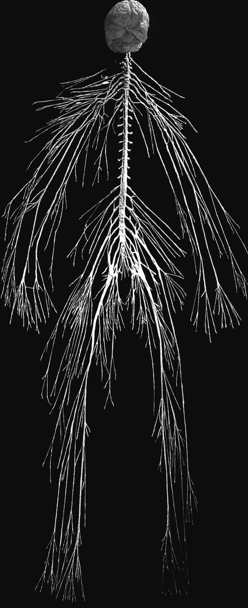

(\#fig:nervoussystem)(ref:nervous)

The nervous system derives its name from nerves, which are cylindrical bundles of fibers (the axons of neurons), that emanate from the brain and spinal cord, and branch repeatedly to innervate every part of the body. Nerves are large enough to have been recognized by the ancient Egyptians, Greeks, and Romans, but their internal structure was not understood until it became possible to examine them using a microscope.

(ref:nerve) Transverse section of a nerve. a) a single nerve fibre (axon) surrounded by a thick layer of myelin. c) an interstitial cell. [Histologie du système nerveux de l'homme & des vertébrés, Tome Premier](https://wellcomelibrary.org/item/b2129592x#?c=0&m=0&s=0&cv=14&z=0%2C-3.48%2C1%2C8.6591) (1909) by Santiago Ramón y Cajal translated from Spanish by Dr. L. Azoulay.

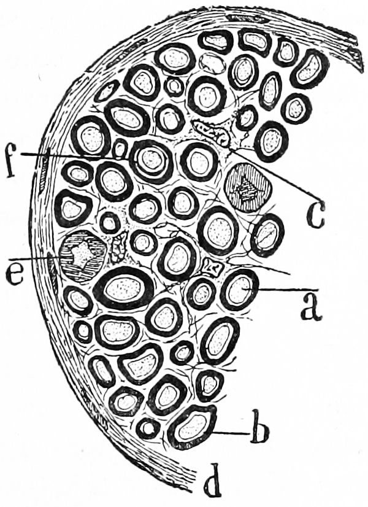

(\#fig:nervesection)(ref:nerve)

The study of the anatomy of the nervous system is neuroanatomy. The first known written record of a study of the anatomy of the human brain is an ancient Egyptian document, the Edwin Smith Papyrus. The next major development in neuroanatomy came from the Greek Alcmaeon, who determined that the brain and not the heart ruled the body, and that the senses were dependent on the brain.

After Alcmaeon’s findings, many scientists, philosophers, and physicians from around the world continued to contribute to the understanding of neuroanatomy, notably: Galen, Herophilus, Rhazes and Erasistratus. Herophilus and Erasistratus of Alexandria were perhaps the most influential Greek neuroscientists with their studies involving dissecting brains. For several hundred years afterward, with the cultural taboo of dissection, no major progress occurred in neuroscience. However, Pope Sixtus IV effectively revitalized the study of neuroanatomy by altering the papal policy and allowing human dissection. This resulted in a boom of research in neuroanatomy by artists and scientists of the Renaissance.

In 1664, Thomas Willis, a physician and professor at Oxford University, coined the term neurology when he published his text Cerebri anatome which is considered the foundation of neuroanatomy. The subsequent three hundred and fifty some years has produced a great deal of documentation and study of the neural system.

(ref:vesalius) A drawing of the view of the brain by [Andreas Vesalius](https://en.wikipedia.org/wiki/Andreas_Vesalius)  (31 December 1514 – 15 October 1564). Vesalius was a 16th-century Flemish anatomist, physician, and author of one of the most influential books on human anatomy, De humani corporis fabrica (On the Fabric of the Human Body). Vesalius is often referred to as the founder of modern human anatomy. He was born in Brussels, which was then part of the Habsburg Netherlands. He was professor at the University of Padua and later became Imperial physician at the court of Emperor Charles V. Andreas Vesalius is the Latinized form of the Dutch Andries van Wesel. It was a common practice among European scholars in his time to Latinize their names. 

(\#fig:braincase)(ref:vesalius)

The discovery of a staining technique called black reaction by the Italian biologist and pathologist [Camillo Golgi](https://en.wikipedia.org/wiki/Camillo_Golgi) (7 July 1843 – 21 January 1926) in 1873 was was a major breakthrough in neuroscience. This staining technique is now simply referred to as the Golgi stain. This new method was used with great success by the the Spanish biologist [Santiago Ramón y Cajal](https://en.wikipedia.org/wiki/Santiago_Ramón_y_Cajal) who together with Golgi was given the Nobel Prize in Physiology or Medicine 1906 "in recognition of their work on the structure of the nervous system". Cajal's original investigations of the microscopic structure of the brain made him a pioneer of modern neuroscience. Many of his drawings illustrating the delicate arborizations ("tree growing") of brain cells are included in this text. Cajal discovered the axonal growth cone, and demonstrated experimentally that the relationship between nerve cells was not continuous, but contiguous. This provided definitive evidence for what [Heinrich Waldeyer](https://en.wikipedia.org/wiki/Heinrich_Wilhelm_Gottfried_von_Waldeyer-Hartz) coined the term neuron theory as opposed to the reticular theory (ironically promoted by Golgi whose staining technique was used by Cajal). This is now widely considered the foundation of modern neuroscience.

(ref:golgi) [The first illustration by Golgi of a Golgi impregnated preparation of the nervous system. “Semi-schematic drawing of a fragment of a vertical section of the olfactory bulb of a dog”.](https://www.frontiersin.org/articles/10.3389/fnana.2015.00014/full).

(\#fig:golgifig)(ref:golgi)

The cells in nervous tissue are densely packed and little information on their structures and interconnections can be obtained if all the cells are stained. Furthermore, the thin filamentary extensions of neural cells, including the axon and the dendrites of neurons, are too slender and transparent to be seen with normal staining techniques. Golgi's method stains a limited number of cells at random in their entirety. The mechanism by which this happens is still largely unknown. Dendrites, as well as the cell soma, are clearly stained in brown and black and can be followed in their entire length, which allowed neuroanatomists to track connections between neurons and to make visible the complex networking structure of many parts of the brain and spinal cord.

While the fact that the Golgi method stains only a limited number of neurons allowed the fine structure of the nervous system to be studied in great detail, it limits scientists' ability to delineate the "connectome" of the brain. A connectome is a comprehensive map of neural connections in the brain, and may be thought of as its "wiring diagram". More broadly, a connectome would include the mapping of all neural connections within an organism's nervous system. 
In 2007, a team led by Jeff W. Lichtman and Joshua R. Sanes created a novel technique called "[brainbow](https://en.wikipedia.org/wiki/Brainbow)". Brainbow is a process by which individual neurons in the brain can be distinguished from neighboring neurons using fluorescent proteins. By randomly expressing different ratios of red, green, and blue derivatives of green fluorescent protein in individual neurons, it is possible to flag each neuron with a distinctive color. This process has been a major contribution to the field of connectomics, traditionally known as hodology.

(ref:bow) [A brainbow of mouse neurons.](https://commons.wikimedia.org/wiki/File:Brainbow_(Smith_2007).jpg)

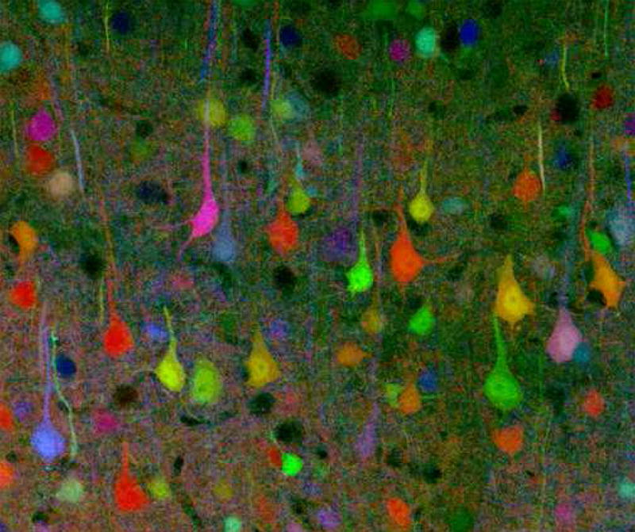

(\#fig:brainbow)(ref:bow)

Neuroscience (or neurobiology) is a multidisciplinary branch of biology that combines physiology, anatomy, molecular biology, developmental biology, cytology, mathematical modeling, and psychology to understand the fundamental and emergent properties of neurons and neural circuits. The understanding of the biological basis of learning, memory, behavior, perception, and consciousness has been described as the "ultimate challenge" of the biological sciences. The human brain is often referred to as the most complicated structure in the universe. The scope of neuroscience has broadened over time to include different approaches used to study the nervous system at different scales and the techniques used by neuroscientists have expanded enormously, from molecular and cellular studies of individual neurons to imaging of sensory, motor and cognitive tasks in the brain. Malfunction of the nervous system can occur as a result of genetic defects, physical damage due to trauma or toxicity, infection or simply of ageing. The medical specialty of neurology studies disorders of the nervous system and looks for interventions that can prevent or treat them. Although mental illnesses are believed by many to be neurological disorders affecting the central nervous system, traditionally they are classified separately, and treated by psychiatrists.

Nervous systems are found in most multicellular animals, but vary greatly in complexity. The only multicellular animals that have no nervous system at all are sponges, placozoans, and mesozoans, which have very simple body plans. However, even sponges, unicellular animals, and even protists such as slime molds have cell-to-cell signalling mechanisms that are precursors to those of neurons. The nervous systems of the radially symmetric organisms ctenophores (comb jellies) and cnidarians (which include anemones, hydras, corals and jellyfish) consist of a diffuse nerve net. All other animal species, with the exception of a few types of worm, have a nervous system containing a brain, a central cord (or two cords running in parallel), and nerves radiating from the brain and central cord. The size of the nervous system ranges from a few hundred cells in the simplest worms, to around 300 billion cells in African elephants.

Nervous tissue first arose in wormlike organisms about 550 to 600 million years ago. In humans and other vertebrates it consists of two main parts, the central nervous system (CNS) and the peripheral nervous system (PNS). The CNS consists of the brain and spinal cord. The PNS consists mainly of nerves, which are enclosed bundles of the long fibers or axons, that connect the CNS to every other part of the body. Nerves that transmit signals from the brain are called motor or efferent nerves, while those nerves that transmit information from the body to the CNS are called sensory or afferent. Spinal nerves serve both functions and are called mixed nerves. The PNS is divided into three separate subsystems, the somatic, autonomic, and enteric nervous systems. Somatic nerves carry sensory information from the periphery to the CNS and signals for voluntary movement from the CNS to the muscles. The autonomic nervous system is further subdivided into the sympathetic and the parasympathetic nervous systems. The sympathetic nervous system is activated in cases of emergencies to mobilize energy, while the parasympathetic nervous system is activated when organisms are in a relaxed state. The enteric nervous system functions to control the gastrointestinal system. Both autonomic and enteric nervous systems function involuntarily. Nerves that exit from the cranium are called cranial nerves while those exiting from the spinal cord are called spinal nerves.

## The Cells Of The Nervous System

At the cellular level, the nervous system is defined by the presence of a special type of cell, called the neuron, also known as a nerve cell. Neurons have special structures that allow them to receive and send signals from and to other cells. They send these signals in the form of electrochemical waves traveling along thin fibers called axons, which cause chemicals called neurotransmitters to be released at junctions called synapses. Neurons usually receive signalls at tree-like processes called dendrites. A cell that receives a synaptic signal from another neuron may be excited, inhibited, or otherwise modulated. The connections between neurons can form neural pathways, neural circuits, and larger networks that generate an organism's perception of the world and determine its behavior. Along with neurons, the nervous system contains other specialized cells called glial cells (or simply glia), which provide structural and metabolic support.

(ref:pyramid) A nerve cell from the cerebral cortex of a rabbit. Notice the extensive tree of dendrites at the top, the long axon at the bottom. Because of the pyramid-like shape of the cell body, this type of neuron is referred to as a pyramidal cell. 

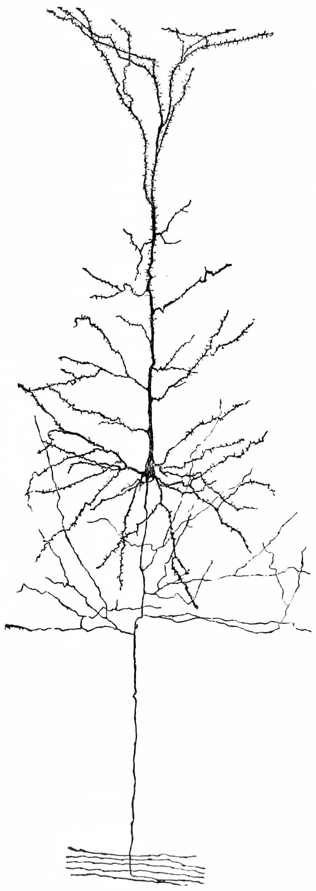

(\#fig:pyramidalcell)(ref:pyramid)

Even in the nervous system of a single species such as humans, hundreds of different types of neurons exist, with a wide variety of morphologies and functions. These include sensory neurons that convert physical stimuli such as light and sound into neural signals, and motor neurons that activate muscles or glands; however in many species the great majority of neurons participate in the formation of centralized structures (the brain and ganglia) and they receive all of their input from other neurons and send their output to other neurons.

Glial cells (named from the Greek for "glue") are non-neuronal cells that provide support and nutrition, maintain homeostasis, form myelin, and participate in signal transmission in the nervous system. In the human brain, it is estimated that the total number of glia roughly equals the number of neurons, although the proportions vary in different brain areas. Among the most important functions of glial cells are to support neurons and hold them in place; to supply nutrients to neurons; to insulate neurons electrically; to destroy pathogens and remove dead neurons; and to provide guidance cues directing the axons of neurons to their targets. A very important type of glial cell (oligodendrocytes in the central nervous system, and Schwann cells in the peripheral nervous system) generates layers of a fatty substance called myelin that wraps around axons and provides electrical insulation which allows them to transmit action potentials much more rapidly and efficiently. Microglia serve as important resident immune cells within the central nervous system.

## Comparative Anatomy And Evolution Of Nervous Systems

Porifera (sponges) have no cells connected to each other by synaptic junctions, that is, no neurons, and therefore no nervous system. They do, however, have homologs of many genes that play key roles in synaptic function. Recent studies have shown that sponge cells express a group of proteins that cluster together to form a structure resembling a postsynaptic density (the signal-receiving part of a synapse). However, the function of this structure is currently unclear. Although sponge cells do not show synaptic transmission, they do communicate with each other via calcium waves and other impulses, which mediate some simple actions such as whole-body contraction.

Radiata such as the cnidaria (jellyfish) and ctenophora (comb jellies) have diffuse nerve nets rather than a central nervous system. In most jellyfish the nerve net is spread more or less evenly across the body; in comb jellies it is concentrated near the mouth. The nerve nets consist of sensory neurons, which pick up chemical, tactile, and visual signals; motor neurons, which can activate contractions of the body wall; and intermediate neurons, which detect patterns of activity in the sensory neurons and, in response, send signals to groups of motor neurons. In some cases groups of intermediate neurons are clustered into discrete ganglia.

The development of the nervous system in radiata is relatively unstructured. Unlike bilaterians, radiata only have two primordial cell layers, endoderm and ectoderm. Neurons are generated from a special set of ectodermal precursor cells, which also serve as precursors for every other ectodermal cell type.

The vast majority of existing animals are bilaterians, meaning animals with left and right sides that are approximate mirror images of each other. All bilateria are thought to have descended from a common wormlike ancestor that appeared in the Ediacaran period, 550–600 million years ago. The fundamental bilaterian body form is a tube with a hollow gut cavity running from mouth to anus, and a nerve cord with an enlargement (a "ganglion") for each body segment, with an especially large ganglion at the front, called the "brain".

(ref:invertebrate) Comparison of nervous systems of invertebrates. Top left: A diffuse nerve net in *Actinia* (a genus of sea anemones in the family *Actiniidae* in the phylum *Cnidaria*); top right: The nervous system of *Anadonta anatina*, a freshwater mussel in the family *Unionidae* in the phylum *Mollusca*. c, foot; k, pedal ganglion; i, cerebro-pedal connective; g, cerebral ganglion; h, cerebral connective; a, anterior adductor muscle; r, q, anterior pallial nerves; d, liver; s, visceral nerve; l, cerebro-visceral connective; e, gill; f, edge of mantle; n, branchial nerves; m, visceral ganglion; o, posterior pallial nerves; b, posterior adductor muscle; p, lateral pallial nerves; bottom left: the nervous system of *Alitta virens*, a polychaete worm in the phylum *Annelida*. J, jaws; b, antennal nerves; c, palpal nerves; f, ganglia for the dorsal peristomial cirri; n^1^ , ganglion; n, nerves for the dissepimenta; m, parapodial nerves; i, parapodial branch; h, ventral chain of ganglia; C, cerebral ganglion; o, nerve passing through dissepiment to preceding segment; k, parapodial ganglion. Bottom right: the nervous system of an insect (*Arthropoda*). From [Morphology of invertebrate types, by Alexander Petrunkevitch. New York, Macmillan company, 1916.](https://www.biodiversitylibrary.org/ia/morphologyofinve00petr#page/7/mode/1up)  

(\#fig:invertebratenervoussystem)(ref:invertebrate)

Even mammals, including humans, show the segmented bilaterian body plan at the level of the nervous system. The spinal cord contains a series of segmental ganglia, each giving rise to motor and sensory nerves that innervate a portion of the body surface and underlying musculature. On the limbs, the layout of the innervation pattern is complex, but on the trunk it gives rise to a series of narrow bands. The top three segments belong to the brain, giving rise to the forebrain, midbrain, and hindbrain.

Bilaterians can be divided, based on events that occur very early in embryonic development, into two groups (superphyla) called protostomes and deuterostomes. Deuterostomes include vertebrates as well as echinoderms, hemichordates (mainly acorn worms), and Xenoturbellidans. Protostomes, the more diverse group, include arthropods, molluscs, and numerous types of worms. There is a basic difference between the two groups in the placement of the nervous system within the body: protostomes possess a nerve cord on the ventral (usually bottom) side of the body, whereas in deuterostomes the nerve cord is on the dorsal (usually top) side. In fact, numerous aspects of the body are inverted between the two groups, including the expression patterns of several genes that show dorsal-to-ventral gradients. Most anatomists now consider that the bodies of protostomes and deuterostomes are "flipped over" with respect to each other, a hypothesis that was first proposed by Geoffroy Saint-Hilaire for insects in comparison to vertebrates. Thus insects, for example, have nerve cords that run along the ventral midline of the body, while all vertebrates have spinal cords that run along the dorsal midline.

There are a few types of existing bilaterians that lack a recognizable brain, including echinoderms and tunicates. It has not been definitively established whether the existence of these brainless species indicates that the earliest bilaterians lacked a brain, or whether their ancestors evolved in a way that led to the disappearance of a previously existing brain structure.

The diversity of invertebrate body plans is matched by an equal diversity in brain structures. Two groups of invertebrates have notably complex brains: arthropods (insects, crustaceans, arachnids, and others), and cephalopods (octopuses, squids, and similar molluscs). The brains of arthropods and cephalopods arise from twin parallel nerve cords that extend through the body of the animal. Arthropods have a central brain, the supraesophageal ganglion, with three divisions and large optical lobes behind each eye for visual processing. Cephalopods such as the octopus and squid have the largest brains of any invertebrates.

There are several invertebrate species whose brains have been studied intensively because they have properties that make them convenient for experimental work:

* Fruit flies (*Drosophila melanogaster*), because of the large array of techniques available for studying their genetics, have been a natural subject for studying the role of genes in brain development. In spite of the large evolutionary distance between insects and mammals, many aspects of *Drosophila* neurogenetics have been shown to be relevant to humans. The first biological clock genes, for example, were identified by examining *Drosophila* mutants that showed disrupted daily activity cycles. A search in the genomes of vertebrates revealed a set of analogous genes, which were found to play similar roles in the mouse biological clock—and therefore almost certainly in the human biological clock as well. Studies done on Drosophila, also show that most neuropil regions of the brain are continuously reorganized throughout life in response to specific living conditions.
* The nematode worm *Caenorhabditis elegans*, like Drosophila, has been studied largely because of its importance in genetics. In the early 1970s, [Sydney Brenner](https://en.wikipedia.org/wiki/Sydney_Brenner) chose it as a model organism for studying the way that genes control development. One of the advantages of working with this worm is that the body plan is very stereotyped: the nervous system of the hermaphrodite contains exactly 302 neurons, always in the same places, making identical synaptic connections in every worm. Brenner's team sliced worms into thousands of ultrathin sections and photographed each one under an electron microscope, then visually matched fibers from section to section, to map out every neuron and synapse in the entire body. The complete neuronal wiring diagram of *C. elegans* – its connectome was achieved. Nothing approaching this level of detail is available for any other organism, and the information gained has enabled a multitude of studies that would otherwise have not been possible.
* The sea slug *Aplysia californica* was chosen by Nobel Prize-winning neurophysiologist [Eric Kandel](https://en.wikipedia.org/wiki/Eric_Kandel) as a model for studying the cellular basis of learning and memory, because of the simplicity and accessibility of its nervous system, and it has been examined in hundreds of experiments.

Worms are the simplest bilaterian animals, and reveal the basic structure of the bilaterian nervous system in the most straightforward way. As an example, earthworms have dual nerve cords running along the length of the body and merging at the tail and the mouth. These nerve cords are connected by transverse nerves like the rungs of a ladder. These transverse nerves help coordinate the two sides of the animal. Two ganglia at the head (the "nerve ring") end function similar to a simple brain. Photoreceptors on the animal's eyespots provide sensory information on light and dark.

Arthropods, such as insects and crustaceans, have a nervous system made up of a series of ganglia, connected by a ventral nerve cord made up of two parallel connectives running along the length of the belly. Typically, each body segment has one ganglion on each side, though some ganglia are fused to form the brain and other large ganglia. The head segment contains the brain, also known as the supraesophageal ganglion. In the insect nervous system, the brain is anatomically divided into the protocerebrum, deutocerebrum, and tritocerebrum. Immediately behind the brain is the subesophageal ganglion, which is composed of three pairs of fused ganglia. It controls the mouthparts, the salivary glands and certain muscles. Many arthropods have well-developed sensory organs, including compound eyes for vision and antennae for olfaction and pheromone sensation. The sensory information from these organs is processed by the brain.

In insects, many neurons have cell bodies that are positioned at the edge of the brain and are electrically passive—the cell bodies serve only to provide metabolic support and do not participate in signalling. A protoplasmic fiber runs from the cell body and branches profusely, with some parts transmitting signals and other parts receiving signals. Thus, most parts of the insect brain have passive cell bodies arranged around the periphery, while the neural signal processing takes place in a tangle of protoplasmic fibers called neuropil, in the interior.

Brains are most simply compared in terms of their size. The relationship between brain size, body size and other variables has been studied across a wide range of vertebrate species. As a rule, brain size increases with body size, but not in a simple linear proportion. In general, smaller animals tend to have larger brains, measured as a fraction of body size. For mammals, the relationship between brain volume and body mass essentially follows a power law with an exponent of about 0.75. This formula describes the central tendency, but every family of mammals departs from it to some degree, in a way that reflects in part the complexity of their behavior. For example, primates have brains 5 to 10 times larger than the formula predicts. Predators tend to have larger brains than their prey, relative to body size.

All vertebrate brains share a common underlying form, which appears most clearly during early stages of embryonic development. In its earliest form, the brain appears as three swellings at the front end of the neural tube; these swellings eventually become the forebrain, midbrain, and hindbrain (the prosencephalon, mesencephalon, and rhombencephalon, respectively). At the earliest stages of brain development, the three areas are roughly equal in size. In many classes of vertebrates, such as fish and amphibians, the three parts remain similar in size in the adult, but in mammals the forebrain becomes much larger than the other parts, and the midbrain becomes very small.

(ref:vertebrate) Dorsal views of the central nervous systems of the teleosts (from left to right) *Trigla hirundo* (a) and *Mola mola*, the urodele *Ambystoma tigrinum*, the anuran *Xenopus laevis*, the tortoise *Testudo hermanni*, the tegu lizard *Tupinambis teguixin*, the pigeon, the cat and human. In a, c, d, e, f, g and j the full length of the spinalcord, including the filum terminale (where present) is shown; in *Mola mola* and the cat most of the filum terminale is cut. Vertical black bars correspond to 1 cm in length. Modified from [Nieuwenhuys, R., ten Donkelaar, H. J., & Nicholson, C. (1998). The Meaning of It All. The Central Nervous System of Vertebrates, 2135–2195](https://doi.org/10.1007/978-3-642-18262-4_24) 

(\#fig:vertebratecns)(ref:vertebrate)

The brains of vertebrates are made of very soft tissue. Living brain tissue is pinkish on the outside and mostly white on the inside, with subtle variations in color. Vertebrate brains are surrounded by a system of connective tissue membranes called meninges that separate the skull from the brain. Blood vessels enter the central nervous system through holes in the meningeal layers. The cells in the blood vessel walls are joined tightly to one another, forming the blood–brain barrier, which blocks the passage of many toxins and pathogens (though at the same time blocking antibodies and some drugs, thereby presenting special challenges in treatment of diseases of the brain).

Neuroanatomists usually divide the vertebrate brain into six main regions: the telencephalon (cerebral hemispheres), diencephalon (thalamus and hypothalamus), mesencephalon (midbrain), cerebellum, pons, and medulla oblongata. Each of these areas has a complex internal structure. Some parts, such as the cerebral cortex and the cerebellar cortex, consist of layers that are folded or convoluted to fit within the available space. Other parts, such as the thalamus and hypothalamus, consist of clusters of many small nuclei. Thousands of distinguishable areas can be identified within the vertebrate brain based on fine distinctions of neural structure, chemistry, and connectivity.

There is an anatomical convention that a cluster of neurons in the brain or spinal cord is called a nucleus, whereas a cluster of neurons in the periphery is called a ganglion. There are, however, a few exceptions to this rule, notably including the part of the forebrain called the basal ganglia.

Although the same basic components are present in all vertebrate brains, some branches of vertebrate evolution have led to substantial distortions of brain geometry, especially in the forebrain area. The brain of a shark shows the basic components in a straightforward way, but in teleost fishes (the great majority of existing fish species), the forebrain has become "everted", like a sock turned inside out. In birds, there are also major changes in forebrain structure. These distortions can make it difficult to match brain components from one species with those of another species.

Here is a list of some of the most important vertebrate brain components, along with a brief description of their functions as currently understood:

* The medulla, along with the spinal cord, contains many small nuclei involved in a wide variety of sensory and involuntary motor functions such as vomiting, heart rate and digestive processes.
* The pons lies in the brainstem directly above the medulla. Among other things, it contains nuclei that control often voluntary but simple acts such as sleep, respiration, swallowing, bladder function, equilibrium, eye movement, facial expressions, and posture.
* The hypothalamus is a small region at the base of the forebrain, whose complexity and importance belies its size. It is composed of numerous small nuclei, each with distinct connections and neurochemistry. The hypothalamus is engaged in additional involuntary or partially voluntary acts such as sleep and wake cycles, eating and drinking, and the release of some hormones.
* The thalamus is a collection of nuclei with diverse functions: some are involved in relaying information to and from the cerebral hemispheres, while others are involved in motivation. The subthalamic area (zona incerta) seems to contain action-generating systems for several types of "consummatory" behaviors such as eating, drinking, defecation, and copulation.
* The cerebellum modulates the outputs of other brain systems, whether motor related or thought related, to make them certain and precise. Removal of the cerebellum does not prevent an animal from doing anything in particular, but it makes actions hesitant and clumsy. This precision is not built-in, but learned by trial and error. The muscle coordination learned while riding a bicycle is an example of a type of neural plasticity that may take place largely within the cerebellum. 10% of the brain's total volume consists of the cerebellum and 50% of all neurons are held within its structure.
* The optic tectum allows actions to be directed toward points in space, most commonly in response to visual input. In mammals it is usually referred to as the superior colliculus, and its best-studied function is to direct eye movements. It also directs reaching movements and other object-directed actions. It receives strong visual inputs, but also inputs from other senses that are useful in directing actions, such as auditory input in owls and input from the thermosensitive pit organs in snakes. In some primitive fishes, such as lampreys, this region is the largest part of the brain. The superior colliculus is part of the midbrain.
* The pallium is a layer of gray matter that lies on the surface of the forebrain and is the most complex and most recent evolutionary development of the brain as an organ. In reptiles and mammals, it is called the cerebral cortex. Multiple functions involve the pallium, including smell and spatial memory. In mammals, where it becomes so large as to dominate the brain, it takes over functions from many other brain areas. In many mammals, the cerebral cortex consists of folded bulges called gyri that create deep furrows or fissures called sulci. The folds increase the surface area of the cortex and therefore increase the amount of gray matter and the amount of information that can be stored and processed.
* The hippocampus, strictly speaking, is found only in mammals. However, the area it derives from, the medial pallium, has counterparts in all vertebrates. There is evidence that this part of the brain is involved in complex events such as spatial memory and navigation in fishes, birds, reptiles, and mammals.
* The basal ganglia are a group of interconnected structures in the forebrain. The primary function of the basal ganglia appears to be action selection: they send inhibitory signals to all parts of the brain that can generate motor behaviors, and in the right circumstances can release the inhibition, so that the action-generating systems are able to execute their actions. Reward and punishment exert their most important neural effects by altering connections within the basal ganglia.
* The olfactory bulb is a special structure that processes olfactory sensory signals and sends its output to the olfactory part of the pallium. It is a major brain component in many vertebrates, but is greatly reduced in humans and other primates (whose senses are dominated by information acquired by sight rather than smell).

The most obvious difference between the brains of mammals and other vertebrates is in terms of size. On average, a mammal has a brain roughly twice as large as that of a bird of the same body size, and ten times as large as that of a reptile of the same body size.

Size, however, is not the only difference: there are also substantial differences in shape. The hindbrain and midbrain of mammals are generally similar to those of other vertebrates, but dramatic differences appear in the forebrain, which is greatly enlarged and also altered in structure. The cerebral cortex is the part of the brain that most strongly distinguishes mammals. In non-mammalian vertebrates, the surface of the cerebrum is lined with a comparatively simple three-layered structure called the pallium. In mammals, the pallium evolves into a complex six-layered structure called neocortex or isocortex. Several areas at the edge of the neocortex, including the hippocampus and amygdala, are also much more extensively developed in mammals than in other vertebrates.

The elaboration of the cerebral cortex carries with it changes to other brain areas. The superior colliculus, which plays a major role in visual control of behavior in most vertebrates, shrinks to a small size in mammals, and many of its functions are taken over by visual areas of the cerebral cortex. The cerebellum of mammals contains a large portion (the neocerebellum) dedicated to supporting the cerebral cortex, which has no counterpart in other vertebrates.

The brains of humans and other primates contain the same structures as the brains of other mammals, but are generally larger in proportion to body size. The encephalization quotient (EQ) is used to compare brain sizes across species. It takes into account the nonlinearity of the brain-to-body relationship. Humans have an average EQ in the 7-to-8 range, while most other primates have an EQ in the 2-to-3 range. Dolphins have values higher than those of primates other than humans, but nearly all other mammals have EQ values that are substantially lower.

(ref:mammalian) Variability of brain size and external topography. Photographs and weights of the brains of different species. Primates: human (Homo sapiens, 1.176 kg), chimpanzee (Pan troglodytes, 273 g), baboon (Papio cynocephalus, 151 g), mandrill (Mandrillus sphinx, 123 g), macaque (Macaca tonkeana, 110 g). Carnivores: bear (Ursus arctos, 289 g), lion (Panthera leo, 165 g), cheetah (Acinonyx jubatus, 119 g), dog (Canis familiaris, 95 g), cat (Felis catus, 32 g). Artiodactyls: giraffe (Giraffa camelopardalis, 700 g), kudu (Tragelaphus strepsiceros, 166 g), mouflon (Ovis musimon, 118 g), ibex (Capra pyrenaica, 115 g); peccary (Tayassu pecari, 41 g). Marsupials: wallaby (Protemnodon rufogrisea, 28 g). Lagomorphs: rabbit (Oryctolagus cuniculus, 5.2 g). Rodents: rat (Rattus rattus, 2.6 g), mouse (Mus musculus, 0.5 g). The chimpanzee brain was kindly supplied by Dr. Dean Falk. The rest of non-human brains were from material used in Ballesteros-Yánez et al., 2005). Scale bar: 5 cm. From [DeFelipe J (2011) The evolution of the brain, the human nature of cortical circuits, and intellectual creativity. Front. Neuroanat. 5:29](https://www.frontiersin.org/article/10.3389/fnana.2011.00029)

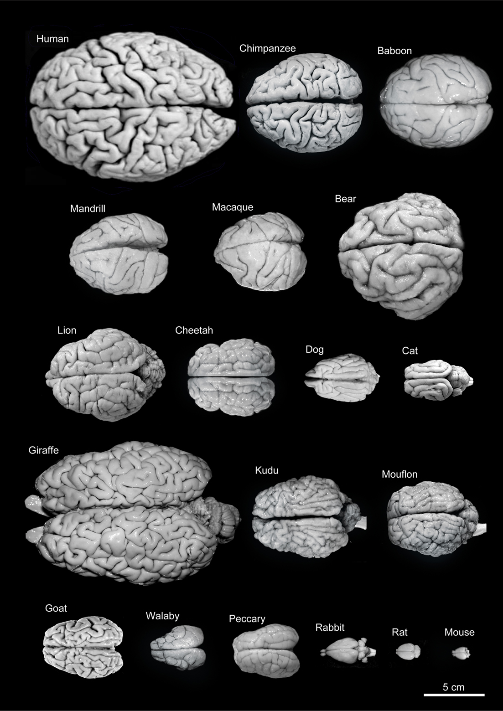

(\#fig:mammaliancns)(ref:mammalian)

Most of the enlargement of the primate brain comes from a massive expansion of the cerebral cortex, especially the prefrontal cortex and the parts of the cortex involved in vision. The visual processing network of primates includes at least 30 distinguishable brain areas, with a complex web of interconnections. It has been estimated that visual processing areas occupy more than half of the total surface of the primate neocortex. The prefrontal cortex carries out functions that include planning, working memory, motivation, attention, and executive control. It takes up a much larger proportion of the brain for primates than for other species, and an especially large fraction of the human brain.

The peripheral nervous system (PNS) is a collective term for the nervous system structures that do not lie within the CNS. The large majority of the axon bundles called nerves are considered to belong to the PNS, even when the cell bodies of the neurons to which they belong reside within the brain or spinal cord. The PNS is divided into somatic and visceral parts. The somatic part consists of the nerves that innervate the skin, joints, and muscles. The cell bodies of somatic sensory neurons lie in dorsal root ganglia of the spinal cord. The visceral part, also known as the autonomic nervous system, contains neurons that innervate the internal organs, blood vessels, and glands. The autonomic nervous system itself consists of two parts: the sympathetic nervous system and the parasympathetic nervous system. Some authors also include sensory neurons whose cell bodies lie in the periphery (for senses such as hearing) as part of the PNS; others, however, omit them.

The vertebrate nervous system can also be divided into areas called gray matter and white matter. Gray matter (which is only gray in preserved tissue, and is better described as pink or light brown in living tissue) contains a high proportion of cell bodies of neurons. White matter is composed mainly of myelinated axons, and takes its color from the myelin. White matter includes all of the nerves, and much of the interior of the brain and spinal cord. Gray matter is found in clusters of neurons in the brain and spinal cord, and in cortical layers that line their surfaces. 

## The Human Brain

The adult human brain weighs on average about 1.2–1.4 kg (2.6–3.1 lb) which is about 2% of the total body weight, with a volume of around 1260 cm^3^ in men and 1130 cm^3^ in women. There is substantial individual variation, with the standard reference range for men being 1,180–1,620 g (2.60–3.57 lb) and for women 1,030–1,400 g (2.27–3.09 lb).

The human brain is divided into nearly symmetrical left and right hemispheres by a deep groove, the longitudinal fissure. Each hemisphere is conventionally divided into four main lobes; the frontal lobe, parietal lobe, temporal lobe, and occipital lobe, named according to the skull bones that overlie them. The surface of the brain is folded into ridges (gyri) and grooves (sulci), many of which are named, usually according to their position, such as the frontal gyrus of the frontal lobe or the central sulcus separating the central regions of the hemispheres. There are many small variations in the secondary and tertiary folds.

(ref:lobes) Principal lobes and fissures of the cerebrum viewed laterally. From [Gray Henry, Anatomy of the Human Body. 20^th^ Edition, Lea & Febiger, Philadelphia & New York, 1918](https://archive.org/details/anatomyofhumanbo1918gray/page/n6/mode/2up) 

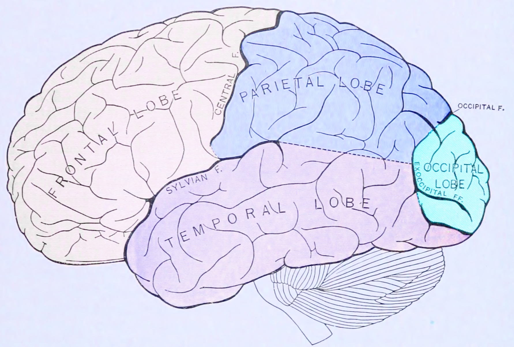

(\#fig:principallobes)(ref:lobes)

(ref:gyril) Diagram showing a lateral view of the ridges (gyri) and grooves (sulci) of the left hemisphere of the brain. From [Gray Henry, Anatomy of the Human Body. 20^th^ Edition, Lea & Febiger, Philadelphia & New York, 1918](https://archive.org/details/anatomyofhumanbo1918gray/page/n6/mode/2up) 

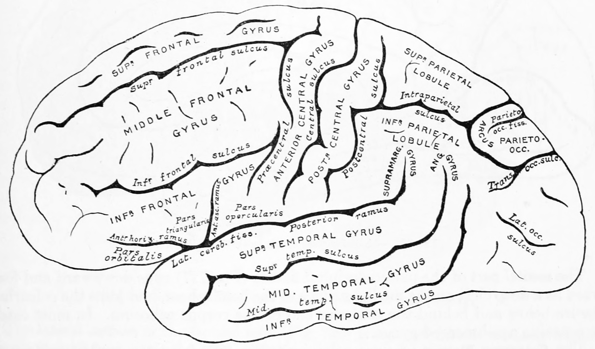

(\#fig:gyrilateral)(ref:gyril)

(ref:gyrim) Diagram showing a medial view of the ridges (gyri) and grooves (sulci) of the left hemisphere of the brain. From [Gray Henry, Anatomy of the Human Body. 20^th^ Edition, Lea & Febiger, Philadelphia & New York, 1918](https://archive.org/details/anatomyofhumanbo1918gray/page/n6/mode/2up) 

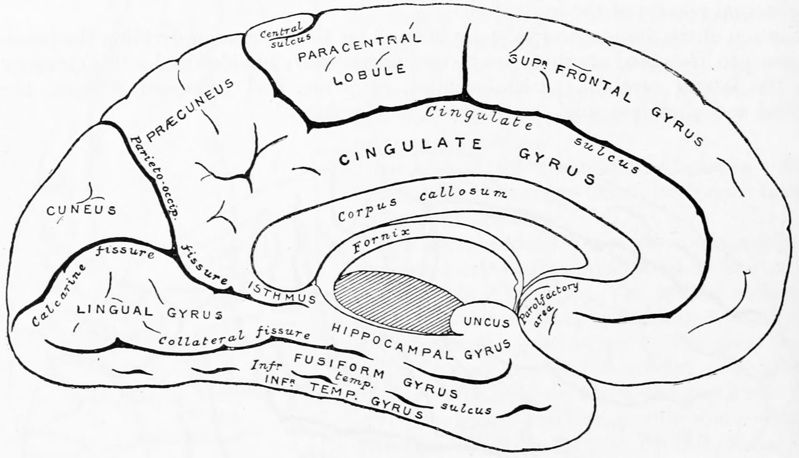

(\#fig:gyrimedial)(ref:gyrim)

(ref:gyrib) Diagram showing a view from the bottom of the ridges (gyri) and grooves (sulci) of the left hemisphere of the brain.

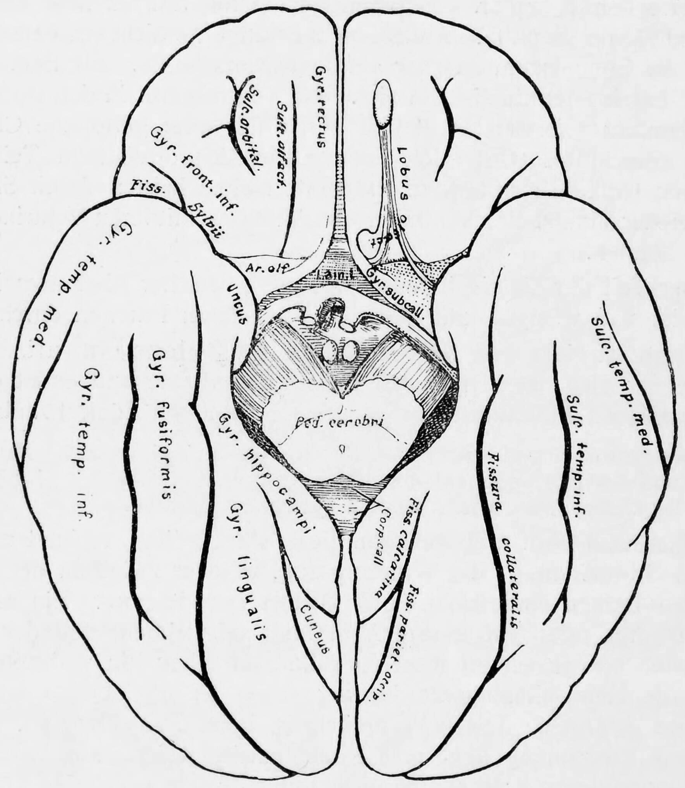

(\#fig:gyribottom)(ref:gyrib)

Although the human brain represents only 2% of the body weight, it receives 15% of the cardiac output, 20% of total body oxygen consumption, and 25% of total body glucose utilization. The brain mostly uses glucose for energy, and deprivation of glucose, as can happen in hypoglycemia, can result in loss of consciousness. The energy consumption of the brain does not vary greatly over time, but active regions of the cortex consume somewhat more energy than inactive regions: this fact forms the basis for the functional brain imaging methods PET and fMRI. These functional imaging techniques provide a three-dimensional image of metabolic activity.

The simplest way to gain information about brain anatomy is by visual inspection, but many more sophisticated techniques have been developed. Brain tissue in its natural state is too soft to work with, but it can be hardened by immersion in alcohol or other fixatives, and then sliced apart for examination of the interior. Visually, the interior of the brain consists of areas of so-called grey matter, with a dark color, separated by areas of white matter, with a lighter color. Further information can be gained by staining slices of brain tissue with a variety of chemicals that bring out areas where specific types of molecules are present in high concentrations. It is also possible to examine the microstructure of brain tissue using a microscope, and to trace the pattern of connections from one brain area to another.

## Development Of The Nervous System

All bilaterian animals at an early stage of development form a gastrula, which is polarized, with one end called the animal pole and the other the vegetal pole. The gastrula has the shape of a disk with three layers of cells, an inner layer called the endoderm, which gives rise to the lining of most internal organs, a middle layer called the mesoderm, which gives rise to the bones and muscles, and an outer layer called the ectoderm, which gives rise to the skin and nervous system.

In vertebrates, the first sign of the nervous system is the appearance of a thin strip of cells along the center of the back, called the neural plate. The inner portion of the neural plate (along the midline) is destined to become the central nervous system (CNS), the outer portion the peripheral nervous system (PNS). As development proceeds, a fold called the neural groove appears along the midline. This fold deepens, and then closes up at the top. At this point the future CNS appears as a cylindrical structure called the neural tube, whereas the future PNS appears as two strips of tissue called the neural crest, running lengthwise above the neural tube. The sequence of stages from neural plate to neural tube and neural crest is known as neurulation.

In the early 20^th^ century, a set of famous experiments by [Hans Spemann](https://en.wikipedia.org/wiki/Hans_Spemann) and [Hilde Mangold](https://en.wikipedia.org/wiki/Hilde_Mangold) showed that the formation of nervous tissue is "induced" by signals from a group of mesodermal cells called the organizer region. For decades, though, the nature of neural induction defeated every attempt to figure it out, until finally it was resolved by genetic approaches in the 1990s. Induction of neural tissue requires inhibition of the gene for a so-called bone morphogenetic protein, or BMP. Specifically the protein BMP4 appears to be involved. Two proteins called Noggin and Chordin, both secreted by the mesoderm, are capable of inhibiting BMP4 and thereby inducing ectoderm to turn into neural tissue. It appears that a similar molecular mechanism is involved for widely disparate types of animals, including arthropods as well as vertebrates. In some animals, however, another type of molecule called Fibroblast Growth Factor or FGF may also play an important role in induction.

Induction of neural tissues causes formation of neural precursor cells, called neuroblasts. In drosophila, neuroblasts divide asymmetrically, so that one product is a "ganglion mother cell" (GMC), and the other is a neuroblast. A GMC divides once, to give rise to either a pair of neurons or a pair of glial cells. In all, a neuroblast is capable of generating an indefinite number of neurons or glia.

One factor common to all bilateral organisms (including humans) is a family of secreted signaling molecules called neurotrophins which regulate the growth and survival of neurons. Because neurotrophins have now been identified in both vertebrate and invertebrates, this evidence suggests that neurotrophins were present in an ancestor common to bilateral organisms and may represent a common mechanism for nervous system formation.

## The Function Of The Nervous System

Organisms need information to solve at least three kinds of problems: (a) to maintain an appropriate environment, i.e., homeostasis; (b) to time activities (e.g., seasonal changes in behavior) or synchronize activities with those of conspecifics; and (c) to locate and respond to resources or threats (e.g., by moving towards resources or evading or attacking threats). Organisms also need to transmit information in order to influence another's behavior: to identify themselves, warn conspecifics of danger, coordinate activities, or deceive.

At the most basic level, the function of the nervous system is to send signals from one cell to others, or from one part of the body to others. There are multiple ways that a cell can send signals to other cells. One is by releasing chemicals called hormones into the internal circulation, so that they can diffuse to distant sites. In contrast to this "broadcast" mode of signaling, the nervous system provides "point-to-point" signals—neurons project their axons to specific target areas and make synaptic connections with specific target cells. Thus, neural signaling is capable of a much higher level of specificity than hormonal signaling. It is also much faster: the fastest nerve signals travel at speeds that exceed 100 meters per second.

At a more integrative level, the primary function of the nervous system is to control the body. It does this by extracting information from the environment using sensory receptors, sending signals that encode this information into the central nervous system, processing the information to determine an appropriate response, and sending output signals to muscles or glands to activate the response. The evolution of a complex nervous system has made it possible for various animal species to have advanced perception abilities such as vision, complex social interactions, rapid coordination of organ systems, and integrated processing of concurrent signals. In humans, the sophistication of the nervous system makes it possible to have language, abstract representation of concepts, transmission of culture, and many other features of human society that would not exist without the human brain.

## The Sensory System

The sensory nervous system is a part of the nervous system responsible for processing sensory information. A sensory system consists of sensory neurons (including the sensory receptor cells), neural pathways, and parts of the brain involved in sensory perception. Commonly recognized sensory systems are those for vision, hearing, touch, taste, smell, and balance. In short, senses are transducers from the physical world to the realm of the mind where we interpret the information, creating our perception of the world around us.

Sensory systems code for four aspects of a stimulus; type (modality), intensity, location, and duration. Arrival time of a sound pulse and phase differences of continuous sound are used for sound localization. Certain receptors are sensitive to certain types of stimuli (for example, different mechanoreceptors respond best to different kinds of touch stimuli, like sharp or blunt objects). Receptors send impulses in certain patterns to send information about the intensity of a stimulus (for example, how loud a sound is). The location of the receptor that is stimulated gives the brain information about the location of the stimulus (for example, stimulating a mechanoreceptor in a finger will send information to the brain about that finger). The duration of the stimulus (how long it lasts) is conveyed by firing patterns of receptors. These impulses are transmitted to the brain through afferent neurons.

While debate exists among neurologists as to the specific number of senses due to differing definitions of what constitutes a sense, Gautama Buddha and Aristotle classified five ‘traditional’ human senses which have become universally accepted: touch, taste, smell, sight, and hearing. Other senses that have been well-accepted in most mammals, including humans, include nociception, equilibrioception, kinaesthesia, and thermoception. Furthermore, some nonhuman animals have been shown to possess alternate senses, including magnetoception and electroreception.

The human sensory system consists of the following subsystems:

* Somatosensory system consists of the receptors, transmitters (pathways) leading to area S1, and area S1 in the cortex that is involved in creating the conscious experience of the sensations labelled as touch or pressure, temperature (warm or cold), pain (including itch and tickle), and the sensations of muscle movement and joint position including posture, movement, and facial expression (collectively also called proprioception)
* Visual system
* Auditory system
* Vestibular system
* Olfactory system
* Gustatory system

The receptive field is the area of the body or environment to which a receptor organ and receptor cells respond. For instance, the part of the world an eye can see, is its receptive field; the light that each rod or cone can see, is its receptive field. Receptive fields have been identified for the visual system, auditory system and somatosensory system.

## The Motor System 

The motor system is the set of central and peripheral structures in the nervous system that support motor functions, i.e. movement. Peripheral structures may include skeletal muscles and neural connections with muscle tissues. Central structures include cerebral cortex, brainstem, spinal cord, pyramidal system including the upper motor neurons, extrapyramidal system, cerebellum, and the lower motor neurons in the brainstem and the spinal cord.

The pyramidal motor system, also called the pyramidal tract or the corticospinal tract, start in the motor center of the cerebral cortex. There are upper and lower motor neurons in the corticospinal tract. The motor impulses originate in the giant pyramidal cells or Betz cells of the motor area; i.e., precentral gyrus of cerebral cortex. These are the upper motor neurons (UMN) of the corticospinal tract. The axons of these cells pass in the depth of the cerebral cortex to the corona radiata and then to the internal capsule passing through the posterior branch of internal capsule and continue to descend in the midbrain and the medulla oblongata. In the lower part of medulla oblongata 80 to 85% of these fibers decussate (pass to the opposite side) and descend in the white matter of the lateral funiculus of the spinal cord on the opposite side. The remaining 15 to 20% pass to the same side. Fibers for the extremities (limbs) pass 100% to the opposite side. The fibers of the corticospinal tract terminate at different levels in the anterior horn of the grey matter of the spinal cord. Here the lower motor neurons (LMN) of the spinal cord are located. Peripheral motor nerves carry the motor impulses from the anterior horn to the voluntary muscles.

The extrapyramidal system is called extrapyramidal to distinguish it from the tracts of the motor cortex that reach their targets by traveling through the pyramids of the medulla. The pyramidal tracts (corticospinal tract and corticobulbar tracts) may directly innervate motor neurons of the spinal cord or brainstem (anterior (ventral) horn cells or certain cranial nerve nuclei), whereas the extrapyramidal system centers on the modulation and regulation (indirect control) of anterior (ventral) horn cells.

Extrapyramidal tracts are chiefly found in the reticular formation of the pons and medulla, and target lower motor neurons in the spinal cord that are involved in reflexes, locomotion, complex movements, and postural control. These tracts are in turn modulated by various parts of the central nervous system, including the nigrostriatal pathway, the basal ganglia, the cerebellum, the vestibular nuclei, and different sensory areas of the cerebral cortex. All of these regulatory components can be considered part of the extrapyramidal system, in that they modulate motor activity without directly innervating motor neurons.

## Neuronal Signalling

Most neurons send signals via their axons, although some types are capable of dendrite-to-dendrite communication. (In fact, the types of neurons in the retina of the eye called amacrine cells have no axons, and communicate only via their dendrites.) Neural signals propagate along an axon in the form of electrochemical waves called action potentials, which produce cell-to-cell signals at points where axon terminals make synaptic contact with other cells.

Synapses may be electrical or chemical. Electrical synapses make direct electrical connections between neurons, but chemical synapses are much more common, and much more diverse in function. At a chemical synapse, the cell that sends signals is called presynaptic, and the cell that receives signals is called postsynaptic. Both the presynaptic and postsynaptic areas are full of molecular machinery that carries out the signalling process. The presynaptic area contains large numbers of tiny spherical vessels called synaptic vesicles, packed with neurotransmitter chemicals. When the presynaptic terminal is electrically stimulated, an array of molecules embedded in the membrane are activated, and cause the contents of the vesicles to be released into the narrow space between the presynaptic and postsynaptic membranes, called the synaptic cleft. The neurotransmitter then binds to receptors embedded in the postsynaptic membrane, causing them to enter an activated state. Depending on the type of receptor, the resulting effect on the postsynaptic cell may be excitatory, inhibitory, or modulatory in more complex ways. For example, release of the neurotransmitter acetylcholine at a synaptic contact between a motor neuron and a muscle cell induces rapid contraction of the muscle cell. The entire synaptic transmission process takes only a fraction of a millisecond, although the effects on the postsynaptic cell may last much longer (even indefinitely, in cases where the synaptic signal leads to the formation of a memory trace).

There are literally hundreds of different types of synapses. In fact, there are over a hundred known neurotransmitters, and many of them have multiple types of receptors. Many synapses use more than one neurotransmitter—a common arrangement is for a synapse to use one fast-acting small-molecule neurotransmitter such as glutamate or GABA, along with one or more peptide neurotransmitters that play slower-acting modulatory roles. Molecular neuroscientists generally divide receptors into two broad groups: chemically gated ion channels and second messenger systems. When a chemically gated ion channel is activated, it forms a passage that allows specific types of ions to flow across the membrane. Depending on the type of ion, the effect on the target cell may be excitatory or inhibitory. When a second messenger system is activated, it starts a cascade of molecular interactions inside the target cell, which may ultimately produce a wide variety of complex effects, such as increasing or decreasing the sensitivity of the cell to stimuli, or even altering gene transcription.

According to a rule called Dale's principle, which has only a few known exceptions, a neuron releases the same neurotransmitters at all of its synapses. This does not mean, though, that a neuron exerts the same effect on all of its targets, because the effect of a synapse depends not on the neurotransmitter, but on the receptors that it activates. Because different targets can (and frequently do) use different types of receptors, it is possible for a neuron to have excitatory effects on one set of target cells, inhibitory effects on others, and complex modulatory effects on others still. Nevertheless, it happens that the two most widely used neurotransmitters, glutamate and GABA, each have largely consistent effects. Glutamate has several widely occurring types of receptors, but all of them are excitatory or modulatory. Similarly, GABA has several widely occurring receptor types, but all of them are inhibitory. Because of this consistency, glutamatergic cells are frequently referred to as "excitatory neurons", and GABAergic cells as "inhibitory neurons". Strictly speaking, this is an abuse of terminology—it is the receptors that are excitatory and inhibitory, not the neurons—but it is commonly seen even in scholarly publications.

One very important subset of synapses are capable of forming memory traces by means of long-lasting activity-dependent changes in synaptic strength. The best-known form of neural memory is a process called long-term potentiation (abbreviated LTP), which operates at synapses that use the neurotransmitter glutamate acting on a special type of receptor known as the NMDA receptor. The NMDA receptor functions as a molecular "conincidence detector": although the NMDA-receptor associated ion-channel opens upon binding of glutamate, extracellular Mg^2+^ ions will enter and block the channel immediately. Only concomitant membrane depolarization (e.g. induced by Na^+^ influx via concomittantly stimulated non-NMDA (AMPA) type glutamate receptors in the same cell), will overcome the Mg^2+^ block and allow Na^+^ and Ca^2+^ ions to enter the cell thourgh the NMDA-receptor. Calcium entering the postsynaptic cell via NMDA receptors then initiates a second messenger cascade that ultimately leads to an increase in the number of AMPA-type glutamate receptors in the target cell, thereby increasing the effective strength of the synapse. This change in strength can last for weeks or longer. Besides the NMDA-receptor based processes, further cellular mechanisms allow of the association between two different input signals converging on the same neuron, in a defined timeframe. Upon a simultaneous increase in the intracellular concentrations of cAMP and Ca2+, a transcriptional coactivator called TORC1 (CRTC1) becomes activated, that converts the temporal coincidence of the two second messengers into long term changes such as LTP. This cellular mechanism, through calcium-dependent adenylate cyclase activation, might also account for the detection of the repetitive stimulation of a given synapse.

In 1949, [Donald Hebb](https://en.wikipedia.org/wiki/Donald_O._Hebb) postulated that synaptic efficiency will increase through repeated and persistent stimulation of a postsynaptic cell by a presynaptic cell. This is often informally summarized as "cells that fire together, wire together". The theory was validated in part by the discovery of long-term potentiation. Studies of LTP on multiple presynaptic cells stimulating a postsynaptic cell uncovered the property of associativity. A weak neuronal stimulation onto a pyramidal neuron may not induce long-term potentiation. However, this same stimulation paired with a simultaneous strong stimulation from another neuron will strengthen both synapses. This process suggests that two neuronal pathways converging on the same cell may both strengthen if stimulated coincidentally.

Since the discovery of LTP in 1973, many other types of synaptic memory traces have been found, involving increases or decreases in synaptic strength that are induced by varying conditions, and last for variable periods of time. The reward system, that reinforces desired behaviour for example, depends on a variant form of LTP that is conditioned on an extra input coming from a reward-signalling pathway that uses dopamine as neurotransmitter. All these forms of synaptic modifiability, taken collectively, give rise to neural plasticity, that is, to a capability for the nervous system to adapt itself to variations in the environment.

## Neural Circuits 

The basic neuronal function of sending signals to other cells includes a capability for neurons to exchange signals with each other. Networks formed by interconnected groups of neurons are capable of a wide variety of functions, including feature detection, pattern generation and timing, and there are seen to be countless types of information processing possible. [Warren McCulloch](https://en.wikipedia.org/wiki/Warren_Sturgis_McCulloch) and [Walter Pitts](https://en.wikipedia.org/wiki/Walter_Pitts) showed in 1943 that even artificial neural networks formed from a greatly simplified mathematical abstraction of a neuron are capable of universal computation.

Historically, for many years the predominant view of the function of the nervous system was as a stimulus-response associator. In this conception, neural processing begins with stimuli that activate sensory neurons, producing signals that propagate through chains of connections in the spinal cord and brain, giving rise eventually to activation of motor neurons and thereby to muscle contraction, i.e., to overt responses. The French philosopher [René Descartes](https://en.wikipedia.org/wiki/René_Descartes) believed that all of the behaviors of animals, and most of the behaviors of humans, could be explained in terms of stimulus-response circuits, although he also believed that higher cognitive functions such as language were not capable of being explained mechanistically. [Charles Sherrington](https://en.wikipedia.org/wiki/Charles_Scott_Sherrington), in his influential 1906 book The Integrative Action of the Nervous System, developed the concept of stimulus-response mechanisms in much more detail, and Behaviorism, the school of thought that dominated Psychology through the middle of the 20^th^ century, attempted to explain every aspect of human behavior in stimulus-response terms.

However, experimental studies of electrophysiology, beginning in the early 20^th^ century and reaching high productivity by the 1940s, showed that the nervous system contains many mechanisms for generating patterns of activity intrinsically, without requiring an external stimulus. Neurons were found to be capable of producing regular sequences of action potentials, or sequences of bursts, even in complete isolation. When intrinsically active neurons are connected to each other in complex circuits, the possibilities for generating intricate temporal patterns become far more extensive. A modern conception views the function of the nervous system partly in terms of stimulus-response chains, and partly in terms of intrinsically generated activity patterns—both types of activity interact with each other to generate the full repertoire of behavior.

## Reflexes And Other Stimulus-Response Circuits

The simplest type of neural circuit is a reflex arc, which begins with a sensory input and ends with a motor output, passing through a sequence of neurons connected in series. This can be shown in the "withdrawal reflex" causing a hand to jerk back after a hot stove is touched. The circuit begins with sensory receptors in the skin that are activated by harmful levels of heat: a special type of molecular structure embedded in the membrane causes heat to change the electrical field across the membrane. If the change in electrical potential is large enough to pass the given threshold, it evokes an action potential, which is transmitted along the axon of the receptor cell, into the spinal cord. There the axon makes excitatory synaptic contacts with other cells, some of which project (send axonal output) to the same region of the spinal cord, others projecting into the brain. One target is a set of spinal interneurons that project to motor neurons controlling the arm muscles. The interneurons excite the motor neurons, and if the excitation is strong enough, some of the motor neurons generate action potentials, which travel down their axons to the point where they make excitatory synaptic contacts with muscle cells. The excitatory signals induce contraction of the muscle cells, which causes the joint angles in the arm to change, pulling the arm away.

In reality, this straightforward schema is subject to numerous complications. Although for the simplest reflexes there are short neural paths from sensory neuron to motor neuron, there are also other nearby neurons that participate in the circuit and modulate the response. Furthermore, there are projections from the brain to the spinal cord that are capable of enhancing or inhibiting the reflex.

Although the simplest reflexes may be mediated by circuits lying entirely within the spinal cord, more complex responses rely on signal processing in the brain. For example, when an object in the periphery of the visual field moves, and a person looks toward it many stages of signal processing are initiated. The initial sensory response, in the retina of the eye, and the final motor response, in the oculomotor nuclei of the brain stem, are not all that different from those in a simple reflex, but the intermediate stages are completely different. Instead of a one or two step chain of processing, the visual signals pass through perhaps a dozen stages of integration, involving the thalamus, cerebral cortex, basal ganglia, superior colliculus, cerebellum, and several brainstem nuclei. These areas perform signal-processing functions that include feature detection, perceptual analysis, memory recall, decision-making, and motor planning.

Feature detection is the ability to extract biologically relevant information from combinations of sensory signals. In the visual system, for example, sensory receptors in the retina of the eye are only individually capable of detecting "points of light" in the outside world. Second-level visual neurons receive input from groups of primary receptors, higher-level neurons receive input from groups of second-level neurons, and so on, forming a hierarchy of processing stages. At each stage, important information is extracted from the signal ensemble and unimportant information is discarded. By the end of the process, input signals representing "points of light" have been transformed into a neural representation of objects in the surrounding world and their properties. The most sophisticated sensory processing occurs inside the brain, but complex feature extraction also takes place in the spinal cord and in peripheral sensory organs such as the retina.

## Intrinsic Pattern Generation

Although stimulus-response mechanisms are the easiest to understand, the nervous system is also capable of controlling the body in ways that do not require an external stimulus, by means of internally generated rhythms of activity. Because of the variety of voltage-sensitive ion channels that can be embedded in the membrane of a neuron, many types of neurons are capable, even in isolation, of generating rhythmic sequences of action potentials, or rhythmic alternations between high-rate bursting and quiescence. When neurons that are intrinsically rhythmic are connected to each other by excitatory or inhibitory synapses, the resulting networks are capable of a wide variety of dynamical behaviors, including attractor dynamics, periodicity, and even chaos. A network of neurons that uses its internal structure to generate temporally structured output, without requiring a corresponding temporally structured stimulus, is called a central pattern generator.

Internal pattern generation operates on a wide range of time scales, from milliseconds to hours or longer. One of the most important types of temporal pattern is circadian rhythmicity—that is, rhythmicity with a period of approximately 24 hours. All animals that have been studied show circadian fluctuations in neural activity, which control circadian alternations in behavior such as the sleep-wake cycle. Experimental studies dating from the 1990s have shown that circadian rhythms are generated by a "genetic clock" consisting of a special set of genes whose expression level rises and falls over the course of the day. Animals as diverse as insects and vertebrates share a similar genetic clock system. The circadian clock is influenced by light but continues to operate even when light levels are held constant and no other external time-of-day cues are available. The clock genes are expressed in many parts of the nervous system as well as many peripheral organs, but in mammals, all of these "tissue clocks" are kept in synchrony by signals that emanate from a master timekeeper in a tiny part of the brain called the suprachiasmatic nucleus.

## Neuroimaging

Neuroimaging or brain imaging is the use of various techniques to either directly or indirectly image the structure, function, or pharmacology of the nervous system. It is a relatively new discipline within medicine, neuroscience, and psychology. Physicians who specialize in the performance and interpretation of neuroimaging in the clinical setting are neuroradiologists.

Neuroimaging falls into two broad categories:

* Functional imaging enables, for example, the processing of information by centers in the brain to be visualized directly. Such processing causes the involved area of the brain to increase metabolism and "light up" on the scan. 
* Structural imaging, which deals with the structure of the nervous system and the diagnosis of gross (large scale) intracranial disease (such as a tumor) and injury.

### Electroencephalography

Electroencephalography (EEG) is an electrophysiological monitoring method to record electrical activity of the brain. It is typically noninvasive, with the electrodes placed along the scalp, although invasive electrodes are sometimes used, as in electrocorticography. EEG measures voltage fluctuations resulting from ionic current within the neurons of the brain. Clinically, EEG refers to the recording of the brain's spontaneous electrical activity over a period of time, as recorded from multiple electrodes placed on the scalp. Diagnostic applications generally focus either on event-related potentials or on the spectral content of EEG. The former investigates potential fluctuations time locked to an event, such as 'stimulus onset' or 'button press'. The latter analyses the type of neural oscillations (popularly called "brain waves") that can be observed in EEG signals in the frequency domain.

EEG is most often used to diagnose epilepsy, which causes abnormalities in EEG readings. It is also used to diagnose sleep disorders, depth of anesthesia, coma, encephalopathies, and brain death. EEG used to be a first-line method of diagnosis for tumors, stroke and other focal brain disorders, but this use has decreased with the advent of high-resolution anatomical imaging techniques such as magnetic resonance imaging (MRI) and computed tomography (CT). Despite limited spatial resolution, EEG continues to be a valuable tool for research and diagnosis. It is one of the few mobile techniques available and offers millisecond-range temporal resolution which is not possible with CT, PET or MRI.

Derivatives of the EEG technique include evoked potentials (EP), which involves averaging the EEG activity time-locked to the presentation of a stimulus of some sort (visual, somatosensory, or auditory). Event-related potentials (ERPs) refer to averaged EEG responses that are time-locked to more complex processing of stimuli; this technique is used in cognitive science, cognitive psychology, and psychophysiological research.

### Magnetoencephalography

Magnetoencephalography (MEG) is an imaging technique used to measure the magnetic fields produced by electrical activity in the brain via extremely sensitive devices such as superconducting quantum interference devices (SQUIDs) or spin exchange relaxation-free (SERF) magnetometers. MEG offers a very direct measurement of neural electrical activity (compared to fMRI for example) with very high temporal resolution but relatively low spatial resolution. The advantage of measuring the magnetic fields produced by neural activity is that they are likely to be less distorted by surrounding tissue (particularly the skull and scalp) compared to the electric fields measured by electroencephalography (EEG). Specifically, it can be shown that magnetic fields produced by electrical activity are not affected by the surrounding head tissue, when the head is modeled as a set of concentric spherical shells, each being an isotropic homogeneous conductor. Real heads are non-spherical and have largely anisotropic conductivities (particularly white matter and skull). While skull anisotropy has a negligible effect on MEG (unlike EEG), white matter anisotropy strongly affects MEG measurements for radial and deep sources. Note, however, that the skull was assumed to be uniformly anisotropic in this study, which is not true for a real head: the absolute and relative thicknesses of diploë and tables layers vary among and within the skull bones. This makes it likely that MEG is also affected by the skull anisotropy, although probably not to the same degree as EEG.

There are many uses for MEG, including assisting surgeons in localizing a pathology, assisting researchers in determining the function of various parts of the brain, neurofeedback, and others.
The high temporal resolution of MEG and EEG allow these methods to measure brain activity down to the millisecond. Both MEG and EEG do not require exposure of the patient to radiation to function. EEG electrodes detect electrical signals produced by neurons to measure brain activity and MEG uses oscillations in the magnetic field produced by these electrical currents to measure activity. A barrier in the widespread usage of MEG is due to pricing, as MEG systems can cost millions of dollars. EEG is a much more widely used method to achieve such temporal resolution as EEG systems cost much less than MEG systems. A disadvantage of EEG and MEG is that both methods have poor spatial resolution when compared to fMRI.

### Computed axial tomography

Computed tomography (CT) or Computed Axial Tomography (CAT) scanning uses a series of x-rays of the head taken from many different directions. Typically used for quickly viewing brain injuries, CT scanning uses a computer program that performs a numerical integral calculation (the inverse Radon transform) on the measured x-ray series to estimate how much of an x-ray beam is absorbed in a small volume of the brain. Typically the information is presented as cross-sections of the brain.

(ref:ct) Normal brain CT scan. [Case courtesy of Assoc Prof Frank Gaillard](https://radiopaedia.org/cases/35508)

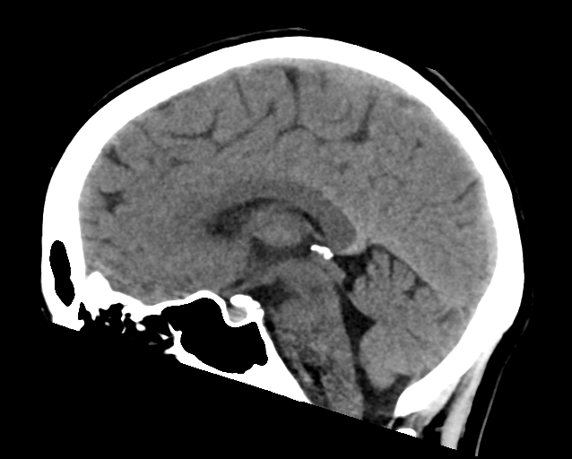

(\#fig:brainct)(ref:ct)

The CT scan was introduced in the 1970s and quickly became one of the most widely used methods of imaging. A CT scan can be performed in under a second and produce rapid results for clinicians, with its ease of use leading to an increase in CT scans performed in the United States from 3 million in 1980 to 62 million in 2007. Clinicians oftentimes take multiple scans, with 30% of individuals undergoing at least 3 scans in one study of CT scan usage. CT scans can expose patients to levels of radiation 100-500 times higher than traditional x-rays, with higher radiation doses producing better resolution imaging. While easy to use, increases in CT scan use, especially in asymptomatic patients, is a topic of concern since patients are exposed to significantly high levels of radiation.

### Magnetic resonance imaging

Magnetic resonance imaging (MRI) uses magnetic fields and radio waves to produce high quality two- or three-dimensional images of brain structures without the use of ionizing radiation (X-rays) or radioactive tracers.

(ref:mri) Normal MRI T1 sagittal section through the brain. [Case courtesy of Assoc Prof Frank Gaillard.](https://radiopaedia.org/cases/2756)

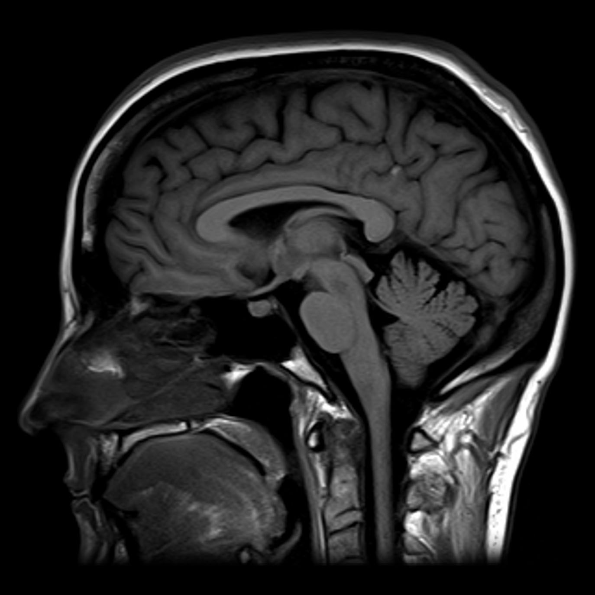

(\#fig:brainmri)(ref:mri)

Functional magnetic resonance imaging (fMRI) and arterial spin labeling (ASL) relies on the paramagnetic properties of oxygenated and deoxygenated hemoglobin to see images of changing blood flow in the brain associated with neural activity. This allows images to be generated that reflect which brain structures are activated (and how) during the performance of different tasks or at resting state. According to the oxygenation hypothesis, changes in oxygen usage in regional cerebral blood flow during cognitive or behavioral activity can be associated with the regional neurons as being directly related to the cognitive or behavioral tasks being attended.

Most fMRI scanners allow subjects to be presented with different visual images, sounds and touch stimuli, and to make different actions such as pressing a button or moving a joystick. Consequently, fMRI can be used to reveal brain structures and processes associated with perception, thought and action. The resolution of fMRI is about 2-3 millimeters at present, limited by the spatial spread of the hemodynamic response to neural activity. It has largely superseded PET for the study of brain activation patterns. PET, however, retains the significant advantage of being able to identify specific brain receptors (or transporters) associated with particular neurotransmitters through its ability to image radiolabelled receptor "ligands" (receptor ligands are any chemicals that stick to receptors).

fMRI is commonly classified as a minimally-to-moderate risk due to its non-invasiveness compared to other imaging methods. fMRI uses blood oxygenation level dependent (BOLD)-contrast in order to produce its form of imaging. BOLD-contrast is a naturally occurring process in the body so fMRI is often preferred over imaging methods that require radioactive markers to produce similar imaging. A concern in the use of fMRI is its use in individuals with medical implants or devices and metallic items in the body. The magnetic resonance (MR) emitted from the equipment can cause failure of medical devices and attract metallic objects in the body if not properly screened for. Currently, the FDA classifies medical implants and devices into three categories, depending on MR-compatibility: MR-safe (safe in all MR environments), MR-unsafe (unsafe in any MR environment), and MR-conditional (MR-compatible in certain environments, requiring further information).

As well as research on healthy subjects, fMRI is increasingly used for the medical diagnosis of disease. Because fMRI is exquisitely sensitive to oxygen usage in blood flow, it is extremely sensitive to early changes in the brain resulting from ischemia (abnormally low blood flow), such as the changes which follow stroke. Early diagnosis of certain types of stroke is increasingly important in neurology, since substances which dissolve blood clots may be used in the first few hours after certain types of stroke occur, but are dangerous to use afterward. Brain changes seen on fMRI may help to make the decision to treat with these agents. With between 72% and 90% accuracy where chance would achieve 0.8%, fMRI techniques can decide which of a set of known images the subject is viewing.

### Positron emission tomography

Positron emission tomography (PET) and brain positron emission tomography, measure emissions from radioactively labeled metabolically active chemicals that have been injected into the bloodstream. The emission data are computer-processed to produce 2- or 3-dimensional images of the distribution of the chemicals throughout the brain.:57 The positron emitting radioisotopes used are produced by a cyclotron, and chemicals are labeled with these radioactive atoms. The labeled compound, called a radiotracer, is injected into the bloodstream and eventually makes its way to the brain. Sensors in the PET scanner detect the radioactivity as the compound accumulates in various regions of the brain. A computer uses the data gathered by the sensors to create multicolored 2- or 3-dimensional images that show where the compound acts in the brain. Especially useful are a wide array of ligands used to map different aspects of neurotransmitter activity, with by far the most commonly used PET tracer being a labeled form of glucose (see Fludeoxyglucose (18F) (FDG)).

The greatest benefit of PET scanning is that different compounds can show blood flow and oxygen and glucose metabolism in the tissues of the working brain. These measurements reflect the amount of brain activity in the various regions of the brain and allow to learn more about how the brain works. PET scans were superior to all other metabolic imaging methods in terms of resolution and speed of completion (as little as 30 seconds) when they first became available. The improved resolution permitted better study to be made as to the area of the brain activated by a particular task. The biggest drawback of PET scanning is that because the radioactivity decays rapidly, it is limited to monitoring short tasks.:60 Before fMRI technology came online, PET scanning was the preferred method of functional (as opposed to structural) brain imaging, and it continues to make large contributions to neuroscience.

PET scanning is also used for diagnosis of brain disease, most notably because brain tumors, strokes, and neuron-damaging diseases which cause dementia (such as Alzheimer's disease) all cause great changes in brain metabolism, which in turn causes easily detectable changes in PET scans. PET is probably most useful in early cases of certain dementias (with classic examples being Alzheimer's disease and Pick's disease) where the early damage is too diffuse and makes too little difference in brain volume and gross structure to change CT and standard MRI images enough to be able to reliably differentiate it from the "normal" range of cortical atrophy which occurs with aging (in many but not all) persons, and which does not cause clinical dementia.

### Single-photon emission computed tomography

Single-photon emission computed tomography (SPECT) is similar to PET and uses gamma ray-emitting radioisotopes and a gamma camera to record data that a computer uses to construct two- or three-dimensional images of active brain regions. SPECT relies on an injection of radioactive tracer, or "SPECT agent," which is rapidly taken up by the brain but does not redistribute. Uptake of SPECT agent is nearly 100% complete within 30 to 60 seconds, reflecting cerebral blood flow (CBF) at the time of injection. These properties of SPECT make it particularly well-suited for epilepsy imaging, which is usually made difficult by problems with patient movement and variable seizure types. SPECT provides a "snapshot" of cerebral blood flow since scans can be acquired after seizure termination (so long as the radioactive tracer was injected at the time of the seizure). A significant limitation of SPECT is its poor resolution (about 1 cm) compared to that of MRI. Today, SPECT machines with Dual Detector Heads are commonly used, although Triple Detector Head machines are available in the marketplace. Tomographic reconstruction, (mainly used for functional "snapshots" of the brain) requires multiple projections from Detector Heads which rotate around the human skull, so some researchers have developed 6 and 11 Detector Head SPECT machines to cut imaging time and give higher resolution.

(ref:spect) Normal brain perfusion SPECT. [Case courtesy of Dr Bruno Di Muzio.](https://radiopaedia.org/cases/30090)

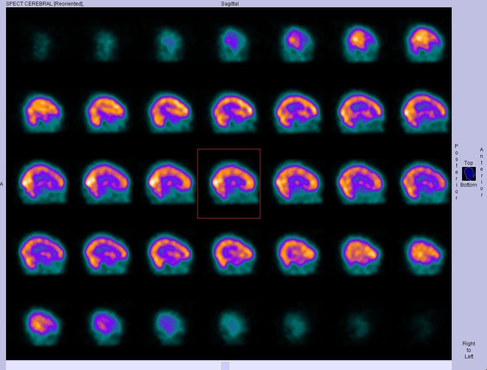

(\#fig:brainspect)(ref:spect)

Like PET, SPECT also can be used to differentiate different kinds of disease processes which produce dementia, and it is increasingly used for this purpose. Neuro-PET has a disadvantage of requiring the use of tracers with half-lives of at most 110 minutes, such as FDG. These must be made in a cyclotron, and are expensive or even unavailable if necessary transport times are prolonged more than a few half-lives. SPECT, however, is able to make use of tracers with much longer half-lives, such as technetium-99m, and as a result, is far more widely available.
