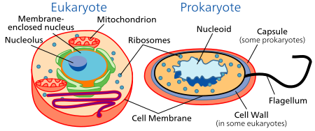
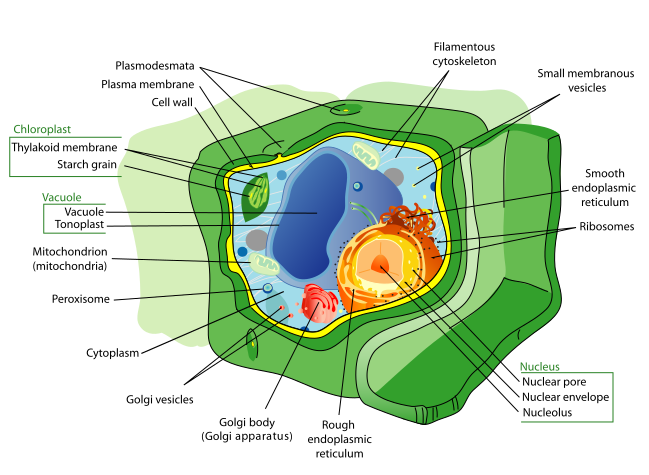

# Reproduction of Cells and Organisms

## The Cell 

The [cell](https://en.wikipedia.org/wiki/Cell_(biology)) (from Latin cella, meaning "small room") is the basic structural, functional, and biological unit of all known organisms. A cell is the smallest unit of life. Cells are often called the "building blocks of life". The study of cells is called cell biology, cellular biology, or cytology.

Cells consist of cytoplasm enclosed within a membrane, which contains many biomolecules such as proteins and nucleic acids. Most plant and animal cells are only visible under a microscope, with dimensions between 1 and 100 micrometres. Organisms can be classified as unicellular (consisting of a single cell such as bacteria) or multicellular (including plants and animals). Most unicellular organisms are classed as microorganisms.

The number of cells in plants and animals varies from species to species, it has been estimated that humans contain somewhere around 40 trillion (4×10^13^) cells. The human brain accounting for around 80 billion of these cells.

Cells were discovered by Robert Hooke in 1665, who named them for their resemblance to cells inhabited by Christian monks in a monastery. Cell theory, first developed in 1839 by Matthias Jakob Schleiden and Theodor Schwann, states that all organisms are composed of one or more cells, that cells are the fundamental unit of structure and function in all living organisms, and that all cells come from pre-existing cells. Cells emerged on Earth at least 3.5 billion years ago.

(ref:cells) [Characteristic features of eukaryotic and prokaryotic cells.](htps://en.wikipedia.org/wiki/Cell_(biology)#/media/File:Celltypes.svg)

(\#fig:comparison)(ref:cells)

Cells are of two types: eukaryotic, which contain a nucleus, and prokaryotic, which do not. Prokaryotes are single-celled organisms, while eukaryotes can be either single-celled or multicellular.

<table class="table" style="margin-left: auto; margin-right: auto;">
<caption>(\#tab:eupro)Comparison of the main features of prokaryotic and eukaryotic cells.</caption>
 <thead>
  <tr>
   <th style="text-align:left;">  </th>
   <th style="text-align:left;"> Prokaryotes </th>
   <th style="text-align:left;"> Eukaryotes </th>
  </tr>
 </thead>
<tbody>
  <tr>
   <td style="text-align:left;width: 10em; "> Typical organisms </td>
   <td style="text-align:left;width: 10em; "> bacteria, archaea </td>
   <td style="text-align:left;width: 10em; "> protists, fungi, plants, animals </td>
  </tr>
  <tr>
   <td style="text-align:left;width: 10em; "> Typical size </td>
   <td style="text-align:left;width: 10em; "> ~1-5 µm </td>
   <td style="text-align:left;width: 10em; "> ~10-100 µm </td>
  </tr>
  <tr>
   <td style="text-align:left;width: 10em; "> Type of nucleus </td>
   <td style="text-align:left;width: 10em; "> nucleoid region, true nucleus with double membrane </td>
   <td style="text-align:left;width: 10em; "> no true nucleus </td>
  </tr>
  <tr>
   <td style="text-align:left;width: 10em; "> DNA </td>
   <td style="text-align:left;width: 10em; "> circular (usually) </td>
   <td style="text-align:left;width: 10em; "> linear molecules (chromosomes) with histone proteins </td>
  </tr>
  <tr>
   <td style="text-align:left;width: 10em; "> RNA/protein synthesis </td>
   <td style="text-align:left;width: 10em; "> coupled in the cytoplasm </td>
   <td style="text-align:left;width: 10em; "> RNA synthesis in the nucleus, protein synthesis in the cytoplasm </td>
  </tr>
  <tr>
   <td style="text-align:left;width: 10em; "> Ribosomes </td>
   <td style="text-align:left;width: 10em; "> 50S and 30S </td>
   <td style="text-align:left;width: 10em; "> 60S and 40S </td>
  </tr>
  <tr>
   <td style="text-align:left;width: 10em; "> Cytoplasmic structure </td>
   <td style="text-align:left;width: 10em; "> very few structures </td>
   <td style="text-align:left;width: 10em; "> highly structured by endomembranes and a cytoskeleton </td>
  </tr>
  <tr>
   <td style="text-align:left;width: 10em; "> Cell movement </td>
   <td style="text-align:left;width: 10em; "> flagella made of flagellin </td>
   <td style="text-align:left;width: 10em; "> flagella and cilia containing microtubules, lamellipodia and filopodia containing actin </td>
  </tr>
  <tr>
   <td style="text-align:left;width: 10em; "> Mitochondria </td>
   <td style="text-align:left;width: 10em; "> none </td>
   <td style="text-align:left;width: 10em; "> one to several thousand </td>
  </tr>
  <tr>
   <td style="text-align:left;width: 10em; "> Chloroplasts </td>
   <td style="text-align:left;width: 10em; "> none </td>
   <td style="text-align:left;width: 10em; "> in algae and plants </td>
  </tr>
  <tr>
   <td style="text-align:left;width: 10em; "> Organization </td>
   <td style="text-align:left;width: 10em; "> usually single cells </td>
   <td style="text-align:left;width: 10em; "> single cells, colonies, higher multicellular organisms with specialized cells </td>
  </tr>
  <tr>
   <td style="text-align:left;width: 10em; "> Cell division </td>
   <td style="text-align:left;width: 10em; "> binary fission (simple division) </td>
   <td style="text-align:left;width: 10em; "> mitosis (fission or budding), meiosis </td>
  </tr>
  <tr>
   <td style="text-align:left;width: 10em; "> Chromosomes </td>
   <td style="text-align:left;width: 10em; "> single chromosome </td>
   <td style="text-align:left;width: 10em; "> more than one chromosome </td>
  </tr>
  <tr>
   <td style="text-align:left;width: 10em; "> Membranes </td>
   <td style="text-align:left;width: 10em; "> cell membrane </td>
   <td style="text-align:left;width: 10em; "> cell membrane and membrane-bound organelles </td>
  </tr>
</tbody>
</table>

## Prokaryotic cells

Prokaryotes include [bacteria](https://en.wikipedia.org/wiki/Bacteria) and [archaea](https://en.wikipedia.org/wiki/Archaea), two of the three domains of life. Prokaryotic cells were the first form of life on Earth, characterized by having vital biological processes including cell signaling. They are simpler and smaller than eukaryotic cells, and lack a nucleus, and other membrane-bound organelles. The DNA of a prokaryotic cell consists of a single circular chromosome that is in direct contact with the cytoplasm. The nucleus-like region in the cytoplasm is called the nucleoid. Most prokaryotes are the smallest of all organisms ranging from 0.5 to 2.0 µm in diameter.

A prokaryotic cell has three regions:

* Enclosing the cell is the cell envelope – generally consisting of a plasma membrane covered by a cell wall. Gram-positive bacteria possess a thick cell wall containing many layers of peptidoglycan and teichoic acids. In contrast, Gram-negative bacteria have a relatively thin cell wall consisting of a few layers of peptidoglycan surrounded by a second lipid membrane containing lipopolysaccharides and lipoproteins. Some bacteria have cell wall structures that are neither classically Gram-positive or Gram-negative. This includes clinically important bacteria such as Mycobacteria which have a thick peptidoglycan cell wall like a Gram-positive bacterium, but also a second outer layer of lipids. Though most prokaryotes have both a cell membrane and a cell wall, there are exceptions such as Mycoplasma (bacteria) and Thermoplasma (archaea) which only possess the cell membrane layer. In many bacteria, an S-layer of rigidly arrayed protein molecules covers the outside of the cell. This layer provides chemical and physical protection for the cell surface and can act as a macromolecular diffusion barrier. The envelope gives rigidity to the cell and separates the interior of the cell from its environment, serving as a protective filter. The cell wall consists of peptidoglycan in bacteria, and acts as an additional barrier against exterior forces. It also prevents the cell from expanding and bursting (cytolysis) from osmotic pressure due to a hypotonic environment. 

* Inside the cell is the cytoplasmic region that contains the genome (DNA), ribosomes and various sorts of inclusions. The genetic material is freely found in the cytoplasm. Prokaryotes can carry extrachromosomal DNA elements called plasmids, which are usually circular. Linear bacterial plasmids have been identified in several species of spirochete bacteria, including members of the genus Borrelia notably Borrelia burgdorferi, which causes Lyme disease. Though not forming a nucleus, the DNA is condensed in a nucleoid. Plasmids encode additional genes, such as antibiotic resistance genes.
* On the outside, flagella and pili project from the cell's surface. These are structures (not present in all prokaryotes) made of proteins that facilitate movement and communication between cells.

## Eukaryotic cells

Plants, animals, fungi, and protists are all eukaryotic. These cells are about fifteen times wider than a typical prokaryote and can be as much as a thousand times greater in volume. The main distinguishing feature of eukaryotes as compared to prokaryotes is compartmentalization: the presence of membrane-bound organelles (compartments) in which specific activities take place. Most important among these is a cell nucleus, an organelle that houses the cell's DNA. This nucleus gives the eukaryote its name, which means "true kernel (nucleus)". Other characteristics include:

(ref:animal) [Structure of a typical animal cell](https://commons.wikimedia.org/wiki/File:Animal_cell_structure_en.svg)

(\#fig:animalcell)(ref:animal)

(ref:plant) [Structure of a typical plant cell](https://commons.wikimedia.org/wiki/File:Plant_cell_structure-en.svg)

(\#fig:plantcell)(ref:plant)

* The plasma membrane resembles that of prokaryotes in function, with minor differences in the setup. Cell walls may or may not be present.
* The eukaryotic DNA is organized in one or more linear molecules, called chromosomes, which are associated with histone proteins. All chromosomal DNA is stored in the cell nucleus, separated from the cytoplasm by a membrane. Some eukaryotic organelles such as mitochondria also contain some DNA.
* Many eukaryotic cells are ciliated. Cilia play important roles in chemosensation, mechanosensation, and thermosensation. Each cilium may thus be "viewed as a sensory cellular antennae that coordinates a large number of cellular signaling pathways, sometimes coupling the signaling to ciliary motility or alternatively to cell division and differentiation."
* Motile eukaryotes can move using motile cilia or flagella. Eukaryotic flagella are more complex than those of prokaryotes.

## Genetic material

Two different kinds of genetic material exist: deoxyribonucleic acid (DNA) and ribonucleic acid (RNA). Cells use DNA for their long-term information storage. The biological information contained in an organism is encoded in its DNA sequence. RNA is used for information transport (e.g., mRNA) and enzymatic functions (e.g., ribosomal RNA). Transfer RNA (tRNA) molecules are used to add amino acids during protein translation.

Prokaryotic genetic material is organized in a simple circular bacterial chromosome in the nucleoid region of the cytoplasm. Eukaryotic genetic material is divided into different, linear molecules called chromosomes inside a discrete nucleus, usually with additional genetic material in some organelles like mitochondria and chloroplasts (see endosymbiotic theory).

A human cell has genetic material contained in the cell nucleus (the nuclear genome) and in the mitochondria (the mitochondrial genome). In humans the nuclear genome is divided into 46 linear DNA molecules called chromosomes, including 22 homologous chromosome pairs and a pair of sex chromosomes. The mitochondrial genome is a circular DNA molecule distinct from the nuclear DNA. Although the mitochondrial DNA is very small compared to nuclear chromosomes, it codes for 13 proteins involved in mitochondrial energy production and specific tRNAs.

Foreign genetic material (most commonly DNA) can also be artificially introduced into the cell by a process called transfection. This can be transient, if the DNA is not inserted into the cell's genome, or stable, if it is. Certain viruses also insert their genetic material into the genome.

## Replication

Cell division involves a single cell (called a mother cell) dividing into two daughter cells. This leads to growth in multicellular organisms (the growth of tissue) and to procreation (vegetative reproduction) in unicellular organisms. Prokaryotic cells divide by binary fission, while eukaryotic cells usually undergo a process of nuclear division, called mitosis, followed by division of the cell, called cytokinesis. A diploid cell may also undergo meiosis to produce haploid cells, usually four. Haploid cells serve as gametes in multicellular organisms, fusing to form new diploid cells.

DNA replication, or the process of duplicating a cell's genome, always happens when a cell divides through mitosis or binary fission. This occurs during the S phase of the cell cycle.

In meiosis, the DNA is replicated only once, while the cell divides twice. DNA replication only occurs before meiosis I. DNA replication does not occur when the cells divide the second time, in meiosis II. Replication, like all cellular activities, requires specialized proteins for carrying out the job.

## Reproduction

[Reproduction](https://en.wikipedia.org/wiki/Reproduction) (or procreation or breeding) is the biological process by which new individual organisms – "offspring" – are produced from their "parents". Reproduction is a fundamental feature of all known life; each individual organism exists as the result of reproduction. There are two forms of reproduction: asexual and sexual.

In asexual reproduction, an organism can reproduce without the involvement of another organism. Asexual reproduction is not limited to single-celled organisms. The cloning of an organism is a form of asexual reproduction. By asexual reproduction, an organism creates a genetically similar or identical copy of itself. The evolution of seual reproduction is a major puzzle for biologists. The two-fold cost of sexual reproduction is that only 50% of organisms reproduce and organisms only pass on 50% of their genes.

Sexual reproduction typically requires the sexual interaction of two specialized organisms, called gametes, which contain half the number of chromosomes of normal cells and are created by meiosis, with typically a male fertilizing a female of the same species to create a fertilized zygote. This produces offspring organisms whose genetic characteristics are derived from those of the two parental organisms.

### Asexual reproduction

Asexual reproduction is a process by which organisms create genetically similar or identical copies of themselves without the contribution of genetic material from another organism. Bacteria divide asexually via binary fission; viruses take control of host cells to produce more viruses; Hydras and yeasts are able to reproduce by budding. These organisms often do not possess different sexes, and they are capable of "splitting" themselves into two or more copies of themselves. Most plants have the ability to reproduce asexually and the ant species *Mycocepurus smithii* is thought to reproduce entirely by asexual means.

Some species that are capable of reproducing asexually, like hydra, yeast and jellyfish, may also reproduce sexually. For instance, most plants are capable of vegetative reproduction—reproduction without seeds or spores—but can also reproduce sexually.

Other ways of asexual reproduction include parthenogenesis, fragmentation and spore formation that involves only mitosis. Parthenogenesis is the growth and development of embryo or seed without fertilization by a male. Parthenogenesis occurs naturally in some species, including lower plants (where it is called apomixis), invertebrates (e.g. water fleas, aphids, some bees and parasitic wasps), and vertebrates (e.g. some reptiles, fish, and, very rarely, birds and sharks). It is sometimes also used to describe reproduction modes in hermaphroditic species which can self-fertilize.

### Sexual reproduction

Sexual reproduction is a biological process that creates a new organism by combining the genetic material of two organisms in a process that starts with meiosis, a specialized type of cell division. Each of two parent organisms contributes half of the offspring's genetic makeup by creating haploid gametes. Most organisms form two different types of gametes. In these anisogamous species, the two sexes are referred to as male (producing sperm or microspores) and female (producing ova or megaspores). In isogamous species, the gametes are similar or identical in form (isogametes), but may have separable properties and then may be given other different names. For example, in the green alga, *Chlamydomonas reinhardtii*, there are so-called "plus" and "minus" gametes. A few types of organisms, such as many fungi and the ciliate *Paramecium aurelia*, have more than two "sexes", called syngens. Most animals (including humans) and plants reproduce sexually. Sexually reproducing organisms have different sets of genes for every trait (called alleles). 

[Bryophytes](https://en.wikipedia.org/wiki/Bryophyte) reproduce sexually, but the larger and commonly-seen organisms are haploid and produce gametes. The gametes fuse to form a zygote which develops into a sporangium, which in turn produces haploid spores. The diploid stage is relatively small and short-lived compared to the haploid stage, i.e. haploid dominance. The advantage of diploidy, [heterosis](https://en.wikipedia.org/wiki/Heterosis), only exists in the diploid life generation. Bryophytes retain sexual reproduction despite the fact that the haploid stage does not benefit from heterosis. This may be an indication that the sexual reproduction has advantages other than heterosis, such as genetic recombination between members of the species, allowing the expression of a wider range of traits and thus making the population more able to survive environmental variation.

### Allogamy

Allogamy is the fertilization of the combination of gametes from two parents, generally the ovum from one individual with the spermatozoa of another. (In isogamous species, the two gametes will not be defined as either sperm or ovum.)

### Autogamy

Self-fertilization, also known as autogamy, occurs in hermaphroditic organisms where the two gametes fused in fertilization come from the same individual, e.g., many vascular plants, some foraminiferans, some ciliates. 

### Mitosis and meiosis

[Mitosis](https://en.wikipedia.org/wiki/Mitosis) and [meiosis](https://en.wikipedia.org/wiki/Meiosis) are types of cell division. In animals, mitosis occurs in somatic cells, while meiosis occurs in gametes.

The resultant number of cells in mitosis is twice the number of original cells. The number of chromosomes in the offspring cells is the same as that of the parent cell.

The resultant number of cells in meiosis is four times the number of original cells. This results in cells with half the number of chromosomes present in the parent cell. 

\begin{longtable}[t]{>{\centering\arraybackslash}p{10em}>{\raggedright\arraybackslash}p{5em}>{\raggedright\arraybackslash}p{20em}}
\caption{(\#tab:mitomeio)Differences between meiosis and mitosis.}\\
\toprule
\rowcolor{gray!6}  recombination & meiosis & shuffles the genes between the two chromosomes in each pair (one received from each parent), producing recombinant chromosomes with unique genetic combinations in every gamete\\
recombination & mitosis & occurs only if needed to repair DNA damage, usually occurs between identical sister chromatids and does not result in genetic changes\\
\cmidrule{1-3}
\rowcolor{gray!6}   & meiosis & produces four genetically unique cells, each with half the number of chromosomes as in the parent\\

\multirow{-2}{*}{\centering\arraybackslash chromosome number} & mitosis & produces two genetically identical cells, each with the same number of chromosomes as in the parent\\
\bottomrule
\end{longtable}

## Binary fission

Organisms in the domains of Archaea and Bacteria reproduce with binary fission. This form of asexual reproduction and cell division is also used by some organelles within eukaryotic organisms (e.g., mitochondria). Binary fission results in the reproduction of a living prokaryotic cell (or organelle) by dividing the cell into two parts, each with the potential to grow to the size of the original.

### Fission of prokaryotes

The single DNA molecule first replicates, then attaches each copy to a different part of the cell membrane. When the cell begins to pull apart, the replicated and original chromosomes are separated. The consequence of this asexual method of reproduction is that all the cells are genetically identical, meaning that they have the same genetic material (barring random mutations). Unlike the processes of mitosis and meiosis used by eukaryotic cells, binary fission takes place without the formation of a spindle apparatus on the cell. Like in mitosis (and unlike in meiosis), the parental identity is preserved.

### Process of FtsZ-dependent fission

[FtsZ](https://en.wikipedia.org/wiki/FtsZ) is a protein encoded by the ftsZ gene that assembles into a ring at the future site of bacterial cell division. FtsZ is a prokaryotic homologue of the eukaryotic protein tubulin. The initials FtsZ mean "Filamenting temperature-sensitive mutant Z". The hypothesis was that cell division mutants of *E. coli* would grow as filaments due to the inability of the daughter cells to separate from one another. FtsZ is found in almost all bacteria, many archaea, all chloroplasts and some mitochondria, where it is essential for cell division. FtsZ assembles the cytoskeletal scaffold of the Z ring that, along with additional proteins, constricts to divide the cell in two.

The process of binary fission in bacteria involves the following steps. First, the cell's DNA is replicated. The replicated DNA copies then move to opposite poles of the cell in an energy-dependent process. The cell lengthens. Then, the equatorial plane of the cell constricts and separates the plasma membrane such that each new cell has exactly the same genetic material.

More specifically, the following steps occur:

1. The DNA is tightly coiled.
1. The DNA is unwound and duplicated.
1. The DNA is pulled to the separate poles of the bacterium as it increases the size to prepare for splitting.
1. The growth of a new cell wall begins to separate the bacterium, often with a "Z-ring" form by the cytoskeleton FtsZ
1. The new cell wall fully develops, resulting in the complete split of the bacterium.
1. The new daughter cells have tightly coiled DNA rods, ribosomes, and plasmids; these are now brand-new organisms.

Binary fission is generally rapid though its speed varies between species. Under optimal conditions, *E. coli*, cells divide about every 20 minutes at 37 °C. Because the new cells will, in turn, undergo binary fission, the time binary fission requires is also the time the bacterial culture requires to double in the number of cells it contains. This time period is, therefore, be referred to as the doubling time. Some strains of *Mycobacterium tuberculosis* have doubling times of nearly 100 hours. Bacterial growth is limited by nutrient availability and density, so binary fission occurs at much lower rates in bacterial cultures once they enter the stationary phase of growth.

Some organelles in eukaryotic cells reproduce using binary fission. Mitochondrial fission occurs frequently within the cell, even when the cell is not actively undergoing mitosis, and is necessary to regulate the cell's metabolism. All chloroplasts and some mitochrondria (not in animals), both organelles derived from endosymbiosis of bacteria, also use FtsZ in a bacteria-like fashion.

## Mitosis

In cell biology, [mitosis](https://en.wikipedia.org/wiki/Mitosis) is a part of the cell cycle when replicated chromosomes are separated into two new nuclei. Cell division gives rise to genetically identical cells in which the number of chromosomes is maintained. In general, mitosis (division of the nucleus) is preceded by the S stage of interphase (during which the DNA is replicated) and is often accompanied or followed by cytokinesis, which divides the cytoplasm, organelles and cell membrane into two new cells containing roughly equal shares of these cellular components (Figure \@ref(fig:cellcycle)). Mitosis and cytokinesis together define the mitotic (M) phase of an animal cell cycle—the division of the mother cell into two daughter cells genetically identical to each other.

(ref:cycle) [Mitosis in an animal cell (phases ordered counter-clockwise).](https://commons.wikimedia.org/wiki/File:Animal_cell_cycle-en.svg)

(\#fig:cellcycle)(ref:cycle)

The process of mitosis is divided into stages corresponding to the completion of one set of activities and the start of the next. These stages are prophase, prometaphase, metaphase, anaphase, and telophase. During mitosis, the chromosomes, which have already duplicated, condense and attach to spindle fibers that pull one copy of each chromosome to opposite sides of the cell. The result is two genetically identical daughter nuclei. The rest of the cell may then continue to divide by cytokinesis to produce two daughter cells. Producing three or more daughter cells instead of the normal two is a mitotic error called tripolar mitosis or multipolar mitosis (direct cell triplication / multiplication). Other errors during mitosis can induce apoptosis (programmed cell death) or cause mutations. Certain types of cancer can arise from such mutations.

(ref:onion) Onion (Allium cepa) root cells in different phases of the cell cycle (drawn by [E. B. Wilson](https://en.wikipedia.org/wiki/Edmund_Beecher_Wilson), 1900). [General view of cells in the growing root-tip of the onion, from a longitudinal section, enlarged 800 diameters. a. non-dividing cells, with chromatin-network and deeply stained nucleoli; b. nuclei preparing for division (spireme-stage); c. dividing cells showing mitotic figures; e. pair of daughter-cells shortly after division.](https://commons.wikimedia.org/wiki/File:Wilson1900Fig2.jpg)

(\#fig:onionroot)(ref:onion)

Mitosis varies between organisms. For example, animal cells undergo an "open" mitosis, where the nuclear envelope breaks down before the chromosomes separate, whereas fungi undergo a "closed" mitosis, where chromosomes divide within an intact cell nucleus. Most animal cells undergo a shape change, known as mitotic cell rounding, to adopt a near spherical morphology at the start of mitosis. Most human cells are produced by mitotic cell division. Important exceptions include the gametes – sperm and egg cells – which are produced by meiosis.

Numerous descriptions of cell division were made during 18th and 19th centuries, with various degrees of accuracy. In 1835, the German botanist [Hugo von Mohl](https://en.wikipedia.org/wiki/Hugo_von_Mohl), described cell division in the green alga *Cladophora glomerata*, stating that multiplication of cells occurs through cell division. In 1838, Matthias Jakob Schleiden affirmed that the formation of new cells in their interior was a general law for cell multiplication in plants, a view later rejected in favour of Mohl model, due to contributions of Robert Remak and others.

The term "mitosis", coined by [Walther Flemming](https://en.wikipedia.org/wiki/Walther_Flemming) in 1882, is derived from the Greek word μίτος (mitos, "warp thread"). There are some alternative names for the process, e.g., "karyokinesis" (nuclear division), a term introduced by Schleicher in 1878, or "equational division", proposed by [August Weismann](https://en.wikipedia.org/wiki/August_Weismann) in 1887. However, the term "mitosis" is also used in a broad sense by some authors to refer to karyokinesis and cytokinesis together. Presently, "equational division" is more commonly used to refer to meiosis II, the part of meiosis most like mitosis.

The primary result of mitosis and cytokinesis is the transfer of a parent cell's genome into two daughter cells. The genome is composed of a number of chromosomes—complexes of tightly coiled DNA that contain genetic information vital for proper cell function. Because each resultant daughter cell should be genetically identical to the parent cell, the parent cell must make a copy of each chromosome before mitosis. This occurs during the S phase of interphase. Chromosome duplication results in two identical sister chromatids bound together by cohesin proteins at the centromere.

When mitosis begins, the chromosomes condense and become visible. In some eukaryotes, for example animals, the nuclear envelope, which segregates the DNA from the cytoplasm, disintegrates into small vesicles. The nucleolus also disappears. Microtubules project from opposite ends of the cell, attach to the centromeres, and align the chromosomes centrally within the cell. The microtubules then contract to pull the sister chromatids of each chromosome apart. Sister chromatids at this point are called daughter chromosomes. As the cell elongates, corresponding daughter chromosomes are pulled toward opposite ends of the cell and condense maximally in late anaphase. A new nuclear envelope forms around the separated daughter chromosomes, which decondense to form interphase nuclei.

During mitotic progression, typically after the anaphase onset, the cell may undergo cytokinesis. In animal cells, a cell membrane pinches inward between the two developing nuclei to produce two new cells. In plant cells, a cell plate forms between the two nuclei. Cytokinesis does not always occur; coenocytic (a type of multinucleate condition) cells undergo mitosis without cytokinesis.

### Interphase

The mitotic phase is a relatively short period of the cell cycle. It alternates with the much longer interphase, where the cell prepares itself for the process of cell division. Interphase is divided into three phases: G1 (first gap), S (synthesis), and G2 (second gap). During all three parts of interphase, the cell grows by producing proteins and cytoplasmic organelles. However, chromosomes are replicated only during the S phase. Thus, a cell grows (G1), continues to grow as it duplicates its chromosomes (S), grows more and prepares for mitosis (G2), and finally divides (M) before restarting the cycle. All these phases in the cell cycle are highly regulated by cyclins, cyclin-dependent kinases, and other cell cycle proteins. The phases follow one another in strict order and there are "checkpoints" that give the cell cues to proceed from one phase to another. Cells may also temporarily or permanently leave the cell cycle and enter G0 phase to stop dividing. This can occur when cells become overcrowded (density-dependent inhibition) or when they differentiate to carry out specific functions for the organism, as is the case for human heart muscle cells and neurons. Some G0 cells have the ability to re-enter the cell cycle.

### Preprophase (plant cells)

In plant cells only, prophase is preceded by a pre-prophase stage. In highly vacuolated plant cells, the nucleus has to migrate into the center of the cell before mitosis can begin. This is achieved through the formation of a phragmosome, a transverse sheet of cytoplasm that bisects the cell along the future plane of cell division. In addition to phragmosome formation, preprophase is characterized by the formation of a ring of microtubules and actin filaments (called preprophase band) underneath the plasma membrane around the equatorial plane of the future mitotic spindle. This band marks the position where the cell will eventually divide. The cells of higher plants (such as the flowering plants) lack centrioles; instead, microtubules form a spindle on the surface of the nucleus and are then organized into a spindle by the chromosomes themselves, after the nuclear envelope breaks down. The preprophase band disappears during nuclear envelope breakdown and spindle formation in prometaphase.:58–67

### Prophase

During prophase, which occurs after G2 interphase, the cell prepares to divide by tightly condensing its chromosomes and initiating mitotic spindle formation. During interphase, the genetic material in the nucleus consists of loosely packed chromatin. At the onset of prophase, chromatin fibers condense into discrete chromosomes that are typically visible at high magnification through a light microscope. In this stage, chromosomes are long, thin and thread-like. Each chromosome has two chromatids. The two chromatids are joined at the centromere.

Gene transcription ceases during prophase and does not resume until late anaphase to early G1 phase. The nucleolus also disappears during early prophase.

Close to the nucleus of animal cells are structures called centrosomes, consisting of a pair of centrioles surrounded by a loose collection of proteins. The centrosome is the coordinating center for the cell's microtubules. A cell inherits a single centrosome at cell division, which is duplicated by the cell before a new round of mitosis begins, giving a pair of centrosomes. The two centrosomes polymerize tubulin to help form a microtubule spindle apparatus. Motor proteins then push the centrosomes along these microtubules to opposite sides of the cell. Although centrosomes help organize microtubule assembly, they are not essential for the formation of the spidle apparatus, since they are absent from plants, and are not absolutely required for animal cell mitosis.

(ref:pro) [Early prophase: Polar microtubules, shown as green strands, have established a matrix around the currently intact nucleus, with the condensing chromosomes in blue. The red nodules are the centromeres.](https://commons.wikimedia.org/wiki/File:ProphaseIF.jpg)

(\#fig:prophase)(ref:pro)

### Prometaphase

At the beginning of prometaphase in animal cells, phosphorylation of nuclear lamins causes the nuclear envelope to disintegrate into small membrane vesicles. As this happens, microtubules invade the nuclear space. This is called open mitosis, and it occurs in some multicellular organisms. Fungi and some protists, such as algae or trichomonads, undergo a variation called closed mitosis where the spindle forms inside the nucleus, or the microtubules penetrate the intact nuclear envelope.

In late prometaphase, kinetochore microtubules begin to search for and attach to chromosomal kinetochores. A kinetochore is a proteinaceous microtubule-binding structure that forms on the chromosomal centromere during late prophase. A number of polar microtubules find and interact with corresponding polar microtubules from the opposite centrosome to form the mitotic spindle. Although the kinetochore structure and function are not fully understood, it is known that it contains some form of molecular motor. When a microtubule connects with the kinetochore, the motor activates, using energy from ATP to "crawl" up the tube toward the originating centrosome. This motor activity, coupled with polymerisation and depolymerisation of microtubules, provides the pulling force necessary to later separate the chromosome's two chromatids.

(ref:prometa) [Early prometaphase: The nuclear membrane has just disassembled, allowing the microtubules to quickly interact with the kinetochores, which assemble on the centromeres of the condensing chromosomes.](https://commons.wikimedia.org/wiki/File:Prometaphase.jpg)

(\#fig:prometaphase)(ref:prometa)

### Metaphase

After the microtubules have located and attached to the kinetochores in prometaphase, the two centrosomes begin pulling the chromosomes towards opposite ends of the cell. The resulting tension causes the chromosomes to align along the metaphase plate or equatorial plane, an imaginary line that is centrally located between the two centrosomes (at approximately the midline of the cell). To ensure equitable distribution of chromosomes at the end of mitosis, the metaphase checkpoint guarantees that kinetochores are properly attached to the mitotic spindle and that the chromosomes are aligned along the metaphase plate. If the cell successfully passes through the metaphase checkpoint, it proceeds to anaphase.

(ref:meta) [Metaphase: The centrosomes have moved to the poles of the cell and have established the mitotic spindle. The chromosomes have congressed at the metaphase plate.](https://commons.wikimedia.org/wiki/File:MetaphaseIF.jpg)

(\#fig:metaphase)(ref:meta)

### Anaphase

During anaphase A, the cohesins that bind sister chromatids together are cleaved, forming two identical daughter chromosomes. Shortening of the kinetochore microtubules pulls the newly formed daughter chromosomes to opposite ends of the cell. During anaphase B, polar microtubules push against each other, causing the cell to elongate. In late anaphase, chromosomes also reach their overall maximal condensation level, to help chromosome segregation and the re-formation of the nucleus. In most animal cells, anaphase A precedes anaphase B, but some vertebrate egg cells demonstrate the opposite order of events.

(ref:ana) [Anaphase: Kinetochore microtubules pull the two sets of chromosomes apart, and lengthening polar microtubules push the halves of the dividing cell further apart, while chromosomes are condensed maximally.](https://commons.wikimedia.org/wiki/File:Anaphase_IF.jpg)

(\#fig:anaphase)(ref:ana)

### Telophase

Telophase (from the Greek word τελος meaning "end") is a reversal of prophase and prometaphase events. At telophase, the polar microtubules continue to lengthen, elongating the cell even more. If the nuclear envelope has broken down, a new nuclear envelope forms using the membrane vesicles of the parent cell's old nuclear envelope. The new envelope forms around each set of separated daughter chromosomes (though the membrane does not enclose the centrosomes) and the nucleolus reappears. Both sets of chromosomes, now surrounded by new nuclear membrane, begin to "relax" or decondense. Mitosis is complete. Each daughter nucleus has an identical set of chromosomes.Cell division may or may not occur at this time depending on the organism.

(ref:telo) [Telophase: Reversal of prophase and prometaphase events and thus completing the cell cycle.](https://commons.wikimedia.org/wiki/File:TelophaseIF.jpg)

(\#fig:telophase)(ref:telo)

### Cytokinesis 

Cytokinesis is not a phase of mitosis but rather a separate process, necessary for completing cell division. In animal cells, a cleavage furrow (pinch) containing a contractile ring develops where the metaphase plate used to be, pinching off the separated nuclei. In both animal and plant cells, cell division is also driven by vesicles derived from the Golgi apparatus, which move along microtubules to the middle of the cell. In plants, this structure coalesces into a cell plate at the center of the phragmoplast and develops into a cell wall, separating the two nuclei. Each daughter cell has a complete copy of the genome of its parent cell. The end of cytokinesis marks the end of the M-phase.

There are many cells where mitosis and cytokinesis occur separately, forming single cells with multiple nuclei. The most notable occurrence of this is among the fungi, slime molds, and coenocytic algae, but the phenomenon is found in various other organisms. Even in animals, cytokinesis and mitosis may occur independently, for instance during certain stages of fruit fly embryonic development.

Mitosis occurs in the following circumstances:

* Development and growth: The number of cells within an organism increases by mitosis. This is the basis of the development of a multicellular body from a single cell, i.e., zygote and also the basis of the growth of a multicellular body.
* Cell replacement: In some parts of the body, e.g. skin and digestive tract, cells are constantly sloughed off and replaced by new ones. New cells are formed by mitosis and so are exact copies of the cells being replaced. 
* Regeneration: Some organisms can regenerate body parts. The production of new cells in such instances is achieved by mitosis. For example, starfish regenerate lost arms through mitosis.
* Asexual reproduction: Some organisms produce genetically similar offspring through asexual reproduction. For example, the hydra reproduces asexually by budding. The cells at the surface of hydra undergo mitosis and form a mass called a bud. Mitosis continues in the cells of the bud and this grows into a new individual. The same division happens during asexual reproduction or vegetative propagation in plants.

## Meiosis

Meiosis (from Greek μείωσις, meiosis, which means lessening) is a special type of cell division that reduces the chromosome number by half, creating four haploid cells, each genetically distinct from the parent cell that gave rise to them. This process occurs in all sexually reproducing single-celled and multicellular eukaryotes, including animals, plants, and fungi. Meiotic cell divisions are an essential process during oogenesis and spermatogenesis.

Errors in meiosis resulting in aneuploidy are the leading known cause of miscarriage and the most frequent genetic cause of developmental disabilities.

In meiosis, DNA replication is followed by two rounds of cell division to produce four daughter cells, each with half the number of chromosomes as the original parent cell. The two meiotic divisions are known as Meiosis I and Meiosis II. Before meiosis begins, during S phase of the cell cycle, the DNA of each chromosome is replicated so that it consists of two identical sister chromatids, which remain held together through sister chromatid cohesion. This S-phase can be referred to as "premeiotic S-phase" or "meiotic S-phase". Immediately following DNA replication, meiotic cells enter a prolonged G2-like stage known as meiotic prophase. During this time, homologous chromosomes pair with each other and undergo genetic recombination, a programmed process in which DNA may be cut and then repaired, which allows them to exchange some of their genetic information. A subset of recombination events results in crossovers, which create physical links known as chiasmata (singular: chiasma, for the Greek letter Chi (X)) between the homologous chromosomes. In most organisms, these links can help direct each pair of homologous chromosomes to segregate away from each other during Meiosis I, resulting in two haploid cells that have half the number of chromosomes as the parent cell. During Meiosis II, the cohesion between sister chromatids is released and they segregate from one another, as during mitosis. In some cases all four of the meiotic products form gametes such as sperm, spores, or pollen. In female animals, three of the four meiotic products are typically eliminated by extrusion into polar bodies, and only one cell develops to produce an ovum. Because the number of chromosomes is halved during meiosis, gametes can fuse (i.e. fertilization) to form a diploid zygote that contains two copies of each chromosome, one from each parent. Thus, alternating cycles of meiosis and fertilization enable sexual reproduction, with successive generations maintaining the same number of chromosomes. For example, diploid human cells contain 23 pairs of chromosomes including 1 pair of sex chromosomes (46 total), half of maternal origin and half of paternal origin. Meiosis produces haploid gametes (ova or sperm) that contain one set of 23 chromosomes. When two gametes (an egg and a sperm) fuse, the resulting zygote is once again diploid, with the mother and father each contributing 23 chromosomes. This same pattern, but not the same number of chromosomes, occurs in all organisms that utilize meiosis.

Meiosis begins with a diploid cell, which contains two copies of each chromosome, termed homologs. First, the cell undergoes DNA replication, so each homolog now consists of two identical sister chromatids. Then each set of homologs pair with each other and exchange genetic information by homologous recombination often leading to physical connections (crossovers) between the homologs. In the first meiotic division, the homologs are segregated to separate daughter cells by the spindle apparatus. The cells then proceed to a second division without an intervening round of DNA replication. The sister chromatids are segregated to separate daughter cells to produce a total of four haploid cells. Female animals employ a slight variation on this pattern and produce one large ovum and two small polar bodies. Because of recombination, an individual chromatid can consist of a new combination of maternal and paternal genetic information, resulting in offspring that are genetically distinct from either parent. Furthermore, an individual gamete can include an assortment of maternal, paternal, and recombinant chromatids. This genetic diversity resulting from sexual reproduction contributes to the variation in traits upon which natural selection can act.

Meiosis uses many of the same mechanisms as mitosis, the type of cell division used by eukaryotes to divide one cell into two identical daughter cells. In some plants, fungi, and protists meiosis results in the formation of spores: haploid cells that can divide vegetatively without undergoing fertilization. Some eukaryotes, like bdelloid rotifers, do not have the ability to carry out meiosis and have acquired the ability to reproduce by parthenogenesis.

Meiosis does not occur in archaea or bacteria, which generally reproduce asexually via binary fission. However, a "sexual" process known as horizontal gene transfer involves the transfer of DNA from one bacterium or archaeon to another and recombination of these DNA molecules of different parental origin.

Meiosis was discovered and described for the first time in sea urchin eggs in 1876 by the German biologist Oscar Hertwig. It was described again in 1883, at the level of chromosomes, by the Belgian zoologist Edouard Van Beneden, in Ascaris roundworm eggs. The significance of meiosis for reproduction and inheritance, however, was described only in 1890 by German biologist August Weismann, who noted that two cell divisions were necessary to transform one diploid cell into four haploid cells if the number of chromosomes had to be maintained. In 1911 the American geneticist Thomas Hunt Morgan detected crossovers in meiosis in the fruit fly Drosophila melanogaster, which helped to establish that genetic traits are transmitted on chromosomes.

The term "meiosis" (originally spelled "maiosis") is derived from the Greek word μείωσις, meaning 'lessening'. It was introduced to biology by J.B. Farmer and J.E.S. Moore in 1905:

"We propose to apply the terms Maiosis or Maiotic phase to cover the whole series of nuclear changes included in the two divisions that were designated as Heterotype and Homotype by Flemming."

The term was linguistically corrected to "meiosis" by Koernicke (1905), and by Pantel and De Sinety (1906).

Meiosis is divided into meiosis I and meiosis II which are further divided into Karyokinesis I and Cytokinesis I and Karyokinesis II and Cytokinesis II respectively. The preparatory steps that lead up to meiosis are identical in pattern and name to interphase of the mitotic cell cycle. Interphase is divided into three phases:

* Growth 1 (G1) phase: In this very active phase, the cell synthesizes its vast array of proteins, including the enzymes and structural proteins it will need for growth. In G1, each of the chromosomes consists of a single linear molecule of DNA.
* Synthesis (S) phase: The genetic material is replicated; each of the cell's chromosomes duplicates to become two identical sister chromatids attached at a centromere. This replication does not change the ploidy of the cell since the centromere number remains the same. The identical sister chromatids have not yet condensed into the densely packaged chromosomes visible with the light microscope. This will take place during prophase I in meiosis.
* Growth 2 (G2) phase: G2 phase as seen before mitosis is not present in meiosis. Meiotic prophase corresponds most closely to the G2 phase of the mitotic cell cycle.

Interphase is followed by meiosis I and then meiosis II. Meiosis I separates replicated homologous chromosomes, each still made up of two sister chromatids, into two daughter cells, thus reducing the chromosome number by half. During meiosis II, sister chromatids decouple and the resultant daughter chromosomes are segregated into four daughter cells. For diploid organisms, the daughter cells resulting from meiosis are haploid and contain only one copy of each chromosome. In some species, cells enter a resting phase known as interkinesis between meiosis I and meiosis II.

Meiosis I and II are each divided into prophase, metaphase, anaphase, and telophase stages, similar in purpose to their analogous subphases in the mitotic cell cycle. Therefore, meiosis includes the stages of meiosis I (prophase I, metaphase I, anaphase I, telophase I) and meiosis II (prophase II, metaphase II, anaphase II, telophase II).

Meiosis generates gamete genetic diversity in two ways: (1) Law of Independent Assortment. The independent orientation of homologous chromosome pairs along the metaphase plate during metaphase I & orientation of sister chromatids in metaphase II, this is the subsequent separation of homologs and sister chromatids during anaphase I & II, it allows a random and independent distribution of chromosomes to each daughter cell (and ultimately to gametes); and (2) Crossing Over. The physical exchange of homologous chromosomal regions by homologous recombination during prophase I results in new combinations of genetic information within chromosomes.

During meiosis, specific genes are more highly transcribed. In addition to strong meiotic stage-specific expression of mRNA, there are also pervasive translational controls (e.g. selective usage of preformed mRNA), regulating the ultimate meiotic stage-specific protein expression of genes during meiosis. Thus, both transcriptional and translational controls determine the broad restructuring of meiotic cells needed to carry out meiosis.

### Meiosis I

Meiosis I segregates homologous chromosomes, which are joined as tetrads (2n, 4c), producing two haploid cells (n chromosomes, 23 in humans) which each contain chromatid pairs (1n, 2c). Because the ploidy is reduced from diploid to haploid, meiosis I is referred to as a reductional division. Meiosis II is an equational division analogous to mitosis, in which the sister chromatids are segregated, creating four haploid daughter cells (1n, 1c).

#### Prophase I

Prophase I is typically the longest phase of meiosis. During prophase I, homologous chromosomes pair and exchange genetic information (homologous recombination). This often results in chromosomal crossover. This process facilitates pairing between homologous chromosomes and hence accurate segregation of the chromosomes at the first meiosis division. The new combinations of DNA created during crossover are a significant source of genetic variation, and result in new combinations of alleles, which may be beneficial. The paired and replicated chromosomes are called bivalents or tetrads, which have two chromosomes and four chromatids, with one chrmosome coming from each parent. The process of pairing the homologous chromosomes is called synapsis. At this stage, non-sister chromatids may cross-over at points called chiasmata (plural; singular chiasma). Prophase I has historically been divided into a series of substages which are named according to the appearance of chromosomes.

##### Leptotene

The first stage of prophase I is the leptotene stage, also known as leptonema, from Greek words meaning "thin threads". In this stage of prophase I, individual chromosomes—each consisting of two sister chromatids—become "individualized" to form visible strands within the nucleus. The two sister chromatids closely associate and are visually indistinguishable from one another. During leptotene, lateral elements of the synaptonemal complex assemble. Leptotene is of very short duration and progressive condensation and coiling of chromosome fibers takes place.

##### Zygotene

The zygotene stage, also known as zygonema, from Greek words meaning "paired threads", occurs as the chromosomes approximately line up with each other into homologous chromosome pairs. In some organisms, this is called the bouquet stage because of the way the telomeres cluster at one end of the nucleus. At this stage, the synapsis (pairing/coming together) of homologous chromosomes takes place, facilitated by assembly of central element of the synaptonemal complex. Pairing is brought about in a zipper-like fashion and may start at the centromere (procentric), at the chromosome ends (proterminal), or at any other portion (intermediate). Individuals of a pair are equal in length and in position of the centromere. Thus pairing is highly specific and exact. The paired chromosomes are called bivalent or tetrad chromosomes.

##### Pachytene

The pachytene stage, also known as pachynema, from Greek words meaning "thick threads". At this point a tetrad of the chromosomes has formed known as a bivalent. This is the stage when homologous recombination, including chromosomal crossover (crossing over), occurs. Nonsister chromatids of homologous chromosomes may exchange genetic information over regions of homology. Sex chromosomes, however, are not wholly identical, and only exchange information over a small region of homology. At the sites where exchange happens, chiasmata form. The exchange of information between the non-sister chromatids results in a recombination of information; each chromosome has the complete set of information it had before, and there are no gaps formed as a result of the process. Because the chromosomes cannot be distinguished in the synaptonemal complex, the actual act of crossing over is not perceivable through the microscope, and chiasmata are not visible until the next stage.

##### Diplotene

During the diplotene stage, also known as diplonema, from Greek words meaning "two threads", the synaptonemal complex degrades and homologous chromosomes separate from one another a little. The chromosomes themselves uncoil a bit, allowing some transcription of DNA. However, the homologous chromosomes of each bivalent remain tightly bound at chiasmata, the regions where crossing-over occurred. The chiasmata remain on the chromosomes until they are severed at the transition to anaphase I.

In human fetal oogenesis, all developing oocytes develop to this stage and are arrested in prophase I before birth. This suspended state is referred to as the dictyotene stage or dictyate. It lasts until meiosis is resumed to prepare the oocyte for ovulation, which happens at puberty or even later.

##### Diakinesis

Chromosomes condense further during the diakinesis stage, from Greek words meaning "moving through". This is the first point in meiosis where the four parts of the tetrads are actually visible. Sites of crossing over entangle together, effectively overlapping, making chiasmata clearly visible. Other than this observation, the rest of the stage closely resembles prometaphase of mitosis; the nucleoli disappear, the nuclear membrane disintegrates into vesicles, and the meiotic spindle begins to form.

During these stages, two centrosomes, containing a pair of centrioles in animal cells, migrate to the two poles of the cell. These centrosomes, which were duplicated during S-phase, function as microtubule organizing centers nucleating microtubules, which are essentially cellular ropes and poles. The microtubules invade the nuclear region after the nuclear envelope disintegrates, attaching to the chromosomes at the kinetochore. The kinetochore functions as a motor, pulling the chromosome along the attached microtubule toward the originating centrosome, like a train on a track. There are four kinetochores on each tetrad, but the pair of kinetochores on each sister chromatid fuses and functions as a unit during meiosis I.

#### Metaphase I

Homologous pairs move together along the metaphase plate: As kinetochore microtubules from both centrosomes attach to their respective kinetochores, the paired homologous chromosomes align along an equatorial plane that bisects the spindle, due to continuous counterbalancing forces exerted on the bivalents by the microtubules emanating from the two kinetochores of homologous chromosomes. This attachment is referred to as a bipolar attachment. The physical basis of the independent assortment of chromosomes is the random orientation of each bivalent along the metaphase plate, with respect to the orientation of the other bivalents along the same equatorial line. The protein complex cohesin holds sister chromatids together from the time of their replication until anaphase. In mitosis, the force of kinetochore microtubules pulling in opposite directions creates tension. The cell senses this tension and does not progress with anaphase until all the chromosomes are properly bi-oriented. In meiosis, establishing tension ordinarily requires at least one crossover per chromosome pair in addition to cohesin between sister chromatids (see Chromosome segregation).

#### Anaphase I

Kinetochore microtubules shorten, pulling homologous chromosomes (which each consist of a pair of sister chromatids) to opposite poles. Nonkinetochore microtubules lengthen, pushing the centrosomes farther apart. The cell elongates in preparation for division down the center. Unlike in mitosis, only the cohesin from the chromosome arms is degraded while the cohesin surrounding the centromere remains protected by a protein named Shugoshin (Japanese for "guardian spirit"), what prevents the sister chromatids from separating. This allows the sister chromatids to remain together while homologs are segregated.

#### Telophase I

The first meiotic division effectively ends when the chromosomes arrive at the poles. Each daughter cell now has half the number of chromosomes but each chromosome consists of a pair of chromatids. The microtubules that make up the spindle network disappear, and a new nuclear membrane surrounds each haploid set. The chromosomes uncoil back into chromatin. Cytokinesis, the pinching of the cell membrane in animal cells or the formation of the cell wall in plant cells, occurs, completing the creation of two daughter cells. Sister chromatids remain attached during telophase I.

Cells may enter a period of rest known as interkinesis or interphase II. No DNA replication occurs during this stage.

### Meiosis II

Meiosis II is the second meiotic division, and usually involves equational segregation, or separation of sister chromatids. Mechanically, the process is similar to mitosis, though its genetic results are fundamentally different. The end result is production of four haploid cells (n chromosomes, 23 in humans) from the two haploid cells (with n chromosomes, each consisting of two sister chromatids) produced in meiosis I. The four main steps of meiosis II are: prophase II, metaphase II, anaphase II, and telophase II.

In prophase II we see the disappearance of the nucleoli and the nuclear envelope again as well as the shortening and thickening of the chromatids. Centrosomes move to the polar regions and arrange spindle fibers for the second meiotic division.

In metaphase II, the centromeres contain two kinetochores that attach to spindle fibers from the centrosomes at opposite poles. The new equatorial metaphase plate is rotated by 90 degrees when compared to meiosis I, perpendicular to the previous plate.

This is followed by anaphase II, in which the remaining centromeric cohesin, not protected by Shugoshin anymore, is cleaved, allowing the sister chromatids to segregate. The sister chromatids by convention are now called sister chromosomes as they move toward opposing poles.

The process ends with telophase II, which is similar to telophase I, and is marked by decondensation and lengthening of the chromosomes and the disassembly of the spindle. Nuclear envelopes re-form and cleavage or cell plate formation eventually produces a total of four daughter cells, each with a haploid set of chromosomes.

Meiosis is now complete and ends up with four new daughter cells.

Meiosis occurs in eukaryotic life cycles involving sexual reproduction, consisting of the constant cyclical process of meiosis and fertilization. This takes place alongside normal mitotic cell division. In multicellular organisms, there is an intermediary step between the diploid and haploid transition where the organism grows. At certain stages of the life cycle, germ cells produce gametes. Somatic cells make up the body of the organism and are not involved in gamete production.

Cycling meiosis and fertilization events produces a series of transitions back and forth between alternating haploid and diploid states. The organism phase of the life cycle can occu either during the diploid state (diplontic life cycle), during the haploid state (haplontic life cycle), or both (haplodiplontic life cycle, in which there are two distinct organism phases, one during the haploid state and the other during the diploid state).

In the diplontic life cycle (with pre-gametic meiosis), of which humans are a part, the organism is diploid, grown from a diploid cell called the zygote. The organism's diploid germ-line stem cells undergo meiosis to create haploid gametes (the spermatozoa for males and ova for females), which fertilize to form the zygote. The diploid zygote undergoes repeated cellular division by mitosis to grow into the organism.

In the haplontic life cycle (with post-zygotic meiosis), the organism is haploid instead, spawned by the proliferation and differentiation of a single haploid cell called the gamete. Two organisms of opposing sex contribute their haploid gametes to form a diploid zygote. The zygote undergoes meiosis immediately, creating four haploid cells. These cells undergo mitosis to create the organism. Many fungi and many protozoa utilize the haplontic life cycle.[citation needed]

Finally, in the haplodiplontic life cycle (with sporic or intermediate meiosis), the living organism alternates between haploid and diploid states. Consequently, this cycle is also known as the alternation of generations. The diploid organism's germ-line cells undergo meiosis to produce spores. The spores proliferate by mitosis, growing into a haploid organism. The haploid organism's gamete then combines with another haploid organism's gamete, creating the zygote. The zygote undergoes repeated mitosis and differentiation to become a diploid organism again. The haplodiplontic life cycle can be considered a fusion of the diplontic and haplontic life cycles.

### Nondisjunction

The normal separation of chromosomes in meiosis I or sister chromatids in meiosis II is termed disjunction. When the segregation is not normal, it is called nondisjunction. This results in the production of gametes which have either too many or too few of a particular chromosome, and is a common mechanism for trisomy or monosomy. Nondisjunction can occur in the meiosis I or meiosis II, phases of cellular reproduction, or during mitosis.

Most monosomic and trisomic human embryos are not viable, but some aneuploidies can be tolerated, such as trisomy for the smallest chromosome, chromosome 21. Phenotypes of thes aneuploidies range from severe developmental disorders to asymptomatic. Medical conditions include but are not limited to:

* Down syndrome – trisomy of chromosome 21
* Patau syndrome – trisomy of chromosome 13
* Edwards syndrome – trisomy of chromosome 18
* Klinefelter syndrome – extra X chromosomes in males – i.e. XXY, XXXY, XXXXY, etc.
* Turner syndrome – lacking of one X chromosome in females – i.e. X0
* Triple X syndrome – an extra X chromosome in females
* XYY syndrome – an extra Y chromosome in males.

The probability of nondisjunction in human oocytes increases with increasing maternal age, presumably due to loss of cohesin over time.
