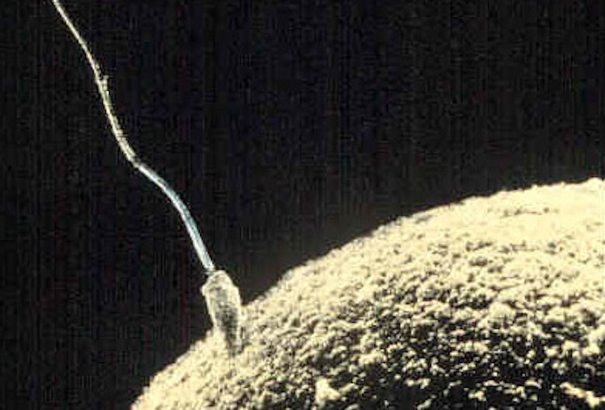
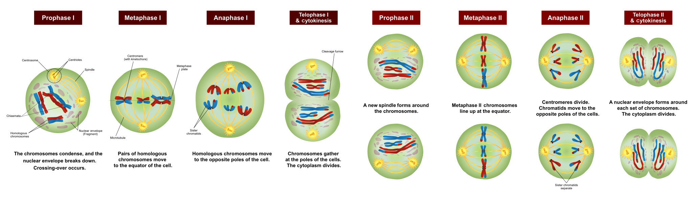

# Sexual Reproduction And Meiosis

[Reproduction](https://en.wikipedia.org/wiki/Reproduction) (or procreation or breeding) is the biological process by which new individual organisms – "offspring" – are produced from their "parents". Reproduction is a fundamental feature of all known life; each individual organism exists as the result of reproduction. There are two forms of reproduction: asexual and sexual.

In asexual reproduction, an organism can reproduce without the involvement of another organism. Asexual reproduction is not limited to single-celled organisms. The cloning of an organism is a form of asexual reproduction. By asexual reproduction, an organism creates a genetically similar or identical copy of itself. The evolution of seual reproduction is a major puzzle for biologists. The two-fold cost of sexual reproduction is that only 50% of organisms reproduce and organisms only pass on 50% of their genes.

### Sexual reproduction

Sexual reproduction is a biological process that creates a new organism by combining the genetic material of two organisms in a process that starts with meiosis, a specialized type of cell division. Each of two parent organisms contributes half of the offspring's genetic makeup by creating haploid gametes. Most organisms form two different types of gametes. In these anisogamous species, the two sexes are referred to as male (producing sperm or microspores) and female (producing ova or megaspores). In isogamous species, the gametes are similar or identical in form (isogametes), but may have separable properties and then may be given other different names. For example, in the green alga, *Chlamydomonas reinhardtii*, there are so-called "plus" and "minus" gametes. A few types of organisms, such as many fungi and the ciliate *Paramecium aurelia*, have more than two "sexes", called syngens. Most animals (including humans) and plants reproduce sexually. Sexually reproducing organisms have different sets of genes for every trait (called alleles). 

(ref:spermegg) [Sperm fertilizing an egg.](https://commons.wikimedia.org/wiki/File:Sperm-egg.jpg) 

(\#fig:spermfertilizingegg)(ref:spermegg)

## Meiosis

Meiosis (from Greek μείωσις, meiosis, which means lessening) is a special type of cell division that reduces the chromosome number by half, creating four haploid cells, each genetically distinct from the parent cell that gave rise to them. This process occurs in all sexually reproducing single-celled and multicellular eukaryotes, including animals, plants, and fungi. Meiotic cell divisions are an essential process during oogenesis and spermatogenesis.

(ref:meio) [In meiosis](https://commons.wikimedia.org/wiki/File:Meiosis_Overview_new.svg), the chromosome or chromosomes duplicate (during interphase) and homologous chromosomes exchange genetic information (chromosomal crossover) during the first division, called meiosis I. The daughter cells divide again in meiosis II, splitting up sister chromatids to form haploid gametes. Two gametes fuse during fertilization, creating a diploid cell with a complete set of paired chromosomes. 

(\#fig:meiosisoverview)(ref:meio)

Errors in meiosis resulting in aneuploidy are the leading known cause of miscarriage and the most frequent genetic cause of developmental disabilities.

In meiosis, DNA replication is followed by two rounds of cell division to produce four daughter cells, each with half the number of chromosomes as the original parent cell. The two meiotic divisions are known as Meiosis I and Meiosis II. Before meiosis begins, during S phase of the cell cycle, the DNA of each chromosome is replicated so that it consists of two identical sister chromatids, which remain held together through sister chromatid cohesion. This S-phase can be referred to as "premeiotic S-phase" or "meiotic S-phase". Immediately following DNA replication, meiotic cells enter a prolonged G2-like stage known as meiotic prophase. During this time, homologous chromosomes pair with each other and undergo genetic recombination, a programmed process in which DNA may be cut and then repaired, which allows them to exchange some of their genetic information. A subset of recombination events results in crossovers, which create physical links known as chiasmata (singular: chiasma, for the Greek letter Chi (X)) between the homologous chromosomes. In most organisms, these links can help direct each pair of homologous chromosomes to segregate away from each other during Meiosis I, resulting in two haploid cells that have half the number of chromosomes as the parent cell. During Meiosis II, the cohesion between sister chromatids is released and they segregate from one another, as during mitosis. In some cases all four of the meiotic products form gametes such as sperm, spores, or pollen. In female animals, three of the four meiotic products are typically eliminated by extrusion into polar bodies, and only one cell develops to produce an ovum. Because the number of chromosomes is halved during meiosis, gametes can fuse (i.e. fertilization) to form a diploid zygote that contains two copies of each chromosome, one from each parent. Thus, alternating cycles of meiosis and fertilization enable sexual reproduction, with successive generations maintaining the same number of chromosomes. For example, diploid human cells contain 23 pairs of chromosomes including 1 pair of sex chromosomes (46 total), half of maternal origin and half of paternal origin. Meiosis produces haploid gametes (ova or sperm) that contain one set of 23 chromosomes. When two gametes (an egg and a sperm) fuse, the resulting zygote is once again diploid, with the mother and father each contributing 23 chromosomes. This same pattern, but not the same number of chromosomes, occurs in all organisms that utilize meiosis.

Meiosis begins with a diploid cell, which contains two copies of each chromosome, termed homologs. First, the cell undergoes DNA replication, so each homolog now consists of two identical sister chromatids. Then each set of homologs pair with each other and exchange genetic information by homologous recombination often leading to physical connections (crossovers) between the homologs. In the first meiotic division, the homologs are segregated to separate daughter cells by the spindle apparatus. The cells then proceed to a second division without an intervening round of DNA replication. The sister chromatids are segregated to separate daughter cells to produce a total of four haploid cells. Female animals employ a slight variation on this pattern and produce one large ovum and two small polar bodies. Because of recombination, an individual chromatid can consist of a new combination of maternal and paternal genetic information, resulting in offspring that are genetically distinct from either parent. Furthermore, an individual gamete can include an assortment of maternal, paternal, and recombinant chromatids. This genetic diversity resulting from sexual reproduction contributes to the variation in traits upon which natural selection can act.

Meiosis uses many of the same mechanisms as mitosis, the type of cell division used by eukaryotes to divide one cell into two identical daughter cells. In some plants, fungi, and protists meiosis results in the formation of spores: haploid cells that can divide vegetatively without undergoing fertilization. Some eukaryotes, like bdelloid rotifers, do not have the ability to carry out meiosis and have acquired the ability to reproduce by parthenogenesis.

Meiosis does not occur in archaea or bacteria, which generally reproduce asexually via binary fission. However, a "sexual" process known as horizontal gene transfer involves the transfer of DNA from one bacterium or archaeon to another and recombination of these DNA molecules of different parental origin.

Meiosis was discovered and described for the first time in sea urchin eggs in 1876 by the German biologist [Oscar Hertwig](https://en.wikipedia.org/wiki/Oscar_Hertwig). It was described again in 1883, at the level of chromosomes, by the Belgian zoologist [Edouard Van Beneden](https://en.wikipedia.org/wiki/Edouard_Van_Beneden), in Ascaris roundworm eggs. The significance of meiosis for reproduction and inheritance, however, was described only in 1890 by German biologist [August Weismann](https://en.wikipedia.org/wiki/August_Weismann), who noted that two cell divisions were necessary to transform one diploid cell into four haploid cells if the number of chromosomes had to be maintained. In 1911 the American geneticist [Thomas Hunt Morgan](https://en.wikipedia.org/wiki/Thomas_Hunt_Morgan) detected crossovers in meiosis in the fruit fly *Drosophila melanogaster*, which helped to establish that genetic traits are transmitted on chromosomes.

The term "meiosis" (originally spelled "maiosis") is derived from the Greek word μείωσις, meaning 'lessening'. It was introduced to biology by [J.B. Farmer](https://en.wikipedia.org/wiki/John_Bretland_Farmer) and [J.E.S. Moore](https://en.wikipedia.org/wiki/John_Edmund_Sharrock_Moore) in 1905:

>We propose to apply the terms Maiosis or Maiotic phase to cover the whole series of nuclear changes included in the two divisions that were designated as Heterotype and Homotype by Flemming."

The term was linguistically corrected to "meiosis" by Koernicke (1905), and by Pantel and De Sinety (1906).

Meiosis is divided into meiosis I and meiosis II which are further divided into Karyokinesis I and Cytokinesis I and Karyokinesis II and Cytokinesis II respectively. The preparatory steps that lead up to meiosis are identical in pattern and name to interphase of the mitotic cell cycle. Interphase is divided into three phases:

* Growth 1 (G1) phase: In this very active phase, the cell synthesizes its vast array of proteins, including the enzymes and structural proteins it will need for growth. In G1, each of the chromosomes consists of a single linear molecule of DNA.
* Synthesis (S) phase: The genetic material is replicated; each of the cell's chromosomes duplicates to become two identical sister chromatids attached at a centromere. This replication does not change the ploidy of the cell since the centromere number remains the same. The identical sister chromatids have not yet condensed into the densely packaged chromosomes visible with the light microscope. This will take place during prophase I in meiosis.
* Growth 2 (G2) phase: G2 phase as seen before mitosis is not present in meiosis. Meiotic prophase corresponds most closely to the G2 phase of the mitotic cell cycle.

Interphase is followed by meiosis I and then meiosis II. Meiosis I separates replicated homologous chromosomes, each still made up of two sister chromatids, into two daughter cells, thus reducing the chromosome number by half. During meiosis II, sister chromatids decouple and the resultant daughter chromosomes are segregated into four daughter cells. For diploid organisms, the daughter cells resulting from meiosis are haploid and contain only one copy of each chromosome. In some species, cells enter a resting phase known as interkinesis between meiosis I and meiosis II.

Meiosis I and II are each divided into prophase, metaphase, anaphase, and telophase stages, similar in purpose to their analogous subphases in the mitotic cell cycle. Therefore, meiosis includes the stages of meiosis I (prophase I, metaphase I, anaphase I, telophase I) and meiosis II (prophase II, metaphase II, anaphase II, telophase II).

Meiosis generates gamete genetic diversity in two ways: (1) Law of Independent Assortment. The independent orientation of homologous chromosome pairs along the metaphase plate during metaphase I & orientation of sister chromatids in metaphase II, this is the subsequent separation of homologs and sister chromatids during anaphase I & II, it allows a random and independent distribution of chromosomes to each daughter cell (and ultimately to gametes); and (2) Crossing Over. The physical exchange of homologous chromosomal regions by homologous recombination during prophase I results in new combinations of genetic information within chromosomes.

During meiosis, specific genes are more highly transcribed. In addition to strong meiotic stage-specific expression of mRNA, there are also pervasive translational controls (e.g. selective usage of preformed mRNA), regulating the ultimate meiotic stage-specific protein expression of genes during meiosis. Thus, both transcriptional and translational controls determine the broad restructuring of meiotic cells needed to carry out meiosis.

(ref:meiostages) [Diagram of the meiotic phases](https://commons.wikimedia.org/wiki/File:Meiosis_Stages.svg) 

(\#fig:meiosisstages)(ref:meiostages)

### Meiosis I

Meiosis I segregates homologous chromosomes, which are joined as tetrads (2n, 4c), producing two haploid cells (n chromosomes, 23 in humans) which each contain chromatid pairs (1n, 2c). Because the ploidy is reduced from diploid to haploid, meiosis I is referred to as a reductional division. Meiosis II is an equational division analogous to mitosis, in which the sister chromatids are segregated, creating four haploid daughter cells (1n, 1c).

### Prophase I

Prophase I is typically the longest phase of meiosis. During prophase I, homologous chromosomes pair and exchange genetic information (homologous recombination). This often results in chromosomal crossover. This process facilitates pairing between homologous chromosomes and hence accurate segregation of the chromosomes at the first meiosis division. The new combinations of DNA created during crossover are a significant source of genetic variation, and result in new combinations of alleles, which may be beneficial. The paired and replicated chromosomes are called bivalents or tetrads, which have two chromosomes and four chromatids, with one chrmosome coming from each parent. The process of pairing the homologous chromosomes is called synapsis. At this stage, non-sister chromatids may cross-over at points called chiasmata (plural; singular chiasma). Prophase I has historically been divided into a series of substages which are named according to the appearance of chromosomes.

The first stage of prophase I is the leptotene stage, also known as leptonema, from Greek words meaning "thin threads". In this stage of prophase I, individual chromosomes—each consisting of two sister chromatids—become "individualized" to form visible strands within the nucleus. The two sister chromatids closely associate and are visually indistinguishable from one another. During leptotene, lateral elements of the synaptonemal complex assemble. Leptotene is of very short duration and progressive condensation and coiling of chromosome fibers takes place.

The zygotene stage, also known as zygonema, from Greek words meaning "paired threads", occurs as the chromosomes approximately line up with each other into homologous chromosome pairs. In some organisms, this is called the bouquet stage because of the way the telomeres cluster at one end of the nucleus. At this stage, the synapsis (pairing/coming together) of homologous chromosomes takes place, facilitated by assembly of central element of the synaptonemal complex. Pairing is brought about in a zipper-like fashion and may start at the centromere (procentric), at the chromosome ends (proterminal), or at any other portion (intermediate). Individuals of a pair are equal in length and in position of the centromere. Thus pairing is highly specific and exact. The paired chromosomes are called bivalent or tetrad chromosomes.

The pachytene stage, also known as pachynema, from Greek words meaning "thick threads". At this point a tetrad of the chromosomes has formed known as a bivalent. This is the stage when homologous recombination, including chromosomal crossover (crossing over), occurs. Nonsister chromatids of homologous chromosomes may exchange genetic information over regions of homology. Sex chromosomes, however, are not wholly identical, and only exchange information over a small region of homology. At the sites where exchange happens, chiasmata form. The exchange of information between the non-sister chromatids results in a recombination of information; each chromosome has the complete set of information it had before, and there are no gaps formed as a result of the process. Because the chromosomes cannot be distinguished in the synaptonemal complex, the actual act of crossing over is not perceivable through the microscope, and chiasmata are not visible until the next stage.

During the diplotene stage, also known as diplonema, from Greek words meaning "two threads", the synaptonemal complex degrades and homologous chromosomes separate from one another a little. The chromosomes themselves uncoil a bit, allowing some transcription of DNA. However, the homologous chromosomes of each bivalent remain tightly bound at chiasmata, the regions where crossing-over occurred. The chiasmata remain on the chromosomes until they are severed at the transition to anaphase I.

In human fetal oogenesis, all developing oocytes develop to this stage and are arrested in prophase I before birth. This suspended state is referred to as the dictyotene stage or dictyate. It lasts until meiosis is resumed to prepare the oocyte for ovulation, which happens at puberty or even later.

Chromosomes condense further during the diakinesis stage, from Greek words meaning "moving through". This is the first point in meiosis where the four parts of the tetrads are actually visible. Sites of crossing over entangle together, effectively overlapping, making chiasmata clearly visible. Other than this observation, the rest of the stage closely resembles prometaphase of mitosis; the nucleoli disappear, the nuclear membrane disintegrates into vesicles, and the meiotic spindle begins to form.

During these stages, two centrosomes, containing a pair of centrioles in animal cells, migrate to the two poles of the cell. These centrosomes, which were duplicated during S-phase, function as microtubule organizing centers nucleating microtubules, which are essentially cellular ropes and poles. The microtubules invade the nuclear region after the nuclear envelope disintegrates, attaching to the chromosomes at the kinetochore. The kinetochore functions as a motor, pulling the chromosome along the attached microtubule toward the originating centrosome, like a train on a track. There are four kinetochores on each tetrad, but the pair of kinetochores on each sister chromatid fuses and functions as a unit during meiosis I.

### Metaphase I

Homologous pairs move together along the metaphase plate: As kinetochore microtubules from both centrosomes attach to their respective kinetochores, the paired homologous chromosomes align along an equatorial plane that bisects the spindle, due to continuous counterbalancing forces exerted on the bivalents by the microtubules emanating from the two kinetochores of homologous chromosomes. This attachment is referred to as a bipolar attachment. The physical basis of the independent assortment of chromosomes is the random orientation of each bivalent along the metaphase plate, with respect to the orientation of the other bivalents along the same equatorial line. The protein complex cohesin holds sister chromatids together from the time of their replication until anaphase. In mitosis, the force of kinetochore microtubules pulling in opposite directions creates tension. The cell senses this tension and does not progress with anaphase until all the chromosomes are properly bi-oriented. In meiosis, establishing tension ordinarily requires at least one crossover per chromosome pair in addition to cohesin between sister chromatids (see Chromosome segregation).

### Anaphase I

Kinetochore microtubules shorten, pulling homologous chromosomes (which each consist of a pair of sister chromatids) to opposite poles. Nonkinetochore microtubules lengthen, pushing the centrosomes farther apart. The cell elongates in preparation for division down the center. Unlike in mitosis, only the cohesin from the chromosome arms is degraded while the cohesin surrounding the centromere remains protected by a protein named Shugoshin (Japanese for "guardian spirit"), what prevents the sister chromatids from separating. This allows the sister chromatids to remain together while homologs are segregated.

### Telophase I

The first meiotic division effectively ends when the chromosomes arrive at the poles. Each daughter cell now has half the number of chromosomes but each chromosome consists of a pair of chromatids. The microtubules that make up the spindle network disappear, and a new nuclear membrane surrounds each haploid set. The chromosomes uncoil back into chromatin. Cytokinesis, the pinching of the cell membrane in animal cells or the formation of the cell wall in plant cells, occurs, completing the creation of two daughter cells. Sister chromatids remain attached during telophase I.

Cells may enter a period of rest known as interkinesis or interphase II. No DNA replication occurs during this stage.

### Meiosis II

Meiosis II is the second meiotic division, and usually involves equational segregation, or separation of sister chromatids. Mechanically, the process is similar to mitosis, though its genetic results are fundamentally different. The end result is production of four haploid cells (n chromosomes, 23 in humans) from the two haploid cells (with n chromosomes, each consisting of two sister chromatids) produced in meiosis I. The four main steps of meiosis II are: prophase II, metaphase II, anaphase II, and telophase II.

In prophase II we see the disappearance of the nucleoli and the nuclear envelope again as well as the shortening and thickening of the chromatids. Centrosomes move to the polar regions and arrange spindle fibers for the second meiotic division.

In metaphase II, the centromeres contain two kinetochores that attach to spindle fibers from the centrosomes at opposite poles. The new equatorial metaphase plate is rotated by 90 degrees when compared to meiosis I, perpendicular to the previous plate.

This is followed by anaphase II, in which the remaining centromeric cohesin, not protected by Shugoshin anymore, is cleaved, allowing the sister chromatids to segregate. The sister chromatids by convention are now called sister chromosomes as they move toward opposing poles.

The process ends with telophase II, which is similar to telophase I, and is marked by decondensation and lengthening of the chromosomes and the disassembly of the spindle. Nuclear envelopes re-form and cleavage or cell plate formation eventually produces a total of four daughter cells, each with a haploid set of chromosomes.

Meiosis is now complete and ends up with four new daughter cells.

Meiosis occurs in eukaryotic life cycles involving sexual reproduction, consisting of the constant cyclical process of meiosis and fertilization. This takes place alongside normal mitotic cell division. In multicellular organisms, there is an intermediary step between the diploid and haploid transition where the organism grows. At certain stages of the life cycle, germ cells produce gametes. Somatic cells make up the body of the organism and are not involved in gamete production.

Cycling meiosis and fertilization events produces a series of transitions back and forth between alternating haploid and diploid states. The organism phase of the life cycle can occu either during the diploid state (diplontic life cycle), during the haploid state (haplontic life cycle), or both (haplodiplontic life cycle, in which there are two distinct organism phases, one during the haploid state and the other during the diploid state).

In the diplontic life cycle (with pre-gametic meiosis), of which humans are a part, the organism is diploid, grown from a diploid cell called the zygote. The organism's diploid germ-line stem cells undergo meiosis to create haploid gametes (the spermatozoa for males and ova for females), which fertilize to form the zygote. The diploid zygote undergoes repeated cellular division by mitosis to grow into the organism.

In the haplontic life cycle (with post-zygotic meiosis), the organism is haploid instead, spawned by the proliferation and differentiation of a single haploid cell called the gamete. Two organisms of opposing sex contribute their haploid gametes to form a diploid zygote. The zygote undergoes meiosis immediately, creating four haploid cells. These cells undergo mitosis to create the organism. Many fungi and many protozoa utilize the haplontic life cycle.

Finally, in the haplodiplontic life cycle (with sporic or intermediate meiosis), the living organism alternates between haploid and diploid states. Consequently, this cycle is also known as the alternation of generations. The diploid organism's germ-line cells undergo meiosis to produce spores. The spores proliferate by mitosis, growing into a haploid organism. The haploid organism's gamete then combines with another haploid organism's gamete, creating the zygote. The zygote undergoes repeated mitosis and differentiation to become a diploid organism again. The haplodiplontic life cycle can be considered a fusion of the diplontic and haplontic life cycles.

### Nondisjunction

The normal separation of chromosomes in meiosis I or sister chromatids in meiosis II is termed disjunction. When the segregation is not normal, it is called nondisjunction. This results in the production of gametes which have either too many or too few of a particular chromosome, and is a common mechanism for trisomy or monosomy. Nondisjunction can occur in the meiosis I or meiosis II, phases of cellular reproduction, or during mitosis.

## Chromosomal Disorders

A [chromosomal disorder](https://en.wikipedia.org/wiki/Chromosome_abnormality), anomaly, aberration, or mutation is a missing, extra, or irregular portion of chromosomal DNA. It can be from a typical number of chromosomes or a structural abnormality in one or more chromosomes. 

### Aberrations

Chromosomal aberrations are disruptions in the normal chromosomal content of a cell and are a major cause of genetic conditions in humans, such as Down syndrome, although most aberrations have little to no effect. Some chromosome abnormalities do not cause disease in carriers, such as translocations, or chromosomal inversions, although they may lead to a higher chance of bearing a child with a chromosome disorder. Abnormal numbers of chromosomes or chromosome sets, called aneuploidy, may be lethal or may give rise to genetic disorders. Genetic counseling is offered for families that may carry a chromosome rearrangement.

### Numerical abnormalities

[Aneuploidy](https://en.wikipedia.org/wiki/Aneuploidy) is the presence of an abnormal number of chromosomes in a cell, for example when an individual either is missing a chromosome from a pair (monosomy) or has more than two chromosomes of a pair (trisomy, tetrasomy, etc.). In the strict sense, a chromosome complement having a number of chromosomes other than 46 (in humans) is considered heteroploid while an exact multiple of the haploid chromosome complement is considered euploid. Thus, a cell with any number of complete chromosome sets is called a euploid cell. An extra or missing chromosome is a common cause of genetic disorders, including some human birth defects. Some cancer cells also have abnormal numbers of chromosomes. About 68% of human solid tumors are aneuploid. Aneuploidy originates during cell division when the chromosomes do not separate properly between the two cells. 

<table class="table" style="margin-left: auto; margin-right: auto;">
<caption>(\#tab:heteroploidy)Terminology and examples of heteroploidy in humans.</caption>
 <thead>
  <tr>
   <th style="text-align:left;"> Number of chromosomes </th>
   <th style="text-align:left;"> Name </th>
   <th style="text-align:left;"> Description </th>
  </tr>
 </thead>
<tbody>
  <tr>
   <td style="text-align:left;width: 7em; "> 1 </td>
   <td style="text-align:left;width: 10em; "> Monosomy </td>
   <td style="text-align:left;width: 20em; "> Monosomy refers to lack of one chromosome of the normal complement. Partial monosomy can occur in unbalanced translocations or deletions, in which only a portion of the chromosome is present in a single copy (see deletion (genetics)). Monosomy of the sex chromosomes (45,X) causes Turner syndrome. </td>
  </tr>
  <tr>
   <td style="text-align:left;width: 7em; "> 2 </td>
   <td style="text-align:left;width: 10em; "> Disomy </td>
   <td style="text-align:left;width: 20em; "> Disomy is the presence of two copies of a chromosome. For organisms such as humans that have two copies of each chromosome (those that are diploid), it is the normal condition. For organisms that normally have three or more copies of each chromosome (those that are triploid or above), disomy is an aneuploid chromosome complement. In uniparental disomy, both copies of a chromosome come from the same parent (with no contribution from the other parent). </td>
  </tr>
  <tr>
   <td style="text-align:left;width: 7em; "> 3 </td>
   <td style="text-align:left;width: 10em; "> Trisomy </td>
   <td style="text-align:left;width: 20em; "> Trisomy refers to the presence of three copies, instead of the normal two, of a particular chromosome. The presence of an extra chromosome 21, which is found in Down syndrome, is called trisomy 21. Trisomy 18 and Trisomy 13, known as Edwards syndrome and Patau syndrome, respectively, are the two other autosomal trisomies recognized in live-born humans. Trisomy of the sex chromosomes is also possible, for example (47,XXX), (47,XXY), and (47,XYY). </td>
  </tr>
  <tr>
   <td style="text-align:left;width: 7em; "> 4/5 </td>
   <td style="text-align:left;width: 10em; "> Tetrasomy/pentasomy </td>
   <td style="text-align:left;width: 20em; "> Tetrasomy and pentasomy are the presence of four or five copies of a chromosome, respectively. Although rarely seen with autosomes, sex chromosome tetrasomy and pentasomy have been reported in humans, including XXXX, XXYY, XXXXX, XXXXY, and XYYYY. </td>
  </tr>
</tbody>
</table>

An example of trisomy in humans is [Down syndrome](https://en.wikipedia.org/wiki/Down_syndrome), which is a developmental disorder caused by an extra copy of chromosome 21; the disorder is therefore also called trisomy 21. Having an extra copy of this chromosome means that individuals have three copies of each of its genes instead of two, making it difficult for cells to properly control how much protein is made. Producing too much or too little protein can have serious consequences. Genes on chromosome 21 that specifically contribute to the various symptoms of Down syndrome are now being identified. The frequency of Trisomy 21 has been determined to be a function of advanced maternal age.

(ref:down) [Chromosomes in Down syndrome, the most common human condition due to aneuploidy. There is an extra (third) chromosomes 21 (in the last row) in this karyogram.](https://commons.wikimedia.org/wiki/File:Down_Syndrome_Karyotype.png)

An example of monosomy is [Turner syndrome](https://en.wikipedia.org/wiki/Turner_syndrome), where the individual is born with only one sex chromosome, an X.

Other examples include:

* Cri du chat, which is caused by the deletion of part of the short arm of chromosome 5. "Cri du chat" means "cry of the cat" in French; the condition was so-named because affected babies make high-pitched cries that sound like those of a cat. Affected individuals have wide-set eyes, a small head and jaw, moderate to severe mental health problems, and are very short.
* Edwards syndrome, or trisomy-18, the second most common trisomy. Symptoms include motor retardation, developmental disability and numerous congenital anomalies causing serious health problems. Ninety percent of those affected die in infancy. They have characteristic clenched hands and overlapping fingers.
* Isodicentric 15, also called idic(15), partial tetrasomy 15q, or inverted duplication 15 (inv dup 15).
* Jacobsen syndrome, which is very rare. It is also called the terminal 11q deletion disorder. Those affected have normal intelligence or mild developmental disability, with poor expressive language skills. Most have a bleeding disorder called Paris-Trousseau syndrome.
* Klinefelter syndrome (XXY). Men with Klinefelter syndrome are usually sterile and tend to be taller and have longer arms and legs than their peers. Boys with the syndrome are often shy and quiet and have a higher incidence of speech delay and dyslexia. Without testosterone treatment, some may develop gynecomastia during puberty.
* Patau Syndrome, also called D-Syndrome or trisomy-13. Symptoms are somewhat similar to those of trisomy-18, without the characteristic folded hand.
* Small supernumerary marker chromosome. This means there is an extra, abnormal chromosome. Features depend on the origin of the extra genetic material. Cat-eye syndrome and isodicentric chromosome 15 syndrome (or Idic15) are both caused by a supernumerary marker chromosome, as is Pallister–Killian syndrome.
* Triple-X syndrome (XXX). XXX girls tend to be tall and thin and have a higher incidence of dyslexia.
* Wolf–Hirschhorn syndrome, which is caused by partial deletion of the short arm of chromosome 4. It is characterized by growth retardation, delayed motor skills development, "Greek Helmet" facial features, and mild to profound mental health problems.
* XYY syndrome. XYY boys are usually taller than their siblings. Like XXY boys and XXX girls, they are more likely to have learning difficulties.

Chromosome abnormalities are detected in 1 of 160 live human births. Most cases of aneuploidy in the germline result in miscarriage and the most common extra autosomal chromosomes among live births are 21, 18, and 13.

Most cells in the human body have 23 pairs of chromosomes, or a total of 46 chromosomes. (The sperm and egg, or gametes, each have 23 unpaired chromosomes, and red blood cells have no nucleus and no chromosomes). One copy of each pair is inherited from the mother and the other copy is inherited from the father. The first 22 pairs of chromosomes (called autosomes) are numbered from 1 to 22, from largest to smallest. The 23rd pair of chromosomes are the sex chromosomes. Normal females have two X chromosomes, while normal males have one X chromosome and one Y chromosome. The characteristics of the chromosomes in a cell as they are seen under a light microscope are called the karyotype.

During meiosis, when germ cells divide to create sperm and egg (gametes), each half should have the same number of chromosomes. But sometimes, the whole pair of chromosomes will end up in one gamete, and the other gamete will not get that chromosome at all.

Most embryos cannot survive with a missing or extra autosome (numbered chromosome) and are spontaneously aborted. The most frequent aneuploidy in humans is trisomy 16, although fetuses affected with the full version of this chromosome abnormality do not survive to term (it is possible for surviving individuals to have the mosaic form, where trisomy 16 exists in some cells but not all). The most common aneuploidy that infants can survive with is trisomy 21, which is found in Down syndrome, affecting 1 in 800 births. Trisomy 18 (Edwards syndrome) affects 1 in 6,000 births, and trisomy 13 (Patau syndrome) affects 1 in 10,000 births. 10% of infants with trisomy 18 or 13 reach 1 year of age.

Changes in chromosome number may not necessarily be present in all cells in an individual. When aneuploidy is detected in a fraction of cells in an individual, it is called chromosomal mosaicism. In general, individuals who are mosaic for a chromosomal aneuploidy tend to have a less severe form of the syndrome compared to those with full trisomy. For many of the autosomal trisomies, only mosaic cases survive to term. However, mitotic aneuploidy may be more common than previously recognized in somatic tissues, and aneuploidy is a characteristic of many types of tumorigenesis (see below).

### Mechanisms

Nondisjunction usually occurs as the result of a weakened mitotic checkpoint, as these checkpoints tend to arrest or delay cell division until all components of the cell are ready to enter the next phase. If a checkpoint is weakened, the cell may fail to 'notice' that a chromosome pair is not lined up on the mitotic plate, for example. In such a case, most chromosomes would separate normally (with one chromatid ending up in each cell), while others could fail to separate at all. This would generate a daughter cell lacking a copy and a daughter cell with an extra copy.

Completely inactive mitotic checkpoints may cause nondisjunction at multiple chromosomes, possibly all. Such a scenario could result in each daughter cell possessing a disjoint set of genetic material.

### Diagnosis

Germline aneuploidy is typically detected through karyotyping, a process in which a sample of cells is fixed and stained to create the typical light and dark chromosomal banding pattern and a picture of the chromosomes is analyzed. Other techniques include fluorescence in situ hybridization (FISH), quantitative PCR of short tandem repeats, quantitative fluorescence PCR (QF-PCR), quantitative PCR dosage analysis, Quantitative Mass Spectrometry of Single Nucleotide Polymorphisms, and comparative genomic hybridization (CGH).

These tests can also be performed prenatally to detect aneuploidy in a pregnancy, through either amniocentesis or chorionic villus sampling Pregnant women of 35 years or older are offered prenatal testing because the chance of chromosomal aneuploidy increases as the mother's age increases.

Recent advances have allowed for less invasive testing methods based on the presence of fetal genetic material in maternal blood.

### Structural abnormalities

When the chromosome's structure is altered, this can take several forms:

* Deletions: A portion of the chromosome is missing or deleted. Known disorders in humans include Wolf-Hirschhorn syndrome, which is caused by partial deletion of the short arm of chromosome 4; and Jacobsen syndrome, also called the terminal 11q deletion disorder.
* Duplications: A portion of the chromosome is duplicated, resulting in extra genetic material. Known human disorders include Charcot-Marie-Tooth disease type 1A, which may be caused by duplication of the gene encoding peripheral myelin protein 22 (PMP22) on chromosome 17.
* Translocations: A portion of one chromosome is transferred to another chromosome. There are two main types of translocations:
  * Reciprocal translocation: Segments from two different chromosomes have been exchanged.
  * Robertsonian translocation: An entire chromosome has attached to another at the centromere - in humans these only occur with chromosomes 13, 14, 15, 21, and 22.
* Inversions: A portion of the chromosome has broken off, turned upside down, and reattached, therefore the genetic material is inverted.
* Insertions: A portion of one chromosome has been deleted from its normal place and inserted into another chromosome.
* Rings: A portion of a chromosome has broken off and formed a circle or ring. This can happen with or without loss of genetic material.
* Isochromosome: Formed by the mirror image copy of a chromosome segment including the centromere.

Chromosome instability syndromes are a group of disorders characterized by chromosomal instability and breakage. They often lead to an increased tendency to develop certain types of malignancies.

Most chromosome abnormalities occur as an accident in the egg cell or sperm, and therefore the anomaly is present in every cell of the body. Some anomalies, however, can happen after conception, resulting in mosaicism (where some cells have the anomaly and some do not). Chromosome anomalies can be inherited from a parent or be "de novo". This is why chromosome studies are often performed on parents when a child is found to have an anomaly. If the parents do not possess the abnormality it was not initially inherited; however it may be transmitted to subsequent generations.

### Acquired Chromosomal Abnormalities

Most cancers, if not all, involve chromosome abnormalities, with either the formation of hybrid genes and fusion proteins, deregulation of genes and overexpression of proteins, or loss of tumor suppressor genes.

