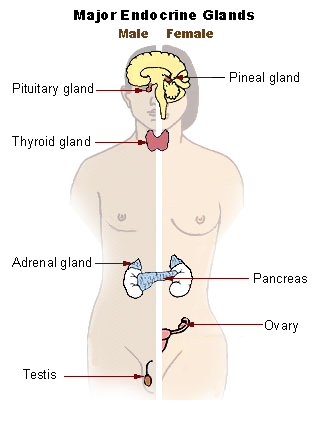
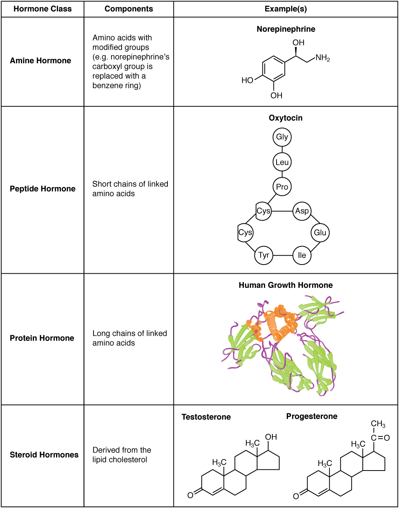
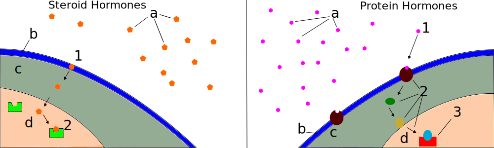
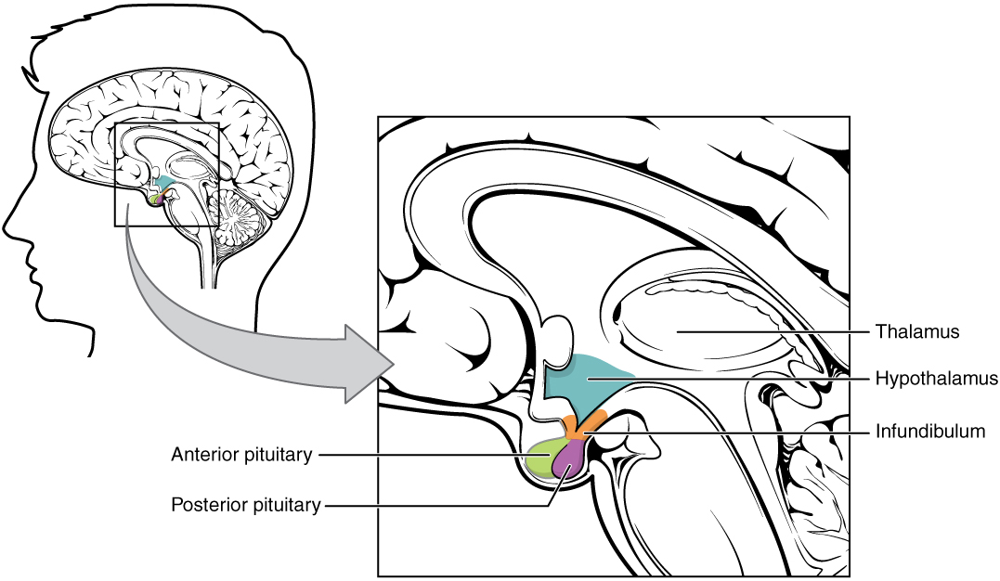
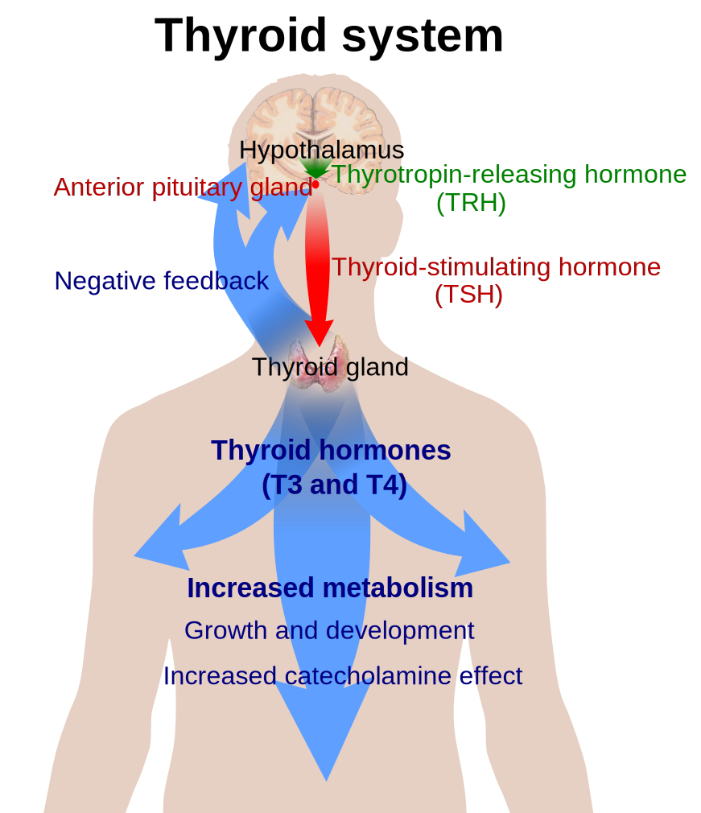
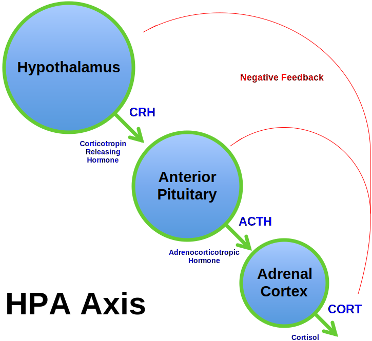

# Endocrine Systems

The endocrine system is a chemical messenger system comprising feedback loops of the hormones released by internal glands of an organism directly into the circulatory system, regulating distant target organs. In humans, the major endocrine glands are the thyroid gland and the adrenal glands. In vertebrates, the hypothalamus is the neural control center for all endocrine systems. The study of the endocrine system and its disorders is known as endocrinology. Endocrinology is a branch of internal medicine.

A neuroendocrine system has been observed in all animals with a nervous system and all vertebrates have a hypothalamus-pituitary axis. All vertebrates have a thyroid, which in amphibians is also crucial for transformation of larvae into adult form. All vertebrates have adrenal gland tissue, with mammals unique in having it organized into layers. All vertebrates have some form of a renin–angiotensin axis, and all tetrapods have aldosterone as a primary mineralocorticoid.

A number of glands that signal each other in sequence are usually referred to as an axis, such as the hypothalamic-pituitary-adrenal axis. In addition to the specialized endocrine organs mentioned above, many other organs that are part of other body systems have secondary endocrine functions, including bone, kidneys, liver, heart and gonads. For example, the kidney secretes the endocrine hormone erythropoietin. Hormones can be amino acid complexes, steroids, eicosanoids, leukotrienes, or prostaglandins.

The endocrine system can be contrasted to both exocrine glands, which secrete hormones to the outside of the body, and paracrine signalling between cells over a relatively short distance. Endocrine glands have no ducts, are vascular, and commonly have intracellular vacuoles or granules that store their hormones. In contrast, exocrine glands, such as salivary glands, sweat glands, and glands within the gastrointestinal tract, tend to be much less vascular and have ducts or a hollow lumen.

The word endocrine derives via New Latin from the Greek words ἔνδον, endon, "inside, within," and "crine" from the κρίνω, krīnō, "to separate, distinguish".

Endocrine glands are glands of the endocrine system that secrete their products, hormones, directly into interstitial spaces and then absorbed into blood rather than through a duct. The major glands of the endocrine system include the pineal gland, pituitary gland, pancreas, ovaries, testes, thyroid gland, parathyroid gland, hypothalamus and adrenal glands. The hypothalamus and pituitary gland are neuroendocrine organs.

(ref:majendo) [Main glands of the human endocrine system.](https://commons.wikimedia.org/wiki/File:Illu_endocrine_system_New.png) 

```{r majorendocrineglands, fig.cap='(ref:majendo)', echo=FALSE, message=FALSE, warning=FALSE}

```
A hormone (from the Greek participle ὁρμῶν, "setting in motion") is any member of a class of signaling molecules, produced by glands in multicellular organisms, that are transported by the circulatory system to target distant organs to regulate physiology and behavior. Hormones have diverse chemical structures, mainly of three classes:

* eicosanoids
* steroids
* amino acid/protein derivatives (amines, peptides, and proteins)

(ref:exhorm) [Representative examples of the three chemical classes of hormones in the human body.](https://commons.wikimedia.org/wiki/File:1802_Examples_of_Amine_Peptide_Protein_and_Steroid_Hormone_Structure.jpg) 

```{r hormoneexamples, fig.cap='(ref:exhorm)', echo=FALSE, message=FALSE, warning=FALSE}

```

The glands that secrete hormones comprise the endocrine system.

Hormonal effects are dependent on where they are released, as they can be released in different manners. Not all hormones are released from a cell and into the blood until it binds to a receptor on a target. The major types of hormone signaling are:

* Endocrine – Acts on the target cell after being released into the bloodstream.
* Paracrine – Acts on a nearby cell and does not have to enter general circulation.
* Autocrine – Affects the cell type that secreted it and causes a biological effect.
* Intracrine – Acts intracellularly on the cell that synthesized it.

Hormones are used to communicate between organs and tissues for physiological regulation and behavioral activities, such as digestion, metabolism, respiration, tissue function, sensory perception, sleep, excretion, lactation, stress, growth and development, movement, reproduction, and mood.

Hormones affect distant cells by binding to specific receptor proteins in the target cell resulting in a change in cell function. This may lead to cell type-specific responses that include rapid changes to the activity of existing proteins, or slower changes in the expression of target genes. Amino acid–based hormones (amines and peptide or protein hormones) are water-soluble and act on the surface of target cells via signal transduction pathways; steroid hormones, being lipid-soluble, move through the plasma membranes of target cells to act within their nuclei.

(ref:hormact) [The left diagram shows a steroid (lipid) hormone (1) entering a cell and (2) binding to a receptor protein in the nucleus, causing (3) mRNA synthesis which is the first step of protein synthesis. The right side shows protein hormones (1) binding with receptors which (2) begins a transduction pathway. The transduction pathway ends (3) with transcription factors being activated in the nucleus, and protein synthesis beginning. In both diagrams, a is the hormone, b is the cell membrane, c is the cytoplasm, and d is the nucleus.](https://commons.wikimedia.org/wiki/File:Steroid_and_Lipid_Hormones.svg) 

```{r hormoneaction, fig.cap='(ref:hormact)', echo=FALSE, message=FALSE, warning=FALSE}

```

## The Hypothalamus

The hypothalamus (from Ancient Greek ὑπό, "under", and θάλαμος, "chamber") is a portion of the brain that has a central neuroendocrine function, most notably by its control of the anterior pituitary, which in turn regulates various endocrine glands and organs. Releasing hormones (also called releasing factors) are produced in hypothalamic nuclei then transported along axons to the posterior pituitary, where they are stored and released as needed.

(ref:hpc) [The Hypothalamus-Pituitary Complex.](https://commons.wikimedia.org/wiki/File:1806_The_Hypothalamus-Pituitary_Complex.jpg) 

```{r hpcomplex, fig.cap='(ref:hpc)', echo=FALSE, message=FALSE, warning=FALSE}

```

In the hypothalamic–adenohypophyseal axis, releasing hormones, also known as hypophysiotropic or hypothalamic hormones, are released from the median eminence, a prolongation of the hypothalamus, into the hypophyseal portal system, which carries them to the anterior pituitary where they exert their regulatory functions on the secretion of adenohypophyseal hormones. These hypophysiotropic hormones are stimulated by parvocellular neurosecretory cells located in the periventricular area of the hypothalamus. After their release into the capillaries of the third ventricle, the hypophysiotropic hormones travel through what is known as the hypothalamo-pituitary portal circulation. Once they reach their destination in the anterior pituitary, these hormones bind to specific receptors located on the surface of pituitary cells. Depending on which cells are activated through this binding, the pituitary will either begin secreting or stop secreting hormones into the rest of the bloodstream.

```{r anteriorpituitaryhormones, out.width='75%', echo=FALSE, message=FALSE, warning=FALSE}
library(tidyverse)
library(printr)        
library(kableExtra)
setwd("~/Dropbox/R/biology-text-master")

ante <-  as_tibble(read.csv("data/anterior_pituitary_hormones.csv"))

knitr::kable(ante, col.names = c("Secreted hormone", "Abbreviation", "Produced by", "Effect"), digits = 2, align = 'llll', booktabs = TRUE, caption = "Hormones of the anterior pituitary gland.") %>% kable_styling(latex_options = c("striped", "hold_position")) 
```

In the hypothalamic-neurohypophyseal axis, neurohypophysial hormones are released from the posterior pituitary, which is actually a prolongation of the hypothalamus, into the circulation.

```{r posteriorpituitaryhormones, out.width='75%', echo=FALSE, message=FALSE, warning=FALSE}
library(tidyverse)
library(printr)        
library(kableExtra)
setwd("~/Dropbox/R/biology-text-master")

post <-  as_tibble(read.csv("data/posterior_pituitary_hormones.csv"))

knitr::kable(post, col.names = c("Secreted hormone", "Abbreviation", "Produced by", "Effect"), digits = 2, align = 'llll', booktabs = TRUE, caption = "Hormones of the posterior pituitary gland.") %>% kable_styling(latex_options = c("striped", "hold_position")) 
```

## Hypothalamic–pituitary–thyroid axis

The hypothalamic–pituitary–thyroid axis (HPT axis for short, a.k.a. thyroid homeostasis or thyrotropic feedback control) is part of the neuroendocrine system responsible for the regulation of metabolism and also responds to stress.

(ref:hpt) [The hypothalamic–pituitary–thyroid axis (HPT axis for short, a.k.a. thyroid homeostasis or thyrotropic feedback control) is part of the neuroendocrine system responsible for the regulation of metabolism and also responds to stress.](https://commons.wikimedia.org/wiki/File:Thyroid_system.svg) 

```{r hpthyroid, fig.cap='(ref:hpt)', echo=FALSE, message=FALSE, warning=FALSE}

```

As its name suggests, it depends upon the hypothalamus, the pituitary gland, and the thyroid gland.

The hypothalamus senses low circulating levels of thyroid hormone (Triiodothyronine (T3) and Thyroxine (T4)) and responds by releasing thyrotropin-releasing hormone (TRH). The TRH stimulates the anterior pituitary to produce thyroid-stimulating hormone (TSH). The TSH, in turn, stimulates the thyroid to produce thyroid hormone until levels in the blood return to normal. Thyroid hormone exerts negative feedback control over the hypothalamus as well as anterior pituitary, thus controlling the release of both TRH from hypothalamus and TSH from anterior pituitary gland.

Thyroid homeostasis results from a multi-loop feedback system that is found in virtually all higher vertebrates. Proper function of thyrotropic feedback control is indispensable for growth, differentiation, reproduction and intelligence. Very few animals (e.g. axolotls and sloths) have impaired thyroid homeostasis that exhibits a very low set-point that is assumed to underlie the metabolic and ontogenetic anomalies of these animals.

The pituitary gland secretes thyrotropin (TSH; Thyroid Stimulating Hormone) that stimulates the thyroid to secrete thyroxine (T4) and, to a lesser degree, triiodothyronine (T3). The major portion of T3, however, is produced in peripheral organs, e.g. liver, adipose tissue, glia and skeletal muscle by deiodination from circulating T4. Deiodination is controlled by numerous hormones and nerval signals including TSH, vasopressin and catecholamines.

Both peripheral thyroid hormones (iodothyronines) inhibit thyrotropin secretion from the pituitary (negative feedback). Consequently, equilibrium concentrations for all hormones are attained.

TSH secretion is also controlled by thyrotropin releasing hormone (thyroliberin, TRH), whose secretion itself is again suppressed by plasma T4 and T3 in CSF (long feedback, Fekete–Lechan loop). Additional feedback loops are ultrashort feedback control of TSH secretion (Brokken-Wiersinga-Prummel loop) and linear feedback loops controlling plasma protein binding.

Recent research suggested the existence of an additional feedforward motif linking TSH release to deiodinase activity in humans. The existence of this TSH-T3 shunt could explain why deiodinase activity is higher in hypothyroid patients and why a minor fraction of affected individuals may benefit from substitution therapy with T3.

Convergence of multiple afferent signals in the control of TSH release including but not limited to T3, cytokines and TSH receptor antibodies may be the reason for the observation that the relation between free T4 concentration and TSH levels deviates from a pure loglinear relation that has previously been proposed.

## Hypothalamic–pituitary–gonadal axis

The hypothalamic–pituitary–gonadal axis (HPG axis) refers to the hypothalamus, pituitary gland, and gonadal glands as if these individual endocrine glands were a single entity. Because these glands often act in concert, physiologists and endocrinologists find it convenient and descriptive to speak of them as a single system.

(ref:hpg) [The hypothalamic–pituitary–gonadal axis (HPG axis) refers to the hypothalamus, pituitary gland, and gonadal glands as if these individual endocrine glands were a single entity. Because these glands often act in concert, physiologists and endocrinologists find it convenient and descriptive to speak of them as a single system.](https://commons.wikimedia.org/wiki/File:Hypothalamic–pituitary–gonadal_axis.svg) 

```{r hpgonadal, fig.cap='(ref:hpg)', echo=FALSE, message=FALSE, warning=FALSE}
knitr::include_graphics("./figures/endocrine/Hypothalamic–pituitary–gonadal_axis.svg")
```

The HPG axis plays a critical part in the development and regulation of a number of the body's systems, such as the reproductive and immune systems. Fluctuations in this axis cause changes in the hormones produced by each gland and have various local and systemic effects on the body.

The axis controls development, reproduction, and aging in animals. Gonadotropin-releasing hormone (GnRH) is secreted from the hypothalamus by GnRH-expressing neurons. The anterior portion of the pituitary gland produces luteinizing hormone (LH) and follicle-stimulating hormone (FSH), and the gonads produce estrogen and testosterone.

In oviparous organisms (e.g. fish, reptiles, amphibians, birds), the HPG axis is commonly referred to as the hypothalamus-pituitary-gonadal-liver axis (HPGL-axis) in females. Many egg-yolk and chorionic proteins are synthesized heterologously in the liver, which are necessary for ovocyte growth and development. Examples of such necessary liver proteins are vitellogenin and choriogenin.

The hypothalamus is located in the brain and secretes GnRH. GnRH travels down the anterior portion of the pituitary via the hypophyseal portal system and binds to receptors on the secretory cells of the adenohypophysis. In response to GnRH stimulation these cells produce LH and FSH, which travel into the blood stream.

These two hormones play an important role in communicating to the gonads. In females FSH and LH act primarily to activate the ovaries to produce estrogen and inhibin and to regulate the menstrual cycle and ovarian cycle. Estrogen forms a negative feedback loop by inhibiting the production of GnRH in the hypothalamus. Inhibin acts to inhibit activin, which is a peripherally produced hormone that positively stimulates GnRH-producing cells. Follistatin, which is also produced in all body tissue, inhibits activin and gives the rest of the body more control over the axis. In males LH stimulates the interstitial cells located in the testes to produce testosterone, and FSH plays a role in spermatogenesis. Only small amounts of estrogen are secreted in males. Recent research has shown that a neurosteroid axis exists, which helps the cortex to regulate the hypothalamus's production of GnRH.

In addition, leptin and insulin have stimulatory effects and ghrelin has inhibitory effects on gonadotropin-releasing hormone (GnRH) secretion from the hypothalamus. Kisspeptin also influences GnRH secretion.

One of the most important functions of the HPG axis is to regulate reproduction by controlling the uterine and ovarian cycles. In females, the positive feedback loop between estrogen and luteinizing hormone help to prepare the follicle in the ovary and the uterus for ovulation and implantation. When the egg is released, the empty follicle sac begins to produce progesterone to inhibit the hypothalamus and the anterior pituitary thus stopping the estrogen-LH positive feedback loop. If conception occurs, the placenta will take over the secretion of progesterone; therefore the mother cannot ovulate again. If conception does not occur, decreasing excretion of progesterone will allow the hypothalamus to restart secretion of GnRH. These hormone levels also control the uterine (menstrual) cycle causing the proliferation phase in preparation for ovulation, the secretory phase after ovulation, and menstruation when conception does not occur. The activation of the HPG axis in both males and females during puberty also causes individuals to acquire secondary sex characteristics.

In males, the production of GnRH, LH, and FSH are similar, but the effects of these hormones are different. FSH stimulates sustentacular cells to release androgen-binding protein, which promotes testosterone binding. LH binds to the interstitial cells, causing them to secrete testosterone. Testosterone is required for normal spermatogenesis and inhibits the hypothalamus. Inhibin is produced by the spermatogenic cells, which, also through inactivating activin, inhibits the hypothalamus. After puberty these hormones levels remain relatively constant.

The activation and deactivation of the HPG axis also helps to regulate life cycles. At birth FSH and LH levels are elevated, and females also have a lifetime supply of primary oocytes. These levels decrease and remain low through childhood. During puberty the HPG axis is activated by the secretions of estrogen from the ovaries or testosterone from the testes. This activation of estrogen and testosterone causes physiological and psychological changes. Once activated, the HPG axis continues to function in men for the rest of their life but becomes deregulated in women, leading to menopause. This deregulation is caused mainly by the lack of oocytes that normally produce estrogen to create the positive feedback loop. Over several years, the activity the HPG axis decreases and women are no longer fertile.

Although males remain fertile until death, the activity of the HPG axis decreases. As males age, the testes begin to produce less testosterone, leading to a condition known as post-pubertal hypogonadism. The cause of the decreased testosterone is unclear and a current topic of research. Post-pubertal hypogonadism results in progressive muscle mass decrease, increase in visceral fat mass, loss of libido, impotence, decreased attention, increased risk of fractures, and abnormal sperm production.

Sex steroids also affect behavior, because sex steroids affect the brains structure and functioning. During development, hormones help determine how neurons synapse and migrate to result in sexual dimorphisms. These physical differences lead to differences in behavior. While GnRH has not been shown to have any direct influence on regulating brain structure and function, gonadotropins, sex steroids, and activin have been shown to have such effects. It is thought that FSH may have an important role in brain development and differentiation.

Testosterone levels have been shown to relate to prosocial behavior. This helps create synaptogenesis by promoting neurite development and migration. Activin promotes neural plasticity throughout the lifespan and regulates the neurotransmitters of peripheral neurons. Environment can also affect hormones and behavior interaction. Women have more connections between areas of language better enabling them to communicate than men. On average men outperform women on spatial reasoning tests, which is theorized to result from sexual differences. Testosterone has been linked to aggression and sex drive; therefore men tend to be more competitive or aggressive than women. There is also a large amount of individual diversity within all these traits and hormone levels.

## Hypothalamic–pituitary–adrenal axis

The hypothalamic–pituitary–adrenal axis (HPA axis or HTPA axis) is a complex set of direct influences and feedback interactions among three components: the hypothalamus, the pituitary gland (a pea-shaped structure located below the thalamus), and the adrenal (also called "suprarenal") glands (small, conical organs on top of the kidneys).

(ref:hpa) [The hypothalamic–pituitary–adrenal axis (HPA axis or HTPA axis) is a complex set of direct influences and feedback interactions among three components: the hypothalamus, the pituitary gland (a pea-shaped structure located below the thalamus), and the adrenal (also called "suprarenal") glands (small, conical organs on top of the kidneys).](https://commons.wikimedia.org/wiki/File:HPA_Axis_Diagram_(Brian_M_Sweis_2012).svg) 

```{r hpadrenal, fig.cap='(ref:hpa)', echo=FALSE, message=FALSE, warning=FALSE}

```

These organs and their interactions constitute the HPA axis, a major neuroendocrine system that controls reactions to stress and regulates many body processes, including digestion, the immune system, mood and emotions, sexuality, and energy storage and expenditure. It is the common mechanism for interactions among glands, hormones, and parts of the midbrain that mediate the general adaptation syndrome (GAS). While steroid hormones are produced mainly in vertebrates, the physiological role of the HPA axis and corticosteroids in stress response is so fundamental that analogous systems can be found in invertebrates and monocellular organisms as well.

The key elements of the HPA axis are:

* The paraventricular nucleus of the hypothalamus, which contains neuroendocrine neurons which synthesize and secrete vasopressin and corticotropin-releasing hormone (CRH). These two peptides regulate:
  * The anterior lobe of the pituitary gland. In particular, CRH and vasopressin stimulate the secretion of adrenocorticotropic hormone (ACTH), once known as corticotropin. ACTH in turn acts on:
  * the adrenal cortex, which produces glucocorticoid hormones (mainly cortisol in humans) in response to stimulation by ACTH. Glucocorticoids in turn act back on the hypothalamus and pituitary (to suppress CRH and ACTH production) in a negative feedback cycle.

CRH and vasopressin are released from neurosecretory nerve terminals at the median eminence. CRH is transported to the anterior pituitary through the portal blood vessel system of the hypophyseal stalk and vasopressin is transported by axonal transport to the posterior pituitary gland. There, CRH and vasopressin act synergistically to stimulate the secretion of stored ACTH from corticotrope cells. ACTH is transported by the blood to the adrenal cortex of the adrenal gland, where it rapidly stimulates biosynthesis of corticosteroids such as cortisol from cholesterol. Cortisol is a major stress hormone and has effects on many tissues in the body, including the brain. In the brain, cortisol acts on two types of receptor – mineralocorticoid receptors and glucocorticoid receptors, and these are expressed by many different types of neurons. One important target of glucocorticoids is the hypothalamus, which is a major controlling centre of the HPA axis.

Vasopressin can be thought of as "water conservation hormone" and is also known as "antidiuretic hormone." It is released when the body is dehydrated and has potent water-conserving effects on the kidney. It is also a potent vasoconstrictor.

Important to the function of the HPA axis are some of the feedback loops:

* Cortisol produced in the adrenal cortex will negatively feedback to inhibit both the hypothalamus and the pituitary gland. This reduces the secretion of CRH and vasopressin, and also directly reduces the cleavage of proopiomelanocortin (POMC) into ACTH and β-endorphins.
* Epinephrine and norepinephrine (E/NE) are produced by the adrenal medulla through sympathetic stimulation and the local effects of cortisol (upregulation enzymes to make E/NE). E/NE will positively feedback to the pituitary and increase the breakdown of POMCs into ACTH and β-endorphins.

Release of corticotropin-releasing hormone (CRH) from the hypothalamus is influenced by stress, physical activity, illness, by blood levels of cortisol and by the sleep/wake cycle (circadian rhythm). In healthy individuals, cortisol rises rapidly after wakening, reaching a peak within 30–45 minutes. It then gradually falls over the day, rising again in late afternoon. Cortisol levels then fall in late evening, reaching a trough during the middle of the night. This corresponds to the rest-activity cycle of the organism. An abnormally flattened circadian cortisol cycle has been linked with chronic fatigue syndrome, insomnia and burnout.

The HPA axis has a central role in regulating many homeostatic systems in the body, including the metabolic system, cardiovascular system, immune system, reproductive system and central nervous system. The HPA axis integrates physical and psychosocial influences in order to allow an organism to adapt effectively to its environment, use resources, and optimize survival.

Anatomical connections between brain areas such as the amygdala, hippocampus, prefrontal cortex and hypothalamus facilitate activation of the HPA axis. Sensory information arriving at the lateral aspect of the amygdala is processed and conveyed to the amygdala's central nucleus, which then projects out to several parts of the brain involved in responses to fear. At the hypothalamus, fear-signaling impulses activate both the sympathetic nervous system and the modulating systems of the HPA axis.

Increased production of cortisol during stress results in an increased availability of glucose in order to facilitate fighting or fleeing. As well as directly increasing glucose availability, cortisol also suppresses the highly demanding metabolic processes of the immune system, resulting in further availability of glucose.

Glucocorticoids have many important functions, including modulation of stress reactions, but in excess they can be damaging. Atrophy of the hippocampus in humans and animals exposed to severe stress is believed to be caused by prolonged exposure to high concentrations of glucocorticoids. Deficiencies of the hippocampus may reduce the memory resources available to help a body formulate appropriate reactions to stress.
