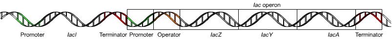
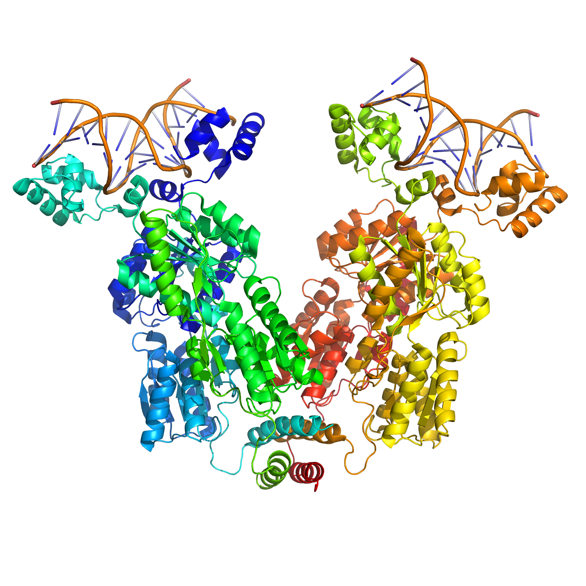
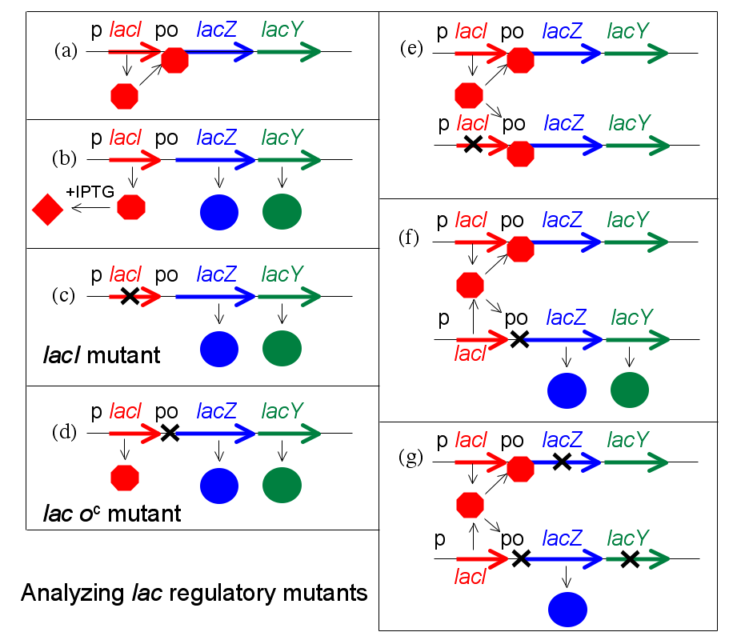

# Regulation of Gene Expression

[Regulation of gene expression](https://en.wikipedia.org/wiki/Regulation_of_gene_expression), or gene regulation, includes a wide range of mechanisms that are used by cells to increase or decrease the production of specific gene products (protein or RNA). Sophisticated programs of gene expression are widely observed in biology, for example to trigger developmental pathways, respond to environmental stimuli, or adapt to new food sources. Virtually any step of gene expression can be modulated, from transcriptional initiation, to RNA processing, and to the post-translational modification of a protein. Often, one gene regulator controls another, and so on, in a gene regulatory network.

Gene regulation is essential for viruses, prokaryotes and eukaryotes as it increases the versatility and adaptability of an organism by allowing the cell to express protein when needed.

In multicellular organisms, gene regulation drives cellular differentiation and morphogenesis in the embryo, leading to the creation of different cell types that possess different gene expression profiles from the same genome sequence. Although this does not explain how gene regulation originated, evolutionary biologists include it as a partial explanation of how evolution works at a molecular level, and it is central to the science of evolutionary developmental biology ("evo-devo").

Although as early as 1951, [Barbara McClintock](https://en.wikipedia.org/wiki/Barbara_McClintock) showed interaction between two genetic loci, Activator (Ac) and Dissociator (Ds), in the color formation of maize seeds, the first discovery of a gene regulation system is widely considered to be the identification in 1961 of the *lac* operon, discovered by [François Jacob](https://en.wikipedia.org/wiki/Fran%C3%A7ois_Jacob) and [Jacques Monod](https://en.wikipedia.org/wiki/Jacques_Monod), in which some enzymes involved in lactose metabolism are expressed by *Escherichia coli* only in the presence of lactose and absence of glucose.

## The *lac* operon

The [*lac*](https://en.wikipedia.org/wiki/Lac_operon) operon (lactose operon) is an operon required for the transport and metabolism of lactose in *Escherichia coli* and many other enteric bacteria.

An operon is a functioning unit of DNA containing a cluster of genes under the control of a single promoter. The genes are transcribed together into an mRNA strand and either translated together in the cytoplasm, or undergo splicing to create monocistronic mRNAs that are translated separately, i.e. several strands of mRNA that each encode a single gene product. The result of this is that the genes contained in the operon are either expressed together or not at all. Several genes must be co-transcribed to define an operon.

Although glucose is the preferred carbon source for most bacteria, the *lac* operon allows for the effective digestion of lactose when glucose is not available through the activity of beta-galactosidase. Gene regulation of the *lac* operon was the first genetic regulatory mechanism to be understood clearly, so it has become a foremost example of prokaryotic gene regulation. It is discussed here in detail for this reason. This lactose metabolism system was used by François Jacob and Jacques Monod to determine how a biological cell knows which enzyme to synthesize. Their work on the *lac* operon won them the Nobel Prize in Physiology in 1965.

Bacterial operons are polycistronic transcripts that are able to produce multiple proteins from one mRNA transcript. In this case, when lactose is required as a sugar source for the bacterium, the three genes of the *lac* operon can be expressed and their subsequent proteins translated: lacZ, lacY, and lacA. The gene product of lacZ is β-galactosidase which cleaves lactose, a disaccharide, into glucose and galactose. lacY encodes Beta-galactoside permease, a membrane protein which becomes embedded in the cytoplasmic membrane to enable the cellular transport of lactose into the cell. Finally, lacA encodes Galactoside acetyltransferase.

(ref:lac) [](https://commons.wikimedia.org/wiki/File:Lac_operon1.png)

```{r lacoper, fig.cap='(ref:lac)', echo=FALSE, message=FALSE, warning=FALSE}

```

It would be wasteful to produce enzymes when no lactose were available or if a preferable energy source such as glucose were available. The *lac* operon uses a two-part control mechanism to ensure that the cell expends energy producing the enzymes encoded by the *lac* operon only when necessary. In the absence of lactose, the *lac* repressor, lacI, halts production of the enzymes encoded by the *lac* operon. The *lac* repressor is always expressed unless a co-inducer binds to it. In other words, it is transcribed only in the presence of small molecule co-inducer. In the presence of glucose, the catabolite activator protein (CAP), required for production of the enzymes, remains inactive, and EIIAGlc shuts down lactose permease to prevent transport of lactose into the cell. This dual control mechanism causes the sequential utilization of glucose and lactose in two distinct growth phases, known as diauxie.

Three-letter abbreviations are used to describe phenotypes in bacteria including *E. coli*.

Examples include:

* Lac (the ability to use lactose),
* His (the ability to synthesize the amino acid histidine)
* Mot (swimming motility)
* SmR (resistance to the antibiotic streptomycin)

In the case of Lac, wild type cells are Lac+ and are able to use lactose as a carbon and energy source, while Lac− mutant derivatives cannot use lactose. The same three letters are typically used (lower-case, italicized) to label the genes involved in a particular phenotype, where each different gene is additionally distinguished by an extra letter. The *lac* genes encoding enzymes are lacZ, lacY, and lacA. The fourth *lac* gene is lacI, encoding the lactose repressor—"I" stands for inducibility.

One may distinguish between structural genes encoding enzymes, and regulatory genes encoding proteins that affect gene expression. Current usage expands the phenotypic nomenclature to apply to proteins: thus, LacZ is the protein product of the lacZ gene, β-galactosidase. Various short sequences that are not genes also affect gene expression, including the *lac* promoter, *lac* p, and the *lac* operator, *lac* o. Although it is not strictly standard usage, mutations affecting *lac* o are referred to as *lac* oc, for historical reasons.

The *lac* operon consists of 3 structural genes, and a promoter, a terminator, regulator, and an operator. The three structural genes are: lacZ, lacY, and lacA.

* lacZ encodes β-galactosidase (LacZ), an intracellular enzyme that cleaves the disaccharide lactose into glucose and galactose.
* lacY encodes Beta-galactoside permease (LacY), a transmembrane symporter that pumps β-galactosides including lactose into the cell using a proton gradient in the same direction. Permease increases the permeability of the cell to β-galactosides.
* lacA encodes β-galactoside transacetylase (LacA), an enzyme that transfers an acetyl group from acetyl-CoA to β-galactosides.

Only lacZ and lacY appear to be necessary for lactose catabolism.

Specific control of the *lac* genes depends on the availability of the substrate lactose to the bacterium. The proteins are not produced by the bacterium when lactose is unavailable as a carbon source. The *lac* genes are organized into an operon; that is, they are oriented in the same direction immediately adjacent on the chromosome and are co-transcribed into a single polycistronic mRNA molecule. Transcription of all genes starts with the binding of the enzyme RNA polymerase (RNAP), a DNA-binding protein, which binds to a specific DNA binding site, the promoter, immediately upstream of the genes. Binding of RNA polymerase to the promoter is aided by the cAMP-bound catabolite activator protein (CAP, also known as the cAMP receptor protein). However, the lacI gene (regulatory gene for *lac* operon) produces a protein that blocks RNAP from binding to the promoter of the operon. This protein can only be removed when allolactose binds to it, and inactivates it. The protein that is formed by the lacI gene is known as the *lac* repressor. The type of regulation that the *lac* operon undergoes is referred to as negative inducible, meaning that the gene is turned off by the regulatory factor (lac repressor) unless some molecule (lactose) is added. Because of the presence of the *lac* repressor protein, genetic engineers who replace the lacZ gene with another gene will have to grow the experimental bacteria on agar with lactose available on it. If they do not, the gene they are trying to express will not be expressed as the repressor protein is still blocking RNAP from binding to the promoter and transcribing the gene. Once the repressor is removed, RNAP then proceeds to transcribe all three genes (lacZYA) into mRNA. Each of the three genes on the mRNA strand has its own Shine-Dalgarno sequence, so the genes are independently translated. The DNA sequence of the *E. coli* *lac* operon, the lacZYA mRNA, and the lacI genes are available from GenBank (view).

The first control mechanism is the regulatory response to lactose, which uses an intracellular regulatory protein called the lactose repressor to hinder production of β-galactosidase in the absence of lactose. The lacI gene coding for the repressor lies nearby the *lac* operon and is always expressed (constitutive). If lactose is missing from the growth medium, the repressor binds very tightly to a short DNA sequence just downstream of the promoter near the beginning of lacZ called the *lac* operator. The repressor binding to the operator interferes with binding of RNAP to the promoter, and therefore mRNA encoding LacZ and LacY is only made at very low levels. When cells are grown in the presence of lactose, however, a lactose metabolite called allolactose, made from lactose by the product of the lacZ gene, binds to the repressor, causing an allosteric shift. Thus altered, the repressor is unable to bind to the operator, allowing RNAP to transcribe the *lac* genes and thereby leading to higher levels of the encoded proteins.

The second control mechanism is a response to glucose, which uses the catabolite activator protein (CAP) homodimer to greatly increase production of β-galactosidase in the absence of glucose. Cyclic adenosine monophosphate (cAMP) is a signal molecule whose prevalence is inversely proportional to that of glucose. It binds to the CAP, which in turn allows the CAP to bind to the CAP binding site (a 16 bp DNA sequence upstream of the promoter on the left in the diagram below, about 60 bp upstream of the transcription start site), which assists the RNAP in binding to the DNA. In the absence of glucose, the cAMP concentration is high and binding of CAP-cAMP to the DNA significantly increases the production of β-galactosidase, enabling the cell to hydrolyse lactose and release galactose and glucose.

More recently inducer exclusion was shown to block expression of the *lac* operon when glucose is present. Glucose is transported into the cell by the PEP-dependent phosphotransferase system. The phosphate group of phosphoenolpyruvate is transferred via a phosphorylation cascade consisting of the general PTS (phosphotransferase system) proteins HPr and EIA and the glucose-specific PTS proteins EIIAGlc and EIIBGlc, the cytoplasmic domain of the EII glucose transporter. Transport of glucose is accompanied by its phosphorylation by EIIBGlc, draining the phosphate group from the other PTS proteins, including EIIAGlc. The unphosphorylated form of EIIAGlc binds to the *lac* permease and prevents it from bringing lactose into the cell. Therefore, if both glucose and lactose are present, the transport of glucose blocks the transport of the inducer of the *lac* operon.

The *lac* repressor is a four-part protein, a tetramer, with identical subunits (Figure \@ref(fig:lacmodel)). Each subunit contains a helix-turn-helix (HTH) motif capable of binding to DNA. The operator site where repressor binds is a DNA sequence with inverted repeat symmetry. The two DNA half-sites of the operator together bind to two of the subunits of the repressor. Although the other two subunits of repressor are not doing anything in this model, this property was not understood for many years.

Eventually it was discovered that two additional operators are involved in *lac* regulation. One (O3) lies about −90 bp upstream of O1 in the end of the lacI gene, and the other (O2) is about +410 bp downstream of O1 in the early part of lacZ. These two sites were not found in the early work because they have redundant functions and individual mutations do not affect repression very much. Single mutations to either O2 or O3 have only 2 to 3-fold effects. However, their importance is demonstrated by the fact that a double mutant defective in both O2 and O3 is dramatically de-repressed (by about 70-fold).

In the current model, *lac* repressor is bound simultaneously to both the main operator O1 and to either O2 or O3. The intervening DNA loops out from the complex. The redundant nature of the two minor operators suggests that it is not a specific looped complex that is important. One idea is that the system works through tethering; if bound repressor releases from O1 momentarily, binding to a minor operator keeps it in the vicinity, so that it may rebind quickly. This would increase the affinity of repressor for O1.

(ref:model) A simulated structural [model](https://www.modelarchive.org/doi/10.5452/ma-cwr9z) of a complex between the *lac* repressor protein (LacI) and a 107-bp-long DNA segment. Two dimeric LacI functional subunits (green +blue and yellow + orange) each bind a DNA operator sequence (top). The mobility of the DNA-binding head groups coupled to the stable body of the body of LacI provide the force for the looping of the DNA ([Ville et al.](https://www.pnas.org/content/102/19/6783)).

```{r lacmodel, fig.cap='(ref:model)', echo=FALSE, message=FALSE, warning=FALSE}

```

The repressor is an allosteric protein, i.e. it can assume either one of two slightly different shapes, which are in equilibrium with each other. In one form the repressor will bind to the operator DNA with high specificity, and in the other form it has lost its specificity. According to the classical model of induction, binding of the inducer, either allolactose or IPTG, to the repressor affects the distribution of repressor between the two shapes. Thus, repressor with inducer bound is stabilized in the non-DNA-binding conformation. However, this simple model cannot be the whole story, because repressor is bound quite stably to DNA, yet it is released rapidly by addition of inducer. Therefore, it seems clear that an inducer can also bind to the repressor when the repressor is already bound to DNA. It is still not entirely known what the exact mechanism of binding is.

Non-specific binding of the repressor to DNA plays a crucial role in the repression and induction of the Lac-operon. The specific binding site for the Lac-repressor protein is the operator. The non-specific interaction is mediated mainly by charge-charge interactions while binding to the operator is reinforced by hydrophobic interactions. Additionally, there is an abundance of non-specific DNA sequences to which the repressor can bind. Essentially, any sequence that is not the operator, is considered non-specific. Studies have shown, that without the presence of non-specific binding, induction (or unrepression) of the Lac-operon could not occur even with saturated levels of inducer. It had been demonstrated that, without non-specific binding, the basal level of induction is ten thousand times smaller than observed normally. This is because the non-specific DNA acts as sort of a "sink" for the repressor proteins, distracting them from the operator. The non-specific sequences decrease the amount of available repressor in the cell. This in turn reduces the amount of inducer required to unrepress the system.

A number of lactose derivatives or analogs have been described that are useful for work with the *lac* operon. These compounds are mainly substituted galactosides, where the glucose moiety of lactose is replaced by another chemical group. Isopropyl-β-D-thiogalactopyranoside (IPTG) is frequently used as an inducer of the *lac* operon for physiological work. IPTG binds to repressor and inactivates it, but is not a substrate for β-galactosidase. One advantage of IPTG for in vivo studies is that since it cannot be metabolized by *E. coli* its concentration remains constant and the rate of expression of *lac* p/o-controlled genes, is not a variable in the experiment. IPTG intake is dependent on the action of lactose permease in P. fluorescens, but not in *E. coli*.

(ref:iptg) [Structure of isopropyl β-D-thiogalactopyranoside (IPTG)](https://commons.wikimedia.org/wiki/File:IPTG2.svg)

```{r iptgstruc, fig.cap='(ref:iptg)', echo=FALSE, message=FALSE, warning=FALSE}
knitr::include_graphics("./figures/regulation/IPTG2.svg")
```

The experimental microorganism used by François Jacob and Jacques Monod was the common laboratory bacterium, *E. coli*, but many of the basic regulatory concepts that were discovered by Jacob and Monod are fundamental to cellular regulation in all organisms. The key idea is that proteins are not synthesized when they are not needed—E. coli conserves cellular resources and energy by not making the three Lac proteins when there is no need to metabolize lactose, such as when other sugars like glucose are available. The following section discusses how *E. coli* controls certain genes in response to metabolic needs.

During World War II, Monod was testing the effects of combinations of sugars as nutrient sources for *E. coli* and B. subtilis. Monod was following up on similar studies that had been conducted by other scientists with bacteria and yeast. He found that bacteria grown with two different sugars often displayed two phases of growth. For example, if glucose and lactose were both provided, glucose was metabolized first (growth phase I, see Figure 2) and then lactose (growth phase II). Lactose was not metabolized during the first part of the diauxic growth curve because β-galactosidase was not made when both glucose and lactose were present in the medium. Monod named this phenomenon diauxie.

Monod then focused his attention on the induction of β-galactosidase formation that occurred when lactose was the sole sugar in the culture medium.

A conceptual breakthrough of Jacob and Monod was to recognize the distinction between regulatory substances and sites where they act to change gene expression. A former soldier, Jacob used the analogy of a bomber that would release its lethal cargo upon receipt of a special radio transmission or signal. A working system requires both a ground transmitter and a receiver in the airplane. Now, suppose that the usual transmitter is broken. This system can be made to work by introduction of a second, functional transmitter. In contrast, he said, consider a bomber with a defective receiver. The behavior of this bomber cannot be changed by introduction of a second, functional aeroplane.

To analyze regulatory mutants of the *lac* operon, Jacob developed a system by which a second copy of the *lac* genes (lacI with its promoter, and lacZYA with promoter and operator) could be introduced into a single cell. A culture of such bacteria, which are diploid for the *lac* genes but otherwise normal, is then tested for the regulatory phenotype. In particular, it is determined whether LacZ and LacY are made even in the absence of IPTG (due to the lactose repressor produced by the mutant gene being non-functional). This experiment, in which genes or gene clusters are tested pairwise, is called a complementation test.

(ref:lacana) [Analysis of *lac* regulatory mutants by Lac complementation.](https://commons.wikimedia.org/wiki/File:Lac_complementation.png)

```{r laccomp, fig.cap='(ref:lacana)', echo=FALSE, message=FALSE, warning=FALSE}

```

This test is illustrated in Figure \@ref(fig:laccomp) (lacA is omitted for simplicity). First, certain haploid states are shown (i.e. the cell carries only a single copy of the *lac* genes). Panel (a) shows repression, (b) shows induction by IPTG, and (c) and (d) show the effect of a mutation to the lacI gene or to the operator, respectively. In panel (e) the complementation test for repressor is shown. If one copy of the *lac* genes carries a mutation in lacI, but the second copy is wild type for lacI, the resulting phenotype is normal—but lacZ is expressed when exposed to inducer IPTG. Mutations affecting repressor are said to be recessive to wild type (and that wild type is dominant), and this is explained by the fact that repressor is a small protein which can diffuse in the cell. The copy of the *lac* operon adjacent to the defective lacI gene is effectively shut off by protein produced from the second copy of lacI.

If the same experiment is carried out using an operator mutation, a different result is obtained (panel (f)). The phenotype of a cell carrying one mutant and one wild type operator site is that LacZ and LacY are produced even in the absence of the inducer IPTG; because the damaged operator site, does not permit binding of the repressor to inhibit transcription of the structural genes. The operator mutation is dominant. When the operator site where repressor must bind is damaged by mutation, the presence of a second functional site in the same cell makes no difference to expression of genes controlled by the mutant site.

A more sophisticated version of this experiment uses marked operons to distinguish between the two copies of the *lac* genes and show that the unregulated structural gene(s) is(are) the one(s) next to the mutant operator (panel (g). For example, suppose that one copy is marked by a mutation inactivating lacZ so that it can only produce the LacY protein, while the second copy carries a mutation affecting lacY and can only produce LacZ. In this version, only the copy of the *lac* operon that is adjacent to the mutant operator is expressed without IPTG. We say that the operator mutation is cis-dominant, it is dominant to wild type but affects only the copy of the operon which is immediately adjacent to it.

This explanation is misleading in an important sense, because it proceeds from a description of the experiment and then explains the results in terms of a model. But in fact, it is often true that the model comes first, and an experiment is fashioned specifically to test the model. Jacob and Monod first imagined that there must be a site in DNA with the properties of the operator, and then designed their complementation tests to show this.

The dominance of operator mutants also suggests a procedure to select them specifically. If regulatory mutants are selected from a culture of wild type using phenyl-Gal, as described above, operator mutations are rare compared to repressor mutants because the target-size is so small. But if instead we start with a strain which carries two copies of the whole *lac* region (that is diploid for lac), the repressor mutations (which still occur) are not recovered because complementation by the second, wild type lacI gene confers a wild type phenotype. In contrast, mutation of one copy of the operator confers a mutant phenotype because it is dominant to the second, wild type copy.

Explanation of diauxie depended on the characterization of additional mutations affecting the *lac* genes other than those explained by the classical model. Two other genes, cya and crp, subsequently were identified that mapped far from lac, and that, when mutated, result in a decreased level of expression in the presence of IPTG and even in strains of the bacterium lacking the repressor or operator. The discovery of cAMP in *E. coli* led to the demonstration that mutants defective the cya gene but not the crp gene could be restored to full activity by the addition of cAMP to the medium.

The cya gene encodes adenylate cyclase, which produces cAMP. In a cya mutant, the absence of cAMP makes the expression of the lacZYA genes more than ten times lower than normal. Addition of cAMP corrects the low Lac expression characteristic of cya mutants. The second gene, crp, encodes a protein called catabolite activator protein (CAP) or cAMP receptor protein (CRP).

However the lactose metabolism enzymes are made in small quantities in the presence of both glucose and lactose (sometimes called leaky expression) due to the fact that the LacI repressor rapidly associates/dissociates from the DNA rather than tightly binding to it, which can allow time for RNAP to bind and transcribe mRNAs of lacZYA. Leaky expression is necessary in order to allow for metabolism of some lactose after the glucose source is expended, but before *lac* expression is fully activated.

In summary:

* When lactose is absent then there is very little Lac enzyme production (the operator has Lac repressor bound to it).
* When lactose is present but a preferred carbon source (like glucose) is also present then a small amount of enzyme is produced (Lac repressor is not bound to the operator).
* When glucose is absent, CAP-cAMP binds to a specific DNA site upstream of the promoter and makes a direct protein-protein interaction with RNAP that facilitates the binding of RNAP to the promoter.

The delay between growth phases reflects the time needed to produce sufficient quantities of lactose-metabolizing enzymes. First, the CAP regulatory protein has to assemble on the *lac* promoter, resulting in an increase in the production of *lac* mRNA. More available copies of the *lac* mRNA results in the production (see translation) of significantly more copies of LacZ (β-galactosidase, for lactose metabolism) and LacY (lactose permease to transport lactose into the cell). After a delay needed to increase the level of the lactose metabolizing enzymes, the bacteria enter into a new rapid phase of cell growth.

Two puzzles of catabolite repression relate to how cAMP levels are coupled to the presence of glucose, and secondly, why the cells should even bother. After lactose is cleaved it actually forms glucose and galactose (easily converted to glucose). In metabolic terms, lactose is just as good a carbon and energy source as glucose. The cAMP level is related not to intracellular glucose concentration but to the rate of glucose transport, which influences the activity of adenylate cyclase. (In addition, glucose transport also leads to direct inhibition of the lactose permease.) As to why *E. coli* works this way, one can only speculate. All enteric bacteria ferment glucose, which suggests they encounter it frequently. It is possible that a small difference in efficiency of transport or metabolism of glucose v. lactose makes it advantageous for cells to regulate the *lac* operon in this way.

The *lac* gene and its derivatives are amenable to use as a reporter gene in a number of bacterial-based selection techniques such as two hybrid analysis, in which the successful binding of a transcriptional activator to a specific promoter sequence must be determined. In LB plates containing X-gal, the colour change from white colonies to a shade of blue corresponds to about 20–100 β-galactosidase units, while tetrazolium lactose and MacConkey lactose media have a range of 100–1000 units, being most sensitive in the high and low parts of this range respectively. Since MacConkey lactose and tetrazolium lactose media both rely on the products of lactose breakdown, they require the presence of both lacZ and lacY genes. The many *lac* fusion techniques which include only the lacZ gene are thus suited to X-gal plates or [ONPG](https://en.wikipedia.org/wiki/Ortho-Nitrophenyl-%CE%B2-galactoside) liquid broths. ONPG (ortho-Nitrophenyl-β-galactoside) is a colorimetric and spectrophotometric substrate for detection of β-galactosidase activity. This compound is normally colorless. However, if β-galactosidase is present, it hydrolyzes the ONPG molecule into galactose and ortho-nitrophenol. The latter compound has a yellow color that can be used to check for enzyme activity by means of a colorimetric assay (at 420 nm wavelength). β-Galactosidase is required for lactose utilization, so the intensity of the color produced can be used as a measure of the enzymatic rate. Though ONPG mimics lactose and is hydrolyzed by β-galactosidase, it is unable to act as an inducer for the *lac* operon. Without another lactose analog that can act as an inducer, such as isopropyl β-D-1-thiogalactopyranoside (IPTG), β-galactosidase will not be transcribed and ONPG will not be hydrolyzed.

## The *trp* operon

Discovered in 1953 by Jacques Monod and colleagues, the *trp* operon in *E. coli* was the first repressible operon to be discovered. While the lac operon can be activated by a chemical (allolactose), the tryptophan (Trp) operon is inhibited by a chemical (tryptophan). This operon contains five structural genes: *trp* E, *trp* D, *trp* C, *trp* B, and *trp* A, which encodes tryptophan synthetase. It also contains a promoter which binds to RNA polymerase and an operator which blocks transcription when bound to the protein synthesized by the repressor gene (trp R) that binds to the operator. In the lac operon, lactose binds to the repressor protein and prevents it from repressing gene transcription, while in the *trp* operon, tryptophan binds to the repressor protein and enables it to repress gene transcription. Also unlike the lac operon, the *trp* operon contains a leader peptide and an attenuator sequence which allows for graded regulation. This is an example of the corepressible model.

## Regulated stages of gene expression

Any step of gene expression may be modulated, from the DNA-RNA transcription step to post-translational modification of a protein. The following is a list of stages where gene expression is regulated, the most extensively utilised point is Transcription Initiation:

* Chromatin domains
* Transcription
* Post-transcriptional modification
* RNA transport
* Translation
* mRNA degradation
* Modification of DNA

In eukaryotes, the accessibility of large regions of DNA can depend on its chromatin structure, which can be altered as a result of histone modifications directed by DNA methylation, ncRNA, or DNA-binding protein. Hence these modifications may up or down regulate the expression of a gene. Some of these modifications that regulate gene expression are inheritable and are referred to as epigenetic regulation.

### Regulation of transciption by DNA packing

Transcription of DNA is dictated by its structure. In general, the density of its packing is indicative of the frequency of transcription. Octameric protein complexes called nucleosomes are responsible for the amount of supercoiling of DNA, and these complexes can be temporarily modified by processes such as phosphorylation or more permanently modified by processes such as methylation. Such modifications are considered to be responsible for more or less permanent changes in gene expression levels.

### Regulation of transciption by DNA modification

Methylation of DNA is a common method of gene silencing. DNA is typically methylated by methyltransferase enzymes on cytosine nucleotides in a CpG dinucleotide sequence (also called "CpG islands" when densely clustered). Analysis of the pattern of methylation in a given region of DNA (which can be a promoter) can be achieved through a method called bisulfite mapping. Methylated cytosine residues are unchanged by the treatment, whereas unmethylated ones are changed to uracil. The differences are analyzed by DNA sequencing or by methods developed to quantify SNPs, such as Pyrosequencing (Biotage) or MassArray (Sequenom), measuring the relative amounts of C/T at the CG dinucleotide. Abnormal methylation patterns are thought to be involved in oncogenesis.

Histone acetylation is also an important process in transcription. Histone acetyltransferase enzymes (HATs) such as CREB-binding protein also dissociate the DNA from the histone complex, allowing transcription to proceed. Often, DNA methylation and histone deacetylation work together in gene silencing. The combination of the two seems to be a signal for DNA to be packed more densely, lowering gene expression.[citation needed]

### Regulation of RNA polymerase

Regulation of transcription thus controls when transcription occurs and how much RNA is created. Transcription of a gene by RNA polymerase can be regulated by several mechanisms. Specificity factors alter the specificity of RNA polymerase for a given promoter or set of promoters, making it more or less likely to bind to them (i.e., sigma factors used in prokaryotic transcription). Repressors bind to the Operator, coding sequences on the DNA strand that are close to or overlapping the promoter region, impeding RNA polymerase's progress along the strand, thus impeding the expression of the gene. The image to the right demonstrates regulation by a repressor in the *lac* operon. General transcription factors position RNA polymerase at the start of a protein-coding sequence and then release the polymerase to transcribe the mRNA. Activators enhance the interaction between RNA polymerase and a particular promoter, encouraging the expression of the gene. Activators do this by increasing the attraction of RNA polymerase for the promoter, through interactions with subunits of the RNA polymerase or indirectly by changing the structure of the DNA. Enhancers are sites on the DNA helix that are bound by activators in order to loop the DNA bringing a specific promoter to the initiation complex. Enhancers are much more common in eukaryotes than prokaryotes, where only a few examples exist (to date). Silencers are regions of DNA sequences that, when bound by particular transcription factors, can silence expression of the gene.

## Post-transcriptional regulation

After the DNA is transcribed and mRNA is formed, there must be some sort of regulation on how much the mRNA is translated into proteins. Cells do this by modulating the capping, splicing, addition of a Poly(A) Tail, the sequence-specific nuclear export rates, and, in several contexts, sequestration of the RNA transcript. These processes occur in eukaryotes but not in prokaryotes. This modulation is a result of a protein or transcript that, in turn, is regulated and may have an affinity for certain sequences.

### Three prime untranslated regions and microRNAs

Three prime untranslated regions (3'-UTRs) of messenger RNAs (mRNAs) often contain regulatory sequences that post-transcriptionally influence gene expression. Such 3'-UTRs often contain both binding sites for microRNAs (miRNAs) as well as for regulatory proteins. By binding to specific sites within the 3'-UTR, miRNAs can decrease gene expression of various mRNAs by either inhibiting translation or directly causing degradation of the transcript. The 3'-UTR also may have silencer regions that bind repressor proteins that inhibit the expression of a mRNA.

The 3'-UTR often contains miRNA response elements (MREs). MREs are sequences to which miRNAs bind. These are prevalent motifs within 3'-UTRs. Among all regulatory motifs within the 3'-UTRs (e.g. including silencer regions), MREs make up about half of the motifs.

As of 2014, the miRBase web site, an archive of miRNA sequences and annotations, listed 28,645 entries in 233 biologic species. Of these, 1,881 miRNAs were in annotated human miRNA loci. miRNAs were predicted to have an average of about four hundred target mRNAs (affecting expression of several hundred genes). Freidman et al. estimate that >45,000 miRNA target sites within human mRNA 3'-UTRs are conserved above background levels, and >60% of human protein-coding genes have been under selective pressure to maintain pairing to miRNAs.

Direct experiments show that a single miRNA can reduce the stability of hundreds of unique mRNAs. Other experiments show that a single miRNA may repress the production of hundreds of proteins, but that this repression often is relatively mild (less than 2-fold).

The effects of miRNA dysregulation of gene expression seem to be important in cancer. For instance, in gastrointestinal cancers, a 2015 paper identified nine miRNAs as epigenetically altered and effective in down-regulating DNA repair enzymes.

The effects of miRNA dysregulation of gene expression also seem to be important in neuropsychiatric disorders, such as schizophrenia, bipolar disorder, major depressive disorder, Parkinson's disease, Alzheimer's disease and autism spectrum disorders.

## Regulation of translation

The translation of mRNA can also be controlled by a number of mechanisms, mostly at the level of initiation. Recruitment of the small ribosomal subunit can indeed be modulated by mRNA secondary structure, antisense RNA binding, or protein binding. In both prokaryotes and eukaryotes, a large number of RNA binding proteins exist, which often are directed to their target sequence by the secondary structure of the transcript, which may change depending on certain conditions, such as temperature or presence of a ligand (aptamer). Some transcripts act as ribozymes and self-regulate their expression.
