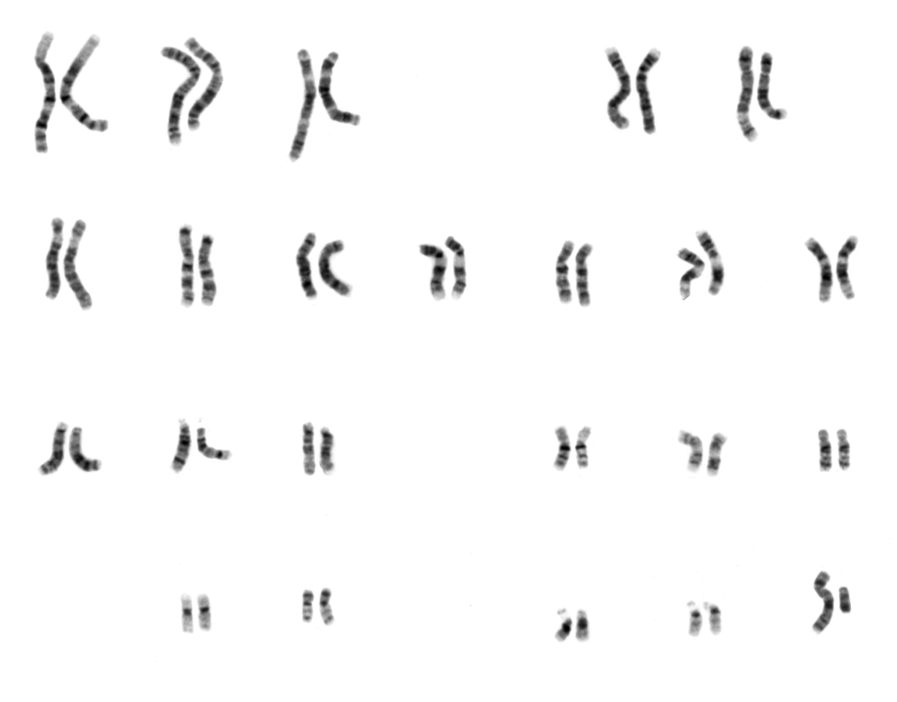

# Genetics: The Science of Genes, Genetic Variation and Heredity

[Genetics](https://en.wikipedia.org/wiki/Genetics) is a branch of biology concerned with the study of genes, genetic variation, and heredity in organisms.

The word genetics stems from the ancient Greek γενετικός genetikos meaning "genitive"/"generative", which in turn derives from γένεσις genesis meaning "origin".

Though heredity had been observed for millennia, [Gregor Mendel](https://en.wikipedia.org/wiki/Gregor_Mendel), a scientist and Augustinian friar working in the 19th century, was the first to study genetics scientifically. Mendel studied "trait inheritance", patterns in the way traits are handed down from parents to offspring. He observed that organisms (pea plants) inherit traits by way of discrete "units of inheritance". This term, still used today, is a somewhat ambiguous definition of what is referred to as a gene. Mendel's conclusions were largely ignored by the vast majority of scientists at the time. In 1900, however, his work was "re-discovered" by three European scientists, [Hugo de Vries](https://en.wikipedia.org/wiki/Hugo_de_Vries), [Carl Correns](https://en.wikipedia.org/wiki/Carl_Correns), and [Erich von Tschermak](https://en.wikipedia.org/wiki/Erich_von_Tschermak). In 1905, [Wilhelm Johannsen](https://en.wikipedia.org/wiki/Wilhelm_Johannsen) introduced the term *gene* and [William Bateson](https://en.wikipedia.org/wiki/William_Bateson) the term *genetics* (the adjective genetic predates the noun and was first used in a biological sense in 1860). Our understanding of what a [*gene*](https://en.wikipedia.org/wiki/Gene#Discovery_of_discrete_inherited_units) is has undergone quite a bit of change. Currently, genes are considered to be pieces of DNA that contain information for synthesis of ribonuclec acids (RNAs) that can be directly functional or serve as the intermediate template for a protein that performs a function.

Trait inheritance and molecular inheritance mechanisms of genes are still primary principles of genetics in the 21st century, but modern genetics has expanded beyond inheritance to studying the function and behavior of genes. Gene structure and function, variation, and distribution are studied within the context of the cell, the organism (e.g. dominance), and within the context of a population. Genetics has given rise to a number of subfields, including molecular genetics, epigenetics and population genetics. Organisms studied within the broad field span the three domains of life (archaea, bacteria, and eukarya). 

Genetic processes work in combination with an organism's environment and experiences to influence development and behavior, often referred to as nature versus nurture. The intracellular or extracellular environment of a living cell or organism may switch gene transcription on or off. A classic example is two seeds of genetically identical corn, one placed in a temperate climate and one in an arid climate (lacking sufficient waterfall or rain). While the average height of the two corn stalks may be genetically determined to be equal, the one in the arid climate only grows to half the height of the one in the temperate climate due to lack of water and nutrients in its environment.

The observation that living things inherit traits from their parents has been used since prehistoric times to improve crop plants and animals through selective breeding. The modern science of genetics, seeking to understand this process, is generally considered to have began with the work of the Augustinian friar Gregor Mendel in the mid-19th century.

Other theories of inheritance preceded Mendel's work. A popular theory during the 19th century, and implied by Charles Darwin's 1859 On the Origin of Species, was blending inheritance: the idea that individuals inherit a smooth blend of traits from their parents. Mendel's work provided examples where traits were definitely not blended after hybridization, showing that traits are produced by combinations of distinct genes rather than a continuous blend. Blending of traits in the progeny is now explained by the action of multiple genes with quantitative effects. Another theory that had some support at that time was the inheritance of acquired characteristics: the belief that individuals inherit traits strengthened by their parents. This theory (commonly associated with Jean-Baptiste Lamarck) is now known to be wrong—the experiences of individuals do not affect the genes they pass to their children, although evidence in the field of epigenetics has revived some aspects of Lamarck's theory. Other theories included the pangenesis of Charles Darwin (which had both acquired and inherited aspects) and Francis Galton's reformulation of pangenesis as both particulate and inherited.

## Mendelian (classical) genetics

Modern genetics started with Mendel's studies of the nature of inheritance in plants. In his paper "Versuche über Pflanzenhybriden" ("Experiments on Plant Hybridization"), presented in 1865 to the Naturforschender Verein (Society for Research in Nature) in Brünn, Mendel traced the inheritance patterns of certain traits in pea plants and described them mathematically. Although this pattern of inheritance could only be observed for a few traits, Mendel's work suggested that heredity was particulate, not acquired, and that the inheritance patterns of many traits could be explained through simple rules and ratios.

(ref:sex) [Morgan's observation of sex-linked inheritance of a mutation causing white eyes in Drosophila led him to the hypothesis that genes are located upon chromosomes.](https://commons.wikimedia.org/wiki/File:Sexlinked_inheritance_white.jpg)

```{r sexlinked, fig.cap='(ref:sex)', echo=FALSE, message=FALSE, warning=FALSE}
knitr::include_graphics("./figures/genetics/Sexlinked_inheritance_white.jpg")
```

The importance of Mendel's work did not gain wide understanding until 1900, after his death, when Hugo de Vries and other scientists rediscovered his research. William Bateson, a proponent of Mendel's work, coined the word genetics in 1905 . Bateson both acted as a mentor and was aided significantly by the work of other scientists from Newnham College at Cambridge, specifically the work of Becky Saunders, Nora Darwin Barlow, and Muriel Wheldale Onslow. Bateson popularized the usage of the word genetics to describe the study of inheritance in his inaugural address to the Third International Conference on Plant Hybridization in London in 1906.

After the rediscovery of Mendel's work, scientists tried to determine which molecules in the cell were responsible for inheritance. In 1911, Thomas Hunt Morgan argued that genes are on chromosomes, based on observations of a sex-linked white eye mutation in fruit flies. In 1913, his student [Alfred Sturtevant](https://en.wikipedia.org/wiki/Alfred_Sturtevant) used the phenomenon of genetic linkage to show that genes are arranged linearly on the chromosome.

## Molecular genetics

In an influential published in 1941 paper, [George Beadle](https://en.wikipedia.org/wiki/George_Beadle) and [Edward Tatum](https://en.wikipedia.org/wiki/Edward_Tatum) proposed the idea that genes act through the production of enzymes, with each gene responsible for producing a single enzyme that in turn affects a single step in a metabolic pathway. The concept arose from work on genetic mutations in the mold *Neurospora crassa*, and subsequently was dubbed the "one gene–one enzyme hypothesis" by their collaborator Norman Horowitz. In 2004 Norman Horowitz reminisced that "these experiments founded the science of what Beadle and Tatum called 'biochemical genetics.' These experiments are by some considered to constitute the begining of what became molecular genetics and the development of the one gene–one enzyme hypothesis is often considered the first significant result in what came to be called molecular biology. Although it has been extremely influential, the hypothesis was recognized soon after its proposal to be an oversimplification. Even the subsequent reformulation of the "one gene–one polypeptide" hypothesis is now considered too simple to describe the relationship between genes and proteins. In attributing an instructional role to genes, Beadle and Tatum implicitly accorded genes an informational capability. This insight provided the foundation for the concept of a genetic code. However, it was not until the experiments were performed showing that DNA was the genetic material, that proteins consist of a defined linear sequence of amino acids, and that DNA structure contained a linear sequence of base pairs, was there a clear basis for solving the genetic code.

In attributing an instructional role to genes, Beadle and Tatum implicitly accorded genes an informational capability. This insight provided the foundation for the concept of a genetic code. However, it was not until the experiments were performed showing that DNA was the genetic material, that proteins consist of a defined linear sequence of amino acids, and that DNA structure contained a linear sequence of base pairs, was there a clear basis for solving the genetic code.

Although genes were known to exist on chromosomes, chromosomes are composed of both protein and DNA, and scientists did not know which of the two is responsible for inheritance. In 1928, [Frederick Griffith](https://en.wikipedia.org/wiki/Frederick_Griffith) discovered the phenomenon of transformation: dead bacteria could transfer genetic material to "transform" other still-living bacteria. Sixteen years later, in 1944, the Avery–MacLeod–McCarty experiment identified DNA as the molecule responsible for transformation. The role of the nucleus as the repository of genetic information in eukaryotes had been established by Hämmerling in 1943 in his work on the single celled alga Acetabularia. The Hershey–Chase experiment in 1952 confirmed that DNA (rather than protein) is the genetic material of the viruses that infect bacteria, providing further evidence that DNA is the molecule responsible for inheritance.

[James Watson](https://en.wikipedia.org/wiki/James_Watson) and [Francis Crick](https://en.wikipedia.org/wiki/Francis_Crick) determined the structure of DNA in 1953, using the X-ray crystallography work of [Rosalind Franklin](https://en.wikipedia.org/wiki/Rosalind_Franklin) and [Maurice Wilkins](https://en.wikipedia.org/wiki/Maurice_Wilkins) that indicated DNA has a helical structure (i.e., shaped like a corkscrew). Their double-helix model had two strands of DNA with the nucleotides pointing inward, each matching a complementary nucleotide on the other strand to form what look like rungs on a twisted ladder. This structure showed that genetic information exists in the sequence of nucleotides on each strand of DNA. The structure also suggested a simple method for replication: if the strands are separated, new partner strands can be reconstructed for each based on the sequence of the old strand. This property is what gives DNA its semi-conservative nature where one strand of new DNA is from an original parent strand.

(ref:DNA) A cartoon representation of DNA based on atomic coordinates of [PDB 1BNA](https://www.rcsb.org/structure/1bna), rendered with open source molecular visualization tool PyMol.

```{r dnacartoon, fig.cap='(ref:DNA)', echo=FALSE, message=FALSE, warning=FALSE}
knitr::include_graphics("./figures/genetics/DNA_cartoon.png")
```

Although the structure of DNA showed how inheritance works, it was still not known how DNA influences the behavior of cells. In the following years, scientists tried to understand how DNA controls the process of protein production. It was discovered that the cell uses DNA as a template to create matching messenger RNA, molecules with nucleotides very similar to DNA. The nucleotide sequence of a messenger RNA is used as a template by ribosomes to create an amino acid sequence in protein; this correspondence between nucleotide sequences and amino acid sequences is known as the genetic code.

With the newfound molecular understanding of inheritance came an explosion of research. One important development was chain-termination DNA sequencing in 1977 by [Frederick Sanger](https://en.wikipedia.org/wiki/Frederick_Sanger). This technology allows scientists to read the nucleotide sequence of a DNA molecule. In 1983, [Kary Banks Mullis](https://en.wikipedia.org/wiki/Kary_Mullis) developed the polymerase chain reaction, providing a quick way to isolate and amplify a specific section of DNA from a mixture. The efforts of the Human Genome Project, Department of Energy, NIH, and parallel private efforts by Celera Genomics led to the sequencing of the human genome in 2003.

## Discrete inheritance and Mendel's laws

At its most fundamental level, inheritance in organisms occurs by passing discrete heritable units, called genes, from parents to offspring. This property was first observed by Gregor Mendel, who studied the segregation of heritable traits in pea plants. In his experiments studying the trait for flower color, Mendel observed that the flowers of each pea plant were either purple or white—but never an intermediate between the two colors. These different, discrete versions of the same gene are called alleles.

In the case of the pea, which is a diploid species, each individual plant has two copies of each gene, one copy inherited from each parent. Many species, including humans, have this pattern of inheritance. Diploid organisms with two copies of the same allele of a given gene are called homozygous at that gene locus, while organisms with two different alleles of a given gene are called heterozygous.

The set of alleles for a given organism is called its genotype, while the observable traits of the organism are called its phenotype. When organisms are heterozygous at a gene, often one allele is called dominant as its qualities dominate the phenotype of the organism, while the other allele is called recessive as its qualities recede and are not observed. Some alleles do not have complete dominance and instead have incomplete dominance by expressing an intermediate phenotype, or codominance by expressing both alleles at once.

When a pair of organisms reproduce sexually, their offspring randomly inherit one of the two alleles from each parent. These observations of discrete inheritance and the segregation of alleles are collectively known as Mendel's first law or the Law of Segregation.

## Notation and diagrams

Geneticists use diagrams and symbols to describe inheritance. A gene is represented by one or a few letters. Often a "+" symbol is used to mark the usual, non-mutant allele for a gene.

In fertilization and breeding experiments (and especially when discussing Mendel's laws) the parents are referred to as the "P" generation and the offspring as the "F1" (first filial) generation. When the F1 offspring mate with each other, the offspring are called the "F2" (second filial) generation. One of the common diagrams used to predict the result of cross-breeding is the Punnett square.

When studying human genetic diseases, geneticists often use pedigree charts to represent the inheritance of traits. These charts map the inheritance of a trait in a family tree.

## Multiple gene interactions

Organisms have thousands of genes, and in sexually reproducing organisms these genes generally assort independently of each other. This means that the inheritance of an allele for yellow or green pea color is unrelated to the inheritance of alleles for white or purple flowers. This phenomenon, known as "Mendel's second law" or the "law of independent assortment," means that the alleles of different genes get shuffled between parents to form offspring with many different combinations. (Some genes do not assort independently, demonstrating genetic linkage.

Often different genes can interact in a way that influences the ame trait. In the Blue-eyed Mary (*Omphalodes verna*), for example, there exists a gene with alleles that determine the color of flowers: blue or magenta. Another gene, however, controls whether the flowers have color at all or are white. When a plant has two copies of this white allele, its flowers are white—regardless of whether the first gene has blue or magenta alleles. This interaction between genes is called epistasis, with the second gene epistatic to the first.

Many traits are not discrete features (e.g. purple or white flowers) but are instead continuous features (e.g. human height and skin color). These complex traits are products of many genes. The influence of these genes is mediated, to varying degrees, by the environment an organism has experienced. The degree to which an organism's genes contribute to a complex trait is called heritability. Measurement of the heritability of a trait is relative—in a more variable environment, the environment has a bigger influence on the total variation of the trait. For example, human height is a trait with complex causes. It has a heritability of 89% in the United States. In Nigeria, however, where people experience a more variable access to good nutrition and health care, height has a heritability of only 62%.

## Molecular basis for inheritance

### DNA and chromosomes

The molecular basis for genes is deoxyribonucleic acid (DNA). DNA is composed of a chain of nucleotides, of which there are four types: adenine (A), cytosine (C), guanine (G), and thymine (T). Genetic information exists in the sequence of these nucleotides, and genes exist as stretches of sequence along the DNA chain. Viruses are the only exception to this rule—sometimes viruses use the very similar molecule RNA instead of DNA as their genetic material. Viruses cannot reproduce without a host and are unaffected by many genetic processes, so tend not to be considered living organisms.

DNA normally exists as a double-stranded molecule, coiled into the shape of a double helix. Each nucleotide in DNA preferentially pairs with its partner nucleotide on the opposite strand: A pairs with T, and C pairs with G. Thus, in its two-stranded form, each strand effectively contains all necessary information, redundant with its partner strand. This structure of DNA is the physical basis for inheritance: DNA replication duplicates the genetic information by splitting the strands and using each strand as a template for synthesis of a new partner strand.


(ref:dna) The structure of the DNA double helix. A section of DNA. The bases lie horizontally between the two spiraling strands (based on atomic coordinates of [PDB 1bna](https://www.rcsb.org/structure/1bna) rendered with [UCSF Chimera](https://www.cgl.ucsf.edu/chimera/).)

```{r dnastruc, fig.cap='(ref:dna)', echo=FALSE, message=FALSE, warning=FALSE}
knitr::include_graphics("./figures/genetics/DNA_1bna.png")
```

Genes are arranged linearly along long chains of DNA base-pair sequences. In bacteria, each cell usually contains a single circular genophore, while eukaryotic organisms (such as plants and animals) have their DNA arranged in multiple linear chromosomes. These DNA strands are often extremely long; the largest human chromosome, for example, is about 247 million base pairs in length. The DNA of a chromosome is associated with structural proteins that organize, compact, and control access to the DNA, forming a material called chromatin; in eukaryotes, chromatin is usually composed of nucleosomes, segments of DNA wound around cores of histone proteins. The full set of hereditary material in an organism (usually the combined DNA sequences of all chromosomes) is called the genome.

While haploid organisms have only one copy of each chromosome, most animals and many plants are diploid, containing two of each chromosome and thus two copies of every gene. The two alleles for a gene are located on identical loci of the two homologous chromosomes, each allele inherited from a different parent.

(ref:fleming) [Walther Flemming's 1882 diagram of eukaryotic cell division. Chromosomes are copied, condensed, and organized. Then, as the cell divides, chromosome copies separate into the daughter cells.](https://commons.wikimedia.org/wiki/File:Zellsubstanz-Kern-Kerntheilung.jpg)

```{r celldivision, fig.cap='(ref:fleming)', echo=FALSE, message=FALSE, warning=FALSE}
knitr::include_graphics("./figures/genetics/Zellsubstanz-Kern-Kerntheilung.jpg")
```

Many species have so-called sex chromosomes that determine the gender of each organism. In humans and many other animals, the Y chromosome contains the gene that triggers the development of the specifically male characteristics. In evolution, this chromosome has lost most of its content and also most of its genes, while the X chromosome is similar to the other chromosomes and contains many genes. The X and Y chromosomes form a strongly heterogeneous pair.

### Reproduction

When cells divide, their full genome is copied and each daughter cell inherits one copy. This process, called mitosis, is the simplest form of reproduction and is the basis for asexual reproduction. Asexual reproduction can also occur in multicellular organisms, producing offspring that inherit their genome from a single parent. Offspring that are genetically identical to their parents are called clones.

Eukaryotic organisms often use sexual reproduction to generate offspring that contain a mixture of genetic material inherited from two different parents. The process of sexual reproduction alternates between forms that contain single copies of the genome (haploid) and double copies (diploid). Haploid cells fuse and combine genetic material to create a diploid cell with paired chromosomes. Diploid organisms form haploids by dividing, without replicating their DNA, to create daughter cells that randomly inherit one of each pair of chromosomes. Most animals and many plants are diploid for most of their lifespan, with the haploid form reduced to single cell gametes such as sperm or eggs.

Although they do not use the haploid/diploid method of sexual reproduction, bacteria have many methods of acquiring new genetic information. Some bacteria can undergo conjugation, transferring a small circular piece of DNA to another bacterium. Bacteria can also take up raw DNA fragments found in the environment and integrate them into their genomes, a phenomenon known as transformation. These processes result in horizontal gene transfer, transmitting fragments of genetic information between organisms that would be otherwise unrelated.

### Recombination and genetic linkage

The diploid nature of chromosomes allows for genes on different chromosomes to assort independently or be separated from their homologous pair during sexual reproduction wherein haploid gametes are formed. In this way new combinations of genes can occur in the offspring of a mating pair. Genes on the same chromosome would theoretically never recombine. However, they do, via the cellular process of chromosomal crossover. During crossover, chromosomes exchange stretches of DNA, effectively shuffling the gene alleles between the chromosomes. This process of chromosomal crossover generally occurs during meiosis, a series of cell divisions that creates haploid cells.

(ref:crossover) [Thomas Hunt Morgan's 1916 illustration of a double crossover between chromosomes.](https://commons.wikimedia.org/wiki/File:Morgan_crossover_2_cropped.png)

```{r crossingover, fig.cap='(ref:crossover)', echo=FALSE, message=FALSE, warning=FALSE}
knitr::include_graphics("./figures/genetics/Morgan_crossover_2_cropped.png")
```

The first cytological demonstration of crossing over was performed by Harriet Creighton and Barbara McClintock in 1931. Their research and experiments on corn provided cytological evidence for the genetic theory that linked genes on paired chromosomes do in fact exchange places from one homolog to the other.

The probability of chromosomal crossover occurring between two given points on the chromosome is related to the distance between the points. For an arbitrarily long distance, the probability of crossover is high enough that the inheritance of the genes is effectively uncorrelated. For genes that are closer together, however, the lower probability of crossover means that the genes demonstrate genetic linkage; alleles for the two genes tend to be inherited together. The amounts of linkage between a series of genes can be combined to form a linear linkage map that roughly describes the arrangement of the genes along the chromosome.

## Gene expression

### Genetic code

Genes generally express their functional effect through the production of proteins, which are complex molecules responsible for most functions in the cell. Proteins are made up of one or more polypeptide chains, each of which is composed of a sequence of amino acids, and the DNA sequence of a gene encodes the amino acid sequence of the corresponding protein. This process begins with the production of a messenger RNA (mRNA) molecule with a sequence matching the gene's DNA sequence, a process called transcription.

This messenger RNA molecule is then used to produce a corresponding amino acid sequence through a process called translation. Each group of three nucleotides in the sequence, called a codon, corresponds either to one of the twenty possible amino acids in a protein or an instruction to end the amino acid sequence; this correspondence is called the genetic code. The flow of information is unidirectional: information is transferred from nucleotide sequences into the amino acid sequence of proteins, but it never transfers from protein back into the sequence of DNA—a phenomenon Francis Crick called the central dogma of molecular biology.

The specific sequence of amino acids results in a unique three-dimensional structure for that protein, and the three-dimensional structures of proteins are related to their functions. Some are simple structural molecules, like the fibers formed by the protein collagen. Proteins can bind to other proteins and simple molecules, sometimes acting as enzymes by facilitating chemical reactions within the bound molecules (without changing the structure of the protein itself). Protein structure is dynamic; the protein hemoglobin bends into slightly different forms as it facilitates the capture, transport, and release of oxygen molecules within mammalian blood.

A single nucleotide difference within DNA can cause a change in the amino acid sequence of a protein. Because protein structures are the result of their amino acid sequences, some changes can dramatically change the properties of a protein by destabilizing the structure or changing the surface of the protein in a way that changes its interaction with other proteins and molecules. For example, sickle-cell anemia is a human genetic disease that results from a single base difference within the coding region for the β-globin section of hemoglobin, causing a single amino acid change that changes hemoglobin's physical properties. Sickle-cell versions of hemoglobin stick to themselves, stacking to form fibers that distort the shape of red blood cells carrying the protein. These sickle-shaped cells no longer flow smoothly through blood vessels, having a tendency to clog or degrade, causing the medical problems associated with this disease.

Some DNA sequences are transcribed into RNA but are not translated into protein products—such RNA molecules are called non-coding RNA. In some cases, these products fold into structures which are involved in critical cell functions (e.g. ribosomal RNA and transfer RNA). RNA can also have regulatory effects through hybridization interactions with other RNA molecules (e.g. microRNA).

## Nature and nurture

Although genes contain all the information an organism uses to function, the environment plays an important role in determining the ultimate phenotypes an organism displays. The phrase "nature and nurture" refers to this complementary relationship. The phenotype of an organism depends on the interaction of genes and the environment. An interesting example is the coat coloration of the Siamese cat. In this case, the body temperature of the cat plays the role of the environment. The cat's genes code for dark hair, thus the hair-producing cells in the cat make cellular proteins resulting in dark hair. But these dark hair-producing proteins are sensitive to temperature (i.e. have a mutation causing temperature-sensitivity) and denature in higher-temperature environments, failing to produce dark-hair pigment in areas where the cat has a higher body temperature. In a low-temperature environment, however, the protein's structure is stable and produces dark-hair pigment normally. The protein remains functional in areas of skin that are colder—such as its legs, ears, tail and face—so the cat has dark hair at its extremities.

Environment plays a major role in effects of the human genetic disease phenylketonuria. The mutation that causes phenylketonuria disrupts the ability of the body to break down the amino acid phenylalanine, causing a toxic build-up of an intermediate molecule that, in turn, causes severe symptoms of progressive intellectual disability and seizures. However, if someone with the phenylketonuria mutation follows a strict diet that avoids this amino acid, they remain normal and healthy.

A common method for determining how genes and environment ("nature and nurture") contribute to a phenotype involves studying identical and fraternal twins, or other siblings of multiple births. Identical siblings are genetically the same since they come from the same zygote. Meanwhile, fraternal twins are as genetically different from one another as normal siblings. By comparing how often a certain disorder occurs in a pair of identical twins to how often it occurs in a pair of fraternal twins, scientists can determine whether that disorder is caused by genetic or postnatal environmental factors. However, such tests cannot separate genetic factors from environmental factors affecting fetal development.

## Gene regulation

The genome of a given organism contains thousands of genes, but not all these genes need to be active at any given moment. A gene is expressed when it is being transcribed into mRNA and there exist many cellular methods of controlling the expression of genes such that proteins are produced only when needed by the cell. Transcription factors are regulatory proteins that bind to DNA, either promoting or inhibiting the transcription of a gene. Within the genome of *Escherichia coli* bacteria, for example, there exists a series of genes necessary for the synthesis of the amino acid tryptophan. However, when tryptophan is already available to the cell, these genes for tryptophan synthesis are no longer needed. The presence of tryptophan directly affects the activity of the genes—tryptophan molecules bind to the tryptophan repressor (a transcription factor), changing the repressor's structure such that the repressor binds to the genes. The tryptophan repressor blocks the transcription and expression of the genes, thereby creating negative feedback regulation of the tryptophan synthesis process.

(ref:transfactor) Transcription factors bind to DNA, influencing the transcription of associated genes. Based on atomic coordinates of [PDB 1A1L](https://www.rcsb.org/structure/1a1l), rendered with open source molecular visualization tool PyMol.

```{r transcriptionfactor, fig.cap='(ref:transfactor)', echo=FALSE, message=FALSE, warning=FALSE}
knitr::include_graphics("./figures/genetics/Transcription_factor_DNA_1A1L.png")
```

Differences in gene expression are especially clear within multicellular organisms, where cells all contain the same genome but have very different structures and behaviors due to the expression of different sets of genes. All the cells in a multicellular organism derive from a single cell, differentiating into variant cell types in response to external and intercellular signals and gradually establishing different patterns of gene expression to create different behaviors. As no single gene is responsible for the development of structures within multicellular organisms, these patterns arise from the complex interactions between many cells.

Within eukaryotes, there exist structural features of chromatin that influence the transcription of genes, often in the form of modifications to DNA and chromatin that are stably inherited by daughter cells. These features are called "epigenetic" because they exist "on top" of the DNA sequence and retain inheritance from one cell generation to the next. Because of epigenetic features, different cell types grown within the same medium can retain very different properties. Although epigenetic features are generally dynamic over the course of development, some, like the phenomenon of paramutation, have multigenerational inheritance and exist as rare exceptions to the general rule of DNA as the basis for inheritance.

## Genetic change

### Mutations

During the process of DNA replication, errors occasionally occur in the polymerization of the second strand. These errors, called mutations, can affect the phenotype of an organism, especially if they occur within the protein coding sequence of a gene. Error rates are usually very low—1 error in every 10–100 million bases—due to the "proofreading" ability of DNA polymerases. Processes that increase the rate of changes in DNA are called mutagenic: mutagenic chemicals promote errors in DNA replication, often by interfering with the structure of base-pairing, while UV radiation induces mutations by causing damage to the DNA structure. Chemical damage to DNA occurs naturally as well and cells use DNA repair mechanisms to repair mismatches and breaks. The repair does not, however, always restore the original sequence.

In organisms that use chromosomal crossover to exchange DNA and recombine genes, errors in alignment during meiosis can also cause mutations. Errors in crossover are especially likely when similar sequences cause partner chromosomes to adopt a mistaken alignment; this makes some regions in genomes more prone to mutating in this way. These errors create large structural changes in DNA sequence – duplications, inversions, deletions of entire regions – or the accidental exchange of whole parts of sequences between different chromosomes (chromosomal translocation).

## Natural selection and evolution

Mutations alter an organism's genotype and occasionally this causes different phenotypes to appear. Most mutations have little effect on an organism's phenotype, health, or reproductive fitness. Mutations that do have an effect are usually detrimental, but occasionally some can be beneficial. Studies in the fly *Drosophila melanogaster* suggest that if a mutation changes a protein produced by a gene, about 70 percent of these mutations will be harmful with the remainder being either neutral or weakly beneficial.

Population genetics studies the distribution of genetic differences within populations and how these distributions change over time. Changes in the frequency of an allele in a population are mainly influenced by natural selection, where a given allele provides a selective or reproductive advantage to the organism, as well as other factors such as mutation, genetic drift, genetic hitchhiking, artificial selection and migration.

Over many generations, the genomes of organisms can change significantly, resulting in evolution. In the process called adaptation, selection for beneficial mutations can cause a species to evolve into forms better able to survive in their environment. New species are formed through the process of speciation, often caused by geographical separations that prevent populations from exchanging genes with each other.

By comparing the homology between different species' genomes, it is possible to calculate the evolutionary distance between them and when they may have diverged. Genetic comparisons are generally considered a more accurate method of characterizing the relatedness between species than the comparison of phenotypic characteristics. The evolutionary distances between species can be used to form evolutionary trees; these trees represent the common descent and divergence of species over time, although they do not show the transfer of genetic material between unrelated species (known as horizontal gene transfer and most common in bacteria).

## Model organisms

Although geneticists originally studied inheritance in a wide range of organisms, researchers began to specialize in studying the genetics of a particular subset of organisms. The fact that significant research already existed for a given organism would encourage new researchers to choose it for further study, and so eventually a few model organisms became the basis for most genetics research. Common research topics in model organism genetics include the study of gene regulation and the involvement of genes in development and cancer.

Organisms were chosen, in part, for convenience—short generation times and easy genetic manipulation made some organisms popular genetics research tools. Widely used model organisms include the gut bacterium *Escherichia coli*, the plant *Arabidopsis thaliana* (Fig. \@ref(fig:arabidopsisthaliana)), baker's yeast (*Saccharomyces cerevisiae*), the roundworm *Caenorhabditis elegans* (Fig. \@ref(fig:celegans)), the common fruit fly *Drosophila melanogaster* (Fig. \@ref(fig:drosophilamelanogaster)), and the common house mouse (*Mus musculus*).

(ref:arabidopsis) [The thale cress *Arabidopsis thaliana*.](https://commons.wikimedia.org/wiki/File:Arabidopsis_thaliana.jpg)

```{r arabidopsisthaliana, fig.cap='(ref:arabidopsis)', echo=FALSE, message=FALSE, warning=FALSE}
knitr::include_graphics("./figures/genetics/Arabidopsis_thaliana.jpg")
```

(ref:drosophila) [The fruit fly *Drosophila melanogaster*.](https://commons.wikimedia.org/wiki/File:Drosophila_melanogaster_-_side_(aka).jpg)

```{r drosophilamelanogaster, fig.cap='(ref:drosophila)', echo=FALSE, message=FALSE, warning=FALSE}
knitr::include_graphics("./figures/genetics/Drosophila_melanogaster_-_side_(aka).jpg")
```

(ref:elegans) [An adult *Caenorhabditis elegans* worm.](https://commons.wikimedia.org/wiki/File:Adult_Caenorhabditis_elegans.jpg)

```{r celegans, fig.cap='(ref:elegans)', echo=FALSE, message=FALSE, warning=FALSE}
knitr::include_graphics("./figures/genetics/Adult_Caenorhabditis_elegans.jpg")
```

## Medical Genetics

[Medical genetics](https://en.wikipedia.org/wiki/Medical_genetics) seeks to understand how genetic variation relates to human health and disease. When searching for an unknown gene that may be involved in a disease, researchers commonly use genetic linkage and genetic pedigree charts to find the location on the genome associated with the disease. At the population level, researchers take advantage of [Mendelian randomization](https://en.wikipedia.org/wiki/Mendelian_randomization) to look for locations in the genome that are associated with diseases, a method especially useful for multigenic traits not clearly defined by a single gene. Once a candidate gene is found, further research is often done on the corresponding (or homologous) genes of model organisms. In addition to studying genetic diseases, the increased availability of genotyping methods has led to the field of pharmacogenetics: the study of how genotype can affect drug responses.

Individuals differ in their inherited tendency to develop cancer, and cancer is a genetic disease. The process of cancer development in the body is a combination of events. Mutations occasionally occur within cells in the body as they divide. Although these mutations will not be inherited by any offspring, they can affect the behavior of cells, sometimes causing them to grow and divide more frequently. There are biological mechanisms that attempt to stop this process; signals are given to inappropriately dividing cells that should trigger cell death, but sometimes additional mutations occur that cause cells to ignore these messages. An internal process of natural selection occurs within the body and eventually mutations accumulate within cells to promote their own growth, creating a cancerous tumor that grows and invades various tissues of the body.

Normally, a cell divides only in response to signals called growth factors and stops growing once in contact with surrounding cells and in response to growth-inhibitory signals. It usually then divides a limited number of times and dies, staying within the epithelium where it is unable to migrate to other organs. To become a cancer cell, a cell has to accumulate mutations in a number of genes (three to seven). A cancer cell can divide without growth factor and ignores inhibitory signals. Also, it is immortal and can grow indefinitely, even after it makes contact with neighboring cells. It may escape from the epithelium and ultimately from the primary tumor. Then, the escaped cell can cross the endothelium of a blood vessel and get transported by the bloodstream to colonize a new organ, forming deadly metastasis. Although there are some genetic predispositions in a small fraction of cancers, the major fraction is due to a set of new genetic mutations that originally appear and accumulate in one or a small number of cells that will divide to form the tumor and are not transmitted to the progeny (somatic mutations). The most frequent mutations are a loss of function of p53 protein, a tumor suppressor, or in the p53 pathway, and gain of function mutations in the Ras proteins, or in other oncogenes.

## Research methods

DNA can be manipulated in the laboratory. [Restriction enzymes](https://en.wikipedia.org/wiki/Restriction_enzyme) are commonly used enzymes that cut DNA at specific sequences, producing predictable fragments of DNA. DNA fragments can be visualized through use of [gel electrophoresis](https://en.wikipedia.org/wiki/Gel_electrophoresis), which separates fragments according to their length.

The use of [ligation enzymes](https://en.wikipedia.org/wiki/Ligation_(molecular_biology)) allows DNA fragments to be connected. By binding ("ligating") fragments of DNA together from different sources, researchers can create recombinant DNA, the DNA often associated with genetically modified organisms. Recombinant DNA is commonly used in the context of plasmids: short circular DNA molecules with a few genes on them. In the process known as [molecular cloning](https://en.wikipedia.org/wiki/Molecular_cloning), researchers can amplify the DNA fragments by inserting plasmids into bacteria and then culturing them on plates of agar (to isolate clones of bacteria cells—"cloning" can also refer to the various means of creating cloned ("clonal") organisms).

DNA can also be amplified using a procedure called the [polymerase chain reaction (PCR)](https://en.wikipedia.org/wiki/Polymerase_chain_reaction). By using specific short sequences of DNA, PCR can isolate and exponentially amplify a targeted region of DNA. Because it can amplify from extremely small amounts of DNA, PCR is also often used to detect the presence of specific DNA sequences.

### DNA sequencing and genomics

[DNA sequencing](https://en.wikipedia.org/wiki/DNA_sequencing), one of the most fundamental technologies developed to study genetics, allows researchers to determine the sequence of nucleotides in DNA fragments. The technique of chain-termination sequencing, developed in 1977 by a team led by Frederick Sanger, is still routinely used to sequence DNA fragments. Using this technology, researchers have been able to study the molecular sequences associated with many human diseases.

As sequencing has become less expensive, researchers have sequenced the genomes of many organisms using a process called genome assembly, which utilizes computational tools to stitch together sequences from many different fragments. These technologies were used to sequence the human genome in the [Human Genome Project](https://en.wikipedia.org/wiki/Human_Genome_Project) completed in 2003. New high-throughput sequencing technologies are dramatically lowering the cost of DNA sequencing, with many researchers hoping to bring the cost of resequencing a human genome down to a thousand dollars.

Next-generation sequencing (or high-throughput sequencing) came about due to the ever-increasing demand for low-cost sequencing. These sequencing technologies allow the production of potentially millions of sequences concurrently. The large amount of sequence data available has created the field of genomics, research that uses computational tools to search for and analyze patterns in the full genomes of organisms. Genomics can also be considered a subfield of bioinformatics, which uses computational approaches to analyze large sets of biological data. A common problem to these fields of research is how to manage and share data that deals with human subject and personally identifiable information. 

## Genetic counseling

Genetic counseling is the process of advising individuals and families affected by or at risk of genetic disorders to help them understand and adapt to the medical, psychological and familial implications of genetic contributions to disease. The process integrates:

* Interpretation of family and medical histories to assess the chance of disease occurrence or recurrence
* Education about inheritance, testing, management, prevention, resources
* Counseling to promote informed choices and adaptation to the risk or condition.

The practice of advising people about inherited traits began around the turn of the 20th century, shortly after William Bateson suggested that the new medical and biological study of heredity be called “genetics”. Heredity became intertwined with social reforms when the field of modern eugenics took form. Although initially well-intentioned, ultimately the movement had disastrous consequences. Many states in the United States had laws mandating the sterilization of certain individuals, others were not allowed to immigrate and by the 1930s these ideas were accepted by many other countries including in Germany where euthanaia for the “genetically defective” was legalized in 1939. This part of the history of genetics is at the heart of the now “non directive” approach to genetic counseling.

Sheldon Clark Reed coined the term genetic counseling in 1947 and published the book Counseling in Medical Genetics in 1955. In 1979, the National Society of Genetic Counselors (NSGC) was founded.

A genetic counselor is an expert with a Master of Science degree in genetic counseling. Programs in North America are accredited by the Accreditation Council for Genetic Counseling (ACGC). There are currently 45 accredited programs in the United States, four accredited programs in Canada, and three programs with the intent to become accredited. Students enter the field from a variety of disciplines, including biology/biological sciences and social sciences such as psychology. Graduate school coursework includes topics such as human genetics, embryology, ethics, research, and counseling theory and techniques. Clinical training including upervised rotations in prenatal, pediatric, adult, cancer, and other subspecialty clinics, as well as non-patient facing rotations in laboratories. Research training typically culminates in a capstone or thesis project.

In the United States genetic counselors are certified by the American Board of Genetic Counseling. In Canada, genetic counselors are certified by the Canadian Association of Genetic Counsellors.

Graduates from an American Board of Genetic Counseling (ABGC) accredited program who have met specific criteria are eligible to take the examination which is offered twice per year by the ABGC. Although not every company requires its counselors to possess a certification, the certification shows that the practitioner has met the standards "necessary to provide competent genetic counseling services".

## Human genetics

[Human genetics](https://en.wikipedia.org/wiki/Human_genetics) is the study of inheritance as it occurs in human beings. 


### Genetic differences and inheritance patterns

Inheritance of traits for humans are based upon Gregor Mendel's model of inheritance. 

### Autosomal dominant inheritance

For a recessive trait or disease to be displayed two copies of the trait or disorder needs to be presented. The trait or gene will be located on a non-sex chromosome. Because it takes two copies of a trait to display a trait, many people can unknowingly be carriers of a disease. From an evolutionary perspective, a recessive disease or trait can remain hidden for several generations before displaying the phenotype. Examples of autosomal recessive disorders are [albinism](https://en.wikipedia.org/wiki/Albinism), [cystic fibrosis](https://en.wikipedia.org/wiki/Cystic_fibrosis).

### X-linked and Y-linked inheritance

X-linked genes are found on the sex X chromosome. X-linked genes just like autosomal genes have both dominant and recessive types. Recessive X-linked disorders are rarely seen in females and usually only affect males. This is because males inherit X-linked genes from the maternal side. Fathers only pass on their Y chromosome to their sons, so no X-linked traits will be inherited from father to son. Men cannot be carriers for recessive X linked traits, as they only have one X chromosome, so any X linked trait inherited from the mother will be expressed. 

Females express X-linked disorders when they are homozygous for the disorder and become carriers when they are heterozygous. X-linked dominant inheritance will show the same phenotype as a heterozygote and homozygote. Just like X-linked inheritance, there will be a lack of male-to-male inheritance, which makes it distinguishable from autosomal traits. One example of an X-linked trait is [Coffin–Lowry syndrome](https://en.wikipedia.org/wiki/Coffin–Lowry_syndrome), which is caused by a mutation in ribosomal protein gene. This mutation results in skeletal, craniofacial abnormalities, mental retardation, and short stature.

X chromosomes in females undergo a process known as X inactivation. X inactivation is when one of the two X chromosomes in females is almost completely inactivated. It is important that this process occurs otherwise a woman would produce twice the amount of normal X chromosome proteins. The mechanism for X inactivation will occur during the embryonic stage. For people with disorders like trisomy X, where the genotype has three X chromosomes, X-inactivation will inactivate all X chromosomes until there is only one X chromosome active. Males with Klinefelter syndrome, who have an extra X chromosome, will also undergo X inactivation to have only one completely active X chromosome.

Y-linked inheritance occurs when a gene, trait, or disorder is transferred through the Y chromosome. Since Y chromosomes can only be found in males, Y linked traits are only passed on from father to son. The testis determining factor, which is located on the Y chromosome, determines the maleness of individuals. Besides the maleness inherited in the Y-chromosome there are no other found Y-linked characteristics.

### Pedigrees analysis

A pedigree is a diagram showing the ancestral relationships and transmission of genetic traits (phenotypes) over several generations in a family (Figure \@ref(fig:pedigree)).

The word pedigree is a corruption of the Anglo-Norman French pé de grue or "crane's foot", either because the typical lines and split lines (each split leading to different offspring of the one parent line) resemble the thin leg and foot of a crane or because such a mark was used to denote succession in pedigree charts.

(ref:ped) [A genetic pedigree chart showing three generations.](https://commons.wikimedia.org/wiki/File:Pedigree-chart-example.svg)

```{r pedigree, fig.cap='(ref:ped)', echo=FALSE, message=FALSE, warning=FALSE}
knitr::include_graphics("./figures/genetics/Pedigree-chart-example.svg")
```

A pedigree results in the presentation of family information in the form of an easily readable chart (Figure \@ref(fig:pedigree). Pedigrees use a standardized set of symbols, squares represent males and circles represent females. Pedigree construction is a family history, and details about an earlier generation may be uncertain as memories fade. If the sex of the person is unknown a diamond is used. Someone with the phenotype in question is represented by a filled-in (darker) symbol. Heterozygotes, when identifiable, are indicated by a shade dot inside a symbol or a half-filled symbol.

Relationships in a pedigree are shown as a series of lines. Parents are connected by a horizontal line and a vertical line leads to their offspring. The offspring are connected by a horizontal sibship line and listed in birth order from left to right. If the offspring are twins then they will be connected by a triangle. If an offspring dies then its symbol will be crossed by a line. If the offspring is still born or aborted it is represented by a small triangle.

Each generation is identified by a Roman numeral (I, II, III, and so on), and each individual within the same generation is identified by an Arabic numeral (1, 2, 3, and so on). Analysis of the pedigree using the principles of Mendelian inheritance can determine whether a trait has a dominant or recessive pattern of inheritance. Pedigrees are often constructed after a family member afflicted with a genetic disorder has been identified. This individual, known as the proband, is indicated on the pedigree by an arrow. These changes may occur yearly or monthly.

Four different traits can be identified by pedigree chart analysis: autosomal dominant, autosomal recessive, x-linked, or y-linked. Partial penetrance can be shown and calculated from pedigrees. Penetrance is the percentage expressed frequency with which individuals of a given genotype manifest at least some degree of a specific mutant phenotype associated with a trait.

A pedigree may be used to establish the probability of a child having a particular disorder or condition. It may be used to discover where the genes in question are located (x, y, or autosome chromosome), and to determine whether a trait is dominant or recessive. When a pedigree shows a condition appearing in a 50:50 ratio between men and women it is considered autosomal. When the condition predominantly affects males in the pedigree it is considered x-linked.

Some examples of dominant traits include: male baldness, astigmatism, and dwarfism. Some examples of recessive traits include: small eyes, little body hair, and tall stature.

### Karyotype

A karyotype is picture of all the chromosomes in the metaphase stage arranged according to length and centromere position. A karyotype can also be useful in clinical genetics, due to its ability to diagnose genetic disorders. On a normal karyotype, aneuploidy can be detected by clearly being able to observe any missing or extra chromosomes.

(ref:karyo) [Human male karyotype.](https://commons.wikimedia.org/wiki/File:NHGRI_human_male_karyotype.png)

```{r karyotype, fig.cap='(ref:karyo)', echo=FALSE, message=FALSE, warning=FALSE}

```

Giemsa banding, g-banding, of the karyotype can be used to detect deletions, insertions, duplications, inversions, and translocations. G-banding will stain the chromosomes with light and dark bands unique to each chromosome. A FISH, fluorescent in situ hybridization, can be used to observe deletions, insertions, and translocations. FISH uses fluorescent probes to bind to specific sequences of the chromosomes that will cause the chromosomes to fluoresce a unique color.

## Genomics
Genomics refers to the field of genetics concerned with structural and functional studies of the genome. A genome is all the DNA contained within an organism or a cell including nuclear and mitochondrial DNA. The human genome is the total collection of genes in a human being contained in the human chromosome, composed of over three billion nucleotides.


## Population genetics

Population genetics is the branch of evolutionary biology responsible for investigating processes that cause changes in allele and genotype frequencies in populations based upon Mendelian inheritance. Four different forces can influence the frequencies: natural selection, mutation, gene flow (migration), and genetic drift. A population can be defined as a group of interbreeding individuals and their offspring. For human genetics the populations will consist only of the human species. The [Hardy-Weinberg principle](https://en.wikipedia.org/wiki/Hardy–Weinberg_principle) is a widely used principle to determine allelic and genotype frequencies.

In addition to nuclear DNA, humans (like almost all eukaryotes) have mitochondrial DNA. Mitochondria, the "power houses" of a cell, have their own DNA. Mitochondria are inherited from one's mother, and their DNA is frequently used to trace maternal lines of descent (see mitochondrial Eve). Mitochondrial DNA is only 16kb in length and encodes for 62 genes.

