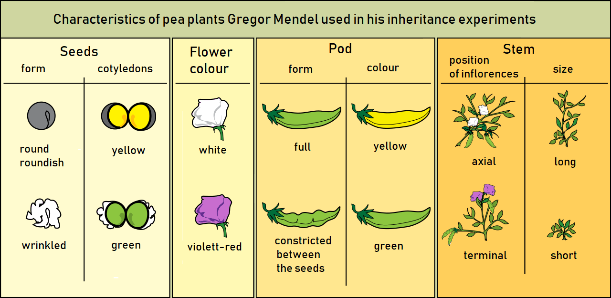
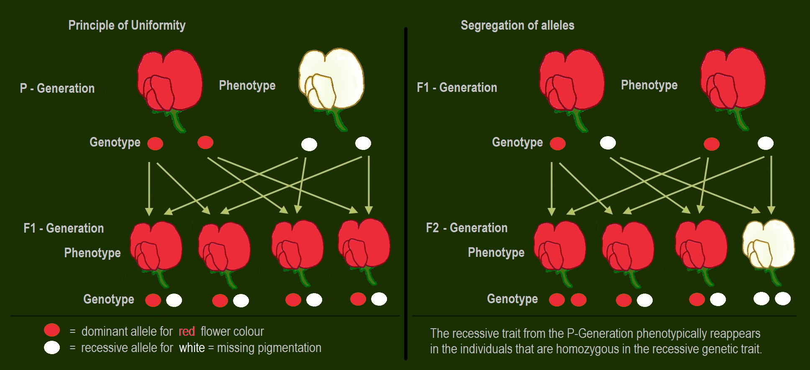
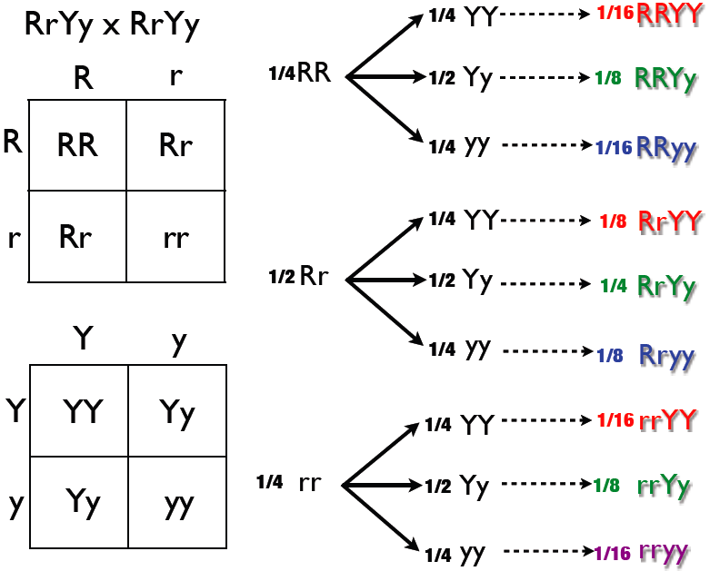

# Mendelian Inheritance

[Mendelian inheritance](https://en.wikipedia.org/wiki/Mendelian_inheritance) is a type of biological inheritance that follows the principles originally proposed by [Gregor Mendel](https://en.wikipedia.org/wiki/Gregor_Mendel) in 1865 and 1866, re-discovered in 1900 and popularised by [William Bateson](https://en.wikipedia.org/wiki/William_Bateson). These principles were initially controversial. When Mendel's theories were integrated with the Boveri–Sutton chromosome theory of inheritance by [Thomas Hunt Morgan](https://en.wikipedia.org/wiki/Thomas_Hunt_Morgan) in 1915, they became the core of classical genetics. [Ronald Fisher](https://en.wikipedia.org/wiki/Ronald_Fisher) combined these ideas with the theory of natural selection in his 1930 book The Genetical Theory of Natural Selection, putting evolution onto a mathematical footing and forming the basis for population genetics within the modern evolutinary synthesis.

(ref:mendelportrait) [Gregor Mendel, the Moravian Augustinian monk who is credited for having founded the modern science of genetics](https://commons.wikimedia.org/wiki/File:Gregor_Mendel.png)

```{r portrait, fig.cap='(ref:mendelportrait)', echo=FALSE, message=FALSE, warning=FALSE}
knitr::include_graphics("./figures/mendel/Gregor_Mendel.png")
```

The principles of Mendelian inheritance were named for and first derived by Gregor Johann Mendel, a nineteenth-century Moravian monk who formulated his ideas after conducting simple hybridisation experiments with pea plants (*Pisum sativum*) he had planted in the garden of his monastery. Between 1856 and 1863, Mendel cultivated and tested some 5,000 pea plants. From these experiments, he induced two generalizations which later became known as Mendel's Principles of Heredity or Mendelian inheritance. He described his experiments in a two-part paper, Versuche über Pflanzen-Hybriden (Experiments on Plant Hybridization), that he presented to the Natural History Society of Brno on 8 February and 8 March 1865, and which was published in 1866.

Mendel's results were largely ignored. Although they were not completely unknown to biologists of the time, they were not seen as generally applicable, even by Mendel himself, who thought they only applied to certain categories of species or traits. A major block to understanding their significance was the importance attached by 19th-century biologists to the apparent blending of many inherited traits in the overall appearance of the progeny, now known to be due to multi-gene interactions, in contrast to the organ-specific binary characters studied by Mendel. In 1900, however, his work was "re-discovered" by three European scientists, [Hugo de Vries](https://en.wikipedia.org/wiki/Hugo_de_Vries), [Carl Correns](https://en.wikipedia.org/wiki/Carl_Correns), and [Erich von Tschermak](https://en.wikipedia.org/wiki/Erich_von_Tschermak). The exact nature of the "re-discovery" has been debated: De Vries published first on the subject, mentioning Mendel in a footnote, while Correns pointed out Mendel's priority after having read De Vries' paper and realizing that he himself did not have priority. De Vries may not have acknowledged truthfully how much of his knowledge of the laws came from his own work and how much came only after reading Mendel's paper. Later scholars have accused Von Tschermak of not truly understanding the results at all.

Regardless, the "re-discovery" made Mendelism an important but controversial theory. Its most vigorous promoter in Europe was William Bateson, who coined the terms "genetics" and "allele" to describe many of its tenets. The model of heredity was contested by other biologists because it implied that heredity was discontinuous, in opposition to the apparently continuous variation observable for many traits. Many biologists also dismissed the theory because they were not sure it would apply to all species. However, later work by biologists and statisticians such as Ronald Fisher showed that if multiple Mendelian factors were involved in the expression of an individual trait, they could produce the diverse results observed, and thus showed that Mendelian genetics is compatible with natural selection. Thomas Hunt Morgan and his assistants later integrated Mendel's theoretical model with the chromosome theory of inheritance, in which the chromosomes of cells were thought to hold the actual hereditary material, and created what is now known as classical genetics, a highly successful foundation which eventually cemented Mendel's place in history.

Mendel's findings allowed scientists such as Fisher and [J.B.S. Haldane](https://en.wikipedia.org/wiki/J._B._S._Haldane) to predict the expression of traits on the basis of mathematical probabilities. An important aspect of Mendel's success can be traced to his decision to start his crosses only with plants he demonstrated were true-breeding. He only measured discrete (binary) characteristics, such as color, shape, and position of the seeds, rather than quantitatively variable characteristics. He expressed his results numerically and subjected them to statistical analysis. His method of data analysis and his large sample size gave credibility to his data. He had the foresight to follow several successive generations (P, F1, F2, F3) of pea plants and record their variations. Finally, he performed "test crosses" (backcrossing descendants of the initial hybridization to the initial true-breeding lines) to reveal the presence and proportions of recessive characters.

## Mendel's genetic discoveries

Five parts of Mendel's discoveries were an important divergence from the common theories at the time and were the prerequisite for the establishment of his rules.

* Characters are unitary. That is, they are discrete (purple vs. white, tall vs. dwarf).
* Genetic characteristics have alternate forms, each inherited from one of two parents. Today, we call these alleles.
* One allele is dominant over the other. The phenotype reflects the dominant allele.
* Gametes are created by random segregation. Heterozygotic individuals produce gametes with an equal frequency of the two alleles.
* Different traits have independent assortment. In modern terms, genes are unlinked.

According to customary terminology we refer here to the principles of inheritance discovered by Gregor Mendel as Mendelian laws, although today's geneticists also speak of Mendelian rules or Mendelian principles, as there are many exceptions summarized under the collective term Non-Mendelian inheritance.
 
Mendel selected for experiment relate the following characters of pea plants:

* Form of the ripe seeds round or roundish, surface shallow or wrinkled
* Colour of the seed–coat white, gray, brown with or without violet spotting
* Colour of the seeds and cotyledons yellow or green
* Flower colour
* Form of the ripe pods simply inflated, not contracted or constricted between the seeds and wrinkled
* Colour of the unripe pods yellow or green
* Position of the flowers axial or terminal
* Length of the stem 

(ref:mendel) [Characteristics of pea plants Gregor Mendel used in his inheritance experiments](https://commons.wikimedia.org/wiki/File:Gregor_Mendel_-_characteristics_of_pea_plants_-_english.png)

```{r characteristics, fig.cap='(ref:mendel)', echo=FALSE, message=FALSE, warning=FALSE}

```

When he crossed purebred white flower and purple flower pea plants (the parental or P generation) by artificial pollination, the resulting flower colour was not a blend. Rather than being a mix of the two, the offspring in the first generation (F1-generation) were all purple flowered. Therefore he called this biological trait dominant. When he allowed self-fertilization in the uniform looking F1-generation, he obtained both colours in the F2 generation with a purple flower to white flower ratio of 3 : 1. In some of the other characters also one of the traits was dominant.

(ref:domrec) [P-Generation and F1-Generation: The dominant allele for purple-red flower hides the phenotypic effect of the recessive allele for white flowers. F2-Generation: The recessive trait from the P-Generation phenotypically reappears in the individuals that are homozygous with the recessiv genetic trait.](https://commons.wikimedia.org/wiki/File:Dominant-recessive_inheritance_-_flowers_of_pea_plants.png)

```{r dominant, fig.cap='(ref:domrec)', echo=FALSE, message=FALSE, warning=FALSE}

```

He then conceived the idea of heredity units, which he called heriditary "factors". Mendel found that there are alternative forms of factors — now called genes — that account for variations in inherited characteristics. For example, the gene for flower color in pea plants exists in two forms, one for purple and the other for white. The alternative "forms" are now called alleles. For each trait, an organism inherits two alleles, one from each parent. These alleles may be the same or different. An organism that has two identical alleles for a gene is said to be homozygous for that gene (and is called a homozygote). An organism that has two different alleles for a gene is said be heterozygous for that gene (and is called a heterozygote).

Mendel hypothesized that allele pairs separate randomly, or segregate, from each other during the production of the gametes in the seed plant (egg cell) and the pollen plant (sperm). Because allele pairs separate during gamete production, a sperm or egg carries only one allele for each inherited trait. When sperm and egg unite at fertilization, each contributes its allele, restoring the paired condition in the offspring. Mendel also found that each pair of alleles segregates independently of the other pairs of alleles during gamete formation.

The genotype of an individual is made up of the many alleles it possesses. The phenotype is the result of the expression of all characteristics that are genetically determined by its alleles as well as by its environment. The presence of an allele does not mean that the trait will be expressed in the individual that possesses it. If the two alleles of an inherited pair differ (the heterozygous condition), then one determines the organism’s appearance and is called the dominant allele; the other has no noticeable effect on the organism’s appearance and is called the recessive allele.

Table: (\#tab:mendel) Mendel's Laws of Inheritance.

|Law|Definition|
|:--|:---------|
|Law of dominance|Some alleles are dominant while others are recessive; an organism with at least one dominant allele will display the effect of the dominant allele.|
|Law of segregation|During gamete formation, the alleles for each gene segregate from each other so that each gamete carries only one allele for each gene.|
|Law of independent assortment|Genes for different traits can segregate independently during the formation of gametes.|

## Law of Dominance and Uniformity

If two parents are mated with each other who differ in one genetic characteristic for which they are both homozygous (each pure-bred), all offspring in the first generation (F1) are equal to the examined characteristic in genotype and phenotype showing the dominant trait. This uniformity rule or reciprocity rule applies to all individuals of the F1-generation.

The dominant inheritance discovered by Mendel states that in a heterozygote the recessive allele will be masked in the phenotype by the dominant allele. Only if the individual owns the recessive allele homozygous the recessive trait gets expressed. Therefore, a cross between a homozygous dominant and a homozygous recessive will always show the dominant trait in the phenotype, while still having a heterozygous genotype.

The F1 offspring of Mendel's pea crosses always looked like one of the two parental varieties. In this situation of "complete dominance," the dominant allele had the same phenotypic effect whether present in one or two copies.

(ref:dominantgen) [In the F1 generation all individuals have the same genotype and same phenotype expressing the dominant trait (red). In the F2 generation, the phenotypes show a 3:1 ratio. In the genotype 25% are homozygous with the dominant trait, 50% are heterozygous genetic carriers of the recessive trait, 25% are homozygous with the recessive genetic trait and expressing the recessive character.](https://commons.wikimedia.org/wiki/File:Dominant-recessive_inheritance_P_-_F1_-_F2.png)

```{r dominantinheritance, fig.cap='(ref:dominantgen)', echo=FALSE, message=FALSE, warning=FALSE}
knitr::include_graphics("./figures/mendel/Dominant-recessive_inheritance_P_-_F1_-_F2.png")
```

But for some characteristics, the F1 hybrids have an appearance in between the phenotypes of the two parental varieties. A cross between two four o'clock (*Mirabilis jalapa*) plants shows an exception to Mendel's principle, called incomplete dominance. Flowers of heterozygous plants have less pigment than the homozygous, therefore there is a third phenotype. The phenotype lies somewhere between the two homozygous genotype. In cases of intermediate inheritance (incomplete dominance) in the F1-generation Mendel's principle of uniformity in genotype and phenotype applies as well. Research about intermediate inheritance was done by other scientists. The first was Carl Correns with his studies about *Mirabilis jalapa*.

(ref:inter) [In *Mirabilis jalapa* and *Antirrhinum majus* are examples for intermediate inheritance. As seen in the F1-generation, heterozygous plants have "light pink" flowers—a mix of "red" and "white". The F2-generation shows a 1:2:1 ratio of red : light pink : white](https://commons.wikimedia.org/wiki/File:Intermediate_inheritance_P_-_F1_-_F2.png)

```{r intermediateinheritance, fig.cap='(ref:inter)', echo=FALSE, message=FALSE, warning=FALSE}
knitr::include_graphics("./figures/mendel/Intermediate_inheritance_P_-_F1_-_F2.png")
```

## Law of Segregation of genes

The Law of Segregation of genes applies when two individuals, both heterozygous for a certain trait are crossed, for example hybrids of the F1-generation. The offspring in the F2-generation differ in genotype and phenotype, so that the characteristics of the grandparents (P-generation) regularly occur again. In a dominant-recessive inheritance an average of 25% are homozygous with the dominant trait, 50% are heterozygous showing the dominant trait in the phenotype (genetic carriers), 25% are homozygous with the recessive trait and therefore express the recessive trait in the phenotype. The genotypic ratio is 1 : 2 : 1, the phenotypic ratio is 3 : 1.

In the pea plant example, the capital "B" represents the dominant allele for purple blossom and lowercase "b" represents the recessive allele for white blossom. The pistil plant and the pollen plant are both F1-hybrids with genotype "B b". Each has one allele for purple and one allele for white. In the offspring, in the F2-plants in the Punnett-square, three combinations are possible. The genotypic ratio is 1 BB : 2 Bb : 1 bb. But the phenotypic ratio of plants with purple blossoms to those with white blossoms is 3 : 1 due to the dominance of the allele for purple. Plants with homozygous "b b" are white flowered like one of the grandparents in the P-generation.

In cases of incomplete dominance the same segregation of alleles takes place in the F2-generation, but here also the phenotypes show a ratio of 1 : 2 : 1, as the heterozygous are different in phenotype from the homozygous because the genetic expression of one allele compensates the missing expression of the other allele only partially. This results in an intermediate inheritance which was later described by other scientists.

In some literature sources the principle of segregation is cited as "first law". Nevertheless, Mendel did his crossing experiments with heterozygous plants after obtaining these hybrids by crossing two purebred plants, discovering the principle of dominance and uniformity at first.

Molecular proof of segregation of genes was subsequently found through observation of meiosis by two scientists independently, the German botanist Oscar Hertwig in 1876, and the Belgian zoologist Edouard Van Beneden in 1883. Most alleles are located in chromosomes in the cell nucleus. Paternal and maternal chromosomes get separated in meiosis, because during spermatogenesis the chromosomes are segregated on the four sperm cells that arise from one mother sperm cell, and during oogenesis the chromosomes are distributed between the polar bodys and the egg cell. Every individual organism contains two alleles for each trait. They segregate (separate) during meiosis such that each gamete contains only one of the alleles. When the gametes unite in the zygote the alleles - one from the mother one from the father - get passed on to the offspring. An offspring thus receives a pair of alleles for a trait by inheriting homologous chromosomes from the parent organisms: one allele for each trait from each parent. Heterozygous individuals with the dominant trait in the phenotype are genetic carriers of the recessive trait.

## Law of Independent Assortment

The Law of Independent Assortment states that alleles for separate traits are passed independently of one another.  That is, the biological selection of an allele for one trait has nothing to do with the selection of an allele for any other trait. Mendel found support for this law in his dihybrid cross experiments. In his monohybrid crosses, an idealized 3:1 ratio between dominant and recessive phenotypes resulted. In dihybrid crosses, however, he found a 9:3:3:1 ratios. This shows that each of the two alleles is inherited independently from the other, with a 3:1 phenotypic ratio for each.

(ref:assort) [Segregation and independent assortment are consistent with the chromosome theory of inheritance.](https://commons.wikimedia.org/wiki/File:Independent_assortment_%26_segregation.svg)

```{r assortment, fig.cap='(ref:assort)', echo=FALSE, message=FALSE, warning=FALSE}
knitr::include_graphics("./figures/mendel/Independent_assortment_segregation.svg")
```

Independent assortment occurs in eukaryotic organisms durig meiotic metaphase I, and produces a gamete with a mixture of the organism's chromosomes. The physical basis of the independent assortment of chromosomes is the random orientation of each bivalent chromosome along the metaphase plate with respect to the other bivalent chromosomes. Along with crossing over, independent assortment increases genetic diversity by producing novel genetic combinations.

There are many deviations from the principle of independent assortment due to genetic linkage.

Of the 46 chromosomes in a normal diploid human cell, half are maternally derived (from the mother's egg) and half are paternally derived (from the father's sperm). This occurs as sexual reproduction involves the fusion of two haploid gametes (the egg and sperm) to produce a zygote and a new organism, in which every cell has two sets of chromosomes (diploid). During gametogenesis the normal complement of 46 chromosomes needs to be halved to 23 to ensure that the resulting haploid gamete can join with another haploid gamete to produce a diploid organism.

In independent assortment, the chromosomes that result are randomly sorted from all possible maternal and paternal chromosomes. Because zygotes end up with a mix instead of a pre-defined "set" from either parent, chromosomes are therefore considered assorted independently. As such, the zygote can end up with any combination of paternal or maternal chromosomes. For human gametes, with 23 chromosomes, the number of possibilities is 2^23^ or 8,388,608 possible combinations. This contributes to the genetic variability of progeny. Generally the recombination of genes has important implications for many evolutionary processes.

## Mendelian trait
A Mendelian trait is one that is controlled by a single locus in an inheritance pattern. In such cases, a mutation in a single gene can cause a disease that is inherited according to Mendel's principles. Dominant diseases manifest in heterozygous individuals. Recessive ones are sometimes inherited unnoticeably by genetic carriers. Examples include sickle-cell anemia, Tay–Sachs disease, cystic fibrosis and xeroderma pigmentosa. A disease controlled by a single gene contrasts with a multi-factorial disease, like heart disease, which is affected by several loci (and the environment) as well as those diseases inherited in a non-Mendelian fashion.

## Zygosity

Zygosity refers to the grade of similarity between the alleles that determine one specific trait in an organism. In its simplest form, a pair of alleles can be either homozygous or heterozygous. Homozygosity, with homo relating to same while zygous pertains to a zygote, is seen when a combination of either two dominant or two recessive alleles code for the same trait. For example, using 'A' as the representative character for each allele, a homozygous dominant pair's genotype would be depicted as 'AA', while homozygous recessive is shown as 'aa'. Heterozygosity, with hetero associated with different, can only be 'Aa' (the capital letter is always presented first by convention). The phenotype of a homozygous dominant pair is 'A', or dominant, while the opposite is true for homozygous recessive. Heterozygous pairs always have a dominant phenotype. To a lesser degree, hemizygosity and nullizygosity can also be seen in gene pairs.


## Monohybrid cross

"Mono" means "one"; this cross indicates that the examination of a single trait. For example, when a strain of corn producing pure purple kernels (RR) is crossed with a strain producing pure yellow kernels (rr). In this cross, both parents are homozygous, one carrying two copies of the dominant allele (R; purple), the other two copies of the recessive (r; yellow) allele. 

## Punnett square

 The [Punnett square](https://en.wikipedia.org/wiki/Punnett_square) (Figures \@ref(fig:punnett) and \@ref(fig:punnettF1)) is a visual representation of Mendelian inheritance and used to predict an outcome of a particular cross or breeding experiment. It is named after [Reginald C. Punnett](https://en.wikipedia.org/wiki/Reginald_Punnett), who devised the approach. The diagram is used by biologists to determine the probability of an offspring having a particular genotype. The Punnett square is a tabular summary of possible combinations of maternal alleles with paternal alleles. These tables can be used to examine the genotypical outcome probabilities of the offspring of a single trait (allele), or when crossing multiple traits from the parents. 
 
Figure \@ref(fig:punnett) shows a Punnett square for a monohybrid cross. A strain of corn producing pure purple kernels (RR) is crossed with a strain producing pure yellow kernels (rr). In this cross, both parents are homozygous, one carrying two copies of the dominant allele (R; purple), the other two copies of the recessive (r; yellow) allele. Each parent can only make gametes that have either the R  or r  allele. The squares containing the single letters represent the possible gametes. The squares with two letters represent the zygotes resulting from the combination of the respective gametes. It can be easily seen that all offspring will be heterozygous (Rr) and therefore purple. Purple is dominant with the resulting F1 ears all bearing purple kernels. These plants that are heterozygous for a single trait are called monohybrids. When the F1 is self-pollinated, the resulting F2 ears bear both purple and yellow kernels (Figure \@ref(fig:monohybrid)). The Punnett square for the F1 cross is depicted in Figure \@ref(fig:punnettF1)

```{r punnett, fig.cap='Punnett square for homozygous cross.', echo=FALSE, message=FALSE, warning=FALSE}
knitr::include_graphics("./figures/mendel/Punnett.svg")
```

```{r punnettF1, fig.cap='Punnett square for heterozygous cross.', echo=FALSE, message=FALSE, warning=FALSE}
knitr::include_graphics("./figures/mendel/PunnettF1.svg")
```

```{r monohybrid, fig.cap='Monohybrid cross', echo=FALSE, message=FALSE, warning=FALSE}
knitr::include_graphics("./figures/mendel/Monohybrid_cross.jpg")
```

## Dihybrid cross

More complicated crosses can be made by looking at two or more genes. The Punnett square works, however, only if the genes are independent of each other, which means that having a particular allele of gene "A" does not alter the probability of possessing an allele of gene "B". This is equivalent to stating that the genes are not linked, so that the two genes do not tend to sort together during meiosis.

A dihybrid cross is a cross between two different lines (varieties, strains) that differ in two observed traits. In the name "Dihybrid cross", the "di" indicates that there are two traits involved (in our example designated R and Su), the "hybrid" means that each trait has two different alleles (in our example R and r, or Su and su), and "cross" means that there are two individuals who are combining or "crossing" their genetic information. In our example, a pure strain of corn producing purple-starchy kernels (RR SuSu) is crossed with a pure strain producing yellow-sweet (rr susu). The starchy seeds are smooth, the sweet seeds are wrinkled. The resulting F1 ears all bear purple-starchy (smooth) kernels. Plants that are heterozygous for two traits are called dihybrids. When the F1 is self-pollinated, the resulting F2 generation contains various combinations (Figure \@ref(fig:dihybrid)).

```{r dihybrid, fig.cap='Dihybrid cross', echo=FALSE, message=FALSE, warning=FALSE}
knitr::include_graphics("./figures/mendel/Dihybrid_cross.jpg")
```

The rules of meiosis, as they apply to the dihybrid, are codified in Mendel's first law and Mendel's second law, which are also called the Law of Segregation and the Law of Independent Assortment, respectively (Table \@ref(tab:mendel)). For genes on separate chromosomes, each allele pair showed independent segregation. If the first filial generation (F1 generation) produces four identical offspring, the second filial generation, which occurs by crossing the members of the first filial generation, shows a phenotypic (appearance) ratio of **9:3:3:1**, where:

*   the **9** represents the proportion of individuals displaying both dominant traits
*   the first **3** represents the individuals displaying the first dominant trait and the second recessive trait
*   the second **3** represents those displaying the first recessive trait and second dominant trait
*   the **1** represents the homozygous, displaying both recessive traits.

## Forked-line method

The forked-line method (also known as the tree method and the branching system) can also solve dihybrid and multihybrid crosses. A problem is converted to a series of monohybrid crosses, and the results are combined in a tree. However, a tree produces the same result as a Punnett square in less time and with more clarity. The example below (Figure \@ref(fig:forkedline)) assesses another double-heterozygote cross using RrYy x RrYy. As stated above, the phenotypic ratio is expected to be 9:3:3:1 if crossing unlinked genes from two double-heterozygotes. The genotypic ratio was obtained in the diagram below, this diagram will have more branches than if only analyzing for phenotypic ratio.

(ref:forked) [The forked line method.](https://commons.wikimedia.org/wiki/File:Dihybrid_Cross_Tree_Method.png)

```{r forkedline, fig.cap='(ref:forked)', echo=FALSE, message=FALSE, warning=FALSE}

```

## Mendelian traits in humans

Mendelian traits in humans concerns how, in Mendelian inheritance, a child receiving a dominant allele from either parent will have the dominant form of the phenotypic trait or characteristic. Only those that received the recessive allele from both parents, known as zygosity, will have the recessive phenotype. Those that receive a dominant allele from one parent and a recessive allele from the other parent will have the dominant form of the trait. Purely Mendelian traits are a tiny minority of all traits, since most phenotypic traits exhibit incomplete dominance, codominance, and contributions from many genes.

The recessive phenotype may theoretically skip any number of generations, lying dormant in heterozygous "carrier" individuals until they have children with someone who also has the recessive allele and both pass it on to their child.

Genes that do not follow Mendelian genetics include the human Y chromosome which is passed virtually unchanged from father to son. Similarly, the mitochondrial DNA (mtDNA) comes only from the mother and is given to both male and female children. Epigenetic modifications, linked genes, and duplicated genes elsewhere in the genome will also lead to a non-mendelian inheritance of traits.

Examples

* Albinism (recessive)
* Achondroplasia
* Alkaptonuria
* Ataxia telangiectasia
* Brachydactyly (shortness of fingers and toes)
* Colour blindness (monochromatism, dichromatism, anomalous trichromatism, tritanopia, deuteranopia, protanopia)
* Cystic fibrosis
* Duchenne muscular dystrophy
* Ectrodactyly
* Ehlers–Danlos syndrome
* Fabry disease
* Galactosemia
* Gaucher's disease
* Haemophilia
* Hereditary breast–ovarian cancer syndrome
* Hereditary nonpolyposis colorectal cancer
* HFE hereditary haemochromatosis
* Huntington's disease
* Hypercholesterolemia
* Krabbe disease
* Lactase persistence (dominant)
* Leber's hereditary optic neuropathy
* Lesch–Nyhan syndrome
* Marfan syndrome
* Niemann–Pick disease
* Phenylketonuria
* Porphyria
* Retinoblastoma
* Sickle-cell disease
* Sanfilippo syndrome
* Tay–Sachs disease
* Wet (dominant) or dry (recessive) earwax – dry is found mostly in Asians and Native Americans

## OMIM - Online Mendelian Inheritance in Man

[OMIM](https://omim.org) is a comprehensive, authoritative compendium of human genes and genetic phenotypes that is freely available and updated daily. The full-text, referenced overviews in OMIM contain information on all known mendelian disorders and over 15,000 genes. OMIM focuses on the relationship between phenotype and genotype. It is updated daily, and the entries contain copious links to other genetics resources.

The database was initiated in the early 1960s by Dr. Victor A. McKusick as a catalog of mendelian traits and disorders, entitled Mendelian Inheritance in Man (MIM). Twelve book editions of MIM were published between 1966 and 1998. The online version, OMIM, was created in 1985 by a collaboration between the National Library of Medicine and the William H. Welch Medical Library at Johns Hopkins. It was made generally available on the internet starting in 1987. In 1995, OMIM was developed for the World Wide Web by NCBI, the National Center for Biotechnology Information.

OMIM is authored and edited at the McKusick-Nathans Institute of Genetic Medicine, Johns Hopkins University School of Medicine, under the direction of Dr. Ada Hamosh.

## Non-Mendelian inheritance

After Mendels studies and discoveries more and more new discoveries about genetics were made. Mendel himself has said that the regularities he discovered apply only to the organisms and characteristics he consciously chose for his experiments. Mendel explained inheritance in terms of discrete factors —genes— that are passed along from generation to generation according to the rules of probability. Mendel's laws are valid for all sexually reproducing organisms, including garden peas and human beings. However, Mendel's laws stop short of explaining some patterns of genetic inheritance. For most sexually reproducing organisms, cases where Mendel's laws can strictly account for all patterns of inheritance are relatively rare. Often the inheritance patterns are more complex.

In cases of codominance the phenotypes produced by both alleles are clearly expressed. Mendel chose genetic traits in plants that are determined by only two alleles, such as "A" and "a". In nature, genes often exist in several different forms with multiple alleles. Furthermore, many traits are produced by the interaction of several genes. Traits controlled by two or more genes are said to be polygenic traits.
