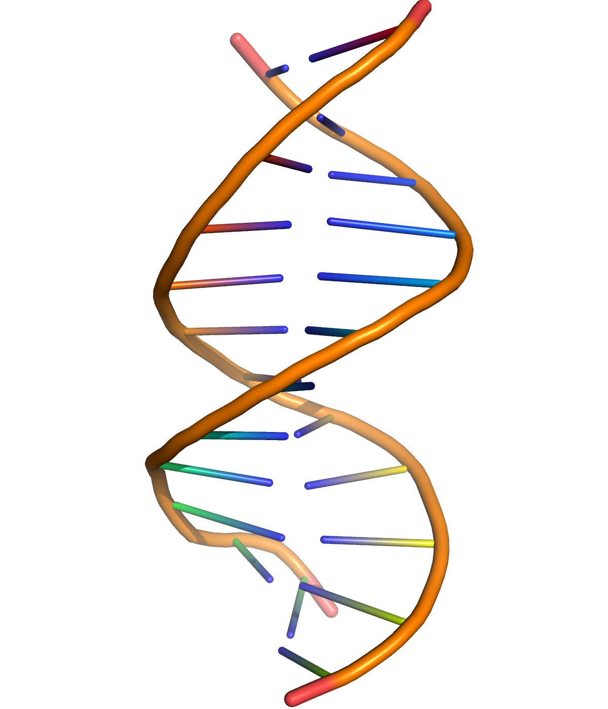
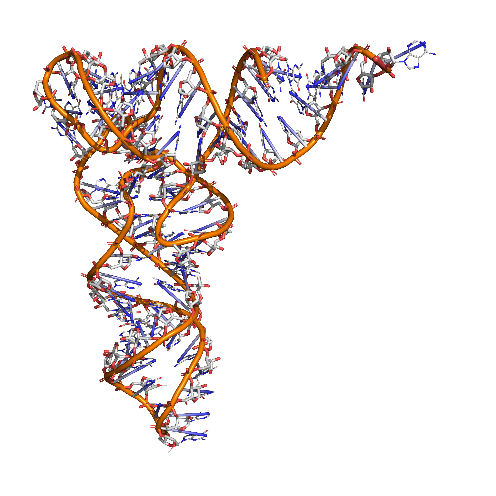
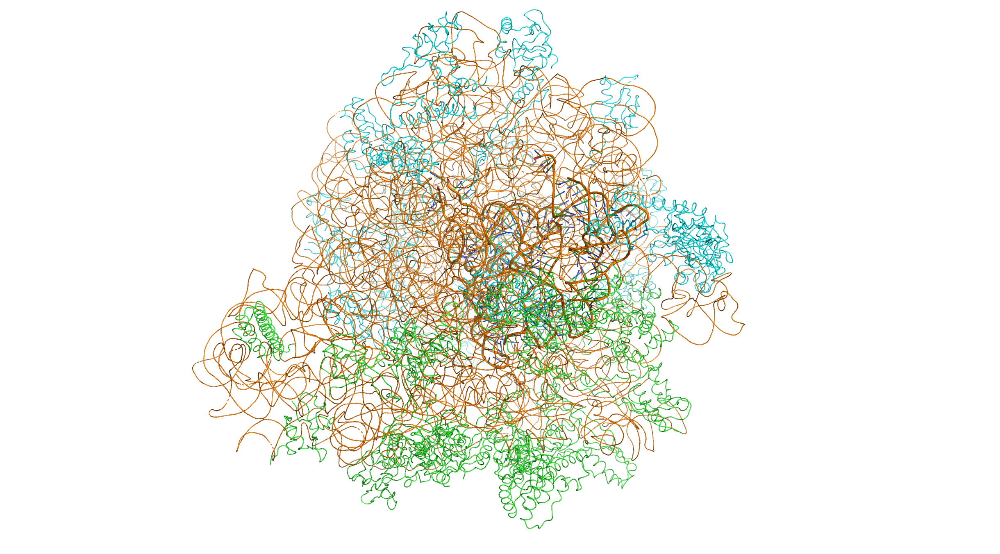
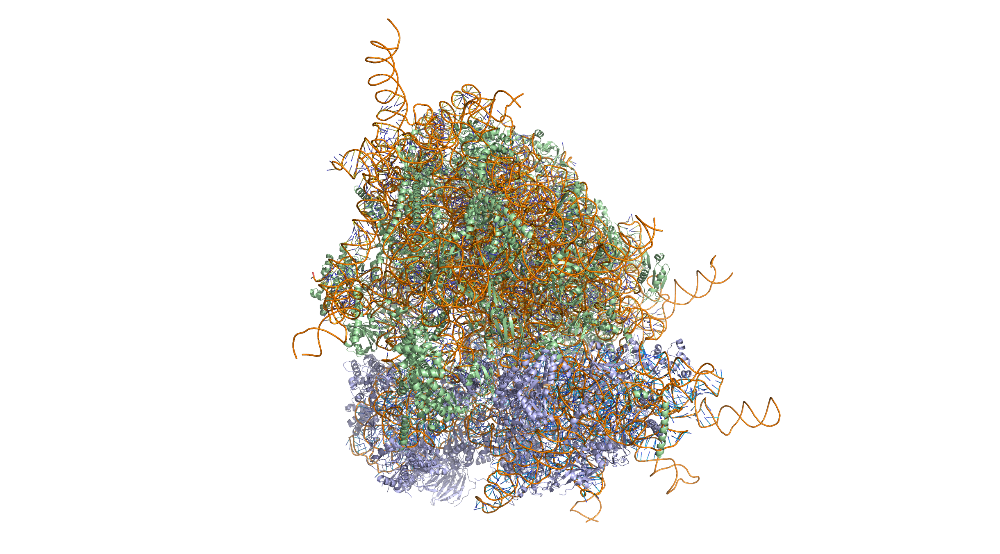

# Molecular Biology And Genetics

Molecular biology is the branch of biology that concerns the molecular basis of biological activity in and between cells, including molecular synthesis, modification, mechanisms and interactions. Molecular biology arose as an attempt to answer the questions regarding the mechanisms of genetic inheritance and the structure of a gene. In 1953, James Watson and Francis Crick published the double helical structure of DNA courtesy of the X-ray crystallography work done by Rosalind Franklin and Maurice Wilkins. Watson and Crick described the structure of DNA and the interactions within the molecule. This publication jump-started research into molecular biology and increased interest in the subject. 

[Nucleic acids](https://en.wikipedia.org/wiki/Nucleic_acid) are biopolymers that are essential to all known forms of life. The term nucleic acid is the overall name for DNA and RNA. They are composed of nucleotides, which are the monomers made of three components: a 5-carbon sugar, a phosphate group and a nitrogenous base. If the sugar is a compound ribose, the polymer is RNA (ribonucleic acid); if the sugar is derived from ribose as deoxyribose, the polymer is DNA (deoxyribonucleic acid).

In an influential published in 1941 paper, [George Beadle](https://en.wikipedia.org/wiki/George_Beadle) and [Edward Tatum](https://en.wikipedia.org/wiki/Edward_Tatum) proposed the idea that genes act through the production of enzymes, with each gene responsible for producing a single enzyme that in turn affects a single step in a metabolic pathway. The concept arose from work on genetic mutations in the mold *Neurospora crassa*, and subsequently was dubbed the "one gene–one enzyme hypothesis" by their collaborator Norman Horowitz. In 2004 Norman Horowitz reminisced that "these experiments founded the science of what Beadle and Tatum called 'biochemical genetics.' These experiments are by some considered to constitute the begining of what became molecular genetics and the development of the one gene–one enzyme hypothesis is often considered the first significant result in what came to be called molecular biology. Although it has been extremely influential, the hypothesis was recognized soon after its proposal to be an oversimplification. Even the subsequent reformulation of the "one gene–one polypeptide" hypothesis is now considered too simple to describe the relationship between genes and proteins. In attributing an instructional role to genes, Beadle and Tatum implicitly accorded genes an informational capability. This insight provided the foundation for the concept of a genetic code. However, it was not until the experiments were performed showing that DNA was the genetic material, that proteins consist of a defined linear sequence of amino acids, and that DNA structure contained a linear sequence of base pairs, was there a clear basis for solving the genetic code.

In attributing an instructional role to genes, Beadle and Tatum implicitly accorded genes an informational capability. This insight provided the foundation for the concept of a genetic code. However, it was not until the experiments were performed showing that DNA was the genetic material, that proteins consist of a defined linear sequence of amino acids, and that DNA structure contained a linear sequence of base pairs, was there a clear basis for solving the genetic code.

Although genes were known to exist on chromosomes, chromosomes are composed of both protein and DNA, and scientists did not know which of the two is responsible for inheritance. In 1928, [Frederick Griffith](https://en.wikipedia.org/wiki/Frederick_Griffith) discovered the phenomenon of transformation: dead bacteria could transfer genetic material to "transform" other still-living bacteria. Sixteen years later, in 1944, the Avery–MacLeod–McCarty experiment identified DNA as the molecule responsible for transformation. The role of the nucleus as the repository of genetic information in eukaryotes had been established by Hämmerling in 1943 in his work on the single celled alga Acetabularia. The Hershey–Chase experiment in 1952 confirmed that DNA (rather than protein) is the genetic material of the viruses that infect bacteria, providing further evidence that DNA is the molecule responsible for inheritance.

[James Watson](https://en.wikipedia.org/wiki/James_Watson) and [Francis Crick](https://en.wikipedia.org/wiki/Francis_Crick) determined the structure of DNA in 1953, using the X-ray crystallography work of [Rosalind Franklin](https://en.wikipedia.org/wiki/Rosalind_Franklin) and [Maurice Wilkins](https://en.wikipedia.org/wiki/Maurice_Wilkins) that indicated DNA has a helical structure (i.e., shaped like a corkscrew). Their double-helix model had two strands of DNA with the nucleotides pointing inward, each matching a complementary nucleotide on the other strand to form what look like rungs on a twisted ladder. This structure showed that genetic information exists in the sequence of nucleotides on each strand of DNA. The structure also suggested a simple method for replication: if the strands are separated, new partner strands can be reconstructed for each based on the sequence of the old strand. This property is what gives DNA its semi-conservative nature where one strand of new DNA is from an original parent strand.

(ref:DNA) A cartoon representation of DNA based on atomic coordinates of [PDB 1BNA](https://www.rcsb.org/structure/1bna), rendered with open source molecular visualization tool PyMol.

```{r dnacartoon, fig.cap='(ref:DNA)', echo=FALSE, message=FALSE, warning=FALSE}

```

Although the structure of DNA showed how inheritance works, it was still not known how DNA influences the behavior of cells. In the following years, scientists tried to understand how DNA controls the process of protein production. It was discovered that the cell uses DNA as a template to create matching messenger RNA, molecules with nucleotides very similar to DNA. The nucleotide sequence of a messenger RNA is used as a template by ribosomes to create an amino acid sequence in protein; this correspondence between nucleotide sequences and amino acid sequences is known as the genetic code.

With the newfound molecular understanding of inheritance came an explosion of research. One important development was chain-termination DNA sequencing in 1977 by [Frederick Sanger](https://en.wikipedia.org/wiki/Frederick_Sanger). This technology allows scientists to read the nucleotide sequence of a DNA molecule. In 1983, [Kary Banks Mullis](https://en.wikipedia.org/wiki/Kary_Mullis) developed the polymerase chain reaction, providing a quick way to isolate and amplify a specific section of DNA from a mixture. The efforts of the Human Genome Project, Department of Energy, NIH, and parallel private efforts by Celera Genomics led to the sequencing of the human genome in 2003.

## DNA

[Deoxyribonucleic acid](https://en.wikipedia.org/wiki/DNA) (DNA) is a molecule composed of two chains that coil around each other to form a double helix carrying genetic instructions for the development, functioning, growth and reproduction of all known organisms and many viruses. DNA and ribonucleic acid (RNA) are nucleic acids; alongside proteins, lipids and complex carbohydrates (polysaccharides), nucleic acids are one of the four major types of macromolecules that are essential for all known forms of life.

(ref:dnastruc) The structure of the DNA double helix. A section of DNA. The bases lie horizontally between the two spiraling strands. The atoms in the structure are colour-coded by element (based on atomic coordinates of [PDB 1bna](https://www.rcsb.org/structure/1bna) rendered with open source molecular visualization tool PyMol.)

```{r dnastructure, fig.cap='(ref:dnastruc)', echo=FALSE, message=FALSE, warning=FALSE}
knitr::include_graphics("./figures/dna/dna_licorice.png")
```

The two DNA strands are also known as polynucleotides as they are composed of simpler monomeric units called nucleotides. Each nucleotide is composed of one of four nitrogen-containing nucleobases (cytosine [C], guanine [G], adenine [A] or thymine [T]), a sugar called deoxyribose, and a phosphate group. The nucleotides are joined to one another in a chain by covalent bonds between the sugar of one nucleotide and the phosphate of the next, resulting in an alternating sugar-phosphate backbone. The nitrogenous bases of the two separate polynucleotide strands are bound together, according to base pairing rules (A with T and C with G), with hydrogen bonds to make double-stranded DNA. The complementary nitrogenous bases are divided into two groups, pyrimidines and purines. In DNA, the pyrimidines are thymine and cytosine; the purines are adenine and guanine.

(ref:bases) The structure of the four nucleotides and their base pairing in the DNA double helix. The atoms in the structure are colour-coded by element (based on atomic coordinates of [PDB 1bna](https://www.rcsb.org/structure/1bna) rendered with open source molecular visualization tool PyMol.)

```{r basestruc, fig.cap='(ref:bases)', echo=FALSE, message=FALSE, warning=FALSE}
knitr::include_graphics("./figures/dna/bases_hydrogen.png")
```

Both strands of DNA store biological information. This information is replicated as and when the two strands separate. A large part of DNA (more than 98% for humans) is non-coding, meaning that these sections do not serve as patterns for protein sequences. The two strands of DNA run in opposite directions to each other and are thus antiparallel. Attached to each sugar is one of four types of nucleobases (informally, bases). It is the sequence of these four nucleobases along the backbone that encodes genetic information. RNA strands are created using DNA strands as a template in a process called transcription, where DNA bases are exchanged for their corresponding bases except in the case of thymine (T), which RNA substitutes for uracil (U). Under the genetic code, these RNA strands specify the sequence of amino acids within proteins in a process called translation.

Within eukaryotic cells, DNA is organized into long structures called chromosomes. Before typical cell division, these chromosomes are duplicated in the process of DNA replication, providing a complete set of chromosomes for each daughter cell. Eukaryotic organisms (animals, plants, fungi and protists) store most of their DNA inside the cell nucleus as nuclear DNA, and some in the mitochondria as mitochondrial DNA or in chloroplasts as chloroplast DNA. In contrast, prokaryotes (bacteria and archaea) store their DNA only in the cytoplasm, in circular chromosomes. Within eukaryotic chromosomes, chromatin proteins, such as histones, compact and organize DNA. These compacting structures guide the interactions between DNA and other proteins, helping control which parts of the DNA are transcribed.

DNA was first isolated by [Friedrich Miescher](https://en.wikipedia.org/wiki/Friedrich_Miescher) in 1869. Its molecular structure was first identified by [Francis Crick](https://en.wikipedia.org/wiki/Francis_Crick) and [James Watson](https://en.wikipedia.org/wiki/James_Watson) at the Cavendish Laboratory within the University of Cambridge in 1953, whose model-building efforts were guided by X-ray diffraction data acquired by [Raymond Gosling](https://en.wikipedia.org/wiki/Raymond_Gosling), who was a post-graduate student of [Rosalind Franklin](https://en.wikipedia.org/wiki/Rosalind_Franklin).

### Structure and composition of DNA 

DNA is a long polymer made from repeating units called nucleotides, each of which is usually symbolized by a single letter: either A, T, C, or G. The structure of DNA is dynamic along its length, being capable of coiling into tight loops and other shapes. In all species it is composed of two helical chains, bound to each other by hydrogen bonds. Both chains are coiled around the same axis, and have the same pitch of 34 angstroms (Å) (3.4 nanometres). The pair of chains has a radius of 10 angstroms (1.0 nanometre). Although each individual nucleotide is very small, a DNA polymer can be very large and contain hundreds of millions, such as in chromosome 1. Chromosome 1 is the largest human chromosome with approximately 220 million base pairs, and would be 85 mm long if straightened.

DNA does not usually exist as a single strand, but instead as a pair of strands that are held tightly together. These two long strands coil around each other, in the shape of a double helix. The nucleotide contains both a segment of the backbone of the molecule (which holds the chain together) and a nucleobase (which interacts with the other DNA strand in the helix). A nucleobase linked to a sugar is called a nucleoside, and a base linked to a sugar and to one or more phosphate groups is called a nucleotide. A biopolymer comprising multiple linked nucleotides (as in DNA) is called a polynucleotide.

The backbone of the DNA strand is made from alternating phosphate and sugar residues. The sugar in DNA is 2-deoxyribose, which is a pentose (five-carbon) sugar. The sugars are joined together by phosphate groups that form phosphodiester bonds between the third and fifth carbon atoms of adjacent sugar rings. These are known as the 3′-end (three prime end), and 5′-end (five prime end) carbons, the prime symbol being used to distinguish these carbon atoms from those of the base to which the deoxyribose forms a glycosidic bond. When imagining DNA, each phosphoryl is normally considered to "belong" to the nucleotide whose 5′ carbon forms a bond therewith. Any DNA strand therefore normally has one end at which there is a phosphoryl attached to the 5′ carbon of a ribose (the 5′ phosphoryl) and another end at which there is a free hydroxyl attached to the 3′ carbon of a ribose (the 3′ hydroxyl). The orientation of the 3′ and 5′ carbons along the sugar-phosphate backbone confers directionality (sometimes called polarity) to each DNA strand. In a nucleic acid double helix, the direction of the nucleotides in one strand is opposite to their direction in the other strand: the strands are antiparallel. The asymmetric ends of DNA strands are said to have a directionality of five prime end (5′ ), and three prime end (3′), with the 5′ end having a terminal phosphate group and the 3′ end a terminal hydroxyl group. One major difference between DNA and RNA is the sugar, with the 2-deoxyribose in DNA being replaced by the alternative pentose sugar ribose in RNA.

#### Grooves

Twin helical strands form the DNA backbone. Another double helix may be found tracing the spaces, or grooves, between the strands (Figure \@ref(fig:groove)). These voids are adjacent to the base pairs and may provide a binding site. As the strands are not symmetrically located with respect to each other, the grooves are unequally sized. One groove, the major groove, is 22 angstroms (Å) wide and the other, the minor groove, is 12 Å wide. The width of the major groove means that the edges of the bases are more accessible in the major groove than in the minor groove. As a result, proteins such as transcription factors that can bind to specific sequences in double-stranded DNA usually make contact with the sides of the bases exposed in the major groove. 

(ref:gro) DNA major and minor grooves. [PDB 1bna](https://www.rcsb.org/structure/1bna) rendered with open source molecular visualization tool PyMol.)

```{r groove, fig.cap='(ref:gro)', echo=FALSE, message=FALSE, warning=FALSE}
knitr::include_graphics("./figures/dna/dna_solid.png")
```

#### Base pairing

In a DNA double helix, each type of nucleobase on one strand bonds with just one type of nucleobase on the other strand. This is called complementary base pairing. Here, purines form hydrogen bonds to pyrimidines, with adenine bonding only to thymine in two hydrogen bonds, and cytosine bonding only to guanine in three hydrogen bonds (Figure \@ref(fig:pairing)). This arrangement of two nucleotides binding together across the double helix is called a Watson-Crick base pair. As hydrogen bonds are not covalent, they can be broken and rejoined relatively easily. The two strands of DNA in a double helix can thus be pulled apart like a zipper, either by a mechanical force or high temperature. As a result of this base pair complementarity, all the information in the double-stranded sequence of a DNA helix is duplicated on each strand, which is vital in DNA replication. This reversible and specific interaction between complementary base pairs is critical for all the functions of DNA in organisms.

(ref:pair) Top, a [GC base pair](https://commons.wikimedia.org/wiki/File:Base_pair_GC.svg) with three hydrogen bonds. Bottom, an [AT base pair](https://commons.wikimedia.org/wiki/File:Base_pair_AT.svg) with two hydrogen bonds. Non-covalent hydrogen bonds between the pairs are shown as dashed lines. The two types of base pairs form different numbers of hydrogen bonds, AT forming two hydrogen bonds, and GC forming three hydrogen bonds (see figures, right). DNA with high GC-content is more stable than DNA with low GC-content.

```{r pairing, fig.cap='(ref:pair)', echo=FALSE, message=FALSE, warning=FALSE}
knitr::include_graphics(c("./figures/dna/Base_pair_GC.svg", "./figures/dna/Base_pair_AT.svg"))
```

As noted above, most DNA molecules are actually two polymer strands, bound together in a helical fashion by noncovalent bonds; this double-stranded (dsDNA) structure is maintained largely by the intrastrand base stacking interactions, which are strongest for G,C stacks. The two strands can come apart—a process known as melting—to form two single-stranded DNA (ssDNA) molecules. Melting occurs at high temperature, low salt and high pH (low pH also melts DNA, but since DNA is unstable due to acid depurination, low pH is rarely used).

The stability of the dsDNA form depends not only on the GC-content (% G,C basepairs) but also on sequence (since stacking is sequence specific) and also length (longer molecules are more stable). The stability can be measured in various ways; a common way is the "melting temperature", which is the temperature at which 50% of the ds molecules are converted to ss molecules; melting temperature is dependent on ionic strength and the concentration of DNA. As a result, it is both the percentage of GC base pairs and the overall length of a DNA double helix that determines the strength of the association between the two strands of DNA. Long DNA helices with a high GC-content have stronger-interacting strands, while short helices with high AT content have weaker-interacting strands. In biology, parts of the DNA double helix that need to separate easily, such as the TATAAT [Pribnow box](https://en.wikipedia.org/wiki/Pribnow_box) in some promoters, tend to have a high AT content, making the strands easier to pull apart.

In the laboratory, the strength of this interaction can be measured by finding the temperature necessary to break the hydrogen bonds, their melting temperature (also called T~m~ value). When all the base pairs in a DNA double helix melt, the strands separate and exist in solution as two entirely independent molecules. These single-stranded DNA molecules have no single common shape, but some conformations are more stable than others.

#### Sense and antisense

A DNA sequence is called a "sense" sequence if it is the same as that of a messenger RNA copy that is translated into protein. The sequence on the opposite strand is called the "antisense" sequence. Both sense and antisense sequences can exist on different parts of the same strand of DNA (i.e. both strands can contain both sense and antisense sequences). In both prokaryotes and eukaryotes, antisense RNA sequences are produced, but the functions of these RNAs are not entirely clear. One proposal is that antisense RNAs are involved in regulating gene expression through RNA-RNA base pairing.

A few DNA sequences in prokaryotes and eukaryotes, and more in plasmids and viruses, blur the distinction between sense and antisense strands by having overlapping genes. In these cases, some DNA sequences do double duty, encoding one protein when read along one strand, and a second protein when read in the opposite direction along the other strand. In bacteria, this overlap may be involved in the regulation of gene transcription, while in viruses, overlapping genes increase the amount of information that can be encoded within the small viral genome.

#### Supercoiling

DNA can be twisted like a rope in a process called DNA supercoiling. With DNA in its "relaxed" state, a strand usually circles the axis of the double helix once every 10.4 base pairs, but if the DNA is twisted the strands become more tightly or more loosely wound. If the DNA is twisted in the direction of the helix, this is positive supercoiling, and the bases are held more tightly together. If they are twisted in the opposite direction, this is negative supercoiling, and the bases come apart more easily. In nature, most DNA has slight negative supercoiling that is introduced by enzymes called topoisomerases. These enzymes are also needed to relieve the twisting stresses introduced into DNA strands during processes such as transcription and DNA replication.

### Base modifications and DNA packaging

The expression of genes is influenced by how the DNA is packaged in chromosomes, in a structure called chromatin. Base modifications can be involved in packaging, with regions that have low or no gene expression usually containing high levels of methylation of cytosine bases. DNA packaging and its influence on gene expression can also occur by covalent modifications of the histone protein core around which DNA is wrapped in the chromatin structure or else by remodeling carried out by chromatin remodeling complexes. There is, further, crosstalk between DNA methylation and histone modification, so they can coordinately affect chromatin and gene expression.

For one example, cytosine methylation produces 5-methylcytosine, which is important for X-inactivation of chromosomes. The average level of methylation varies between organisms—the worm *Caenorhabditis elegans* lacks cytosine methylation, while vertebrates have higher levels, with up to 1% of their DNA containing 5-methylcytosine. Despite the importance of 5-methylcytosine, it can deaminate to leave a thymine base, so methylated cytosines are particularly prone to mutations. Other base modifications include adenine methylation in bacteria, the presence of 5-hydroxymethylcytosine in the brain, and the glycosylation of uracil to produce the "J-base" in kinetoplastids.

### DNA damage

DNA can be damaged by many sorts of [mutagens](https://en.wikipedia.org/wiki/Mutagen), which change the DNA sequence. Mutagens include oxidizing agents, alkylating agents and also high-energy electromagnetic radiation such as ultraviolet light and X-rays. The type of DNA damage produced depends on the type of mutagen. For example, UV light can damage DNA by producing thymine dimers, which are cross-links between pyrimidine bases. On the other hand, oxidants such as free radicals or hydrogen peroxide produce multiple forms of damage, including base modifications, particularly of guanosine, and double-strand breaks. A typical human cell contains about 150,000 bases that have suffered oxidative damage. Of these oxidative lesions, the most dangerous are double-strand breaks, as these are difficult to repair and can produce point mutations, insertions, deletions from the DNA sequence, and chromosomal translocations. These mutations can cause cancer. DNA damage that is naturally occurring, due to normal cellular processes that produce reactive oxygen species, the hydrolytic activities of cellular water, etc., also occurs frequently. Although most of this damage is repaired, in any cell some DNA damage may remain despite the action of repair processes. This DNA damage accumulates with age in mammalian postmitotic tissues. This accumulation appears to be an important underlying cause of aging.

Many mutagens fit into the space between two adjacent base pairs, this is called intercalation. Most intercalators are aromatic and planar molecules; examples include ethidium bromide, acridines, daunomycin, and doxorubicin. For an intercalator to fit between base pairs, the bases must separate, distorting the DNA strands by unwinding of the double helix. This inhibits both transcription and DNA replication, causing toxicity and mutations. As a result, DNA intercalators may be carcinogens, and in the case of thalidomide, a teratogen. Others such as benzo[a]pyrene diol epoxide and aflatoxin form DNA adducts that induce errors in replication. Nevertheless, due to their ability to inhibit DNA transcription and replication, other similar toxins are also used in chemotherapy to inhibit rapidly growing cancer cells.

### Biological functions of DNA

DNA usually occurs as linear chromosomes in eukaryotes, and circular chromosomes in prokaryotes. The set of chromosomes in a cell makes up its genome; the human genome has approximately 3 billion base pairs of DNA arranged into 46 chromosomes. Transmission of genetic information in genes is achieved via complementary base pairing. For example, in transcription, the DNA sequence is copied into a complementary RNA sequence. Usually, this RNA copy is then used to make a matching protein sequence in a process called translation. In alternative fashion, a cell may simply copy its genetic information in a process called DNA replication.

#### Genes and genomes

Genomic DNA is tightly and orderly packed in the process called DNA condensation, to fit the small available volumes of the cell. In eukaryotes, DNA is located in the cell nucleus, with small amounts in mitochondria and chloroplasts. In prokaryotes, the DNA is held within an irregularly shaped body in the cytoplasm called the nucleoid. 

In many species, only a small fraction of the total sequence of the genome encodes protein. For example, only about 1.5% of the human genome consists of protein-coding exons, with over 50% of human DNA consisting of non-coding repetitive sequences. The reasons for the presence of so much noncoding DNA in eukaryotic genomes and the extraordinary differences in genome size, or C-value, among species, represent a long-standing puzzle known as the "C-value enigma". However, some DNA sequences that do not code protein may still encode functional non-coding RNA molecules, which are involved in the regulation of gene expression. 

Some noncoding DNA sequences play structural roles in chromosomes. Telomeres and centromeres typically contain few genes but are important for the function and stability of chromosomes. An abundant form of noncoding DNA in humans are pseudogenes, which are copies of genes that have been disabled by mutation. These sequences are usually just molecular fossils, although they can occasionally serve as raw genetic material for the creation of new genes through the process of gene duplication and divergence.

#### Transcription and translation

A gene is a sequence of DNA that contains genetic information and can influence the phenotype of an organism. Within a gene, the sequence of bases along a DNA strand defines a messenger RNA sequence, which then defines one or more protein sequences. The relationship between the nucleotide sequences of genes and the amino-acid sequences of proteins is determined by the rules of translation, known collectively as the genetic code. The genetic code consists of three-letter 'words' called codons formed from a sequence of three nucleotides (e.g. ACT, CAG, TTT).

In transcription, the codons of a gene are copied into messenger RNA by RNA polymerase. This RNA copy is then decoded by a ribosome that reads the RNA sequence by base-pairing the messenger RNA to transfer RNA, which carries amino acids. Since there are 4 bases in 3-letter combinations, there are 64 possible codons. These encode the twenty standard amino acids, giving most amino acids more than one possible codon. There are also three 'stop' or 'nonsense' codons signifying the end of the coding region; these are the TAA, TGA, and TAG codons.

### DNA replication

Cell division is essential for an organism to grow, but, when a cell divides, it must replicate the DNA in its genome so that the two daughter cells have the same genetic information as their parent. The double-stranded structure of DNA provides a simple mechanism for DNA replication. Here, the two strands are separated and then each strand's complementary DNA sequence is recreated by an enzyme called DNA polymerase. This enzyme makes the complementary strand by finding the correct base through complementary base pairing and bonding it onto the original strand. As DNA polymerases can only extend a DNA strand in a 5′ to 3′ direction, different mechanisms are used to copy the antiparallel strands of the double helix. In this way, the base on the old strand dictates which base appears on the new strand, and the cell ends up with a perfect copy of its DNA.


In molecular biology, DNA replication is the biological process of producing two identical replicas of DNA from one original DNA molecule. DNA replication occurs in all living organisms acting as the basis for biological inheritance.

DNA is made up of a double helix of two complementary strands. During replication, these strands are separated. Each strand of the original DNA molecule then serves as a template for the production of its counterpart, a process referred to as semi-conservative replication. As a result of semi-conservative replication, the new helix will be composed of an original DNA strand as well as a newly synthesized strand. Cellular proofreading and error-checking mechanisms ensure near perfect fidelity for DNA replication.

(ref:fork) [DNA polymerases adds nucleotides to the 3′ end of a strand of DNA. If a mismatch is accidentally incorporated, the polymerase is inhibited from further extension. Proofreading removes the mismatched nucleotide and extension continues.](https://commons.wikimedia.org/wiki/File:DNA_replication_split.svg)

```{r repfork, fig.cap='(ref:fork)', echo=FALSE, message=FALSE, warning=FALSE}
knitr::include_graphics("./figures/replication/DNA_replication_split.svg")
```

In a cell, DNA replication begins at specific locations, or origins of replication, in the genome. Unwinding of DNA at the origin and synthesis of new strands, accommodated by an enzyme known as helicase, results in replication forks growing bi-directionally from the origin. A number of proteins are associated with the replication fork to help in the initiation and continuation of DNA synthesis. Most prominently, DNA polymerase synthesizes the new strands by adding nucleotides that complement each (template) strand. DNA replication occurs during the S-stage of interphase.

DNA replication (DNA amplification) can also be performed in vitro (artificially, outside a cell). DNA polymerases isolated from cells and artificial DNA primers can be used to start DNA synthesis at known sequences in a template DNA molecule. Polymerase chain reaction (PCR), ligase chain reaction (LCR), and transcription-mediated amplification (TMA) are examples.

The [replisome](https://en.wikipedia.org/wiki/Replisome) is a complex molecular machine that carries out replication of DNA. The replisome first unwinds double stranded DNA into two single strands. For each of the resulting single strands, a new complementary sequence of DNA is synthesized. The net result is formation of two new double stranded DNA sequences that are exact copies of the original double stranded DNA sequence.

In terms of structure, the replisome is composed of two replicative polymerase complexes, one of which synthesizes the leading strand, while the other synthesizes the lagging strand. The replisome is composed of a number of proteins including helicase, RFC, PCNA, gyrase/topoisomerase, SSB/RPA, primase, DNA polymerase III, RNAse H, and ligase.

For prokaryotes, each dividing nucleoid (region containing genetic material which is not a nucleus) requires two replisomes for bidirectional replication. The two replisomes continue replication at both forks in the middle of the cell. Finally, as the termination site replicates, the two replisomes separate from the DNA. The replisome remains at a fixed, midcell location in the cell, attached to the membrane, and the template DNA threads through it. DNA is fed through the stationary pair of replisomes located at the cell membrane.

For eukaryotes, numerous replication bubbles form at origins of replication throughout the chromosome. As with prokaryotes, two replisomes are required, one at each replication fork located at the terminus of the replication bubble. Because of significant differences in chromosome size, and the associated complexities of highly condensed chromosomes, various aspects of the DNA replication process in eukaryotes, including the terminal phases, are less well-characterised than for prokaryotes.

The replisome is responsible for copying the entirety of genomic DNA in each proliferative cell. This process allows for the high-fidelity passage of hereditary/genetic information from parental cell to daughter cell and is thus essential to all organisms. Much of the cell cycle is built around ensuring that DNA replication occurs without errors.

(ref:dnarep) [Many enzymes are involved in forming the DNA replication fork and DNA polymerization.](https://commons.wikimedia.org/wiki/File:Eukaryotic_DNA_replication.svg)

```{r repforkform, fig.cap='(ref:dnarep)', echo=FALSE, message=FALSE, warning=FALSE}
knitr::include_graphics("./figures/replication/Eukaryotic_DNA_replication.svg")
```

In G1 phase of the cell cycle, many of the DNA replication regulatory processes are initiated. In eukaryotes, the vast majority of DNA synthesis occurs during S phase of the cell cycle, and the entire genome must be unwound and duplicated to form two daughter copies. During G2, any damaged DNA or replication errors are corrected. Finally, one copy of the genomes is segregated to each daughter cell at mitosis or M phase. These daughter copies each contain one strand from the parental duplex DNA and one nascent antiparallel strand.


## Eukaryotic DNA replication

Eukaryotic DNA replication is a conserved mechanism that restricts DNA replication to once per cell cycle. Eukaryotic DNA replication of chromosomal DNA is central for the duplication of a cell and is necessary for the maintenance of the eukaryotic genome.

DNA replication is the action of DNA polymerases synthesizing a DNA strand complementary to the original template strand. To synthesize DNA, the double-stranded DNA is unwound by DNA helicases ahead of polymerases, forming a replication fork containing two single-stranded templates. Replication processes permit the copying of a single DNA double helix into two DNA helices, which are divided into the daughter cells at mitosis. The major enzymatic functions carried out at the replication fork are well conserved from prokaryotes to eukaryotes, but the replication machinery in eukaryotic DNA replication is a much larger complex, coordinating many proteins at the site of replication, forming the replisome.

After the replicative helicase has unwound the parental DNA duplex, exposing two single-stranded DNA templates, replicative polymerases are needed to generate two copies of the parental genome. DNA polymerase function is highly specialized and accomplish replication on specific templates and in narrow localizations. At the eukaryotic replication fork, there are three distinct replicative polymerase complexes that contribute to DNA replication: Polymerase α, Polymerase δ, and Polymerase ε. These three polymerases are essential for viability of the cell.

(ref:pol) [DNA polymerases adds nucleotides to the 3′ end of a strand of DNA. If a mismatch is accidentally incorporated, the polymerase is inhibited from further extension. Proofreading removes the mismatched nucleotide and extension continues.](https://commons.wikimedia.org/wiki/File:DNA_polymerase.svg)

```{r polymerase, fig.cap='(ref:pol)', echo=FALSE, message=FALSE, warning=FALSE}

```

Because DNA polymerases require a primer on which to begin DNA synthess, polymerase α (Pol α) acts as a replicative primase. Pol α is associated with an RNA primase and this complex accomplishes the priming task by synthesizing a primer that contains a short 10 nucleotide stretch of RNA followed by 10 to 20 DNA bases. Importantly, this priming action occurs at replication initiation at origins to begin leading-strand synthesis and also at the 5' end of each Okazaki fragment on the lagging strand.

However, Pol α is not able to continue DNA replication and must be replaced with another polymerase to continue DNA synthesis. Polymerase switching requires clamp loaders and it has been proven that normal DNA replication requires the coordinated actions of all three DNA polymerases: Pol α for priming synthesis, Pol ε for leading-strand replication, and the Pol δ, which is constantly loaded, for generating Okazaki fragments during lagging-strand synthesis.

* Polymerase α (Pol α): Forms a complex with a small catalytic subunit (PriS) and a large noncatalytic (PriL) subunit. First, synthesis of an RNA primer allows DNA synthesis by DNA polymerase alpha. Occurs once at the origin on the leading strand and at the start of each Okazaki fragment on the lagging strand. Pri subunits act as a primase, synthesizing an RNA primer. DNA Pol α elongates the newly formed primer with DNA nucleotides. After around 20 nucleotides, elongation is taken over by Pol ε on the leading strand and Pol δ on the lagging strand.
* Polymerase δ (Pol δ): Highly processive and has proofreading, 3'->5' exonuclease activity. In vivo, it is the main polymerase involved in both lagging strand and leading strand synthesis.
* Polymerase ε (Pol ε): Highly processive and has proofreading, 3'->5' exonuclease activity. Highly related to pol δ, in vivo it functions mainly in error checking of pol δ.

DNA replication, like all biological polymerization processes, proceeds in three enzymatically catalyzed and coordinated steps: initiation, elongation and termination.

### Initiation

For a cell to divide, it must first replicate its DNA. DNA replication is an all-or-none process; once replication begins, it proceeds to completion. Once replication is complete, it does not occur again in the same cell cycle. This is made possible by the division of initiation into two temporally distinct steps: formation of the pre-replication complex and the preinitiation complex.

### Pre-replication complex

In late mitosis and early G1 phase, a large complex of initiator proteins assembles into the pre-replication complex at particular points in the DNA, known as "origins". In *E. coli* the primary initiator protein is DnaA; in yeast, this is the origin recognition complex. Sequences used by initiator proteins tend to be "AT-rich" (rich in adenine and thymine bases), because A-T base pairs have two hydrogen bonds (rather than the three formed in a C-G pair) and thus are easier to strand-separate. In eukaryotes, the origin recognition complex catalyzes the assembly of initiator proteins into the pre-replication complex. Cdc6 and Cdt1 then associate with the bound origin recognition complex at the origin in order to form a larger complex necessary to load the Mcm complex onto the DNA. The Mcm complex is the helicase that will unravel the DNA helix at the replication origins and replication forks in eukaryotes. The Mcm complex is recruited at late G1 phase and loaded by the ORC-Cdc6-Cdt1 complex onto the DNA via ATP-dependent protein remodeling. The loading of the Mcm complex onto the origin DNA marks the completion of pre-replication complex formation.

If environmental conditions are right in late G1 phase, the G1 and G1/S cyclin-Cdk complexes are activated, which stimulate expression of genes that encode components of the DNA synthetic machinery. G1/S-Cdk activation also promotes the expression and activation of S-Cdk complexes, which may play a role in activating replication origins depending on species and cell type. Control of these Cdks vary depending cell type and stage of development.

In a similar manner, Cdc7 is also required through S phase to activate replication origins. Cdc7 is not active throughout the cell cycle, and its activation is strictly timed to avoid premature initiation of DNA replication. In late G1, Cdc7 activity rises abruptly as a result of association with the regulatory subunit Dbf4, which binds Cdc7 directly and promotes its protein kinase activity. Cdc7 has been found to be a rate-limiting regulator of origin activity. Together, the G1/S-Cdks and/or S-Cdks and Cdc7 collaborate to directly activate the replication origins, leading to initiation of DNA synthesis.

### Preinitiation complex

In early S phase, S-Cdk and Cdc7 activation lead to the assembly of the preinitiation complex, a massive protein complex formed at the origin. Formation of the preinitiation complex displaces Cdc6 and Cdt1 from the origin replication complex, inactivating and disassembling the pre-replication complex. Loading the preinitiation complex onto the origin activates the Mcm helicase, causing unwinding of the DNA helix.  The preinitiation complex also loads α-primase and other DNA polymerases onto the DNA.

After α-primase synthesizes the first primers, the primer-template junctions interact with the clamp loader, which loads the sliding clamp onto the DNA to begin DNA synthesis. The components of the preinitiation complex remain associated with replication forks as they move out from the origin.

### Elongation

DNA polymerase has 5′–3′ activity. All known DNA replication systems require a free 3′ hydroxyl group before synthesis can be initiated (note: the DNA template is read in 3′ to 5′ direction whereas a new strand is synthesized in the 5′ to 3′ direction—this is often confused). Four distinct mechanisms for DNA synthesis are recognized:

All cellular life forms and many DNA viruses, phages and plasmids use a primase to synthesize a short RNA primer with a free 3′ OH group which is subsequently elongated by a DNA polymerase. The 5′ end of the nicked strand is transferred to a tyrosine residue on the nuclease and the free 3′ OH group is then used by the DNA polymerase to synthesize the new strand.
The first is the best known of these mechanisms and is used by the cellular organisms. In this mechanism, once the two strands are separated, primase adds RNA primers to the template strands. The leading strand receives one RNA primer while the lagging strand receives several. The leading strand is continuously extended from the primer by a DNA polymerase with high processivity, while the lagging strand is extended discontinuously from each primer forming Okazaki fragments. RNase removes the primer RNA fragments, and a low processivity DNA polymerase distinct from the replicative polymerase enters to fill the gaps. When this is complete, a single nick on the leading strand and several nicks on the lagging strand can be found. Ligase works to fill these nicks in, thus completing the newly replicated DNA molecule.

Multiple DNA polymerases take on different roles in the DNA replication process. In *E. coli*, DNA Pol III is the polymerase enzyme primarily responsible for DNA replication. It assembles into a replication complex at the replication fork that exhibits extremely high processivity, remaining intact for the entire replication cycle. In contrast, DNA Pol I is the enzyme responsible for replacing RNA primers with DNA. DNA Pol I has a 5′ to 3′ exonuclease activity in addition to its polymerase activity, and uses its exonuclease activity to degrade the RNA primers ahead of it as it extends the DNA strand behind it, in a process called nick translation. Pol I is much less processive than Pol III because its primary function in DNA replication is to create many short DNA regions rather than a few very long regions.

In eukaryotes, the low-processivity enzyme, Pol α, helps to initiate replication because it forms a complex with primase. In eukaryotes, leading strand synthesis is thought to be conducted by Pol ε; however, this view has recently been challenged, suggesting a role for Pol δ. Primer removal is completed by Pol δ while repair of DNA during replication is completed by Pol ε.

As DNA synthesis continues, the original DNA strands continue to unwind on each side of the bubble, forming a replication fork with two prongs. In bacteria, which have a single origin of replication on their circular chromosome, this process creates a "theta structure" (resembling the Greek letter theta: θ). In contrast, eukaryotes have longer linear chromosomes and initiate replication at multiple origins within these.

### Replication fork

The replication fork is a structure that forms within the long helical DNA during DNA replication. It is created by helicases, which break the hydrogen bonds holding the two DNA strands together in the helix. The resulting structure has two branching "prongs", each one made up of a single strand of DNA. These two strands serve as the template for the leading and lagging strands, which will be created as DNA polymerase matches complementary nucleotides to the templates; the templates may be properly referred to as the leading strand template and the lagging strand template.

DNA is always synthesized by adding nucleotides to the 3′ end of a strand. Since the leading and lagging strand templates are oriented in opposite directions at the replication fork, a major issue is how to achieve synthesis of nascent (new) lagging strand DNA, whose direction of synthesis is opposite to the direction of the growing replication fork.

### Leading strand

The leading strand is the strand of nascent DNA which is synthesized in the same direction as the growing replication fork. This sort of DNA replication is continuous.

### Lagging strand

The lagging strand is the strand of nascent DNA whose direction of synthesis is opposite to the direction of the growing replication fork. Because of its orientation, replication of the lagging strand is more complicated as compared to that of the leading strand. As a consequence, the DNA polymerase on this strand is seen to "lag behind" the other strand.

The lagging strand is synthesized in short, separated segments. On the lagging strand template, a primase "reads" the template DNA and initiates synthesis of a short complementary RNA primer. A DNA polymerase extends the primed segments, forming Okazaki fragments. The RNA primers are then removed and replaced with DNA, and the fragments of DNA are joined together by DNA ligase.

In all cases the helicase is composed of six polypeptides that wrap around only one strand of the DNA being replicated. The two polymerases are bound to the helicase heximer. In eukaryotes the helicase wraps around the leading strand, and in prokaryotes it wraps around the lagging strand.

As helicase unwinds DNA at the replication fork, the DNA ahead is forced to rotate. This process results in a build-up of twists in the DNA ahead. This build-up forms a torsional resistance that would eventually halt the progress of the replication fork. Topoisomerases are enzymes that temporarily break the strands of DNA, relieving the tension caused by unwinding the two strands of the DNA helix; topoisomerases (including DNA gyrase) achieve this by adding negative supercoils to the DNA helix.

Bare single-stranded DNA tends to fold back on itself forming secondary structures; these structures can interfere with the movement of DNA polymerase. To prevent this, single-strand binding proteins bind to the DNA until a second strand is synthesized, preventing secondary structure formation.

Clamp proteins form a sliding clamp around DNA, helping the DNA polymerase maintain contact with its template, thereby assisting with processivity. The inner face of the clamp enables DNA to be threaded through it. Once the polymerase reaches the end of the template or detects double-stranded DNA, the sliding clamp undergoes a conformational change that releases the DNA polymerase. Clamp-loading proteins are used to initially load the clamp, recognizing the junction between template and RNA primers.

## DNA replication proteins

At the replication fork, many replication enzymes assemble on the DNA into a complex molecular machine called the replisome. The following is a list of major DNA replication enzymes that participate in the replisome:

```{r heteroploidy, out.width='75%', echo=FALSE, message=FALSE, warning=FALSE}
library(tidyverse)
library(printr)        
library(kableExtra)

setwd("~/Dropbox/R/genetics-textbook-master")

enzymes <-  as.tibble(read.csv("data/DNA_replication_enzymes.csv"))

knitr::kable(enzymes, digits = 2, col.names = c("Enzymes","Function in DNA replication"), longtable = TRUE, booktabs = TRUE,caption = "A list of major DNA replication enzymes that participate in the replisome") %>% kable_styling(latex_options = c("striped", "scale_down", "hold_position")) %>% column_spec(1, width = "10em") %>% column_spec(2, width = "30em")
```

### Termination

Eukaryotes initiate DNA replication at multiple points in the chromosome, so replication forks meet and terminate at many points in the chromosome. Because eukaryotes have linear chromosomes, DNA replication is unable to reach the very end of the chromosomes. Due to this problem, DNA is lost in each replication cycle from the end of the chromosome. Telomeres are regions of repetitive DNA close to the ends and help prevent loss of genes due to this shortening. Shortening of the telomeres is a normal process in somatic cells. This shortens the telomeres of the daughter DNA chromosome. As a result, cells can only divide a certain number of times before the DNA loss prevents further division. (This is known as the [Hayflick](https://en.wikipedia.org/wiki/Leonard_Hayflick) limit.) Within the germ cell line, which passes DNA to the next generation, telomerase extends the repetitive sequences of the telomere region to prevent degradation. Telomerase can become mistakenly active in somatic cells, sometimes leading to cancer formation. Increased telomerase activity is one of the hallmarks of cancer.

Termination requires that the progress of the DNA replication fork must stop or be blocked. Termination at a specific locus, when it occurs, involves the interaction between two components: (1) a termination site sequence in the DNA, and (2) a protein which binds to this sequence to physically stop DNA replication. In various bacterial species, this is named the DNA replication terminus site-binding protein, or Ter protein.

Because bacteria have circular chromosomes, termination of replication occurs when the two replication forks meet each other on the opposite end of the parental chromosome. *E. coli* regulates this process through the use of termination sequences that, when bound by the Tus protein, enable only one direction of replication fork to pass through. As a result, the replication forks are constrained to always meet within the termination region of the chromosome.

## Regulation of replication

Within eukaryotes, DNA replication is controlled within the context of the cell cycle. As the cell grows and divides, it progresses through stages in the cell cycle; DNA replication takes place during the S phase (synthesis phase). The progress of the eukaryotic cell through the cycle is controlled by cell cycle checkpoints. Progression through checkpoints is controlled through complex interactions between various proteins, including cyclins and cyclin-dependent kinases.

The G1/S checkpoint (or restriction checkpoint) regulates whether eukaryotic cells enter the process of DNA replication and subsequent division. Cells that do not proceed through this checkpoint remain in the G0 stage and do not replicate their DNA.

After passing through the G1/S checkpoint, DNA must be replicated only once in each cell cycle. When the Mcm complex moves away from the origin, the pre-replication complex is dismantled. Because a new Mcm complex cannot be loaded at an origin until the pre-replication subunits are reactivated, one origin of replication can not be used twice in the same cell cycle.

Activation of S-Cdks in early S phase promotes the destruction or inhibition of individual pre-replication complex components, preventing immediate reassembly. S and M-Cdks continue to block pre-replication complex assembly even after S phase is complete, ensuring that assembly cannot occur again until all Cdk activity is reduced in late mitosis.

Replication of chloroplast and mitochondrial genomes occurs independently of the cell cycle, through the process of D-loop replication.
### Interactions of DNA with proteins

All the functions of DNA depend on interactions with proteins. These protein interactions can be non-specific, or the protein can bind specifically to a single DNA sequence. Enzymes can also bind to DNA and of these, the polymerases that copy the DNA base sequence in transcription and DNA replication are particularly important.

#### DNA-binding proteins

Structural proteins that bind DNA are well-understood examples of non-specific DNA-protein interactions. Within chromosomes, DNA is held in complexes with structural proteins. These proteins organize the DNA into a compact structure called chromatin. In eukaryotes, this structure involves DNA binding to a complex of small basic proteins called histones, while in prokaryotes multiple types of proteins are involved. The histones form a disk-shaped complex called a nucleosome, which contains two complete turns of double-stranded DNA wrapped around its surface. These non-specific interactions are formed through basic residues in the histones, making ionic bonds to the acidic sugar-phosphate backbone of the DNA, and are thus largely independent of the base sequence. Chemical modifications of these basic amino acid residues include methylation, phosphorylation, and acetylation. These chemical changes alter the strength of the interaction between the DNA and the histones, making the DNA more or less accessible to transcription factors and changing the rate of transcription. Other non-specific DNA-binding proteins in chromatin include the high-mobility group proteins, which bind to bent or distorted DNA. These proteins are important in bending arrays of nucleosomes and arranging them into the larger structures that make up chromosomes.

A distinct group of DNA-binding proteins is the DNA-binding proteins that specifically bind single-stranded DNA. In humans, replication protein A is the best-understood member of this family and is used in processes where the double helix is separated, including DNA replication, recombination, and DNA repair. These binding proteins seem to stabilize single-stranded DNA and protect it from forming stem-loops or being degraded by nucleases.

In contrast, other proteins have evolved to bind to particular DNA sequences. The most intensively studied of these are the various transcription factors, which are proteins that regulate transcription. Each transcription factor binds to one particular set of DNA sequences and activates or inhibits the transcription of genes that have these sequences close to their promoters. The transcription factors do this in two ways. Firstly, they can bind the RNA polymerase responsible for transcription, either directly or through other mediator proteins; this locates the polymerase at the promoter and allows it to begin transcription. Alternatively, transcription factors can bind enzymes that modify the histones at the promoter. This changes the accessibility of the DNA template to the polymerase.

As these DNA targets can occur throughout an organism's genome, changes in the activity of one type of transcription factor can affect thousands of genes. Consequently, these proteins are often the targets of the signal transduction processes that control responses to environmental changes or cellular differentiation and development. The specificity of these transcription factors' interactions with DNA come from the proteins making multiple contacts to the edges of the DNA bases, allowing them to "read" the DNA sequence. Most of these base-interactions are made in the major groove, where the bases are most accessible.

### DNA-modifying enzymes

#### Nucleases and ligases

Nucleases are enzymes that cut DNA strands by catalyzing the hydrolysis of the phosphodiester bonds. Nucleases that hydrolyse nucleotides from the ends of DNA strands are called exonucleases, while endonucleases cut within strands. The most frequently used nucleases in molecular biology are the restriction endonucleases, which cut DNA at specific sequences. For instance, the EcoRI enzyme recognizes the 6-base sequence 5′-GAATTC-3′ and cuts each strand after the G creating 4 nucleotide sticky ends with a 5' end overhang of AATT. In nature, these enzymes protect bacteria against phage infection by digesting the phage DNA when it enters the bacterial cell, acting as part of the restriction modification system. These sequence-specific nucleases are used in molecular cloning and DNA fingerprinting.

Enzymes called DNA ligases can rejoin cut or broken DNA strands. Ligases are particularly important in lagging strand DNA replication, as they join together the short segments of DNA produced at the replication fork into a complete copy of the DNA template. They are also used in DNA repair and genetic recombination.

#### Topoisomerases and helicases

Topoisomerases are enzymes with both nuclease and ligase activity. These proteins change the amount of supercoiling in DNA. Some of these enzymes work by cutting the DNA helix and allowing one section to rotate, thereby reducing its level of supercoiling; the enzyme then seals the DNA break. Other types of these enzymes are capable of cutting one DNA helix and then passing a second strand of DNA through this break, before rejoining the helix. Topoisomerases are required for many processes involving DNA, such as DNA replication and transcription.

Helicases are proteins that are a type of molecular motor. They use the chemical energy in nucleoside triphosphates, predominantly adenosine triphosphate (ATP), to break hydrogen bonds between bases and unwind the DNA double helix into single strands. These enzymes are essential for most processes where enzymes need to access the DNA bases.

#### Polymerases
Polymerases are enzymes that synthesize polynucleotide chains from nucleoside triphosphates. The sequence of their products is created based on existing polynucleotide chains—which are called templates. These enzymes function by repeatedly adding a nucleotide to the 3′ hydroxyl group at the end of the growing polynucleotide chain. As a consequence, all polymerases work in a 5′ to 3′ direction. In the active site of these enzymes, the incoming nucleoside triphosphate base-pairs to the template: this allows polymerases to accurately synthesize the complementary strand of their template. Polymerases are classified according to the type of template that they use.

In DNA replication, DNA-dependent DNA polymerases make copies of DNA polynucleotide chains. To preserve biological information, it is essential that the sequence of bases in each copy are precisely complementary to the sequence of bases in the template strand. Many DNA polymerases have a proofreading activity. Here, the polymerase recognizes the occasional mistakes in the synthesis reaction by the lack of base pairing between the mismatched nucleotides. If a mismatch is detected, a 3′ to 5′ exonuclease activity is activated and the incorrect base removed. In most organisms, DNA polymerases function in a large complex called the [replisome](https://en.wikipedia.org/wiki/Replisome) that contains multiple accessory subunits, such as the DNA clamp or helicases.

RNA-dependent DNA polymerases are a specialized class of polymerases that copy the sequence of an RNA strand into DNA. They include reverse transcriptase, which is a viral enzyme involved in the infection of cells by retroviruses, and telomerase, which is required for the replication of telomeres. For example, HIV reverse transcriptase is an enzyme for AIDS virus replication. Telomerase is an unusual polymerase because it contains its own RNA template as part of its structure. It synthesizes telomeres at the ends of chromosomes. Telomeres prevent fusion of the ends of neighboring chromosomes and protect chromosome ends from damage.

Transcription is carried out by a DNA-dependent RNA polymerase that copies the sequence of a DNA strand into RNA. To begin transcribing a gene, the RNA polymerase binds to a sequence of DNA called a promoter and separates the DNA strands. It then copies the gene sequence into a messenger RNA transcript until it reaches a region of DNA called the terminator, where it halts and detaches from the DNA. As with human DNA-dependent DNA polymerases, RNA polymerase II, the enzyme that transcribes most of the genes in the human genome, operates as part of a large protein complex with multiple regulatory and accessory subunits.

### DNA recombination

A DNA helix usually does not interact with other segments of DNA, and in human cells, the different chromosomes even occupy separate areas in the nucleus called "chromosome territories". This physical separation of different chromosomes is important for the ability of DNA to function as a stable repository for information, as one of the few times chromosomes interact is in chromosomal crossover which occurs during sexual reproduction, when genetic recombination occurs. Chromosomal crossover is when two DNA helices break, swap a section and then rejoin.

Recombination allows chromosomes to exchange genetic information and produces new combinations of genes, which increases the efficiency of natural selection and can be important in the rapid evolution of new proteins. Genetic recombination can also be involved in DNA repair, particularly in the cell's response to double-strand breaks.

The most common form of chromosomal crossover is homologous recombination, where the two chromosomes involved share very similar sequences. Non-homologous recombination can be damaging to cells, as it can produce chromosomal translocations and genetic abnormalities. The recombination reaction is catalyzed by enzymes known as recombinases, such as RAD51. The first step in recombination is a double-stranded break caused by either an endonuclease or damage to the DNA. A series of steps catalyzed in part by the recombinase then leads to joining of the two helices by at least one Holliday junction, in which a segment of a single strand in each helix is annealed to the complementary strand in the other helix. The Holliday junction is a tetrahedral junction structure that can be moved along the pair of chromosomes, swapping one strand for another. The recombination reaction is then halted by cleavage of the junction and re-ligation of the released DNA. Only strands of like polarity exchange DNA during recombination. There are two types of cleavage: east-west cleavage and north-south cleavage. The north-south cleavage nicks both strands of DNA, while the east-west cleavage has one strand of DNA intact. 

## Evolution

DNA contains the genetic information that allows all forms of life to function, grow and reproduce. However, it is unclear how long in the 4-billion-year history of life DNA has performed this function, as it has been proposed that the earliest forms of life may have used RNA as their genetic material. RNA may have acted as the central part of early cell metabolism as it can both transmit genetic information and carry out catalysis as part of ribozymes. This ancient RNA world where nucleic acid would have been used for both catalysis and genetics may have influenced the evolution of the current genetic code based on four nucleotide bases. This would occur, since the number of different bases in such an organism is a trade-off between a small number of bases increasing replication accuracy and a large number of bases increasing the catalytic efficiency of ribozymes. However, there is no direct evidence of ancient genetic systems, as recovery of DNA from most fossils is impossible because DNA survives in the environment for less than one million years, and slowly degrades into short fragments in solution. 

Building blocks of DNA (adenine, guanine, and related organic molecules) may have been formed extraterrestrially in outer space. Complex DNA and RNA organic compounds of life, including uracil, cytosine, and thymine, have also been formed in the laboratory under conditions mimicking those found in outer space, using starting chemicals, such as pyrimidine, found in meteorites. Pyrimidine, like polycyclic aromatic hydrocarbons (PAHs), the most carbon-rich chemical found in the universe, may have been formed in red giants or in interstellar cosmic dust and gas clouds.

## Genetic engineering

Methods have been developed to purify DNA from organisms, such as phenol-chloroform extraction, and to manipulate it in the laboratory, such as restriction digests and the polymerase chain reaction. Modern biology and biochemistry make intensive use of these techniques in recombinant DNA technology. Recombinant DNA is a man-made DNA sequence that has been assembled from other DNA sequences. They can be transformed into organisms in the form of plasmids or in the appropriate format, by using a viral vector. The genetically modified organisms produced can be used to produce products such as recombinant proteins, used in medical research, or be grown in agriculture.

## DNA profiling

Forensic scientists can use DNA in blood, semen, skin, saliva or hair found at a crime scene to identify a matching DNA of an individual, such as a perpetrator. This process is formally termed DNA profiling, also called DNA fingerprinting. In DNA profiling, the lengths of variable sections of repetitive DNA, such as short tandem repeats and minisatellites, are compared between people. This method is usually an extremely reliable technique for identifying a matching DNA. However, identification can be complicated if the scene is contaminated with DNA from several people. DNA profiling was developed in 1984 by British geneticist Sir Alec Jeffreys, and first used in forensic science to convict Colin Pitchfork in the 1988 Enderby murders case.

DNA profiling is also used in DNA paternity testing to determine if someone is the biological parent or grandparent of a child with the probability of parentage is typically 99.99% when the alleged parent is biologically related to the child. Normally, paternity testing is performed after birth, but recently developed methods allow isolation and sequencing of fetal DNA from the blood of the mother.

## RNA

[Ribonucleic acid (RNA)](https://en.wikipedia.org/wiki/RNA) is a polymeric molecule essential in various biological roles in coding, decoding, regulation and expression of genes. Like DNA, RNA is assembled as a chain of nucleotides, but unlike DNA it is more often found in nature as a single-strand folded onto itself, rather than a paired double-strand. Cellular organisms use messenger RNA (mRNA) to convey genetic information (using the nitrogenous bases of guanine, uracil, adenine, and cytosine, denoted by the letters G, U, A, and C) and direct synthesis of proteins by ribosomes. Many viruses encode their genetic information using an RNA genome.

Some RNA molecules play an active role within cells by catalyzing biological reactions, controlling gene expression, or sensing and communicating responses to cellular signals. One of these active processes is protein synthesis, a universal function in which RNA molecules direct the synthesis of proteins on ribosomes. This process uses transfer RNA (tRNA) molecules to deliver amino acids to the ribosome, where ribosomal RNA (rRNA) then links amino acids together to form coded proteins.

### Comparison with DNA

The chemical structure of RNA is very similar to that of DNA, but differs in three primary ways:

* Unlike double-stranded DNA, RNA is a single-stranded molecule in many of its biological roles and consists of much shorter chains of nucleotides. However, a single RNA molecule can, by complementary base pairing, form intrastrand double helixes, as in tRNA.
* While the sugar-phosphate "backbone" of DNA contains deoxyribose, RNA contains ribose instead. Ribose has a hydroxyl group attached to the pentose ring in the 2' position, whereas deoxyribose does not. The hydroxyl groups in the ribose backbone make RNA more chemically labile than DNA by lowering the activation energy of hydrolysis.
* The complementary base to adenine in DNA is thymine, whereas in RNA, it is uracil, which is an unmethylated form of thymine.

Like DNA, most biologically active RNAs, including mRNA, tRNA, rRNA, snRNAs, and other non-coding RNAs, contain self-complementary sequences that allow parts of the RNA to fold and pair with itself to form double helices. Analysis of these RNAs has revealed that they are highly structured. Unlike DNA, their structures do not consist of long double helices, but rather collections of short helices packed together into structures akin to proteins. In this fashion, RNAs can achieve chemical catalysis (like enzymes). For instance, determination of the structure of the ribosome—an RNA-protein complex that catalyzes peptide bond formation—revealed that its active site is composed entirely of RNA.

### Structure of RNA

Each nucleotide in RNA contains a ribose sugar, with carbons numbered 1' through 5'. A base is attached to the 1' position, in general, adenine (A), cytosine (C), guanine (G), or uracil (U). Adenine and guanine are purines, cytosine and uracil are pyrimidines. A phosphate group is attached to the 3' position of one ribose and the 5' position of the next. The phosphate groups have a negative charge each, making RNA a charged molecule (polyanion). The bases form hydrogen bonds between cytosine and guanine, between adenine and uracil and between guanine and uracil. However, other interactions are possible, such as a group of adenine bases binding to each other in a bulge, or the GNRA tetraloop that has a guanine–adenine base-pair.

An important structural component of RNA that distinguishes it from DNA is the presence of a hydroxyl group at the 2' position of the ribose sugar. 

RNA is transcribed with only four bases (adenine, cytosine, guanine and uracil), but these bases and attached sugars can be modified in numerous ways as the RNAs mature. Pseudouridine (Ψ), in which the linkage between uracil and ribose is changed from a C–N bond to a C–C bond, and ribothymidine (T) are found in various places (the most notable ones being in the TΨC loop of tRNA). Another notable modified base is hypoxanthine, a deaminated adenine base whose nucleoside is called inosine (I). Inosine plays a key role in the wobble hypothesis of the genetic code.

There are more than 100 other naturally occurring modified nucleosides. The greatest structural diversity of modifications can be found in tRNA, while pseudouridine and nucleosides with 2'-O-methylribose often present in rRNA are the most common. The specific roles of many of these modifications in RNA are not fully understood. However, it is notable that, in ribosomal RNA, many of the post-transcriptional modifications occur in highly functional regions, such as the peptidyl transferase center and the subunit interface, implying that they are important for normal function.

The functional form of single-stranded RNA molecules, just like proteins, frequently requires a specific tertiary structure. The scaffold for this structure is provided by secondary structural elements that are hydrogen bonds within the molecule. This leads to several recognizable "domains" of secondary structure like hairpin loops, bulges, and internal loops. Since RNA is charged, metal ions such as Mg2^+^ are needed to stabilise many secondary and tertiary structures.

The naturally occurring enantiomer of RNA is D-RNA composed of D-ribonucleotides. All chirality centers are located in the D-ribose. By the use of L-ribose or rather L-ribonucleotides, L-RNA can be synthesized. L-RNA is much more stable against degradation by RNase.

### Synthesis of RNA

Synthesis of RNA is usually catalyzed by an enzyme—RNA polymerase—using DNA as a template, a process known as transcription. Initiation of transcription begins with the binding of the enzyme to a promoter sequence in the DNA (usually found "upstream" of a gene). The DNA double helix is unwound by the helicase activity of the enzyme. The enzyme then progresses along the template strand in the 3’ to 5’ direction, synthesizing a complementary RNA molecule with elongation occurring in the 5’ to 3’ direction. The DNA sequence also dictates where termination of RNA synthesis will occur.

Primary transcript RNAs are often modified by enzymes after transcription. For example, a poly(A) tail and a 5' cap are added to eukaryotic pre-mRNA and introns are removed by the spliceosome.

There are also a number of RNA-dependent RNA polymerases that use RNA as their template for synthesis of a new strand of RNA. For instance, a number of RNA viruses (such as poliovirus) use this type of enzyme to replicate their genetic material. Also, RNA-dependent RNA polymerase is part of the RNA interference pathway in many organisms.

### Coding and non-coding RNA 

Messenger RNA (mRNA) is the RNA that carries information from DNA to the ribosome, the sites of protein synthesis (translation) in the cell. The coding sequence of the mRNA determines the amino acid sequence in the protein that is produced. However, many RNAs do not code for protein (about 97% of the transcriptional output is non-protein-coding in eukaryotes).

These so-called non-coding RNAs ("ncRNA") can be encoded by their own genes (RNA genes), but can also derive from mRNA introns. The most prominent examples of non-coding RNAs are transfer RNA (tRNA) and ribosomal RNA (rRNA), both of which are involved in the process of translation. There are also non-coding RNAs involved in gene regulation, RNA processing and other roles. Certain RNAs are able to catalyse chemical reactions such as cutting and ligating other RNA molecules, and the catalysis of peptide bond formation in the ribosome; these are known as ribozymes.

According to the length of RNA chain, RNA includes small RNA and long RNA. Usually, small RNAs are shorter than 200 nt in length, and long RNAs are greater than 200 nt long. Long RNAs, also called large RNAs, mainly include long non-coding RNA (lncRNA) and mRNA. Small RNAs mainly include 5.8S ribosomal RNA (rRNA), 5S rRNA, transfer RNA (tRNA), microRNA (miRNA), small interfering RNA (siRNA), small nucleolar RNA (snoRNAs), Piwi-interacting RNA (piRNA), tRNA-derived small RNA (tsRNA) and small rDNA-derived RNA (srRNA).

Messenger RNA (mRNA) carries genetic information from the nucleus to the cytoplasm and serves as template for the synthesis of protein by ribosomes, a process called translation. In eukaryotic cells, once precursor mRNA (pre-mRNA) has been transcribed from DNA, it is processed to mature mRNA. This removes its introns (non-coding stretches of DNA sequence) from the pre-mRNA. The mRNA is then exported from the nucleus to the cytoplasm, where ribosomes bind to it and translate its the corresponding protein form with the help of tRNA. In prokaryotic cells, which do not have nucleus and cytoplasm compartments, mRNA can bind to ribosomes while it is being transcribed from DNA. After a certain amount of time, the message degrades into its component nucleotides with the assistance of ribonucleases.

Transfer RNA (tRNA) is a small RNA chain of about 80 nucleotides that transfers a specific amino acid to a growing polypeptide chain at the ribosomal site of protein synthesis during translation. It has sites for amino acid attachment and an anticodon region for codon recognition that binds to a specific sequence on the messenger RNA chain through hydrogen bonding.

(ref:trna1) Tertiary structure of tRNA (based on atomic coordinates of [PDB 1ehz](https://www.rcsb.org/structure/1ehz) rendered with open source molecular visualization tool PyMol.)

```{r trnastruc1, fig.cap='(ref:trna1)', echo=FALSE, message=FALSE, warning=FALSE}

```

Ribosomal RNA (rRNA) is the catalytic component of the ribosomes. Eukaryotic ribosomes contain four different rRNA molecules: 18S, 5.8S, 28S and 5S rRNA. Three of the rRNA molecules are synthesized in the nucleolus, and one is synthesized elsewhere. In the cytoplasm, ribosomal RNA and protein combine to form a nucleoprotein called a ribosome. The ribosome binds mRNA and carries out protein synthesis. Several ribosomes may be attached to a single mRNA at any time. Nearly all the RNA found in a typical eukaryotic cell is rRNA.

Transfer-messenger RNA (tmRNA) is found in many bacteria and plastids. It tags proteins encoded by mRNAs that lack stop codons for degradation and prevents the ribosome from stalling.

### Regulatory RNA

The earliest known regulators of gene expression were proteins known as repressors and activators, regulators with specific short binding sites within enhancer regions near the genes to be regulated. More recently, RNAs have been found to regulate genes as well. There are several kinds of RNA-dependent processes in eukaryotes regulating the expression of genes at various points, such as RNAi repressing genes post-transcriptionally, long non-coding RNAs shutting down blocks of chromatin epigenetically, and enhancer RNAs inducing increased gene expression. In addition to these mechanisms in eukaryotes, both bacteria and archaea have been found to use regulatory RNAs extensively. Bacterial small RNA and the CRISPR system are examples of such prokaryotic regulatory RNA systems.

### RNA interference by miRNAs

Post-transcriptional expression levels of many genes can be controlled by RNA interference, in which miRNAs, specific short RNA molecules, pair with mRNA regions and target them for degradation. This antisense-based process involves steps that first process the RNA so that it can base-pair with a region of its target mRNAs. Once the base pairing occurs, other proteins direct the mRNA to be destroyed by nucleases.

Next to be linked to regulation were Xist and other long noncoding RNAs associated with X chromosome inactivation. Their roles, at first mysterious, were shown to be the silencing of blocks of chromatin via recruitment of Polycomb complex so that messenger RNA could not be transcribed from them. Additional lncRNAs, currently defined as RNAs of more than 200 base pairs that do not appear to have coding potential, have been found associated with regulation of stem cell pluripotency and cell division.

The third major group of regulatory RNAs is called enhancer RNAs.  It is not clear at present whether they are a unique category of RNAs of various lengths or constitute a distinct subset of lncRNAs.  In any case, they are transcribed from enhancers, which are known regulatory sites in the DNA near genes they regulate.  They up-regulate the transcription of the gene(s) under control of the enhancer from which they are transcribed.

At first, regulatory RNA was thought to be a eukaryotic phenomenon, a part of the explanation for why so much more transcription in higher organisms was seen than had been predicted. But as soon as researchers began to look for possible RNA regulators in bacteria, they turned up there as well, termed as small RNA (sRNA). Bacterial small RNAs generally act via antisense pairing with mRNA to down-regulate its translation, either by affecting stability or affecting cis-binding ability. Riboswitches have also been discovered. They are cis-acting regulatory RNA sequences acting allosterically. They change shape when they bind metabolites so that they gain or lose the ability to bind chromatin to regulate expression of genes.

Archaea also have systems of regulatory RNA. The CRISPR system, recently being used to edit DNA in situ, acts via regulatory RNAs in archaea and bacteria to provide protection against virus invaders.

Many RNAs are involved in modifying other RNAs. Introns are spliced out of pre-mRNA by spliceosomes, which contain several small nuclear RNAs (snRNA), or the introns can be ribozymes that are spliced by themselves. RNA can also be altered by having its nucleotides modified to nucleotides other than A, C, G and U. In eukaryotes, modifications of RNA nucleotides are in general directed by small nucleolar RNAs (snoRNA; 60–300 nt), found in the nucleolus and cajal bodies. snoRNAs associate with enzymes and guide them to a spot on an RNA by basepairing to that RNA. These enzymes then perform the nucleotide modification. rRNAs and tRNAs are extensively modified, but snRNAs and mRNAs can also be the target of base modification. RNA can also be methylated.

RNA viruses have genomes composed of RNA that encodes a number of proteins. The viral genome is replicated by some of those proteins, while other proteins protect the genome as the virus particle moves to a new host cell. Viroids are another group of pathogens, but they consist only of RNA, do not encode any protein and are replicated by a host plant cell's polymerase.

Reverse transcribing viruses replicate their genomes by reverse transcribing DNA copies from their RNA; these DNA copies are then transcribed to new RNA. Retrotransposons also spread by copying DNA and RNA from one another, and telomerase contains an RNA that is used as template for building the ends of eukaryotic chromosomes.

Research on RNA has led to many important biological discoveries and numerous Nobel Prizes. Nucleic acids were discovered in 1868 by Friedrich Miescher, who called the material 'nuclein' since it was found in the nucleus. It was later discovered that prokaryotic cells, which do not have a nucleus, also contain nucleic acids. The role of RNA in protein synthesis was suspected already in 1939. [Severo Ochoa]() won the 1959 Nobel Prize in Medicine (shared with [Arthur Kornberg]()) after he discovered an enzyme that can synthesize RNA in the laboratory. However, the enzyme discovered by Ochoa (polynucleotide phosphorylase) was later shown to be responsible for RNA degradation, not RNA synthesis. In 1956 [Alex Rich](https://en.wikipedia.org/wiki/Alexander_Rich) and David Davies hybridized two separate strands of RNA to form the first crystal of RNA whose structure could be determined by X-ray crystallography.

The sequence of the 77 nucleotides of a yeast tRNA was found by [Robert W. Holley](https://en.wikipedia.org/wiki/Robert_W._Holley) in 1965, winning Holley the 1968 Nobel Prize in Medicine (shared with [Har Gobind Khorana](https://en.wikipedia.org/wiki/Har_Gobind_Khorana) and [Marshall Nirenberg](https://en.wikipedia.org/wiki/Marshall_Warren_Nirenberg)).

During the early 1970s, retroviruses and reverse transcriptase were discovered, showing for the first time that enzymes could copy RNA into DNA (the opposite of the usual route for transmission of genetic information). For this work, [David Baltimore](https://en.wikipedia.org/wiki/David_Baltimore), [Renato Dulbecco](https://en.wikipedia.org/wiki/Renato_Dulbecco) and [Howard Temin](https://en.wikipedia.org/wiki/Howard_Martin_Temin) were awarded a Nobel Prize in 1975. In 1976, [Walter Fiers]() and his team determined the first complete nucleotide sequence of an RNA virus genome, that of bacteriophage MS2.

In 1977, introns and RNA splicing were discovered in both mammalian viruses and in cellular genes, resulting in a 1993 Nobel to [Philip Sharp](https://en.wikipedia.org/wiki/Phillip_Allen_Sharp) and [Richard Roberts](https://en.wikipedia.org/wiki/Richard_J._Roberts). Catalytic RNA molecules (ribozymes) were discovered in the early 1980s, leading to a 1989 Nobel award to [Thomas Cech](https://en.wikipedia.org/wiki/Thomas_Cech) and [Sidney Altman](https://en.wikipedia.org/wiki/Sidney_Altman). In 1990, it was found in Petunia that introduced genes can silence similar genes of the plant's own, now known to be a result of RNA interference.

At about the same time, 22 nt long RNAs, now called microRNAs, were found to have a role in the development of *C. elegans*. Studies on RNA interference gleaned a Nobel Prize for [Andrew Fire](https://en.wikipedia.org/wiki/Andrew_Fire) and [Craig Mello](https://en.wikipedia.org/wiki/Craig_Mello) in 2006, and another Nobel was awarded for studies on the transcription of RNA to [Roger Kornberg]() in the same year. The discovery of gene regulatory RNAs has led to attempts to develop drugs made of RNA, such as siRNA, to silence genes. Adding to the Nobel prizes awarded for research on RNA in 2009 it was awarded for the elucidation of the atomic structure of the ribosome to [Venki Ramakrishnan](https://en.wikipedia.org/wiki/Venki_Ramakrishnan), [Tom Steitz](https://en.wikipedia.org/wiki/Thomas_A._Steitz), and [Ada Yonath](https://en.wikipedia.org/wiki/Ada_Yonath).

In 1967, [Carl Woese](https://en.wikipedia.org/wiki/Carl_Woese) hypothesized that RNA might be catalytic and suggested that the earliest forms of life (self-replicating molecules) could have relied on RNA both to carry genetic information and to catalyze biochemical reactions—an RNA world.

## Gene Expression

Gene expression is the process by which information from a gene is used in the synthesis of a functional gene product. These products are often proteins, but in non-protein-coding genes such as transfer RNA (tRNA) or small nuclear RNA (snRNA) genes, the product is a functional RNA. Gene expression is summarized in the Central Dogma first formulated by Francis Crick in 1958, further developed in his 1970 article, and expanded by the subsequent discoveries of reverse transcription and RNA replication.

The process of gene expression is used by all known life—eukaryotes (including multicellular organisms), prokaryotes (bacteria and archaea), and utilized by viruses—to generate the macromolecular machinery for life.

In genetics, gene expression is the most fundamental level at which the genotype gives rise to the phenotype, i.e. observable trait. The genetic information stored in DNA represents the genotype, whereas the phenotype results from the "interpretation" of that information. Such phenotypes are often expressed by the synthesis of proteins that control the organism's structure and development, or that act as enzymes catalyzing specific metabolic pathways.

All steps in the gene expression process may be modulated (regulated), including the transcription, RNA splicing, translation, and post-translational modification of a protein. Regulation of gene expression gives control over the timing, location, and amount of a given gene product (protein or ncRNA) present in a cell and can have a profound effect on the cellular structure and function. Regulation of gene expression is the basis for cellular differentiation, development, morphogenesis and the versatility and adaptability of any organism. Gene regulation may therefore serve as a substrate for evolutionary change.

## Transcription And RNA Processing

[Transcription](https://en.wikipedia.org/wiki/Transcription_(biology)) is the first of several steps of DNA based gene expression, in which a particular segment of DNA is copied into RNA (especially mRNA) by the enzyme RNA polymerase. During transcription, a DNA sequence is read by an RNA polymerase, which produces a complementary, antiparallel RNA strand called a primary transcript.

Transcription proceeds in the following general steps:

1. RNA polymerase, together with one or more general transcription factors, binds to promoter DNA.
1. RNA polymerase creates a transcription bubble, which separates the two strands of the DNA helix. This is done by breaking the hydrogen bonds between complementary DNA nucleotides.
1. RNA polymerase adds RNA nucleotides (which are complementary to the nucleotides of one DNA strand).
1. RNA sugar-phosphate backbone forms with assistance from RNA polymerase to form an RNA strand.
1. Hydrogen bonds of the RNA–DNA helix break, freeing the newly synthesized RNA strand.
1. If the cell has a nucleus, the RNA may be further processed. This may include polyadenylation, capping, and splicing.
1. The RNA may remain in the nucleus or exit to the cytoplasm through the nuclear pore complex.

The stretch of DNA transcribed into an RNA molecule is called a transcription unit. If the DNA encodes a protein, the transcription produces messenger RNA (mRNA); the mRNA, in turn, serves as a template for the protein's synthesis through translation. Alternatively, the transcribed DNA may encode for non-coding RNA such as microRNA, ribosomal RNA (rRNA), transfer RNA (tRNA), or enzymatic RNA molecules called ribozymes. 

A DNA transcription unit encoding for a protein may contain both a coding sequence, which will be translated into the protein, and regulatory sequences, which direct and regulate the synthesis of that protein. The regulatory sequence before ("upstream" from) the coding sequence is called the five prime untranslated region (5'UTR); the sequence after ("downstream" from) the coding sequence is called the three prime untranslated region (3'UTR).

As opposed to DNA replication, transcription results in an RNA complement that includes the nucleotide uracil (U) in all instances where thymine (T) would have occurred in a DNA complement.

Only one of the two DNA strands serve as a template for transcription. The antisense strand of DNA is read by RNA polymerase from the 3' end to the 5' end during transcription (3' → 5'). The complementary RNA is created in the opposite direction, in the 5' → 3' direction, matching the sequence of the sense strand with the exception of switching uracil for thymine. This directionality is because RNA polymerase can only add nucleotides to the 3' end of the growing mRNA chain. This use of only the 3' → 5' DNA strand eliminates the need for the Okazaki fragments that are seen in DNA replication. This also removes the need for an RNA primer to initiate RNA synthesis, as is the case in DNA replication.

The non-template (sense) strand of DNA is called the coding strand, because its sequence is the same as the newly created RNA transcript (except for the substitution of uracil for thymine). This is the strand that is used by convention when presenting a DNA sequence.

Transcription has some proofreading mechanisms, but they are fewer and less effective than the controls for copying DNA. As a result, transcription has a lower copying fidelity than DNA replication.

Transcription is divided into initiation, promoter escape, elongation, and termination.

## Initiation

Transcription begins with the binding of RNA polymerase, together with one or more general transcription factors, to a specific DNA sequence referred to as a "promoter" to form an RNA polymerase-promoter "closed complex". In the "closed complex" the promoter DNA is still fully double-stranded.

RNA polymerase, assisted by one or more general transcription factors, then unwinds approximately 14 base pairs of DNA to form an RNA polymerase-promoter "open complex". In the "open complex" the promoter DNA is partly unwound and single-stranded. The exposed, single-stranded DNA is referred to as the "transcription bubble."

RNA polymerase, assisted by one or more general transcription factors, then selects a transcription start site in the transcription bubble, binds to an initiating NTP and an extending NTP (or a short RNA primer and an extending NTP) complementary to the transcription start site sequence, and catalyzes bond formation to yield an initial RNA product.

In bacteria, RNA polymerase holoenzyme consists of five subunits: 2 α subunits, 1 β subunit, 1 β' subunit, and 1 ω subunit. In bacteria, there is one general RNA transcription factor known as a sigma factor. RNA polymerase core enzyme binds to the bacterial general transcription (sigma) factor to form RNA polymerase holoenzyme and then binds to a promoter. (RNA polymerase is called a holoenzyme when sigma subunit is attached to the core enzyme which is consist of 2 α subunits, 1 β subunit, 1 β' subunit only).

In archaea and eukaryotes, RNA polymerase contains subunits homologous to each of the five RNA polymerase subunits in bacteria and also contains additional subunits. In archaea and eukaryotes, the functions of the bacterial general transcription factor sigma are performed by multiple general transcription factors that work together. In archaea, there are three general transcription factors: TBP, TFB, and TFE. In eukaryotes, in RNA polymerase II-dependent transcription, there are six general transcription factors: TFIIA, TFIIB (an ortholog of archaeal TFB), TFIID (a multisubunit factor in which the key subunit, TBP, is an ortholog of archaeal TBP), TFIIE (an ortholog of archaeal TFE), TFIIF, and TFIIH. The TFIID is the first component to bind to DNA due to binding of TBP, while TFIIH is the last component to be recruited. In archaea and eukaryotes, the RNA polymerase-promoter closed complex is usually referred to as the "preinitiation complex."

Transcription initiation is regulated by additional proteins, known as activators and repressors, and, in some cases, associated coactivators or corepressors, which modulate formation and function of the transcription initiation complex.

After the first bond is synthesized, the RNA polymerase must escape the promoter. During this time there is a tendency to release the RNA transcript and produce truncated transcripts. This is called abortive initiation, and is common for both eukaryotes and prokaryotes. Abortive initiation continues to occur until an RNA product of a threshold length of approximately 10 nucleotides is synthesized, at which point promoter escape occurs and a transcription elongation complex is formed.

Mechanistically, promoter escape occurs through DNA scrunching, providing the energy needed to break interactions between RNA polymerase holoenzyme and the promoter.

In eukaryotes, at an RNA polymerase II-dependent promoter, upon promoter clearance, TFIIH phosphorylates serine 5 on the carboxy terminal domain of RNA polymerase II, leading to the recruitment of capping enzyme (CE). The exact mechanism of how CE induces promoter clearance in eukaryotes is not yet known.

## Elongation

One strand of the DNA, the template strand (or noncoding strand), is used as a template for RNA synthesis. As transcription proceeds, RNA polymerase traverses the template strand and uses base pairing complementarity with the DNA template to create an RNA copy (which elongates during the traversal). Although RNA polymerase traverses the template strand from 3' → 5', the coding (non-template) strand and newly formed RNA can also be used as reference points, so transcription can be described as occurring 5' → 3'. This produces an RNA molecule from 5' → 3', an exact copy of the coding strand (except that thymines are replaced with uracils, and the nucleotides are composed of a ribose (5-carbon) sugar where DNA has deoxyribose (one fewer oxygen atom) in its sugar-phosphate backbone).

(ref:elong) [RNA polymerase (RNAP) at work. Note the coding and template strands. The resulting RNA is a synthesized from the template strand and identical in sequence to the coding strand.](https://commons.wikimedia.org/wiki/File:Simple_transcription_elongation1.svg)

```{r elongation, fig.cap='(ref:elong)', echo=FALSE, message=FALSE, warning=FALSE}
knitr::include_graphics("./figures/transcription/Simple_transcription_elongation1.svg")
```

mRNA transcription can involve multiple RNA polymerases on a single DNA template and multiple rounds of transcription (amplification of particular mRNA), so many mRNA molecules can be rapidly produced from a single copy of a gene. The characteristic elongation rates in prokaryotes and eukaryotes are about 10-100 nts/sec. In eukaryotes, however, nucleosomes act as major barriers to transcribing polymerases during transcription elongation. In these organisms, the pausing induced by nucleosomes can be regulated by transcription elongation factors such as TFIIS.

Elongation also involves a proofreading mechanism that can replace incorrectly incorporated bases. In eukaryotes, this may correspond with short pauses during transcription that allow appropriate RNA editing factors to bind. These pauses may be intrinsic to the RNA polymerase or due to chromatin structure.

## Termination

Bacteria use two different strategies for transcription termination – Rho-independent termination and Rho-dependent termination. In Rho-independent transcription termination, RNA transcription stops when the newly synthesized RNA molecule forms a G-C-rich hairpin loop followed by a run of Us. When the hairpin forms, the mechanical stress breaks the weak rU-dA bonds, now filling the DNA–RNA hybrid. This pulls the poly-U transcript out of the active site of the RNA polymerase, terminating transcription. In the "Rho-dependent" type of termination, a protein factor called "Rho" destabilizes the interaction between the template and the mRNA, thus releasing the newl synthesized mRNA from the elongation complex.

Transcription termination in eukaryotes is less well understood than in bacteria, but involves cleavage of the new transcript followed by template-independent addition of adenines at its new 3' end, in a process called polyadenylation.

## Inhibitors of transcription

Transcription inhibitors can be used as antibiotics against, for example, pathogenic bacteria (antibacterials) and fungi (antifungals). An example of such an antibacterial is rifampicin, which inhibits bacterial transcription of DNA into mRNA by inhibiting DNA-dependent RNA polymerase by binding its beta-subunit, while 8-hydroxyquinoline is an antifungal transcription inhibitor. The effects of histone methylation may also work to inhibit the action of transcription.

In vertebrates, the majority of gene promoters contain a CpG island with numerous CpG sites. When many of a gene's promoter CpG sites are methylated the gene becomes inhibited (silenced). 

## Transcription factors

Active transcription units are clustered in the nucleus, in discrete sites called transcription factories or euchromatin. Such sites can be visualized by allowing engaged polymerases to extend their transcripts in tagged precursors (Br-UTP or Br-U) and immuno-labeling the tagged nascent RNA. Transcription factories can also be localized using fluorescence in situ hybridization or marked by antibodies directed against polymerases. There are ~10,000 factories in the nucleoplasm of a HeLa cell, among which are ~8,000 polymerase II factories and ~2,000 polymerase III factories. Each polymerase II factory contains ~8 polymerases. As most active transcription units are associated with only one polymerase, each factory usually contains ~8 different transcription units. These units might be associated through promoters and/or enhancers, with loops forming a "cloud" around the factor.

A molecule that allows the genetic material to be realized as a protein was first hypothesized by François Jacob and Jacques Monod. Severo Ochoa won a Nobel Prize in Physiology or Medicine in 1959 for developing a process for synthesizing RNA in vitro with polynucleotide phosphorylase, which was useful for cracking the genetic code. RNA synthesis by RNA polymerase was established in vitro by several laboratories by 1965.

Roger D. Kornberg won the 2006 Nobel Prize in Chemistry "for his studies of the molecular basis of eukaryotic transcription".

## RNA Processing

[Post-transcriptional modification](https://en.wikipedia.org/wiki/Post-transcriptional_modification) or co-transcriptional modification is a set of biological processes common to most eukaryotic cells by which an RNA primary transcript is chemically altered following transcription from a gene to produce a mature, functional RNA molecule that can then leave the nucleus and perform any of a variety of different functions in the cell.  There are many types of post-transcriptional modifications achieved through a diverse class of molecular mechanisms.

Perhaps the most notable example is the conversion of precursor messenger RNA transcripts into mature messenger RNA that is subsequently capable of being translated into protein. This process includes three major steps that significantly modify the chemical structure of the RNA molecule: the addition of a 5' cap, the addition of a 3' polyadenylated tail, and RNA splicing. Such processing is vital for the correct translation of eukaryotic genomes because the initial precursor mRNA produced by transcription often contains both exons (coding sequences) and introns (non-coding sequences); splicing removes the introns and links the exons directly, while the cap and tail facilitate the transport of the mRNA to a ribosome and protect it from molecular degradation.

Post-transcriptional modifications may also occur during the processing of other transcripts which ultimately become transfer RNA, ribosomal RNA, or any of the other types of RNA used by the cell.

## mRNA processing

The pre-mRNA molecule undergoes three main modifications. These modifications are 5' capping, 3' polyadenylation, and RNA splicing, which occur in the cell nucleus before the RNA is translated.

### 5' processing

Capping of the pre-mRNA involves the addition of 7-methylguanosine (m7G) to the 5' end. To achieve this, the terminal 5' phosphate requires removal, which is done with the aid of a phosphatase enzyme. The enzyme guanosyl transferase then catalyses the reaction, which produces the diphosphate 5' end. The diphosphate 5' end then attacks the alpha phosphorus atom of a GTP molecule in order to add the guanine residue in a 5'5' triphosphate link. The enzyme (guanine-N7-)-methyltransferase ("cap MTase") transfers a methyl group from S-adenosyl methionine to the guanine ring. This type of cap, with just the (m7G) in position is called a cap 0 structure. The ribose of the adjacent nucleotide may also be methylated to give a cap 1. Methylation of nucleotides downstream of the RNA molecule produce cap 2, cap 3 structures and so on. In these cases the methyl groups are added to the 2' OH groups of the ribose sugar. The cap protects the 5' end of the primary RNA transcript from attack by ribonucleases that have specificity to the 3'5' phosphodiester bonds.

### 3' processing

The pre-mRNA processing at the 3' end of the RNA molecule involves cleavage of its 3' end and then the addition of about 250 adenine residues to form a poly(A) tail. The cleavage and adenylation reactions occur primarily if a polyadenylation signal sequence (5'- AAUAAA-3') is located near the 3' end of the pre-mRNA molecule, which is followed by another sequence, which is usually (5'-CA-3') and is the site of cleavage. A GU-rich sequence is also usually present further downstream on the pre-mRNA molecule. More recently, it has been demonstrated that alternate signal sequences such as UGUA upstream off the cleavage site can also direct cleavage and polyadenylation in the absence of the AAUAAA signal. It is important to understand that these two signals are not mutually independent and often coexist. After the synthesis of the sequence elements, several multi-subunit proteins are transferred to the RNA molecule. The transfer of these sequence specific binding proteins cleavage and polyadenylation specificity factor (CPSF), Cleavage Factor I (CF I) and cleavage stimulation factor (CStF) occurs from RNA Polymerase II. The three factors bind to the sequence elements. The AAUAAA signal is directly bound by CPSF. For UGUA dependent processing sites, binding of the multi protein complex is done by Cleavage Factor I (CF I). The resultant protein complex formed contains additional cleavage factors and the enzyme Polyadenylate Polymerase (PAP). This complex cleaves the RNA between the polyadenylation sequence and the GU-rich sequence at the cleavage site marked by the (5'-CA-3') sequences. Poly(A) polymerase then adds about 200 adenine units to the new 3' end of the RNA molecule using ATP as a precursor. As the poly(A) tail is synthesised, it binds multiple copies of poly(A) binding protein, which protects the 3'end from ribonuclease digestion.

### Intron splicing
        
RNA splicing is the process by which introns, regions of RNA that do not code for proteins, are removed from the pre-mRNA and the remaining exons connected to re-form a single continuous molecule. Exons are sections of mRNA which become "expressed" or translated into a protein. They are the coding portions of a mRNA molecule. Although most RNA splicing occurs after the complete synthesis and end-capping of the pre-mRNA, transcripts with many exons can be spliced co-transcriptionally. The splicing reaction is catalyzed by a large protein complex called the spliceosome assembled from proteins and small nuclear RNA molecules that recognize splice sites in the pre-mRNA sequence. Many pre-mRNAs, including those encoding antibodies, can be spliced in multiple ways to produce different mature mRNAs that encode different protein sequences. This process is known as alternative splicing, and allows production of a large variety of proteins from a limited amount of DNA.

## Reverse transcription

Some viruses (such as HIV, the cause of AIDS), have the ability to transcribe RNA into DNA. HIV has an RNA genome that is reverse transcribed into DNA. The resulting DNA can be merged with the DNA genome of the host cell. The main enzyme responsible for synthesis of DNA from an RNA template is called reverse transcriptase.

In the case of HIV, reverse transcriptase is responsible for synthesizing a complementary DNA strand (cDNA) to the viral RNA genome. The enzyme ribonuclease H then digests the RNA strand, and reverse transcriptase synthesises a complementary strand of DNA to form a double helix DNA structure ("cDNA"). The cDNA is integrated into the host cell's genome by the enzyme integrase, which causes the host cell to generate viral proteins that reassemble into new viral particles. In HIV, subsequent to this, the host cell undergoes programmed cell death, or apoptosis of T cells. However, in other retroviruses, the host cell remains intact as the virus buds out of the cell.

Some eukaryotic cells contain an enzyme with reverse transcription activity called telomerase. Telomerase is a reverse transcriptase that lengthens the ends of linear chromosomes. Telomerase carries an RNA template from which it synthesizes a repeating sequence of DNA, or "junk" DNA. This repeated sequence of DNA is called a telomere and can be thought of as a "cap" for a chromosome. It is important because every time a linear chromosome is duplicated, it is shortened. With this "junk" DNA or "cap" at the ends of chromosomes, the shortening eliminates some of the non-essential, repeated sequence rather than the protein-encoding DNA sequence, that is farther away from the chromosome end.

Telomerase is often activated in cancer cells to enable cancer cells to duplicate their genomes indefinitely without losing important protein-coding DNA sequence. Activation of telomerase could be part of the process that allows cancer cells to become immortal. The immortalizing factor of cancer via telomere lengthening due to telomerase has been proven to occur in 90% of all carcinogenic tumors in vivo with the remaining 10% using an alternative telomere maintenance route called ALT or Alternative Lengthening of Telomeres.

## RNA export

In eukaryotes most mature RNA must be exported to the cytoplasm from the nucleus. While some RNAs function in the nucleus, many RNAs are transported through the nuclear pores and into the cytosol. Export of RNAs requires association with specific proteins known as exportins. Specific exportin molecules are responsible for the export of a given RNA type. mRNA transport also requires the correct association with Exon Junction Complex (EJC), which ensures that correct processing of the mRNA is completed before export. In some cases RNAs are additionally transported to a specific part of the cytoplasm, such as a synapse; they are then towed by motor proteins that bind through linker proteins to specific sequences (called "zipcodes") on the RNA.

## Translation And The Genetic Code

In molecular biology and genetics, [translation](https://en.wikipedia.org/wiki/Translation_(biology)) is the process in which ribosomes in the cytoplasm or endoplasmic reticulum (ER) synthesize proteins after the process of transcription of DNA to RNA in the cell's nucleus. The entire process is called gene expression.

## Ribosomes

[Ribosomes](https://en.wikipedia.org/wiki/Ribosome) are complex macromolecular machines, found within all living cells, that serves as the site of biological protein synthesis. Ribosomes link amino acids together in the order specified by messenger RNA (RNA) molecules. Ribosomes consist of two major components: the small ribosomal subunits, which read the mRNA, and the large subunits, which join amino acids to form a polypeptide chain. Each subunit consists of one or more ribosomal RNA (rRNA) molecules and a variety of ribosomal proteins. The ribosomes and associated molecules are also known as the translational apparatus.

The sequence of DNA, which encodes the sequence of the amino acids in a protein, is copied into a messenger RNA chain. It may be copied many times into RNA chains. Ribosomes can bind to a messenger RNA chain and use its sequence for determining the correct sequence of amino acids for generating a given protein. Amino acids are selected and collected and carried to the ribosome by transfer RNA (tRNA) molecules, which enter one part of the ribosome and bind to the messenger RNA chain. It is during this binding that the correct translation of nucleic acid sequence to amino acid sequence occurs. For each coding triplet in the messenger RNA there is a distinct transfer RNA that matches and which carries the correct amino acid for that coding triplet. The attached amino acids are then linked together by another part of the ribosome. Once the protein is produced, it can then fold to produce a specific functional three-dimensional structure although during synthesis some proteins start folding into their correct form.

A ribosome is made from complexes of RNAs and proteins and is therefore a ribonucleoprotein. Each ribosome is divided into two subunits:

1. a smaller subunit which binds to a larger subunit and the mRNA pattern, and
1. a larger subunit which binds to the tRNA, the amino acids, and the smaller subunit.

When a ribosome finishes reading an mRNA molecule, these two subunits split apart. Ribosomes are ribozymes, because the catalytic peptidyl transferase activity that links amino acids together is performed by the ribosomal RNA. Ribosomes are often associated with the intracellular membranes that make up the rough endoplasmic reticulum.

Ribosomes from bacteria, archaea and eukaryotes in the three-domain system, resemble each other to a remarkable degree, evidence of a common origin. They differ in their size, sequence, structure, and the ratio of protein to RNA. The differences in structure allow some antibiotics to kill bacteria by inhibiting their ribosomes, while leaving human ribosomes unaffected. In bacteria and archaea, more than one ribosome may move along a single mRNA chain at one time, each "reading" its sequence and producing a corresponding protein molecule.

The mitochondrial ribosomes of eukaryotic cells, are produced from mitochondrial genes, and functionally resemble many features of those in bacteria, reflecting the likely evolutionary origin of mitochondria.

Ribosomes were first observed in the mid-1950s by Romanian-American cell biologist [George Emil Palade](https://en.wikipedia.org/wiki/George_Emil_Palade), using an electron microscope, as dense particles or granules. The term "ribosome" was proposed by scientist Richard B. Roberts in the end of 1950s.

[Albert Claude](https://en.wikipedia.org/wiki/Albert_Claude), [Christian de Duve](https://en.wikipedia.org/wiki/Christian_de_Duve), and George Emil Palade were jointly awarded the Nobel Prize in Physiology or Medicine, in 1974, for the discovery of the ribosome. The Nobel Prize in Chemistry 2009 was awarded to [Venkatraman Ramakrishnan](https://en.wikipedia.org/wiki/Venki_Ramakrishnan), [Thomas A. Steitz](https://en.wikipedia.org/wiki/Thomas_A._Steitz) and [Ada E. Yonath](https://en.wikipedia.org/wiki/Ada_Yonath) for determining the detailed structure and mechanism of the ribosome.

## Bacterial ribosomes

Prokaryotic ribosomes are around 20 nm (200 Å) in diameter and are composed of 65% rRNA and 35% ribosomal proteins. Eukaryotic ribosomes are between 25 and 30 nm (250–300 Å) in diameter with an rRNA-to-protein ratio that is close to 1. Crystallographic work  has shown that there are no ribosomal proteins close to the reaction site for polypeptide synthesis. This suggests that the protein components of ribosomes do not directly participate in peptide bond formation catalysis, but rather that these proteins act as a scaffold that may enhance the ability of rRNA to synthesize protein 

(ref:ttribo) Crystal structure of the bacterial 70S ribosome of the bacterium *Thermus thermophilus*. The 30S (small) ribosomal subunit proteins are colored in green, the 50S (large) subunit proteins are colored in blue, the ribosomal RNA is colored orange. The 30S subunits contains 3 tRNA molecules (based on atomic coordinates of [PDB 1JGQ](https://www.rcsb.org/structure/1jgq) and [PDB 1GIY]((https://www.rcsb.org/structure/1jgq)) rendered with open source molecular visualization tool PyMol.)

```{r ttribosome, fig.cap='(ref:ttribo)', echo=FALSE, message=FALSE, warning=FALSE}

```

The unit of measurement used to describe the ribosomal subunits and the rRNA fragments is the Svedberg unit, a measure of the rate of sedimentation in centrifugation rather than size. This accounts for why fragment names do not add up: for example, bacterial 70S ribosomes are made of 50S and 30S subunits.

Bacteria have 70S ribosomes, each consisting of a small (30S) and a large (50S) subunit. *Escherichia coli*, for example, has a 16S RNA subunit (consisting of 1540 nucleotides) that is bound to 21 proteins. The large subunit is composed of a 5S RNA subunit (120 nucleotides), a 23S RNA subunit (2900 nucleotides) and 31 proteins.

## Eukaryotic ribosomes

Eukaryotes have 80S ribosomes located in their cytosol, each consisting of a small (40S) and large (60S) subunit. Their 40S subunit has an 18S RNA (1900 nucleotides) and 33 proteins. The large subunit is composed of a 5S RNA (120 nucleotides), 28S RNA (4700 nucleotides), a 5.8S RNA (160 nucleotides) subunits and 46 proteins.

(ref:ribo) Crystal structure of the human 80S ribosome (based on atomic coordinates of [PDB 4V6X](https://www.rcsb.org/structure/4v6x) rendered with open source molecular visualization tool PyMol). The 40S (small) ribosomal subunit proteins are shown in lightblue, the 60S (large) subunit proteins in palegreen, the ribosomal RNA in orange.

```{r ribosome, fig.cap='(ref:ribo)', echo=FALSE, message=FALSE, warning=FALSE}

```

The differences between the bacterial and eukaryotic ribosomes are exploited by pharmaceutical chemists to create antibiotics that can kill bacteria without harming eukaryotic cells. Due to the differences in their structures, the bacterial 70S ribosomes are vulnerable to these antibiotics while the eukaryotic 80S ribosomes are not. 

The various ribosomes share a core structure, which is quite similar despite the large differences in size. Much of the RNA is highly organized into various tertiary structural motifs, for example pseudoknots that exhibit coaxial stacking. The extra RNA in the larger ribosomes is in several long continuous insertions, such that they form loops out of the core structure without disrupting or changing it. All of the catalytic activity of the ribosome is carried out by the RNA; the proteins reside on the surface and seem to stabilize the structure.

(ref:trna) Tertiary structure of tRNA (based on atomic coordinates of [PDB 1ehz](https://www.rcsb.org/structure/1ehz) rendered with open source molecular visualization tool PyMol.)

```{r trnastruc, fig.cap='(ref:trna)', echo=FALSE, message=FALSE, warning=FALSE}

```

Aminoacyl tRNA synthetases (enzymes) catalyze the bonding between specific tRNAs and the amino acids that their anticodon sequences call for. The product of this reaction is an aminoacyl-tRNA. In prokaryotes, this aminoacyl-tRNA is carried to the ribosome by EF-Tu, where mRNA codons are matched through complementary base pairing to specific tRNA anticodons. 

The ribosome has three sites for tRNA to bind. They are the aminoacyl site (abbreviated A), the peptidyl site (abbreviated P) and the exit site (abbreviated E). With respect to the mRNA, the three sites are oriented 5’ to 3’ E-P-A, because ribosomes move toward the 3' end of mRNA. The A-site binds the incoming tRNA with the complementary codon on the mRNA. The P-site holds the tRNA with the growing polypeptide chain. The E-site holds the tRNA without its amino acid, and the tRNA is then released. When an aminoacyl-tRNA initially binds to its corresponding codon on the mRNA, it is in the A site. Then, a peptide bond forms between the amino acid of the tRNA in the A site and the amino acid of the charged tRNA in the P site. The growing polypeptide chain is transferred to the tRNA in the A site. Translocation occurs, moving the tRNA in the P site, now without an amino acid, to the E site; the tRNA that was in the A site, now charged with the polypeptide chain, is moved to the P site. The tRNA in the E site leaves and another aminoacyl-tRNA enters the A site to repeat the process.

After the new amino acid is added to the chain, and after the mRNA is released out of the nucleus and into the ribosome's core, the energy provided by the hydrolysis of an ATP bound to the translocase EF-G (in prokaryotes) and eEF-2 (in eukaryotes) moves the ribosome down one codon towards the 3' end. The energy required for translation of proteins is significant. For a protein containing n amino acids, the number of high-energy phosphate bonds required to translate it is 4n+1. The rate of translation varies; it is significantly higher in prokaryotic cells (up to 17-21 amino acid residues per second) than in eukaryotic cells (up to 6-9 amino acid residues per second).

Even though the ribosomes are usually considered accurate, processive machines, the translation process is subject to errors that can lead either to the synthesis of erroneous proteins or to the premature abandonment of translation. The rate of error in synthesizing proteins has been estimated to be between 1/10^5^ and 1/10^3^ misincorporated amino acids, depending on the experimental conditions. The rate of premature translation abandonment, instead, has been estimated to be of the order of magnitude of 10^−4^ events per translated codon. The correct amino acid is covalently bonded to the correct transfer RNA (tRNA) by amino acyl transferases. The amino acid is joined by its carboxyl group to the 3' OH of the tRNA by an ester bond. When the tRNA has an amino acid linked to it, the tRNA is termed "charged". Initiation involves the small subunit of the ribosome binding to the 5' end of mRNA with the help of initiation factors (IF). In prokaryotes, initiation of protein synthesis involves the recognition of a purine-rich initiation sequence on the mRNA called the Shine-Dalgarno sequence. The Shine-Dalgarno sequence binds to a complementary pyrimidine-rich sequence on the 3' end of the 16S rRNA part of the 30S ribosomal subunit. The binding of these complementary sequences ensures that the 30S ribosomal subunit is bound to the mRNA and is aligned such that the initiation codon is placed in the 30S portion of the P-site. Once the mRNA and 30S subunit are properly bound, an initiation factor brings the initiator tRNA-amino acid complex, f-Met-tRNA, to the 30S P site. The initiation phase is completed once a 50S subunit joins the 30 subunit, forming an active 70S ribosome. Termination of the polypeptide occurs when the A site of the ribosome is occupied by a stop codon (UAA, UAG, or UGA) on the mRNA. mRNA usually cannot recognize or bind to stop codons. Instead, the stop codon induces the binding of a release factor protein (RF1 & RF2) that prompts the disassembly of the entire ribosome/mRNA complex by the hydrolysis of the polypeptide chain from the peptidyl transferase center of the ribosome. Drugs or special sequence motifs on the mRNA can change the ribosomal structure so that near-cognate tRNAs are bound to the stop codon instead of the release factors. In such cases of 'translational readthrough', translation continues until the ribosome encounters the next stop codon.

The process of translation is highly regulated in prokaryotic and eukaryotic organisms. Regulation of translation can impact the global rate of protein synthesis which is closely coupled to the metabolic and proliferative state of a cell. In addition, recent work has revealed that genetic differences and their subsequent expression as mRNAs can also impact translation rate in an RNA-specific manner.

## Translation

In translation, messenger RNA (mRNA) is decoded in the ribosome decoding center to produce a specific amino acid chain, or polypeptide. The polypeptide later folds into an active protein and performs its functions in the cell. The ribosome facilitates decoding by inducing the binding of complementary tRNA anticodon sequences to mRNA codons. The tRNAs carry specific amino acids that are chained together into a polypeptide a the mRNA passes through and is read by the ribosome.

Translation proceeds in three phases:

1. **Initiation:** The ribosome assembles around the target mRNA. The first tRNA is attached at the start codon.
1.  **Elongation:** The tRNA transfers an amino acid to the tRNA corresponding to the next codon. The ribosome then moves (translocates) to the next mRNA codon to continue the process, creating an amino acid chain.
1.  **Termination:** When a peptidyl tRNA encounters a stop codon, the ribosome detaches.

(ref:transl) [Diagram showing the translation of mRNA and the synthesis of proteins by a ribosome.](https://commons.wikimedia.org/wiki/File:Ribosome_mRNA_translation_en.svg)

```{r translation, fig.cap='(ref:transl)', echo=FALSE, message=FALSE, warning=FALSE}
knitr::include_graphics("./figures/translation/Ribosome_mRNA_translation_en.svg")
```

In prokaryotes, translation occurs in the cytosol, where the medium and small subunits of the ribosome bind to the tRNA. In eukaryotes, translation occurs in the cytosol or across the membrane of the endoplasmic reticulum in a process called co-translational translocation. In co-translational translocation, the entire ribosome/mRNA complex binds to the outer membrane of the rough endoplasmic reticulum (ER) and the new protein is synthesized and released into the ER.

Many types of transcribed RNA, such as transfer RNA, ribosomal RNA, and small nuclear RNA, do not undergo translation into proteins.

A number of antibiotics act by inhibiting translation. These include clindamycin, anisomycin, cycloheximide, chloramphenicol, tetracycline, streptomycin, erythromycin, and puromycin. Prokaryotic ribosomes have a different structure from that of eukaryotic ribosomes, and thus antibiotics can specifically target bacterial infections without any harm to a eukaryotic host's cells.

In 1954, Zamecnik and Hoagland discovered tRNA. In 1955, George E. Palade discovered ribosomes.

## Eukaryotic translation

### Initiation

Initiation of translation usually involves the interaction of certain key proteins, the initiation factors, with a special tag bound to the 5'-end of an mRNA molecule, the 5' cap, as well as with the 5' UTR. These proteins bind the small (40S) ribosomal subunit and hold the mRNA in place. eIF3 is associated with the 40S ribosomal subunit and plays a role in keeping the large (60S) ribosomal subunit from prematurely binding. eIF3 also interacts with the eIF4F complex, which consists of three other initiation factors: eIF4A, eIF4E, and eIF4G. eIF4G is a scaffolding protein that directly associates with both eIF3 and the other two components. eIF4E is the cap-binding protein. Binding of the cap by eIF4E is often considered the rate-limiting step of cap-dependent initiation, and the concentration of eIF4E is a regulatory nexus of translational control. Certain viruses cleave a portion of eIF4G that binds eIF4E, thus preventing cap-dependent translation to hijack the host machinery in favor of the viral (cap-independent) messages. eIF4A is an ATP-dependent RNA helicase that aids the ribosome by resolving certain secondary structures formed along the mRNA transcript. The poly(A)-binding protein (PABP) also associates with the eIF4F complex via eIF4G, and binds the poly-A tail of most eukaryotic mRNA molecules. This 43S preinitiation complex (43S PIC) accompanied by the protein factors moves along the mRNA chain toward its 3'-end, in a process known as 'scanning', to reach the start codon (typically AUG). In eukaryotes and archaea, the amino acid encoded by the start codon is methionine. The Met-charged initiator tRNA (Met-tRNAiMet) is brought to the P-site of the small ribosomal subunit by eukaryotic initiation factor 2 (eIF2). It hydrolyzes GTP, and signals for the dissociation of several factors from the small ribosomal subunit, eventually leading to the association of the large subunit (or the 60S subunit). The complete ribosome (80S) then commences translation elongation. Regulation of protein synthesis is partly influenced by phosphorylation of eIF2 (via the α subunit), which is a part of the eIF2-GTP-Met-tRNAiMet ternary complex (eIF2-TC). When large numbers of eIF2 are phosphorylated, protein synthesis is inhibited. This occurs under amino acid starvation or after viral infection. However, a small fraction of this initiation factor is naturally phosphorylated. Another regulator is 4EBP, which binds to the initiation factor eIF4E and inhibits its interactions with eIF4G, thus preventing cap-dependent initiation. To oppose the effects of 4EBP, growth factors phosphorylate 4EBP, reducing its affinity for eIF4E and permitting protein synthesis. While protein synthesis is globally regulated by modulating the expression of key initiation factors as well as the number of ribosomes, individual mRNAs can have different translation rates due to the presence of regulatory sequence elements. This has been shown to be important in a variety of settings including yeast meiosis and ethylene response in plants. In addition, recent work in yeast and humans suggest that evolutionary divergence in cis-regulatory sequences can impact translation regulation. Additionally, RNA helicases such as DHX29 and Ded1/DDX3 may participate in the process of translation initiation, especially for mRNAs with structured 5'UTRs.

Cap-independent initiation
The best-studied example of cap-independent translation initiation in eukaryotes is that by the Internal ribosome entry site (IRES). What differentiates cap-independent translation from cap-dependent translation is that cap-independent translation does not require the 5' cap to initiate scanning from the 5' end of the mRNA until the start codon. The ribosome can be trafficked to the start site by direct binding, initiation factors, and/or ITAFs (IRES trans-acting factors) bypassing the need to scan the entire 5' UTR. This method of translation has been found important in conditions that require the translation of specific mRNAs during cellular stress, when overall translation is reduced. Examples include factors responding to apoptosis and stress-induced responses.

### Elongation

Elongation depends on eukaryotic elongation factors. At the end of the initiation step, the mRNA is positioned so that the next codon can be translated during the elongation stage of protein synthesis. The initiator tRNA occupies the P site in the ribosome, and the A site is ready to receive an aminoacyl-tRNA. During chain elongation, each additional amino acid is added to the nascent polypeptide chain in a three-step microcycle. The steps in this microcycle are (1) positioning the correct aminoacyl-tRNA in the A site of the ribosome, (2) forming the peptide bond and (3) shifting the mRNA by one codon relative to the ribosome. Unlike bacteria, in which translation initiation occurs as soon as the 5' end of an mRNA is synthesized, in eukaryotes such tight coupling between transcription and translation is not possible because transcription and translation are carried out in separate compartments of the cell (the nucleus and cytoplasm). Eukaryotic mRNA precursors must be processed in the nucleus (e.g., capping, polyadenylation, splicing) before they are exported to the cytoplasm for translation.

### Termination

Termination of elongation depends on eukaryotic release factors. The process is similar to that of prokaryotic termination, but unlike prokaryotic termination, there is a universal release factor, eRF1, that recognizes all three stop codons. Upon termination, the ribosome is disassembled and the completed polypeptide is released. eRF3 is a ribosome-dependent GTPase that helps eRF1 release the completed polypeptide.

## Genetic code

Whereas other aspects such as the 3D structure, called tertiary structure, of protein can only be predicted using sophisticated algorithms, the amino acid sequence, called primary structure, can be determined solely from the nucleic acid sequence with the aid of a translation table.

```{r geneticcode, out.width='75%', echo=FALSE, message=FALSE, warning=FALSE}
library(tidyverse)
library(printr)        
library(kableExtra)

setwd("~/Dropbox/R/genetics-textbook-master")

code <-  as.tibble(read.csv("data/genetic_code.csv"))

knitr::kable(code, digits = 2, align = 'cccccc', col.names = c("","U", "C","A","G",""), longtable = TRUE, booktabs = TRUE, caption = "The genetic code: RNA codons.") %>% kable_styling(latex_options = c("striped", "scale_down", "hold_position"), font_size = 7) %>% column_spec(1, bold = T) %>% column_spec(6, bold = T) %>% collapse_rows(columns = 1, latex_hline = "major", valign = "middle")
```

There are many computer programs capable of translating a DNA/RNA sequence into a protein sequence. Normally this is performed using the Standard Genetic Code (Table \@ref(tab:geneticcode)), however, few programs can handle all the "special" cases, such as the use of the alternative initiation codons. For instance, the rare alternative start codon CTG codes for Methionine when used as a start codon, and for Leucine in all other positions.

## Protein Folding

Each protein exists as an unfolded polypeptide or random coil when translated from a sequence of mRNA into a linear chain of amino acids. This polypeptide lacks any developed three-dimensional structure (the left hand side of the neighboring figure). The polypeptide then folds into its characteristic and functional three-dimensional structure from a random coil. Amino acids interact with each other to produce a well-defined three-dimensional structure, the folded protein (the right hand side of the figure) known as the native state. The resulting three-dimensional structure is determined by the amino acid sequence (Anfinsen's dogma).

The correct three-dimensional structure is essential to function, although some parts of functional proteins may remain unfolded. Failure to fold into the intended shape usually produces inactive proteins with different properties including toxic prions. Several neurodegenerative and other diseases are believed to result from the accumulation of misfolded proteins. Many allergies are caused by the folding of the proteins, for the immune system does not produce antibodies for certain protein structures.

Enzymes called chaperones assist the newly formed protein to attain (fold into) the 3-dimensional structure it needs to function. Similarly, RNA chaperones help RNAs attain their functional shapes. Assisting protein folding is one of the main roles of the endoplasmic reticulum in eukaryotes.

## Protein Translocation

Secretory proteins of eukaryotes or prokaryotes must be translocated to enter the secretory pathway. Newly synthesized proteins are directed to the eukaryotic Sec61 or prokaryotic SecYEG translocation channel by signal peptides. The efficiency of protein secretion in eukaryotes is very dependent on the signal peptide which has been used.

## Protein Transport
Many proteins are destined for other parts of the cell than the cytosol and a wide range of signalling sequences or (signal peptides) are used to direct proteins to where they are supposed to be. In prokaryotes this is normally a simple process due to limited compartmentalisation of the cell. However, in eukaryotes there is a great variety of different targeting processes to ensure the protein arrives at the correct organelle.

Not all proteins remain within the cell and many are exported, for example, digestive enzymes, hormones and extracellular matrix proteins. In eukaryotes the export pathway is well developed and the main mechanism for the export of these proteins is translocation to the endoplasmic reticulum, followed by transport via the Golgi apparatus.


