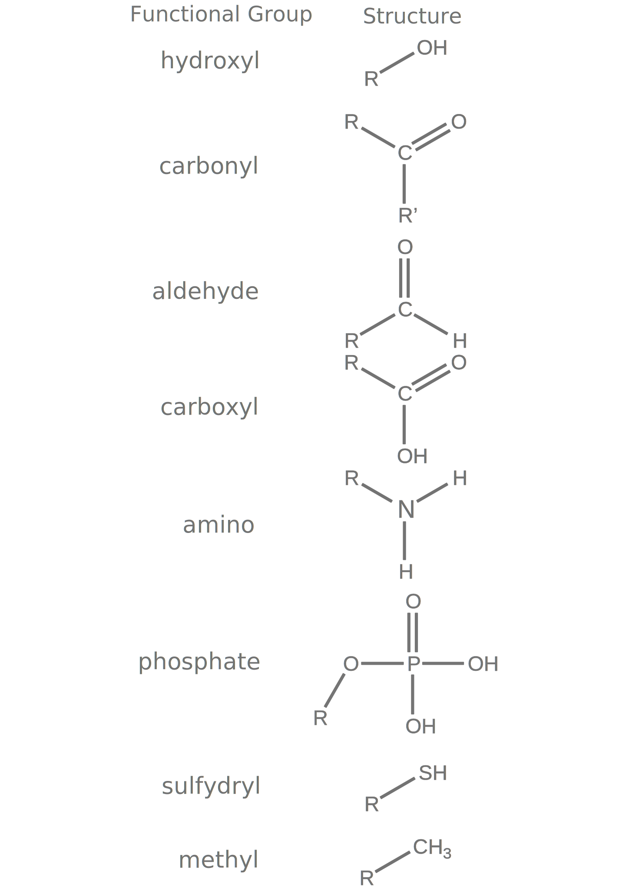
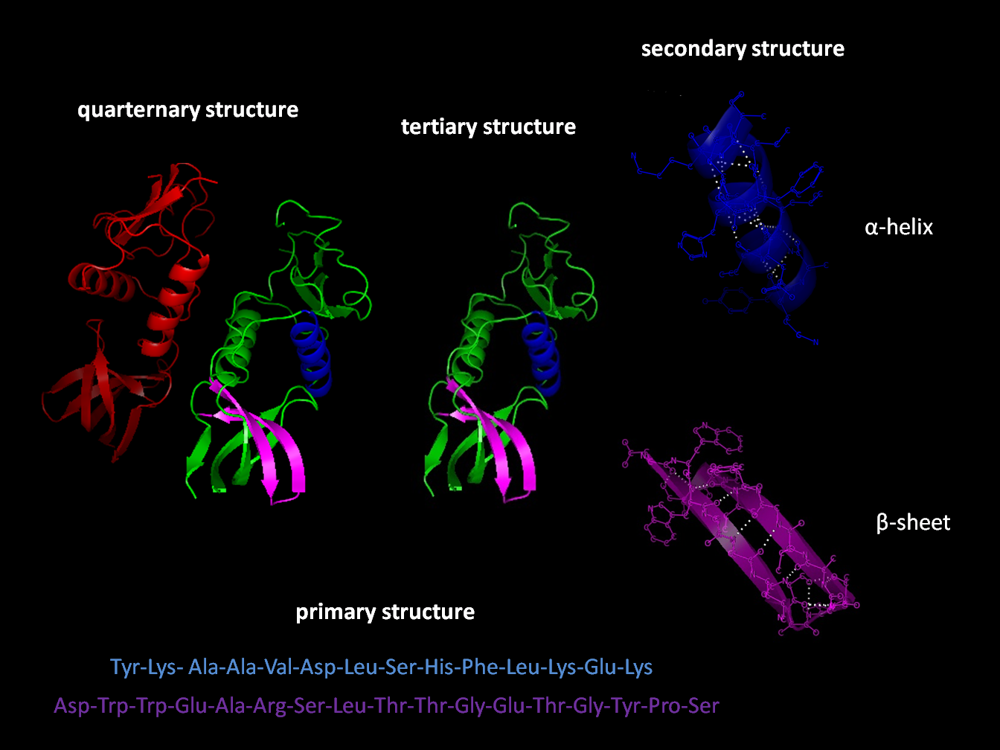

# Basic Organic Chemistry For Biology

[Organic chemistry](https://en.wikipedia.org/wiki/Organic_chemistry) is a branch of chemistry that studies the structure, properties and reactions of organic compounds, which contain carbon in covalent bonding. Study of structure determines their chemical composition and formula. Study of properties includes physical and chemical properties, and evaluation of chemical reactivity to understand their behavior. The study of organic reactions includes the chemical synthesis of natural products, drugs, and polymers, and study of individual organic molecules in the laboratory and via theoretical (in silico) study.

Organic compounds form the basis of all earthly life and constitute the majority of known chemicals. The bonding patterns of carbon, with its valence of four—formal single, double, and triple bonds, plus structures with delocalized electrons—make the array of organic compounds structurally diverse, and their range of applications enormous. They form the basis of, or are constituents of, many commercial products including pharmaceuticals; petrochemicals and agrichemicals, and products made from them including lubricants, solvents; plastics; fuels and explosives. The study of organic chemistry overlaps organometallic chemistry and biochemistry, but also with medicinal chemistry, polymer chemistry, and materials science.

The range of chemicals studied in organic chemistry includes hydrocarbons (compounds containing only carbon and hydrogen) as well as compounds based on carbon, but also containing other elements, especially oxygen, nitrogen, sulfur, phosphorus (included in many biochemicals) and the halogens. 

Before the nineteenth century, chemists generally believed that compounds obtained from living organisms were endowed with a vital force that distinguished them from inorganic compounds. According to the concept of vitalism (vital force theory), organic matter was endowed with a "vital force". During the first half of the nineteenth century, some of the first systematic studies of organic compounds were reported. Around 1816 [Michel Chevreul](https://en.wikipedia.org/wiki/Michel_Eugène_Chevreul) started a study of soaps made from various fats and alkalis. He separated the acids that, in combination with the alkali, produced the soap. Since these were all individual compounds, he demonstrated that it was possible to make a chemical change in various fats (which traditionally come from organic sources), producing new compounds, without "vital force". In 1828 [Friedrich Wöhler](https://en.wikipedia.org/wiki/Friedrich_Wöhler) produced the organic chemical urea (carbamide), a constituent of urine, from inorganic starting materials (the salts potassium cyanate and ammonium sulfate), in what is now called the Wöhler synthesis. Although Wöhler himself was cautious about claiming he had disproved vitalism, this was the first time a substance thought to be organic was synthesized in the laboratory without biological (organic) starting materials. The event is now generally accepted as indeed disproving the doctrine of vitalism.

A crucial breakthrough for organic chemistry was the concept of chemical structure, developed independently in 1858 by both [Friedrich August Kekulé](https://en.wikipedia.org/wiki/August_Kekulé) and [Archibald Scott Couper](https://en.wikipedia.org/wiki/Archibald_Scott_Couper). Both researchers suggested that tetravalent carbon atoms could link to each other to form a carbon lattice, and that the detailed patterns of atomic bonding could be discerned by skillful interpretations of appropriate chemical reactions.

Organic molecules are described commonly by drawings or structural formulas, combinations of drawings and chemical symbols. The line-angle formula is simple and unambiguous. In this system, the endpoints and intersections of each line represent one carbon, and hydrogen atoms can either be notated explicitly or assumed to be present as implied by tetravalent carbon.

(ref:chemform) [This diagram](https://commons.wikimedia.org/wiki/File:Stuctural_drawings_of_butane_854px.jpg)shows 5 different structural representations of the organic compound butane. The left-most structure is a bond-line drawing where the hydrogen atoms are removed. The 2nd structure has the hydrogens added depicted-the dark wedged bonds indicate the hydrogen atoms are coming toward the reader, the hashed bonds indicate the atoms are oriented away from the reader, and the solid (plain) ponds indicate the bonds are in the plane of the screen/paper. The middle structure shows the four carbon atoms. The 4th structure is a representation just showing the atoms and bonds without 3-dimensions. The right-most structure is a condensed structure representation of butane. 

```{r chemstrucrep, fig.cap='(ref:chemform)', echo=FALSE, message=FALSE, warning=FALSE}
knitr::include_graphics("./figures/chemistry/Stuctural_drawings_of_butane_854px.jpg")
```

The era of the pharmaceutical industry began in the last decade of the 19th century when the manufacturing of acetylsalicylic acid—more commonly referred to as aspirin—in Germany was started by Bayer. By 1910 [Paul Ehrlich](https://en.wikipedia.org/wiki/Paul_Ehrlich) and his laboratory group began developing arsenic-based arsphenamine, (Salvarsan), as the first effective medicinal treatment of syphilis, and thereby initiated the medical practice of chemotherapy. Ehrlich popularized the concepts of "magic bullet" drugs and of systematically improving drug therapies. His laboratory made decisive contributions to developing antiserum for diphtheria and standardizing therapeutic serums.

In the early part of the 20th century, polymers and enzymes were shown to be large organic molecules, and petroleum was shown to be of biological origin.

The majority of chemical compounds occurring in biological organisms are carbon compounds, so the association between organic chemistry and biochemistry is so close that biochemistry might be regarded as in essence a branch of organic chemistry. Although the history of biochemistry might be taken to span some four centuries, fundamental understanding of the field only began to develop in the late 19th century and the actual term biochemistry was coined around the start of 20th century.

## Functional groups

The concept of functional groups is central in organic chemistry, both as a means to classify structures and for predicting properties. A functional group is a molecular module, and the reactivity of that functional group is assumed, within limits, to be the same in a variety of molecules. Functional groups can have a decisive influence on the chemical and physical properties of organic compounds. Molecules are classified based on their functional groups. Alcohols, for example, all have the subunit C-O-H. All alcohols tend to be somewhat hydrophilic, usually form esters, and usually can be converted to the corresponding halides. Most functional groups feature heteroatoms (atoms other than C and H). Organic compounds are classified according to functional groups, alcohols, carboxylic acids, amines, etc.

(ref:fgr) Biologically important functional groups. 

```{r fgroups, fig.cap='(ref:fgr)', echo=FALSE, message=FALSE, warning=FALSE}

```

Combining the names of functional groups with the names of the parent alkanes generates what is termed a systematic nomenclature for naming organic compounds. In traditional nomenclature, the first carbon atom after the carbon that attaches to the functional group is called the alpha carbon; the second, beta carbon, the third, gamma carbon, etc. If there is another functional group at a carbon, it may be named with the Greek letter, e.g., the gamma-amine in gamma-aminobutyric acid is on the third carbon of the carbon chain attached to the carboxylic acid group. IUPAC conventions call for numeric labeling of the position, e.g. 4-aminobutanoic acid. In traditional names various qualifiers are used to label isomers, for example, isopropanol (IUPAC name: propan-2-ol) is an isomer of n-propanol (propan-1-ol). The term moiety has some overlap with the term "functional group". However, a moiety is an entire "half" of a molecule, which can be not only a single functional group, but also a larger unit consisting of multiple functional groups. For example, an "aryl moiety" may be any group containing an aromatic ring, regardless of how many functional groups the said aryl has.

```{r functionalgroups, out.width='75%', echo=FALSE, message=FALSE, warning=FALSE}
library(tidyverse)
library(printr)        
library(kableExtra)
setwd("~/Dropbox/R/biology-text-master")

fgroup <-  as_tibble(read.csv("data/functional_groups.csv"))

knitr::kable(fgroup, col.names = c("Chemical class", "Group", "Formula", "Prefix", "Example"), digits = 2, align = 'ccccc', booktabs = TRUE, caption = "Some biologically important functional groups containing oxygen or nitrogen") %>% kable_styling(latex_options = c("striped", "hold_position"))
```

## Biomolecules

A biomolecule or biological molecule is a loosely used term for molecules present in organisms that are essential to one or more typically biological processes, such as cell division, morphogenesis, or development. Biomolecules include large macromolecules (or polyanions) such as proteins, carbohydrates, lipids, and nucleic acids, as well as small molecules such as primary metabolites, secondary metabolites and natural products. A more general name for this class of material is biological materials. Biomolecules are usually endogenous, produced within the organism but organisms usually need exogenous biomolecules, for example certain nutrients, to survive.

Biology and its subfields of biochemistry and molecular biology study biomolecules and their reactions. Most biomolecules are organic compounds, and just four elements—oxygen, carbon, hydrogen, and nitrogen—make up 96% of the human body's mass. But many other elements, such as the various biometals, are present in small amounts.

The uniformity of both specific types of molecules (the biomolecules) and of certain metabolic pathways are invariant features among the wide diversity of life forms; thus these biomolecules and metabolic pathways are referred to as "biochemical universals" or "theory of material unity of the living beings", a unifying concept in biology, along with cell theory and evolution theory.

A macromolecule is a very large molecule, such as protein, commonly composed of the polymerization of smaller subunits called monomers. They are typically composed of thousands of atoms or more. A substance that is composed of macromolecules is called a polymer. The most common macromolecules in biochemistry are biopolymers (nucleic acids, proteins, and carbohydrates) and large non-polymeric molecules (such as lipids and macrocycles), synthetic fibers as well as experimental materials such as carbon nanotubes.

Macromolecules are large molecules composed of thousands of covalently connected atoms. Carbohydrates, lipids, proteins, and nucleic acids are all macromolecules. Macromolecules are formed by many monomers linking together, forming a polymer. Carbohydrates are composed of carbon, oxygen, and hydrogen. The monomer of carbohydrates are monosaccharides. There are three forms of carbohydrates: energy, storage, and structural molecules. A disaccharide is formed when a dehydration reaction joins two monosaccharides. Another type of macromolecules are lipids. Lipids are hydrocarbons that do not form polymers. Fats are constructed from glycerol and fatty acids. Phospholipids are commonly found in the phospholipid bilayer of membranes. They have hydrophilic heads and hydrophopic tails. A protein is another type of macromolecules. Amino acids are the monomers of proteins. Proteins have many different functions. There are proteins that are used for structural support, storage, transport, cellular communication, movement, defense against foreign substances, and more. Nucleic acids transmit and help express hereditary information. They are made up of monomers called nucleotides. Two types of nucleic acids are DNA and RNA.

All living organisms are dependent on three essential biopolymers for their biological functions: DNA, RNA and proteins. Each of these molecules is required for life since each plays a distinct, indispensable role in the cell. The simple summary is that DNA makes RNA, and then RNA makes proteins.

DNA, RNA, and proteins all consist of a repeating structure of related building blocks (nucleotides in the case of DNA and RNA, amino acids in the case of proteins). In general, they are all unbranched polymers, and so can be represented in the form of a string. Indeed, they can be viewed as a string of beads, with each bead representing a single nucleotide or amino acid monomer linked together through covalent chemical bonds into a very long chain.

In most cases, the monomers within the chain have a strong propensity to interact with other amino acids or nucleotides. In DNA and RNA, this can take the form of Watson-Crick base pairs (G-C and A-T or A-U), although many more complicated interactions can and do occur.

```{r biomacromolecules, out.width='75%', echo=FALSE, message=FALSE, warning=FALSE}
library(tidyverse)
library(printr)        
library(kableExtra)
setwd("~/Dropbox/R/biology-text-master")

macromolecules <-  as_tibble(read.csv("data/biomacromolecules.csv"))

#lab_schedule <-  as.tibble(read_excel("data/bio115_fall_schedule.xlsx"))

knitr::kable(macromolecules, col.names = c("Macromolecule (Polymer)", "Building Block (Monomer)", "Joining Bond"), digits = 2, align = 'lll', booktabs = TRUE, caption = "Comparison of the main classes of biological macromolecules.") %>% kable_styling(latex_options = c("striped", "hold_position")) %>% column_spec(1, width = "10em") %>% column_spec(2, width = "10em") %>% column_spec(3, width = "10em") 
```

## Proteins

[Proteins](https://en.wikipedia.org/wiki/Protein) are large biomolecules, or macromolecules, consisting of one or more long chains of amino acid residues. Proteins perform a vast array of functions within organisms, including catalysing metabolic reactions, DNA replication, responding to stimuli, providing structure to cells, and organisms, and transporting molecules from one location to another. Proteins differ from one another primarily in their sequence of amino acids, which is dictated by the nucleotide sequence of their genes, and which usually results in protein folding into a specific 3D structure that determines its activity.

A linear chain of amino acid residues is called a polypeptide. A protein contains at least one long polypeptide. Short polypeptides, containing less than 20–30 residues, are rarely considered to be proteins and are commonly called peptides, or sometimes oligopeptides. The individual amino acid residues are bonded together by peptide bonds and adjacent amino acid residues. The sequence of amino acid residues in a protein is defined by the sequence of a gene, which is encoded in the genetic code. In general, the genetic code specifies 20 standard amino acids; but in certain organisms the genetic code can include selenocysteine and—in certain archaea—pyrrolysine. Shortly after or even during synthesis, the residues in a protein are often chemically modified by post-translational modification, which alters the physical and chemical properties, folding, stability, activity, and ultimately, the function of the proteins. Some proteins have non-peptide groups attached, which can be called prosthetic groups or cofactors. Proteins can also work together to achieve a particular function, and they often associate to form stable protein complexes.

(ref:pepbond) [Chemical structure of the peptide bond (bottom) and the three-dimensional structure of a peptide bond between an alanine and an adjacent amino acid (top/inset). The bond itself is made of the CHON elements.](https://commons.wikimedia.org/wiki/File:Peptide-Figure-Revised.png) 

```{r peptidebond, fig.cap='(ref:pepbond)', echo=FALSE, message=FALSE, warning=FALSE}
knitr::include_graphics("./figures/chemistry/Peptide-Figure-Revised.png")
```

Once formed, proteins only exist for a certain period and are then degraded and recycled by the cell's machinery through the process of protein turnover. A protein's lifespan is measured in terms of its half-life and covers a wide range. They can exist for minutes or years with an average lifespan of 1–2 days in mammalian cells. Abnormal or misfolded proteins are degraded more rapidly either due to being targeted for destruction or due to being unstable.

Like other biological macromolecules such as polysaccharides and nucleic acids, proteins are essential parts of organisms and participate in virtually every process within cells. Many proteins are enzymes that catalyse biochemical reactions and are vital to metabolism. Proteins also have structural or mechanical functions, such as actin and myosin in muscle and the proteins in the cytoskeleton, which form a system of scaffolding that maintains cell shape. Other proteins are important in cell signaling, immune responses, cell adhesion, and the cell cycle. In animals, proteins are needed in the diet to provide the essential amino acids that cannot be synthesized. Digestion breaks the proteins down for use in the metabolism.

Proteins may be purified from other cellular components using a variety of techniques such as ultracentrifugation, precipitation, electrophoresis, and chromatography; the advent of genetic engineering has made possible a number of methods to facilitate purification. Methods commonly used to study protein structure and function include immunohistochemistry, site-directed mutagenesis, X-ray crystallography, nuclear magnetic resonance and mass spectrometry.

Proteins were recognized as a distinct class of biological molecules in the eighteenth century by Antoine Fourcroy and others, distinguished by the molecules' ability to coagulate or flocculate under treatments with heat or acid. Noted examples at the time included albumin from egg whites, blood serum albumin, fibrin, and wheat gluten.

Proteins were first described by the Dutch chemist [Gerardus Johannes Mulder](https://en.wikipedia.org/wiki/Gerardus_Johannes_Mulder) and named by the Swedish chemist [Jöns Jacob Berzelius](https://en.wikipedia.org/wiki/Jöns_Jacob_Berzelius) in 1838. Mulder carried out elemental analysis of common proteins and found that nearly all proteins had the same empirical formula, C~400~H~620~N~100~O~120~P~1~S~1~. He came to the erroneous conclusion that they might be composed of a single type of (very large) molecule. The term "protein" to describe these molecules was proposed by Mulder's associate Berzelius; protein is derived from the Greek word πρώτειος (proteios), meaning "primary", "in the lead", or "standing in front", + *-in*. Mulder went on to identify the products of protein degradation such as the amino acid leucine for which he found a (nearly correct) molecular weight of 131 Da. Prior to "protein", other names were used, like "albumins" or "albuminous materials" (Eiweisskörper, in German).

Early nutritional scientists such as the German [Carl von Voit](https://en.wikipedia.org/wiki/Carl_von_Voit) believed that protein was the most important nutrient for maintaining the structure of the body, because it was generally believed that "flesh makes flesh." [Karl Heinrich Ritthausen](https://en.wikipedia.org/wiki/Karl_Heinrich_Ritthausen) extended known protein forms with the identification of glutamic acid. At the Connecticut Agricultural Experiment Station a detailed review of the vegetable proteins was compiled by [Thomas Burr Osborne](https://en.wikipedia.org/wiki/Thomas_Burr_Osborne_(chemist)). Working with [Lafayette Mendel](https://en.wikipedia.org/wiki/Lafayette_Mendel) and applying [Justus von Liebig's](https://en.wikipedia.org/wiki/Justus_von_Liebig) law of the minimum in feeding laboratory rats, the nutritionally essential amino acids were established. The work was continued and communicated by [William Cumming Rose](https://en.wikipedia.org/wiki/William_Cumming_Rose). The understanding of proteins as polypeptides came through the work of [Franz Hofmeister](https://en.wikipedia.org/wiki/Franz_Hofmeister) and [Hermann Emil Fischer](https://en.wikipedia.org/wiki/Emil_Fischer) in 1902. The central role of proteins as enzymes in living organisms was not fully appreciated until 1926, when [James B. Sumner](https://en.wikipedia.org/wiki/James_B._Sumner) showed that the enzyme urease was in fact a protein.

The difficulty in purifying proteins in large quantities made them very difficult for early protein biochemists to study. Hence, early studies focused on proteins that could be purified in large quantities, e.g., those of blood, egg white, various toxins, and digestive/metabolic enzymes obtained from slaughterhouses. In the 1950s, the Armour Hot Dog Co. purified 1 kg of pure bovine pancreatic ribonuclease A and made it freely available to scientists; this gesture helped ribonuclease A become a major target for biochemical study for the following decades.

[Linus Pauling](https://en.wikipedia.org/wiki/Linus_Pauling) is credited with the successful prediction of regular protein secondary structures based on hydrogen bonding, an idea first put forth by [William Astbury](https://en.wikipedia.org/wiki/William_Astbury) in 1933. Later work by [Walter Kauzmann](https://en.wikipedia.org/wiki/Walter_Kauzmann) on denaturation, based partly on previous studies by [Kaj Linderstrøm-Lang](https://en.wikipedia.org/wiki/Kaj_Ulrik_Linderstrøm-Lang), contributed an understanding of protein folding and structure mediated by hydrophobic interactions.

The first protein to be sequenced was insulin, by [Frederick Sanger](https://en.wikipedia.org/wiki/Frederick_Sanger), in 1949. Sanger correctly determined the amino acid sequence of insulin, thus conclusively demonstrating that proteins consisted of linear polymers of amino acids rather than branched chains, colloids, or cyclols. He won the Nobel Prize for this achievement in 1958.

The first protein structures to be solved were hemoglobin and myoglobin, by [Max Perutz](https://en.wikipedia.org/wiki/Max_Perutz) and [Sir John Cowdery Kendrew](https://en.wikipedia.org/wiki/John_Kendrew), respectively, in 1958. As of 2017, the Protein Data Bank has over 126,060 atomic-resolution structures of proteins. In more recent times, cryo-electron microscopy of large macromolecular assemblies and computational protein structure prediction of small protein domains are two methods approaching atomic resolution.

Most proteins consist of linear polymers built from series of up to 20 different L-α- amino acids. All proteinogenic amino acids possess common structural features, including an α-carbon to which an amino group, a carboxyl group, and a variable side chain are bonded. Only proline differs from this basic structure as it contains an unusual ring to the N-end amine group, which forces the CO–NH amide moiety into a fixed conformation. The side chains of the standard amino acids, detailed in the list of standard amino acids, have a great variety of chemical structures and properties; it is the combined effect of all of the amino acid side chains in a protein that ultimately determines its three-dimensional structure and its chemical reactivity. The amino acids in a polypeptide chain are linked by peptide bonds. Once linked in the protein chain, an individual amino acid is called a residue, and the linked series of carbon, nitrogen, and oxygen atoms are known as the main chain or protein backbone.

The peptide bond has two resonance forms that contribute some double-bond character and inhibit rotation around its axis, so that the alpha carbons are roughly coplanar. The other two dihedral angles in the peptide bond determine the local shape assumed by the protein backbone. The end with a free amino group is known as the N-terminus or amino terminus, whereas the end of the protein with a free carboxyl group is known as the C-terminus or carboxy terminus (the sequence of the protein is written from N-terminus to C-terminus, from left to right).

The words protein, polypeptide, and peptide are a little ambiguous and can overlap in meaning. Protein is generally used to refer to the complete biological molecule in a stable conformation, whereas peptide is generally reserved for a short amino acid oligomers often lacking a stable 3D structure. But the boundary between the two is not well defined and usually lies near 20–30 residues. Polypeptide can refer to any single linear chain of amino acids, usually regardless of length, but often implies an absence of a defined conformation.

Proteins can interact with many types of molecules, including with other proteins, with lipids, with carboyhydrates, and with DNA.

It has been estimated that average-sized bacteria contain about 2 million proteins per cell (e.g. *E. coli* and *Staphylococcus aureus*). Smaller bacteria, such as Mycoplasma or spirochetes contain fewer molecules, on the order of 50,000 to 1 million. By contrast, eukaryotic cells are larger and thus contain much more protein. For instance, yeast cells have been estimated to contain about 50 million proteins and human cells on the order of 1 to 3 billion. The concentration of individual protein copies ranges from a few molecules per cell up to 20 million. Not all genes coding proteins are expressed in most cells and their number depends on, for example, cell type and external stimuli. For instance, of the 20,000 or so proteins encoded by the human genome, only 6,000 are detected in lymphoblastoid cells. Moreover, the number of proteins the genome encodes correlates well with the organism complexity. Eukaryotes have 15,000, bacteria have 3,200, archaea have 2,400, and viruses have 42 proteins on average coded in their respective genomes.

Proteins are assembled from amino acids using information encoded in genes. Each protein has its own unique amino acid sequence that is specified by the nucleotide sequence of the gene encoding this protein. The genetic code is a set of three-nucleotide sets called codons and each three-nucleotide combination designates an amino acid, for example AUG (adenine–uracil–guanine) is the code for methionine. Because DNA contains four nucleotides, the total number of possible codons is 64; hence, there is some redundancy in the genetic code, with some amino acids specified by more than one codon. Genes encoded in DNA are first transcribed into pre-messenger RNA (mRNA) by proteins such as RNA polymerase. Most organisms then process the pre-mRNA (also known as a primary transcript) using various forms of Post-transcriptional modification to form the mature mRNA, which is then used as a template for protein synthesis by the ribosome. In prokaryotes the mRNA may either be used as soon as it is produced, or be bound by a ribosome after having moved away from the nucleoid. In contrast, eukaryotes make mRNA in the cell nucleus and then translocate it across the nuclear membrane into the cytoplasm, where protein synthesis then takes place. The rate of protein synthesis is higher in prokaryotes than eukaryotes and can reach up to 20 amino acids per second.

The process of synthesizing a protein from an mRNA template is known as translation. The mRNA is loaded onto the ribosome and is read three nucleotides at a time by matching each codon to its base pairing anticodon located on a transfer RNA molecule, which carries the amino acid corresponding to the codon it recognizes. The enzyme aminoacyl tRNA synthetase "charges" the tRNA molecules with the correct amino acids. The growing polypeptide is often termed the nascent chain. Proteins are always biosynthesized from N-terminus to C-terminus.

The size of a synthesized protein can be measured by the number of amino acids it contains and by its total molecular mass, which is normally reported in units of daltons (synonymous with atomic mass units), or the derivative unit kilodalton (kDa). The average size of a protein increases from Archaea to Bacteria to Eukaryote (283, 311, 438 residues and 31, 34, 49 kDa respectively) due to a bigger number of protein domains constituting proteins in higher organisms. For instance, yeast proteins are on average 466 amino acids long and 53 kDa in mass. The largest known proteins are the titins, a component of the muscle sarcomere, with a molecular mass of almost 3,000 kDa and a total length of almost 27,000 amino acids.

### Structure

Most proteins fold into unique 3D structures. The shape into which a protein naturally folds is known as its native conformation. Although many proteins can fold unassisted, simply through the chemical properties of their amino acids, others require the aid of molecular chaperones to fold into their native states. Biochemists often refer to four distinct aspects of a protein's structure:

* Primary structure: the amino acid sequence. A protein is a polyamide.
* Secondary structure: regularly repeating local structures stabilized by hydrogen bonds. The most common examples are the α-helix, β-sheet and turns. Because secondary structures are local, many regions of different secondary structure can be present in the same protein molecule.
* Tertiary structure: the overall shape of a single protein molecule; the spatial relationship of the secondary structures to one another. Tertiary structure is generally stabilized by nonlocal interactions, most commonly the formation of a hydrophobic core, but also through salt bridges, hydrogen bonds, disulfide bonds, and even posttranslational modifications. The term "tertiary structure" is often used as synonymous with the term fold. The tertiary structure is what controls the basic function of the protein.
* Quaternary structure: the structure formed by several protein molecules (polypeptide chains), usually called protein subunits in this context, which function as a single protein complex.
* Quinary structure: the signatures of protein surface that organize the crowded cellular interior. Quinary structure is dependent on transient, yet essential, macromolecular interactions that occur inside living cells.

(ref:protstruc) [The amino-acid sequence, the primary structure of a protein, determines the secondary (α-helix and β-sheet), tertiary and quaternary protein structures](https://commons.wikimedia.org/wiki/File:Protein_structure.png)

```{r proteinstructure, fig.cap='(ref:protstruc)', echo=FALSE, message=FALSE, warning=FALSE}

```

Proteins are not entirely rigid molecules. In addition to these levels of structure, proteins may shift between several related structures while they perform their functions. In the context of these functional rearrangements, these tertiary or quaternary structures are usually referred to as "conformations", and transitions between them are called conformational changes. Such changes are often induced by the binding of a substrate molecule to an enzyme's active site, or the physical region of the protein that participates in chemical catalysis. In solution proteins also undergo variation in structure through thermal vibration and the collision with other molecules.


Proteins can be informally divided into three main classes, which correlate with typical tertiary structures: globular proteins, fibrous proteins, and membrane proteins. Almost all globular proteins are soluble and many are enzymes. Fibrous proteins are often structural, such as collagen, the major component of connective tissue, or keratin, the protein component of hair and nails. Membrane proteins often serve as receptors or provide channels for polar or charged molecules to pass through the cell membrane.

A special case of intramolecular hydrogen bonds within proteins, poorly shielded from water attack and hence promoting their own dehydration, are called dehydrons.

Many proteins are composed of several protein domains, i.e. segments of a protein that fold into distinct structural units. Domains usually also have specific functions, such as enzymatic activities (e.g. kinase) or they serve as binding modules (e.g. the SH3 domain binds to proline-rich sequences in other proteins).

Short amino acid sequences within proteins often act as recognition sites for other proteins. For instance, SH3 domains typically bind to short PxxP motifs (i.e. 2 prolines [P], separated by two unspecified amino acids [x], although the surrounding amino acids may determine the exact binding specificity). Many such motifs has been collected in the Eukaryotic Linear Motif (ELM) database.

### Cellular Functions of Proteins

Proteins are the chief actors within the cell, said to be carrying out the duties specified by the information encoded in genes. With the exception of certain types of RNA, most other biological molecules are relatively inert elements upon which proteins act. Proteins make up half the dry weight of an Escherichia coli cell, whereas other macromolecules such as DNA and RNA make up only 3% and 20%, respectively. The set of proteins expressed in a particular cell or cell type is known as its proteome.


The chief characteristic of proteins that also allows their diverse set of functions is their ability to bind other molecules specifically and tightly. The region of the protein responsible for binding another molecule is known as the binding site and is often a depression or "pocket" on the molecular surface. This binding ability is mediated by the tertiary structure of the protein, which defines the binding site pocket, and by the chemical properties of the surrounding amino acids' side chains. Protein binding can be extraordinarily tight and specific; for example, the ribonuclease inhibitor protein binds to human angiogenin with a sub-femtomolar dissociation constant (<10−15 M) but does not bind at all to its amphibian homolog onconase (>1 M). Extremely minor chemical changes such as the addition of a single methyl group to a binding partner can sometimes suffice to nearly eliminate binding; for example, the aminoacyl tRNA synthetase specific to the amino acid valine discriminates against the very similar side chain of the amino acid isoleucine.

Proteins can bind to other proteins as well as to small-molecule substrates. When proteins bind specifically to other copies of the same molecule, they can oligomerize to form fibrils; this process occurs often in structural proteins that consist of globular monomers that self-associate to form rigid fibers. Protein–protein interactions also regulate enzymatic activity, control progression through the cell cycle, and allow the assembly of large protein complexes that carry out many closely related reactions with a common biological function. Proteins can also bind to, or even be integrated into, cell membranes. The ability of binding partners to induce conformational changes in proteins allows the construction of enormously complex signaling networks. As interactions between proteins are reversible, and depend heavily on the availability of different groups of partner proteins to form aggregates that are capable to carry out discrete sets of function, study of the interactions between specific proteins is a key to understand important aspects of cellular function, and ultimately the properties that distinguish particular cell types.

The best-known role of proteins in the cell is as enzymes, which catalyse chemical reactions. Enzymes are usually highly specific and accelerate only one or a few chemical reactions. Enzymes carry out most of the reactions involved in metabolism, as well as manipulating DNA in processes such as DNA replication, DNA repair, and transcription. Some enzymes act on other proteins to add or remove chemical groups in a process known as posttranslational modification. About 4,000 reactions are known to be catalysed by enzymes. The rate acceleration conferred by enzymatic catalysis is often enormous—as much as 1017-fold increase in rate over the uncatalysed reaction in the case of orotate decarboxylase (78 million years without the enzyme, 18 milliseconds with the enzyme).

The molecules bound and acted upon by enzymes are called substrates. Although enzymes can consist of hundreds of amino acids, it is usually only a small fraction of the residues that come in contact with the substrate, and an even smaller fraction—three to four residues on average—that are directly involved in catalysis. The region of the enzyme that binds the substrate and contains the catalytic residues is known as the active site.

Dirigent proteins are members of a class of proteins that dictate the stereochemistry of a compound synthesized by other enzymes.

### Cell Signaling And Ligand Binding

Many proteins are involved in the process of cell signaling and signal transduction. Some proteins, such as insulin, are extracellular proteins that transmit a signal from the cell in which they were synthesized to other cells in distant tissues. Others are membrane proteins that act as receptors whose main function is to bind a signaling molecule and induce a biochemical response in the cell. Many receptors have a binding site exposed on the cell surface and an effector domain within the cell, which may have enzymatic activity or may undergo a conformational change detected by other proteins within the cell.

Antibodies are protein components of an adaptive immune system whose main function is to bind antigens, or foreign substances in the body, and target them for destruction. Antibodies can be secreted into the extracellular environment or anchored in the membranes of specialized B cells known as plasma cells. Whereas enzymes are limited in their binding affinity for their substrates by the necessity of conducting their reaction, antibodies have no such constraints. An antibody's binding affinity to its target is extraordinarily high.

Many ligand transport proteins bind particular small biomolecules and transport them to other locations in the body of a multicellular organism. These proteins must have a high binding affinity when their ligand is present in high concentrations, but must also release the ligand when it is present at low concentrations in the target tissues. The canonical example of a ligand-binding protein is haemoglobin, which transports oxygen from the lungs to other organs and tissues in all vertebrates and has close homologs in every biological kingdom. Lectins are sugar-binding proteins which are highly specific for their sugar moieties. Lectins typically play a role in biological recognition phenomena involving cells and proteins. Receptors and hormones are highly specific binding proteins.

Transmembrane proteins can also serve as ligand transport proteins that alter the permeability of the cell membrane to small molecules and ions. The membrane alone has a hydrophobic core through which polar or charged molecules cannot diffuse. Membrane proteins contain internal channels that allow such molecules to enter and exit the cell. Many ion channel proteins are specialized to select for only a particular ion; for example, potassium and sodium channels often discriminate for only one of the two ions.

### Structural Proteins

Structural proteins confer stiffness and rigidity to otherwise-fluid biological components. Most structural proteins are fibrous proteins; for example, collagen and elastin are critical components of connective tissue such as cartilage, and keratin is found in hard or filamentous structures such as hair, nails, feathers, hooves, and some animal shells. Some globular proteins can also play structural functions, for example, actin and tubulin are globular and soluble as monomers, but polymerize to form long, stiff fibers that make up the cytoskeleton, which allows the cell to maintain its shape and size.

Other proteins that serve structural functions are motor proteins such as myosin, kinesin, and dynein, which are capable of generating mechanical forces. These proteins are crucial for cellular motility of single celled organisms and the sperm of many multicellular organisms which reproduce sexually. They also generate the forces exerted by contracting muscles and play essential roles in intracellular transport.

## Carbohydrates

A [carbohydrate](https://en.wikipedia.org/wiki/Carbohydrate) is a biomolecule consisting of carbon (C), hydrogen (H) and oxygen (O) atoms, usually with a hydrogen–oxygen atom ratio of 2:1 (as in water) and thus with the empirical formula C~m~(H~2~O)~n~ (where m may be different from n). This formula holds true for monosaccharides. Some exceptions exist; for example, deoxyribose, a sugar component of DNA, has the empirical formula C~5~H~10~O~4~. The carbohydrates are technically hydrates of carbon; structurally it is more accurate to view them asaldoses and ketoses.

The term is most common in biochemistry, where it is a synonym of saccharide, a group that includes sugars, starch, and cellulose. The saccharides are divided into four chemical groups: monosaccharides, disaccharides, oligosaccharides, and polysaccharides. Monosaccharides and disaccharides, the smallest (lower molecular weight) carbohydrates, are commonly referred to as sugars. The word saccharide comes from the Greek word σάκχαρον (sákkharon), meaning "sugar". While the scientific nomenclature of carbohydrates is complex, the names of the monosaccharides and disaccharides very often end in the suffix -ose, as in the monosaccharides fructose (fruit sugar) and glucose (starch sugar) and the disaccharides sucrose (cane or beet sugar) and lactose (milk sugar).

(ref:sucrose) [The disaccharide sucrose](https://commons.wikimedia.org/wiki/File:Beta-D-Lactose.svg) 

```{r sucrosestruc, fig.cap='(ref:sucrose)', echo=FALSE, message=FALSE, warning=FALSE}
knitr::include_graphics("./figures/chemistry/Saccharose2.svg")
```

Carbohydrates perform numerous roles in living organisms. Polysaccharides serve for the storage of energy (e.g. starch and glycogen) and as structural components (e.g. cellulose in plants and chitin in arthropods). The 5-carbon monosaccharide ribose is an important component of coenzymes (e.g. ATP, FAD and NAD) and the backbone of the genetic molecule known as RNA. The related deoxyribose is a component of DNA. Saccharides and their derivatives include many other important biomolecules that play key roles in the immune system, fertilization, preventing pathogenesis, blood clotting, and development.

They are found in a wide variety of natural and processed foods. Starch is a polysaccharide. It is abundant in cereals (wheat, maize, rice), potatoes, and processed food based on cereal flour, such as bread, pizza or pasta. Sugars appear in human diet mainly as table sugar (sucrose, extracted from sugarcane or sugar beets), lactose (abundant in milk), glucose and fructose, both of which occur naturally in honey, many fruits, and some vegetables. Table sugar, milk, or honey are often added to drinks and many prepared foods such as jam, biscuits and cakes.

Cellulose, a polysaccharide found in the cell walls of all plants, is one of the main components of insoluble dietary fiber. Although it is not digestible, insoluble dietary fiber helps to maintain a healthy digestive system by easing defecation. Other polysaccharides contained in dietary fiber include resistant starch and inulin, which feed some bacteria in the microbiota of the large intestine, and are metabolized by these bacteria to yield short-chain fatty acids. 

In scientific literature, the term "carbohydrate" has many synonyms, like "sugar" (in the broad sense), "saccharide", "ose", "glucide", "hydrate of carbon" or "polyhydroxy compounds with aldehyde or ketone". Some of these terms, specially "carbohydrate" and "sugar", are also used with other meanings.

Formerly the name "carbohydrate" was used in chemistry for any compound with the formula C~m~ (H~2~O)~n~. Following this definition, some chemists considered formaldehyde (CH~2~O) to be the simplest carbohydrate, while others claimed that title for glycolaldehyde. Today, the term is generally understood in the biochemistry sense, which excludes compounds with only one or two carbons and includes many biological carbohydrates which deviate from this formula. For example, while the above representative formulas would seem to capture the commonly known carbohydrates, ubiquitous and abundant carbohydrates often deviate from this. For example, carbohydrates often display chemical groups such as: N-acetyl (e.g. chitin), sulphate (e.g. glycosaminoglycans), carboxylic acid (e.g. sialic acid) and deoxy modifications (e.g. fucose and sialic acid).

Natural saccharides are generally built of simple carbohydrates called monosaccharides with general formula (CH~2~O)~n~ where n is three or more. A typical monosaccharide has the structure H–(CHOH)~x~(C=O)–(CHOH)~y~–H, that is, an aldehyde or ketone with many hydroxyl groups added, usually one on each carbon atom that is not part of the aldehyde or ketone functional group. Examples of monosaccharides are glucose, fructose, and glyceraldehydes. However, some biological substances commonly called "monosaccharides" do not conform to this formula (e.g. uronic acids and deoxy-sugars such as fucose) and there are many chemicals that do conform to this formula but are not considered to be monosaccharides (e.g. formaldehyde CH~2~O and inositol (CH~2~O)~6~).

The open-chain form of a monosaccharide often coexists with a closed ring form where the aldehyde/ketone carbonyl group carbon (C=O) and hydroxyl group (–OH) react forming a hemiacetal with a new C–O–C bridge.

Monosaccharides can be linked together into what are called polysaccharides (or oligosaccharides) in a large variety of ways. Many carbohydrates contain one or more modified monosaccharide units that have had one or more groups replaced or removed. For example, deoxyribose, a component of DNA, is a modified version of ribose; chitin is composed of repeating units of N-acetyl glucosamine, a nitrogen-containing form of glucose.

Monosaccharides are the simplest carbohydrates in that they cannot be hydrolyzed to smaller carbohydrates. They are aldehydes or ketones with two or more hydroxyl groups. The general chemical formula of an unmodified monosaccharide is (CH~2~O)~n~, literally a "carbon hydrate". Monosaccharides are important fuel molecules as well as building blocks for nucleic acids. The smallest monosaccharides, for which n=3, are dihydroxyacetone and D- and L-glyceraldehydes.

Monosaccharides are the major fuel source for metabolism, being used both as an energy source (glucose being the most important in nature) and in biosynthesis. When monosaccharides are not immediately needed by many cells, they are often converted to more space-efficient forms, often polysaccharides. In many animals, including humans, this storage form is glycogen, especially in liver and muscle cells. In plants, starch is used for the same purpose. The most abundant carbohydrate, cellulose, is a structural component of the cell wall of plants and many forms of algae. Ribose is a component of RNA. Deoxyribose is a component of DNA. Lyxose is a component of lyxoflavin found in the human heart. Ribulose and xylulose occur in the pentose phosphate pahway. Galactose, a component of milk sugar lactose, is found in galactolipids in plant cell membranes and in glycoproteins in many tissues. Mannose occurs in human metabolism, especially in the glycosylation of certain proteins. Fructose, or fruit sugar, is found in many plants and humans, it is metabolized in the liver, absorbed directly into the intestines during digestion, and found in semen. Trehalose, a major sugar of insects, is rapidly hydrolyzed into two glucose molecules to support continuous flight.

Two joined monosaccharides are called a disaccharide and these are the simplest polysaccharides. Examples include sucrose and lactose. They are composed of two monosaccharide units bound together by a covalent bond known as a glycosidic linkage formed via a dehydration reaction, resulting in the loss of a hydrogen atom from one monosaccharide and a hydroxyl group from the other. The formula of unmodified disaccharides is C~12~H~22~O~11. Although there are numerous kinds of disaccharides, a handful of disaccharides are particularly notable.

* Its monosaccharides: glucose and fructose
* Their ring types: glucose is a pyranose and fructose is a furanose
* How they are linked together: the oxygen on carbon number 1 (C1) of α-D-glucose is linked to the C2 of D-fructose.
* The -oside suffix indicates that the anomeric carbon of both monosaccharides participates in the glycosidic bond.
        
Lactose, a disaccharide composed of one D-galactose molecule and one D-glucose molecule, occurs naturally in mammalian milk. The systematic name for lactose is O-β-D-galactopyranosyl-(1→4)-D-glucopyranose. Other notable disaccharides include maltose (two D-glucoses linked α-1,4) and cellulobiose (two D-glucoses linked β-1,4). Disaccharides can be classified into two types: reducing and non-reducing disaccharides. If the functional group is present in bonding with another sugar unit, it is called a reducing disaccharide or biose. 

(ref:lactose) [The disaccharide lactose](https://commons.wikimedia.org/wiki/File:Beta-D-Lactose.svg) 

```{r lactosestruc, fig.cap='(ref:lactose)', echo=FALSE, message=FALSE, warning=FALSE}
knitr::include_graphics("./figures/chemistry/Beta-D-Lactose.svg")
```

## Lipids

In biology and biochemistry, a [lipid](https://en.wikipedia.org/wiki/Lipid) is a macrobiomolecule that is soluble in nonpolar solvents. Non-polar solvents are typically hydrocarbons used to dissolve other naturally occurring hydrocarbon lipid molecules that do not (or do not easily) dissolve in water, including fatty acids, waxes, sterols, fat-soluble vitamins (such as vitamins A, D, E, and K), monoglycerides, diglycerides, triglycerides, and phospholipids.

(ref:comlip) [Structures of some common lipids.](https://commons.wikimedia.org/wiki/File:Common_lipids_lmaps.png) At the top are cholesterol and oleic acid. The middle structure is a triglyceride composed of oleoyl, stearoyl, and palmitoyl chains attached to a glycerol backbone. At the bottom is the common phospholipid phosphatidylcholine.

```{r commonlipids, fig.cap='(ref:comlip)', echo=FALSE, message=FALSE, warning=FALSE}
knitr::include_graphics("./figures/chemistry/Lipids.svg")
```

The functions of lipids include storing energy, signaling, and acting as structural components of cell membranes. Lipids have applications in the cosmetic and food industries as well as in nanotechnology.

Scientists sometimes define lipids as hydrophobic or amphiphilic small molecules; the amphiphilic nature of some lipids allows them to form structures such as vesicles, multilamellar/unilamellar liposomes, or membranes in an aqueous environment. Biological lipids originate entirely or in part from two distinct types of biochemical subunits or "building-blocks": ketoacyl and isoprene groups. Using this approach, lipids may be divided into eight categories: fatty acids, glycerolipids, glycerophospholipids, sphingolipids, saccharolipids, and polyketides (derived from condensation of ketoacyl subunits); and sterol lipids and prenol lipids (derived from condensation of isoprene subunits).

Although the term "lipid" is sometimes used as a synonym for fats, fats are a subgroup of lipids called triglycerides. Lipids also encompass molecules such as fatty acids and their derivatives (including tri-, di-, monoglycerides, and phospholipids), as well as other sterol-containing metabolites such as cholesterol. Although humans and other mammals use various biosynthetic pathways both to break down and to synthesize lipids, some essential lipids can't be made this way and must be obtained from the diet.

Lipid may be regarded as organic substances relatively insoluble in water, soluble in organic solvents(alcohol, ether etc.) actually or potentially related to fatty acid and utilized by the living cells.

In 1815, Henri Braconnot classified lipids (graisses) in two categories, suifs (solid greases or tallow) and huiles (fluid oils). In 1823, Michel Eugène Chevreul developed a more detailed classification, including oils, greases, tallow, waxes, resins, balsams and volatile oils (or essential oils).

In 1827, William Prout recognized fat ("oily" alimentary matters), along with protein ("albuminous") and carbohydrate ("saccharine"), as an important nutrient for humans and animals.

The word "lipide" , which stems etymologically from the Greek lipos (fat), was introduced in 1923 by the french pharmacologist [Gabriel Bertrand](https://en.wikipedia.org/wiki/Gabriel_Bertrand). Bertrands included in the concept not only the traditional fats (glycerides), but also the "lipoids", with a complex constitution. Despite the word "lipide" was unanimously approved by the international commission of Société de Chimie Biologique during the plenary session on the 3rd of July 1923. The word "lipide" has been later anglicized as "lipid" because of its pronunciation ('lɪpɪd). In the french language, the suffixe "-ide", from the ancient greek "-ίδης" (meaning 'son of' or 'descendant of'), is always pronounced (ɪd).

In 1947, T. P. Hilditch divided lipids into "simple lipids", with greases and waxes (true waxes, sterols, alcohols).

Fatty acids, or fatty acid residues when they are part of a lipid, are a diverse group of molecules synthesized by chain-elongation of an acetyl-CoA primer with malonyl-CoA or methylmalonyl-CoA groups in a process called fatty acid synthesis. They are made of a hydrocarbon chain that terminates with a carboxylic acid group; this arrangement confers the molecule with a polar, hydrophilic end, and a nonpolar, hydrophobic end that is insoluble in water. The fatty acid structure is one of the most fundamental categories of biological lipids and is commonly used as a building-block of more structurally complex lipids. The carbon chain, typically between four and 24 carbons long, may be saturated or unsaturated, and may be attached to functionalgroups containing oxygen, halogens, nitrogen, and sulfur. If a fatty acid contains a double bond, there is the possibility of either a cis or trans geometric isomerism, which significantly affects the molecule's configuration. Cis-double bonds cause the fatty acid chain to bend, an effect that is compounded with more double bonds in the chain. Three double bonds in 18-carbon linolenic acid, the most abundant fatty-acyl chains of plant thylakoid membranes, render these membranes highly fluid despite environmental low-temperatures, and also makes linolenic acid give dominating sharp peaks in high resolution 13-C NMR spectra of chloroplasts. This in turn plays an important role in the structure and function of cell membranes. Most naturally occurring fatty acids are of the cis configuration, although the trans form does exist in some natural and partially hydrogenated fats and oils.

Examples of biologically important fatty acids include the eicosanoids, derived primarily from arachidonic acid and eicosapentaenoic acid, that include prostaglandins, leukotrienes, and thromboxanes. Docosahexaenoic acid is also important in biological systems, particularly with respect to sight. Other major lipid classes in the fatty acid category are the fatty esters and fatty amides. Fatty esters include important biochemical intermediates such as wax esters, fatty acid thioester coenzyme A derivatives, fatty acid thioester ACP derivatives and fatty acid carnitines. The fatty amides include N-acyl ethanolamines, such as the cannabinoid neurotransmitter anandamide. 

Sterols, such as cholesterol and its derivatives, are an important component of membrane lipids, along with the glycerophospholipids and sphingomyelins. Other examples of sterols are the bile acids and their conjugates, which in mammals are oxidized derivatives of cholesterol and are synthesized in the liver. The plant equivalents are the phytosterols, such as β-sitosterol, stigmasterol, and brassicasterol; the latter compound is also used as a biomarker for algal growth. The predominant sterol in fungal cell membranes is ergosterol.

Sterols are steroids in which one of the hydrogen atoms is substituted with a hydroxyl group, at position 3 in the carbon chain. They have in common with steroids the same fused four-ring core structure. teroids have different biological roles as hormones and signaling molecules. The eighteen-carbon (C~18~) steroids include the estrogen family whereas the C19 steroids comprise the androgens such as testosterone and androsterone. The C~21~ subclass includes the progestogens as well as the glucocorticoids and mineralocorticoids. The secosteroids, comprising various forms of vitamin D, are characterized by cleavage of the B ring of the core structure.

Eukaryotic cells feature the compartmentalized membrane-bound organelles that carry out different biological functions. The glycerophospholipids are the main structural component of biological membranes, as the cellular plasma membrane and the intracellular membranes of organelles; in animal cells, the plasma membrane physically separates the intracellular components from the extracellular environment. The glycerophospholipids are amphipathic molecules (containing both hydrophobic and hydrophilic regions) that contain a glycerol core linked to two fatty acid-derived "tails" by ester linkages and to one "head" group by a phosphate ester linkage. While glycerophospholipids are he major component of biological membranes, other non-glyceride lipid components such as sphingomyelin and sterols (mainly cholesterol in animal cell membranes) are also found in biological membranes. In plants and algae, the galactosyldiacylglycerols, and sulfoquinovosyldiacylglycerol, which lack a phosphate group, are important components of membranes of chloroplasts and related organelles and are the most abundant lipids in photosynthetic tissues, including those of higher plants, algae and certain bacteria.

Plant thylakoid membranes have the largest lipid component of a non-bilayer forming monogalactosyl diglyceride (MGDG), and little phospholipids; despite this unique lipid composition, chloroplast thylakoid membranes have been shown to contain a dynamic lipid-bilayer matrix as revealed by magnetic resonance and electron microscope studies.

A biological membrane is a form of lamellar phase lipid bilayer. The formation of lipid bilayers is an energetically preferred process when the glycerophospholipids described above are in an aqueous environment. This is known as the hydrophobic effect. In an aqueous system, the polar heads of lipids align towards the polar, aqueous environment, while the hydrophobic tails minimize their contact with water and tend to cluster together, forming a vesicle; depending on the concentration of the lipid, this biophysical interaction may result in the formation of micelles, liposomes, or lipid bilayers. Other aggregations are also observed and form part of the polymorphism of amphiphile (lipid) behavior. Micelles and bilayers form in the polar medium by a process known as the hydrophobic effect. When dissolving a lipophilic or amphiphilic substance in a polar environment, the polar molecules (i.e., water in an aqueous solution) become more ordered around the dissolved lipophilic substance, since the polar molecules cannot form hydrogen bonds to the lipophilic areas of the amphiphile. So in an aqueous environment, the water molecules form an ordered "clathrate" cage around the dissolved lipophilic molecule.

The formation of lipids into protocell membranes represents a key step in models of abiogenesis, the origin of life.

Triglycerides, stored in adipose tissue, are a major form of energy storage both in animals and plants. They are a major source of energy because carbohydrates are fully reduced structures. In comparison to glycogen which would contribute only half of the energy per its pure mass, triglyceride carbons are all bonded to hydrogens, unlike in carbohydrates. The adipocyte, or fat cell, is designed for continuous synthesis and breakdown of triglycerides in animals, with breakdown controlled mainly by the activation of hormone-sensitive enzyme lipase. The complete oxidation of fatty acids provides high caloric content, about 38 kJ/g (9 kcal/g), compared with 17 kJ/g (4 kcal/g) for the breakdown of carbohydrates and proteins. Migratory birds that must fly long distances without eating use stored energy of triglycerides to fuel their flights.

(ref:triglyceride) [Example of an unsaturated fat triglyceride](https://commons.wikimedia.org/wiki/File:Fat_triglyceride_shorthand_formula.PNG) (C~55~H~98~O~6~). Left part: glycerol; right part, from top to bottom: palmitic acid, oleic acid, alpha-linolenic acid.

```{r simpletriglyceride, fig.cap='(ref:triglyceride)', echo=FALSE, message=FALSE, warning=FALSE}
knitr::include_graphics("./figures/chemistry/simple_triglyceride.svg")
```

In recent years, evidence has emerged showing that lipid signaling is a vital part of the cell signaling. Lipid signaling may occur via activation of G protein-coupled or nuclear receptors, and members of several different lipid categories have been identified as signaling molecules and cellular messengers. These include sphingosine-1-phosphate, a sphingolipid derived from ceramide that is a potent messenger molecule involved in regulating calcium mobilization, cell growth, and apoptosis; diacylglycerol (DAG) and the phosphatidylinositol phosphates (PIPs), involved in calcium-mediated activation of protein kinase C; the prostaglandins, which are one type of fatty-acid derived eicosanoid involved in inflammation and immunity; the steroid hormones such as estrogen, testosterone and cortisol, which modulate a host of functions such as reproduction, metabolism and blood pressure; and the oxysterols such as 25-hydroxy-cholesterol that are liver X receptor agonists. Phosphatidylserine lipids are known to be involved in signaling for the phagocytosis of apoptotic cells or pieces of cells. They accomplish this by being exposed to the extracellular face of the cell membrane after the inactivation of flippases which place them exclusively on the cytosolic side and the activation of scramblases, which scramble the orientation of the phospholipids. After this occurs, other cells recognize the phosphatidylserines and phagocytosize the cells or cell fragments exposing them.

The "fat-soluble" vitamins (A, D, E and K) – which are isoprene-based lipids – are essential nutrients stored in the liver and fatty tissues, with a diverse range of functions. Acyl-carnitines are involved in the transport and metabolism of fatty acids in and out of mitochondria, where they undergo beta oxidation. Polyprenols and their phosphorylated derivatives also play important transport roles, in this case the transport of oligosaccharides across membranes. Polyprenol phosphate sugars and polyprenol diphosphate sugars function in extra-cytoplasmic glycosylation reactions, in extracellular polysaccharide biosynthesis (for instance, peptidoglycan polymerization in bacteria), and in eukaryotic protein N-glycosylation. Cardiolipins are a subclass of glycerophospholipids containing four acyl chains and three glycerol groups that are particularly abundant in the inner mitochondrial membrane. They are believed to activate enzymes involved with oxidative phosphorylation. Lipids also form the basis of steroid hormones.

## Nucleic Acids

Nucleic acids are the biopolymers, or large biomolecules, essential to all known forms of life. The term nucleic acid is the overall name for DNA and RNA. They are composed of nucleotides, which are the monomers made of three components: a 5-carbon sugar, a phosphate group and a nitrogenous base. If the sugar is a compound ribose, the polymer is RNA (ribonucleic acid); if the sugar is derived from ribose as deoxyribose, the polymer is DNA (deoxyribonucleic acid).

Nucleic acids are the most important of all biomolecules. These are found in abundance in all living things, where they function to create and encode and then store information of every living cell of every life-form organism on Earth. In turn, they function to transmit and express that information inside and outside the cell nucleus—to the interior operations of the cell and ultimately to the next generation of each living organism. The encoded information is contained and conveyed via the nucleic acid sequence, which provides the 'ladder-step' ordering of nucleotides within the molecules of RNA and DNA.

Strings of nucleotides are bonded to form helical backbones—typically, one for RNA, two for DNA—and assembled into chains of base-pairs selected from the five primary, or canonical, nucleobases, which are: adenine, cytosine, guanine, thymine, and uracil. Thymine occurs only in DNA and uracil only in RNA. Using amino acids and the process known as protein synthesis, the specific sequencing in DNA of these nucleobase-pairs enables storing and transmitting coded instructions as genes. In RNA, base-pair sequencing provides for manufacturing new proteins that determine the frames and parts and most chemical processes of all life forms

The term nucleic acid is the overall name for DNA and RNA, members of a family of biopolymers, and is synonymous with polynucleotide. Nucleic acids were named for their initial discovery within the nucleus, and for the presence of phosphate groups (related to phosphoric acid). Although first discovered within the nucleus of eukaryotic cells, nucleic acids are now known to be found in all life forms including within bacteria, archaea, mitochondria, chloroplasts, and viruses. All living cells contain both DNA and RNA (except some cells such as mature red blood cells), while viruses contain either DNA or RNA, but usually not both. The basic component of biological nucleic acids is the nucleotide, each of which contains a pentose sugar (ribose or deoxyribose), a phosphate group, and a nucleobase. Nucleic acids are also generated within the laboratory, through the use of enzymes (DNA and RNA polymerases) and by solid-phase chemical synthesis. The chemical methods also enable the generation of altered nucleic acids that are not found in nature, for example peptide nucleic acids.

Nucleic acids are generally very large molecules. Indeed, DNA molecules are probably the largest individual molecules known. Well-studied biological nucleic acid molecules range in size from 21 nucleotides (small interfering RNA) to large chromosomes (human chromosome 1 is a single molecule that contains 247 million base pairs).

In most cases, naturally occurring DNA molecules are double-stranded and RNA molecules are single-stranded. There are numerous exceptions, however—some viruses have genomes made of double-stranded RNA and other viruses have single-stranded DNA genomes, and, in some circumstances, nucleic acid structures with three or four strands can form.

Nucleic acids are linear polymers (chains) of nucleotides. Each nucleotide consists of three components: a purine or pyrimidine nucleobase (sometimes termed nitrogenous base or simply base), a pentose sugar, and a phosphate group. The substructure consisting of a nucleobase plus sugar is termed a nucleoside. Nucleic acid types differ in the structure of the sugar in their nucleotides–DNA contains 2'-deoxyribose while RNA contains ribose (where the only difference is the presence of a hydroxyl group). Also, the nucleobases found in the two nucleic acid types are different: adenine, cytosine, and guanine are found in both RNA and DNA, while thymine occurs in DNA and uracil occurs in RNA.

The sugars and phosphates in nucleic acids are connected to each other in an alternating chain (sugar-phosphate backbone) through phosphodiester linkages. In conventional nomenclature, the carbons to which the phosphate groups attach are the 3'-end and the 5'-end carbons of the sugar. This gives nucleic acids directionality, and the ends of nucleic acid molecules are referred to as 5'-end and 3'-end. The nucleobases are joined to the sugars via an N-glycosidic linkage involving a nucleobase ring nitrogen (N-1 for pyrimidines and N-9 for purines) and the 1' carbon of the pentose sugar ring.

### Deoxyribonucleic Acid (DNA)

Deoxyribonucleic acid (DNA) is a nucleic acid containing the genetic instructions used in the development and functioning of all known living organisms. The DNA segments carrying this genetic information are called genes. Likewise, other DNA sequences have structural purposes or are involved in regulating the use of this genetic information. Along with RNA and proteins, DNA is one of the three major macromolecules that are essential for all known forms of life. 

(ref:strucdna) The structure of the DNA double helix. A section of DNA. The bases lie horizontally between the two spiraling strands. The atoms in the structure are colour-coded by element (based on atomic coordinates of [PDB 1bna](https://www.rcsb.org/structure/1bna) rendered with open source molecular visualization tool PyMol.)

```{r structuredna, fig.cap='(ref:strucdna)', echo=FALSE, message=FALSE, warning=FALSE}
knitr::include_graphics("./figures/dna/dna_licorice.png")
```

DNA consists of two long polymers of simple units called nucleotides, with backbones made of sugars and phosphate groups joined by ester bonds. These two strands run in opposite directions to each other and are, therefore, anti-parallel. Attached to each sugar is one of four types of molecules called nucleobases (informally, bases). It is the sequence of these four nucleobases along the backbone that encodes information. This information is read using the genetic code, which specifies the sequence of the amino acids within proteins. The code is read by copying stretches of DNA into the related nucleic acid RNA in a process called transcription. Within cells, DNA is organized into long structures called chromosomes. During cell division these chromosomes are duplicated in the process of DNA replication, providing each cell its own complete set of chromosomes. Eukaryotic organisms (animals, plants, fungi, and protists) store most of their DNA inside the cell nucleus and some of their DNA in organelles, such as mitochondria or chloroplasts. In contrast, prokaryotes (bacteria and archaea) store their DNA only in the cytoplasm. Within the chromosomes, chromatin proteins such as histones compact and organize DNA. These compact structures guide the interactions between DNA and other proteins, helping control which parts of the DNA are transcribed.

(ref:nucleotide) [Structural elements of three nucleotides](https://commons.wikimedia.org/wiki/File:Nucleotides_1.svg)—where one-, two- or three-phosphates are attached to the nucleoside (in yellow, blue, green) at center: 1st, the nucleotide termed as a nucleoside monophosphate is formed by adding a phosphate (in red); 2nd, adding a second phosphate forms a nucleoside diphosphate; 3rd, adding a third phosphate results in a nucleoside triphosphate. + The nitrogenous base (nucleobase) is indicated by "Base" and "glycosidic bond" (sugar bond). All five primary, or canonical, bases—the purines and pyrimidines—are sketched at right (in blue).

```{r structurenucleotide, fig.cap='(ref:nucleotide)', echo=FALSE, message=FALSE, warning=FALSE}
knitr::include_graphics("./figures/chemistry/Nucleotides_1.svg")
```

### Ribonucleic Acid (RNA)

Ribonucleic acid (RNA) functions in converting genetic information from genes into the amino acid sequences of proteins. The three universal types of RNA include transfer RNA (tRNA), messenger RNA (mRNA), and ribosomal RNA (rRNA). Messenger RNA acts to carry genetic sequence information between DNA and ribosomes, directing protein synthesis. Ribosomal RNA is a major component of the ribosome, and catalyzes peptide bond formation. Transfer RNA serves as the carrier molecule for amino acids to be used in protein synthesis, and is responsible for decoding the mRNA. In addition, many other classes of RNA are now known.

