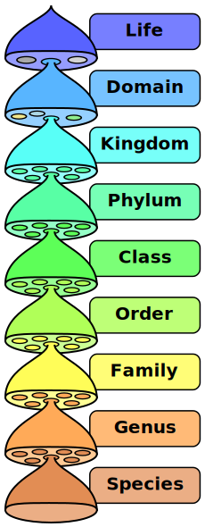

# Taxonomy, Binomial Nomenclature And Systematics

[Taxonomy](https://en.wikipedia.org/wiki/Taxonomy_(biology)) is the identification, naming and classification of organisms. [Binomial nomenclature](https://en.wikipedia.org/wiki/Binomial_nomenclature) is a formal system of naming species of living things by giving each a name composed of two parts. [Systematics](https://en.wikipedia.org/wiki/Systematics) is the branch of science that deals with unique properties of species and groups to recognise, describe name and arrange the diverse organisms according to an organised plan. In biology, phylogenetics (Greek: φυλή, φῦλον – phylé, phylon = tribe, clan, race + γενετικός – genetikós = origin, source, birth) is a part of systematics that addresses the inference of the evolutionary history and relationships among or within groups of organisms (e.g. species, or more inclusive taxa). Classifications are now usually based on phylogenetic data. The degree to which classification depends on inferred evolutionary history differs depending on the school of taxonomy: phenetics ignores phylogenetic speculation altogether, trying to represent the similarity between organisms instead; cladistics (phylogenetic systematics) tries to reflect phylogeny in its classifications by only recognizing groups based on shared, derived characters (synapomorphies); evolutionary taxonomy tries to take into account both the branching pattern and "degree of difference" to find a compromise between them.

Biological classification is a critical component of the taxonomic process. As a result, it informs the user as to what the relatives of the taxon are hypothesized to be. Biological classification uses taxonomic ranks, including among others (in order from most inclusive to least inclusive): Domain, Kingdom, Phylum, Class, Order, Family, Genus, and Species

(ref:classification) [Biological classification.](https://commons.wikimedia.org/wiki/File:Biological_classification_L_Pengo_vflip.svg)

```{r classification, fig.cap='(ref:classification)', echo=FALSE, message=FALSE, warning=FALSE}

```

The "definition" of a taxon is encapsulated by its description or its diagnosis or by both combined. There are no set rules governing the definition of taxa, but the naming and publication of new taxa is governed by sets of rules. In zoology, the nomenclature for the more commonly used ranks (superfamily to subspecies), is regulated by the International Code of Zoological Nomenclature (ICZN Code). In the fields of botany, phycology, and mycology, the naming of taxa is governed by the International Code of Nomenclature for algae, fungi, and plants (ICN).

The initial description of a taxon involves five main requirements:

1.  The taxon must be given a name based on the 26 letters of the Latin alphabet (a binomial for new species, or uninomial for other ranks).
2.  The name must be unique (i.e. not a homonym).
3.  The description must be based on at least one name-bearing type specimen.
4.  It should include statements about appropriate attributes either to describe (define) the taxon or to differentiate it from other taxa (the diagnosis, ICZN Code, Article 13.1.1, ICN, Article 38). Both codes deliberately separate defining the content of a taxon (its circumscription) from defining its name.
5.  These first four requirements must be published in a work that is obtainable in numerous identical copies, as a permanent scientific record.

However, often much more information is included, like the geographic range of the taxon, ecological notes, chemistry, behavior, etc. How researchers arrive at their taxa varies: depending on the available data, and resources, methods vary from simple quantitative or qualitative comparisons of striking features, to elaborate computer analyses of large amounts of DNA sequence data.

An "authority" may be placed after a scientific name. The authority is the name of the scientist or scientists who first validly published the name. For example, in 1758 Linnaeus gave the Asian elephant the scientific name *Elephas maximus*, so the name is sometimes written as "*Elephas maximus* Linnaeus, 1758". The names of authors are frequently abbreviated: the abbreviation L., for Linnaeus, is commonly used. In botany, there is, in fact, a regulated list of standard abbreviations (see list of botanists by author abbreviation). The system for assigning authorities differs slightly between botany and zoology. However, it is standard that if a species' name or placement has been changed since the original description, the original authority's name is placed in parentheses.

(ref:tree) [The tree of life.](https://commons.wikimedia.org/wiki/File:CollapsedtreeLabels-simplified.svg)

```{r tree, fig.cap='(ref:tree)', echo=FALSE, message=FALSE, warning=FALSE}
knitr::include_graphics("./figures/systematics/tree_of_life.svg")
```

## The Concept of Species in Biology

In biology, a species is the basic unit of classification and a taxonomic rank of an organism, as well as a unit of biodiversity. A species is often defined as the largest group of organisms in which any two individuals of the appropriate sexes or mating types can produce fertile offspring, typically by sexual reproduction. Other ways of defining species include their karyotype, DNA sequence, morphology, behaviour or ecological niche. In addition, paleontologists use the concept of the chronospecies since fossil reproduction cannot be examined.

Species were seen from the time of Aristotle until the 18th century as fixed categories that could be arranged in a hierarchy, the great chain of being. In the 19th century, biologists grasped that species could evolve given sufficient time. Charles Darwin's 1859 book On the Origin of Species explained how species could arise by natural selection. That understanding was greatly extended in the 20th century through genetics and population ecology. Genetic variability arises from mutations and recombination, while organisms themselves are mobile, leading to geographical isolation and genetic drift with varying selection pressures. Genes can sometimes be exchanged between species by horizontal gene transfer; new species can arise rapidly through hybridisation and polyploidy; and species may become extinct for a variety of reasons.

Biologists and taxonomists have made many attempts to define species, beginning from morphology and moving towards genetics. Early taxonomists such as Linnaeus had no option but to describe what they saw: this was later formalised as the typological or morphological species concept. [Ernst Mayr](https://en.wikipedia.org/wiki/Ernst_Mayr) proposed the widely used Biological Species Concept of reproductive isolation in 1942. Later biologists have tried to refine Mayr's definition. Many of the concepts are quite similar or overlap, so they are not easy to count: the biologist R. L. Mayden recorded about 24 concepts, and the philosopher of science John Wilkins counted 26. Wilkins further grouped the species concepts into seven basic kinds of concepts: (1) agamospecies for asexual organisms (2) biospecies for reproductively isolated sexual organisms (3) ecospecies based on ecological niches (4) evolutionary species based on lineage (5) genetic species based on gene pool (6) morphospecies based on form or phenotype and (7) taxonomic species, a species as determined by a taxonomist.

A typological species is a group of organisms in which individuals conform to certain fixed properties (a type), so that even pre-literate people often recognise the same taxon as do modern taxonomists. The clusters of variations or phenotypes within specimens (such as longer or shorter tails) would differentiate the species. This method was used as a "classical" method of determining species, such as with Linnaeus early in evolutionary theory. However, different phenotypes are not necessarily different species (e.g. a four-winged Drosophila born to a two-winged mother is not a different species). Species named in this manner are called morphospecies.

A species is given a taxonomic name when a type specimen is described formally, in a publication that assigns it a unique scientific name. The description typically provides means for identifying the new species, differentiating it from other previously described and related or confusable species and provides a validly published name (in botany) or an available name (in zoology) when the paper is accepted for publication. The type material is usually held in a permanent repository, often the research collection of a major museum or university, that allows independent verification and the means to compare specimens. Describers of new species are asked to choose names that, in the words of the International Code of Zoological Nomenclature, are "appropriate, compact, euphonious, memorable, and do not cause offence".

The naming of a particular species, including which genus (and higher taxa) it is placed in, is a hypothesis about the evolutionary relationships and distinguishability of that group of organisms. As further information comes to hand, the hypothesis may be confirmed or refuted. Sometimes, especially in the past when communication was more difficult, taxonomists working in isolation have given two distinct names to individual organisms later identified as the same species. When two named species are discovered to be of the same species, the older species name is given priority and usually retained, and the newer name considered as a junior synonym, a process called synonymisation. Dividing a taxon into multiple, often new, taxa is called splitting. Taxonomists are often referred to as "lumpers" or "splitters" by their colleagues, depending on their personal approach to recognising differences or commonalities between organisms.

(ref:spec) [The butterfly genus Heliconius contains many similar species.](https://commons.wikimedia.org/wiki/File:Heliconius_mimicry.png)

```{r species, fig.cap='(ref:spec)', echo=FALSE, message=FALSE, warning=FALSE}

```

It is difficult to define a species in a way that applies to all organisms. The debate about species delimitation is called the species problem. The problem was recognized even in 1859, when Darwin wrote in On the Origin of Species:

>No one definition has satisfied all naturalists; yet every naturalist knows vaguely what he means when he speaks of a species. Generally the term includes the unknown element of a distinct act of creation.

The evolutionary process by which biological populations evolve to become distinct or reproductively isolated as species is called speciation. Charles Darwin was the first to describe the role of natural selection in speciation in his 1859 book The Origin of Species. Speciation depends on a measure of reproductive isolation, a reduced gene flow. This occurs most easily in allopatric speciation, where populations are separated geographically and can diverge gradually as mutations accumulate. Reproductive isolation is threatened by hybridisation, but this can be selected against once a pair of populations have incompatible alleles of the same gene, as described in the Bateson–Dobzhansky–Muller model. A different mechanism, phyletic speciation, involves one lineage gradually changing over time into a new and distinct form, without increasing the number of resultant species.

## Binomial Nomenclature

The commonly used names for kinds of organisms are often ambiguous: "cat" could mean the domestic cat  or the cat family. Another problem with common names is that they often vary from place to place, so that puma, cougar, catamount, panther, painter and mountain lion all mean *Puma concolor* in various parts of America, while "panther" may also mean the jaguar (*Panthera onca*) of Latin America or the leopard (*Panthera pardus*) of Africa and Asia. In contrast, the scientific names of species are chosen to be unique and universal; they are in two parts used together: the genus as in *Puma*, and the specific epithet as in *concolor*.

Binomial nomenclature ("two-term naming system"), also called binominal nomenclature ("two-name naming system") or binary nomenclature, is a formal system of naming species of living things by giving each a name composed of two parts, both of which use Latin grammatical forms, although they can be based on words from other languages. Such a name is called a binomial name (which may be shortened to just "binomial"), a binomen, binominal name or a scientific name; more informally it is also called a Latin name.

The first part of the name – the generic name – identifies the genus to which the species belongs, while the second part – the specific name or specific epithet – identifies the species within the genus. For example, humans belong to the genus *Homo* and within this genus to the species *Homo sapiens*. *Tyrannosaurus rex* is probably the most widely known binomial. The formal introduction of this system of naming species is credited to Carl Linnaeus, effectively beginning with his work Species Plantarum in 1753. But Gaspard Bauhin, in as early as 1622, had introduced in his book Pinax theatri botanici (English, Illustrated exposition of plants) many names of genera that were later adopted by Linnaeus.

The application of binomial nomenclature is now governed by various internationally agreed codes of rules, of which the two most important are the International Code of Zoological Nomenclature (ICZN) for animals and the International Code of Nomenclature for algae, fungi, and plants (ICNafp). Although the general principles underlying binomial nomenclature are common to these two codes, there are some differences, both in the terminology they use and in their precise rules.

In modern usage, the first letter of the first part of the name, the genus, is always capitalized in writing, while that of the second part is not, even when derived from a proper noun such as the name of a person or place. Similarly, both parts are italicized when a binomial name occurs in normal text (or underlined in handwriting). Thus the binomial name of the annual phlox (named after botanist Thomas Drummond) is now written as *Phlox drummondii*.

In scientific works, the authority for a binomial name is usually given, at least when it is first mentioned, and the date of publication may be specified.

* In zoology
  * "*Patella vulgata* Linnaeus, 1758". The name "Linnaeus" tells the reader who it was that first published a description and name for this species of limpet; 1758 is the date of the publication in which the original description can be found (in this case the 10th edition of the book Systema Naturae).
  * "*Passer domesticus* (Linnaeus, 1758)". The original name given by Linnaeus was *Fringilla domestica*; the parentheses indicate that the species is now considered to belong in a different genus. The ICZN does not require that the name of the person who changed the genus be given, nor the date on which the change was made, although nomenclatorial catalogs usually include such information.
* In botany
  * "*Amaranthus retroflexus* L." – "L." is the standard abbreviation used in botany for "Linnaeus".
  * "*Hyacinthoides italica* (L.) Rothm." – Linnaeus first named this bluebell species Scilla italica; Rothmaler transferred it to the genus *Hyacinthoides*; the ICNafp does not require that the dates of either publication be specified.

Prior to the adoption of the modern binomial system of naming species, a scientific name consisted of a generic name combined with a specific name that was from one to several words long. Together they formed a system of polynomial nomenclature. These names had two separate functions. First, to designate or label the species, and second, to be a diagnosis or description; however these two goals were eventually found to be incompatible. In a simple genus, containing only two species, it was easy to tell them apart with a one-word genus and a one-word specific name; but as more species were discovered, the names necessarily became longer and unwieldy, for instance, *Plantago foliis ovato-lanceolatus pubescentibus, spica cylindrica, scapo tereti* ("plantain with pubescent ovate-lanceolate leaves, a cylindric spike and a terete scape"), which we know today as *Plantago media*.

Such "polynomial names" may sometimes look like binomials, but are significantly different. For example, Gerard's herbal (as amended by Johnson) describes various kinds of spiderwort: "The first is called *Phalangium ramosum*, Branched Spiderwort; the second, *Phalangium non ramosum*, Unbranched Spiderwort. The other ... is aptly termed Phalangium Ephemerum Virginianum, Soon-Fading Spiderwort of Virginia". The Latin phrases are short descriptions, rather than identifying labels.

The Bauhins, in particular [Caspar Bauhin](https://en.wikipedia.org/wiki/Gaspard_Bauhin) (1560–1624), took some important steps towards the binomial system, by pruning the Latin descriptions, in many cases to two words. The adoption by biologists of a system of strictly binomial nomenclature is due to Swedish botanist and physician Carl Linnaeus (1707–1778). It was in Linnaeus's 1753 Species Plantarum that he began consistently using a one-word "trivial name" (nomen triviale) after a generic name (genus name) in a system of binomial nomenclature. Trivial names had already appeared in his Critica Botanica (1737) and Philosophia Botanica (1751). This trivial name is what is now known as a specific epithet (ICNafp) or specific name (ICZN). The Bauhins' genus names were retained in many of these, but the descriptive part was reduced to a single word.

Linnaeus's trivial names introduced an important new idea, namely that the function of a name could simply be to give a species a unique label. This meant that the name no longer need be descriptive; for example both parts could be derived from the names of people. Thus Gerard's *Phalangium ephemerum virginianum* became *Tradescantia virginiana*, where the genus name honoured [John Tradescant the Younger](https://en.wikipedia.org/wiki/John_Tradescant_the_Younger), an English botanist and gardener. A bird in the parrot family was named *Psittacus alexandri*, meaning "Alexander's parrot", after Alexander the Great, whose armies introduced eastern parakeets to Greece. Linnaeus's trivial names were much easier to remember and use than the parallel polynomial names and eventually replaced them.

The value of the binomial nomenclature system derives primarily from its economy, its widespread use, and the uniqueness and stability of names it generally favors:

* Economy. Compared to the polynomial system which it replaced, a binomial name is shorter and easier to remember. It corresponds to the widespread system of family name plus given name(s) used to name people in many cultures.
* Widespread use. The binomial system of nomenclature is governed by international codes and is used by biologists worldwide. A few binomials have also entered common speech, such as *Homo sapiens*, *E. coli*, *Boa constrictor*, and *Tyrannosaurus rex*.
* Uniqueness. Provided that taxonomists agree as to the limits of a species, it can have only one name that is correct under the appropriate nomenclature code, generally the earliest published if two or more names are accidentally assigned to a species. However, establishing that two names actually refer to the same species and then determining which has priority can be difficult, particularly if the species was named by biologists from different countries. Therefore, a species may have more than one regularly used name; all but one of these names are "synonyms".
* Stability. Although stability is far from absolute, the procedures associated with establishing binomial names, such as the principle of priority, tend to favor stability. For example, when species are transferred between genera (as not uncommonly happens as a result of new knowledge), if possible the second part of the binomial is kept the same. Thus there is disagreement among botanists as to whether the genera *Chionodoxa* and *Scilla* are sufficiently different for them to be kept separate. Those who keep them separate give the plant commonly grown in gardens in Europe the name *Chionodoxa siehei*; those who do not give it the name *Scilla siehei*. The siehei element is constant. Similarly if what were previously thought to be two distinct species are demoted to a lower rank, such as subspecies, where possible the second part of the binomial name is retained as the third part of the new name. Thus the Tenerife robin may be treated as a different species from the European robin, in which case its name is *Erithacus superbus*, or as only a subspecies, in which case its name is *Erithacus rubecula superbus*. The superbus element of the name is constant.

Nomenclature (including binomial nomenclature) is not the same as classification, although the two are related. Classification is the ordering of items into groups based on similarities or differences; in biological classification, species are one of the kinds of item to be classified. In principle, the names given to species could be completely independent of their classification. This is not the case for binomial names, since the first part of a binomial is the name of the genus into which the species is placed. Above the rank of genus, binomial nomenclature and classification are partly independent; for example, a species retains its binomial name if it is moved from one family to another or from one order to another, unless it better fits a different genus in the same or different family, or it is split from its old genus and placed in a newly created genus. The independence is only partial since the names of families and other higher taxa are usually based on genera.

Taxonomy includes both nomenclature and classification. Its first stages (sometimes called "alpha taxonomy") are concerned with finding, describing and naming species of living or fossil organisms. Binomial nomenclature is thus an important part of taxonomy as it is the system by which species are named. Taxonomists are also concerned with classification, including its principles, procedures and rules.

A complete binomial name is always treated grammatically as if it were a phrase in the Latin language (hence the common use of the term "Latin name" for a binomial name). However, the two parts of a binomial name can each be derived from a number of sources, of which Latin is only one. These include:

* Latin, either classical or medieval. Thus, both parts of the binomial name *Homo sapiens* are Latin words, meaning "wise" (sapiens) "human/man" (Homo).
* Classical Greek. The genus *Rhododendron* was named by Linnaeus from the Greek word ῥοδόδενδρον, itself derived from rhodon, "rose", and dendron, "tree". Greek words are often converted to a Latinized form. Thus coca (the plant from which cocaine is obtained) has the name *Erythroxylum coca*. *Erythroxylum* is derived from the Greek words erythros, red, and xylon, wood. The Greek neuter ending -ον (-on) is often converted to the Latin neuter ending -um.
* Other languages. The second part of the name *Erythroxylum coca* is derived from kuka, the name of the plant in Aymara and Quechua. Since many dinosaur fossils were found in Mongolia, their names often use Mongolian words, e.g. Tarchia from tarkhi, meaning "brain", or Saichania meaning "beautiful one".
* Names of people (often naturalists or biologists). The name *Magnolia campbellii* commemorates two people: [Pierre Magnol](https://en.wikipedia.org/wiki/Pierre_Magnol), a French botanist, and [Archibald Campbell](https://en.wikipedia.org/wiki/Archibald_Campbell_(doctor)), a doctor in British India.
* Names of places. The lone star tick, *Amblyomma americanum*, is widespread in the United States.
* Other sources. Some binominal names have been constructed from taxonomic anagrams or other re-orderings of existing names. Thus the name of the genus *Muilla* is derived by reversing the name *Allium*. Names may also be derived from jokes or puns. For example, Ratcliffe described a number of species of rhinoceros beetle, including *Cyclocephala nodanotherwon*.

The first part of the name, which identifies the genus, must be a word which can be treated as a Latin singular noun in the nominative case. It must be unique within each kingdom, but can be repeated between kingdoms. Thus *Huia recurvata* is an extinct species of plant, found as fossils in Yunnan, China, whereas *Huia masonii* is a species of frog found in Java, Indonesia.

The second part of the name, which identifies the species within the genus, is also treated grammatically as a Latin word. It can have one of a number of forms:

* The second part of a binomial may be an adjective. The adjective must agree with the genus name in gender. Latin has three genders, masculine, feminine and neuter, shown by varying endings to nouns and adjectives. The house sparrow has the binomial name *Passer domesticus*. Here domesticus ("domestic") simply means "associated with the house". The sacred bamboo is *Nandina domestica* rather than Nandina domesticus, since Nandina is feminine whereas Passer is masculine. The tropical fruit langsat is a product of the plant *Lansium parasiticum*, since Lansium is neuter. Some common endings for Latin adjectives in the three genders (masculine, feminine, neuter) are -us, -a, -um (as in the previous example of domesticus); -is, -is, -e (e.g. tristis, meaning "sad"); and -or, -or, -us (e.g. minor, meaning "smaller"). For further information, see Latin declension: Adjectives.
* The second part of a binomial may be a noun in the nominative case. An example is the binomial name of the lion, which is *Panthera leo*. Grammatically the noun is said to be in apposition to the genus name and the two nouns do not have to agree in gender; in this case, Panthera is feminine and leo is masculine.
The second part of a binomial may be a noun in the genitive (possessive) case. The genitive case is constructed in a number of ways in Latin, depending on the declension of the noun. Common endings for masculine and neuter nouns are -ii or -i in the singular and -orum in the plural, and for feminine nouns -ae in the singular and -arum in the plural. The noun may be part of a person's name, often the surname, as in the Tibetan antelope (*Pantholops hodgsonii*), the shrub *Magnolia hodgsonii*, or the olive-backed pipit (*Anthus hodgsoni*). The meaning is "of the person named", so that *Magnolia hodgsonii* means "Hodgson's magnolia". The -ii or -i endings show that in each case Hodgson was a man (not the same one); had Hodgson been a woman, hodgsonae would have been used. The person commemorated in the binomial name is not usually (if ever) the person who created the name; for example *Anthus hodgsoni* was named by Charles Wallace Richmond, in honour of Hodgson. Rather than a person, the noun may be related to a place, as with *Latimeria chalumnae*, meaning "of the Chalumna River". Another use of genitive nouns is in, for example, the name of the bacterium *Escherichia coli*, where coli means "of the colon". This formation is common in parasites, as in *Xenos vesparum*, where vesparum means "of the wasps", since Xenos vesparum is a parasite of wasps.

Whereas the first part of a binomial name must be unique within a kingdom, the second part is quite commonly used in two or more genera (as is shown by examples of hodgsonii above). The full binomial name must be unique within a kingdom

## Taxonomy And Systematics

[Taxonomy](https://en.wikipedia.org/wiki/Taxonomy_(biology)) (from Ancient Greek taxis, meaning 'arrangement', and nomia, meaning 'method') is the science of defining and naming groups of biological organisms on the basis of shared characteristics. Organisms are grouped together into taxa (singular: taxon) and these groups are given a taxonomic rank; groups of a given rank can be aggregated to form a super-group of higher rank, thus creating a taxonomic hierarchy. The principal ranks in modern use are domain, kingdom, phylum (division is sometimes used in botany in place of phylum), class, order, family, genus and species. The Swedish botanist [Carl Linnaeus](https://en.wikipedia.org/wiki/Carl_Linnaeus) (1707–1778) is regarded as the father of taxonomy, as he developed a system known as Linnaean taxonomy for categorization of organisms and binomial nomenclature for naming organisms. With the advent of such fields of study as phylogenetics, cladistics, and systematics, the Linnaean system has progressed to a system of modern biological classification based on the evolutionary relationships between organisms, both living and extinct.

Systematics is the branch of science that deals with unique properties of species and groups to recognise, describe name and arrange the diverse organisms according to an organised plan. The word systematics is derived from Latin word systema which means systematic arrangement of organisms.linneous used 'systema naturae' as the title of his book.

The term "taxonomy" was coined by [Augustin Pyramus de Candolle](https://en.wikipedia.org/wiki/Augustin_Pyramus_de_Candolle) while the term "systematic" was coined by Carl Linnaeus the father of taxonomy.

Biological systematics is the study of the diversification of living forms, both past and present, and the relationships among living things through time. Relationships are visualized as evolutionary trees (synonyms: cladograms, phylogenetic trees, phylogenies). Phylogenies have two components: branching order (showing group relationships) and branch length (showing amount of evolution). Phylogenetic trees of species and higher taxa are used to study the evolution of traits (e.g., anatomical or molecular characteristics) and the distribution of organisms (biogeography). Systematics, in other words, is used to understand the evolutionary history of life on Earth.

Biological systematics classifies species by using three specific branches. Numerical systematics, or biometry, uses biological statistics to identify and classify animals. Biochemical systematics classifies and identifies animals based on the analysis of the material that makes up the living part of a cell—such as the nucleus, organelles, and cytoplasm. Experimental systematics identifies and classifies animals based on the evolutionary units that comprise a species, as well as their importance in evolution itself. Factors such as mutations, genetic divergence, and hybridization all are considered evolutionary units.

With the specific branches, researchers are able to determine the applications and uses for modern-day systematics. These applications include:

* Studying the diversity of organisms and the differentiation between extinct and living creatures. Biologists study the well-understood relationships by making many different diagrams and "trees" (cladograms, phylogenetic trees, phylogenies, etc.).
* Including the scientific names of organisms, species descriptions and overviews, taxonomic orders, and classifications of evolutionary and organism histories.
* Explaining the biodiversity of the planet and its organisms. The systematic study is that of conservation.
* Manipulating and controlling the natural world. This includes the practice of 'biological control', the intentional introduction of natural predators and disease.

Linnaeus ushered in a new era of taxonomy. With his major works Systema Naturae 1st Edition in 1735, Species Plantarum in 1753, and Systema Naturae 10th Edition, he revolutionized modern taxonomy. His works implemented a standardized binomial naming system for animal and plant species, which proved to be an elegant solution to a chaotic and disorganized taxonomic literature. He not only introduced the standard of class, order, genus, and species, but also made it possible to identify plants and animals from his book, by using the smaller parts of the flower. Thus, the Linnaean system was born, and is still used in essentially the same way today as it was in the 18th century. Currently, plant and animal taxonomists regard Linnaeus' work as the "starting point" for valid names (at 1753 and 1758 respectively). Names published before these dates are referred to as "pre-Linnaean", and not considered valid (with the exception of spiders published in Svenska Spindlar). Even taxonomic names published by Linnaeus himself before these dates are considered pre-Linnaean.

Whereas Linnaeus classified for ease of identification, the idea of the Linnaean taxonomy as translating into a sort of dendrogram of the Animal- and Plant Kingdoms was formulated toward the end of the 18th century, well before On the Origin of Species was published. Among early works exploring the idea of a transmutation of species were [Erasmus Darwin's](https://en.wikipedia.org/wiki/Erasmus_Darwin) 1796 Zoönomia and [Jean-Baptiste Lamarck's](https://en.wikipedia.org/wiki/Jean-Baptiste_Lamarck) Philosophie Zoologique of 1809. The idea was popularized in the Anglophone world by the speculative but widely read [Vestiges of the Natural History of Creation](https://en.wikipedia.org/wiki/Vestiges_of_the_Natural_History_of_Creation), published anonymously by [Robert Chambers](https://en.wikipedia.org/wiki/Robert_Chambers_(publisher,_born_1802)) in 1844.

With Darwin's theory, a general acceptance quickly appeared that a classification should reflect the Darwinian principle of common descent. Tree of life representations became popular in scientific works, with known fossil groups incorporated. One of the first modern groups tied to fossil ancestors was birds. Using the then newly discovered fossils of Archaeopteryx and Hesperornis, Thomas Henry Huxley pronounced that they had evolved from dinosaurs, a group formally named by [Richard Owen](https://en.wikipedia.org/wiki/Richard_Owen) in 1842. The resulting description, that of dinosaurs "giving rise to" or being "the ancestors of" birds, is the essential hallmark of evolutionary taxonomic thinking. As more and more fossil groups were found and recognized in the late 19th and early 20th centuries, paleontologists worked to understand the history of animals through the ages by linking together known groups. With the modern evolutionary synthesis of the early 1940s, an essentially modern understanding of the evolution of the major groups was in place.

The cladistic method has emerged since the 1960s. In 1958, [Julian Huxley](https://en.wikipedia.org/wiki/Julian_Huxley) used the term clade. Later, in 1960, Cain and Harrison introduced the term cladistic. The salient feature is arranging taxa in a hierarchical evolutionary tree, ignoring ranks. A taxon is called monophyletic, if it includes all the descendants of an ancestral form. Groups that have descendant groups removed from them (e.g. dinosaurs, with birds as offspring group) are termed paraphyletic, while groups representing more than one branch from the tree of life are called polyphyletic. The International Code of Phylogenetic Nomenclature or PhyloCode is intended to regulate the formal naming of clades. Linnaean ranks will be optional under the PhyloCode, which is intended to coexist with the current, rank-based codes.

## Kingdoms And Domains

Well before Linnaeus, plants and animals were considered separate Kingdoms. Linnaeus used this as the top rank, dividing the physical world into the plant, animal and mineral kingdoms. As advances in microscopy made classification of microorganisms possible, the number of kingdoms increased, five and six-kingdom systems being the most common.

When Carl Linnaeus introduced the rank-based system of nomenclature into biology in 1735, the highest rank was given the name "kingdom" and was followed by four other main or principal ranks: class, order, genus and species. Later two further main ranks were introduced, making the sequence kingdom, phylum or division, class, order, family, genus and species. In 1990, the rank of domain was introduced above kingdom.

Prefixes can be added so subkingdom (subregnum) and infrakingdom (also known as infraregnum) are the two ranks immediately below kingdom. Superkingdom may be considered as an equivalent of domain or empire or as an independent rank between kingdom and domain or subdomain. In some classification systems the additional rank branch (Latin: ramus) can be inserted between subkingdom and infrakingdom, e.g., Protostomia and Deuterostomia in the classification of Cavalier-Smith.

Some recent classifications based on modern cladistics have explicitly abandoned the term "kingdom", noting that the traditional kingdoms are not monophyletic, i.e., do not consist of all the descendants of a common ancestor.

By tradition, the binomial names of species are usually typeset in italics; for example, *Homo sapiens*. Generally, the binomial should be printed in a font style different from that used in the normal text; for example, "Several more *Homo sapiens* fossils were discovered." When handwritten, a binomial name should be underlined; for example, *Homo sapiens*.

The first part of the binomial, the genus name, is always written with an initial capital letter. In current usage, the second part is never written with an initial capital. Older sources, particularly botanical works published before the 1950s, use a different convention. If the second part of the name is derived from a proper noun, e.g. the name of a person or place, a capital letter was used. Thus the modern form Berberis darwinii was written as Berberis Darwinii. A capital was also used when the name is formed by two nouns in apposition, e.g. *Panthera Leo* or *Centaurea Cyanus*.

When used with a common name, the scientific name often follows in parentheses, although this varies with publication. For example, "The house sparrow (*Passer domesticus*) is decreasing in Europe."

The binomial name should generally be written in full. The exception to this is when several species from the same genus are being listed or discussed in the same paper or report, or the same species is mentioned repeatedly; in which case the genus is written in full when it is first used, but may then be abbreviated to an initial (and a period/full stop). For example, a list of members of the genus Canis might be written as "Canis lupus, C. aureus, C. simensis". In rare cases, this abbreviated form has spread to more general use; for example, the bacterium Escherichia coli is often referred to as just E. coli, and Tyrannosaurus rex is perhaps even better known simply as T. rex, these two both often appearing in this form in popular writing even where the full genus name has not already been given.

### The Three-Domain System

The three-domain system is a biological classification first proposed in 1977 by [Carl Woese's](https://en.wikipedia.org/wiki/Carl_Woese) that divides cellular life forms into [Archaea](https://en.wikipedia.org/wiki/Archaea), [Bacteria](https://en.wikipedia.org/wiki/Bacteria) and [Eukaryota](https://en.wikipedia.org/wiki/Eukaryote). The key difference from earlier classifications is the splitting of archaea and bacteria, previously grouped into the single kingdom Bacteria (a kingdom also sometimes called Monera).

The three-domain system adds a level of classification (the domains) "above" the kingdoms present in the previously used five- or six-kingdom systems. This classification system recognizes the fundamental divide between the two prokaryotic groups, insofar as Archaea appear to be more closely related to Eukaryotes than they are to other prokaryotes – bacteria-like organisms with no cell nucleus. The current system sorts the previously known kingdoms into these three domains: Archaea, Bacteria, and Eukarya.

Woese argued, on the basis of differences in 16S rRNA genes, that bacteria, archaea, and eukaryotes each arose separately from an ancestor with poorly developed genetic machinery, often called a progenote. To reflect these primary lines of descent, he treated each as a domain, divided into several different kingdoms. Originally his split of the prokaryotes was into Eubacteria (now Bacteria) and Archaebacteria (now Archaea). Woese initially used the term "kingdom" to refer to the three primary phylogenic groupings, and this nomenclature was widely used until the term "domain" was adopted in 1990.

Acceptance of the validity of Woese's phylogenetically valid classification was a slow process. Prominent biologists including Salvador Luria and Ernst Mayr objected to his division of the prokaryotes. Not all criticism of him was restricted to the scientific level. A decade of labor-intensive oligonucleotide cataloging left him with a reputation as "a crank," and Woese would go on to be dubbed as "Microbiology's Scarred Revolutionary" by a news article printed in the journal Science. The growing amount of supporting data led the scientific community to accept the Archaea by the mid-1980s. Today, few scientists cling to the idea of a unified Prokarya.

## Cladistics

[Cladistics](https://en.wikipedia.org/wiki/Cladistics) (from Greek κλάδος, kládos, "branch") is an approach to biological classification in which organisms are categorized based on shared derived characteristics that can be traced to a group's most recent common ancestor and are not present in more distant ancestors. Therefore, members of a group are assumed to share a common history and are considered to be closely related.


The original methods used in cladistic analysis and the school of taxonomy derived from the work of the German entomologist [Willi Hennig](https://en.wikipedia.org/wiki/Willi_Hennig), who referred to it as phylogenetic systematics (also the title of his 1966 book); the terms "cladistics" and "clade" were popularized by other researchers. Cladistics in the original sense refers to a particular set of methods used in phylogenetic analysis, although it is now sometimes used to refer to the whole field.

The following terms, coined by Hennig, are used to identify shared or distinct character states among groups of organisms:

*   A **plesiomorphy** ("close form") or ancestral state is a character state that a taxon has retained from its ancestors. When two or more taxa that are not nested within each other share a plesiomorphy, it is a symplesiomorphy (from syn-, "together"). Symplesiomorphies do not mean that the taxa that exhibit that character state are necessarily closely related. For example, Reptilia is traditionally characterized by (among other things) being cold-blooded (i.e., not maintaining a constant high body temperature), whereas birds are warm-blooded. Since cold-bloodedness is a plesiomorphy, inherited from the common ancestor of traditional reptiles and birds, and thus a symplesiomorphy of turtles, snakes and crocodiles (among others), it does not mean that turtles, snakes and crocodiles form a clade that excludes the birds.

*   An **apomorphy** ("separate form") or derived state is an innovation. It can thus be used to diagnose a clade – or even to help define a clade name in phylogenetic nomenclature. Features that are derived in individual taxa (a single species or a group that is represented by a single terminal in a given phylogenetic analysis) are called autapomorphies (from auto-, "self"). Autapomorphies express nothing about relationships among groups; clades are identified (or defined) by synapomorphies (from syn-, "together"). For example, the possession of digits that are homologous with those of *Homo sapiens* is a synapomorphy within the vertebrates. The tetrapods can be singled out as consisting of the first vertebrate with such digits homologous to those of *Homo sapiens* together with all descendants of this vertebrate (an apomorphy-based phylogenetic definition). Importantly, snakes and other tetrapods that do not have digits are nonetheless tetrapods: other characters, such as amniotic eggs and diapsid skulls, indicate that they descended from ancestors that possessed digits which are homologous with ours.

*   A **character state** is homoplastic or "an instance of homoplasy" if it is shared by two or more organisms but is absent from their common ancestor or from a later ancestor in the lineage leading to one of the organisms. It is therefore inferred to have evolved by convergence or reversal. Both mammals and birds are able to maintain a high constant body temperature (i.e., they are warm-blooded). However, the accepted cladogram explaining their significant features indicates that their common ancestor is in a group lacking this character state, so the state must have evolved independently in the two clades. Warm-bloodedness is separately a synapomorphy of mammals (or a larger clade) and of birds (or a larger clade), but it is not a synapomorphy of any group including both these clades. Hennig's Auxiliary Principle states that shared character states should be considered evidence of grouping unless they are contradicted by the weight of other evidence; thus, homoplasy of some feature among members of a group may only be inferred after a phylogenetic hypothesis for that group has been established.

The terms plesiomorphy and apomorphy are relative; their application depends on the position of a group within a tree. For example, when trying to decide whether the tetrapods form a clade, an important question is whether having four limbs is a synapomorphy of the earliest taxa to be included within Tetrapoda: did all the earliest members of the Tetrapoda inherit four limbs from a common ancestor, whereas all other vertebrates did not, or at least not homologously? By contrast, for a group within the tetrapods, such as birds, having four limbs is a plesiomorphy. Using these two terms allows a greater precision in the discussion of homology, in particular allowing clear expression of the hierarchical relationships among different homologous features.

It can be difficult to decide whether a character state is in fact the same and thus can be classified as a synapomorphy, which may identify a monophyletic group, or whether it only appears to be the same and is thus a homoplasy, which cannot identify such a group. There is a danger of circular reasoning: assumptions about the shape of a phylogenetic tree are used to justify decisions about character states, which are then used as evidence for the shape of the tree. Phylogenetics uses various forms of parsimony to decide such questions; the conclusions reached often depend on the dataset and the methods. Such is the nature of empirical science, and for this reason, most cladists refer to their cladograms as hypotheses of relationship. Cladograms that are supported by a large number and variety of different kinds of characters are viewed as more robust than those based on more limited evidence.

From the late-20th century onwards, cladistics superseded phenetics. Phenetics was an attempt to determine the relationships of organisms through a measure of overall similarity, making no distinction between plesiomorphies (shared ancestral traits) and apomorphies (derived traits). 

A [monophyletic](https://en.wikipedia.org/wiki/Monophyly) group is a group of organisms that forms a clade, which consists of all the descendants of a common ancestor. Monophyletic groups are typically characterized by shared derived characteristics (synapomorphies), which distinguish organisms in the clade from other organisms. The arrangement of the members of a monophyletic group is called a monophyly.

A group is [paraphyletic](https://en.wikipedia.org/wiki/Paraphyly) if it consists of the group's last common ancestor and all descendants of that ancestor excluding a few—typically only one or two—monophyletic subgroups. The group is said to be paraphyletic with respect to the excluded subgroups. The arrangement of the members of a paraphyletic group is called a paraphyly.

A [polyphyletic](https://en.wikipedia.org/wiki/Polyphyly) (Greek for "of many races") group is a set of organisms, or other evolving elements, that have been grouped together but do not share an immediate common ancestor. The term is often applied to groups that share characteristics that appear to be similar but have not been inherited from common ancestors; these characteristics are known as homoplasies, and the development and phenomenon of homoplasies is known as convergent evolution. The arrangement of the members of a polyphyletic group is called a polyphyly.

A cladogram (from Greek clados "branch" and gramma "character") is a diagram used in cladistics to show relations among organisms. A cladogram is not, however, an evolutionary tree because it does not show how ancestors are related to descendants, nor does it show how much they have changed; nevertheless, many evolutionary trees can be inferred from a single cladogram. A cladogram uses lines that branch off in different directions ending at a clade, a group of organisms with a last common ancestor. There are many shapes of cladograms but they all have lines that branch off from other lines. The lines can be traced back to where they branch off. These branching off points represent a hypothetical ancestor (not an actual entity) which can be inferred to exhibit the traits shared among the terminal taxa above it. This hypothetical ancestor might then provide clues about the order of evolution of various features, adaptation, and other evolutionary narratives about ancestors. Although traditionally such cladograms were generated largely on the basis of morphological characters, DNA and RNA sequencing data and computational phylogenetics are now very commonly used in the generation of cladograms, either on their own or in combination with morphology.

The characteristics used to create a cladogram can be roughly categorized as either morphological (synapsid skull, warm blooded, notochord, unicellular, etc.) or molecular (DNA, RNA, or other genetic information). Prior to the advent of DNA sequencing, cladistic analysis primarily used morphological data. Behavioral data (for animals) may also be used.

As DNA sequencing has become cheaper and easier, molecular systematics has become a more and more popular way to infer phylogenetic hypotheses. Using a parsimony criterion is only one of several methods to infer a phylogeny from molecular data. Approaches such as maximum likelihood, which incorporate explicit models of sequence evolution, are non-Hennigian ways to evaluate sequence data. Another powerful method of reconstructing phylogenies is the use of genomic retrotransposon markers, which are thought to be less prone to the problem of reversion that plagues sequence data. They are also generally assumed to have a low incidence of homoplasies because it was once thought that their integration into the genome was entirely random; this seems at least sometimes not to be the case, however.

Researchers must decide which character states are "ancestral" (plesiomorphies) and which are derived (synapomorphies), because only synapomorphic character states provide evidence of grouping. This determination is usually done by comparison to the character states of one or more outgroups. States shared between the outgroup and some members of the in-group are symplesiomorphies; states that are present only in a subset of the in-group are synapomorphies. Note that character states unique to a single terminal (autapomorphies) do not provide evidence of grouping. The choice of an outgroup is a crucial step in cladistic analysis because different outgroups can produce trees with profoundly different topologies.

A homoplasy is a character state that is shared by two or more taxa due to some cause other than common ancestry. The two main types of homoplasy are convergence (evolution of the "same" character in at least two distinct lineages) and reversion (the return to an ancestral character state). Characters that are obviously homoplastic, such as white fur in different lineages of Arctic mammals, should not be included as a character in a phylogenetic analysis as they do not contribute anything to our understanding of relationships. However, homoplasy is often not evident from inspection of the character itself (as in DNA sequence, for example), and is then detected by its incongruence (unparsimonious distribution) on a most-parsimonious cladogram. Note that characters that are homoplastic may still contain phylogenetic signal.

A well-known example of homoplasy due to convergent evolution would be the character, "presence of wings". Although the wings of birds, bats, and insects serve the same function, each evolved independently, as can be seen by their anatomy. If a bird, bat, and a winged insect were scored for the character, "presence of wings", a homoplasy would be introduced into the dataset, and this could potentially confound the analysis, possibly resulting in a false hypothesis of relationships. Of course, the only reason a homoplasy is recognizable in the first place is because there are other characters that imply a pattern of relationships that reveal its homoplastic distribution.

The cladogram shown in Figure \@ref(fig:cladogram) represents the current universally accepted hypothesis that all primates, including strepsirrhines like the lemurs and lorises, had a common ancestor all of whose descendants were primates, and so form a clade; the name Primates is therefore recognized for this clade. Within the primates, all anthropoids (monkeys, apes and humans) are hypothesized to have had a common ancestor all of whose descendants were anthropoids, so they form the clade called Anthropoidea. The "prosimians", on the other hand, form a paraphyletic taxon. The name Prosimii is not used in phylogenetic nomenclature, which names only clades; the "prosimians" are instead divided between the clades Strepsirhini and Haplorhini, where the latter contains Tarsiiformes and Anthropoidea.

(ref:clado) [Cladogram of the primates](https://commons.wikimedia.org/wiki/File:Monophyly,_paraphyly,_polyphyly.png) showing a monophyletic taxon (a clade: the simians or Anthropoidea, in yellow), a paraphyletic taxon (the prosimians, in blue, including the red patch), and a polyphyletic taxon (the nocturnal primates – the lorises and the tarsiers – in red)]

```{r cladogram, fig.cap='(ref:clado)', echo=FALSE, message=FALSE, warning=FALSE}
knitr::include_graphics("./figures/systematics/Monophyly,_paraphyly,_polyphyly.png")
```
